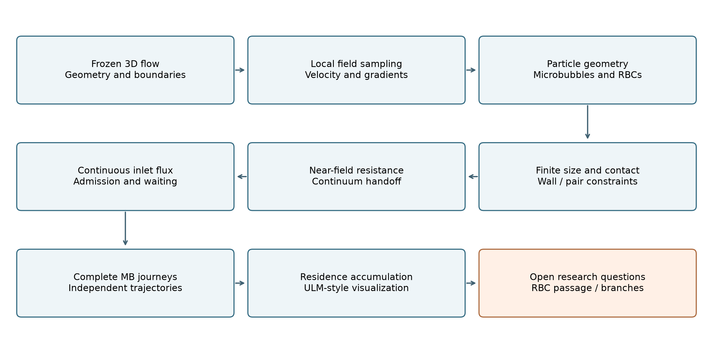
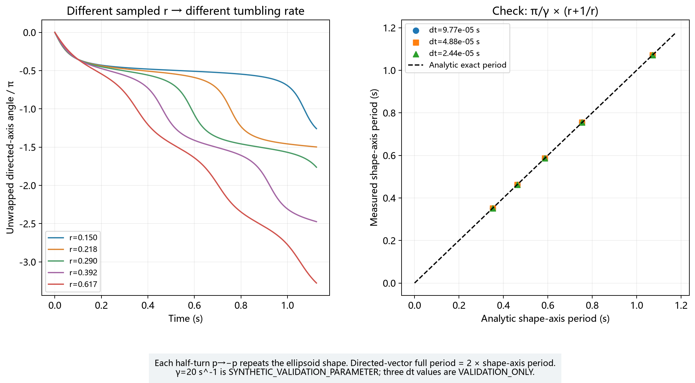
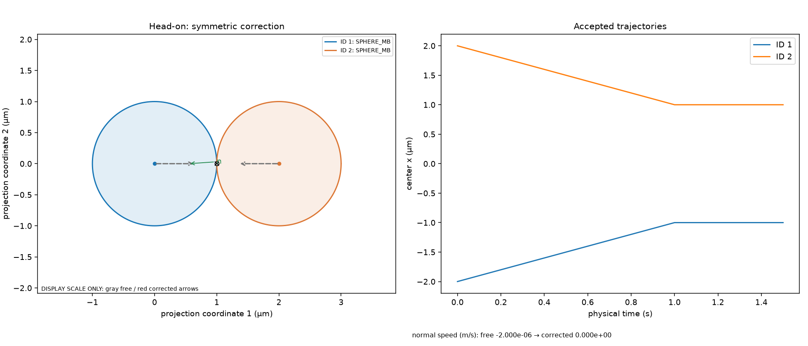
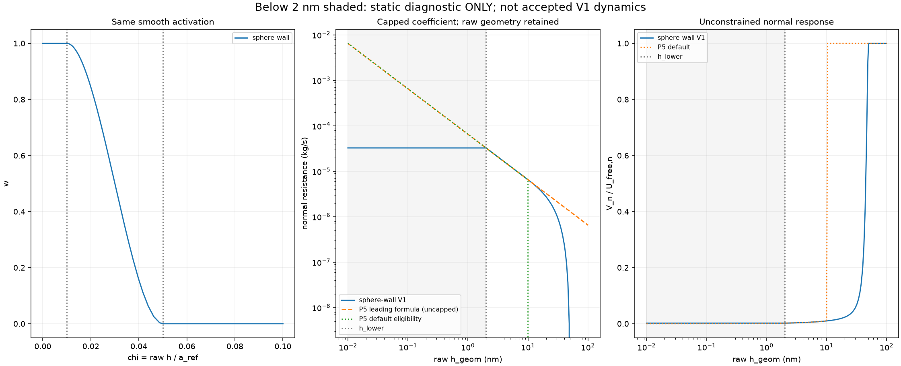
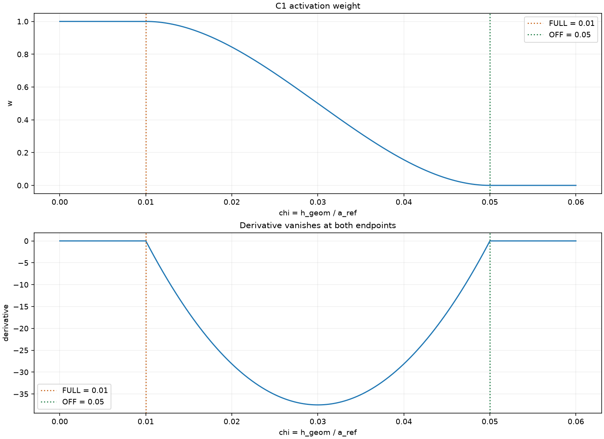
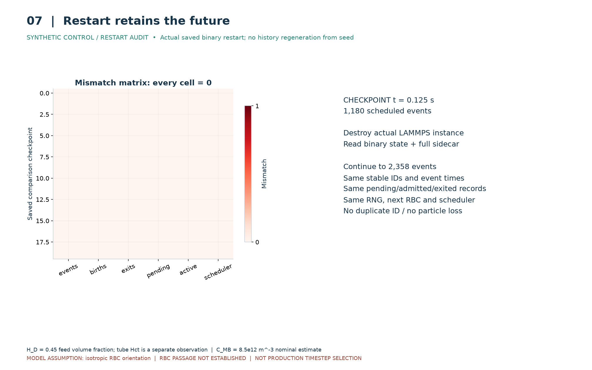
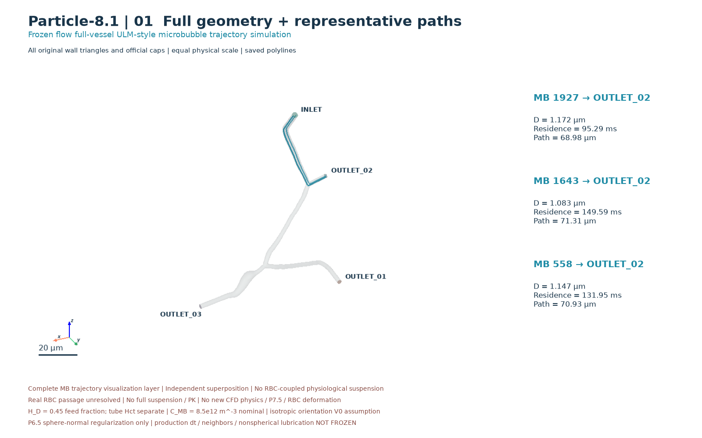
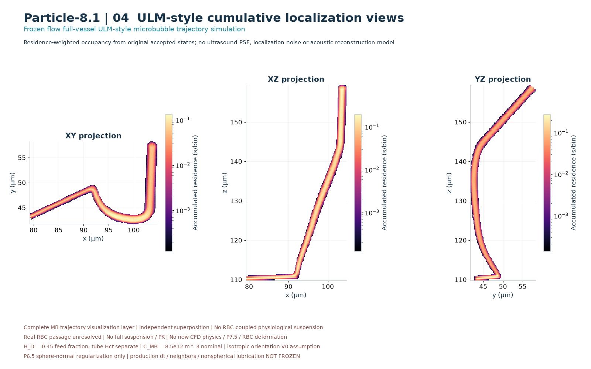
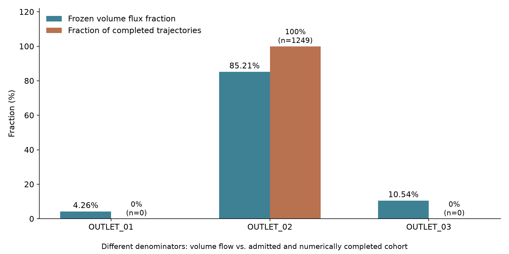

# 基于冻结三维血流场的微泡输运模型构建及 ULM 风格轨迹模拟

## 摘要

微泡如何穿行于弯曲、分叉且尺度受限的微血管，是建立可解释超声定位显微成像仿真数据的基础问题。本研究以既有三维微血管有限元血流结果为背景，依次建立任意位置的局部流场查询、微泡随流运动、红细胞统计几何与姿态、有限尺寸壁面及粒子接触、球形颗粒法向近场润滑、连续介质下限约束、通量驱动的连续入口，以及完整微泡轨迹的累计表示。验证分别采用具有已知答案的人工算例与项目真实三维冻结几何，避免将算法正确性等同于生理真实性。

现有完整轨迹队列包含 2200 个计划出生微泡，其中 1969 个通过有限尺寸入场检查，1249 个完成入口至正式出口的运动；完成轨迹全部经过第二出口。已完成样本的停留时间中位数约为 95.3 ms，轨迹长度中位数约为 69.7 µm。该结果建立了真实三维冻结血流背景下大量独立微泡完整路径的计算与可视化基础，但尚未建立完整网络分支覆盖、真实红细胞连续通行、红细胞与微泡耦合悬浮液，以及超声声学成像。近场模型的间隙安全性已有验证，交接事件时刻与总体完成率的时间步收敛仍未确立。本文据此总结已完成的方法与阶段性结果，并明确其适用边界。

关键词：三维微血管；微泡输运；冻结血流；有限尺寸接触；近场润滑；超声定位显微成像。

## 1 研究背景与整体建模思路

常规超声成像的空间分辨率受到声波衍射限制。超声定位显微成像（ultrasound localization microscopy，ULM）利用微泡产生的局部回波，估计单个微泡的位置，并在时间上积累这些位置及运动信息，以描绘比常规超声图像更细的微血管结构。这里的关键并非让一帧图像直接显示全部细节，而是让多个时刻经过不同位置的微泡共同提供空间信息。[Errico 等的原始研究](https://www.nature.com/articles/nature16066)展示了这一定位与积累思路。

若希望构建可控且可解释的三维仿真数据，首先需要确定微泡在血管中的运动，再讨论这些运动如何转化为图像。仅画出沿血管走向的曲线不足以回答这个问题：路径必须来自局部血流，粒子不能任意穿墙，其尺寸、出生时刻与终止原因也必须保留。红细胞（red blood cell，RBC）的存在又引入非球形几何、姿态与狭窄通行问题。因此，本研究采用逐层构建的方法，先验证每层新增假设，再判断它能否支持更复杂的问题。

本文将证据分为三类：其一是项目真实三维冻结血管上的计算结果；其二是均匀流、解析剪切、人工平面墙和人工开放通道等验证算例；其三是现有结果尚不能回答的研究问题。“真实三维”在此指实际使用的冻结血管几何与有限元场，不表示每一项粒子预测都已经得到活体实验验证。图 1 概括科学路线，其中最后一层是待研究范围。

图 1 从冻结血流到完整微泡轨迹累积的研究路线。先建立局部运动信息和有限尺寸约束，再处理近场阻力与连续入口；红细胞通行及多出口覆盖作为仍需独立验证的问题保留。箭头表示研究依赖，不表示所有物理层已在同一真实悬浮液中完成耦合。

上述路线将“能够计算”和“能够作出生理解释”分开考察。下文首先说明流场基础，再逐步讨论几何、运动、人口注入及其共同构成的轨迹结果。

## 2 三维微血管与冻结血流场

研究血管具有一个入口、三个开放出口和一组实体壁面。有限元法（finite element method，FEM）将连续空间划分为小单元，并用节点上的数值近似描述单元内物理量。本项目冻结网格包含 70,363 个节点、371,402 个四面体；壁面包含 45,221 个三角形。入口和出口端盖用于识别穿越事件，不能当作封闭固体墙。

“冻结血流”表示粒子运动时读取已经计算好的速度和压力，粒子不反向改变该血流。可将其理解为先确定一条三维流动的河流，再研究其中示踪物的路径。这是单向耦合近似；它减少了研究变量，却不能描述红细胞群体对血流的反馈。

为检查边界流量的关系，对每个开放截面计算体积通量：

$$
Q_{\Gamma}=\int_{\Gamma}\mathbf{u}\cdot\mathbf{n}_{\Gamma}\,\mathrm{d}A . \tag{1}
$$

其中，$Q_{\Gamma}$ 为通过截面 $\Gamma$ 的体积流量，单位为 m³/s；$\mathbf{u}$ 为局部流体速度，单位为 m/s；$\mathbf{n}_{\Gamma}$ 为无量纲单位法向；$\mathrm{d}A$ 为面积元，单位为 m²。本文入口法向指向血管内部、出口法向指向外部，因而正常流动的入口流量 $Q_{\mathrm{in}}$ 与出口流量 $Q_j$ 均为正值，$j$ 表示出口编号。

该式表示将每个小面积上垂直穿过截面的流速加总，得到单位时间通过的液体体积。在本研究中，它既用于检查入口与出口总流量是否相符，也为后续粒子出生速率提供独立于粒子轨迹的尺度。

| 边界    |       体积流量（m³/s） | 相对入口流量 |
| ------- | ----------------------: | -----------: |
| 入口    | $2.737\times10^{-15}$ |         100% |
| 出口 01 | $1.165\times10^{-16}$ |        4.26% |
| 出口 02 | $2.332\times10^{-15}$ |       85.21% |
| 出口 03 | $2.884\times10^{-16}$ |       10.54% |

表内比例经过四舍五入，其和可能略偏离 100%。未舍入数据的入口减出口相对残差约为 $-1.44\times10^{-16}$。这说明所采用边界积分满足整体流量平衡；它不单独证明每个四面体内的插值速度都严格满足局部不可压缩条件，也不代替通过加密网格检查结果是否稳定的网格收敛研究。冻结场对应的动力黏度约为 $3.453\times10^{-3}$ Pa·s，后续阻力模型沿用这一值。

图 2 冻结三维血管及入口、三个出口和壁面。读图时应先辨认开放端盖与实体壁面的区别，再观察分叉走向；整棵几何的可见性仅说明显示范围完整，并不代表粒子轨迹已经覆盖所有分支。

本节确立了共同的几何、流量和黏度基础。后续比较保持这一背景不变，使新增粒子模型的影响能够与流场变化区分。

## 3 任意三维位置的流场查询

微泡中心通常位于有限元节点之间。若总是采用最近节点的速度，粒子越过节点分区时可能出现不合理跳变。因此，研究在包含查询点的四面体中采用线性形函数插值：

$$
\begin{aligned}
\mathbf{u}(\mathbf{x})&=\sum_{i=1}^{4}N_i(\mathbf{x})\mathbf{u}_i,\\
p(\mathbf{x})&=\sum_{i=1}^{4}N_i(\mathbf{x})p_i,\qquad \sum_{i=1}^{4}N_i(\mathbf{x})=1 .
\end{aligned}\tag{2}
$$

其中，$\mathbf{x}$ 是查询位置，单位为 m；$i$ 为所在四面体的顶点序号；$N_i$ 是无量纲线性形函数，可理解为四个顶点对该位置的空间权重；$\mathbf{u}_i$ 是顶点速度，单位为 m/s；$p_i$ 与 $p(\mathbf{x})$ 分别为顶点和查询位置的压力，单位为 Pa。

该式表示节点信息按空间位置组合，而非简单选择单个节点。在本研究中，它用于在运动中的粒子位置获取与原网格一致的速度和压力。在单元内部权重非负且和为一，速度和压力在共用节点的相邻单元面上连续。速度梯度描述速度随空间变化的快慢，单位为 s⁻¹；在线性四面体内部它为常数，跨面允许跳变。压力在当前阶段作为可查询和可审核的流场量保留，并未额外加入微泡压力梯度受力方程。

验证首先使用已知解析答案的线性速度与压力场，覆盖单元内部、面、边和顶点。最大速度误差约为 $1.33\times10^{-15}$ m/s，最大压力误差约为 $3.55\times10^{-15}$ Pa，最大速度梯度误差约为 $1.78\times10^{-15}$ s⁻¹。真实节点回采样的最大速度误差约为 $1.43\times10^{-19}$ m/s。前一组误差检验插值数学与数值实现，后一组检验原有节点信息能否被恢复；均不应解释为真实血流对生理真值的误差。

图 3 解析线性场的四面体插值验证。解析值与查询值应落在一致性对角线附近，误差图用于观察浮点舍入量级；这一人工验证算例覆盖多种几何位置，不能替代真实血管的流场实验验证。

这些结果说明，冻结场可以在粒子所在位置提供与既定有限元离散一致的局部信息。与此同时，梯度的分片常数性质提示，涉及旋转和近壁细分时仍需检查时间离散敏感性。

## 4 单微泡的基础运动模型

微泡（microbubble，MB）的尺寸由已有 SonoVue 经验尺寸分布抽取，而非统一设置为固定直径。每个微泡只确定一次原始尺寸；后续接纳失败不能通过反复缩小或重抽尺寸来消除。在最基础的随流模型中，球心速度直接取局部冻结流速：

$$
\frac{\mathrm{d}\mathbf{x}}{\mathrm{d}t}=\mathbf{u}(\mathbf{x}) .\tag{3}
$$

其中，$\mathbf{x}$ 为微泡中心位置，单位为 m；$t$ 为物理时间，单位为 s；$\mathbf{u}(\mathbf{x})$ 为当前位置的背景流体速度，单位为 m/s。

该式表示微泡作为随流示踪物平移，当前位置决定下一时刻的运动方向和快慢。在本研究中，它建立最初的运动基线。它不包含惯性加速度；后文加入近场阻力和接触后，实际粒子速度记为 $\mathbf{v}$，单位同为 m/s，通常不再处处等于 $\mathbf{u}$。因此，式（3）不能被当作所有近壁轨迹的完整方程。

基础数值推进在一个小时间步内采用当前位置的流速，推进后再查询新位置的流场；通过减小步长检查这种离散近似的影响。这里的物理时间步与动画显示间隔是不同概念。

球体还具有用于记录局部转动的角速度：

$$
\boldsymbol{\Omega}_{f}=\tfrac12\nabla\times\mathbf{u} .\tag{4}
$$

其中，$\boldsymbol{\Omega}_{f}$ 为局部流体刚体式旋转角速度，单位为 s⁻¹；$\nabla\times\mathbf{u}$ 为速度旋度，单位亦为 s⁻¹；$\nabla$ 表示对空间坐标求导。

该式表示旋度的一半对应局部流体微团的刚体式旋转。在本研究中，它用于球形微泡转动的基础描述及纯旋转算例验证。球体转动不会改变球面几何，但明确这一旋转基线有助于随后区分非球形红细胞的姿态响应。

均匀流验证得到预期直线运动，纯旋转验证得到预设角速度。真实血管上的一个代表性微泡直径约为 1.176 µm，从入口邻近的内部位置出发，在三档验证步长下均到达出口 02。最细一档的通行时间约为 91.90 ms、路程约为 69.10 µm；三档时间分别约为 91.75、91.83 和 91.90 ms。这里的起点是入口邻近内部初始化点，不能与后文正式入口端盖上的群体出生条件混同。

图 4 真实冻结血管中单微泡从入口邻近位置至出口 02 的验证轨迹。应观察曲线是否沿管腔推进及末端是否到达正式出口；图中完整路径验证了这一具体初始化条件下的输运，尚不构成全尺寸分布或全部分支的覆盖证明。

基础运动验证表明，局部流速能够产生可追溯的完整路径。三档步长均属于验证设置，尚不能据此认定最终生产计算步长已经确定。

## 5 C57BL/6 红细胞尺寸与几何分布

红细胞群体存在尺寸与体积差异，单一平均细胞无法代表全部几何可通行性。本研究采用 C57BL/6 品系家族文献作为尺度依据，将盘面直径和细胞体积转换成旋转扁球体。该近似描述主要尺度与姿态，尚未恢复真实双凹膜形状。

直径在几何筛选前采用正态模型，其均值为 6.79 µm、标准差为 0.93 µm；体积均值为 47.9 fL，所用变异系数（标准差与均值之比）为 0.148。[Moss 等预印本的表 3 和表 4](https://pmc.ncbi.nlm.nih.gov/articles/PMC12132290/)分别提供直径统计和平均细胞体积锚点。0.148 是项目采用的暂定分布宽度，不能归为该文献直接测得的匹配单细胞体积标准差；不同亚品系与测量条件也未被假定完全相同。

本文核心计算采用国际单位制。尺寸图中使用的 1 µm 等于 $10^{-6}$ m，1 nm 等于 $10^{-9}$ m；1 fL 等于 $10^{-18}$ m³，也等于 1 µm³。扁球体的几何关系为：

$$
\begin{aligned}
V_{\mathrm R}&=\frac43\pi a_{\mathrm R}b_{\mathrm R}c_{\mathrm R},\qquad
 a_{\mathrm R}=b_{\mathrm R}=\frac{D_{\mathrm R}}2,\\
c_{\mathrm R}&=\frac{3V_{\mathrm R}}{\pi D_{\mathrm R}^{2}},\qquad
\eta=\frac{c_{\mathrm R}}{a_{\mathrm R}} .
\end{aligned}\tag{5}
$$

其中，$V_{\mathrm R}$ 为单个红细胞体积，单位为 m³；$D_{\mathrm R}$ 为盘面直径，单位为 m；$a_{\mathrm R},b_{\mathrm R}$ 为两个长半轴，$c_{\mathrm R}$ 为短半轴，单位均为 m；$\eta$ 为无量纲形状比，接受的扁球体满足 $0<\eta<1$。

该式表示在给定直径与体积后，短轴厚度随之确定。在本研究中，它使尺寸分布能够转化为有体积约束的三维几何，供姿态和接触研究使用；不能任意同时指定直径、厚度与体积而忽略三者关系。

由于缺少配对的单细胞直径—体积联合数据，潜在抽样暂按独立处理，并设置分布范围和扁球条件。范围是模型保护界限，不是实验最小值与最大值。几何筛选也可能在接受样本中引入相关性。100,000 个几何验证样本的实际直径均值约为 6.80 µm、体积均值约为 47.87 fL；这是筛选后的模型样本统计，不能替代文献的测量统计。

图 5 红细胞直径和体积的模型分布及接受样本。应区分潜在分布参数、几何筛选后的样本分布与文献统计锚点；这里展示的是几何验证群体，并非某条血管内已经成功流动的红细胞人口。

这种统计几何保留了群体差异，并为检查尺寸选择效应提供基础。其代价是需要承认联合分布、双凹形状和膜变形尚未得到充分描述。

## 6 红细胞在流场中的姿态变化

非球形细胞以不同方向接近同一狭窄位置，其可容纳程度不同。因此，研究不仅追踪中心，还追踪短轴方向。首先将局部速度梯度分解为拉伸剪切与刚体式旋转两部分：

$$
\mathbf{E}=\tfrac12\big[\nabla\mathbf{u}+(\nabla\mathbf{u})^{T}\big],\qquad
\mathbf{W}=\tfrac12\big[\nabla\mathbf{u}-(\nabla\mathbf{u})^{T}\big] .\tag{6}
$$

其中，$\nabla\mathbf{u}$ 的第 $i,j$ 分量是第 $i$ 个速度分量对第 $j$ 个空间坐标的导数；上标 $T$ 表示矩阵转置；$\mathbf{E}$ 为对称应变率张量，$\mathbf{W}$ 为反对称旋转张量，三者单位均为 s⁻¹。

该式表示把局部流动对形状的拉伸剪切作用，与对整个形状的旋转作用分开。在本研究中，这一区分用于构造轴对称扁球体的 Jeffery 型姿态关系：

$$
\frac{\mathrm{d}\mathbf{s}_{\mathrm R}}{\mathrm{d}t}
=\mathbf{W}\mathbf{s}_{\mathrm R}
+\lambda\left[\mathbf{E}\mathbf{s}_{\mathrm R}
-(\mathbf{s}_{\mathrm R}^{T}\mathbf{E}\mathbf{s}_{\mathrm R})\mathbf{s}_{\mathrm R}\right],
\qquad \lambda=\frac{\eta^2-1}{\eta^2+1} .\tag{7}
$$

其中，$\mathbf{s}_{\mathrm R}$ 为红细胞短轴的无量纲单位方向向量；$t$ 为时间，单位为 s；$\lambda$ 为无量纲形状参数；$\eta$ 为式（5）的短长轴比；$\mathbf{E}$ 与 $\mathbf{W}$ 分别为式（6）的应变率和旋转张量，单位为 s⁻¹。

该式表示短轴既随局部流体旋转，也因形状各向异性响应剪切。括号内去除了沿短轴自身的伸缩分量，因此描述的是方向变化。在本研究中，它适用于当前刚性、自由扁球体近似；依据是 [Jeffery 的椭球黏性流理论](https://doi.org/10.1098/rspa.1922.0078)。它没有包含膜剪切弹性、双凹形状演化或细胞内部流动，不能直接解释为完整红细胞变形方程。

静止流、刚体旋转与简单剪切验证分别检查姿态不变、随流转动和周期性翻转。在轴对称形状意义下，方向 $\mathbf{s}_{\mathrm R}$ 与反向 $-\mathbf{s}_{\mathrm R}$ 表示同一条短轴；因此形状重复周期与带箭头方向向量的重复周期必须区分。真实场中也已记录不同几何样本的姿态响应，但早期只跟随中心的结果不能用来证明有限尺寸红细胞通过狭窄血管。

图 6 轴对称扁球体在解析简单剪切流中的姿态验证。应观察不同形状比对应的方向演化与解析周期是否一致；该图属于人工流场验证，说明姿态模型的数学响应，不是红细胞在真实微血管中的变形影像。

姿态模型使有限尺寸几何具有方向性，但其成立范围局限于自由扁球体。进入狭窄区域后，必须另行处理接触和变形可行性。

## 7 有限尺寸粒子与血管壁

点粒子的中心位于管腔内，并不保证具有半径或厚度的粒子也位于管腔内。为识别这种差别，本研究以粒子表面与壁面的间隙描述几何安全性，同时对两球使用相应的表面距离：

$$
h_{\mathrm w}=d_{\mathrm w}(\mathbf{x})-a_{\mathrm{MB}},\qquad
 h_{ij}=\|\mathbf{x}_i-\mathbf{x}_j\|-(a_i+a_j) .\tag{8}
$$

其中，$h_{\mathrm w}$ 为球形微泡与壁面的有符号间隙，$d_{\mathrm w}(\mathbf{x})$ 为管腔内部球心至实体壁面 $\Gamma_{\mathrm w}$ 的最近距离，$a_{\mathrm{MB}}$ 为球半径，单位均为 m；$h_{ij}$ 为粒子 $i,j$ 的球—球间隙；$\mathbf{x}_i,\mathbf{x}_j$ 为两球中心，$a_i,a_j$ 为各自半径，单位均为 m；$\|\cdot\|$ 表示欧氏距离。下标 $\mathrm w$ 表示壁面，下标 $i,j$ 表示粒子身份。

该式表示从中心间的几何距离中扣除粒子的有限尺寸。间隙为正表示分离，为零表示表面接触，为负表示几何重叠。第一式针对管腔内部球心，域外中心还需单独识别；不能利用无符号壁距把域外位置误判为合法。在本研究中，间隙是接纳、连续路径检查和接触约束的共同依据。

椭球与胶囊状几何采用实际表面及最近特征计算，不能把式（8）的球半径替换为任意“等效半径”后宣称精确。壁面接触初步采用无摩擦硬约束：在单接触情形下抑制继续穿墙的法向速度，保留允许的切向运动。约束调整的是速度；不会在发生穿透后把中心直接搬回墙内。

当一个试探时间区间无法证明安全时，研究将该物理区间细分，先完成前半段，再处理剩余后半段。失败试探不消耗物理时间，接受路径同时检查区间内部，避免只检查端点而漏掉中途穿越。人工平面墙验证覆盖球体、椭球及胶囊几何，说明距离与滑移约束在已知答案下保持一致。

图 7 有限尺寸颗粒在人工壁面上的无摩擦接触验证。读者应同时观察法向继续靠近是否被限制、切向位移是否仍然保留；该算例验证几何约束机制，不表示真实血管壁具有刚性且无摩擦的全部生物学性质。

这一层消除了“中心合法即全体合法”的误判，并为近壁流体阻力提供真实几何输入。它本身只解决不可穿透性，尚不能描述液膜逐渐变薄时的运动阻滞。

## 8 粒子之间的有限尺寸排斥

多个有限尺寸颗粒共存时，壁面约束之外还需防止颗粒相互穿透。对于球体，式（8）的第二式直接给出间隙；对于红细胞扁球体或简化胶囊，需要同时考虑姿态和实际表面距离。偏心接触还可能通过转动与平移共同消除继续重叠的趋势。

人工验证包含双球迎面、偏心擦碰、非球形配对以及多颗粒同时接触。迎面算例检查相对法向靠近受到约束，擦碰算例检查许可的相对运动是否被保留；多接触算例检查同时满足约束，而不是靠处理顺序决定最终位置。真实血管上的少量双微泡计算提供局部可用性检查，但这与高浓度红细胞—微泡悬浮液的验证范围不同。

图 8 双球迎面接近的有限尺寸接触验证。应观察球面间隙接近零后的相对法向运动，以及接受状态是否保持无穿透；这是构造的接触算例，不能据此推断真实血液中的碰撞频率或细胞相互作用强度。

这些验证建立了多颗粒几何排斥的基础。接触约束解决“不能占据同一空间”，下一层流体阻力则解决“尚未接触时为何已经难以继续靠近”。

## 9 近壁与颗粒间的法向润滑阻力

当球形颗粒接近壁面或另一球体，两表面之间的液体薄层需要被挤出。间隙越小，维持相同法向靠近速度所需的阻力越大，这称为近场润滑效应（lubrication effect）。研究采用球形、法向、薄隙条件下的主导阻力项：

$$
\zeta_{\mathrm w}^{\mathrm{lead}}=\frac{6\pi\mu a_{\mathrm{MB}}^{2}}{h_{\mathrm w}},\qquad
R_{ij}=\frac{a_i a_j}{a_i+a_j},\qquad
\zeta_{ij}^{\mathrm{lead}}=\frac{6\pi\mu R_{ij}^{2}}{h_{ij}} .\tag{9}
$$

其中，$\zeta_{\mathrm w}^{\mathrm{lead}}$ 和 $\zeta_{ij}^{\mathrm{lead}}$ 分别为球—壁与球—球法向主导阻力系数，单位为 kg/s，等价于 N·s/m；$\mu$ 为动力黏度，单位为 Pa·s；$a_{\mathrm{MB}},a_i,a_j$ 为球半径，$h_{\mathrm w},h_{ij}>0$ 为液膜间隙，$R_{ij}$ 为两球约化曲率半径，单位均为 m；上标 $\mathrm{lead}$ 表示小间隙渐近展开的主导项。

该式表示法向阻力随间隙减小而近似按反比增加；两球的局部曲率通过约化半径组合。在本研究中，它用于限制近壁或近邻球体的法向靠近速度，而不是给整条轨迹乘一个任意减速系数。

运动采用准静态阻力平衡：孤立球的自身阻力使速度趋于背景流速，壁面和配对阻力惩罚相应法向运动，接触则补充不可继续靠近的约束。这里求的是当时的允许速度，没有增加质量乘加速度项。孤立球平移阻力系数为 $6\pi\mu a_{\mathrm{MB}}$，单位为 kg/s；它与近场系数共同决定运动。因此仅展示式（9）并不意味着忽略了远处的基本随流响应。

验证检查了间隙反比趋势、两球交换对称性、阻力对称性及非负耗散；最后一项要求阻力消耗相对运动，而不能凭空生成能量。一个真实近壁微泡的保存状态中，间隙约为 3.233 nm；旧主导近场模型的法向速度幅值约为自由法向速度的 0.00255 倍。该值是特定位置和法向响应的诊断，不能解释成所有微泡都会整体减速到这一比例。图 9 展示加入下限正则化后的响应，旧模型用作对照。

图 9 球—壁法向近场阻力及正则化响应。应观察近场项如何随间隙缩小增强、在外区退出并在下限处封顶；下限以下的静态扫描仅用于比较公式，不属于允许接受的动态状态。

当前近场模型限于球形法向响应，未建立椭球或胶囊的对应润滑关系。微泡界面的可移动性和壳层力学也未得到单独解析，因此不能将该近似称为完整的包膜气泡水动力学。

## 10 近场平滑激活与连续介质下限

将薄隙公式延伸到任意距离存在两类问题：远处不属于渐近适用范围，极小距离又超出连续介质液膜的可信解释。研究首先以粒径为参考平滑启用近场贡献：

$$
\chi=\frac{h}{a_{\mathrm{ref}}},\qquad
w(\chi)=\begin{cases}
1,&\chi\leq0.01,\\
1-3\xi^2+2\xi^3,&0.01<\chi<0.05,\\
0,&\chi\geq0.05,
\end{cases}
\qquad \xi=\frac{\chi-0.01}{0.04}\quad(0.01<\chi<0.05).\tag{10}
$$

其中，$h$ 是当前球—壁或球—球相互作用的原始几何间隙，单位为 m；$a_{\mathrm{ref}}$ 为参考尺寸，单位为 m，球—壁取球半径，两球取较小半径；$\chi$ 为无量纲间隙；$w$ 为无量纲近场权重；$\xi$ 为过渡区内从零至一的无量纲坐标。数值 0.01、0.05 和 0.04 均为无量纲常数。

该式表示近场贡献在参考尺寸的 1% 至 5% 间连续变化，两个端点的权重导数为零。在本研究中，这避免了阻力突然启用或关闭带来的额外数值不连续。关闭的仅是该近场修正，背景流场与基本阻力仍然存在；平滑函数是项目耦合选择，并非生物测量规律。

图 10 无量纲间隙与近场激活权重。随间隙由 0.05 减至 0.01，权重平滑升至一；端点零斜率用于减少人为开关效应，并不消除有限元梯度跨单元面的变化。

早期真实双微泡局部计算保存了约 0.0235 nm 的正间隙。数学上“仍大于零”不意味着普通连续液膜在该尺度仍可信。因此，现行模型设置连续介质交接下限（continuum handoff），并只限制进入阻力公式的有效间隙：

$$
\begin{aligned}
h_{\mathrm{lower}}&=\max(2\times10^{-9}\ \mathrm m,\ 10^{-3}a_{\mathrm{ref}}),\\
h_{\mathrm{eff}}&=\max(h,h_{\mathrm{lower}}),\qquad g_{\mathrm{NF}}=h-h_{\mathrm{lower}},\\
\zeta_{\mathrm{NF}}&=w(h/a_{\mathrm{ref}})\frac{6\pi\mu R_{\mathrm c}^{2}}{h_{\mathrm{eff}}} .
\end{aligned}\tag{11}
$$

其中，$h_{\mathrm{lower}}$ 为连续介质下限，$h_{\mathrm{eff}}$ 为进入阻力分母的有效间隙，$g_{\mathrm{NF}}$ 为相对下限的约束间隙，单位均为 m；$h$ 和 $a_{\mathrm{ref}}$ 与式（10）相同；$R_{\mathrm c}$ 为阻力曲率尺度，球—壁取 $a_{\mathrm{MB}}$，两球取式（9）的 $R_{ij}$，单位为 m；$\zeta_{\mathrm{NF}}$ 为实际近场阻力系数，单位为 kg/s；$w$ 为无量纲权重，$\mu$ 的单位为 Pa·s。

该式表示近场阻力在适用区内保留间隙依赖，到达下限后不再无限增大。在本研究中，接受运动还必须满足相对下限的非穿越约束，允许既定几何舍入误差；因此并非仅把分母封顶后就允许粒子自由进入更小间隙。原始几何间隙始终保留，球半径和壁面位置未因下限而改变。

$10^{-3}$ 粒径尺度及外部截断具有[悬浮液模拟先例](https://www.pure.ed.ac.uk/ws/portalfiles/portal/353433444/s40571_023_00605_x.pdf)。2 nm 则是本项目采用的连续介质适用边界，不是直接测得的 SonoVue—血管接触距离，也不是糖萼厚度。纳米受限水和脂质界面的已有资料只提供跨体系背景，不能直接标定血管液膜。在下限处保留封顶阻力并限制进一步法向靠近，不宣称已模拟分子接触。

比较时必须区分历史轨迹与同初态对照。历史双微泡的 0.0235 nm 来自旧记录；另取原有合法近壁单球状态进行旧、新模型重放，其初始间隙约为 3.233 nm。相同初态下，旧模型最小间隙约为 0.0815 nm，新模型基准步长下约为 2.000 nm。新结果与 2 nm 的微小负偏差处于既定几何舍入预算内，不是允许额外的物理穿透。

图 11 真实冻结场中同初态单球的旧模型与连续介质交接模型重放。应观察旧模型进入更小间隙而新模型保留下限附近的间隙；图中对照不能与更早双微泡历史最小值混为同一轨迹。该窗口检验近壁局部行为，没有出口事件。

基准重放出现六次进入交接判定带；将步长减半及减至四分之一后，该窗口均未观察到交接，最小间隙分别约为 2.038 nm 和 3.233 nm。这一差异必须与安全性结果同时报告：没有穿越下限，尚不等于事件时刻已经收敛。现阶段交接次数不能解释为独立物理碰撞次数，最终生产步长也仍待确定。

## 11 持续入口通量与粒子注入

真实输运需要粒子随血流持续进入，而非将所有粒子同时摆放在管腔。微泡数量速率由浓度与体积流量相乘得到：

$$
\dot N_{\mathrm{MB}}=C_{\mathrm{MB}}Q_{\mathrm{in}} .\tag{12}
$$

其中，$\dot N_{\mathrm{MB}}$ 为微泡计划进入速率，单位为 s⁻¹；$C_{\mathrm{MB}}$ 为血液中的名义微泡数浓度，单位为 m⁻³；$Q_{\mathrm{in}}$ 为正的入口体积流量，单位为 m³/s。粒子数量本身为无量纲计数。

该式表示每单位体积所含微泡数量乘以每秒进入的血液体积，得到每秒应安排的微泡数。在本研究中，$C_{\mathrm{MB}}=8.5\times10^{12}$ m⁻³，等价于每 mL 含 $8.5\times10^6$ 个微泡，对应速率约为 0.0233 s⁻¹，相邻计划事件间隔约为 42.99 s。

这一浓度是名义充分混合估计，依据既有给药数量、动物质量及血量估计形成，并非对本项目实验动物的血中浓度测量。文献中的给药条件见 [Dauba 等研究](https://pmc.ncbi.nlm.nih.gov/articles/PMC12445601/)，血量尺度依据 [FAU 动物研究血液采集指南](https://www.fau.edu/research-admin/research-integrity/files/guidelines-for-rodent-survival-blood-collection-final.pdf)。本研究未建立药代动力学（pharmacokinetics，PK）模型，故不能将这一常数外推为单次注射后长期不变的真实浓度。

红细胞的入口控制采用体积通量：

$$
\dot V_{\mathrm{RBC}}=H_D Q_{\mathrm{in}} .\tag{13}
$$

其中，$\dot V_{\mathrm{RBC}}$ 为单位时间计划进入的红细胞总体积，单位为 m³/s；$H_D$ 为入口输送红细胞体积相对于全血体积的比例，无量纲；$Q_{\mathrm{in}}$ 为入口全血体积流量，单位为 m³/s。

该式表示用红细胞体积而非固定个数控制输送量。在本研究中，$H_D=0.45$，对应体积速率约为 $1.23\times10^{-15}$ m³/s。这一选择参考 C57BL/6 的红细胞压积（hematocrit，即红细胞所占血液体积比例）尺度；[Patel 等的表 2](https://pmc.ncbi.nlm.nih.gov/articles/PMC11808370/)提供相关背景。入口输送比例不等同于任意管段瞬时管内红细胞压积，后者应由实际处于该区域的细胞体积单独统计。

连续速率进一步转化为确定的微泡出生时刻：

$$
A_{\mathrm{MB}}(t)=\int_0^t C_{\mathrm{MB}}(\tau)Q_{\mathrm{in}}(\tau)\,\mathrm{d}\tau,
\qquad N_{\mathrm{MB}}^{\mathrm{sched}}(t)=\lfloor A_{\mathrm{MB}}(t)\rfloor .\tag{14}
$$

其中，$A_{\mathrm{MB}}$ 为无量纲累计微泡数量预算，$N_{\mathrm{MB}}^{\mathrm{sched}}$ 为截至时间 $t$ 的计划出生整数计数；$\tau$ 为积分时间变量，单位为 s；$C_{\mathrm{MB}}(\tau)$ 与 $Q_{\mathrm{in}}(\tau)$ 分别为浓度和入口流量，单位为 m⁻³、m³/s；$\lfloor\cdot\rfloor$ 表示向下取整，初始累计预算为零。

该式表示每跨过一个完整数量单位便形成一个计划出生事件。在本研究的恒定输入下，累计预算随时间线性增长；此规则没有额外引入泊松到达随机性。红细胞采用相似的体积累计思想，但阈值取下一只已抽取细胞的实际体积，而不是用平均体积换算出固定间隔。

计划出生并不等于已经进入血管。位置、壁面和颗粒间隙检查通过后才接纳粒子；受阻粒子保留原尺寸和身份等待。注入模型因此把供给量与几何接纳能力分开，为解释后续样本选择提供基础。

## 12 入口位置的流量加权与生命周期验证

入口截面上的流速并不均匀。若在面积上均匀撒点，低速边缘与高速区域获得相同的单位面积粒子数，将不符合均匀数浓度随流进入的设定。因此，在正式入口面定义面积概率密度：

$$
P_{\mathrm{in}}(\mathbf{x})=
\frac{\max[\mathbf{u}(\mathbf{x})\cdot\mathbf{n}_{\mathrm{in}},0]}
{\displaystyle\int_{\Gamma_{\mathrm{in}}}\max[\mathbf{u}\cdot\mathbf{n}_{\mathrm{in}},0]\,\mathrm{d}A} .\tag{15}
$$

其中，$P_{\mathrm{in}}$ 为入口面上的位置概率密度，单位为 m⁻²；$\mathbf{x}$ 为入口上的候选球心位置，单位为 m；$\Gamma_{\mathrm{in}}$ 为正式入口截面；$\mathbf{n}_{\mathrm{in}}$ 为指向内部的无量纲单位法向；$\mathbf{u}$ 为 m/s 表示的流速；$\mathrm{d}A$ 为 m² 表示的面积元。分母是正向进入通量，必须大于零；$\max(\cdot,0)$ 排除局部反向流动的进入贡献。

该式表示单位面积的出生机会与流入速度成正比，总面积积分为一。在本研究中，它用于候选位置抽样；若存在局部回流，正向通量与净流量的区别需要单独保留。有限尺寸接纳随后对这些候选施加筛选，因此最终接纳位置的分布不必再等于原始流量分布。

图 12 入口流量加权采样验证。应比较采样密度与法向流量权重，而非仅比较点云是否均匀；图中人工解析对照用于核查概率机制，真实入口样本用于核查实际几何上的抽样。候选分布与接纳后的条件分布必须分别理解。

在引入持续人口之前，研究还比较了独立运动计算与粒子群体状态承载后的结果。相同初态下，位置、速度、姿态及邻近配对保持一致；销毁原计算状态、从保存状态恢复并继续后，终态仍与连续演算一致。该验证说明存储与恢复没有增加新的物理运动，但不意味着额外获得了红细胞水动力学。

为验证长期计数与重启一致性，研究使用人工开放控制区组织持续出生、接纳、退出及等待。这些算例检查同一粒子在受阻和恢复后是否保持身份、几何和预定供给量，也检查中断后继续计算是否得到同样的未来事件。它们证明记录和调度的一致性，不构成真实全血管红细胞连续通过的证据。

图 13 人工开放控制区中连续计算与中断恢复的生命周期一致性。应观察出生、等待、活动和退出记录是否衔接，避免将恢复后的粒子误当作重新抽样；这一控制算例验证持续人口管理，不代表真实微血管通行。

入口加权和生命周期验证使“何时计划出生”“是否已被接纳”“是否完成离开”成为可区分的问题。这种区分是分析真实窄入口局限的前提。

## 13 真实红细胞持续进入与通行的局限

红细胞自由盘面直径约为数微米，而当前真实窄入口不能普遍容纳这种未变形形状。进入和通过需要方向变化及显著变形。已有降阶几何近似在保持体积并限制表面积预算的条件下寻找胶囊状形态，可以判断部分局部几何是否可容纳；它未求解真实细胞膜的力学平衡，也未建立形态在复杂血管中的连续演变。

真实入口的混合接纳检查中，1110 个计划红细胞仅有 1 个被接纳，1109 个仍等待；同一场景中计划的 1 个微泡尚未接纳。被接纳的细胞作为静态障碍保留，没有被赋予未经验证的持续运动。因此，该场景应解释为入口接纳与拥堵检查，而非已有 1110 个红细胞在真实血管内完成输运。

等待粒子没有被任意摆入管腔，也没有通过改变尺寸或反复重抽几何来提高接纳率。这种保留方式使模型不足能够显现。即使某个胶囊状细胞局部可容纳，也不能直接证明其能够持续变形并经过整个分支。

因此，当前结论是简化红细胞变形与输运模型不足以建立真实连续通行，而不是“真实红细胞无法通过该血管”。后续需要将膜变形、姿态、非球形流体阻力与路径连续性共同验证；仅提高入口重试次数不能解决这些科学缺口。

## 14 完整三维微泡轨迹库与停留时间

在真实红细胞耦合尚未建立时，可以先在冻结流场中独立计算微泡，再按各自物理出生时刻组合。现有轨迹库即采用这一范围：每个微泡保留自身尺寸和入口条件，接受球—壁近场与几何约束，并独立积分至出口或明确的计算终止。它不包含这些轨迹之间同时发生的微泡—微泡或红细胞—微泡耦合。

| 群体状态               | 微泡数 | 解释                         |
| ---------------------- | -----: | ---------------------------- |
| 计划出生               |   2200 | 按累计入口通量形成的队列     |
| 已接纳                 |   1969 | 通过有限尺寸入场检查         |
| 完成                   |   1249 | 球心首次穿过正式出口         |
| 入场尝试结束但仍未解决 |    231 | 不计入已接纳轨迹             |
| 接纳后数值安全停止     |    720 | 保留已接受路径，后续运动未知 |

上述分类满足计划数等于接纳数与未解决入场数之和，接纳数等于完成数与安全停止数之和。这里“完成”以球心首次穿过开放出口端盖定义，不表示整个有限球体已经完全脱离血管。安全停止也不表示微泡发生生理捕获或死亡。

对完成轨迹定义停留时间：

$$
T_k=t_{k,\mathrm{exit}}-t_{k,\mathrm{birth}} .\tag{16}
$$

其中，$k$ 为微泡身份索引；$T_k$ 为该微泡的血管内停留时间，$t_{k,\mathrm{birth}}$ 为其入口出生时刻，$t_{k,\mathrm{exit}}$ 为球心首次穿过正式出口的时刻，单位均为 s。

该式表示一个成功通行微泡从进入到离开的实际时间。在本研究中，它用于完成样本的输运统计。对未成功入场或数值停止的微泡，不能把最后保存时刻当作出口时刻来计算“完整停留时间”。本队列接纳者使用既定出生时刻作为其独立轨迹时间原点，待入场失败者不被赋予虚构的血管内驻留过程。

相应的完整路径长度定义为：

$$
L_k=\int_{t_{k,\mathrm{birth}}}^{t_{k,\mathrm{exit}}}\left\|\frac{\mathrm{d}\mathbf{x}_k}{\mathrm{d}t}\right\|\,\mathrm{d}t
\ \approx\ \sum_{n=0}^{M_k-1}\|\mathbf{x}_{k,n+1}-\mathbf{x}_{k,n}\| .\tag{17}
$$

其中，$L_k$ 为完整路径长度，单位为 m；$\mathbf{x}_k(t)$ 为第 $k$ 个微泡的位置，$\mathbf{x}_{k,n}$ 为其第 $n$ 个接受状态的位置，单位为 m；$M_k$ 为该轨迹保存的时间区间数，因而共有 $M_k+1$ 个位置；$n$ 为区间索引；积分时间上下限沿用式（16），单位为 s。

该式表示沿实际弯曲路径累加运动路程，而不是计算入口与出口之间的直线距离。在本研究中，离散和采用保存的接受状态，不用绘图插值增加物理路径点。

| 完成样本统计量  | 最小值 | 中位数 | 最大值 |
| --------------- | -----: | -----: | -----: |
| 停留时间（ms）  |  88.92 |  95.29 | 149.59 |
| 路径长度（µm） |  68.41 |  69.72 |  71.31 |

统计仅覆盖 1249 条完成轨迹。它们的路程较集中而停留时间变化较大，说明仅凭路程不能预测每条轨迹的通行时间；局部速度和近壁行为仍然重要。该观察不应被扩展为全体计划微泡的无偏停留时间分布。

图 14 完整三维血管及轨迹库中的代表性成功路径。应观察每条展示路径是否连接其入口出生与正式出口事件；背景显示全部血管，轨迹覆盖集中于第二出口相关路径。图中只展示代表性路径，完整样本数量由队列统计给出。

数据集累计计划出生窗口约为 26.27 h，主要源于式（12）给定的稀疏入口速率；这不是一次造影剂注射能够维持该浓度的时间预测。计算使用 0.25 ms 的名义验证步长并在需要时细分。已有少量减半和四分之一步长对照保持成功样本的出口类别，但未证明近壁事件时刻或整个队列完成率收敛。

由此已建立大量独立微泡完整输运路径，同时保留了未完成样本。对这种有接纳筛选和数值截尾的数据，结果展示与解释必须同时报告成功与失败类别。

## 15 ULM 风格的轨迹与驻留累积

一条微泡轨迹只显示有限的经过区域，多个时刻的微泡位置累积才可能逐渐描绘更大范围。为了清楚说明累积量的含义，可以将理想驻留密度写为：

$$
\rho_{\mathrm{occ}}(\mathbf{x})=
\sum_{k\in\mathcal C}\int_{t_{k,\mathrm{birth}}}^{t_{k,\mathrm{exit}}}
\delta^{(3)}[\mathbf{x}-\mathbf{x}_k(t)]\,\mathrm{d}t .\tag{18}
$$

其中，$\rho_{\mathrm{occ}}$ 是时间累计的空间占据密度，单位为 s/m³；$\mathcal C$ 为纳入统计的完成轨迹集合；$k$ 为轨迹身份；$\mathbf{x}$ 为观察位置，$\mathbf{x}_k(t)$ 为微泡轨迹位置，单位为 m；$\delta^{(3)}$ 为三维 Dirac 分布，单位为 m⁻³，其作用是在微泡实际所在位置集中贡献；积分上下限为出生和退出时刻，单位为 s。

该式表示每条轨迹按停留时间向经过的位置贡献占据量。在本研究中，它是解释保存轨迹累计统计的理想连续表达，不是额外求解的密度演化方程，也不是声学成像方程。这里的密度并非质量密度或瞬时微泡数浓度，亦未按采集总时长归一化。

现有图实际采用三个正交平面的二维统计格，而非已经求得连续三维密度场。对某个投影格的离散累计为：

$$
B_b=\sum_{k\in\mathcal C}\sum_{n=1}^{M_k}
\Delta t_{k,n}\,\mathbf{1}_{\mathcal B_b}(\Pi\mathbf{x}_{k,n}),
\qquad \Delta t_{k,n}=t_{k,n}-t_{k,n-1} .\tag{19}
$$

其中，$B_b$ 为第 $b$ 个投影格的累计驻留量，单位为 s；$\mathcal B_b$ 是该格覆盖的二维区域，$b$ 为格编号；$\Pi$ 为从三维位置取出两个坐标的无量纲投影算子；$\mathbf{1}_{\mathcal B_b}$ 为指示函数，投影位置在格内取一，否则取零；$\Delta t_{k,n}$ 为第 $n$ 个已接受区间的时长，$t_{k,n}$ 为接受时刻，单位为 s；$\mathcal C,k,M_k,\mathbf{x}_{k,n}$ 与前述定义一致。

该式表示把每个接受区间的时长加到该区间末端位置所在的投影格中。在本研究中，这对应实际绘图的时间加权方式，避免近壁细分产生大量密集保存点后，把数值采样密度误当成更强定位信号。每个投影采用 150×150 个统计格；图中格值是累计秒数，没有除以格面积。它是式（18）投影及分格后的离散近似，不能直接把色标当作 s/m³。

图 15 完成微泡轨迹在三个正交投影上的驻留时间累积。亮区表示在相应统计格中累计的驻留时间较大，同时受到路径数量和局部速度影响；未出现亮线的分支不能由背景血管形状补齐。图中密度属于计算轨迹占据量，并非探测到的超声回波强度。

回放仅在已有状态之间作显示插值，不外推数值停止后的运动；随采集时间增加，只纳入当时已完成的路径。旋转视角有助于辨认三维空间重叠，时间压缩则方便观看稀疏事件，两者均不改变物理时钟。现阶段没有超声点扩散函数、声传播、定位误差、噪声、漏检或完整成像重建。因此应称为 ULM 风格的定位与轨迹累积，而不是已完成的超声成像模拟。

## 16 出口分支覆盖与样本条件化

冻结场三个出口都有非零流量，但现有成功轨迹只到达第二出口。为比较这两个事实，需要先明确分母：

$$
f_j=\frac{Q_j}{Q_{\mathrm{in}}},\qquad
\widehat f_j=\frac{K_j}{K_{\mathrm{complete}}} .\tag{20}
$$

其中，$f_j$ 为出口 $j$ 的体积流量分数；$Q_j$ 与 $Q_{\mathrm{in}}$ 分别为该出口和入口的体积流量，单位为 m³/s；$\widehat f_j$ 为完成样本中经该出口退出的比例；$K_j$ 为该出口的完成轨迹数，$K_{\mathrm{complete}}$ 为全部完成轨迹数。两个分数及两个计数均无量纲。

该式表示流体分流比例与成功粒子样本比例是不同统计对象。在本研究中，它用于定位分支覆盖缺口，不能预先假定两者相等。有限尺寸入场、近壁运动、入口位置重试及数值安全停止都可能改变最终成功样本的组成。

图 16 冻结血流分配与完成微泡轨迹出口比例。出口 01 和 03 具有非零流量，却未出现完成轨迹；出口 02 的成功样本占比为 100%。两组柱的分母不同，图示揭示覆盖不足，不直接给出造成差异的唯一原因。

当前事实是 1249 条完成轨迹全部进入出口 02，不能将另外两个出口的零完成计数解释为没有血流，也不能将第二出口 100% 的成功样本占比解释为生理分流概率。进一步研究应分别审查入口提案、接纳后的样本、已开始但未完成的路径与成功退出，才能区分尺寸筛选、近壁停滞和有限采样的贡献。

因此，完整网络分支覆盖尚未建立。真实几何全部显示、轨迹数量超过千条与三个分支都得到有效采样，是三个不同层面的要求。

## 17 并行计算与后续研究安排

当前微泡在冻结流场中独立积分，这使不同轨迹可以在保持各自尺寸、出生条件和物理规则的前提下分配给多个计算核心。并行的科学前提是任务划分不改变单条轨迹的数值规则；增加计算能力本身不会解决不适用的近场模型或缺失的红细胞变形物理。

有关多出口轨迹覆盖和远程并行计算的专项研究尚未形成完成的整体结论，本文不把其阶段中间输出计入现有成果或当前轨迹库。后续应先检验独立计算结果的一致性，再扩大自然注入样本，并对数值保护与时间步的敏感性建立完整审计。更长计算与更多完成轨迹只有在统计含义保持一致时才构成有效证据。

这一方向的作用是扩展已验证方法的计算规模，并帮助辨认当前覆盖不足的原因。它不应被写成并行扩展或多出口重建已经完成。

## 18 当前模型能力、局限与阶段性结论

本研究已从三维有限元背景建立逐层验证的微泡输运方法。局部流场查询支持运动积分；统计几何与姿态使有限尺寸问题得到明确表达；接触与近场润滑进一步区分几何不可穿透和液膜阻力；连续入口则将单颗粒路径扩展到有物理时钟和明确身份的轨迹群体。不同层的验证各自回答有限的问题，不能因为能够组合展示，就把所有尚缺失的耦合物理视作已经完成。

| 已建立的能力及适用范围                 | 尚未建立的能力                         |
| -------------------------------------- | -------------------------------------- |
| 真实三维冻结流场的只读查询与一致性验证 | 粒子对流体的双向反馈及新的流场收敛结论 |
| SonoVue 经验尺寸与单微泡完整验证路径   | 微泡界面、声致作用和溶解等完整物理     |
| C57BL/6 统计几何及自由扁球体姿态       | 真实膜变形、连续红细胞毛细血管通行     |
| 有限尺寸壁面及粒子接触的验证算例       | 完整红细胞—微泡耦合悬浮液             |
| 球形法向近场阻力及连续介质下限约束     | 非球形润滑、完整多体水动力学           |
| 通量驱动的预约、接纳、等待及重启验证   | 真实混合人口的持续入场与全血管通行     |
| 1249 条真实几何中的独立完成微泡路径    | 完整三出口覆盖及无偏总体停留统计       |
| 驻留加权累积、完整几何回放与旋转展示   | 超声声学前向成像和实验定位验证         |
| 已保存的步长与下限敏感性对照           | 最终生产步长及近场事件时间收敛         |
| 恒定名义浓度下的入口时钟               | 真实 SonoVue 药代动力学时间过程        |

当前最明确的阶段性成果，是在同一真实三维冻结血流场中获得大量可追溯的独立微泡入口至出口轨迹，并能够说明每条成功或未完成路径的统计身份。其价值在于为后续方法比较提供共同的几何背景、可核查的原始路径和明确的模型边界。

同时，现有数据揭示了两条需要优先推进的科学主线：一是完善红细胞在狭窄血管中的持续变形和通行，再研究其与微泡的耦合；二是解释多出口采样差异，并建立近壁事件与完成率的数值收敛证据。在这些基础上，进一步引入真实浓度时间变化与超声前向成像，才能从轨迹可视化走向更完整的生理及成像模拟。

## 参考文献与材料依据

[1] Errico C, Pierre J, Pezet S, et al. Ultrafast ultrasound localization microscopy for deep super-resolution vascular imaging. Nature, 2015, 527:499–502. [原始论文](https://doi.org/10.1038/nature16066)。

[2] Jeffery G B. The motion of ellipsoidal particles immersed in a viscous fluid. Proceedings of the Royal Society A, 1922, 102:161–179. [原始论文](https://doi.org/10.1098/rspa.1922.0078)。

[3] Moss F J, et al. Role of channels in the O2 permeability of murine red blood cells II. Morphological and proteomic studies. bioRxiv, 2025，项目采用的预印本第 2 版；表 3、表 4。[文献记录](https://pmc.ncbi.nlm.nih.gov/articles/PMC12132290/)。此处沿用建模时采用的文献版本，不将其表述为本研究的新测量。

[4] Rivera A, Zee R Y L, Alper S L, et al. Strain-specific variations in cation content and transport in mouse erythrocytes. Physiological Genomics, 2013, 45:343–350. [原始论文](https://doi.org/10.1152/physiolgenomics.00143.2012)。用于平均细胞体积尺度交叉核对。

[5] De Franceschi L, Rivera A, Fleming M D, et al. Evidence for a protective role of the Gardos channel against hemolysis in murine spherocytosis. Blood, 2005, 106:1454–1459. [原始论文](https://doi.org/10.1182/blood-2005-01-0368)。用于体积及分布宽度背景核对，不直接提供本项目选取的变异系数。

[6] Ness C. Simulating dense, rate-independent suspension rheology using LAMMPS. Computational Particle Mechanics, 2023, 10:2031–2037. [原始论文](https://doi.org/10.1007/s40571-023-00605-x)。引用其近场正则化尺度先例，不移植其中未纳入本项目的物理作用。

[7] Patel S, Patel S, Kotadiya A, et al. Comparative Analysis of the Effect of Sex and Age on the Hematological and Biochemical Profile of BALB/c and C57BL/6 Inbred Mice. Journal of the American Association for Laboratory Animal Science, 2025, 64:132–145；表 2。[原始研究及题录](https://pmc.ncbi.nlm.nih.gov/articles/PMC11808370/)，DOI：10.30802/AALAS-JAALAS-24-075。

[8] Dauba A, Nguyen T H V, Ador T, et al. Hybrid lipidic and fluorinated polymer microbubbles for blood-brain barrier opening: a comparative study with SonoVue. Ultrasonics Sonochemistry, 2025, 121:107540；第 2.6.1 节。[原始研究及题录](https://pmc.ncbi.nlm.nih.gov/articles/PMC12445601/)，DOI：10.1016/j.ultsonch.2025.107540。

[9] Florida Atlantic University IACUC. Guidelines for Rodent Survival Blood Collection. [机构指南](https://www.fau.edu/research-admin/research-integrity/files/guidelines-for-rodent-survival-blood-collection-final.pdf)。用于名义血量估计，不能代替个体动物的实测血量。

本文数值与历史图片来自项目已保存的研究证据；逐项来源、采用理由和状态边界另见配套来源说明与图索引。自动验证通过和本文完成整理均不代替导师或研究者的最终学术审核。
