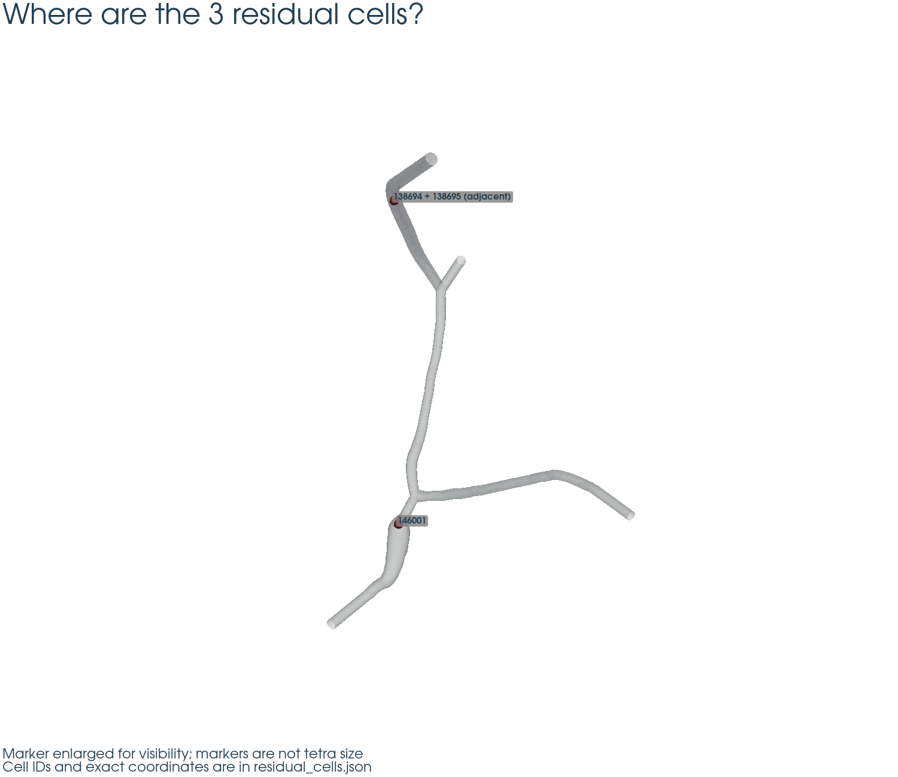
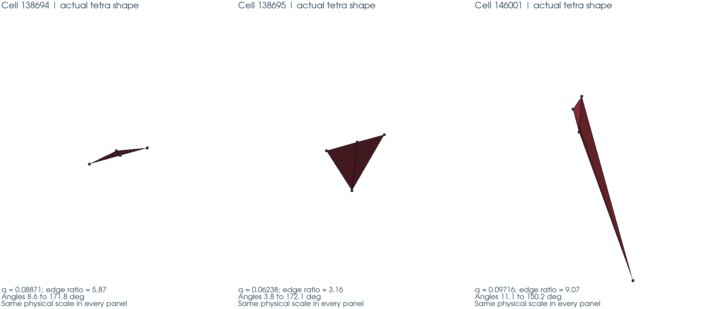
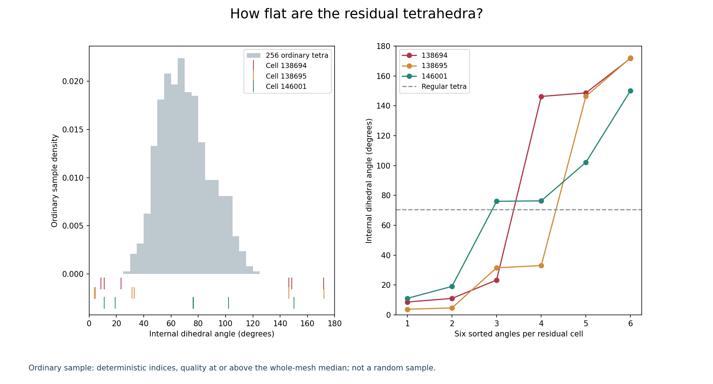
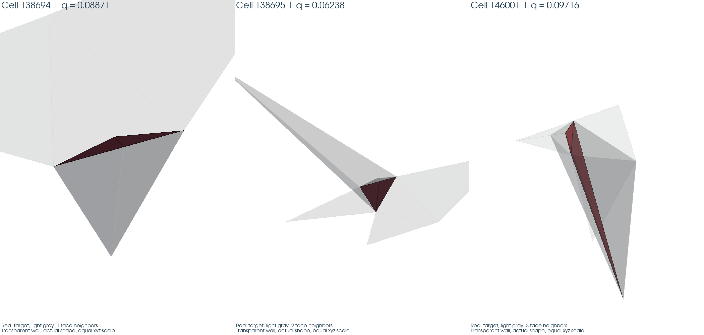
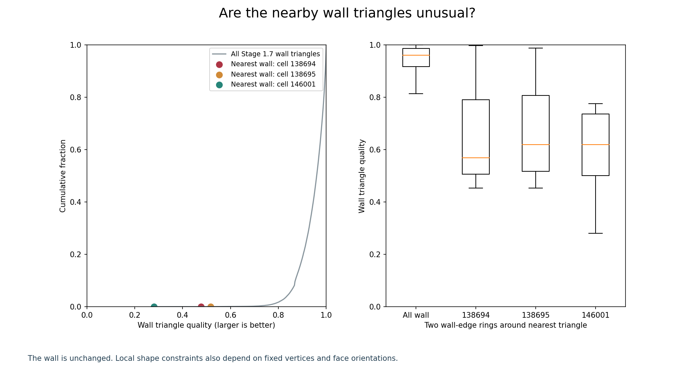
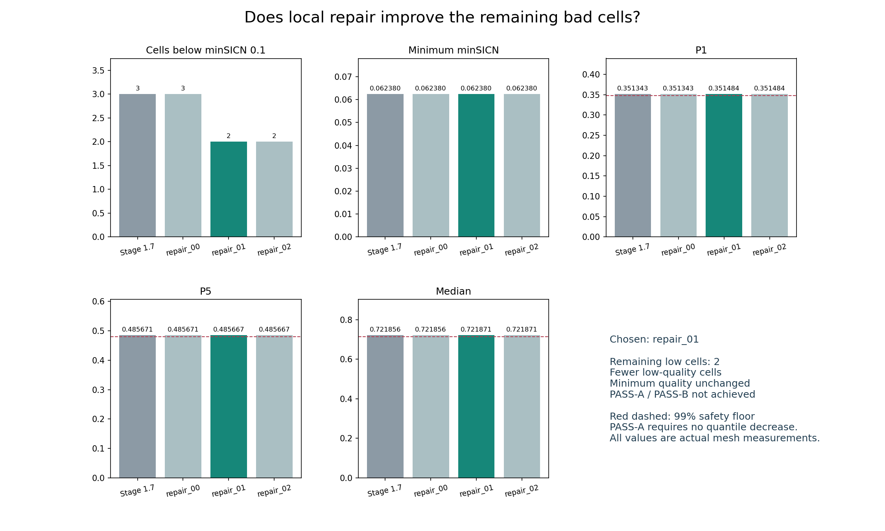
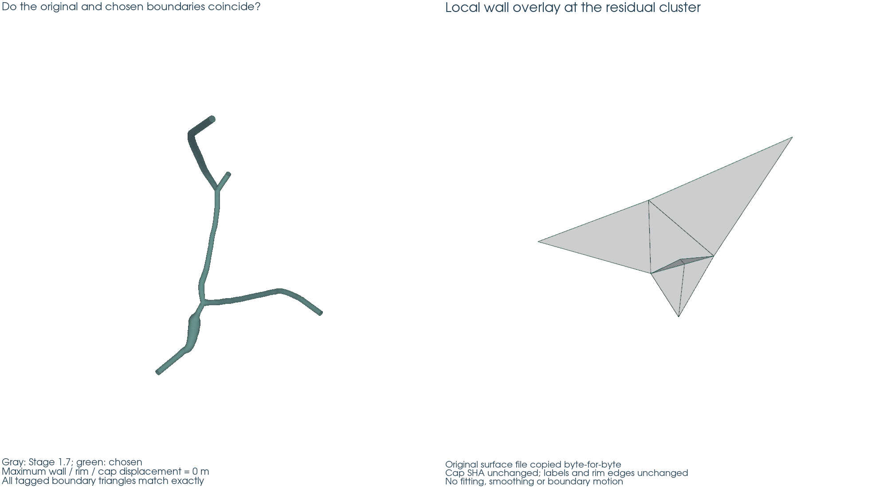
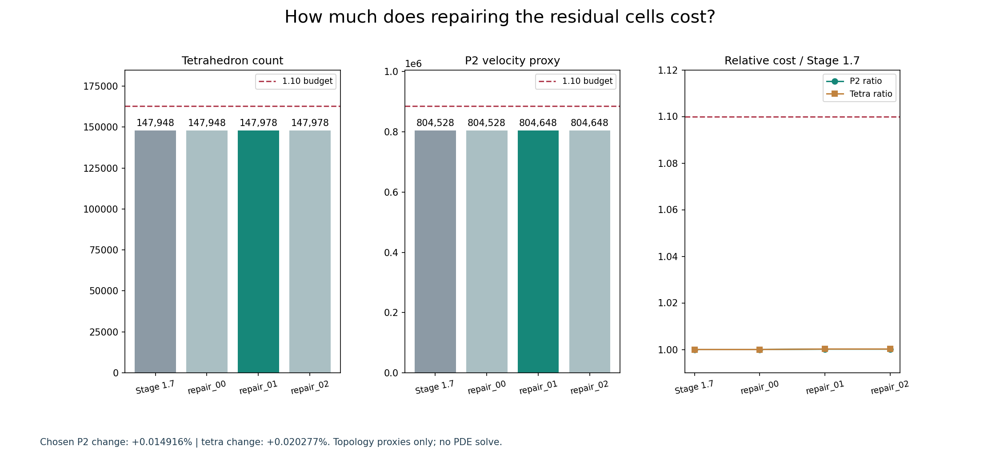
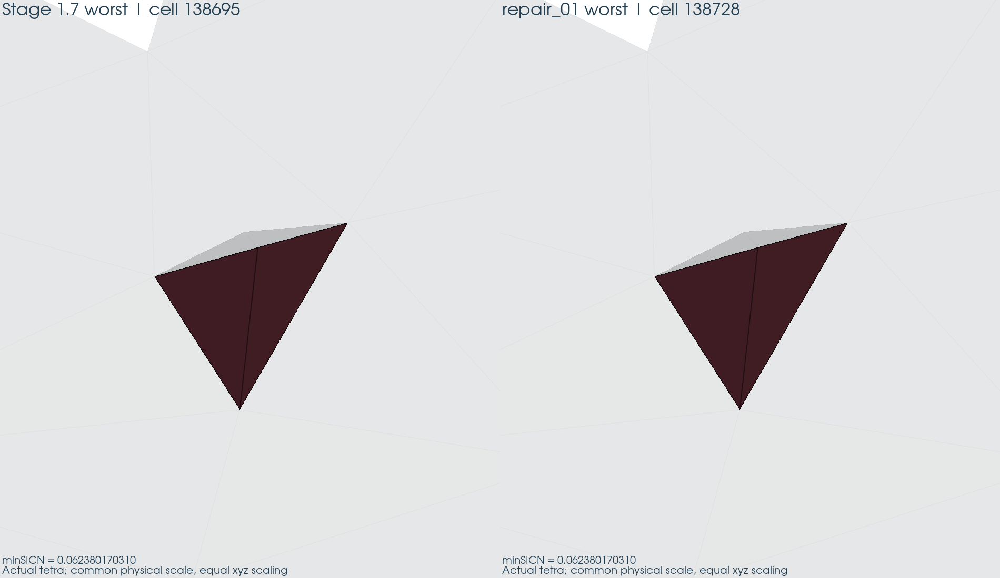
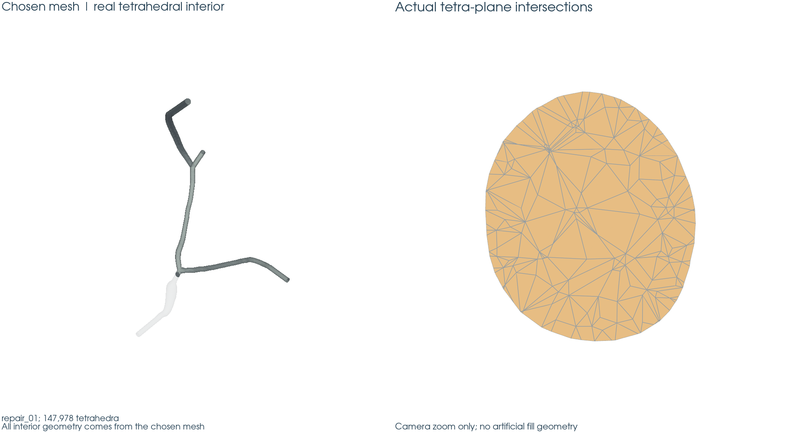

# Stage 1.8 — 剩余低质量四面体核验与局部修复评估

**STAGE 1.8 STATUS: CONDITIONAL PASS，等待用户人工审核。RECOMMENDATION: USE_REPAIR_01。**
保持 wall/rim/cap 不变后，低质量 tetra 从 3 个减至 2 个，P2 proxy 仅增加 0.014916%。
最小 minSICN 完全未改善；本次修复不满足 PASS-A，也不满足 PASS-B。阶段状态依据用户第 29/30 节的安全流程标准，不能解读为数值精度通过。

## 为什么还要检查这 3 个单元？

Stage 1.7 已解决端口邻接低质量单元，INLET 和三个 OUTLET 的 low count 均为 0；用户已确认人工审核完成、Stage 1.7 正式 PASS。
本阶段从唯一输入 `outputs/stage01_7/selected/` 出发，独立重算全部 minSICN、拓扑和成本，重现 3 个 WALL 附近残余、0 个 cap-adjacent 残余及 q_min=0.062380170310。
原始 Stage 1.7 报告保留当时的 CONDITIONAL PASS 字样，不倒改历史；本次用户确认记在 [input_verification.json](input_verification.json)。

输入 NPZ SHA256：`fc036eb0eaa0b365b06a5033f5f9eb31addfe464af4beb53c4cd96a25ed594a3`。
预冻结接受策略 SHA256：`c98998d458c42195f69160496a02522d2dc3c725e37554948faedba1e37d24da`。
[baseline_recomputed.json](baseline_recomputed.json) 包含全部复算门槛；[acceptance_policy.json](acceptance_policy.json) 与 [freeze_lock.json](freeze_lock.json) 保留冻结规则。

三者均是正体积有效 tetra，但低质量形状可能影响矩阵条件和局部数值表现；不能仅凭数量少就忽略，也不能仅凭网格指标判断 CFD 误差。

## 它们在哪里？

| 原 cell | centroid / µm | 最近边界 | 到最近边界三角形中心 / m |
| --- | --- | --- | --- |
| 138694 | 102.899408, 44.332693, 139.793919 | WALL | 1.473150224e-09 |
| 138695 | 102.888676, 44.320917, 139.749069 | WALL | 2.267186770e-08 |
| 146001 | 145.073132, 88.000967, 89.679474 | WALL | 1.092140602e-07 |

cell index 为源 NPZ 中的零基索引；Gmsh element ID 单独存于诊断 JSON。距离定义为到三角形**中心**的欧氏距离，不能当作到壁面的最短距离。
138694 与 138695 共享一个面、形成相邻小簇；146001 位于另一处 wall 附近。位置不能单独证明 junction 或 curvature 致因。

全血管位置总览。marker enlarged for visibility；标记不代表真实 tetra 大小。

## 它们到底有多差？

| 原 cell | minSICN | edge ratio | 体积 / m³ | 最小 / 最大二面角 | 3r/R |
| --- | --- | --- | --- | --- | --- |
| 138694 | 0.088714544589 | 5.8746 | 1.76293163e-24 | 8.6064° / 171.8241° | 0.009665 |
| 138695 | 0.062380170310 | 3.1643 | 1.45975013e-23 | 3.7912° / 172.0953° | 0.018606 |
| 146001 | 0.097159964383 | 9.0690 | 1.46682929e-22 | 11.0639° / 150.1850° | 0.098860 |

二面角为内部二面角，正四面体约 70.53°；接近 0°/180° 表示局部接近压扁。
138695 的 3.79°/172.10° 比单看 edge ratio 更能说明其形状问题；138694 极小体积且 3r/R 仅约 0.0097；146001 则兼具明显边长不均匀与低面质量。
所有图保持三轴等比例，单元形状对比采用统一物理尺度。

三个真实 tetra 的形状；未使用非等比例拉伸。

残余单元全部 6 个二面角，对比质量不低于全局 median 的 256 个确定性普通 tetra 样本；普通样本不是全网格分布。

逐个单元的 4 顶点坐标、6 边长、4 面面积及面质量、全部二面角、内外接球半径、体积和 Gmsh ID 均保存在
[residual_cells.json](../../outputs/stage01_8/diagnostics/residual_cells.json)，不依赖报告表格的四舍五入。

## 它们周围的 wall 有问题吗？

| 原 cell | 最近 WALL triangle | q_tri | 全 wall 百分位 (%) | 最长/最短边 | patch 最大法向变化 |
| --- | --- | --- | --- | --- | --- |
| 138694 | 20632 | 0.476873311 | 0.014910 | 1.8802 | 171.3936° |
| 138695 | 20630 | 0.516375906 | 0.023855 | 3.1643 | 171.0563° |
| 146001 | 58918 | 0.280542408 | 0.001491 | 2.6193 | 20.8768° |

q_tri 采用等边三角形为 1 的面积/边长指标。全 wall 共 67,071 个三角形，P1=0.777593、
P5=0.845136、median=0.959941。
表中三个最近 wall face 均处于极低尾部，146001 邻接的 0.280542 face 为全 wall 最低值。
138694/138695 两圈 patch 中有约 171° 的最大法向差，但这是对最近外法向的离散角度，不是拟合的光滑曲率，也不单独证明致因。

| 原 cell | 累计邻域 | 数量 | minimum | P5 | median | q<0.1 |
| --- | --- | --- | --- | --- | --- | --- |
| 138694 | 1_ring | 1 | 0.062380 | 0.062380 | 0.062380 | 1 |
| 138694 | 2_ring | 2 | 0.062380 | 0.074634 | 0.184921 | 1 |
| 138695 | 1_ring | 2 | 0.088715 | 0.099652 | 0.198088 | 1 |
| 138695 | 2_ring | 5 | 0.088715 | 0.132464 | 0.321414 | 1 |
| 146001 | 1_ring | 3 | 0.148147 | 0.148630 | 0.152982 | 0 |
| 146001 | 2_ring | 7 | 0.148147 | 0.149597 | 0.217465 | 0 |

邻域由**共享面**定义；累计 2-ring 排除目标本身。138694 的唯一 1-ring 邻居就是最差单元 138695，说明并非孤立异常。
146001 的邻居没有另一个 q<0.1，但最低邻居约 0.148，因此周边也处于较弱质量区。
JSON 另存实际相接的 wall faces、最近 wall 坐标/边长、最长边/最小高、wall 邻域质量、每个表面顶点 valence，以及相邻外法向角/三角形中心距离的离散梯度代理。
该代理仅作诊断，没有用于移动或平滑壁面。

红色为目标单元、淡灰为 1-ring tetra、透明灰为附近真实 wall。

残余附近 wall 三角形质量与全 wall 分布的对照。

独立局部图：[cell_138694](cell_138694_local_context.png)、[cell_138695](cell_138695_local_context.png)、[cell_146001](cell_146001_local_context.png)。

## 原因判断是什么？

| 原 cell | 诊断阶段分类 | 实验后最终分类 | 支撑与限制 |
| --- | --- | --- | --- |
| 138694 | WALL_TRIANGLE_CONSTRAINED | WALL_TRIANGLE_CONSTRAINED | 4/4 顶点冻结，3 个实际 WALL 面；固定连接关系下没有可移动顶点，修复后同一物理 tetra 保留。 |
| 138695 | WALL_TRIANGLE_CONSTRAINED | WALL_TRIANGLE_CONSTRAINED | 4/4 顶点冻结，2 个实际 WALL 面；修复后同一物理 tetra 保留且质量不变。 |
| 146001 | WALL_TRIANGLE_CONSTRAINED | MIXED | 3/4 顶点冻结且邻接全 wall 最差面；仅改内部 mesh 就消除该低质量 tetra，说明内部点位/连接关系也参与。 |

前两者不是单纯移动内部点即可修复的 INTERIOR_SLIVER；但**不能证明所有可能的边界固定重连接都无解**。
第三个最初依据低质量冻结壁面作约束分类，实验给出新证据后修订为 MIXED，没有改写原诊断记录。
原 138694/138695 分别对应 chosen 138727/138728（四个物理顶点及连接关系精确相同）；原 146001 已不存在，原重心落在 chosen 138659 内，后者 q=0.670804281。
这是空间追踪结果，不是以新旧索引号直接比较。

诊断图与 [diagnostic_summary.json](diagnostic_summary.json) 于 `2026-09-18T10:02:18.801824+00:00` 完成，早于所有 repair；
其 SHA256 为 `f99008a3dd00e344164be53cbcf7201a093d8c9646c794442ef7c98523680e99`。
最终证据更新单独存于 [post_repair_causal_assessment.json](post_repair_causal_assessment.json)。证据不足时分类返回 UNKNOWN；没有编造 junction/curvature 原因。

## interior-only 修复能否解决？

| 网格 | N_low | q_min | P1 | P5 | median |
| --- | --- | --- | --- | --- | --- |
| Stage 1.7 | 3 | 0.062380170310 | 0.351343233439 | 0.485670578367 | 0.721855606189 |
| repair_00 | 3 | 0.062380170310 | 0.351343233439 | 0.485670578367 | 0.721855606189 |
| repair_01 | 2 | 0.062380170310 | 0.351483629822 | 0.485667009395 | 0.721871497129 |
| repair_02 | 2 | 0.062380170310 | 0.351483629822 | 0.485667009395 | 0.721871497129 |

repair_00：对已有 Stage 1.7 体网格调用一次标准 3D optimizer，没有重新 generate；三个残余和全部分位数不变。
repair_01：因 repair_00 未改善而执行。在完全冻结表面上，仅给三个残余邻域施加紧支撑 volume size field，重建体网格后低质量数降为 2。
repair_02：repair_01 未达到 PASS-A，故对其体网格再调用一次标准 3D optimizer；没有新增 generate，全部摘要与 repair_01 相同，没有额外收益。

局部尺度取目标及两圈共享面邻域的唯一边长 median，R=2.5×median、h_local=min(h_bulk,0.7×median)；比例均预先冻结。
球内尺寸线性过渡到 h_bulk，多个球取最小值；球外严格恢复原 bulk=5e−7 m，没有全树降低目标尺寸。

| 源 cell | 局部 median edge / m | R=2.5×edge / m | h=0.7×edge / m |
| --- | --- | --- | --- |
| 138694 | 1.445342754e-07 | 3.613356884e-07 | 1.011739928e-07 |
| 138695 | 2.504660689e-07 | 6.261651722e-07 | 1.753262482e-07 |
| 146001 | 2.187922365e-07 | 5.469805911e-07 | 1.531545655e-07 |

局部 volume callback 共调用 9,349 次，其中 44 次位于支撑域内，全部作用于维数 3。
Algorithm3D=1、原 bulk 上限及默认 meshing optimizer 保持；只把 MeshSizeMin 下限降至局部目标以免被原 bulk 下限截断。
体四面体化从冻结表面重新执行，因此不声称远处每条内部连接都不变；“局部”指尺寸场支撑及加密目标。

残余数量改善，但最差质量不变。红虚线为分位数 0.99 安全底线，不能作为 PASS-A 的无下降门槛。

P1 和 median 略升；P5 从 0.485670578367 降至 0.485667009395，相对变化 -0.00073485%，仍高于 0.99×基线。
PASS-A 因 residual 非零且 P5 下降不成立；PASS-B 因 q_min 未改善不成立（“明显改善”预冻结为至少 +5%）。
不能把“减少一个坏单元”写成最差单元已经改善。

**执行偏差披露：共 3 种方法、5 次执行尝试。** repair_00 首次因校验器将全部 volume vertices 交给 surface-only 对应检查而误报；
repair_01 首次因把 Gmsh 临时编号变化误当成物理边界变化而被拒绝。修正检查器后，各按原参数重试一次。
因此自加策略 `limits.per_method_runs=1` 未遵守；策略原文件及 SHA 未改，用户“最多三种方法”限制仍满足，没有第四种方法、没有改变几何或质量门槛。
失败尝试未计作 PASS，已归档在 `outputs/stage01_8/failed_attempts/`；全部原日志保留。
首次失败在旧实现保存网格前发生，故归档含 metadata/QC/日志，不声称保有失败网格。
详见 [technical_recovery.json](technical_recovery.json)。合计两次 volume generate 尝试、三次显式 optimizer 调用；默认 generate 自带优化另按 meshing setting 记录。

## 有没有移动真实血管壁？

**maximum boundary displacement = 0 m；maximum wall displacement = 0 m；maximum rim displacement = 0 m；cap changed = false；labels unchanged = true。**
33,875 个边界顶点的物理坐标、67,746 个带标签边界三角形连接关系精确相等，不使用放宽几何容差。
全 tagged surface NPZ（包括 cap）逐字节相同，SHA256=`31746b2c2ef95a0b9044d96ef4b470a83592a91ae9132c5d6810736880734ac6`。
planar-port v2 contract 逐字节相同，SHA256=`cf2dae365fde86ee02d92dbb1b1c97602f40c7adcce7a706551acf385cb96dc9`。
cap 总计 675 triangles：INLET 196、OUTLET_01 168、OUTLET_02 150、OUTLET_03 161；从未 refine/remesh cap。
repair_01 的临时 Gmsh 编号会重排，检查使用精确物理坐标及带 tag 的规范化三角形连接，不把编号重排当作几何变化。
源 surface/contract 中的原始 rim IDs、边和端口定义保留；没有 surface smoothing 或 Stage 1.7 optimizer 重跑。

Gmsh 标准 3D 优化的节点移动限定在 volume-owned 节点；`smoothVertex` 等对 `onWhat()->dim()<3` 直接返回。
这项实现核查依据 [Gmsh 4.15.2 官方源码](https://gmsh.info/src/gmsh-4.15.2-source.tgz) 与 [optimize API 文档](https://gmsh.info/doc/texinfo/#gmsh_002fmodel_002fmesh_002foptimize)，
具体源码 SHA 见 [optimizer_boundary_lock_evidence.json](optimizer_boundary_lock_evidence.json)。
本版本提示指定 entities 的优化 scope 未接入；模型只有一个 fluid volume，默认调用只遍历 volume，未调用 2D optimizer。最终仍以逐点、逐面独立验证为准。
默认 optimizer 内部使用 QMTET_GAMMA，其日志不能替代本报告独立重算的 minSICN。

原始与 chosen 边界叠加；可视化用于人工检查，零位移结论由精确坐标和连接核验支持。

chosen 的 inverted/degenerate/non-finite tetra 全为 0，fluid 连通分量为 1，未标记/重复标记/非外表面标签及非流形 facet 全为 0。
1/2 rank 新进程重载均核对全部物理 tetra、cell/facet tags、端口和独立重算质量；DOLFINx 可重编号，比较不依赖单元索引相同。

| 阶段 | MPI ranks | 状态 | tetra | 低质量数 | 全质量重算匹配 |
| --- | --- | --- | --- | --- | --- |
| reload_r1 | 1 | PASS | 147978 | 2 | True |
| reload_r2 | 2 | PASS | 147978 | 2 | True |

## 修复的成本是多少？

| 网格 | N_vertex | N_edge | N_tetra | P2 velocity proxy | C_P2 | C_tetra |
| --- | --- | --- | --- | --- | --- | --- |
| Stage 1.7 | 43178 | 224998 | 147948 | 804528 | 1.000000000000 | 1.000000000000 |
| repair_00 | 43178 | 224998 | 147948 | 804528 | 1.000000000000 | 1.000000000000 |
| repair_01 | 43183 | 225033 | 147978 | 804648 | 1.000149155778 | 1.000202773948 |
| repair_02 | 43183 | 225033 | 147978 | 804648 | 1.000149155778 | 1.000202773948 |

P2 velocity proxy=3×(N_vertex+N_edge)，P1 pressure proxy=N_vertex，仅由拓扑计数，不构造 FEM function space。
chosen 比 Stage 1.7 增加 5 vertices、35 edges、30 tetra、120 P2 velocity proxy，C_P2=1.000149155778、C_tetra=1.000202773948，均远低于 1.10。

修复的 tetra/P2 代价及相对预算；这不是实测 PDE 求解耗时或内存。

| 方法（完成记录） | Gmsh 操作秒数 | 峰值 RSS / MiB |
| --- | --- | --- |
| repair_00 | 0.6860 | 191.44 |
| repair_01 | 2.8513 | 297.94 |
| repair_02 | 0.7049 | 192.01 |

上述秒数和 RSS 是完成尝试的 Gmsh 操作/进程记录，不包含完整 QC、重载、可视化或失败重试的总费用。
原始命令、运行环境与逐次源码 SHA 保存在 `logs/stage01_8/` 和已取回的远端日志中。

## 是否值得替换 Stage 1.7 mesh？

**USE_REPAIR_01。** 按用户冻结优先级，先通过全部硬安全门槛，再最小 N_low、最大 q_min、最小 P2、最小 tetra。
repair_01/02 的 2 个残余优于 Stage 1.7/repair_00 的 3 个，成本几乎不增加；01 与 02 指标相同，保留先达到结果的 01。
Stage 1.7 参与 KEEP 比较，但其残余数较多，故不是本次最优选项。原 selected 文件没有覆盖。

A：两个全边界顶点单元受冻结三角化约束；第三个有内部点位/连接贡献，最终为 MIXED。
B：不动 wall 可消除其中一个坏单元，但两者和 q_min 未改善；不能声称全部残余问题解决。
C：P2 proxy +0.014916%，tetra +0.020277%，远低于预算。
D：按已声明优先级值得选用 repair_01 作为后续对照输入，没有已证实的 CFD 精度收益。
E：剩余两个是有效正体积、已定位及记录原因的单元，边界和标签安全且双核重载通过，可以在人工审核后作为 Stage 3 数值验证的输入；不能视为数值验证已经通过。

原最差单元与 chosen 最差单元的真实形状完全相同；q_min 未改善。

chosen 的真实 tetra 内部切面与剖切；没有求解流场。

后续对照契约：[stage3_mesh_contract.json](stage3_mesh_contract.json)。它同时保存 Stage 1.7 原网格路径/SHA、chosen 的 NPZ/MSH/XDMF/H5 路径/SHA、全部残余诊断、选择理由、边界不变性及 P2 proxy。
chosen NPZ SHA256：`2d5fdae878f7d0a3291d266a41ab60d42362aa4d58f6d90d3f0ada1310efd093`。

## 还没有证明什么？

没有真实 vascular CFD solution，没有 velocity/pressure/lambda/Q solve、Stokes、Navier–Stokes、WSS 或 streamlines。
没有构造 FEM function space，也没有修改或重新求解 Stage 2 solver core。
尚未验证残余单元对条件数、速度/压力、流量或网格敏感性的数值影响；Stage 3 需要保留 Stage 1.7 对照后验证。
仅三个允许方法的试验不能证明其他边界固定拓扑都无法改善；不能用这一结果作为修改真实血管壁的理由。
离散 wall normal 变化不是光滑曲率的致因证明。P2 proxy 不是实际系统装配/求解成本测量。

## 最终状态

**STAGE 1.8 STATUS: CONDITIONAL PASS。等待用户人工审核。修复等级：PASS-A=false、PASS-B=false。**
状态依据是安全诊断完成、有 geometry-safe chosen、1/2 rank roundtrip 通过、全量 pytest 无失败；保留两次校验器重试的行政执行偏差，未将其隐藏为完全遵守一次执行限制。

全量测试：**311 passed、0 failed、0 errors、5 skipped**。
本阶段要求的 16 个测试模块全部保留，合计 **44 passed、0 skipped**；5 个 skipped 均属历史条件跳过。
包含 wall 移动/cap 改变拒绝、低残余但 P5 下降拒绝、P2 超预算拒绝、无改善 KEEP、证据不足 UNKNOWN，以及非法单元/连通/标签、边界编号重排、局部尺寸尺度变换等回归。
开发测试曾因 Stage 1.5 状态文件名写错产生一次失败；修正为真实历史路径后，全量套件通过。早先失败 JUnit/日志保留，见 [pytest_development.xml](pytest_development.xml)；正式结果见 [pytest_results.xml](pytest_results.xml)。

历史审计 **2,246 个冻结文件无变化**、全部既有核心源码 SHA 不变；两只读参考工程的 **43,038 条完整清单无变化**。
[history_preservation.json](history_preservation.json)、[reference_integrity.json](reference_integrity.json) 保存完整结果。
Stage 1.5 FAIL、Stage 1.6 FAIL 永久保留。开始前已有的 `reports/stage01/REPORT.md` 用户格式改动原样保留，未归入本阶段变更。

人工审核需检查以下 10 张正式图，另有 3 张逐单元上下文图；所有图像 SHA 在 [visualization_manifest.json](visualization_manifest.json)：

- [residual_locations.png](residual_locations.png)
- [residual_cell_shapes.png](residual_cell_shapes.png)
- [local_context_cells.png](local_context_cells.png)
- [wall_surface_quality_near_residuals.png](wall_surface_quality_near_residuals.png)
- [dihedral_angle_summary.png](dihedral_angle_summary.png)
- [repair_quality_comparison.png](repair_quality_comparison.png)
- [repair_cost_comparison.png](repair_cost_comparison.png)
- [worst_cells_before_after.png](worst_cells_before_after.png)
- [boundary_overlay.png](boundary_overlay.png)
- [tetrahedral_cutaway_chosen.png](tetrahedral_cutaway_chosen.png)

**停止于 Stage 1.8。Stage 3 未开始；契约生成不构成 Stage 3 执行授权。**
