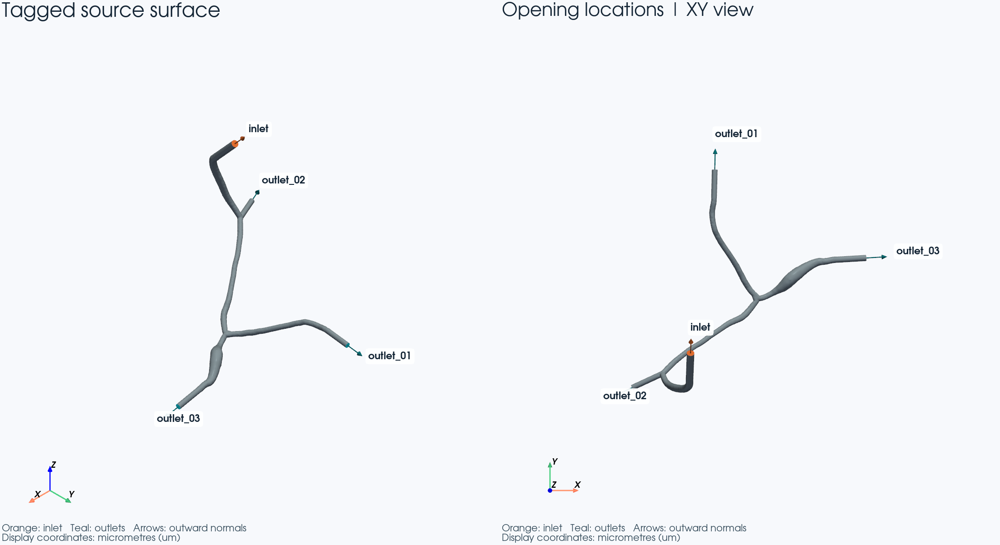

# Stage 0 — 工程、输入数据和计算环境审计

本阶段结果：**PASS**。审计完成，已停止在 Stage 0。没有实现血流求解器，
没有给血管生成体网格，也没有计算血流场。远端的小立方体 Poisson 测试仅检查计算环境。

## 本阶段想解决什么？

确认新工程与两个参考工程隔离；确定正式 3D 管线的真实几何、单位和开口标签；
总结旧 2D FEM 可借鉴的设计；实际打通 WSL → Vast.ai → WSL 的输入、计算和日志回收。
重点是让下一阶段有可验证的起点，不靠文件名、坐标朝向或历史 Windows 路径猜输入。

## 输入数据来自哪里？

WSL 唯一开发目录为 `/home/lzy/projects/formal_3D_flow_solver/FEM`。
两个只读来源分别为 `/home/lzy/projects/ulm_3D_vascular` 和
`/home/lzy/projects/ulm_microbubble_traj_gen_2D`。

正式几何由 `ulm_3D_vascular/configs/cfd_flow.yaml` 的 `paths.source_surface_run`
明确指定为 **vmtk_tps_boundarynormal_crossseam_finalized_recovery_anchor003274_20260826_221611**，不是按目录时间或名字选“最新”。
`utils/cfd_flow/io.py:75`–`:90` 确定该 run 实际读取的 VTP、米单位 STL、BC JSON 和 CSV。

- 带标签主文件：[cfd_surface_vmtk_tps_boundarynormal_crossseam_um.vtp](/home/lzy/projects/ulm_3D_vascular/outputs/cfd_surface_prepare/vmtk_tps_boundarynormal_crossseam_finalized_recovery_anchor003274_20260826_221611/geometry/cfd_surface_vmtk_tps_boundarynormal_crossseam_um.vtp)，坐标 **μm**；
  SHA256：`8820376703e1c51a5b27bca56f754d7125a524b95c8ad58205e2a185fcc1dc83`。
- SI 几何副本：[cfd_surface_vmtk_tps_boundarynormal_crossseam_m.stl](/home/lzy/projects/ulm_3D_vascular/outputs/cfd_surface_prepare/vmtk_tps_boundarynormal_crossseam_finalized_recovery_anchor003274_20260826_221611/geometry/cfd_surface_vmtk_tps_boundarynormal_crossseam_m.stl)，坐标 **m**；
  SHA256：`76c0dba67bd153829135945f7c625f4f16075c4a0727d77ba1211d66b621281d`。
- 标签数组为 `CellEntityIds`。STL 不携带这个数组，后续不能丢失 VTP 的开口/壁面分区。
- 完整路径、单位、SHA256、平面原点、外法向、角色来源和配置在
  [source_contract.json](source_contract.json)。其中 42 个来源文件均已校验存在并保存 SHA256。

现行 flow 配置是 `FRESH_STEADY`。已有完成证据中的
`production_tau1_base_promotion_anchor003274_20260902_013637` 则明确是
`VALIDATED_BASE_PROMOTION_REPLAY`，`fresh_full_production_steady_solve=false`。
该历史 replay 佐证采用了相同几何，不能被报告成一次新完成的正式稳态计算。

来源链按 metadata 串联如下：

1. 源 SWC：`/home/lzy/projects/ulm_3D_vascular/vessel_model/T - A high-resolution dataset of mouse brain vasculature/raw_data/analysis_data/analysis_data/swc/fMOST_0_5_6_0_0_6_0001_02_01.swc`。
2. `normalized_index.json` 指向验证后的单连通 analysis SWC；进入
   `20260825_133201_radius_plus_structure_k5` 的 ROI 采样。
3. 选定 ROI 为 `raw-analysis__fMOST_0_5_6_0_0_6_0001_02_01__anchor_003274`，anchor **3274**；
   `selected_rois.csv`、ROI NPZ 和 canonical `roi_core.swc` 相互核对。
4. 重建 run `ultraliser_anchor003274_20260825_133350` 使用 Ultraliser，
   送入重建的半径缩放系数为 **0.91**；旧 1D 流动参考仍使用原始 SWC 半径，二者不能混为一谈。
5. `global_to_roi_anchor003274_20260825_183628` 产生端口分类和原始切平面；
   VMTK 管线增加延长段、局部 remesh，再从冻结 open surface 封端成为当前正式曲面。

所有历史 `E:/ULM/hatimb-particle_flow_simulator/ulm_3D_vascular/` 前缀只按明确规则映射到上述 WSL 根目录，
再检查文件和已有哈希；未知前缀直接报错。旧配置中的 `D:/anaconda3/...` 属于旧运行环境，
不作为新环境的执行路径。具体映射保存在契约中。

## 边界信息与单位核对

有 **1 个 inlet、3 个 outlet**。角色直接读取 `boundaries/boundary_manifest.csv`，
再与最终 `qc/final_surface_qc.json`、BC JSON、preprocess 的 `roi/port_classification.csv`
按完整 `port_id` 交叉核对。没有按“最近平面”或坐标方向重新分配角色。
上游历史 cap matching 曾使用 predicted end 匹配，审计保留这个来源事实；本次使用其固定标签，
并对数量、面积、角色和法向进行独立复核。

| Opening | CellEntityIds | 面积 μm² | 面积 m² | 外法向 (x,y,z) |
|---|---:|---:|---:|---|
| inlet | 4 | 7.819752 | 7.819752112e-12 | 0.025173, 0.672084, 0.740047 |
| outlet_01 | 3 | 4.416142 | 4.416141896e-12 | 0.025498, 0.994458, -0.101996 |
| outlet_02 | 5 | 4.315070 | 4.315070430e-12 | -0.906464, -0.420269, -0.041203 |
| outlet_03 | 2 | 5.110622 | 5.110621776e-12 | 0.988819, 0.058742, -0.137063 |

壁面为 **CellEntityIds=1**，共 **67071** 个三角面，包括血管主体和人工延长段。
4 个端盖的 191 个三角面与壁面恰好覆盖全部 **67262** 个三角面，没有重叠或遗漏。
文件中有 73416 个点记录；绘图/拓扑检查只在内存精确合并重复顶点，
没有重写任何原始曲面。独立检查得到一个连通区域、零开放/非流形边、所有三角形面积为正。
自交为上游已通过的 QC 证据，本阶段没有宣称重新跑过完整自交检测。

最终端盖原点用面积加权中心，法向由已标记三角面的朝向计算，并用封闭曲面的有向体积确定外向。
它们与同一 port 的原始 metadata 法向点积均大于 0.999，平面误差不超过
1.46e-11 m（原始 float32 量化尺度）。
按 μm→m 的 `1e-6` 缩放并按 STL float32 序列化后，VTP 三角坐标与米单位 STL **逐三角面完全一致**。
面积换算为 `1e-12`；新 solver 内部只接受 SI，转换代码位于明确的输入适配层 `src/fem3d/source.py`。

特别注意：`physical_port_flux_plane_contract_v3.json` 给的是旧 LBM 的**内部测量截面**。
其 normal 与真实端盖 normal 的点积依次约为
0.740, 0.740, 0.946, 0.993，不能拿它直接替代 FEM 端面。
本阶段确实发现并记录了这种差异，而非自动“修正”为相同。

## 实际做了什么？

创建了独立可导入包、输入契约适配层、几何绘图脚本、审计与运行元数据工具、pytest、
四个远程脚本和独立环境定义。仅复制两份必要表面文件与少量 metadata，共约 4.9 MiB；
没有复制任何完整参考工程，来源及哈希记录在 `inputs/stage00/input_manifest.json`。
没有把旧求解器导入新包。

旧 2D 设计复核见 [2d_fem_reuse_review.md](2d_fem_reuse_review.md)，严格分成三类。
其中明确排除了旧入口速度 Dirichlet、出口速度 Dirichlet、pressure pin 和等效 2D 厚度。
也检查了 P2/P1 形式、PETSc/SciPy 分支、DG 梯度、真实 facet 积分、物理验收和 FEM-to-particle 导出。

## 本机与远端环境

原状记录：[local_environment.txt](local_environment.txt)、[remote_environment.txt](remote_environment.txt)。
安装后的专用环境另存 [local_audit_environment.txt](local_audit_environment.txt) 和
[remote_fem_environment.txt](remote_fem_environment.txt)，没有覆盖原状报告。

WSL 为 Ubuntu 24.04 系列，内核为 WSL2；可见 i7-13700HX 的 24 个逻辑 CPU、约 7.6 GiB RAM，
RTX 4060 Laptop 约 8 GiB，驱动 572.83 报告 CUDA 12.8，未找到 nvcc；系统 MPI 为 Open MPI 4.1.6。
默认 conda Python 3.13.11 没有 FEM 包，未改动它。
本项目 `.venv` 使用 Python 3.12.3，通过 `--system-site-packages` 读取已有科学包，并只向该 venv 安装审计依赖；
本地 NumPy 1.26.4、SciPy 1.11.4、PyVista 0.46.3、VTK 9.5.2、pytest 8.4.2。
没有把本地也装成重型 FEM 环境。

Vast 实际主机为 **f7c62a262077**，AMD Ryzen 7 7800X3D，8 核/16 线程，约 61 GiB RAM；
RTX 4090 约 24 GiB，驱动 595.84，nvcc/CUDA toolkit 13.2。初始系统 MPI 为 Open MPI 4.1.6，
系统和 `/venv/main`、miniforge base 中未发现可用 DOLFINx/PETSc。

先检测 `/workspace` 存在且可用约 248 GiB，再选择 **`/workspace/formal_3D_flow_solver_FEM_lzy`**。
该选择及可用空间在 `remote/connection.local.json` 和每个运行 metadata 中，脚本不偷偷硬编码最终路径。
这个目录位于容器 overlay，并不是“数据一定永久保存”的保证；本阶段结果均已取回 WSL。
服务器上其他项目、服务和环境均未删除、升级或修改。

专用环境为 `/workspace/formal_3D_flow_solver_FEM_lzy/remote/.env`，Python 3.12.13。
通过既有 conda 创建，未污染系统 Python；实际创建约 285 s，没有源代码编译 CUDA PETSc。

| 包 | 远端独立 FEM 环境 |
|---|---|
| dolfinx | 0.11.0 |
| petsc4py | 3.25.5 |
| mpi4py | 4.1.2 |
| basix | 0.11.0 |
| ufl | 2026.1.0 |
| ffcx | 0.11.0 |
| gmsh | 4.15.2 |
| numpy | 2.5.3 |
| scipy | 1.18.1 |
| pyvista | 未安装（已实际探测） |
| PETSc | 3.25.5，float64 real，MUMPS 可用，CUDA capability=False |
| MPI 实际求解链路 | MPICH 5.0.1，绝对路径 launcher 与 mpi4py 配套 |

远端未装 PyVista/VTK 是明确决定：本阶段渲染在 WSL，远端只承担 CPU FEM 环境测试。
探测报告里的普通 `mpirun --version` 反映未激活 shell 的系统 Open MPI；
烟雾测试显式调用项目环境的 `bin/mpiexec`，并核对实际 communicator 大小，避免混用 MPI。
`remote/environment.yml` 给出目标环境，`remote/conda-linux-64.explicit.txt` 保存实际包 URL/build，
`remote/resolved_environment.yml` 保留完整解。重建精确版本可使用 conda 的 `--file` 读取 explicit 文件并指定新项目 prefix。

版本选择查证了 [FEniCS 官方发布](https://github.com/FEniCS/dolfinx/releases/tag/v0.11.0)；
未来 Real 采用 [官方 block/MixedFunctionSpace 用法](https://docs.fenicsproject.org/dolfinx/v0.11.0.post0/python/release_notes.html#the-real-element)。
当前 smoke 只使用官方 [LinearProblem API](https://docs.fenicsproject.org/dolfinx/v0.11.0.post0/python/demos/demo_poisson.html)，
没有借机实现后续血流模型。

## 进行了哪些测试？测试是否通过？

本地 pytest：**31 passed，1 skipped，0 failed**；详见
[pytest_results.xml](pytest_results.xml)。唯一 skip 是本地没有 DOLFINx 的环境测试，
同一测试文件已在远端以三种 rank 数实际执行并通过，不能把 skip 当作远端通过证据。

本地检查覆盖：全部工程目录、本地 package import、两个参考树逐文件 SHA256/模式/mtime/大小及新增删除项、
source 契约全部来源文件存在与哈希重算、明确单位、入口/出口数量、唯一 ID/标签、正面积、有限非零单位法向、
几何分区、审核图产物、历史路径拒绝猜测、坏 metadata 必须失败、远程脚本接口、回传输入和三个 MPI 结果。
参考树 **43,038 个条目，0 变更**，证据见 [reference_integrity.json](reference_integrity.json)；
完整前后清单保存在本地（大文件不放入 Git）。

远端使用 162 个四面体、64 个自由度的小立方体，组装体积与 Poisson 形式，
CPU PETSc CG/Jacobi 求解一个已知仿射解。检查启动、实际 rank 数、体积、残差、解析误差和所有拥有自由度的有限值。
每 rank 将 OMP/OpenBLAS/MKL 线程限制为 1，没有占用全部 16 个逻辑线程。

| Ranks | 启动到脚本入口 s | 导入/MPI 初始化 s | 组装及求解 s | MPI 命令总耗时 s | 最大单 rank RSS MiB | 结果 |
|---:|---:|---:|---:|---:|---:|---|
| 1 | 0.0181 | 0.3691 | 0.5103 | 0.9657 | 138.9 | PASS |
| 2 | 0.0176 | 0.4017 | 0.0151 | 0.5150 | 135.7 | PASS |
| 4 | 0.0185 | 0.4993 | 0.0178 | 0.6149 | 140.4 | PASS |

三种规模的相对代数残差均小于 1.5e-16，仿射解 L2 误差小于 4.8e-16。
1 rank 包含首次 JIT，2/4 ranks 命中缓存，因此此表**不能用于宣称并行加速比**。
RSS 是每 rank 高水位的最大值，不是整个 MPI 作业的总内存。每次外层启动的总耗时也在独立 metadata 中。

WSL→远端增量同步、源码哈希核验、必要输入 SHA256 回执和结果取回均已实际执行。
`--dry-run` 已覆盖同步和取回；脚本默认无删除选项，已有输出不会被 rsync 清空。
发生错误返回非零，既保留 stderr，也不自动进入下一阶段。

## 产生了哪些图？应该怎么看？



唯一审核图 [source_geometry_overview.png](source_geometry_overview.png) 是纯几何。
左边是三维视角，右边是 XY 投影；灰色是血管主体与延长段，橙色是入口，青色是出口。
标签给出 opening 的稳定名称。箭头均指向**域外**，入口的实际流入方向应与箭头相反。
图中没有速度、压力或流线；显示单位为 μm，不能据此推断 solver 内部也使用 μm。
图已实际打开检查：名称可辨识，全部开口在至少一个视角可见。

## 如何重复运行和查日志？

```bash
# WSL 本项目目录，重要命令使用 recorder 包装
.venv/bin/python scripts/record_run.py --label source_audit -- .venv/bin/python scripts/build_source_contract.py
.venv/bin/python scripts/record_run.py --label geometry -- .venv/bin/python scripts/render_geometry.py
scripts/remote_probe.sh
scripts/remote_sync.sh --dry-run
scripts/remote_sync.sh
scripts/remote_run.sh --label setup -- bash remote/setup_environment.sh
scripts/remote_run.sh --label roundtrip --python remote/.env/bin/python -- remote/.env/bin/python scripts/verify_remote_inputs.py
scripts/remote_run.sh --label smoke_matrix --python remote/.env/bin/python -- remote/.env/bin/python scripts/run_smoke_matrix.py
scripts/remote_fetch.sh --dry-run
scripts/remote_fetch.sh
.venv/bin/python scripts/record_run.py --label pytest_stage00 -- .venv/bin/python -m pytest -q --junitxml=reports/stage00/pytest_results.xml
.venv/bin/python scripts/build_stage00_report.py
```

`scripts/remote_probe.sh` 首先只做读取和目录选择；sync 仅在专属目录写入，并检查项目 owner marker。
`remote_sync.sh` 不发送 Git 仓库、SSH 私钥、venv、参考目录或庞大的旧结果；只发送本项目白名单。
`remote_run.sh` 执行前验证同步清单；`remote_fetch.sh` 仅取回日志、输出和报告，不用远端代码覆盖 WSL。
SSH 连接为用户提供的 host/4159，密钥取本机已有 `vast4090` 配置所指定文件。
最初默认 SSH 身份认证失败；显式使用已有专用密钥后成功，没有修改 SSH 配置或服务器认证。

本地重要运行位于 `logs/stage00/<UTC>_<label>/`，含命令、主机、时间、Python/包版本、MPI ranks、
CPU/GPU、配置快照、输入/代码 SHA256、wall time、可获得的内存以及独立 stdout/stderr。
最初 reference baseline 和本地依赖安装在 recorder 建立前执行；其 bootstrap metadata
明确记录用日志创建/修改时间重建的近似耗时，峰值内存未捕获，不伪装为精确测量。
最终参考树 SHA256 复核和全部验收均由 recorder 包装，具有实际计时。
运行发生在首次本地 commit 前时，`git` 字段如实保留“尚无 commit”的结果；最终源码在 WSL 独立 Git 仓库记录。
远端原始日志在 `outputs/stage00/remote_return/logs/stage00/`，结果在
`outputs/stage00/remote_return/outputs/stage00/`，初始与新环境输出分别保留。
完整清单、日志、测试文件和原始结果都没有因成功而删除。

## 还存在什么问题？

1. 上游角色明确写着 `ASSUMED_INLET/ASSUMED_OUTLET`，依据 SWC parent-to-current，而不是实测血流方向。
   当前端口可以可靠追踪和复现，但不能宣传为实验测量结果。
2. 上游 final surface 的状态仍带 `PENDING_MANUAL_REVIEW`。现行正式 flow 配置使用它，
   本阶段的数值审计与新图可供人工审核；没有伪造已经完成的人工签字。
3. 当前输入有人工延长段。后续应明确实验边界放在当前端盖，或经单独授权重定义实验切面；
   不能把内部 LBM 量测平面当成同一边界，也不能无说明删除延长段。
4. 尚未给出新实验 Q。旧 preprocess 为 7.693508476e-16 m³/s，
   现行 LBM 为 2.736913239e-15 m³/s，二者不同。
   契约的 `experimental_Q_m3_s` 保持 null。这不阻塞本阶段环境/输入审计，但实际实验求解前必须明确 Q。
   旧 14.545/132.205/−13.701 Pa 出口值、抛物线 profile 和人工延长段压降修正均未继承为新实验 BC。
5. 当前只验证了 CPU 标量 Poisson 链路，尚未验证 P2/P1/Real 的 3D Stokes 数值正确性、
   复杂几何体网格、收敛性或压力/牵引乘子符号。这些都属于后续阶段，不应由本次 PASS 代替。

## 是否建议进入下一阶段？

建议在人工查看上述几何图并收到新的阶段指令后，Stage 1 先开展 SI 输入/边界标签与小型
P2/P1/全局 Real 约束验证的设计工作。正式条件保持 PDMS 无滑移、入口仅总 Q、
出口大气表压自然牵引。一个全局乘子强制 `∫Γin u·n dS = −Q`，并保存入口牵引 multiplier；
不得回到入口抛物线、固定出口分流或任意 pressure pin。
目前**未开始 Stage 1**。

## 阶段最终状态

STAGE 0 STATUS: PASS
