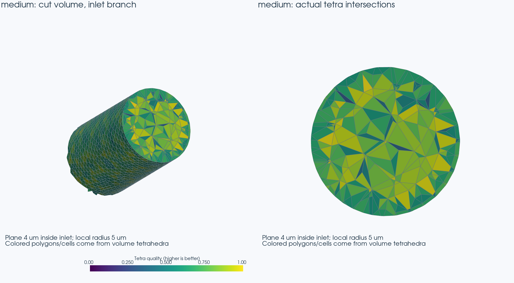
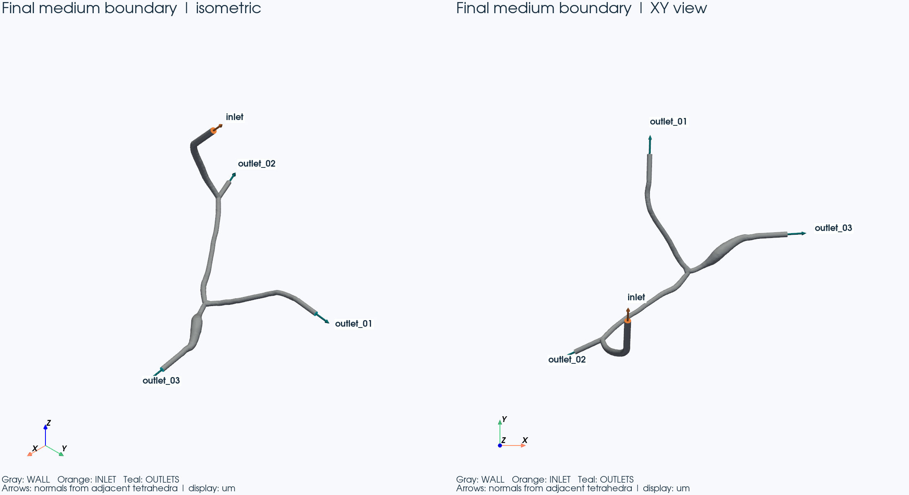
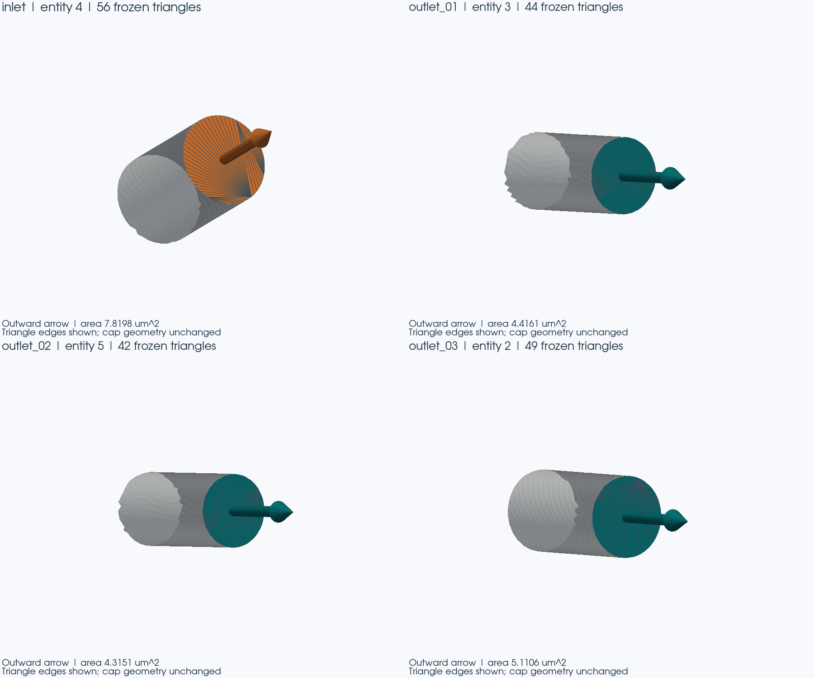
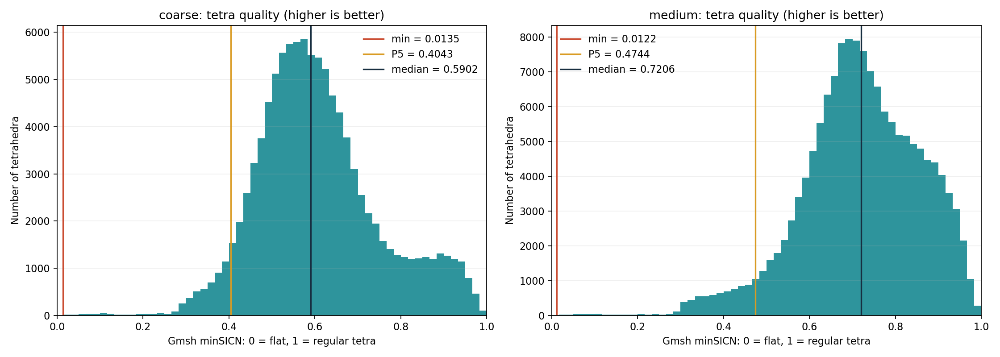
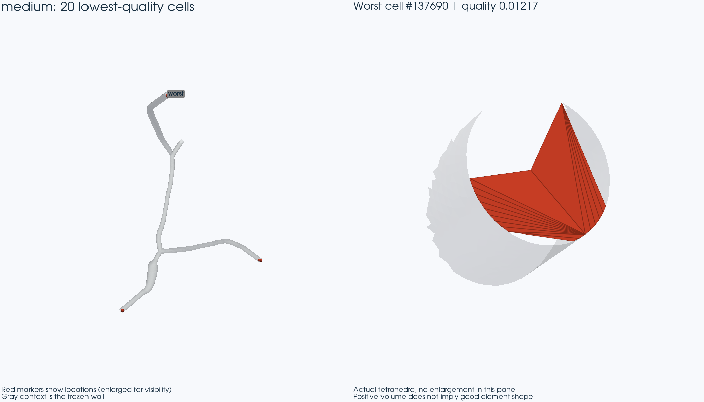

# Stage 1 — 3D FEM 体网格与边界标签

## 这一步想解决什么？

Stage 0 已确认并冻结输入表面，用户已确认 Stage 0 技术与人工审核通过。Stage 1 只检查能否在这层表面内部建立可信的四面体体网格，并保留 wall、inlet 和三个 outlet 的含义。两个开发网格均完成几何检查和 DOLFINx 保存、关闭、新进程重载。此阶段没有创建速度/压力空间或求解血流；Stage 2 未开始。

当前结论：**STAGE 1 STATUS: CONDITIONAL PASS**。硬性几何与标签检查通过，但低质量非退化单元及五张审核图仍需用户人工判断。

## 输入是什么？

唯一权威契约：[Stage 0 source_contract.json](../stage00/source_contract.json)。SHA256：`0635c4929d83269a3af6b3758d2a7dbac9ebd6f7d2068c5e21f401c317675721`。

冻结 VTP：`/home/lzy/projects/ulm_3D_vascular/outputs/cfd_surface_prepare/vmtk_tps_boundarynormal_crossseam_finalized_recovery_anchor003274_20260826_221611/geometry/cfd_surface_vmtk_tps_boundarynormal_crossseam_um.vtp`。SHA256：`8820376703e1c51a5b27bca56f754d7125a524b95c8ad58205e2a185fcc1dc83`。输入单位 **μm**，只在 VTP → SI adapter 中执行一次 `x_m = x_um × 1e-6`。Gmsh、QC、MSH 和 XDMF/HDF5 坐标均为 **m**，面积为 m²，体积为 m³；图像只把显示副本改为 μm。

配套 `_m.stl` 的 SHA256 为 `76c0dba67bd153829135945f7c625f4f16075c4a0727d77ba1211d66b621281d`，只用于源文件一致性核对。STL 不保留 `CellEntityIds`，不能作为唯一输入；端口角色来自已冻结契约，未按位置或轴方向猜测。

| entity / facet tag | 含义      | 三角形数 |
| ------------------ | --------- | -------- |
| 1                  | WALL      | 67071    |
| 4                  | INLET     | 56       |
| 3                  | OUTLET_01 | 44       |
| 5                  | OUTLET_02 | 42       |
| 2                  | OUTLET_03 | 49       |

五类边界合计 **67,262** 个三角形。体单元只有一个 physical group：**FLUID = 100**，与 facet tag 的含义分开记录。

## 怎么生成体网格？

先合并数值完全相同的重复顶点记录，再把五类已带三角网格的 discrete surface 组成一个闭合 surface loop 和一个 volume。Gmsh 4.15.2 使用三维 Delaunay 路径（Algorithm3D=1）填充内部，`Mesh.MeshOnlyEmpty=1` 保留已有表面网格；允许 Gmsh 三维内部单元优化，未进行表面重网格、平滑、修补、降采样、cap 修改或 extension 裁剪。操作后的全部边界顶点及带标签三角形都逐个核对。[Gmsh 官方说明](https://gmsh.info/doc/texinfo/) 定义了 discrete entity、MeshOnlyEmpty 和质量指标。

| 顶点合并审计项                 | 实测          |
| ------------------------------ | ------------- |
| 输入点记录                     | 73416         |
| 精确合并后的独立坐标           | 33673         |
| 合并的重复记录                 | 39743         |
| 最大合并距离 / 容差            | 0 m / 0 m     |
| 未被任一三角形引用的独立点记录 | 40            |
| 实际边界顶点                   | 33633         |
| 合并前 / 后三角形数            | 67262 / 67262 |
| 移动的保留顶点                 | 0             |

40 个未引用点只是文件内多余记录，没有属于表面三角形的几何；只从 mesher 的点表中排除它们，不删除或改变任何三角形。合并顺序确定；重复执行结果一致；人工构造的相近但不相同点不会被合并。

两个 profile 的内部目标边长分别为 **1.0e-6 m** 和 **5.0e-7 m**；`optional_interior_size_control` 本次为 null，没有额外尺寸场。冻结表面边长中位数为 0.2373 μm，已经很细，因此 coarse 不能把边界变粗。线程数固定为 1；开发限额为 150 万 tetra、300 s、8 GiB 虚拟地址空间，不自动提升资源限额。

远端只负责生成体网格、几何 QC 和 DOLFINx 转换/重载。WSL 始终是源码与报告的唯一来源；通过 Stage 0 的 probe/sync/run/fetch 脚本加 `--stage 1` 调用，每次运行前校验同步源码 SHA256。远端 Ryzen 7 7800X3D、约 61 GiB RAM，存在 RTX 4090，**GPU used = false**；Gmsh 只用单进程单线程。DOLFINx 0.11.0 的 XDMF/HDF5 保存方式依据[官方 Gmsh 示例](https://raw.githubusercontent.com/FEniCS/dolfinx/v0.11.0/python/demo/demo_gmsh.py)。没有进行 MPI 性能基准。

coarse 的独立测试与五张预览图生成后，才由 [coarse_gate.json](coarse_gate.json) 允许 medium 开始。完整运行命令、版本、输入/配置 SHA、主机、资源、stdout/stderr、退出码保存在 `logs/stage01/` 及取回的远端日志中；每个网格的 `metadata/meshing.json` 记录本次 meshing 的独立耗时与进程峰值 RSS。

## 网格是否真的填满血管内部？

两张网格均只有 **1 个通过共享面连通的流体体积**。四面体总和约为 **1.460682632475e-15 m³**；与冻结闭合表面的有向体积比较，coarse 相对差 6.751e-16，medium 相对差 8.101e-16。外表面没有额外内腔、缺失面或非流形面；完整外表面等于原始 67,262 个带标签三角形。

图中显示 medium 入口向内 4 μm 附近的真实体单元局部：左侧切去一半体积，右侧从切面正面看四面体与平面的交线。彩色多边形覆盖内部截面，未用一层空心表面冒充体网格。局部图用于理解结构；全体网格是否完整由全部单元连接关系、外表面对应和总体积核对共同检查。另保留 [coarse 同类切面](coarse_review/tetrahedral_cutaway.png)。

## 边界标签是否保留下来了？

是。两个 profile 均有 WALL 67,071、INLET 56、OUTLET_01 44、OUTLET_02 42、OUTLET_03 49 个 exterior facets。**未标记 = 0，重复标记 = 0，标在内部面上的边界标签 = 0**。每个边界三角形的外法向依据其唯一邻接 tetra 的内部位置确定，再与契约比较，未按 xyz 符号猜测。

下表面积由最终体网格的 oriented exterior facets 直接积分。对线性三角形，叉积计算面积就是精确的常数面积积分，不需要流场函数空间。

| profile | boundary  | entity id | source area (m²) | FEM area (m²) | relative difference | normal dot product |
| ------- | --------- | --------- | ----------------- | -------------- | ------------------- | ------------------ |
| coarse  | inlet     | 4         | 7.81975211e-12    | 7.81975211e-12 | 6.198e-16           | 1.000000000000000  |
| coarse  | outlet_01 | 3         | 4.41614190e-12    | 4.41614190e-12 | 9.146e-16           | 1.000000000000000  |
| coarse  | outlet_02 | 5         | 4.31507043e-12    | 4.31507043e-12 | 1.872e-15           | 1.000000000000000  |
| coarse  | outlet_03 | 2         | 5.11062178e-12    | 5.11062178e-12 | 1.106e-15           | 1.000000000000000  |
| medium  | inlet     | 4         | 7.81975211e-12    | 7.81975211e-12 | 6.198e-16           | 1.000000000000000  |
| medium  | outlet_01 | 3         | 4.41614190e-12    | 4.41614190e-12 | 9.146e-16           | 1.000000000000000  |
| medium  | outlet_02 | 5         | 4.31507043e-12    | 4.31507043e-12 | 1.872e-15           | 1.000000000000000  |
| medium  | outlet_03 | 2         | 5.11062178e-12    | 5.11062178e-12 | 1.106e-15           | 1.000000000000000  |

| 端口      | 最大绝对面积误差 (m²) | 最大中心位移 (m) | 源 cap 平面偏差 (m) | 最终最大平面偏差 (m) |
| --------- | ---------------------- | ---------------- | ------------------- | -------------------- |
| inlet     | 4.84676140e-27         | 6.21054816e-20   | 8.59712805e-12      | 8.59712805e-12       |
| outlet_01 | 4.03896783e-27         | 1.11757002e-19   | 1.30895278e-11      | 1.30895278e-11       |
| outlet_02 | 8.07793567e-27         | 1.91661677e-20   | 6.35475696e-12      | 6.35475696e-12       |
| outlet_03 | 5.65455497e-27         | 1.06712706e-19   | 1.45703174e-11      | 1.45703174e-11       |

两种网格的最大边界位移均为 **0 m**，全部边界坐标位级相等，带标签三角形 connectivity 完全对应。表面总面积为 2.053721076456663e-09 m²；三角形实际几何 bounds 为 `[[7.893795776367187e-05, 4.109487533569336e-05, 7.977824401855468e-05], [0.00017675119018554687, 0.00013389659118652342, 0.0001598683166503906]]` m，与最终网格边界相同。这里的 bounds 只统计真正被三角形引用的顶点，40 个未引用点不属于表面。比较没有只依赖 bounding box。

## 四面体有没有坏单元？

两个 profile 的 **负体积、零体积、非有限坐标/体积、非有限质量指标均为 0**，有向 Gmsh tetra 没有 inverted 单元。DOLFINx 可重新排列 tetra 的局部顶点编号，因此重载时比较每个 tetra 的完整几何并验证正的几何体积，不把合法的编号奇偶排列误判成倒置。

采用 Gmsh `minSICN`（有符号逆条件数）描述形状：**越高越好，规则四面体为 1，接近 0 表示很扁或细长**。最长/最短边比作为补充；体积本身不直接等同于质量。[指标定义见 Gmsh 官方 API](https://gmsh.info/doc/texinfo/#gmsh_002fmodel_002fmesh_002fgetElementQualities)。

| profile | 指标                  | minimum        | P1             | P5             | median         | P95            | maximum        |
| ------- | --------------------- | -------------- | -------------- | -------------- | -------------- | -------------- | -------------- |
| coarse  | 形状质量（高为好）    | 1.35453094e-02 | 3.13272091e-01 | 4.04324653e-01 | 5.90230074e-01 | 8.95717811e-01 | 9.98721231e-01 |
| coarse  | 最长/最短边（低为好） | 1.04138041e+00 | 1.30002012e+00 | 1.48059962e+00 | 2.78851924e+00 | 4.02456492e+00 | 2.06178314e+01 |
| coarse  | 体积 m³              | 1.76293163e-24 | 1.22383372e-21 | 2.04327237e-21 | 6.01609929e-21 | 4.84517452e-20 | 4.29462585e-19 |
| medium  | 形状质量（高为好）    | 1.21713078e-02 | 3.35972350e-01 | 4.74396137e-01 | 7.20646002e-01 | 9.29083532e-01 | 9.99586539e-01 |
| medium  | 最长/最短边（低为好） | 1.02572749e+00 | 1.25418659e+00 | 1.38223917e+00 | 2.05925195e+00 | 2.97406798e+00 | 2.34149421e+01 |
| medium  | 体积 m³              | 1.76293163e-24 | 1.11817035e-21 | 1.66819565e-21 | 5.90360670e-21 | 3.10465727e-20 | 1.04935076e-19 |

把 `minSICN < 0.1` 作为本项目的 **ADVISORY / MANUAL_REVIEW 显示触发值**，不是论文级合格线或收敛标准。低质量单元仍全部保留并报告：

| profile | 低质量单元数 | 占比    | 最近 INLET | 最近 OUTLET_01 | 最近 OUTLET_02 | 最近 OUTLET_03 | 最近 WALL |
| ------- | ------------ | ------- | ---------- | -------------- | -------------- | -------------- | --------- |
| coarse  | 142          | 0.1340% | 45         | 27             | 14             | 26             | 30        |
| medium  | 153          | 0.1037% | 51         | 26             | 16             | 36             | 24        |

多数低质量单元最接近端口 cap，图中最差的若干单元也集中在端口附近；这是与冻结 cap 扇形细长三角形相邻的现象。位置归类使用最近边界三角形中心，只用于诊断，不参与标签赋值。其余靠近 wall 的单元尚不能自动区分 junction 与窄血管，不宣称已经完成这种解剖位置判读。

- coarse 最差单元：数组编号 96809，Gmsh element 164072；中心 (112.983319, 133.710331, 98.973443) μm；最近边界为 OUTLET_01，到该边界三角形中心约 0.296 μm。
- medium 最差单元：数组编号 137690，Gmsh element 204953；中心 (104.082567, 58.227750, 158.117337) μm；最近边界为 INLET，到该边界三角形中心约 0.349 μm。

右图给出最差单元附近的真实形状，左图的红点仅为方便定位而放大。coarse 的[独立最差单元图](coarse_review/worst_elements.png)也保留。这些正体积 sliver 可能使后续高阶 FEM 的数值条件和局部误差变差；Stage 1 没有通过实际求解评估影响，也没有为改善统计数字移动冻结表面。

## coarse 和 medium 有什么区别？

| profile            | vertices | tetra   | minimum quality | P5 quality | median quality | meshing runtime | peak RSS  |
| ------------------ | -------- | ------- | --------------- | ---------- | -------------- | --------------- | --------- |
| development_coarse | 37,224   | 105,979 | 0.013545        | 0.404325   | 0.590230       | 2.195 s         | 274.4 MiB |
| development_medium | 42,968   | 147,569 | 0.012171        | 0.474396   | 0.720646       | 2.743 s         | 274.4 MiB |

medium 四面体数量为 coarse 的 1.392 倍，两个网格边界完全相同。medium 的质量中位数更高，但最差值略低，说明整体加密不能自动消除冻结 cap 邻近的坏形状。耗时只指生成脚本中 Gmsh 建模、网格生成及导出，不包括 SSH、环境探测、后续 QC 或渲染；RSS 是单进程高水位，不是 MPI 内存总和。

目前有两个可用于后续开发审查的网格；**未做网格收敛分析，也不能称为网格已收敛**。正式产物分别为 [coarse XDMF](../../outputs/stage01/coarse/mesh/fluid.xdmf) 和 [medium XDMF](../../outputs/stage01/medium/mesh/fluid.xdmf)，各自必须与同目录 `fluid.h5` 一起保存。MSH、原始 NumPy 网格、QC 与 metadata 同时保留。机器可读对照见 [mesh_comparison.json](mesh_comparison.json)。

## 做了哪些自动测试？

完整本地 pytest：**61 passed，0 failed，1 skipped**，见 [pytest_results.xml](pytest_results.xml)。新增的七个 Stage 1 测试文件永久保留，覆盖冻结 SHA/VTP 标签、精确合并及近点攻击样例、正体积与单连通体、外表面完整分区、全部三角形几何/标签一致、端口面积/中心/法向/平面、保存重载以及图像内容。测试会从实际返回的网格重新计算 QC，而非只读取 PASS 字符串；缺标签、重复标签、未知标签、顶点位移、标签替换和丢面均有失败样例。

唯一 skip 是 WSL 未安装 DOLFINx 时的旧 Stage 0 环境 smoke；它不是 Stage 1 reload 的替代。Stage 1 的四次远端重载均在保存进程结束后的新 Python/MPI 进程中运行，检查 cell tags、facet tags、全体 tetra 几何和端口积分，owned cells/facets 只统计一次以避免 ghost 重计：

| profile | MPI ranks | tetra  | boundary facets | 结果 | 验证                |
| ------- | --------- | ------ | --------------- | ---- | ------------------- |
| coarse  | 1         | 105979 | 67262           | PASS | 逐 tetra / 标签一致 |
| coarse  | 2         | 105979 | 67262           | PASS | 逐 tetra / 标签一致 |
| medium  | 1         | 147569 | 67262           | PASS | 逐 tetra / 标签一致 |
| medium  | 2         | 147569 | 67262           | PASS | 逐 tetra / 标签一致 |

初次 coarse 本地回归曾把总面积浮点求和要求为位级相等，出现一次约 1 ulp 的 reduction 差异；测试已改为 `rtol=1e-14, atol=0`，边界坐标和三角形对应仍要求精确相等。原始失败 XML 和日志保留。Stage 0 的 reference 测试现把临时结果写到 pytest 临时目录，避免重跑测试覆盖历史报告；检查内容不变。

完整 pytest 之后，又使用 Stage 0 的全量 SHA256、大小、权限、mtime 与目录/符号链接机制重新检查两个只读工程：

| 参考工程                                       | modified | deleted | added |
| ---------------------------------------------- | -------- | ------- | ----- |
| /home/lzy/projects/ulm_microbubble_traj_gen_2D | 0        | 0       | 0     |
| /home/lzy/projects/ulm_3D_vascular             | 0        | 0       | 0     |

共核对 43,038 个参考条目；没有执行参考工程代码。Stage 0 的 189 个报告、输入、输出和日志文件也与 Stage 1 开始快照完全一致。证据见 [reference_integrity.json](reference_integrity.json) 和 [stage00_preservation.json](stage00_preservation.json)。

## 人工还应该看什么？

- **boundary_tags.png**：与 [Stage 0 原始总览](../stage00/source_geometry_overview.png) 对照，确认一个入口、三个出口、壁面及向外箭头的实际位置。
- **port_closeups.png**：四个 cap 的细长扇形三角形仍是原始几何；检查有无裂口、明显翘曲和错误标签。
- **tetrahedral_cutaway.png**：检查体积内部切面是否填满；对照 coarse 预览与 medium 正式图。
- **mesh_quality_distribution.png** 与 **worst_elements.png**：检查最差单元的 cap 邻近位置、扁薄程度，并决定这些单元是否可用于下一步开发。

当前人工审核状态为 **PENDING**。Codex 的图像检查只检查渲染是否可读，不替代用户的几何和网格质量审核。

## 还存在什么问题？

coarse 有 142 个、medium 有 153 个触发低质量提示的单元，最小体积均约 1.763e-24 m³；严格正体积不等于适合任意求解器。冻结 cap 的长细三角形不能在本阶段擅自修改，进一步改善若涉及源表面必须另行确定授权范围。后续离散误差、求解稳定性和血流正确性尚未评估。

DOLFINx 0.11.0 的几何 dofmap 访问在重载日志中产生兼容性弃用提示，四次验证均正常完成；当前路径锁定此环境，未宣称兼容未来版本。另一个已明确的限制是 optional interior size control 预留为 null，本次仅验证常数内部目标尺寸。

## 是否可以进入 Stage 2？

**STAGE 1 STATUS: CONDITIONAL PASS**

所有本阶段硬性检查通过。条件是用户完成上述图像审核，并接受已公开的非退化低质量单元用于后续开发，或先指定进一步的网格改进范围。在这之前不能把本报告当作无条件的网格质量批准。

本次工作到 Stage 1 为止，**没有开始 Stage 2**。没有实现或运行 Stokes/Navier–Stokes、速度/压力空间、Real 约束、流量乘子、血流场、WSS、流线、RBC 或微泡流程。
