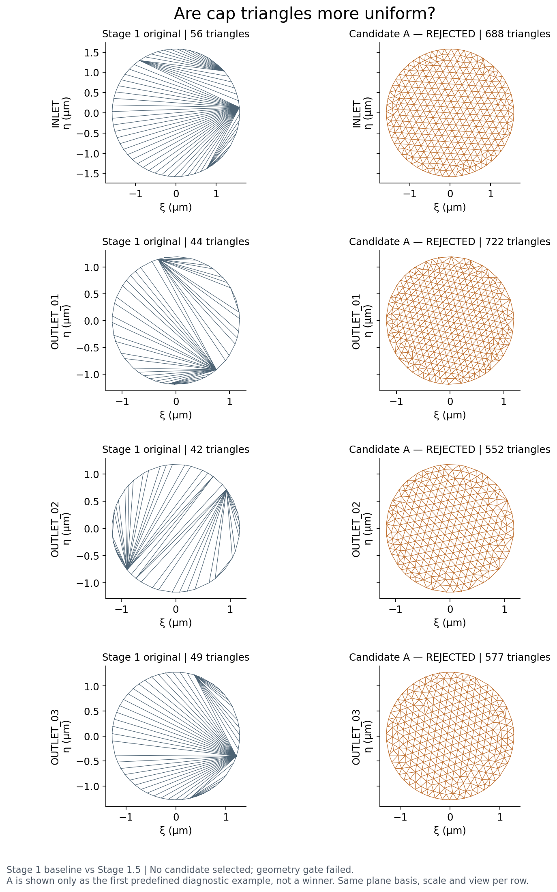
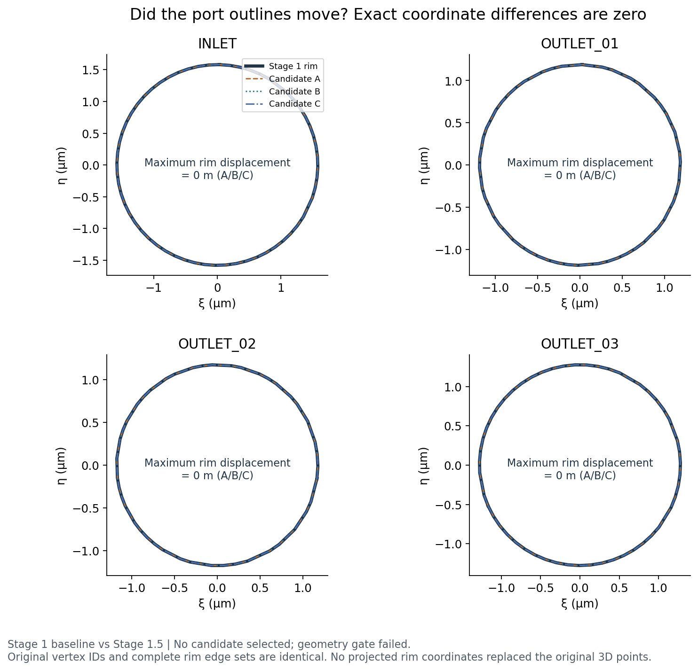
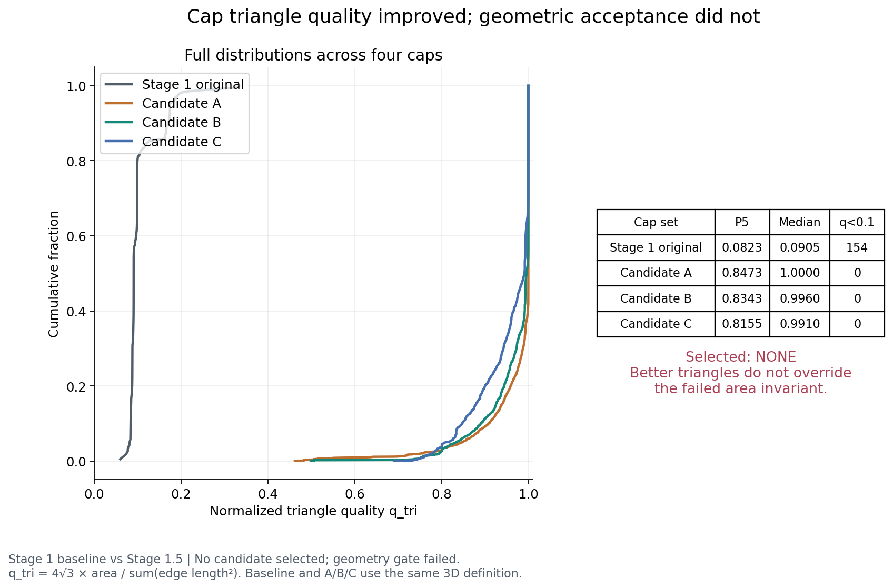
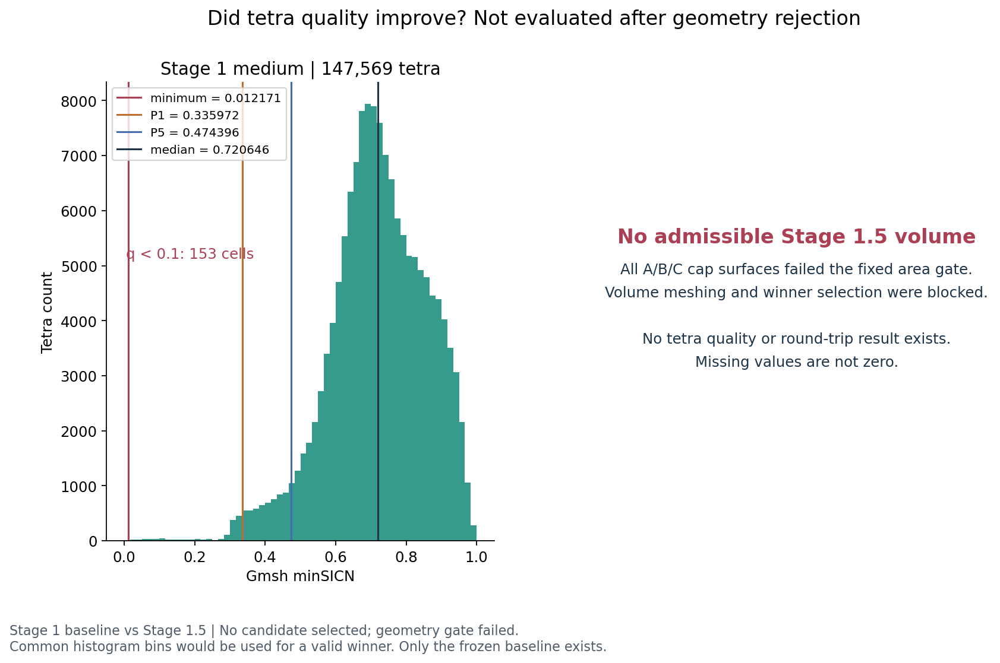
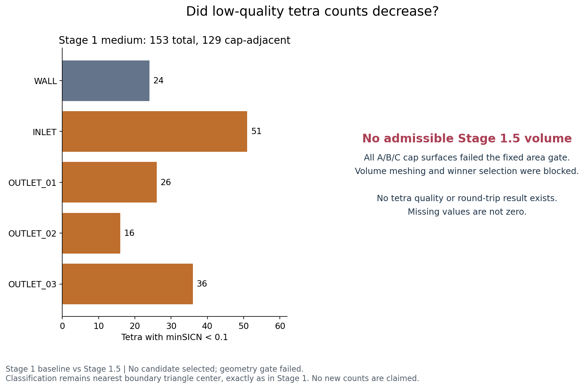
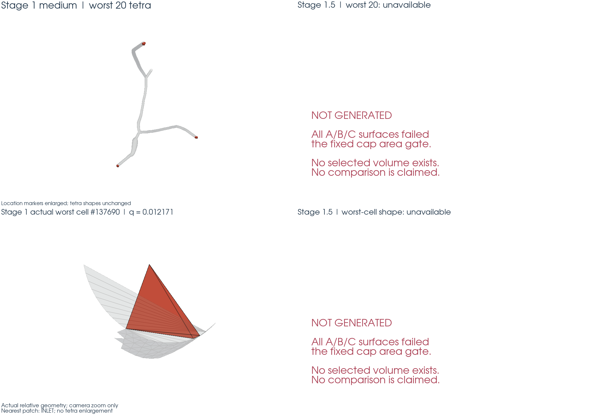
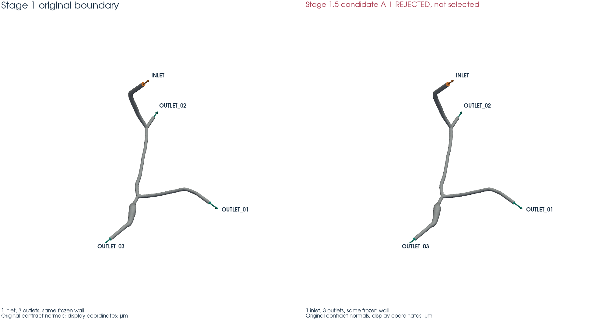
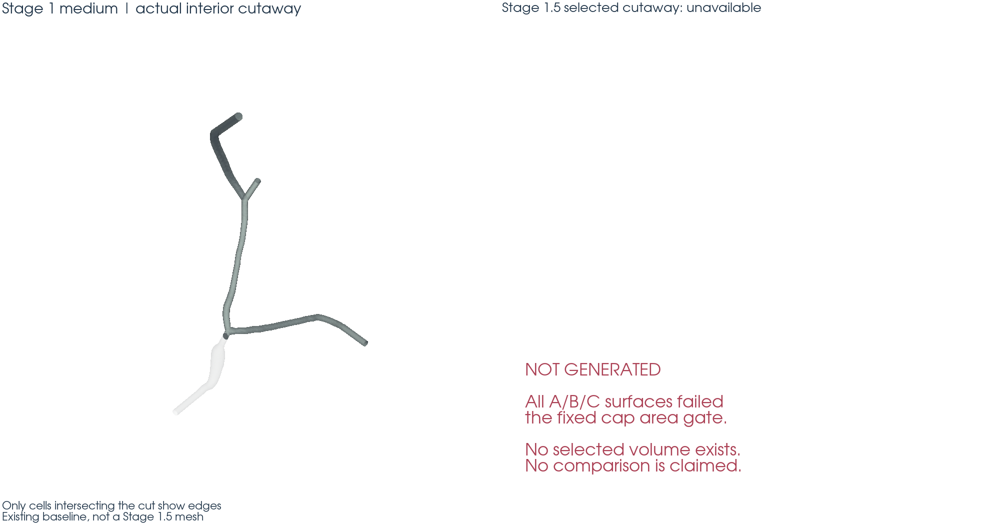

# Stage 1.5 — 人工端盖局部重网格与四面体质量改进

**STAGE 1.5 STATUS: FAIL。A/B/C 全部在 cap 三维面积不变性检查中被拒绝。没有 winner，没有新体网格，也没有替代 Stage 1 medium。**

严格保留了预先冻结的门槛，没有扩大候选搜索，没有放宽面积精度。三个候选的 cap 三角形显著改善，但面积相对差异为 6.295232e-10～2.994930e-09，超过 ≤10⁻¹² 的要求。按用户规定，在表面验证阶段停止后续网格生成；DOLFINx 1/2 rank round-trip 未执行，FEM 未求解，Stage 3 未开始。

## 为什么增加 Stage 1.5？

Stage 1 已证明真实血管体网格的几何、边界和标签正确。问题是人工 CFD cap 的离散方式可改进，不是血管重建本体需要修改。原 medium 的 153 个 minSICN<0.1 单元中，129 个按最近边界三角形中心归于四个 cap；已人工确认的最差单元 #137690 与 INLET 的细长放射状三角形相邻。

本阶段准备通过只修改 cap 内部三角连接，隔离它对四面体质量的影响。由于所有候选在几何先决条件处失败，**尚未完成该因果验证，不能宣称低质量四面体已减少**。

固定 baseline 原样采用用户指定数值，并核对了 Stage 1 原始文件 SHA：42,968 vertices，147,569 tetra，67,262 boundary facets；minSICN minimum=0.012171307762867093，P1=0.3359723496666575，P5=0.47439613749869236，median=0.7206460021439326，P95=0.9290835320561566。没有重算后修改 baseline。

## 什么东西允许改变？

只改变四个 cap 内部的 triangle connectivity，并新增位于原 cap 平面上的 interior Steiner points。保留原始顶点 ID 和 SI 坐标，新增点附加到数组末尾。候选 metadata 标记为 `derived CFD boundary triangulation`，不是新 anatomy 或改进的 vascular reconstruction。

## 什么东西完全不允许改变？

wall 顶点、三角连接和标签；cap rim 顶点和逐边连接；既定 plane origin/normal；端口面积、面积中心、法向和语义；extension length 和真实 vascular wall 均不允许改变。

三套候选 wall 三角形均为 67,071，maximum wall displacement=0 m；所有原 rim 顶点逐位相同，maximum rim displacement=0 m，rim edge set 完全一致。没有拟合圆、重排 rim、拆边、删点或投影替换原 rim。1 WALL、2 OUTLET_03、3 OUTLET_01、4 INLET、5 OUTLET_02 映射不变。

## 原始 cap 为什么容易产生坏 tetra？

原 cap 中的长径向边连接很短的轮廓边，形成大量细长三角形。体网格必须保留这些表面三角形，邻接四面体的形状会受到限制。四个 cap 都只有一个闭合 rim，全部 rim 顶点 degree=2，没有多环、开口或分叉。

| 端口 | entity | rim 顶点 / 边 | h_rim (m) | 原 cap 三角形 | source 最大平面偏离 (m) |
| --- | --- | --- | --- | --- | --- |
| INLET | 4 | 58 / 58 | 1.653198e-07 | 56 | 8.597128e-12 |
| OUTLET_01 | 3 | 46 / 46 | 1.203810e-07 | 44 | 1.308953e-11 |
| OUTLET_02 | 5 | 44 / 44 | 1.381566e-07 | 42 | 6.354757e-12 |
| OUTLET_03 | 2 | 51 / 51 | 1.458541e-07 | 49 | 1.457032e-11 |

下面左列为原始 cap，右列为预先定义的首个候选 A，仅作失败诊断示例，**不是 selected**；每个端口两侧使用相同平面坐标、尺度和视角，显示全部三角形边。

## 我们怎么重新铺 cap？

先从已验证的 tagged source adapter 按 entity 提取 cap，仅出现一次的三角形边定义 rim。通过独立闭环测试后，用原 contract 的 x0、n 构造确定性的右手正交基 t1、t2，投影实际 rim polygon 到二维，没有用等效圆替代。

Gmsh 4.15.2 使用 Frontal-Delaunay（Algorithm=6）。每条原 polygon edge 单独作为直线，并约束为仅含两个端点；生成后检查其内部节点数为零、端点集与原边一致。新内部点从二维反投影到原平面，rim 的三维坐标直接复用原始数组，不从二维重建。该约束 API 依据 [Gmsh 官方手册：setTransfiniteCurve](https://gmsh.info/doc/texinfo/#gmsh_002fmodel_002fmesh_002fsetTransfiniteCurve)。

二维覆盖验证包含精确 rim 边集、disk Euler 拓扑、正三角方向、点在 polygon 内、边与 polygon 的交叉检测、所有 bounding-box 相交三角形对的裁剪面积，以及总覆盖面积闭合。几何谓词按 polygon 尺度归一化；相对面积数值容差预先冻结为 10⁻¹²。三套候选均无检测到的孔洞、重叠或越界。合成恶意案例另行验证这些检查确实能拒绝错误。

## 三个 candidate 有什么区别？

在执行前写入 [acceptance_policy.json](acceptance_policy.json)，冻结时间 **2026-09-17T21:19:24.239722+00:00**，SHA256 为 `c1e6409c8afea3bf7f1b2cf271ab2743661043bd8379d7a4d3629acce142fe10`。候选只有 A/B/C，各端口用自己的原始 rim 边长中位数。预期 3D 设置固定为 Stage 1 medium 的 bulk size=5.0e−7 m、Algorithm3D=1 和相同内部优化；由于没有几何合格候选，**这些体网格步骤没有执行**。

| 候选 | h_cap/h_rim | cap 三角形总数 | 新增内部点 | 四面体数 | 表面生成及 QC (s) | 峰值 RSS (MiB) |
| --- | --- | --- | --- | --- | --- | --- |
| candidate_A | 1.0 | 2539 | 1174 | 未生成 | 1.005 | 141.4 |
| candidate_B | 1.25 | 1787 | 798 | 未生成 | 0.799 | 140.3 |
| candidate_C | 1.5 | 1397 | 603 | 未生成 | 0.700 | 140.7 |

没有 candidate_D/E、HXT、Netgen、bulk target 变化或额外 volume refinement。A 的首次计算遇到 NumPy 布尔值不能写入 JSON 的记录问题；修正为原生 bool 后仅按原参数重跑 A。两次输出表面数组逐位相同，初次日志和数组保留在 `failed_attempts/`，不是新的参数试验。

## 几何有没有变化？

**wall 和 rim 没动；严格的 cap 三维面积不变性没有满足，因此不能把候选认定为同一物理边界的合格替代。**

| 检查 | 全部候选的最不利结果 | 要求 | 结论 |
| --- | --- | --- | --- |
| wall triangle count | 67071 | 67071 | 通过 |
| 最大 wall 位移 | 0 m | 0 m | 通过 |
| 最大 rim 位移 | 0 m | 0 m | 通过 |
| rim edge set | 逐边相同 | 完全相同 | 通过 |
| 最大 port 面积相对误差 | 2.994930e-09 | ≤1e−12 | **失败** |
| 最大面积中心位移 | 1.752562e-13 m | ≤1e−12 m | 通过 |
| 最小法向点积 | 0.99999999999999989 | ≥1−1e−12 | 通过 |
| 新内部点最大平面偏离 | 1.417173e-20 m | 浮点舍入尺度 | 通过 |
| 闭合表面 | 1 component、0 boundary edges、0 nonmanifold edges | 同左 | 通过 |

四个端口的固定面积 gate 在 A/B/C 中全部失败：

| 端口 | A 相对面积误差 | B 相对面积误差 | C 相对面积误差 | 门槛 |
| --- | --- | --- | --- | --- |
| INLET | 6.299707e-10 | 6.300768e-10 | 6.295232e-10 | ≤ 1e−12 |
| OUTLET_01 | 2.584257e-09 | 2.593882e-09 | 2.595205e-09 | ≤ 1e−12 |
| OUTLET_02 | 7.253054e-10 | 7.279204e-10 | 7.287956e-10 | ≤ 1e−12 |
| OUTLET_03 | 2.994930e-09 | 2.992320e-09 | 2.988632e-09 | ≤ 1e−12 |

这不是需要加密才能消除的误差。原 VTP 坐标类型为 **float32**，冻结的 cap/rim 并不严格共面；最大偏离为约 6.35×10⁻¹²～1.46×10⁻¹¹ m。固定同一三维 rim 保持的是向量面积及其平面投影面积；三维三角形的标量面积总和仍依赖三角连接。当新内部点严格放到原平面上，旧有非共面 fan 与新三角化的标量面积不同。

以 INLET 为例，原始三维标量面积比投影面积高约 7.13×10⁻¹⁰（相对值）；A 的该差值约为 8.32×10⁻¹¹。二者相减正好对应约 6.30×10⁻¹⁰ 的面积变化。不能用投影面积偷偷替代 contract 的三维面积来通过 gate。

另用 `numpy.longdouble`（63 位尾数、epsilon≈1.08×10⁻¹⁹）独立重算，12 个失败均得到确认；投影面积相对变化最大仅 1.964944e-18，向量面积变化最大 1.965027e-18。因此本次差异不是普通 double 求和舍入造成。完整数据见 [area_invariant_analysis.json](area_invariant_analysis.json)。这只证明已冻结三候选不满足要求，并不声称排除了所有可能的三角化。

## 端盖三角形变好了吗？

是，但仅指端盖二维铺设得到的三维三角形质量，不等于四面体质量通过。统一使用 q_tri=4√3 Area/(l1²+l2²+l3²)，edge ratio 定义为最长边/最短边。

| 端口 | 原 cap P5 | 原 cap median | A median | B median | C median |
| --- | --- | --- | --- | --- | --- |
| INLET | 0.081877 | 0.090452 | 1.000000 | 0.999584 | 0.993121 |
| OUTLET_01 | 0.083352 | 0.087581 | 1.000000 | 0.998276 | 0.988564 |
| OUTLET_02 | 0.080754 | 0.097813 | 0.999974 | 0.991348 | 0.966599 |
| OUTLET_03 | 0.087199 | 0.098621 | 1.000000 | 0.994139 | 0.989347 |

四个端口合并统计：

| 表面 | cap 三角形 | q 最小值 | q P5 | q median | q<0.1 | q<0.2 | q<0.3 |
| --- | --- | --- | --- | --- | --- | --- | --- |
| Stage 1 | 191 | 0.059679 | 0.082344 | 0.090514 | 154 | 187 | 189 |
| candidate_A | 2539 | 0.462027 | 0.847318 | 1.000000 | 0 | 0 | 0 |
| candidate_B | 1787 | 0.498664 | 0.834338 | 0.996014 | 0 | 0 | 0 |
| candidate_C | 1397 | 0.690215 | 0.815466 | 0.991003 | 0 | 0 | 0 |

每个候选、每个端口的 q 最小值/P1/P5/median/P95/最大值、edge ratio 分位数、q<0.1/0.2/0.3 数量、Steiner 点和三角形数均保存于 `qc/surface_invariants.json`。原 cap 用同样公式计算，保存于 `baseline/cap_projection.json` 和 `baseline/cap_quality.npz`。

## 四面体质量真的改善了吗？

**未验证。** 三个 surface geometry gate 均失败，因此 A/B/C 的 tetra count、minSICN、edge ratio、q<0.1 数量及其边界归类全部记为 `null / NOT RUN`，不是 0。没有生成任何候选体网格。

固定的 engineering gates 仍为 cap-adjacent q<0.1 ≤38、total ≤76、P1≥0.3359723496666575、P5≥0.47439613749869236、median≥0.7206460021439326，并且零 inverted/degenerate/non-finite tetra。没有达成，也没有放宽；minimum 仍只是应报告的统计量，不是单独 hard gate。

以下两图只显示真实 Stage 1 baseline，右侧明确标出新结果因几何 gate 被阻止，不能作为改善证据。

## 新 worst cell 在哪里？

没有新体网格，所以没有新 worst cell，也不能宣称它从 cap 转移到了 wall/junction。保留原最差单元 #137690，minSICN=0.012171307762867093，nearest boundary=INLET。

下图左上定位原 worst 20，位置 marker 明确标注放大；左下仅改变相机缩放，显示真实最差四面体和周围表面，没有改变单元比例。右列不伪造 after。

## 为什么选这个 candidate？

**没有选择任何 candidate。** 按预先冻结规则，第一步只能让全部几何 gate 通过的候选进入排序。A/B/C 均因 cap area 失败而被排除，eligible set 为空。后续 cap-adjacent 数、total 数、P1、P5、tetra 数排序没有可用数据，不适用。

[candidate_selection.json](candidate_selection.json) 逐项记录排除原因和未执行步骤。图中 A 仅用于展示预先列表中第一个候选的铺设方式，不代表自动选择，也没有生成 `selected/` 网格目录。

## 自动测试

完整 pytest：**142 passed，0 failed，3 skipped**；本阶段保留用户指定的 14 个测试文件，共 41 个测试案例。

其中两个本阶段 round-trip 测试明确 skip：没有几何合格的 volume mesh，1 rank 和 2 rank reload 按 gate 禁止执行。另一个 skip 是原有 Stage 0 本地 DOLFINx 环境测试。**pytest 无失败表示检查逻辑和失败拦截按预期工作，不代表本阶段网格验收通过；本阶段仍为 FAIL。**

恶意测试包含移动一个 rim 顶点、split rim edge、删除 rim edge、三角形越界、hole、overlap、normal 反向、端口 identity 错换、wall 顶点移动/标签变化，以及“质量更差但 tetra 更少”的选择陷阱，均被正确拒绝。还核对原始 SHA、正交基、投影误差、原始 rim 的逐位复用、表面闭合性、候选面积判断和生成前阻断。

结果见 [pytest_results.xml](pytest_results.xml)。Stage 2 solver core 未修改；没有调用候选网格上的 Stokes、P2/P1/Real、速度、压力、λ 或 WSS 求解。

## 人工应该审核哪些图？

八个请求的文件名均保留为诊断图，但不存在 selected，因此其中四张体网格相关图只含原始 baseline 和“未生成”面板，**未完成原要求中的 selected before/after 体网格对比**。

| 图 | 本次实际内容 |
| --- | --- |
| [cap_triangulation_before_after.png](cap_triangulation_before_after.png) | 四个原 cap 对比被拒绝的 A；同尺度同视角，不称其 winner |
| [cap_triangle_quality.png](cap_triangle_quality.png) | 原 cap 与 A/B/C 的实测质量分布；selected=NONE |
| [tetra_quality_before_after.png](tetra_quality_before_after.png) | 原 minSICN histogram；after 未生成 |
| [low_quality_count_by_boundary.png](low_quality_count_by_boundary.png) | 原 153/129 及逐边界计数；新值未生成 |
| [worst_elements_before_after.png](worst_elements_before_after.png) | 原 worst 20 和 actual shape；新单元未生成 |
| [rim_overlay.png](rim_overlay.png) | 原 rim 与 A/B/C 完全重合，最大位移 0 m |
| [boundary_tags_selected.png](boundary_tags_selected.png) | 原标签对比被拒绝的 A，标题明确 not selected |
| [tetrahedral_cutaway_selected.png](tetrahedral_cutaway_selected.png) | 原 medium 的真实内部切面；selected 未生成 |

所有图在 WSL 生成，仅显示坐标转换为 µm；求几何面积和候选生成仍使用 SI。来源与图像 SHA 见 [visualization_manifest.json](visualization_manifest.json)。远程调用继续使用现有四个 wrapper，增加 `--stage 1.5` 映射到 `stage01_5`，没有第二套 SSH；没有安装新远端软件。每次运行保存 command、host、code/config/source SHA、stdout/stderr、runtime 和 peak RSS。**GPU used=false**。

## 还存在什么问题？

当前实际文件中的轻微非共面 rim 与严格三维面积不变性共同限制了这三种重铺方案。尚未有满足全部几何门槛的 candidate，因此没有做 3D 质量改进验证，没有做 FEM solve，没有证明新 mesh 的血流已收敛，也没有证明 Stage 3 求解一定稳定。

后续若继续，需要用户先决定如何处理冻结 contract 的三维面积约束与端盖非共面性；本次不修改其定义或容差，不移动 rim、不再搜索参数。当前结果不能用作真实血管生产计算输入。

历史保护重新全量审计 43,038 个只读参考条目：

| 只读参考工程 | modified | deleted | added |
| --- | --- | --- | --- |
| /home/lzy/projects/ulm_microbubble_traj_gen_2D | 0 | 0 | 0 |
| /home/lzy/projects/ulm_3D_vascular | 0 | 0 | 0 |

Stage 0/1/2 的 reports、outputs、logs、inputs 共 **1414 个文件**，集合、大小、SHA256 全部不变；所有本阶段之前的 `src/fem3d/*.py`（包括 Stage 2 核心）也保持原字节。用户预先存在的 Stage 1 报告排版修改原样保留。见 [history_preservation.json](history_preservation.json) 和 [reference_integrity.json](reference_integrity.json)。

## 是否建议替代 Stage 1 medium mesh？

**不建议替代。STAGE 1.5 STATUS: FAIL。**

面积 hard gate 未通过，不能写 CONDITIONAL PASS，也不能通过人工看图升级为 PASS。Stage 1 原 medium 完整保留，Stage 2 既有验证结论与源码未改。至此按用户停止规则结束，未开始 Stage 3。
