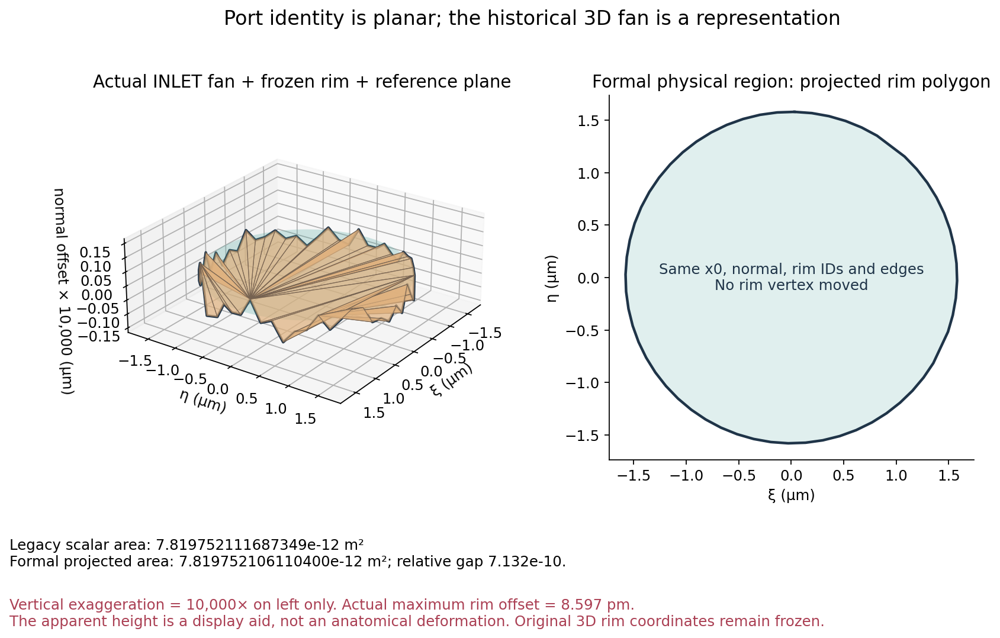
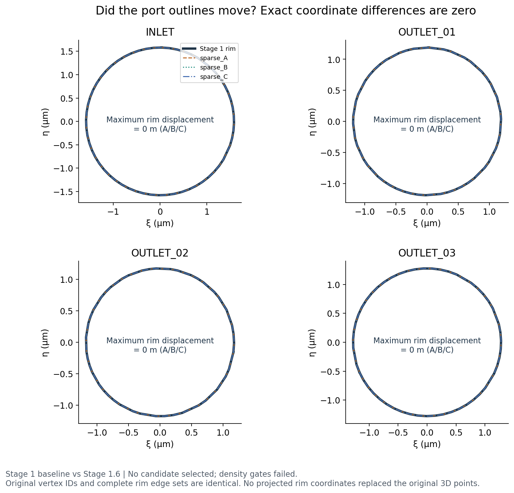
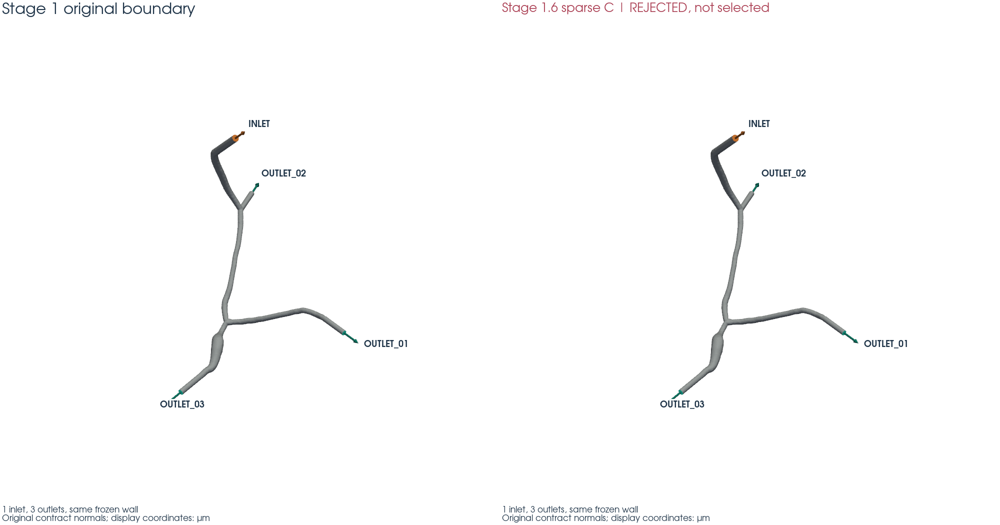
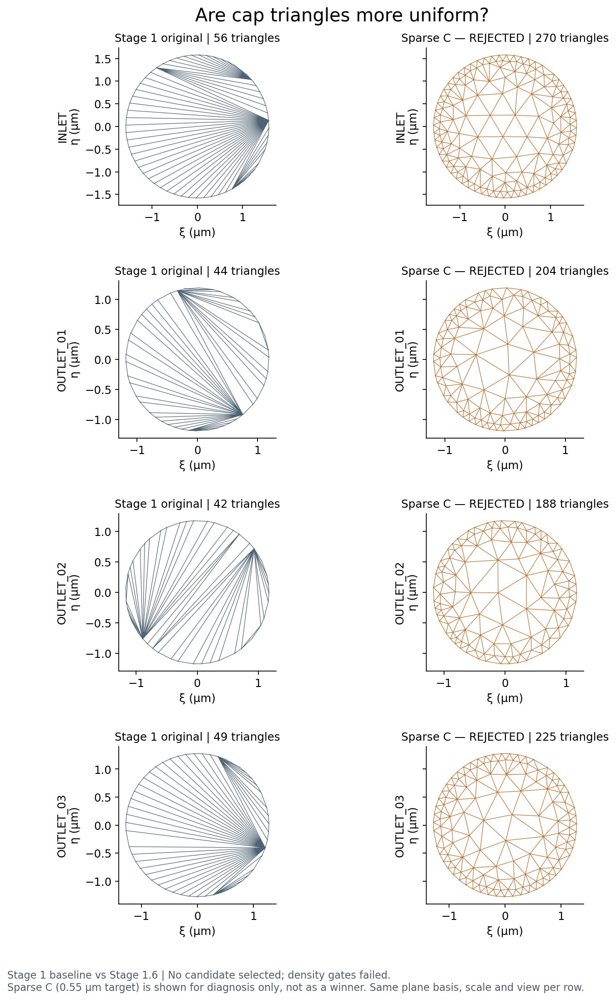
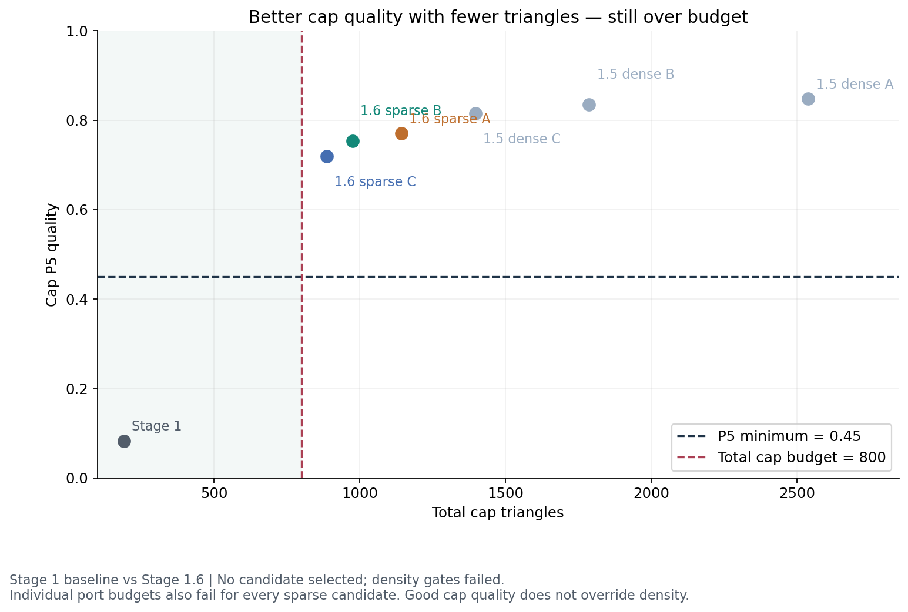
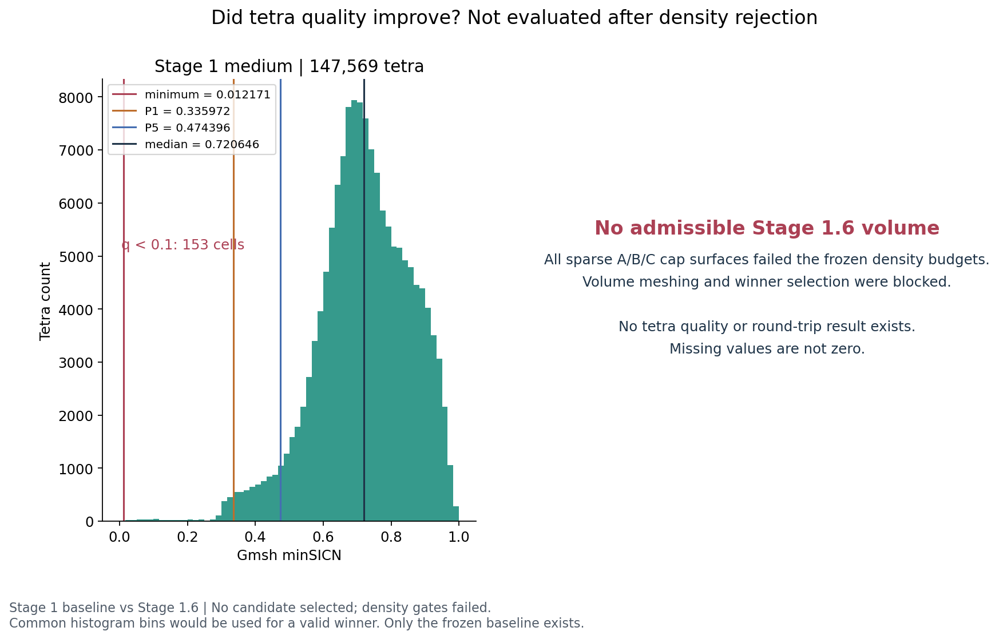
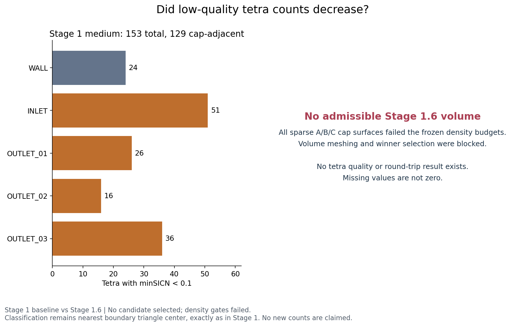
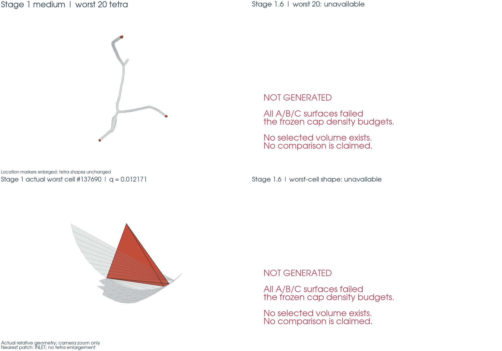
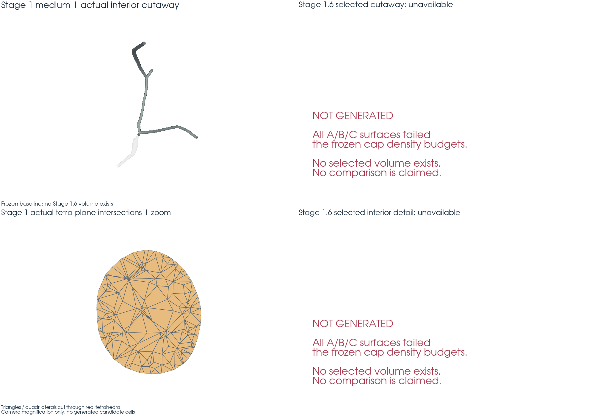
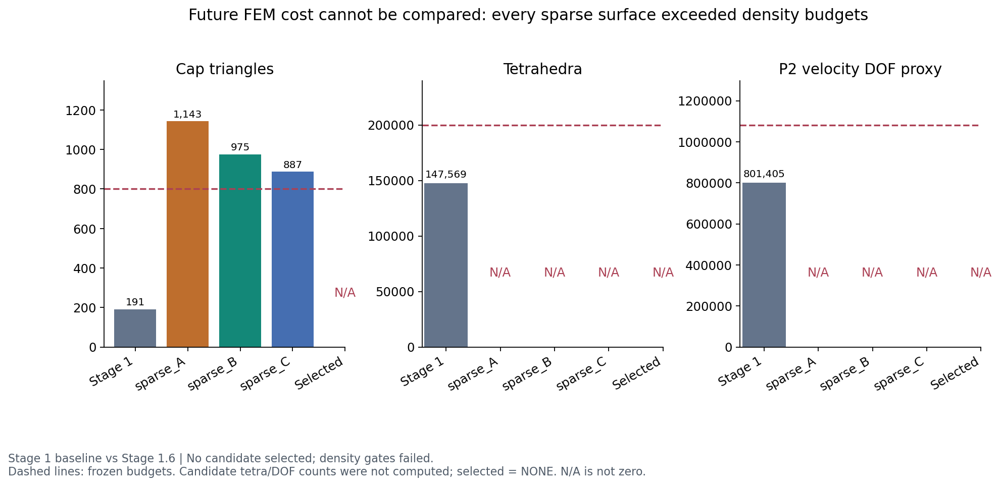

# Stage 1.6 — 平面端口契约与稀疏端盖重网格

**STAGE 1.6 STATUS: FAIL。三个候选的几何和 cap 质量通过，但全部超过冻结的端盖密度预算。没有 winner，没有生成候选四面体网格。**

## Stage 1.5 为什么失败？

Stage 1.5 的 A/B/C 保持 wall、rim、plane 和标签不变，端盖三角形质量明显改善，却未通过旧的 3D scalar triangle area 相对误差 ≤1e-12 门槛。其误差约 6.3e-10～3.0e-9；独立 longdouble 复核表明这不是 double 求和误差。原始 float32 VTP 的 rim 存在约 6e-12～1.5e-11 m 的非共面性，改变内部剖分就可能改变 3D 标量面积。

[Stage 1.5 分析](../stage01_5/area_invariant_analysis.json)和 **Stage 1.5 FAIL** 永久保留。本阶段没有把旧阈值改成 1e-8。

## Stage 1.6 改变了什么定义？

人工 CFD 端口现在由冻结的 3D rim 顶点/边、原始 x0、原始 outward normal、固定投影基和投影多边形定义。正式面积是 **A_projected_polygon**；正式中心是该平面多边形的面积中心。由有序 3D rim 直接积分得到的向量面积独立于 cap 内部剖分。

历史 scalar area 和 scalar-area centroid 继续保留为 provenance/diagnostic，每个候选仍记录实际 scalar triangle area。原始 rim 不移动、不投影替换；只有新增内部点放到原平面。WALL 是解剖表面，CAP 是人工 CFD 边界，修订人工端口面积的定义没有修改血管解剖。

[修订依据](PORT_CONTRACT_RATIONALE.md)、[v2 契约](planar_port_contract_v2.json)、[冻结策略](acceptance_policy.json)、[冻结哈希](freeze_lock.json)。Stage 0 source contract SHA256：`0635c4929d83269a3af6b3758d2a7dbac9ebd6f7d2068c5e21f401c317675721`。

| 端口 | legacy scalar area / m² | formal projected area / m² | legacy 相对 planar 差异 | rim 非共面性 / m |
| --- | --- | --- | --- | --- |
| INLET | 7.819752111687349e-12 | 7.819752106110400e-12 | 7.132e-10 | 8.597e-12 |
| OUTLET_01 | 4.416141896353052e-12 | 4.416141883645654e-12 | 2.877e-09 | 1.309e-11 |
| OUTLET_02 | 4.315070429664070e-12 | 4.315070426142216e-12 | 8.162e-10 | 6.355e-12 |
| OUTLET_03 | 5.110621775544013e-12 | 5.110621758668030e-12 | 3.302e-09 | 1.457e-11 |

候选 scalar area 相对 legacy scalar area 的**带符号变化**如下。全部公开，但不再作为端口身份 gate；两个正式面积不变量仍执行 ≤1e-12。

| 端口 | sparse_A | sparse_B | sparse_C |
| --- | --- | --- | --- |
| INLET | -6.315e-10 | -6.293e-10 | -6.315e-10 |
| OUTLET_01 | -2.596e-09 | -2.596e-09 | -2.597e-09 |
| OUTLET_02 | -7.282e-10 | -7.288e-10 | -7.285e-10 |
| OUTLET_03 | -3.000e-09 | -2.985e-09 | -3.002e-09 |

左图仅法向高度放大 10,000 倍，已明确标注；INLET 的真实最大偏离仅约 8.597 pm。

## 有没有改变血管几何？

没有移动 wall 或 rim。三个候选的 67,071 个 WALL 三角形坐标、连接及标签完全相同，maximum wall displacement = **0 m**，maximum rim displacement = **0 m**；rim vertex ID set、rim edge set、plane origin、reference normal、基向量和 entity mapping 完全一致。标签仍为 1=WALL、2=OUTLET_03、3=OUTLET_01、4=INLET、5=OUTLET_02，恰好 1 inlet、3 outlets。

每个曲面均为 1 个连通分量、0 条 boundary edges、0 条 nonmanifold edges，且朝向一致；每个 cap 是一个封闭 polygon loop，无孔洞、重叠或越界。覆盖检查同时使用边界身份、Euler disk 拓扑、点包含、边交叉和三角形相交面积，不以总面积相等替代拓扑检查。

两种独立面积计算为 longdouble rim shoelace 与实际投影三角形带符号面积求和。所有候选最大相对面积误差 **0.000e+00**；向量面积相对误差 **0.000e+00**。多边形中心位移 **0.000e+00 m**；三角形加权中心的独立交叉误差最大 **6.488e-23 m**。新增内部点偏离原平面的最大值 **1.416e-20 m**，小于 1e-15 m。原 rim 的历史非共面性原样保留。

图中 sparse_C 是失败候选的几何诊断示例，**不是 selected**。

## 为什么这次端盖更稀疏？

Stage 1.5 的三组 cap 分别有 2,539、1,787、1,397 个三角形，本次降到 1,143、975、887。运行前固定公式为：

`h(d) = h_rim + (h_center - h_rim) × min(d / (0.5 × sqrt(A_projected/π)), 1)`。

距离 d 是平面内到原 rim 线段的精确最小距离；h_rim 是原 3D rim 边长中位数。等效半径只用于尺寸过渡，没有把真实多边形拟合成圆。通过 [Gmsh 的尺寸回调接口](https://gmsh.info/doc/texinfo/#gmsh_002fmodel_002fmesh_002fsetSizeCallback)提供该确定性尺寸，二维算法固定为 6，每条原 rim 边约束为两个端点，不拆边。三个 center targets 为 0.35、0.45、0.55 µm。

策略在 **2026-09-17T22:00:38.316742+00:00** 冻结，早于所有远端候选；SHA256 为 `91074f6cd9191b3c3441717904a992086bfddc23ffd431d94eda17dbbe1547c3`。结果出来后未改公式、中心尺寸、过渡距离或任何预算。这一冻结方案虽然比 Stage 1.5 稀疏，但仍保留较多近 rim 小单元，**没有达到用户要求的稀疏预算**。

## 三个 sparse candidate

| 候选 | 中心尺寸 / µm | cap triangles | 新增 Steiner points | cap P5 | cap median | 结论 |
| --- | --- | --- | --- | --- | --- | --- |
| sparse_A | 0.35 | 1143 | 476 | 0.770014 | 0.981586 | 质量通过；密度 FAIL |
| sparse_B | 0.45 | 975 | 392 | 0.753308 | 0.963772 | 质量通过；密度 FAIL |
| sparse_C | 0.55 | 887 | 348 | 0.719207 | 0.965385 | 质量通过；密度 FAIL |

| 端口 | Stage 1 | 允许最大值 | sparse_A | sparse_B | sparse_C |
| --- | --- | --- | --- | --- | --- |
| INLET | 56 | 224 | 348 | 300 | 270 |
| OUTLET_01 | 44 | 176 | 274 | 230 | 204 |
| OUTLET_02 | 42 | 168 | 248 | 212 | 188 |
| OUTLET_03 | 49 | 196 | 273 | 233 | 225 |

总数上限是 800，而逐端口上限之和为 764；两套预算都必须满足。三候选四个端口分别超预算，总数也均超 800。因此全部拒绝，不进入 volume meshing。

左右使用相同投影基、尺度和视角。右侧是预定最大中心尺寸的 sparse_C，明确标注 REJECTED。

## 新端盖是否仍然质量足够？

足够。按实际 3D 面积计算 `q_tri = 4√3 × Area / Σ(edge²)`，三个候选都没有 q_tri<0.1 的三角形，P5≥0.45、median≥0.70，所有面积为正且有限。原端盖 P5≈0.082、median≈0.091。二维质量改善不能覆盖密度预算失败。

## 生成体网格后改善了吗？

**没有执行，不能证明改善。** 表面 gate 在体网格之前失败，因此没有任何 Stage 1.6 tetra、tetra QC、candidate P2 proxy 或 selected mesh。体网格路径仍锁定 Stage 1 medium 的 Algorithm3D=1、bulk=5e-7 m 和相同优化选项，但未对失败候选启动。没有 HXT、Netgen、局部 volume refinement 或扩大搜索。

| 指标 | Stage 1 medium | Stage 1.6 selected |
| --- | --- | --- |
| tetra | 147569 | 未生成 |
| minimum minSICN | 0.012171307762867093 | N/A |
| P1 | 0.3359723496666575 | N/A |
| P5 | 0.47439613749869236 | N/A |
| median | 0.7206460021439326 | N/A |
| q<0.1 | 153 | N/A |
| cap-adjacent q<0.1 | 129 | N/A |

分类继续使用 tetra center 到 exterior triangle center 的最近邻，与 Stage 1 一致，是位置诊断，不声称精确拓扑邻接。基线分类为 WALL=24、INLET=51、OUTLET_01=26、OUTLET_02=16、OUTLET_03=36。

## 新最差单元在哪里？

新体网格不存在，因此没有新最差单元。原基线 worst cell 为 **137690**，minSICN=0.012171307762867093，最近边界为 INLET。图中保留基线实际 worst 20 和最差单元形状；位置标记放大与相机放大均已标注，没有改变 tetra 相对几何。

内部剖面取自真实 Stage 1 medium tetra；右侧明确注明 selected 不存在。没有用旧网格冒充新结果。

## 后续 FEM 会不会明显更贵？

本次无法给出新体网格成本结论。基线只按拓扑统计，没有创建 FEM 空间：

| 计数 | Stage 1 medium |
| --- | --- |
| N_vertex | 42968 |
| N_edge | 224167 |
| N_tetra | 147569 |
| N_P2_scalar_proxy | 267135 |
| N_P2_velocity_proxy | 801405 |
| N_P1_pressure_proxy | 42968 |

`P2 scalar = N_vertex + N_edge`，`P2 velocity = 3 × (N_vertex + N_edge)`，`P1 pressure = N_vertex`。冻结预算：tetra≤200,000，P2 velocity proxy≤1.35×801,405=1081896.75。这只是拓扑自由度成本代理，未估算具体求解时间或内存。

所有新体网格相关值都写为 N/A/未执行，不能从较好的 cap 质量推断未来 FEM 更便宜。

## 为什么选择 winner？

**没有选择 winner。** 第一层完整 surface gate 已淘汰全部候选。冻结规则要求先满足 geometry、cap quality、cap density、tetra quality、tetra budget 和 P2 budget，再依次按最少 P2 DOF、最少 tetra、最少 cap-adjacent low、最少 total low、最高 P1 排序。排序的后续指标没有被计算或虚构。

[选择记录](candidate_selection.json)、[质量对比](quality_comparison.json)、[成本对比](cost_comparison.json)。未生成 `outputs/stage01_6/selected/`；仅 winner 才允许执行的 1-rank/2-rank DOLFINx round-trip 均未执行。

## 自动测试

完整 pytest：**217 passed、0 failed、5 skipped**，见 [pytest_results.xml](pytest_results.xml)。Stage 1.6 新增二十个永久测试模块，共 75 passed、2 skipped。新增跳过项仅为无 selected 时禁止执行的两项 round-trip；历史跳过项另有三项。测试通过不等于候选符合实验门槛。

恶意回归覆盖：rim 坐标移动、拆边、改法向、改投影面积、反转向量面积、孔洞、重叠、cap 超密、质量合格但 tetra>200,000、质量优秀但 P2>1.35×基线，以及两个质量合格候选必须选择较低 DOF。体积审计在冻结基线上重算了原 minSICN 和最近边界计数；新候选 volume 路径未获得运行验证。

第一次完整测试被 SIGTERM（退出 143）中断，日志保留、未计为通过；随后完整重跑产生上述正式 XML。没有修改历史测试或降低断言。

历史完整性：1538 个 Stage 0/1/1.5/2 reports、outputs、logs、inputs 文件的集合、大小、SHA256 全部相同；所有预存 `src/fem3d/*.py`（含 Stage 2 solver core）哈希相同。开始前已有的 Stage 1 报告格式修改保持原字节，未被本阶段提交。两个只读参考工程均 **0 modified / 0 deleted / 0 added**（完整 43038 项清单）。证据：[history_preservation.json](history_preservation.json)、[reference_integrity.json](reference_integrity.json)。

## 人工应该审核什么？

WSL 生成并逐图检查了下列十张图。由于没有 winner，四张依赖新体网格的对比图保留真实基线并显示“未生成”；两个表面图只展示明确标识的失败候选。文件名中的 selected 不代表存在 selected artifact。

- [cap_triangulation_before_after.png](cap_triangulation_before_after.png) — Actual baseline vs rejected C cap triangulations; no selected cap exists
- [cap_density_quality_tradeoff.png](cap_density_quality_tradeoff.png) — Actual baseline, Stage 1.5 dense and Stage 1.6 sparse cap density versus P5
- [port_contract_explanation.png](port_contract_explanation.png) — Actual INLET historical fan, fixed rim and plane; vertical exaggeration explicitly 10000x; formal projected region
- [mesh_cost_comparison.png](mesh_cost_comparison.png) — Measured cap counts and baseline topology proxy; candidate volume and DOF absent because surface density failed
- [tetra_quality_before_after.png](tetra_quality_before_after.png) — Baseline histogram with explicitly unavailable Stage 1.6 comparison
- [low_quality_count_by_boundary.png](low_quality_count_by_boundary.png) — Frozen boundary counts and explicit missing candidate values
- [rim_overlay.png](rim_overlay.png) — Actual exact rim overlays for all three candidates; none selected
- [worst_elements_before_after.png](worst_elements_before_after.png) — Actual baseline worst 20 and worst-cell shape; candidate volume panels explicitly unavailable
- [boundary_tags_selected.png](boundary_tags_selected.png) — Source vs rejected C boundary tags; filename retained for requested review list, no selected surface claimed
- [tetrahedral_cutaway_selected.png](tetrahedral_cutaway_selected.png) — Existing baseline interior cutaway with actual tetra-plane section zoom; no candidate volume exists

## 还没有证明什么？

没有证明稀疏 cap 在冻结密度预算内可行，没有证明新 tetra 质量改善、P2 成本满足预算或 DOLFINx selected round-trip 通过。没有求真实 vascular flow，没有创建 velocity/pressure/lambda 空间，没有 Stokes、Navier–Stokes、WSS 或流线计算；没有 mesh convergence，也没有证明 Stage 3 solution 收敛。

远端仅运行三次 CPU cap meshing/QC（GPU used=false）；WSL 是唯一源码来源，沿用现有 probe/sync/run/fetch，所有新证据进入 stage01_6。环境、命令、源代码/配置/输入 SHA、stdout/stderr、运行时间和 RSS 随远端回传日志及候选 metadata 保留。

## 最终状态

**STAGE 1.6 STATUS: FAIL。** 失败原因为 sparse_A/B/C 全部违反逐端口及总 cap 密度预算。平面端口契约的几何验证和二维质量通过不足以把该阶段升级为 CONDITIONAL PASS。

未添加 sparse_D/E，未调参或放宽预算。Stage 1.5 仍为 FAIL，Stage 2 core 保持冻结。停止于 Stage 1.6，没有进入 Stage 3。
