# Stage 1.7 — 自适应端盖网格优化

**STAGE 1.7 STATUS: CONDITIONAL PASS。首个真实体网格 `iteration_00` 满足全部自动门槛，等待用户人工审核。**

低质量四面体总数 **153 → 3**，其中 cap-adjacent **129 → 0**。P2 velocity proxy **801,405 → 804,528（+0.390%）**。冻结策略、真实搜索、独立重复、新进程重载、测试与历史审计均有记录；没有开始 Stage 3。

## 为什么不再用固定 800 个三角形？

不同模型的端口数量、尺寸和 rim 分辨率不同，绝对 cap triangle 数不能直接代表三维 FEM 成本。本阶段继续记录全部 cap triangle 数，但取消其 hard gate，也不使用逐端口四倍基线限制。真正控制真实体网格的 `C_P2 ≤ 1.35` 和 `C_tetra ≤ 1.35`，两者均相对于程序重新读取的 Stage 1 development_medium。

[baseline_recomputed.json](baseline_recomputed.json) 从原 volume NPZ 重算 vertices、unique edges、tetra、minSICN 分布及同一最近边界分类，并逐项对照历史 evidence；所有检查一致。算法不含当前模型的基线计数常量。

## 算法自动调整什么？

四个 port 各自拥有内部最大尺寸 H。初始 H 从 Stage 1 medium 的 bulk target 读取。尺寸函数固定为 `h(d) = min(H, h_rim + 1.0 × d)`，d 是平面内到原 rim 线段的精确最小距离。每次实际生成 cap 后先检查几何，再检查正且有限的面积、零个 q_tri<0.1、P5≥0.45、median≥0.70。

合格时 H 乘 1.25，直到首次质量失败、达到 2R_eq 或耗尽试验额度；初始失败则除以 1.25，至合格或 h_rim 下限。有 pass/fail bracket 时最多执行 4 次 log(H) 二分。从全部**实际测试且合格**的表面选三角形数最少者，同数时选更大 H。本次所有初始试验合格，没有触发二分；二分、初始失败和非单调选择由回归测试覆盖。这里的“最粗”仅指有界搜索中已测试的合格结果，不证明连续参数空间的全局最优。

实现见 [adaptive_port.py](../../src/fem3d/adaptive_port.py)、[adaptive_surface.py](../../src/fem3d/adaptive_surface.py)；真实执行由 [optimize_stage017.py](../../scripts/optimize_stage017.py) 驱动。

## 哪些东西永远不能动？

wall、原 3D rim vertex IDs/坐标/边、plane origin、outward normal、投影基、projected port region 和 labels 全部冻结。每条 Gmsh rim curve 仅保留原两个 endpoint，不拆边、不平滑、不拟合圆。原 rim 不投影替换；只有新增内部点落在固定平面。

直接引用 [Stage 1.6 planar-port v2](../stage01_6/planar_port_contract_v2.json)，SHA256：`cf2dae365fde86ee02d92dbb1b1c97602f40c7adcce7a706551acf385cb96dc9`。Stage 0 source contract SHA256：`0635c4929d83269a3af6b3758d2a7dbac9ebd6f7d2068c5e21f401c317675721`。Stage 1.7 仅保存逐字节副本，没有修改端口定义或建立新版本。legacy 3D scalar triangle area 继续保留在每个 trial 的诊断字段，不参与正式面积 gate。

## 算法怎么知道哪个 port 需要进一步处理？

先生成实际三维网格，再按 Stage 1 的同一方法，将 tetra center 分类到最近的 exterior triangle center。该方法是位置诊断，不声称严格拓扑邻接。

仅在 cap 总低质量数仍超限、且贡献最大的 port 计数大于零时，允许将这个 port 的 H 除以 1.20；同数时按名字排序。其余三个 port 原样复用上一轮表面和参数，新 cap 重新通过几何与质量检查。成本超限立即停止；cap gate 已通过而整体仍失败时不继续细化 cap，记录 `NOT_CAP_CORRECTABLE`。

本次 `iteration_00` 已可行，因此**没有实际执行反馈细化**。单端口控制测试和真实已保存 cap 的重新组合测试验证了“只改变一个 port、其余三个物理三角形集合不变”，并未额外生成体网格。

## 怎么防止算法无限尝试？

冻结上限为每端口 8 次 surface trials、每次执行最多 5 个 volume iterations、整个阶段最多 5 个新 volume meshes。按运行前公开的保守解释，每端口 8 次包含初始搜索和后续反馈；5 个体网格包含独立确定性重跑。没有另开预算。用尽额度仍无可行解就 FAIL，任何 gate 均不放宽。

本次生产搜索共 32 次 cap 试验，1 次真实体网格；独立重复执行再生成 1 次体网格，总计 **2/5**。selected 是已有合格 iteration 的复制，重载仅计算质量，没有再生成网格。[volume_mesh_ledger.json](volume_mesh_ledger.json) 保存实际计数。

策略于 **2026-09-17T22:58:26.448792+00:00**、所有 adaptive search 之前冻结。SHA256：`e51fae547b3e246afe681090de6cfff316e865f99146c561ea6da01d148587ed`。见 [acceptance_policy.json](acceptance_policy.json) 和 [freeze_lock.json](freeze_lock.json)。最终校验仍为同一 SHA；grading slope、搜索因子、容差和预算均未按结果修改。

## 有没有硬编码微米尺寸？

**没有针对当前血管写死 cap 尺寸。** h_rim 来自各 port 原 3D rim 边长中位数；R_eq = sqrt(A_projected/π)；h_volume 从 Stage 1 medium metadata 读取，本次读到 **5.000000000000e-07 m**。R_eq 仅用于尺寸诊断及指定的 2R_eq 搜索停止条件，绝不重建几何。二维计算按当前 h_rim 归一化；实际输出恢复 SI，并逐位复用原 3D rim。

真实 Gmsh 合成测试包含椭圆和轻微不规则凸多边形。形状及 volume target 同时缩放 0.5×、1×、4×；同形状选中 trial、三角形连接和数量完全一致，H 同比例变化，归一化质量差在冻结的 1e-10 内。

| 形状 | 缩放 | selected trial | 实际 H（合成长度单位） | 三角形 |
| --- | --- | --- | --- | --- |
| ellipse | 0.5 | trial_07 | 0.788766424966 | 130 |
| ellipse | 1.0 | trial_07 | 1.57753284993 | 130 |
| ellipse | 4.0 | trial_07 | 6.31013139973 | 130 |
| mild_irregular_convex_polygon | 0.5 | trial_07 | 0.939613917913 | 126 |
| mild_irregular_convex_polygon | 1.0 | trial_07 | 1.87922783583 | 126 |
| mild_irregular_convex_polygon | 4.0 | trial_07 | 7.51691134331 | 126 |

这些测试使用实际 rim 多边形，没有圆拟合。首次合成脚本因远端 NumPy 对二维 cross 的兼容性变化，在产生任何试验前退出；修复为显式二维行列式后完成测试。失败日志保留，未改变任何策略或添加搜索预算。证据：[synthetic/results.json](../../outputs/stage01_7/synthetic/results.json)。

## 端盖表面结果

| 端口 | 试验数 | selected trial | h_rim / m | R_eq / m | selected H / m | 三角形 before → after | Steiner | P5 | median |
| --- | --- | --- | --- | --- | --- | --- | --- | --- | --- |
| INLET | 8 | trial_07 | 1.653197744524e-07 | 1.577689577478e-06 | 2.384185791016e-06 | 56 → 196 | 70 | 0.532916 | 0.941764 |
| OUTLET_01 | 8 | trial_02 | 1.203809917079e-07 | 1.185622882857e-06 | 7.812500000000e-07 | 44 → 168 | 62 | 0.606665 | 0.926639 |
| OUTLET_02 | 8 | trial_07 | 1.381565723103e-07 | 1.171976781434e-06 | 2.343953562868e-06 | 42 → 150 | 54 | 0.643764 | 0.913669 |
| OUTLET_03 | 8 | trial_07 | 1.458541054475e-07 | 1.275445581093e-06 | 2.384185791016e-06 | 49 → 161 | 56 | 0.537861 | 0.907060 |

所有端口 q_tri<0.1 均为 0；总 cap triangles **191 → 675**，新增 **242** 个内部 Steiner points。合并 cap 的 P5 **0.082344 → 0.581697**，median **0.090514 → 0.913045**，q_tri<0.1 **154 → 0**。

OUTLET_01 的 trial_02 实际有 168 个三角形，后续更大 H 的试验有 172 个，因此选 trial_02。没有假定 H 与 triangle count 严格单调。全部真实试验的 NPZ、几何检查、H/h_rim/R_eq、quality、Steiner count 和 runtime 保存在 [surface_trials](../../outputs/stage01_7/surface_trials/)；本次无失败的血管 cap trial。

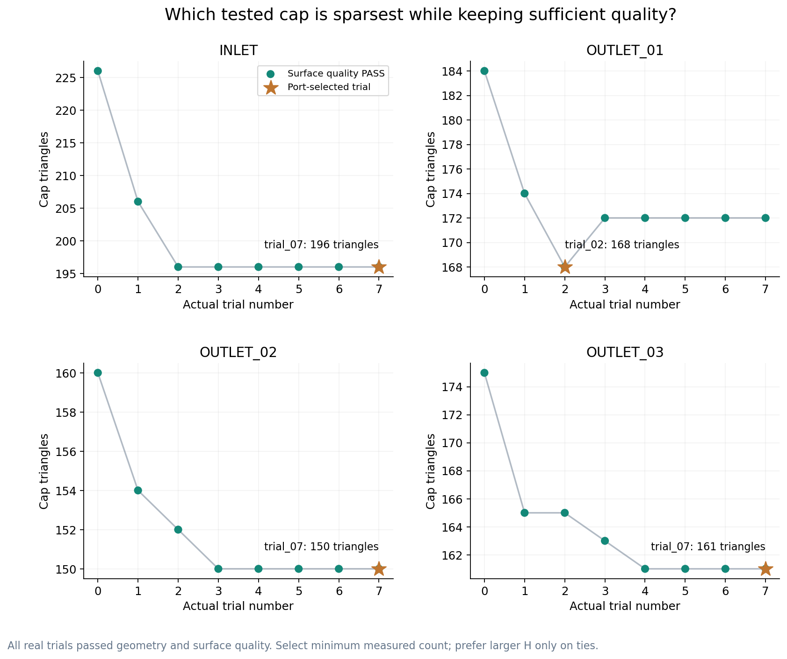

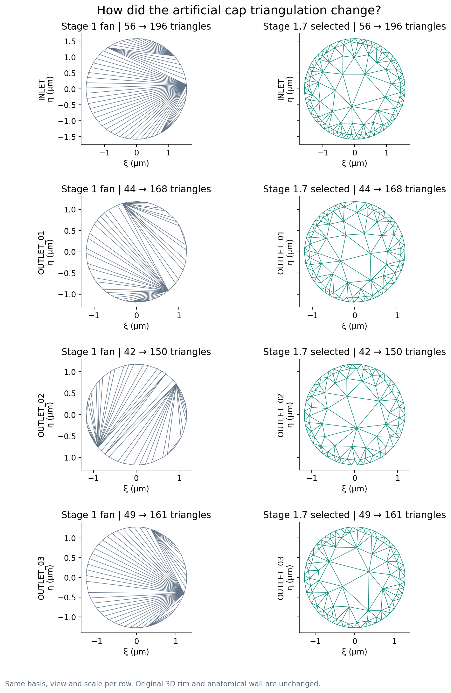

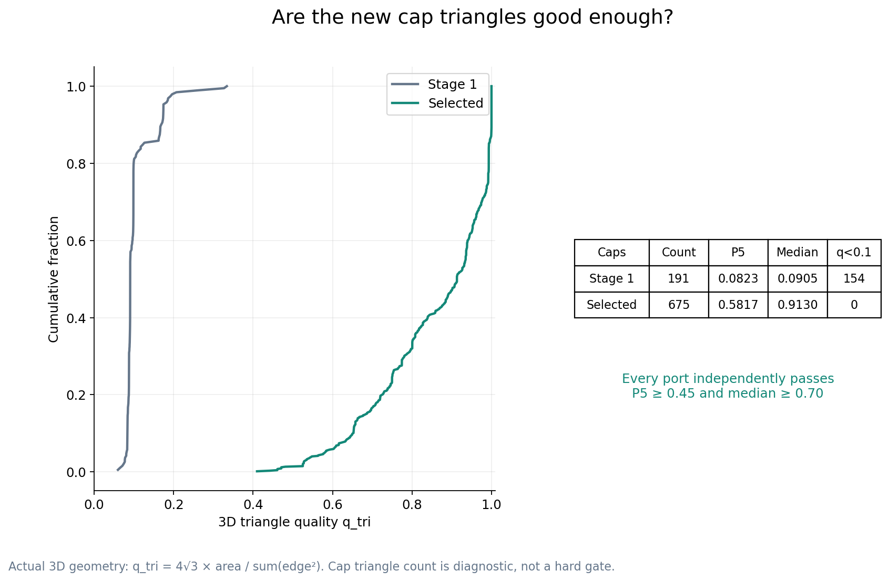

## 3D tetra 真正改善了吗？

**是，已用实际生成的体网格测量。** 沿用从 Stage 1 medium 读取的全部有效选项：Algorithm3D=1、相同 bulk size、相同优化配置，无 HXT、Netgen 或额外 volume refinement。网格生成耗时 2.538 s，进程 peak RSS 297,980 KiB；这不是未来 FEM 求解成本测量。

| 指标 | Stage 1 medium | selected | 正式门槛 |
| --- | --- | --- | --- |
| minimum | 0.012171307763 | 0.062380170310 | 仅诊断 |
| P1 | 0.335972349667 | 0.351343233439 | 不低于 baseline |
| P5 | 0.474396137499 | 0.485670578367 | 不低于 baseline |
| median | 0.720646002144 | 0.721855606189 | 不低于 baseline |
| minSICN < 0.1 总数 | 153 | 3 | ≤ 76 |
| cap-adjacent 低质量数 | 129 | 0 | ≤ 38 |

minimum 改善为诊断结果；正式分位数 gate 是 P1、P5、median 均不下降，仅容许 1e-12 最后舍入误差。低质量阈值始终是 minSICN<0.1。相对计数门槛由 baseline 自动计算：floor(0.30×B_cap)=38，floor(0.50×B_total)=76；零基线分支要求继续为零。

| 最近边界分类 | baseline low | selected low |
| --- | --- | --- |
| WALL | 24 | 3 |
| INLET | 51 | 0 |
| OUTLET_01 | 26 | 0 |
| OUTLET_02 | 16 | 0 |
| OUTLET_03 | 36 | 0 |

selected：零 inverted、零 degenerate、零 non-finite tetra，一个连通 fluid domain，全部 boundary tags 完整。最终边界全部 67,746 个三角形与输入表面坐标、带标签连接精确一致，DOLFINx 转换通过。体积闭合相对误差 2.700e-16。

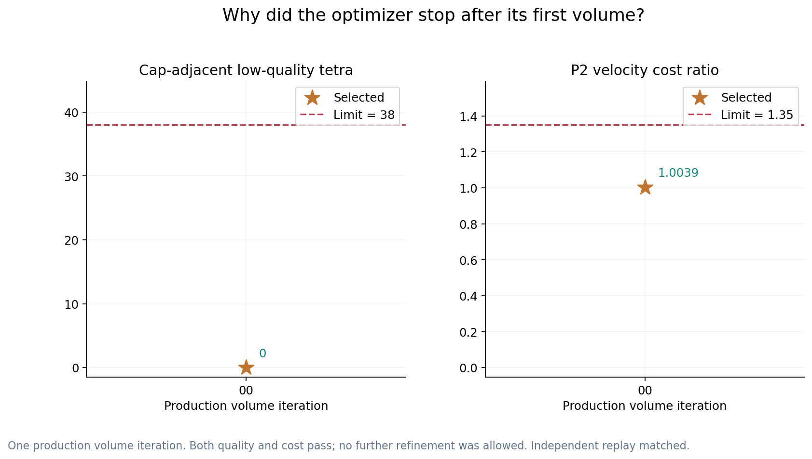

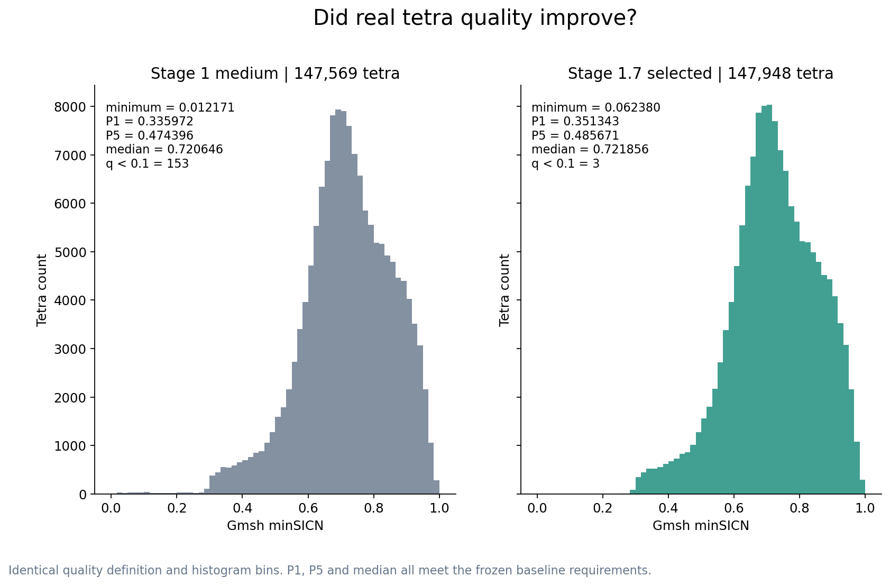

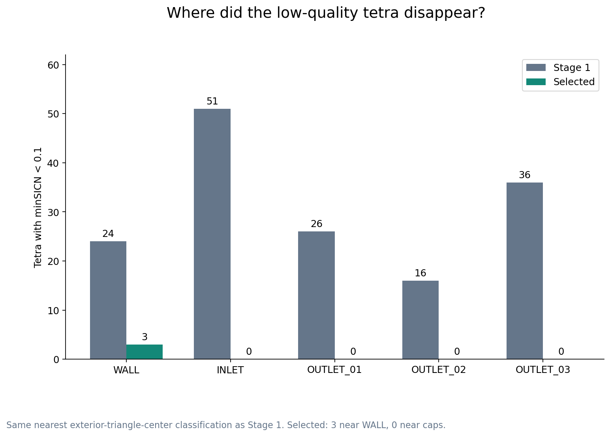

最差单元由基线 #137690（最近 INLET）变为 selected **#138695**（最近 **WALL**），minSICN=0.062380170310。其中心 SI 坐标为 `[0.00010288867568969726, 4.43209171295166e-05, 0.0001397490692138672]`，体积 1.459750129279e-23 m³、最长/最短边比 3.164342。余下 3 个低质量单元均分类到 WALL，不推断其为特定 junction 病理位置。

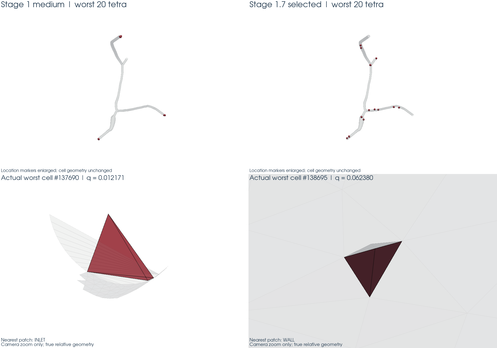

上下图分别展示位置与真实单元形状。位置标记放大已标注；近景分别调整相机倍率，未改变单元顶点或相对形状。

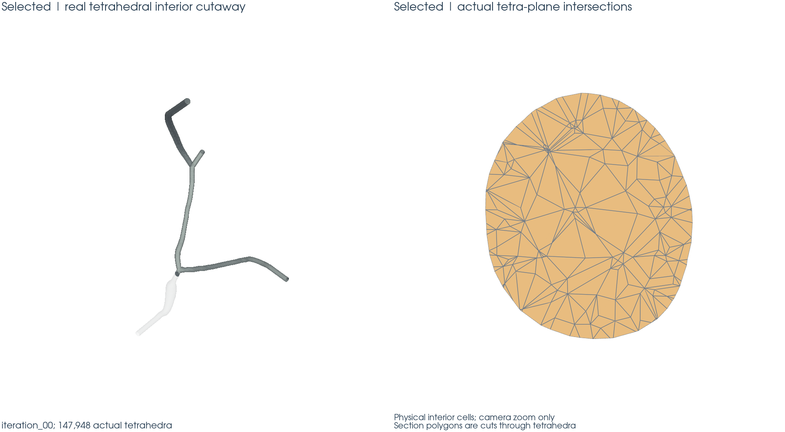

## 优化过程发生了什么？

| iteration | 修改哪个 port | 为什么生成 | P2 cost ratio | low total / cap | 结果 |
| --- | --- | --- | --- | --- | --- |
| iteration_00 | NONE（组合初始四端口） | 四个独立表面搜索均合格 | 1.003896906 | 3 / 0 | ACCEPT |

iteration_00 的 changed port = NONE 表示没有执行上一轮后的反馈细化；其输入为四个独立搜索选中的 cap。没有生产 iteration_01。每轮调整前/后参数、surface/volume QC、成本与下一步决策都保存在 [adaptive_decision_log.json](adaptive_decision_log.json)。该日志的 `FEASIBLE_PENDING_ROUNDTRIP` 是生产进程结束时的原始状态；后续重载结果见下方独立记录，最终阶段状态见 [final_status.json](final_status.json)。

另一次独立执行完整优化器，H、全部试验的 canonical geometry/connectivity、体网格 quality summary、selected iteration 和 termination reason 均一致。canonical hash 按物理坐标排序、重编号并规范化元素连接，不依赖进程中的实体编号，不做几何舍入。见 [determinism_comparison.json](determinism_comparison.json)。这是验证重跑，不是新的优化候选。

## 最终为什么停止？

**`FIRST_FEASIBLE_ACCEPTED`**。`iteration_00` 同时通过 geometry、surface、volume validity、tetra quality 和 cost，因此立即保存并停止生产循环。没有为了进一步提高 P5 而生成更细网格。

选择函数只检查真实合格历史，依次最小化 P2 velocity proxy、tetra 数、cap-adjacent low count；本次只有一个生产可行 iteration，因此直接选它。不能将有界搜索结果解释为对所有可能剖分的最小 DOF 证明。

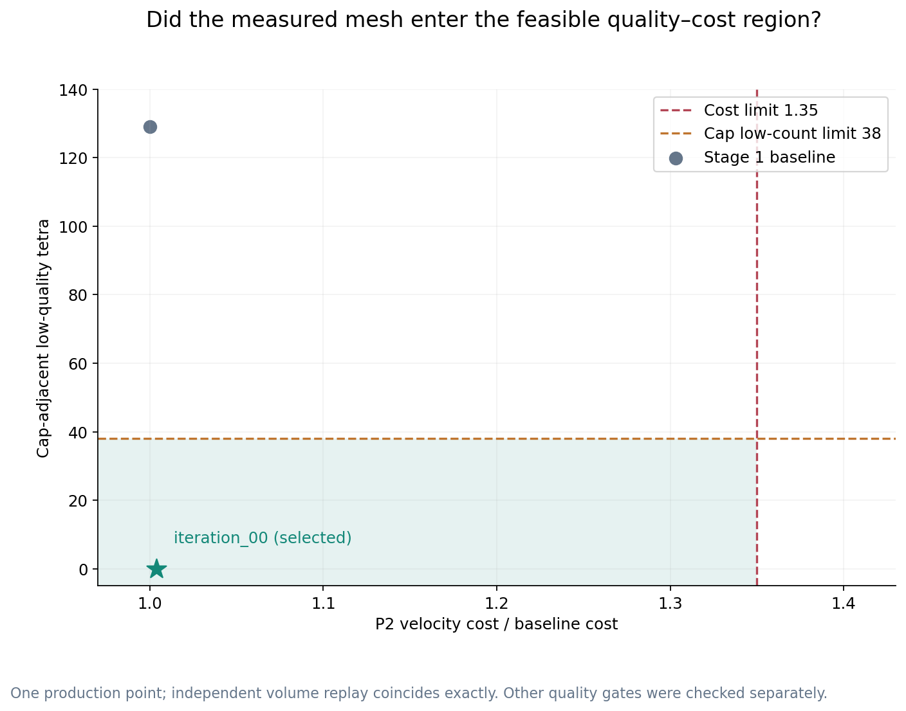

## 未来 FEM 成本是多少？

| 拓扑计数 | baseline | selected | 相对增长 |
| --- | --- | --- | --- |
| N_vertex | 42,968 | 43,178 | +0.488736% |
| N_edge | 224,167 | 224,998 | +0.370706% |
| N_tetra | 147,569 | 147,948 | +0.256829% |
| N_P2_scalar_proxy | 267,135 | 268,176 | +0.389691% |
| N_P2_velocity_proxy | 801,405 | 804,528 | +0.389691% |
| N_P1_pressure_proxy | 42,968 | 43,178 | +0.488736% |

`P2 scalar = N_vertex + N_edge`，`P2 velocity = 3 × (N_vertex + N_edge)`，`P1 pressure = N_vertex`。**C_P2=1.003896906059、C_tetra=1.002568290088，均 ≤1.35**。没有创建任何 FEM function space；这些是拓扑自由度代理，不能直接推算求解时间、矩阵非零数或内存。

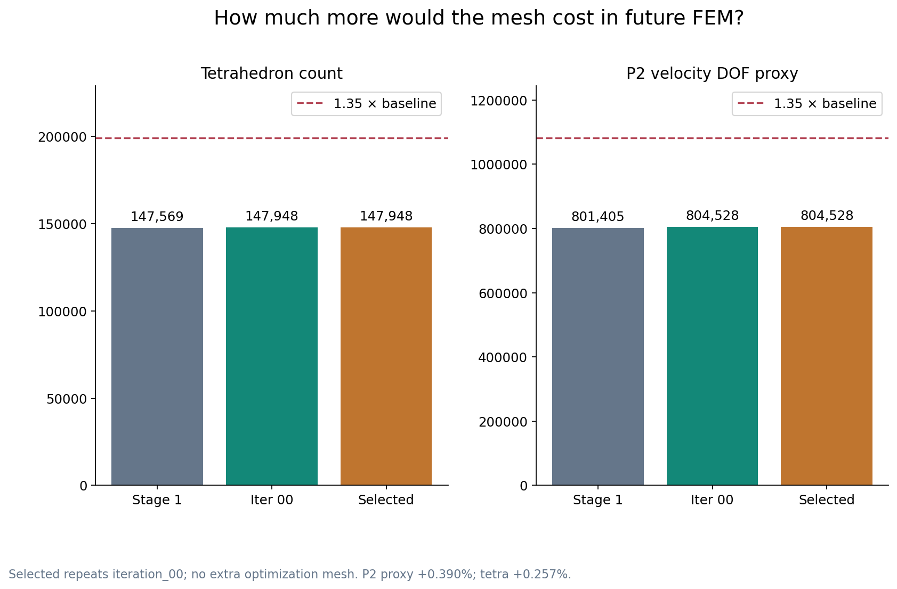

## 是否改变了血管几何？

没有改变冻结的解剖 wall 或人工端口身份。67,071 个 wall triangles 的原连接、坐标、标签完全一致。最大 wall displacement **0.0 m**，最大 rim displacement **0.0 m**；rim IDs 和 edge sets 精确一致。

最大 projected area relative error **0.000e+00**，最大 vector area relative error **0.000e+00**；projected centroid displacement **0.000e+00 m**。投影三角形面积和加权中心又独立核算，中心交叉误差最大 5.800e-23 m。normal dot source 最小 1.0000000000000000；新增内部点的最大平面偏离 1.384e-20 m。

全部 cap 无孔洞、无重叠、无越界；组合表面一个连通分量、零 boundary/nonmanifold/inconsistent edges。保持一入口、三出口和原 entity mapping。证据：[surface_invariants.json](../../outputs/stage01_7/selected/qc/surface_invariants.json)、[volume_quality.json](../../outputs/stage01_7/selected/qc/volume_quality.json)。

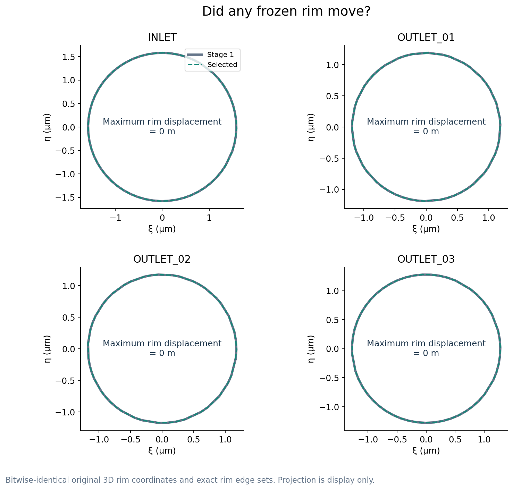

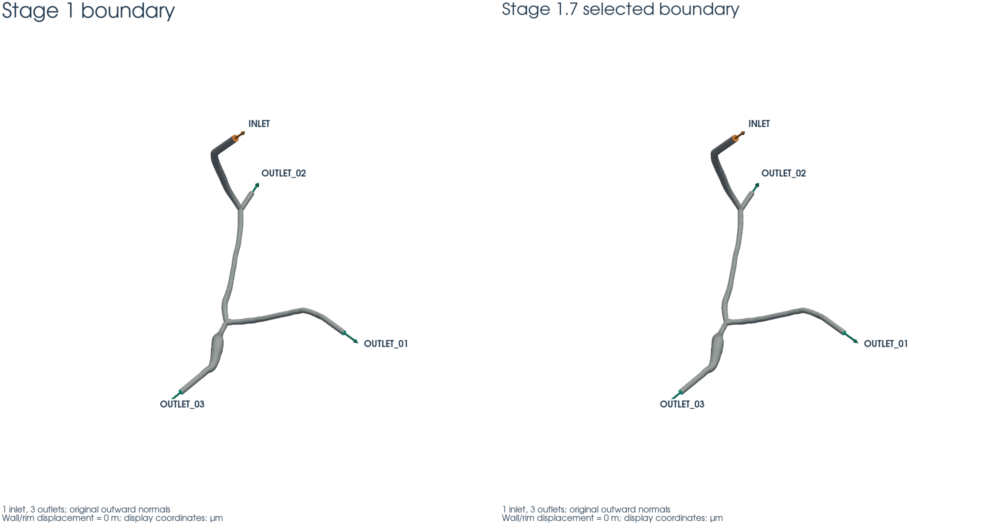

## 自动测试

完整 pytest：**267 passed、0 failed、5 skipped**。Stage 1.7 的 21 个永久测试模块共 **50 passed、0 failed、0 skipped**；五个跳过均来自历史阶段，不作为本阶段通过证据。见 [pytest_results.xml](pytest_results.xml)。全套测试后只修正了成本图数字格式和最差单元相机近景，重新生成图并通过图像 hash/尺寸专项检查。

测试覆盖：baseline 重算、冻结 SHA、尺寸函数精确线段距离、scale/non-circle 实测、非单调表面选择、搜索和停止边界、超过 800 三角形但质量合格的表面不被数量拒绝、恶意 rim/area/normal/holes/overlaps/outside 修改、真实 tetra 测量、零 baseline 分支、成本两个 1.35 gate、first feasible、最多迭代、单端口复用、WALL 不可由 cap 修复、较低 DOF 历史选择、确定性、1/2 rank 重载及历史保护。

仅 selected 执行 DOLFINx save/reload：独立新进程的 [1-rank](../../outputs/stage01_7/selected/qc/reload_r1.json) 与 [2-rank](../../outputs/stage01_7/selected/qc/reload_r2.json) 均 PASS。完整核对全部 tetra 的 canonical 物理几何、cell/facet tags、port identity、拓扑、体积及质量摘要。重载后的 minSICN 由 Gmsh quality API 对加载到的 tetra **重新计算**；未调用 mesh generation，未仅照抄保存摘要。XDMF/HDF5 SHA 一致，进程 PID 独立，无 FEM solve。

历史完整性：[history_preservation.json](history_preservation.json) 对 Stage 0/1/1.5/1.6/2 的 reports、outputs、logs、inputs 共 **1643** 个文件逐项校验集合、大小、SHA256，零变化；全部预存 fem3d 源文件，包括 Stage 2 solver core，哈希不变。开始时已有的 Stage 1 报告格式修改保留原字节，未纳入本阶段提交。两只读参考项目共 **43038** 项完整清单，**0 modified / 0 deleted / 0 added**，见 [reference_integrity.json](reference_integrity.json)。Stage 1.5 FAIL 和 Stage 1.6 FAIL 永久保留。

## 人工需要审核什么？

以下 12 张图均在 WSL 从实际 artifact 生成并完成可读性核查，SHA 与输入来源见 [visualization_manifest.json](visualization_manifest.json)。仍需要用户审核网格形状、端口身份、最差单元位置、剖面和质量/成本取舍，不能由自动测试代替。

- [adaptive_surface_search.png](adaptive_surface_search.png) — 各端口试验如何减少三角形，最终选了哪一次？
- [port_mesh_before_after.png](port_mesh_before_after.png) — 原 fan 与新 cap 的实际三角化有什么变化？
- [surface_quality_before_after.png](surface_quality_before_after.png) — 端盖三角形质量是否足够？
- [adaptive_volume_trace.png](adaptive_volume_trace.png) — 实际体网格迭代何时达到门槛并停止？
- [tetra_quality_before_after.png](tetra_quality_before_after.png) — 低质量四面体是否减少，分位数是否保持？
- [low_quality_count_by_boundary.png](low_quality_count_by_boundary.png) — 剩余低质量单元最靠近哪类边界？
- [quality_cost_pareto.png](quality_cost_pareto.png) — 实际网格是否进入冻结的质量和成本可行区？
- [mesh_cost_comparison.png](mesh_cost_comparison.png) — 为改善质量，未来 FEM 拓扑成本增加多少？
- [worst_elements_before_after.png](worst_elements_before_after.png) — 最差 20 个单元在哪里，最差单元实际长什么样？
- [rim_overlay.png](rim_overlay.png) — 原始 rim 是否有任何移动？
- [boundary_tags_selected.png](boundary_tags_selected.png) — 入口、出口、wall 和向外法向是否保持？
- [tetrahedral_cutaway_selected.png](tetrahedral_cutaway_selected.png) — selected 是否具有真实四面体内部？

## 还没有证明什么？

没有真实 blood-flow solve，没有 velocity/pressure/lambda/Q 求解，没有 Stokes、Navier–Stokes、WSS 或 streamlines。没有 FEM mesh convergence，没有 Stage 3 solution validation，也没有实际 FEM 时间/内存测量。合成测试只覆盖两类形状和指定尺度；不能证明任意复杂或非凸端口都能满足冻结门槛。生产案例未触发 volume-feedback refinement，不能声称已在该血管上验证多轮细化的改善。

WSL 是唯一源码来源；远端仅通过既有 sync/run/fetch wrappers 执行 CPU meshing、QC、确定性重跑与 DOLFINx I/O。环境为 Gmsh 4.15.2、DOLFINx 0.11.0，GPU used=false。命令、源码/输入 SHA、stdout/stderr、时间、RSS 保存在 [logs/stage01_7](../../logs/stage01_7/) 和 [remote_return](../../outputs/stage01_7/remote_return/)；结果导入清单见 [artifact_manifest.json](artifact_manifest.json)。

## 最终状态

**STAGE 1.7 STATUS: CONDITIONAL PASS。** Selected 为 `iteration_00`，终止原因 `FIRST_FEASIBLE_ACCEPTED`，全部自动 hard gates、独立确定性、1/2 rank roundtrip、测试和历史审计通过。

等待用户人工审核。本阶段停止，不自动进入 Stage 3，不将 CONDITIONAL PASS 自动升级为 PASS。
