# Stage 1.8 — 使用 MMG3D 修复残余坏单元，并用 TetGen 独立复核

**STAGE 1.8 STATUS: CONDITIONAL PASS，等待用户人工审核。**

生产推荐：**KEEP_STAGE017**。两次 MMG 均增加低质量单元且超过成本预算，未提供可采用的改进。
独立 benchmark：**TETGEN_QUALITY_WORSE**。TetGen 更便宜，但低质量尾部显著变差；它没有参与生产选择。

本报告对应新的 MMG/TetGen Stage 1.8。按用户明确批准，上一版证据按原目录结构归档至
[archive/stage018_residual_v1](../../archive/stage018_residual_v1/README.md)，原提交为 `28c9413`，
325 个文件逐项 SHA256 相同。旧版 `USE_REPAIR_01` 仅保留为历史记录，未作为本次输入或推荐。
Stage 1.7 的正式 PASS 来自用户已完成人工审核的说明，历史报告原文保持。

## 为什么不再自己写局部修复算法？

split、collapse、swap、smoothing 和 remeshing 由成熟工具内部实现。本项目新增代码只负责格式转换、
冻结边界与标签、残余诊断、尺寸 metric、工具调用、统一质量/成本、DOLFINx 重载和证据。
Gmsh 在本阶段只导入现有 tetra 并计算 minSICN，不调用网格生成或优化。
旧版 `residual_*` 源码按历史冻结；当前实验没有调用其中的修复或重铺路径。

先进行远端只读探测，确认没有可用 MMG/TetGen，再安装 conda-forge 的预编译包到独立
`remote/.mesh_tools_env`。没有源码编译、没有 vendor 源码、没有向 `remote/.env` 安装包。

| 工具 | 版本 | build | 许可证 |
| --- | --- | --- | --- |
| mmg | 5.8.0 | vtk_h2ce0c04_15 | LGPL-3.0-only |
| tetgen | 1.6.0 | hecca717_2 | AGPL-3.0-or-later |

格式转换采用 meshio 5.3.5；其不支持的本项目 scalar `.sol` 与带 marker 的三角 PLC 只使用最小适配器。
[工具探测](tool_probe.json)、[确切工具清单](tool_manifest.json)、[环境 yml](../../remote/mesh_tools_environment.yml)
和 [explicit package lock](../../remote/mesh_tools_explicit.txt) 保存版本、build、包地址、包哈希和 binary 哈希。
最终 [环境审计](tool_environment_integrity.json) 复核安装包 SHA256、包内许可证和原 FEM 环境的
198 项 Python/conda 元数据哈希，均保持一致。

安装准备中第一次 dry-run 使用包名 `mmg`，解析失败，未安装任何包；根据
[MMG 官方安装说明](https://mmgtools.org/install.html) 改用正式包名 `mmgsuite` 后冻结并安装。
第一次 synthetic MMG smoke 发现 meshio 的 Medit binary v3 与该 binary 读入不兼容，报 dimension 0；
随后改用成熟库输出的 Medit ASCII v2（17 位有效数字），再次 synthetic smoke 通过。
这些准备失败与日志完整保留；正式 MMG_A、MMG_B、TetGen 各只执行一次，未修改科学参数或重试正式实验。
新证据单测开发时另有日志扩展名、质量 JSON 描述字段差异导致的 4 项测试失败，修正测试读取后纳入完整验收；
初次失败记录保留在 [pytest_assessment.xml](pytest_assessment.xml)，没有因此重跑 mesher。

## 输入网格目前有什么问题？

唯一基线是冻结的 `outputs/stage01_7/selected`，未重新生成。
重新校验全部源 artifact SHA，并在远端对全部 147,948 个 tetra 计算 Gmsh 4.15.2 minSICN，
与 Stage 1.7 数组逐项比较，容差 1e-12。所有基线门槛通过，见 [输入验证](input_verification.json) 和
[重新计算的 QC](baseline_recomputed.json)。P2 velocity proxy 为 804,528，
低质量单元 3 个，最近 cap 的低质量单元为 0。

| 网格 | N_low | q_min | P1 | P5 | median | P95 | 最近 cap / WALL |
| --- | --- | --- | --- | --- | --- | --- | --- |
| Stage 1.7 | 3 | 0.062380170310 | 0.351343233439 | 0.485670578367 | 0.721855606189 | 0.929312719306 | 0 / 3 |

| Stage 1.7 cell index | minSICN | 质心 (µm) | 最小 / 最大二面角 (°) | 最长/最短边 |
| --- | --- | --- | --- | --- |
| 138694 | 0.088714544589 | 102.899408, 44.332693, 139.793919 | 8.606378 / 171.824061 | 5.874648 |
| 138695 | 0.062380170310 | 102.888676, 44.320917, 139.749069 | 3.791154 / 172.095300 | 3.164342 |
| 146001 | 0.097159964383 | 145.073132, 88.000967, 89.679474 | 11.063864 / 150.184983 | 9.069004 |

三个单元均最近 WALL；前两个共享一个三角面。这里“最近 cap/WALL”沿用 Stage 1/1.7 的
tetra 质心到 exterior triangle 质心最近距离分类，不能解释为直接共享该类边界面。
[新诊断数据](../../outputs/stage01_8/diagnostics/residual_cells.json) 从本次重新评估的质量数组及原始坐标生成。
cell index 为原始数组的 0-based 下标，不用于跨 mesher 的身份追踪。

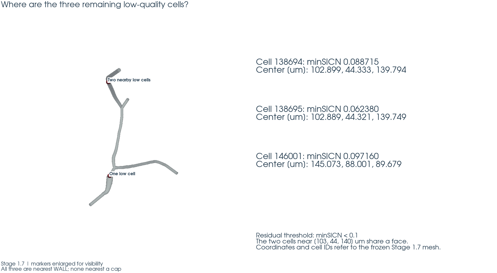

## MMG_A 做了什么？

保持表面不动，让 MMG 尝试重新整理内部 tetra。正式使用 `-nosurf -optim`，不提供局部 metric。
`-optim` 会在 MMG 内部构造尺寸信息并优化；不能把它理解为保证 tetra 数量不变。
选项语义以本机 [MMG 帮助](mmg_help.txt) 和 [官方选项说明](https://mmgtools.org/tutorials/tutorials_detailed_options.html) 为依据。
接口兼容细节、实际 flags 和准备失败说明见 [MMG_INVOCATION.md](MMG_INVOCATION.md)。

转换输入、refs、元数据和原始输出分别保存在 `outputs/stage01_8/mmg_A/input/`、`mesh/`、`run/`、`qc/`。
该大写目录是早期运行目录 `mmg_a` 的同一文件系统别名，不代表第二次实验。
输出首先检查 wall/cap/rim 位移、三角连接、refs 和独立提取的 tetra exterior，记录时间早于质量计算。
MMG_A 的 missing `.sol` 提示表示采用 `-optim` 默认 metric，退出码为 0。

三次正式实验的原始命令如下，SHA/起止时间/资源限制在各自 `run/execution.json`：

```text
/workspace/formal_3D_flow_solver_FEM_lzy/remote/.mesh_tools_env/bin/mmg3d_O3 -nosurf -optim -in /workspace/formal_3D_flow_solver_FEM_lzy/outputs/stage01_8/mmg_a/input/volume.mesh -out /workspace/formal_3D_flow_solver_FEM_lzy/outputs/stage01_8/mmg_a/mesh/result.meshb
```

```text
/workspace/formal_3D_flow_solver_FEM_lzy/remote/.mesh_tools_env/bin/mmg3d_O3 -nosurf -sol /workspace/formal_3D_flow_solver_FEM_lzy/outputs/stage01_8/mmg_B/input/local_metric.sol -in /workspace/formal_3D_flow_solver_FEM_lzy/outputs/stage01_8/mmg_B/input/volume.mesh -out /workspace/formal_3D_flow_solver_FEM_lzy/outputs/stage01_8/mmg_B/mesh/result.meshb
```

```text
/workspace/formal_3D_flow_solver_FEM_lzy/remote/.mesh_tools_env/bin/tetgen -pYqC /workspace/formal_3D_flow_solver_FEM_lzy/outputs/stage01_8/tetgen/input/surface.poly
```

| 正式实验 | 外部 binary 时间 (s) | peak RSS (KiB) | 退出码 |
| --- | --- | --- | --- |
| MMG_A | 2.468181 | 444972 | 0 |
| MMG_B | 2.419336 | 445028 | 0 |
| TETGEN | 0.966424 | 179648 | 0 |

以上时间/RSS 仅针对独立 runner 中的一次外部 binary，不含适配器、QC 和 DOLFINx。
每次限制 1 thread、300 s、8 GiB；三个工具进程均成功退出。

## MMG_A 有效吗？

**作为生产修复无效，REJECT。** 边界和有效性通过，P1/P5/median 提高，但 N_low 从 3 增至 6，
q_min 从 0.062380170310 降至 0.014232910258；C_P2=1.204224092、C_tetra=1.275718496，均超过 1.10。
不能以整体分布改善掩盖最差单元和成本退步。

| 网格 | N_low | q_min | P1 | P5 | median | P95 | 最近 cap / WALL |
| --- | --- | --- | --- | --- | --- | --- | --- |
| Stage 1.7 | 3 | 0.062380170310 | 0.351343233439 | 0.485670578367 | 0.721855606189 | 0.929312719306 | 0 / 3 |
| MMG_A | 6 | 0.014232910258 | 0.545737564875 | 0.617474464672 | 0.794665554045 | 0.943086683054 | 0 / 6 |
| MMG_B | 6 | 0.014933325771 | 0.542889830673 | 0.615692889604 | 0.793392267101 | 0.942968755763 | 0 / 6 |

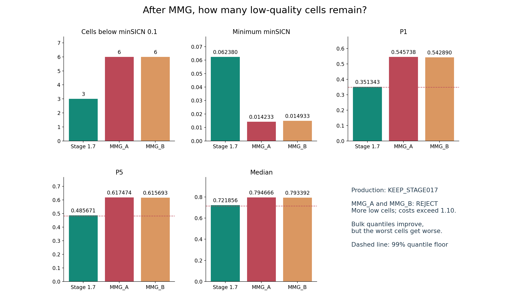

## 为什么需要/不需要 MMG_B？

**需要，已执行一次。** MMG_A 的 N_low 没有减少，q_min 也未改善，符合启动条件。
MMG_B 重新从 Stage 1.7 原网格出发，未在 A 输出上继续加工。
根据共享 tetra 面构造 1/2-ring；每个顶点的 h_base 是其唯一 incident edges 长度的中位数。
残余顶点、1-ring-only、2-ring-only 和外部顶点分别使用 0.70、0.80、0.90、1.00 倍 h_base。
这些无量纲比例在运行前冻结，无微米硬编码。请求写入 MMG 原生 scalar `.sol`，由 `-nosurf -sol` 交给 MMG。

[acceptance_policy.json](acceptance_policy.json) 与 [repair_policy.json](repair_policy.json) 的冻结 SHA256 均为
`a5921364cec0f1fe2bcf60364f0906c4a18bc186ecc3ce6ea2338d62422cdfc5`，见 [freeze_lock.json](freeze_lock.json)。
metric SHA256 为 `d9dd8e8eae5db9e8d4f537ced29dbdd6bf71244f03281e918806e1d16d2b8168`，在 MMG_B 开始前已写入其输入元数据。

## MMG_B 有没有全局加密？

**metric 的额外缩小请求仅在局部，但实际 MMG 体网格变化覆盖全域，成本仍明显增加。**
9 个残余顶点取 0.70，3 个 1-ring-only 顶点取 0.80，6 个 2-ring-only 顶点取 0.90；
其余 43,160 个顶点严格等于各自 h_base。h_base 本身是覆盖全网格的尺寸场，
将它交给原生 MMG 并不保证 outside tetra 连接或数量保持不变。

实际 MMG_B 得到 188,493 tetra，较基线增加 27.404899%；P2 proxy 增加 20.293017%，
N_low 仍为 6、q_min 为 0.014933325771，因此 **REJECT**。
图显示输入 metric 范围，不能据此宣称最终网格仅局部加密；没有通过统一缩小全域 bulk 参数来追求零坏单元。

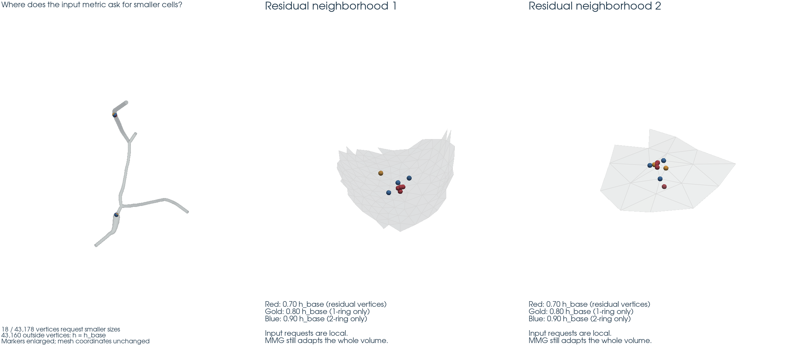

## 最终生产网格选哪个？

**KEEP_STAGE017。** A/B 均未通过 N_low、C_P2、C_tetra 三个门槛，其余生产门槛通过。
选择只在 Stage 1.7、MMG_A、MMG_B 中进行；先过滤硬门槛，再按 N_low、q_min、P2 成本、tetra 成本排序。
[生产选择记录](production_selection.json) 在 TetGen benchmark 前冻结，TetGen 前后文件 SHA 相同。

生产目录：[outputs/stage01_8/production_selected](../../outputs/stage01_8/production_selected/)。
网格 NPZ SHA256：`fc036eb0eaa0b365b06a5033f5f9eb31addfe464af4beb53c4cd96a25ed594a3`，与 Stage 1.7 完全相同。
该目录为已校验的基线副本及新的保存/重载证据；原 Stage 1.7 未改写。
本次没有 selected MMG，因此边界图如实展示两个被拒候选；没有伪造“被选中的 MMG”。

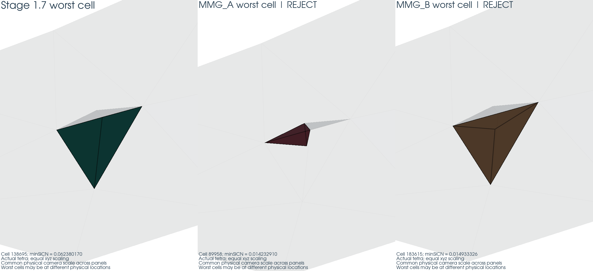

## TetGen 为什么单独测试？

它回答“同一冻结表面交给另一套成熟 tetrahedralizer，会得到什么质量/成本”。
输入直接是 Stage 1.7 selected closed surface，包含 wall、selected caps 和原 markers，
没有使用 MMG 输出或 Stage 1 fan caps。
surface SHA256：`31746b2c2ef95a0b9044d96ef4b470a83592a91ae9132c5d6810736880734ac6`。

本次 TetGen **1.6.0 / hecca717_2，许可证 AGPL-3.0-or-later**；
包内 [LICENSE](../../outputs/stage01_8/tool_environment/licenses/tetgen/LICENSE) 已保存并校验。
本机 [tetgen -h](tetgen_help.txt) 确认 `-pYqC`：PLC、禁止 boundary Steiner、默认 quality、最终一致性检查。
`-q` 未附数值，未扫描参数；该语义也与 [官方手册](https://www.wias-berlin.de/software/tetgen/1.5/doc/manual/manual005.html) 一致，
实际 1.6 binary 的帮助与 stdout 是本次执行依据。
TetGen 只有一次 synthetic smoke 和一次正式 benchmark。正式输出先过边界门槛，再送入统一 minSICN evaluator。

## TetGen 得到什么结果？

**TETGEN_QUALITY_WORSE。** 边界坐标、三角连接与 markers 全部保留，位移恰为 0 m。
tetra=121,695，P2 proxy=701,829，分别为基线的 0.822552518、0.872348756 倍。
但低质量单元达到 314，q_min=0.027960375615，P1/P5/median 均低于基线；其中 313 个最近 WALL，1 个最近 INLET。
所有导入 tetra 有限、正体积、单一连通体，一致性检查通过。

| 网格 | N_low | q_min | P1 | P5 | median | P95 | 最近 cap / WALL |
| --- | --- | --- | --- | --- | --- | --- | --- |
| Stage 1.7 | 3 | 0.062380170310 | 0.351343233439 | 0.485670578367 | 0.721855606189 | 0.929312719306 | 0 / 3 |
| TetGen | 314 | 0.027960375615 | 0.193879219235 | 0.423253548856 | 0.698805846541 | 0.905356637650 | 1 / 313 |

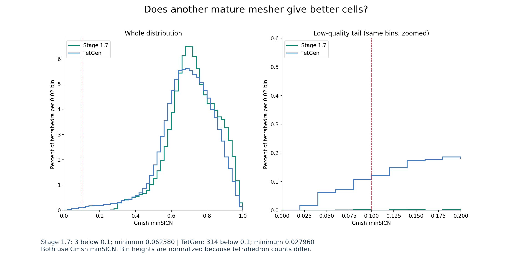

两者都使用 Gmsh minSICN；直方图共用 [0,1] 范围、0.02 bin 宽度，按各自 tetra 总数归一化为百分比。
没有将 TetGen radius-edge ratio 与 Gmsh minSICN 混用。
完整 TetGen QC、所有低质量单元记录、原始日志在 [tetgen 输出目录](../../outputs/stage01_8/tetgen/)。

## 两套成熟工具给出了什么共同信息？

本次冻结边界与固定策略下，MMG 两条修复路线和 TetGen 唯一 benchmark 均未消除低质量尾部，
也未产生优于 Stage 1.7 的质量/成本组合。MMG 的主体质量提高伴随成本和最差质量退步；TetGen 节省成本但增加低质量单元。
这是保留基线的实测依据。

它不能证明所有 boundary-fixed tetra 拓扑都无解，也不能证明所有 MMG/TetGen 配置都会失败。
仅凭这些试验不能把原因确定归于 wall 曲率或某一边界三角形，不能推断 PDE 误差必然增大。

## 是否改变了 vascular boundary？

| 网格 | wall 最大位移 (m) | cap 最大位移 (m) | rim 最大位移 (m) | 三角连接 / refs |
| --- | --- | --- | --- | --- |
| MMG_A | 3.030437198788175e-20 | 3.030437198788175e-20 | 3.030437198788175e-20 | PASS / PASS |
| MMG_B | 3.030437198788175e-20 | 3.030437198788175e-20 | 3.030437198788175e-20 | PASS / PASS |
| TETGEN | 0.000000000000000e+00 | 0.000000000000000e+00 | 0.000000000000000e+00 | PASS / PASS |
| production / Stage 1.7 | 0 | 0 | 0 | PASS / PASS |

MMG 的约 3.03e-20 m 是合法格式序列化/读写量级差异，实际不为零，严格低于 1e-15 m 门槛。
没有舍入坐标后比较，没有把坐标吸附回原边界。TetGen 和最终生产网格实际达到零位移。
比较采用未舍入 float64 的双射顶点对应，再逐个比较无序三角 vertex triples 和原始 refs，
并从 tetra 独立提取 exterior 检查完整性。近邻只用于对应/误差度量，不用于猜 marker。

全部 67,746 个 exterior triangles 保留：WALL 67,071；INLET 196；OUTLET_01 168；OUTLET_02 150；OUTLET_03 161。
映射固定为 1 WALL、2 OUTLET_03、3 OUTLET_01、4 INLET、5 OUTLET_02，volume ref 为 100。
planar-port v2 contract SHA 仍为 `cf2dae365fde86ee02d92dbb1b1c97602f40c7adcce7a706551acf385cb96dc9`。

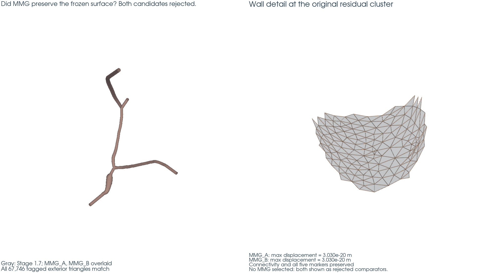

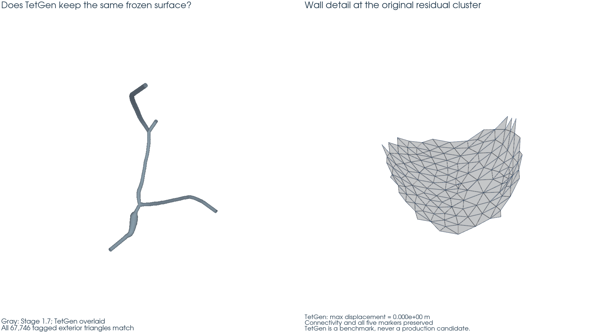

## 成本变化

| 网格 | vertices / P1 proxy | edges | tetra | P2 scalar proxy | P2 velocity proxy | C_tetra | C_P2 |
| --- | --- | --- | --- | --- | --- | --- | --- |
| Stage 1.7 | 43178 | 224998 | 147948 | 268176 | 804528 | 1.000000000 | 1.000000000 |
| MMG_A | 50166 | 272778 | 188740 | 322944 | 968832 | 1.275718496 | 1.204224092 |
| MMG_B | 50116 | 272481 | 188493 | 322597 | 967791 | 1.274048990 | 1.202930165 |
| TetGen | 39188 | 194755 | 121695 | 233943 | 701829 | 0.822552518 | 0.872348756 |

P2 scalar proxy=N_vertex+N_unique_edge；P2 velocity proxy=3×P2 scalar；P1 pressure proxy=N_vertex。
这些是拓扑计数，不是创建的 function space 或实测求解内存/时间。
MMG 候选两个成本比都必须 ≤1.10，A/B 均失败。TetGen 的成本分类仅用于独立 benchmark。

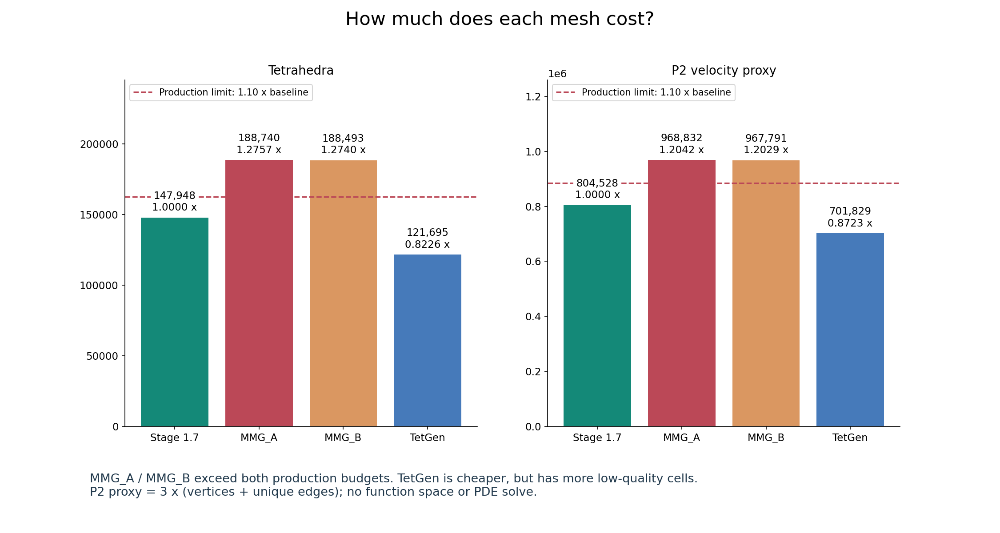

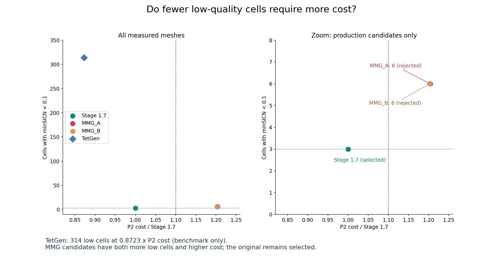

## 自动测试

完整 pytest：**356 passed、0 failed、0 errors、5 skipped**，
原始输出为 [pytest_results.xml](pytest_results.xml)。其中 Stage 1.8（归档旧版测试及新版）
共 89 项、28 个模块；规定的 15 个新版测试文件均保留。
旧版 44 个测试继续针对归档 artifact 执行，未删除旧测试。

测试涵盖小型格式往返、真实 metric 重算/尺度不变性、移动边界/改变三角形/丢 marker 的恶意输入、
质量改善不能越过边界门槛、统一质量数组、成本计数、生产选择排除 TetGen、实际调用与先边界后质量的时序、
独立进程重载、图像源 SHA、工具环境及历史保留。

| 网格 | 1 rank | 2 ranks | 重载验证 |
| --- | --- | --- | --- |
| production_selected | PASS | PASS | 全部 owned tetra / exterior tags / minSICN / proxies |
| tetgen | PASS | PASS | 全部 owned tetra / exterior tags / minSICN / proxies |

TetGen 两个成本比均 ≤1.10，按冻结策略允许并已完成 2 rank 重载。
重载只统计 owned entities，避免 MPI ghosts 重复计数；验证全部 tetra 的无序物理几何、exterior refs、
质量分位数/低质量分布及 proxies。DOLFINx 的节点置换仅在质量比较时统一符号约定，
原工具输出的正体积已独立验证，未“修正”倒置单元。
保存进程结束后另启 reload 进程，XDMF/HDF5 SHA 不变；没有 FEM function space 或 PDE solve。

跳过项均为既有环境/历史约束，不能算作通过：

- `tests.test_dolfinx_remote_smoke.test_dolfinx_remote_smoke`：Executed separately on remote 1/2/4-rank DOLFINx environment
- `tests.test_stage015_mesh_roundtrip.test_selected_mesh_new_process_roundtrip[1]`：Stage 1.5 geometry gate failed: no volume/winner exists; DOLFINx round-trip forbidden, overall stage FAIL
- `tests.test_stage015_mesh_roundtrip.test_selected_mesh_new_process_roundtrip[2]`：Stage 1.5 geometry gate failed: no volume/winner exists; DOLFINx round-trip forbidden, overall stage FAIL
- `tests.test_stage016_roundtrip.test_selected_new_process_DOLFINx_roundtrip[1]`：Stage 1.6 FAIL at surface density gates; no selected volume exists; roundtrip forbidden
- `tests.test_stage016_roundtrip.test_selected_new_process_DOLFINx_roundtrip[2]`：Stage 1.6 FAIL at surface density gates; no selected volume exists; roundtrip forbidden

[历史完整性](history_preservation.json)：2572 个冻结文件、25 个既有 fem3d 源文件无变化；
Stage 1.5/1.6 的 FAIL 永久保留，用户原有 Stage 1 报告编辑保持。
[只读参考完整性](reference_integrity.json)：43038 个文件/目录等条目全量比对 Stage 0 清单，
两棵参考工程无新增、删除或修改。远端继续通过原 `remote_sync/run/fetch.sh --stage 1.8` 路径执行。

## 人工审核

请审核全部 11 张图，重点查看质量尾部、边界保持、metric 范围与实际成本、内部 tetra 切面。
图中采用直白英文说明，正文给出中文解读；所有几何来自真实 artifact，没有人工补造内部网格。
图像 SHA、源网格 SHA、camera、统一 bins 和切面参数在 [visualization_manifest.json](visualization_manifest.json)。

1. [原始 3 个低质量单元的位置](residual_locations.png) — `residual_locations.png`
2. [MMG 后坏单元数量与整体分位数](mmg_quality_comparison.png) — `mmg_quality_comparison.png`
3. [MMG_B 局部尺寸请求及范围](mmg_metric_map.png) — `mmg_metric_map.png`
4. [MMG_A/B 被拒候选的边界叠加](mmg_boundary_overlay.png) — `mmg_boundary_overlay.png`
5. [相同物理尺度下的最差单元形状](mmg_worst_cells_before_after.png) — `mmg_worst_cells_before_after.png`
6. [相同 minSICN bins 下的 TetGen 对比](tetgen_quality_comparison.png) — `tetgen_quality_comparison.png`
7. [TetGen 与 Stage 1.7 边界叠加](tetgen_boundary_overlay.png) — `tetgen_boundary_overlay.png`
8. [tetra 与 P2 成本](mesher_cost_comparison.png) — `mesher_cost_comparison.png`
9. [低质量单元数量和成本的关系](quality_cost_comparison.png) — `quality_cost_comparison.png`
10. [保留的生产网格真实内部切面](production_mesh_cutaway.png) — `production_mesh_cutaway.png`
11. [同一物理平面下 TetGen 的真实内部切面](tetgen_mesh_cutaway.png) — `tetgen_mesh_cutaway.png`

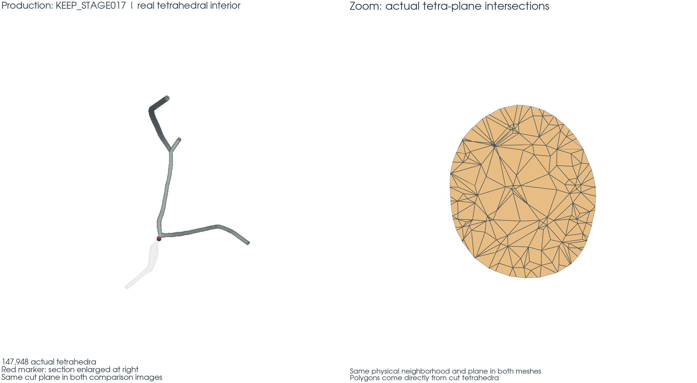

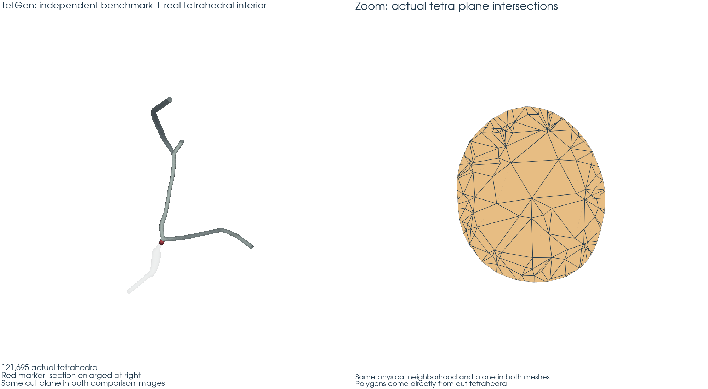

## 最终推荐

Production：**KEEP_STAGE017**。

Independent benchmark：**TETGEN_QUALITY_WORSE**。

Stage 1.8：**CONDITIONAL PASS**。成熟工具评估完整、独立 benchmark 完成、所选基线边界安全且
1/2 rank 重载通过，允许在没有采用 MMG 的情况下得到此状态。
尚未得到本阶段人工审核结论；本程序不将状态升级为最终 PASS。

正式网格与日志保留在 [outputs/stage01_8](../../outputs/stage01_8/) 和 [logs/stage01_8](../../logs/stage01_8/)，
远端取回文件 SHA 在 [artifact_manifest.json](artifact_manifest.json)。轻量汇总为
[assessment_summary.json](assessment_summary.json)，最终状态为 [final_status.json](final_status.json)。

## 尚未证明什么？

没有求解 velocity、pressure、lambda 或 Q，没有 Stokes/Navier–Stokes、WSS、streamlines，
没有重跑 Stage 2 solver。P2 proxy 不代表实测 PDE 成本；minSICN 改善或退步也不是解误差证明。
真实 solution sensitivity、流量/压力变化和网格收敛留给另行授权的 Stage 3。
本阶段到此停止，不自动进入 Stage 3。
