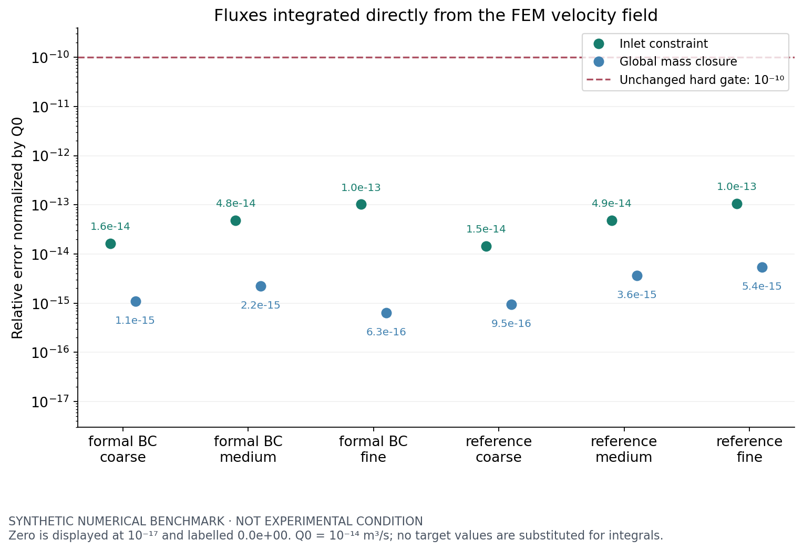
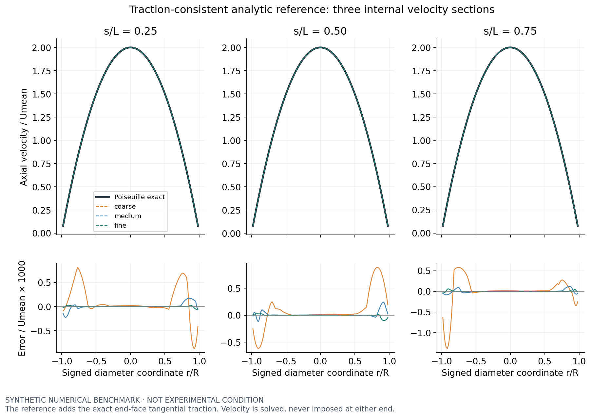
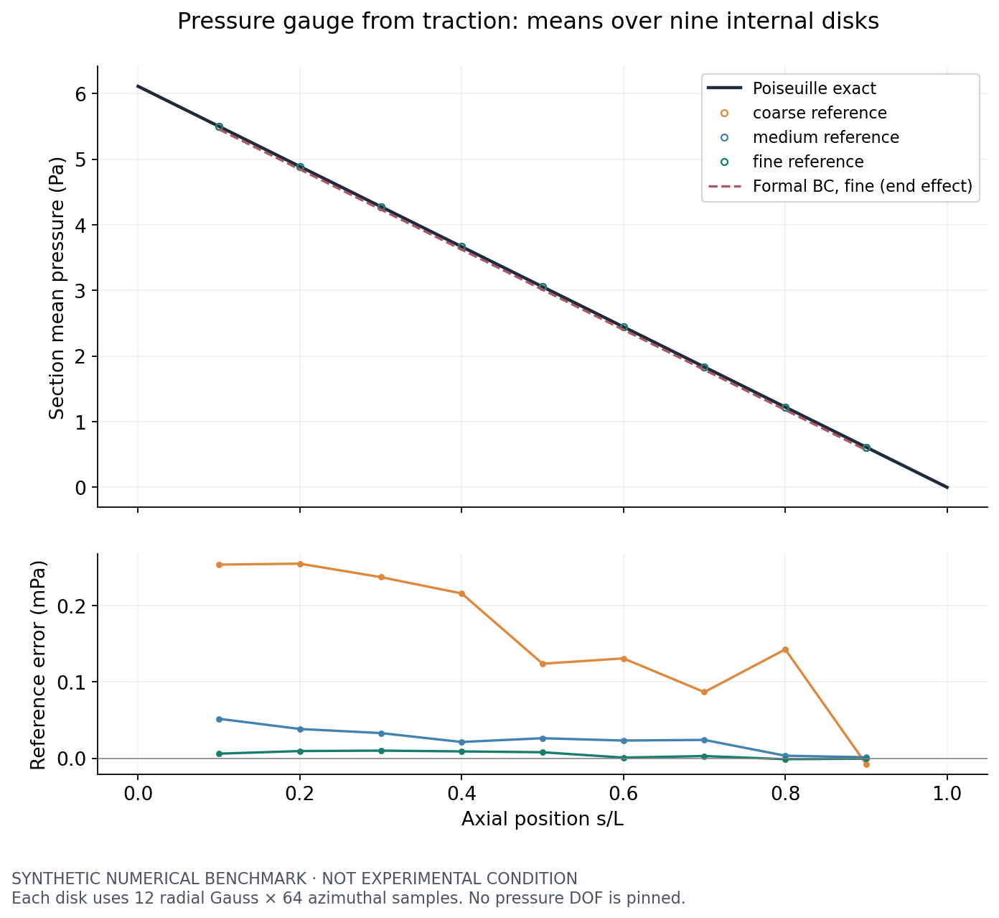
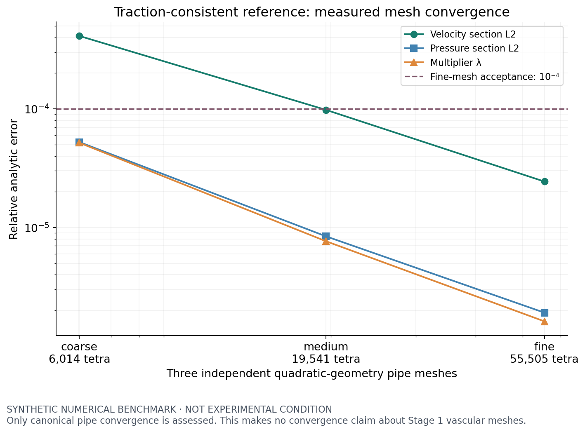
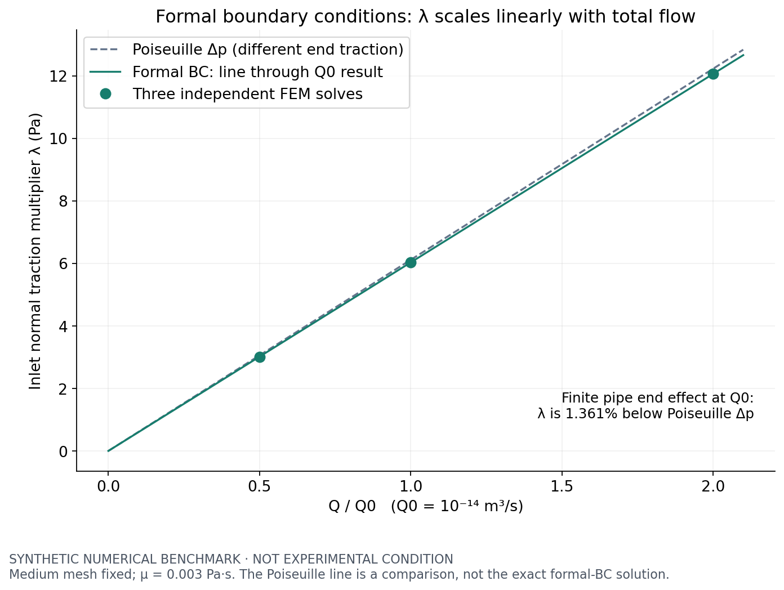
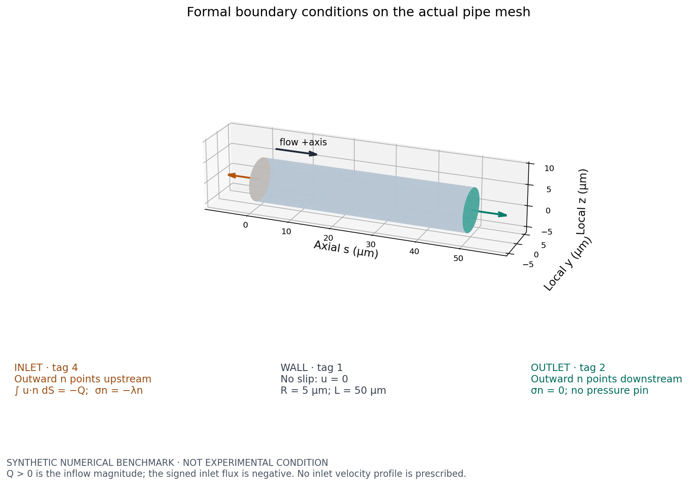
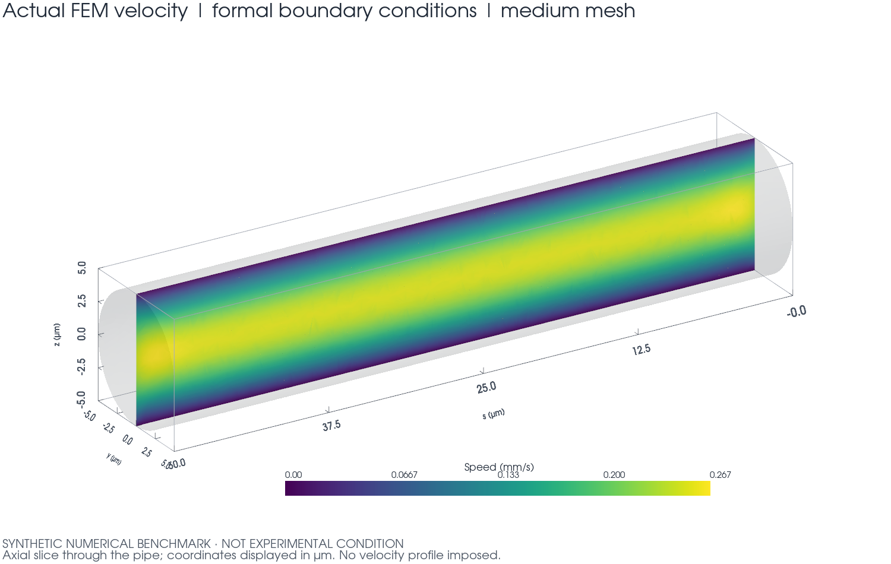

# Stage 2 — 入口总流量约束的 3D Stokes FEM 核心验证

**STAGE 2 STATUS: PASS。止于 Stage 2，未开始 Stage 3。**

结论采用用户已确认的验证方案：保留正式入口纯法向牵引、出口零牵引；另增端面牵引一致的 Poiseuille 解析案例。两组结果分开评价，没有把正式有限圆管的端部效应算作离散解析误差，也没有改变正式边界来制造吻合。

## 这一步要解决什么？

Stage 1 得到了真实血管体网格，其 CONDITIONAL PASS 和少量低质量四面体问题仍然保留。本阶段只用独立合成圆管，验证入口总流量约束、完整应力、压力基准、全局 Real 乘子和 DOLFINx/PETSc 实现。

真实血管 coarse/medium 均未求解，也未修复 sliver 或修改冻结 cap。WSL 是唯一源码来源；远端仅做 CPU 计算，结果取回后在 WSL 作图。

| 网格 | 目标 h (µm) | 四面体 | 速度 / 压力 / Real DOF | 正式 solve (s) | 峰值 RSS (MiB) |
| --- | --- | --- | --- | --- | --- |
| coarse | 1.5 | 6,014 | 30,336 / 1,537 / 1 | 2.50 | 510.7 |
| medium | 1.0 | 19,541 | 91,800 / 4,372 / 1 | 6.38 | 1648.7 |
| fine | 0.7 | 55,505 | 248,448 / 11,323 / 1 | 33.99 | 5884.3 |

三套网格均由 Gmsh 在 SI 中独立生成，二次几何 tetra10；各套最小 Jacobian 为正。fine 的端面面积相对误差 7.913638e-07，体积相对误差 4.269803e-07。这些标签只属于合成圆管，不替代 Stage 1 vascular tag contract。

## “只给 Q，不给速度剖面”是什么意思？

注射泵只告诉求解器每秒进入多少液体，没有告诉入口每一点流多快。求解器同时计算入口速度分布和推动这股流量所需的 λ。

正式接口 `solve_stokes` 要求 Q_target > 0；壁面无滑移，入口和出口均不施加速度剖面。壁面与端面相交的圆周仍属于无滑移壁面。λ 是未知数，保存其带符号原值；流向反转仅在内部数学回归接口中允许。

## 关键变量

| 变量 | 意义 | 单位 |
| --- | --- | --- |
| u | 三维速度 | m/s |
| p | 由出口牵引定基准的表压 | Pa |
| Q | 正式 API 中给定的流入体积流量大小 | m³/s |
| λ | 全局入口法向牵引乘子，由约束求得 | Pa |
| μ | 动力黏度，进入完整应力 | Pa·s |
| ρ | 仅用于 Reynolds 数诊断 | kg/m³ |
| n | 流体域外法向单位向量 | 无量纲 |

## 数学模型

[
-operatorname{div}sigma=0,qquad operatorname{div}u=0,qquad
sigma=-pI+2muepsilon(u),quad epsilon(u)=	frac12(
abla u+
abla u^T).
]

壁面 u=0。入口和出口分别满足

[
int_{Gamma_{in}}ucdot n,dS=-Q,qquad
sigma n=-lambda nquad(Gamma_{in}),qquad
sigma n=0quad(Gamma_{out}).
]

因为入口外法向朝上游，正向流动的入口有符号积分为负。零出口牵引提供压力基准，但不等于给压力节点设置 p=0；没有压力 Dirichlet、pressure pin 或常数压力 nullspace。λ 在一般流动中不等于局部静压。

完整弱形式及符号推导见 [FORMULATION.md](FORMULATION.md)。实现把整条连续性方程乘 −1，使用 B=−D，得到对称块矩阵 `[A Bᵀ C; B 0 0; Cᵀ 0 0]` 和右端 `[0,0,−Q]`。这不改变 p 或 λ 的物理符号。

[P2]³/P1 加原生 Real 独立空间通过 `ufl.MixedFunctionSpace` 装配。Real 不是每个 rank 一个独立标量。1/2 rank 的 API probe 在完整 PDE 开发前通过：小模型尺寸为 375 / 27 / 1，C 非零、C 与其转置一致、Real 常数积分正确；2 rank 仅一个 owner，其他为 ghost。依据为 [Basix real_element](https://docs.fenicsproject.org/basix/v0.11.0/python/_autosummary/basix.ufl.html#basix.ufl.real_element) 和 [DOLFINx 0.11 官方 Real 测试](https://github.com/FEniCS/dolfinx/blob/v0.11.0/python/test/unit/fem/test_real_space.py)，官方源码快照保存在 `inputs/stage02/api_reference/`。

远端实际版本 DOLFINx 0.11.0、Basix 0.11.0、PETSc 3.25.5、Gmsh 4.15.2；使用 preonly / LU / MUMPS，收敛 reason=4。坐标一直为 m；为避免 SI 数量级造成代数病态，对未知数和测试空间作对称尺度变换，解后恢复物理单位。密度不进入装配。**GPU used = false**。

## 圆管理论答案是什么？

**SYNTHETIC NUMERICAL BENCHMARK — NOT EXPERIMENTAL CONDITION**。

R=5×10⁻⁶ m，L=50×10⁻⁶ m，μ=0.003 Pa·s，ρ=1050 kg/m³，Q₀=10⁻¹⁴ m³/s。配置见 [stage02_pipe_benchmark.yaml](../../configs/stage02_pipe_benchmark.yaml)，不作为实验条件。

[
U_{mean}=rac{Q}{pi R^2},quad
u_s(r)=2U_{mean}(1-r^2/R^2),quad
Delta p=rac{8mu LQ}{pi R^4},quad p(s)=Delta p(1-s/L).
]

理论 Umean=1.273240e-04 m/s，中心速度=2.546479e-04 m/s，Δp=6.111549814729 Pa，Re=4.456338e-04，处于 Stokes 范围。公式使用管道局部轴，未把轴向速度硬编码成全局 z 分量。

**完整应力下的边界兼容性：** Poiseuille 在端面还需要非零切向牵引 ±μw′(r)e_r，正式纯法向入口/零牵引出口没有该项。因此正式有限圆管不以整管 Poiseuille 为精确解。该结论来自把解析场直接代入完整应力，推导见数学文档。

用户明确选择的补充参考组在两端加入已知切向牵引 t_tan=(n·e_s)μ∇⊥w；入口为 −λn+t_tan，出口为 t_tan。参考组仍只用总流量约束求速度和 λ，没有预设速度剖面。它才以 Poiseuille 和 λ=Δp 为精确答案。正式 `natural` 接口没有这个额外载荷，所有正式 BC 回归均单独完成。

## 流量约束有没有真的满足？

以下流量全部由 FEM u·n 边界积分获得，再做一次 MPI SUM；没有用配置值替代实际积分。入口大小定义为负的入口有符号积分，出口大小就是出口有符号积分。

| 算例 | Q_target (m³/s) | 实际入口大小 (m³/s) | 实际出口大小 (m³/s) | 入口相对误差 | 质量闭合相对误差 |
| --- | --- | --- | --- | --- | --- |
| pipe_fine_natural | 1.000000e-14 | 1.0000000000001019e-14 | 1.0000000000001013e-14 | 1.019208e-13 | 6.310887e-16 |
| pipe_fine_reference | 1.000000e-14 | 1.0000000000001049e-14 | 1.0000000000000996e-14 | 1.049185e-13 | 5.364254e-15 |
| mpi2_medium | 1.000000e-14 | 1.0000000000000110e-14 | 1.0000000000000121e-14 | 1.104405e-14 | 1.104405e-15 |

全部 12 个求解案例的最大入口相对误差为 1.049185e-13，最大质量闭合相对误差为 5.364254e-15，均低于固定的 **10⁻¹⁰** 门槛。每例 `qc/flux.json` 保存 target、signed flux、actual flux 和带符号残差；墙面积分为零。门槛从未放宽。

## lambda 的方向和大小对吗？

正 Q 的全部案例 λ>0；反向 RHS 的 λ<0，没有取绝对值掩盖符号。解析值为 6.111549814729 Pa。

| 网格 | 牵引一致 λ (Pa) | 解析 λ 相对误差 | 正式边界 λ (Pa) | 正式条件相对 Poiseuille 差值 |
| --- | --- | --- | --- | --- |
| coarse | 6.111866044467 | 5.174297e-05 | 6.037622805096 | -1.209628% |
| medium | 6.111596635489 | 7.661029e-06 | 6.028348391631 | -1.361380% |
| fine | 6.111559705858 | 1.618432e-06 | 6.023107433492 | -1.447135% |

参考 fine λ=6.111559705858 Pa，误差 1.618432e-06。正式 fine λ=6.023107433492 Pa，比 Poiseuille 低约 1.447%；这是本长径比和正式牵引模型的端部效应与剩余离散误差之和，不宣称该差值已是精确极限。coarse→medium→fine 的正式 λ 逐步稳定；不能要求它向错误边界条件的解析值收敛。

## 速度场对吗？

参考组在 s/L=0.25、0.50、0.75 三个截面作面积加权积分，统计三分量速度误差和横向速度。fine 结果如下；最大误差用解析中心速度归一化，避免在近壁零速度处作相对除法。

| s/L | 速度截面 L2 相对误差 | 最大误差 / 解析中心速度 | 最大横向速度 / Umean |
| --- | --- | --- | --- |
| 0.25 | 2.237432e-05 | 1.175832e-04 | 3.872613e-05 |
| 0.5 | 2.803619e-05 | 1.117152e-04 | 3.168168e-05 |
| 0.75 | 2.229156e-05 | 9.298221e-05 | 3.749785e-05 |

截面汇总 L2 误差=2.438273e-05，全域 L2 误差=2.647942e-05。下图上排给出剖面，下排放大真实误差；每条曲线来自实际 FEM 点值。曲边四面体的候选点采用原生非线性 pull-back 检查参考单元内外，再执行 Function.eval。

正式组 fine 的内部截面速度误差为 2.459476e-05，但全域与 Poiseuille 的差异为 2.495223e-02，端部贡献不能忽略。该全域差异未冒充参考组的离散误差。

## 压力对吗？

压力在 s/L=0.1…0.9 的九个内部圆盘上平均，每盘 12 个径向 Gauss 点 ×64 个角向点；所有点均在实际 FEM 网格内。不是单节点压力，也没有减去任意常数以改善吻合。fine 参考组截面误差=1.915593e-06，全域压力 L2 误差=1.162622e-05。

| 网格 | 参考组：内部压力斜率 × L (Pa) | 参考组：中心速度 (m/s) | 正式组：内部压力斜率 × L (Pa) |
| --- | --- | --- | --- |
| coarse | 6.1118443832 | 2.546493e-04 | 6.1104457849 |
| medium | 6.1116035552 | 2.546484e-04 | 6.1104331710 |
| fine | 6.1115632030 | 2.546481e-04 | 6.1104358656 |

表中“压力斜率 × L”是内部截面拟合外推的压降指标，不是两端面压力差的直接积分。正式组压力近似保持内部线性斜率，但整体偏移包含端部效应；零牵引并不强制端面每个点的静压为零。

## 网格加密后是否更接近解析答案？

| 网格 | 截面速度 L2 | 全域速度 L2 | 截面压力误差 | 全域压力 L2 | λ 相对误差 |
| --- | --- | --- | --- | --- | --- |
| coarse | 4.109950e-04 | 3.786519e-04 | 5.242836e-05 | 9.610104e-05 | 5.174297e-05 |
| medium | 9.795932e-05 | 8.969111e-05 | 8.426772e-06 | 2.912163e-05 | 7.661029e-06 |
| fine | 2.438273e-05 | 2.647942e-05 | 1.915593e-06 | 1.162622e-05 | 1.618432e-06 |

先保存三套网格实测数据，再确定 [acceptance_policy.json](acceptance_policy.json)：fine 速度、压力 L2 和 λ 相对误差均 ≤10⁻⁴（0.01%），并要求 coarse→fine 至少降低三倍；横向速度/Umean ≤10⁻³。截面速度误差减少约 16.9 倍，λ 误差减少约 32.0 倍。所有这些 gate 均通过，没有采用 10% 或 20% 的宽松判据。

二次速度、一次压力和曲边几何均参与误差。Poiseuille 压力在直坐标上为线性，但映射到二次几何参考单元后不必由 P1 精确表示，壁面的几何逼近也会产生误差。三点结果支持本基准收敛，未据此宣称通用渐近阶数或 Stage 1 真实血管网格收敛。

## Stokes 线性是否得到验证？

固定 medium 网格，使用正式边界条件，逐个实际求解。比较相同物理位置上的全部速度和压力系数向量，而不是只看中心速度、λ 或图形。相对误差门槛为 10⁻¹¹。

| 回归 | 预期 u / p / λ 倍数 | u 整场误差 | p 整场误差 | λ 误差 |
| --- | --- | --- | --- | --- |
| q_half | 0.5 / 0.5 / 0.5 | 1.288156e-15 | 1.542300e-15 | 1.031335e-15 |
| q_double | 2 / 2 / 2 | 1.807560e-15 | 1.599768e-15 | 1.326003e-15 |
| reverse | −1 / −1 / −1 | 0.000000e+00 | 0.000000e+00 | 0.000000e+00 |
| mu_double | 1 / 2 / 2 | 0.000000e+00 | 0.000000e+00 | 0.000000e+00 |
| rho_double | 1 / 1 / 1 | 0.000000e+00 | 0.000000e+00 | 0.000000e+00 |

μ 加倍时 u 不变，p 和 λ 加倍；ρ 加倍时所有解系数逐位相同，仅 Re 加倍。反转符号回归中 u、p、λ 全部反号。正式 API 仍拒绝 Q≤0。

## MPI 是否改变答案？

1 rank 的核心数学、收敛、缩放和反向验证全部通过后，完成派生场和新进程重载，再运行相同 medium 网格的 2 rank 正式案例。

| 比较量 | 1 / 2 rank 相对差异 |
| --- | --- |
| lambda_pa | 3.580207e-14 |
| velocity_L2_norm_m_pow_2p5_s | 3.010203e-14 |
| pressure_integral_pa_m3 | 4.145210e-14 |
| velocity_L2_relative_error | 1.798509e-11 |
| velocity_global_L2_relative_error | 1.336251e-13 |
| pressure_profile_error | 2.576701e-12 |
| lambda_relative_error | 2.594096e-12 |
| actual_Q_in_m3_s | 3.707646e-14 |
| actual_Q_out_m3_s | 3.376325e-14 |

比较门槛为 10⁻⁹，最大差异为 1.798509e-11。比较的是物理积分和解析诊断，未要求不同分区输出文件的 SHA 相等。两次求解的 Real global DOF 都是 1，2 rank 的 owned 分配为 [1, 0]。这只是答案一致性检查，不是 scalability 或性能结论。

## 做了哪些自动测试？

最终完整 pytest：**103 passed，0 failed，1 skipped**。其中 Stage 2 的 17 个测试文件包含 42 个测试案例，全部通过。唯一跳过项是既有 Stage 0 的本地 DOLFINx 环境测试：WSL 没装 DOLFINx；本阶段所需的真实 DOLFINx/MUMPS/MPI 运算均在已审计的远端执行并取回证据，不作为跳过项掩盖。完整 XML 见 [pytest_results.xml](pytest_results.xml)。

覆盖 Real 1/2 rank 与独立 block 代数、SI 圆管几何、直接流量积分、质量闭合、无压力 pin、速度/压力/λ 解析误差、三网格收敛、Q 线性、反向、μ 缩放、ρ 独立、MPI、实际结果重载和七张图。

全部 12 个案例均通过保存→新 Python 进程重载。原始 P2/P1 节点系数由 `primary_checkpoint.npz` 与经过 SHA 验证的 profile XDMF/HDF5 几何恢复；坐标匹配只用于识别节点，不插值改变系数。包含 2 rank 求解的检查点在 1 rank 新进程重建。λ 重新进入原生 Real 空间，再从 owner 做全局归约。重算流量并与原结果比较，派生场重算误差 ≤10⁻¹²。

`metadata/run.json` 记录的是原始 solve 完成时的状态，其中 `derived_fields_exported=false` 保留为当时事实；后续导出成功以 `solution/export_manifest.json` 为准。可视化文件为 `fields.xdmf`/`fields.h5`，包含速度 P2、由原始 P1 嵌入 P2 的压力以及派生场；XDMF 几何和 tags 也独立重载。DOLFINx 当前没有在此流程中调用通用 read_function；精确 restart 使用已实测的等价 NPZ 系数格式。`derived_checkpoint.npz` 的张量分量和值在新进程中验证，不能把只读回网格当成已重载场。

派生量定义为 grad(u)[i,j]=∂u_i/∂x_j、ε=½(grad+gradᵀ)、curl(u)，单位 s⁻¹，张量展平顺序为 **xx,xy,xz,yx,yy,yz,zx,zy,zz**。派生输出是每个四面体映射参考中心的 DG0 样本，不代表曲单元内变化的导数已被完整表示；未计算 WSS。

核心前置证据见 [core_validation.json](core_validation.json)，重载见 [result_roundtrip.json](result_roundtrip.json)，MPI 见 [mpi_reproducibility.json](mpi_reproducibility.json)，逐例环境和来源见 [case_provenance.json](case_provenance.json)。每次远程执行的 command、hostname、timestamp、源码哈希、配置/输入哈希、MPI、软件版本、stdout/stderr、wall time、peak RSS 均保留于取回的日志；Git HEAD 之外还记录当时未提交源码的内容哈希。

## 产生了哪些图？

所有图都在 WSL 从取回的实际结果生成；只在显示时换成 µm/mm/s。图像及来源 SHA 见 [visualization_manifest.json](visualization_manifest.json)。

| 图 | 审核时看什么 |
| --- | --- |
| [pipe_geometry_and_bc.png](pipe_geometry_and_bc.png) | 入口/出口外法向、负入口积分、壁面和正式牵引 |
| [velocity_profile.png](velocity_profile.png) | 三个内部截面与解析解的吻合，以及放大的误差 |
| [pressure_axial.png](pressure_axial.png) | 截面平均压力与参考误差；正式条件端部效应另画 |
| [lambda_vs_Q.png](lambda_vs_Q.png) | 正式条件下三次实际求解的 λ 线性 |
| [mesh_convergence.png](mesh_convergence.png) | 参考组的三网格误差下降 |
| [flux_balance.png](flux_balance.png) | 实际 FEM 流量约束与质量闭合远小于 10⁻¹⁰ |
| [velocity_slice_3d.png](velocity_slice_3d.png) | 正式条件下实际 FEM 速度切面及端部变化 |

## 还存在什么问题？

正式有限圆管与整管 Poiseuille 的边界条件差异始终存在，不能靠加密消除。当前结果没有给出真实血管的准确性、低质量单元稳健性或大型迭代求解器能力；Stage 1 coarse 的 142 个和 medium 的 153 个 minSICN<0.1 单元仍留待后续阶段处理。DG0 派生场是明确标注的中心样本，不作为 WSS 或后续输运的充分验证。

开发期间发现并修复了三类问题，旧失败日志均保留：API probe 的 PETSc transpose 原地修改了 C，改为先复制；首次 coarse 装配不支持对 UFL Form 直接除浮点数，改为积分内系数；二次曲边单元不能仅靠凸包候选判断点归属，改用原生非线性 pull-back 后，从同一检查点重新计算解析诊断。主解没有因采样修正而改变。最初错误 probe 的 PASS 文本不是最终验收依据，最终测试明确要求 C 非零。没有通过放宽 flux gate 掩盖问题。

两个参考工程重新全量审计 43,038 个条目：

| 只读参考工程 | modified | deleted | added |
| --- | --- | --- | --- |
| /home/lzy/projects/ulm_microbubble_traj_gen_2D | 0 | 0 | 0 |
| /home/lzy/projects/ulm_3D_vascular | 0 | 0 | 0 |

Stage 0/1 的 reports、inputs、outputs、logs 共 409 个文件与 Stage 2 开始时的内容、大小和文件集合完全一致。用户在本阶段开始前已修改的 Stage 1 报告排版保留原样；该既有工作区差异不属于本阶段修改。证据见 [reference_integrity.json](reference_integrity.json) 和 [history_preservation.json](history_preservation.json)。

## 是否可以进入 Stage 3？

**STAGE 2 STATUS: PASS。** 在用户确认的双算例方案下，所有数学、流量、解析收敛、回归、重载、MPI、测试和历史保护 gate 均通过。该结论只说明这里的 solver core 已通过合成基准验证，不意味着真实 vascular solution 已验证。

本次停在 Stage 2，未自动开始 Stage 3。七张图已供人工审核；真实血管计算仍需另行指示。
