# Stage 3 — 真实三维血管 FEM 流场首次求解

**STAGE 3 STATUS: FAIL — SINGULAR_PRESSURE_SUPPORT。**
正式 4-rank MUMPS 数值分解失败，未得到有效流场。独立的仅组装诊断确认：两个局部压力基函数对应完全为零的行和列，两个独立单位压力向量均满足 `A·e=0`。本阶段停止，没有改变网格或经过验证的 Stage 2 核心来绕过失败。

## 开始前清理了什么？

按用户要求，先建立 [cleanup plan](stage018_cleanup_plan.json)，通过导入图、Git 状态、文本搜索和目录清单确定范围，再删除 MMG/TetGen 活动实现、专用测试、配置、原始结果及独立 mesh-tools 环境。计划包含 393 个文件条目和 5 个目录树条目。没有新建代码备份。

保留通用质量、边界和成本诊断模块。Stage 1.8 的最终 REPORT、assessment_summary、final_status、11 张最终 PNG 保持原字节；旧版归档仅保留最终科学证据，不再保留代码与原始实验。新增 [CLEANUP_NOTICE](../stage01_8/CLEANUP_NOTICE.md)，历史结论仍为 KEEP_STAGE017。

WSL 与远端最终活动代码/包检查均 PASS。远端原 FEM Python 与全部 conda 元数据文件的指纹未变；独立环境确已删除。清理后首次完整 remaining tests 为 269 passed、5 skipped、0 failed；本阶段最终回归见末节。[最终清理审计](final_cleanup_audit.json)

## 这一步在求什么？

Stage 1.7 提供真实四面体血管网格，Stage 2 提供通过解析基准的三维稳态不可压 Newtonian Stokes 方程、P2/P1 + 一个全局 Real 及完整应力形式 `σ=2με(u)−pI`。Stage 3 首次组合它们，检验真实网格上的可解性和数值守恒。

唯一正式来源为 `outputs/stage01_7/selected`，volume_mesh SHA256：`fc036eb0eaa0b365b06a5033f5f9eb31addfe464af4beb53c4cd96a25ed594a3`。全部 147,948 个 tetra 重新计算质量：minSICN=0.0623801703095、P1=0.351343233439、P5=0.485670578367，低于 0.1 的仍为 3 个。连通域 1；零、负、非有限体积均为 0；wall/rim 位移为 0。几何质量通过不代表与指定混合有限元空间组合后一定满秩。

## 使用的物性来自哪里？

来自只读当前正式配置 `/home/lzy/projects/ulm_3D_vascular/configs/cfd_flow.yaml`，并与 Stage 0 几何源 lineage 对齐；不是手写 Stage 2 管道参数。[物性来源与哈希](reference_condition_provenance.json)

| 量 | SI 数值 |
|---|---:|
| ρ | 1056 kg/m³ |
| ν | 3.27e-06 m²/s |
| μ=ρν | 0.00345312 Pa·s |
| Q_reference | 2.7369132390905703e-15 m³/s |

**REFERENCE NUMERICAL CONDITION — NOT EXPERIMENTAL PUMP FLOW。** 正式配置 `ca7b9037295f05f50a36e6b46bee0a608ab01b6a5025b348ffd4e69e19db9539` 冻结于第一次组装之前。源配置中的出口压力没有导入：本次三个出口按用户指定采用相同零牵引参考。因此也没有声称本阶段已匹配 LBM 全部边界条件。

远端冻结环境无 PyYAML；初次组装在读取配置前退出。随后使用与原 YAML SHA 绑定的 JSON 执行快照，源 YAML 未改、环境未安装新包。实验模板 Q 仍为 null，**EXPERIMENTAL RUN: NOT EXECUTED**。

## 边界条件是什么？

入口只约束泵入的总流量 `∫inlet u·n dS = −Q`，其自然牵引为 `σn=−λn`；三个出口处于相同 atmospheric zero-traction reference，即 `σn=0`；血管壁 no-slip `u=0`。没有入口速度剖面、预设出口比例、pressure pin 或 pressure Dirichlet；wall/cap rim 仍属于壁面约束。

标签完全保留：WALL=1、OUTLET_03=2、OUTLET_01=3、INLET=4、OUTLET_02=5、FLUID=100。恰好一个入口、三个出口，未标记外表面为 0。

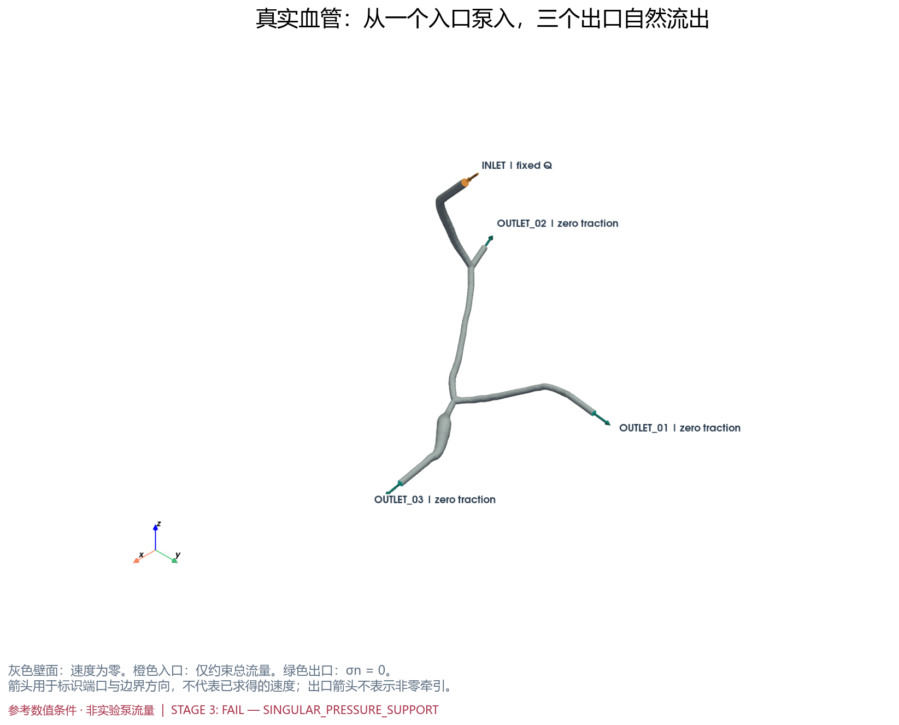

## 计算规模有多大？

| 实测量 | 数值 |
|---|---:|
| vertices / edges / tetra | 43,178 / 224,998 / 147,948 |
| velocity P2 DOF | 804,528 |
| pressure P1 DOF | 43,178 |
| global Real DOF | 1，仅 rank 0 拥有 |
| 总未知量、矩阵行列 | 847,707 × 847,707 |
| 存储 nnz | 69,768,042 |
| 壁面速度 Dirichlet DOF | 403,017 |
| 矩阵/向量组装时间 | 2.860794 s |
| 空间、表单、JIT 设置 | 0.781526 s |
| 组装最大单 rank peak RSS | 0.686611 GiB |

[核实后的仅组装记录](../../outputs/stage03/preflight/assembly_verified.json) 明确没有 factorize 或 KSP solve。首份 `assembly.json` 的 nnz 错将 PETSc 默认全局和再次累加；已通过显式 `InfoType.LOCAL` + MPI SUM 重新组装核实，保留原错误记录用于追踪，报告只使用核实值。nnz 是存储结构数量，并不保证每个值非零或矩阵可逆。

## 求解器是否正常结束？

**没有。** 唯一正式尝试采用冻结 Stage 2 `preonly + LU + MUMPS`，4 MPI ranks、OMP_NUM_THREADS=1、GPU=false。MUMPS 报 `INFOG(1)=-10, INFO(2)=847705`；PETSc 将 −10 分类为数值奇异/零 pivot。[PETSc 官方实现](https://petsc.org/release/src/mat/impls/aij/mpi/mumps/impl/imumps.c.html)

KSP 在 setup/数值分解阶段抛错，因此没有可报告的成功 converged reason、solution residual、λ 或有限字段。全部原始 stdout/stderr、正式代码 SHA 与配置快照仍在 [正式运行记录](../../logs/stage03/20260918T135642_126707185_reference_vascular_mumps_r4/metadata.json)，摘要见 [failure_summary](failure_summary.json)。没有第二次 factorization、MPI rank sweep、iterative fallback 或新增压力固定点。

随后以相同网格、表单与壁面条件**仅重新组装**做诊断：以下两行所有数值严格为 0；对相应单位向量计算的矩阵乘积也严格为 0，独立于 MUMPS 的报错分类。[实际矩阵证据](singularity_diagnosis.json)

| MPI 矩阵全局行（0-based） | 物理匹配源顶点 | P1 支撑源单元 | 实际非零项 | ‖A·e‖ |
|---:|---:|---|---:|---:|
| 841668 | 10272 | 138694, 138695 | 0 | 0 |
| 841695 | 10291 | 138694 | 0 | 0 |

这里的源数组编号只用于核实后的溯源；在 DOLFINx 中通过物理坐标匹配，不用旧编号定位。已经证明至少两个独立精确零模式，没有宣称完成全矩阵的完整谱分解。

## 流量是否真的满足？

未能验证。只有配置目标 Q=2.7369132390905703e-15 m³/s 已知；实际入口、三个出口、总出口、入口约束误差和质量闭合误差均为 **NOT_EVALUATED_NO_SOLUTION**。没有把 Q_reference 当作实际 FEM 积分，也没有把缺失值填成 0。

预先冻结的 `epsilon_Q ≤ 1e−10` 和 `epsilon_mass ≤ 1e−10` 保持不变；它们没有通过，原因是不存在可验收的解。

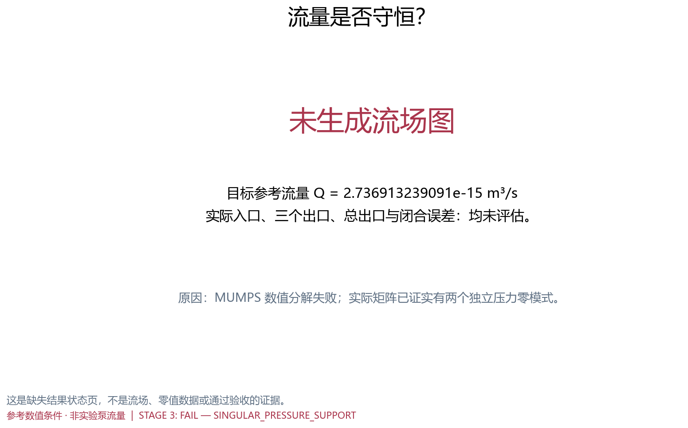

## 三个出口各分到多少流量？

三个带符号 Q_i 和流量比例均未知；没有预设分流。正常期望正净流出仍不是自动 hard gate；若将来实际解出现负净流出，需标 MANUAL_PHYSICS_REVIEW。本次不存在可解释的出口符号。

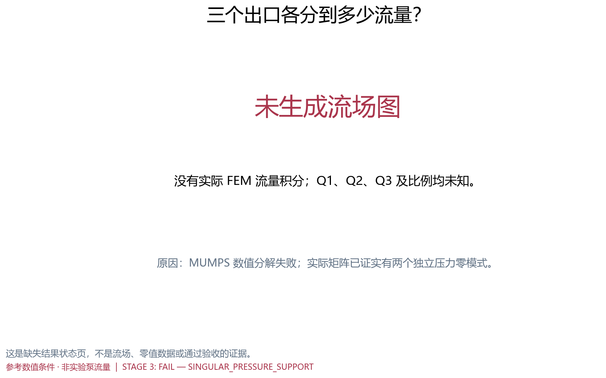

## 速度场是什么样？

没有有效 P2 速度系数，不能生成真实三维速度图或 2–4 个内部速度切面。实际壁面 DOF 速度、divergence L2 和相对诊断也未获得；创建了 no-slip BC 不等于验证了求解后 no-slip 数值。

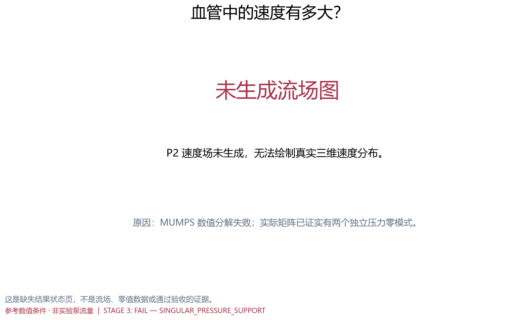

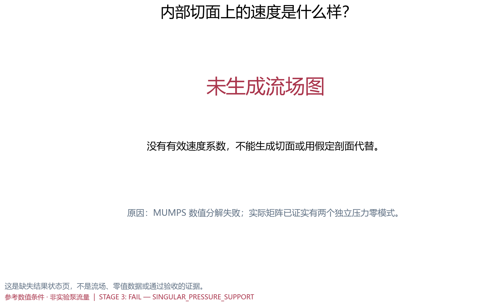

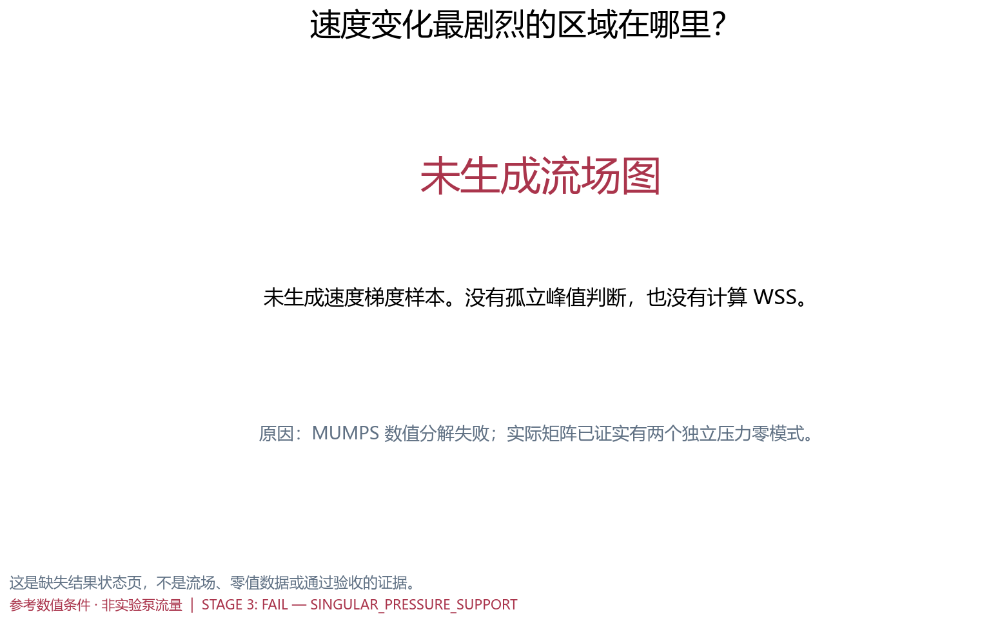

## 压力场是什么样？

没有有效 P1 压力系数或 λ。入口、三个出口和内部截面面积平均压力均未计算。**零牵引出口不等于 pointwise p=0**；本次两个局部压力零模式属于壁面约束后离散支撑缺失，不是可随意用 pressure pin 消除的全局 gauge 自由度。

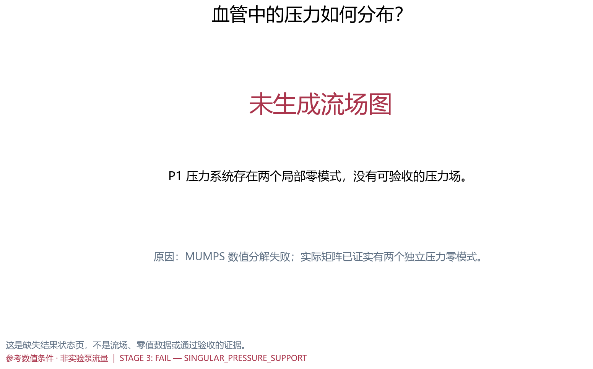

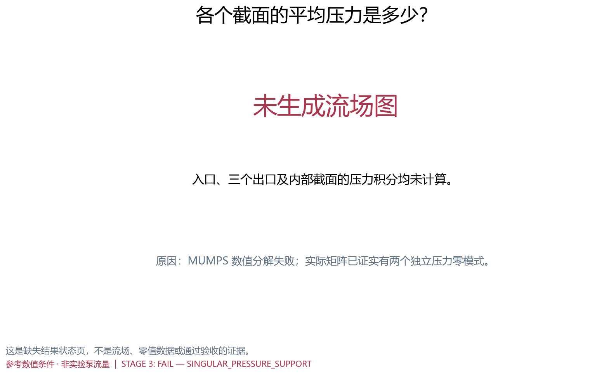

## Stokes 假设是否合理？

用真实入口投影几何和参考 Q 计算，而非使用不存在的求解速度：A=7.819752106110e-12 m²，P=9.918353536162e-06 m，Dh=4A/P=3.153649273581e-06 m，Umean=Q/A=3.500000002496e-04 m/s。

**Re=ρ Umean Dh/μ=0.000337546558575**，远低于 1，支持该参考条件下采用 Stokes 近似。它不证明网格收敛、实验物理充分成立或当前离散系统可解；也不改变本阶段 FAIL。

## 那 3 个低质量 tetra 有影响吗？

三个物理质心全部在当前 DOLFINx 网格中重新定位，匹配位移均为 0 m。两个相邻 residual tetra（minSICN≈0.062380、0.088715）的 4 个顶点和 6 条边中点全部被 wall no-slip 固定，因此整个 P2 速度多项式在这两个 tetra 上均被约束为零。

两个 P1 压力基函数的全部支撑仅落在这些 tetra 上。壁面消元后，它们与自由速度的散度耦合消失，产生上述两个严格零行、零列。这个实际秩缺陷已经超出“低质量但解是否有局部 spike”的筛查问题；是本次不可解的直接证据。第三个 residual tetra 完成位置核实，未获得流场样本。

速度、压力、梯度 Frobenius norm、应变率 norm、涡量以及一阶面邻居 min/median/max/ratio 均 **未评估**。没有使用固定 2×/5× 判据，没有平滑，也不能给 local finite hard gate 盖章。对低质量单元的完整流场影响仍需有效解和后续收敛研究；当前已经证实的是两个局部压力零模式。

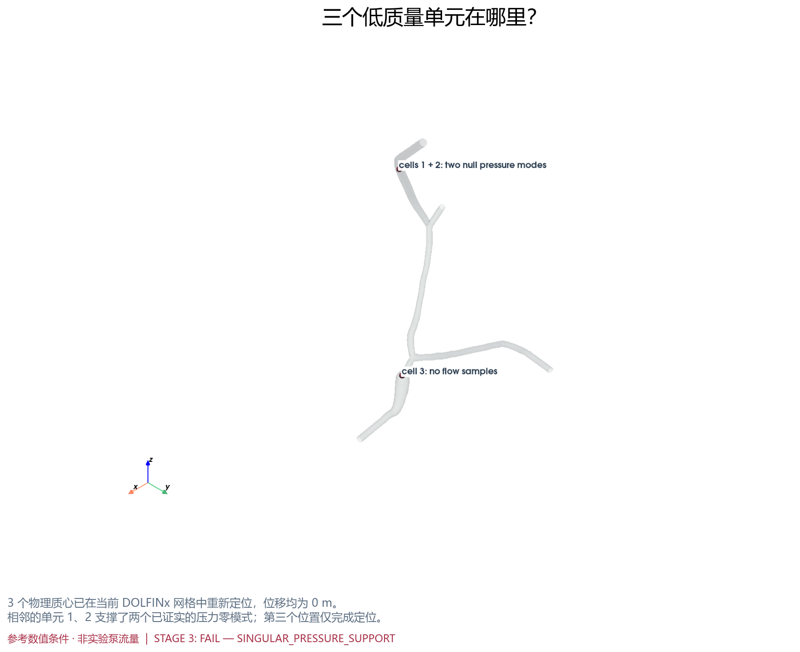

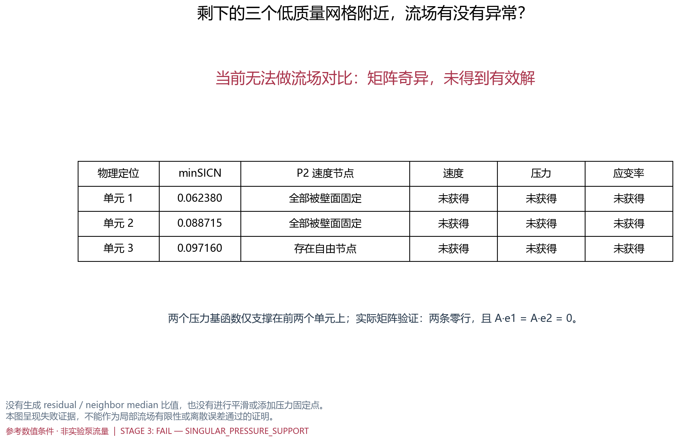

## 真实计算花了多少资源？

远端 `f7c62a262077`：AMD Ryzen 7 7800X3D，8 物理核/16 线程，CPU cgroup 额度 7.68 核；物理 RAM 61.954 GiB，容器 memory.max 42.056 GiB。正式尝试前有效可用 RAM 34.928 GiB；磁盘约 242.2 GiB 空余。

冻结环境：DOLFINx 0.11.0、PETSc 3.25.5、MUMPS 5.8.2、MPICH 5.0.1；无 GPU。仅组装 2.860794 s，正式失败尝试整体 17.089340 s。后者包含 MPI 启动、组装和失败分解，**不能称为成功 solve time**；没有成功 factorization/solve 的独立时长。

Linux `resource.getrusage(RUSAGE_CHILDREN)` 记录最大单子进程峰值 **3.052368 GiB**。最初的进程组 RSS 采样未包含使用不同 process group 的 MPICH worker，约 5.5 MiB 的错误总量已明确排除，不能当成整个求解的内存。容器整体采样峰值 16.991 GiB 包含其他进程与缓存，也不是 FEM RSS。完整 MPI 同时 RSS 总峰值不可恢复，未为弥补计量重复分解。[资源计量说明](resource_accounting.json)

运行期间最小有效可用内存 25.064 GiB，cgroup OOM/oom_kill 均为 0，没有资源守卫终止；本次归类数学/离散系统 FAIL，**不是 DIRECT_SOLVER_RESOURCE_BLOCKED**。

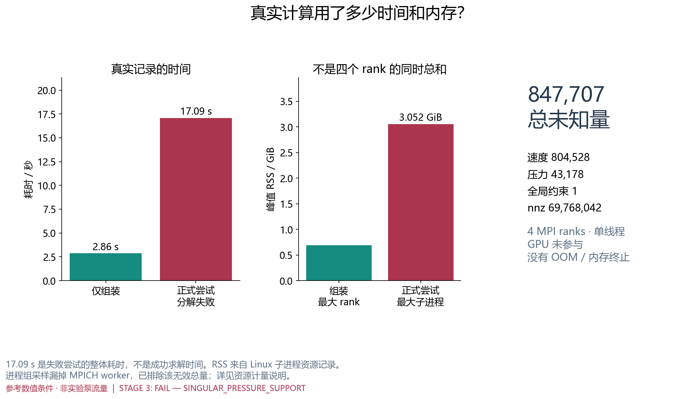

## 结果能否重新读取？

**NOT_EXECUTED_NO_SOLUTION。** 分解未成功，未创建 `checkpoints/primary.npz`，没有速度、压力或 λ checkpoint。不能用 mesh reload 冒充 solution roundtrip。保存并复核的是实际网格、组装、失败日志、资源记录、两个矩阵零模式与三个 residual 的物理定位证据。

[flow_field_contract.json](flow_field_contract.json) 记录 P2/P1、单位、梯度采样表示、λ 含义和流量符号，同时明确 `NO_VALID_SOLUTION`、`downstream_consumption_allowed=false`。预备的结果重读/派生场代码未能在真实解上执行，不视为已经验证；cell-center DG0 样本也不被宣称为 particle interpolation field。

## 当前还没有做什么？

没有 FEM–LBM 正式比较、mesh convergence、实验 Q_pump 正式 run、WSS validation、RBC/MB、粒子采样器或线性 scaling utility。没有更换网格、修改 Stage 2 核心、增加 stabilization 或 pressure pin 来强行获得解。

11 个要求的图路径均已建立，其中 **3 张实际几何/资源图、1 张实际失败诊断表、7 张明确标注“未生成流场图”的状态页**；实际流场图数量为 0。这些状态页不是原请求的成功流场交付。全部在 WSL 生成，详见 [可视化清单](visualization_manifest.json)。

## 是否可以进入下一阶段？

**不能。STAGE 3 STATUS: FAIL。REASON: SINGULAR_PRESSURE_SUPPORT。**
清理、网格 SHA/边界、P2/P1/单 Real 和仅组装检查通过；正式分解失败。流场有限性、实际 no-slip、入口流量、质量守恒、局部流场有限性及 solution roundtrip 均未评估，不能因为 regression tests 无失败就标 CONDITIONAL PASS。

完整 pytest：**288 passed、0 failed、0 errors、14 skipped**。Stage 3 的 20 个永久测试模块合计 21 passed、9 skipped；跳过均因正式解不存在，成功路径测试永久保留。另有 5 个历史跳过。矩阵零模式、拓扑支撑、无伪造结果和残余物理定位的失败路径测试已通过。[测试 XML](pytest_results.xml)

两个只读参考项目共 43,038 个条目的全量完整性检查 PASS；2,276 个历史文件和全部保留的旧 fem3d 源文件未改。用户已有 Stage 1 REPORT 修改按原字节保留，不纳入本次提交。[参考审计](reference_integrity.json) · [历史审计](history_preservation.json)

需要另行决定如何处理这个真实网格与指定混合空间的兼容性问题；本阶段按既定边界停止。没有启动下一阶段。
