# Stage SV1 — 使用 SimVascular 直接求解真实三维血管流场

**STAGE SV1 STATUS: FAIL。原因：FLOW_SOLVE_FAIL, MASS_BALANCE_FAIL, ACCEPTANCE_TEST_FAILURES。**

原生构建、官方最小算例和真实血管网格均通过。真实血管计算反复出现线性系统不收敛，在首个计划保存点第 10 步按官方停止机制结束。以下速度、压力、流量均来自原生求解器实际输出，但属于**未验收的瞬态诊断状态**，不能作为正式稳态血流结果。此次失败只描述这次固定配置的运行，不证明该几何在所有求解设置下都无法收敛。

## 这次删除了哪些无关路线？

已删除旧部署、异地计算及兼容性比较代码、相关配置、输出、日志和 23 个旧测试；初次清理共记录 366 个文件。仅保留 [SV0 历史报告](../sv0/REPORT.md)。现在只有 WSL 原生 SimVascular 生产路线。

[清理审计](cleanup_summary.json)列出逐文件删除记录、保留的共享文件及活动文本扫描。未修改的官方第三方发行包、源码及构建产物不视为本工程活动实现。旧工程文件清单采用无损压缩归档，保留原始内容哈希，不参与运行。

旧 FEM 全文件审计 **PASS**，覆盖 7440 项，内容、权限、修改时间、符号链接和 Git 状态均未改变；原有 `reports/stage01/REPORT.md` 未提交修改保持原样。证据：[只读审计](old_fem_readonly_audit.json)。

## 使用了哪个血管？

输入为旧工程正式 Stage 1.7 selected exterior surface：
`/home/lzy/projects/formal_3D_flow_solver/FEM/outputs/stage01_7/selected/surface/tagged_surface_si.npz`。

SHA256：`31746b2c2ef95a0b9044d96ef4b470a83592a91ae9132c5d6810736880734ac6`。
五份必要输入的源文件与副本 SHA256 全部相同，见 [输入清单](../../inputs/MANIFEST.json)。旧体网格只用于计算参考网格尺寸。

| 原始标签 | 语义 | 当前面 ID |
|---|---|---|
| 1 | WALL | 1 |
| 2 | OUTLET_03 | 2 |
| 3 | OUTLET_01 | 3 |
| 4 | INLET | 4 |
| 5 | OUTLET_02 | 5 |

身份由原始标签、连通面和几何来源确定，见 [面映射](../../configs/face_map.json)。

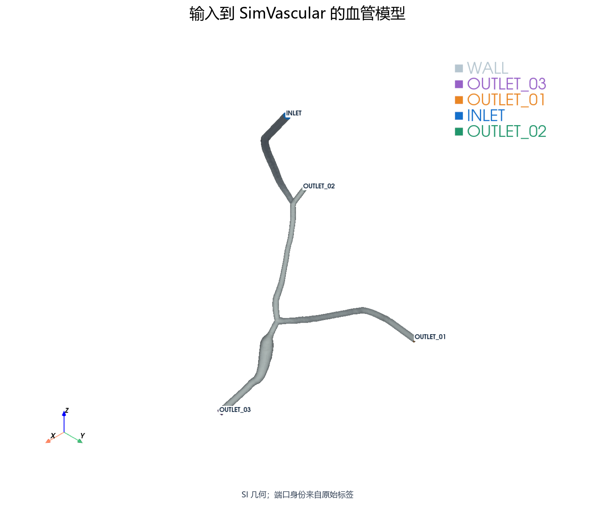

## SimVascular 是否正常工作？

官方 Linux distribution **2023.05.31** 已再次实际验证：launcher、embedded Python 3.5.5、`import sv`、`sv.modeling.PolyData`、`sv.meshing.TetGen` 均通过。核心 API 不依赖未使用的图像插件；启动日志中保留了该插件缺少旧版 ICU 的提示。

本地没有可用流体 executable，因此只原生构建官方 [svMultiPhysics](https://github.com/SimVascular/svMultiPhysics)，固定 commit `c3f0bb892b765b718f61069ecd9726dbc6d177fd`。executable：`/home/lzy/projects/formal_3D_flow_solver/FEM_SimVascular/external/build/native/svMultiPhysics-build/bin/svmultiphysics`；SHA256 `ca07a59ca52fc6318f99082d1d36934652750ecc98505db12cda39b9067a1ed7`。

使用系统编译器与 `/usr/bin/mpiexec`。已有系统 BLAS/LAPACK 直接复用；缺少 VTK SDK，故在工程内部仅构建 VTK 9.3.1 所需 I/O/几何模块。已有发行包中的网格静态库直接复用，没有重编网格库、完整 GUI 或额外代数后端。[构建记录](native_build_log.txt)、[依赖记录](native_dependencies.json)、[链接库记录](native_solver.json)均保留。

唯一官方 smoke 为原始 `fluid/newtonian`：4 ranks、exit 0、2.041 s，实际 VTU 的速度和压力均 finite。证据：[smoke](official_smoke.json)。

## SimVascular 如何生成网格？

正式流水线：原始 tagged surface → PolyData model → 保留五个面角色 → `sv.meshing.TetGen` 同时启用 surface 和 volume meshing → `SV_MESH`。

全局尺寸为旧 Stage 1.7 体网格唯一边长中位数：`h_ref=3.917947590640e-07 m`。只生成一个 primary candidate，用时 66.406 s；未使用允许的 0.8 倍失败回退，也未扫描参数。全程坐标单位为 m。

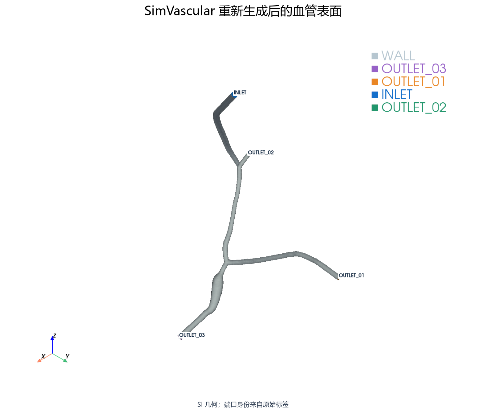
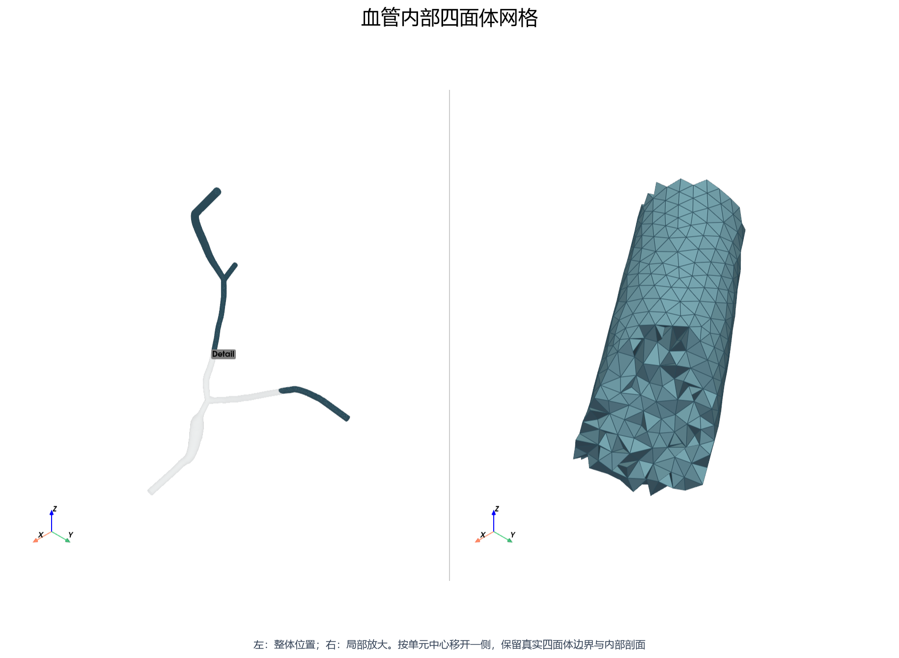

## 新网格有效吗？

**PASS**：70,363 个节点，371,402 个四面体；一个连通体，外表面闭合，五种边界完整，inverted / degenerate / non-finite 均为 0。

| 指标 | 实测值 |
|---|---:|
| minSICN 最小值 | 0.150197728 |
| P1 | 0.279035081 |
| P5 | 0.478717179 |
| median | 0.852511806 |
| P95 | 0.962856011 |
| minSICN < 0.1 | 0 |

独立计算线性四面体理想映射的 signed inverse Frobenius condition number；分布供人工审核。证据：[有效性](mesh_validity.json)、[质量](mesh_quality.json)。

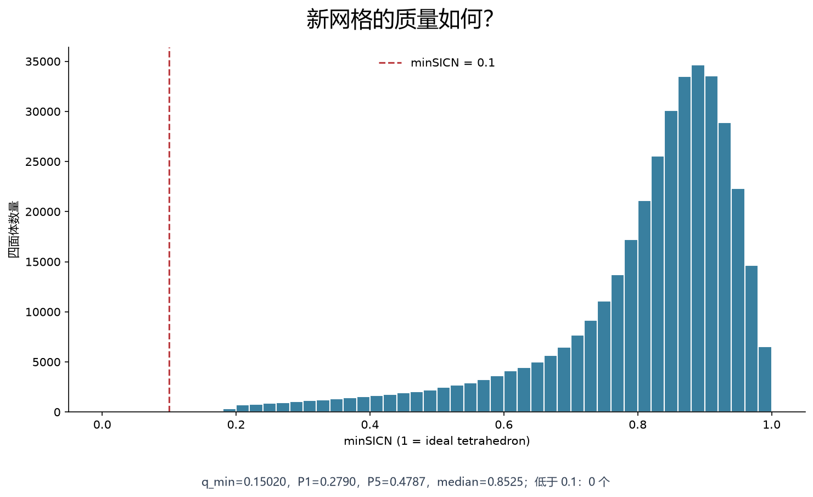

## 血管几何有没有明显改变？

重新三角化产生了可测变化，不能称为完全相同：壁面双向 closest-surface distance 的 max / P95 / RMS 分别为 **6.691851375e-08 / 1.398845704e-08 / 7.095672639e-09 m**；max/h_wall=0.282153。测量覆盖两个方向的全部顶点和三角形重心，是采样距离，不是连续曲面的严格 Hausdorff 上界。

包围体积相对变化 **0.676911%**；实际体积 1.450795109185e-15 m³。数值几何变化按生成前冻结的 SV1 策略留给人工审核，拓扑及端口身份为硬检查。

| 端口 | 面积相对变化 | 重心位移 / m | 法向点积 | 连通片 / 翻转 |
|---|---:|---:|---:|---|
| OUTLET_03 | 1.204623% | 1.560786e-09 | 1.000000000000 | 1 / 否 |
| OUTLET_01 | 1.364776% | 8.191911e-10 | 1.000000000000 | 1 / 否 |
| INLET | 0.805093% | 1.350923e-09 | 0.999999999999 | 1 / 否 |
| OUTLET_02 | 1.767674% | 1.687974e-09 | 0.999999999999 | 1 / 否 |

没有端口丢失、合并、拆分或法向翻转。各端口前后面积、三维重心和法向原始值见 [几何 QC](geometry_qc.json)。

## 流动条件是什么？

**REFERENCE NUMERICAL CONDITION；NOT EXPERIMENTAL FLOW；experimental=false。**
来自冻结的 Stage 3 物理配置，只读取参考物性和总流量：rho=1056.0 kg/m³，nu=3.27000000e-06 m²/s，mu=rho·nu=3.45312000e-03 Pa·s，Q=2.736913239091e-15 m³/s。

刚性壁、Newtonian 不可压缩流体，SI 单位。实际入口面积 7.756795804428e-12 m²，Umean=3.528406971250e-04 m/s，Dh=3.136327948356e-06 m，Re=3.384171681072e-04。这不是实验泵流量。见 [正式物理配置](../../configs/sv_reference.yaml)。

## 边界条件是什么？

入口采用官方 `Flat + Impose_flux + Zero_out_perimeter`：内部为恒定幅值，29 个共享壁面周边节点置零，靠周边一层采用离散线性过渡。为同时满足 no-slip 与总流量，内部速度幅值为 4.237494383090e-04 m/s，区别于几何平均速度 Umean；这不是严格每个入口节点均非零的平顶剖面。

按实际三角面与官方节点法向对写入后的 prescribed velocity 重新积分：Q_written=2.736913239091e-15 m³/s，相对误差=0.000e+00 ≤ 1e-10。微小非平面法向对齐因子 0.999999999713 在求解前一次修正。该边界文件明确命名 `PrescribedVelocity`，未当作解场。

WALL：u=0。三个出口均为官方 `Neu, Value=0` 自然压力/牵引参考，代表表压参考负载；**不等于所有出口节点逐点 p=0**。没有 RCR、resistance 或预设分流。

[官方边界初始化源码](https://github.com/SimVascular/svMultiPhysics/blob/c3f0bb892b765b718f61069ecd9726dbc6d177fd/Code/Source/solver/baf_ini.cpp)和[边界处理源码](https://github.com/SimVascular/svMultiPhysics/blob/c3f0bb892b765b718f61069ecd9726dbc6d177fd/Code/Source/solver/set_bc.cpp)支持上述实现；本次 [solver XML](../../configs/sv_flow.xml)及其 SHA 在运行前冻结。

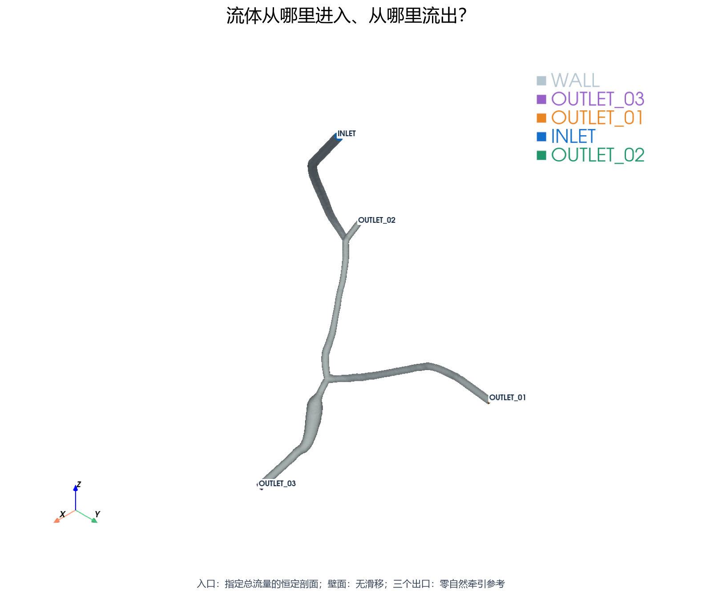

## solver 是否运行成功？

**进程运行并输出真实结果，但数值求解未通过。** 当前固定版本没有使用正式 steady PDE 开关，采用 constant BC 的 `fluid` transient-to-steady；BC 的 `Time_dependence=Steady` 仅指边界常量。[官方时间推进实现](https://github.com/SimVascular/svMultiPhysics/blob/c3f0bb892b765b718f61069ecd9726dbc6d177fd/Code/Source/solver/main.cpp)。

4 MPI ranks，OMP_NUM_THREADS=1，实际 exit=0，GNU time 壁钟时间 7514.00 s（2:05:14），Python monotonic 计时 2854.973 s；最大单进程 RSS 232.02 MiB（GNU time，非并行进程内存总和）。没有使用 GPU。两种时钟实测不一致，原始记录均保留，不据此做性能推断；详见 [资源记录](solver_resource_usage.json)。

原计划首段 400 步。日志记录 **28 次线性系统不收敛**、**12 次病态左端矩阵警告**。即使外层残差降得很小，也不能据此认定内层线性系统收敛。已通过官方 `STOP_SIM` 请求在第 10 步保存后退出：exit 0 表示正常停止，**不表示计划计算完成或物理验收成功**。

本次固定 LS 为内置 NS/FSILS：外迭代上限 30、相对容差 1e-10、绝对容差 1e-24、Krylov 维数 100、内层 GM/CG 容差 1e-3。它们是本次选定设置，并非声称全部采用官方默认数值。原始 LS 设置、dt、物性、BC 均未在运行中调整；未使用延长机会，因本次触发的是数值失败停止规则。保留 [停止决定](flow_stop_decision.json)、[执行记录](flow_execution.json)、[完整原始日志](../../logs/sv1/vascular_flow_first_block.log)。失败原因尚未被隔离为某一个机制，不将警告直接归因于网格或单位。

正式验收测试：**18 passed，3 failed，0 skipped**。失败没有被改写为跳过或预期失败：

- `tests.test_sv1_mass_balance.test_actual_field_mass_conservation`：sv_validation.validation.ValidationError: Actual solution fails inlet or mass conservation gate
- `tests.test_sv1_solver_result.test_real_solver_converged`：AssertionError: FLOW_SOLVE_FAIL: 28 linear warnings
- `tests.test_sv1_solver_result.test_required_steady_intervals_reached`：AssertionError: NOT_REACHED: 1 saved state(s), five consecutive intervals required

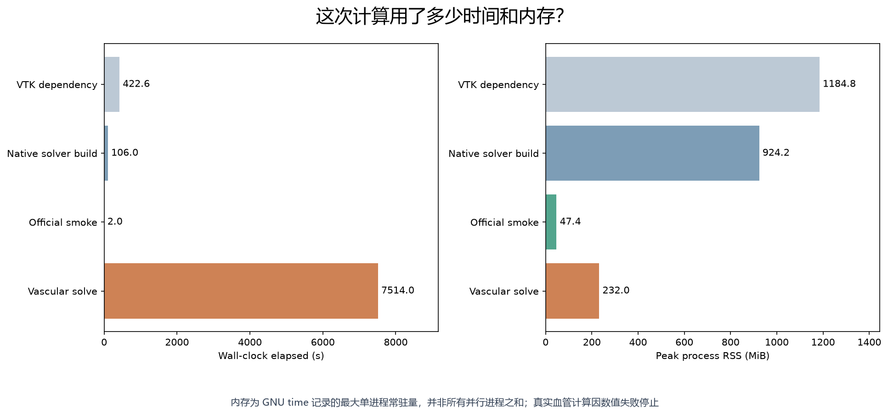

## 是否达到稳态？

**NOT_REACHED**。dt=min(0.5·h10/Umean, 0.05·Dh²/nu)=1.504060091688e-07 s；h10=2.756719658908e-07 m，t_nu=3.008120183376e-06 s。原计划 400 步为 20 t_nu，最多一次同长度 checkpoint 延长；本次实际只到 t=1.504060091688e-06 s（0.5000 t_nu）。

保存间隔 10 步，目前只有 1 个实际保存状态，无法验证连续五个保存区间同时满足 velocity change≤1e-5 和 boundary flow change≤1e-6。逐步边界日志中的趋势不代替上述联合判据。[冻结时间策略](../../configs/time_policy.json)、[稳态验收](steady_state.json)。

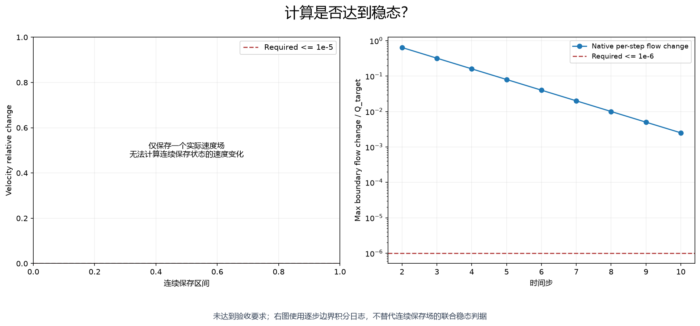

## 速度场如何？

实际文件：`outputs/sv1/vascular_flow/4-procs/result_010.vtu`，SHA256 `c9e7b503b1c61c82d3bbd6faeac0ca2b6876749792a66f2397e333e758be348b`。原生 point arrays 为 `Velocity` 与 `Pressure`。
速度 finite=True，最大速度 1.251456740472e-03 m/s，体积积分 L2 范数 1.008787260825e-11 m^(5/2)/s。全局图显示实际体网格节点；切片由该实际场线性插值得到。**属于失败运行的瞬态诊断，不是可采信的稳态速度分布。**

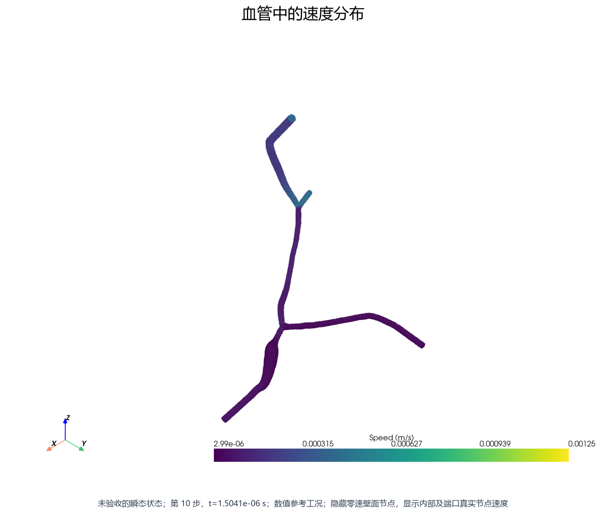
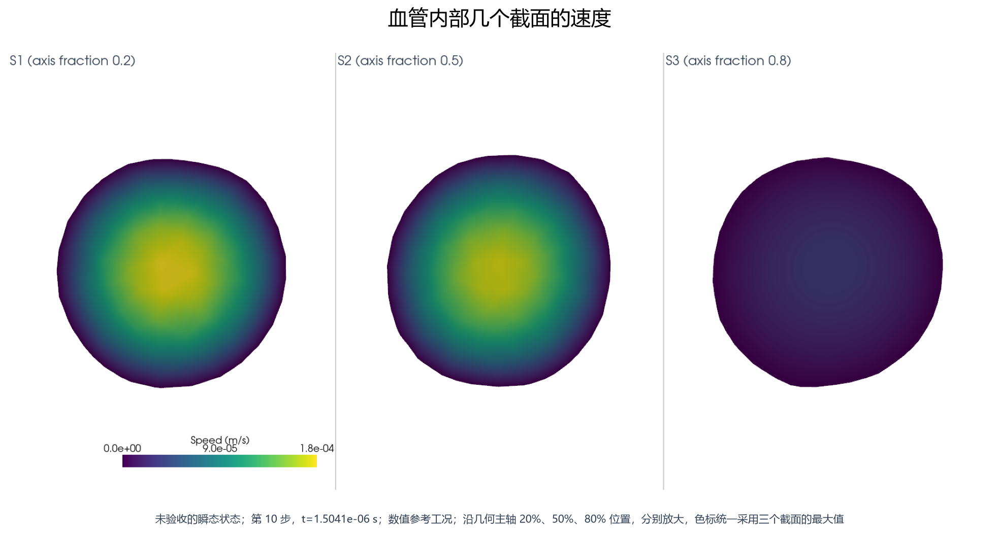

## 压力场如何？

压力 finite=True，全域范围 [-2.218058920041e-01, 3.918050189023e+02] Pa。压力图采用原生实际压力；截面平均是几何主轴法向平面的面积加权值，平面可能同时穿过多个分支，不能当作某根血管中心线压降。出口压力采用自然牵引参考，不额外平移或钉住压力。

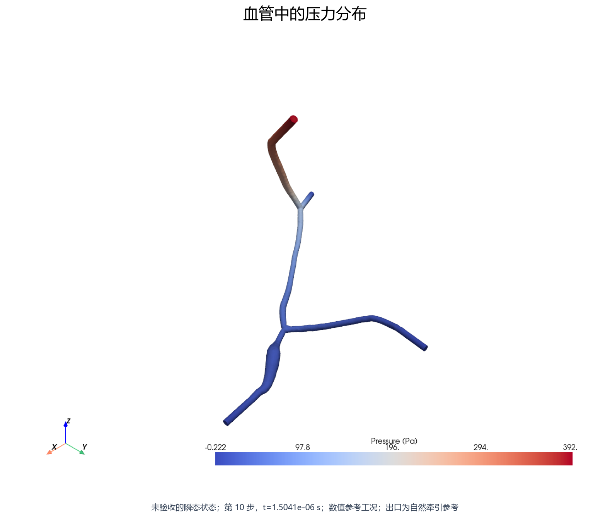
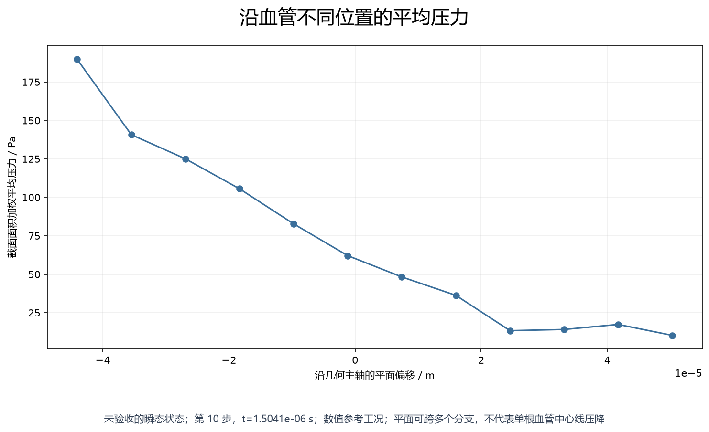

## 流量守恒吗？

**FAIL / MASS_BALANCE_FAIL**。所有流量由实际 VTU 的四个端口外法向三角面独立积分；入口向内为正。线性三角面通量为精确 P1 积分。

| 指标 | 实际值 |
|---|---:|
| Qtarget / m³/s | 2.736913239091e-15 |
| Qin / m³/s | 2.736913239091e-15 |
| Qout1 / m³/s | 1.163964532270e-16 |
| Qout2 / m³/s | 2.329710968771e-15 |
| Qout3 / m³/s | 2.881330502570e-16 |
| Qout total / m³/s | 2.734240472256e-15 |
| epsilon_Q = abs(Qin−Qtarget)/Qtarget | 1.297035661486e-15 |
| epsilon_mass = abs(Qout−Qin)/Qtarget | 9.765624999999e-04 |

两项门限均为 1e-6。独立 VTU 积分与原生边界积分日志的最大差/Qtarget=1.042514030181e-11，支持后处理对应正确，但不消除质量闭合失败。证据：[实际场 QC](flow_qc.json)。此处只说明该未收敛瞬态状态的守恒误差，不外推到尚未得到的稳态解。

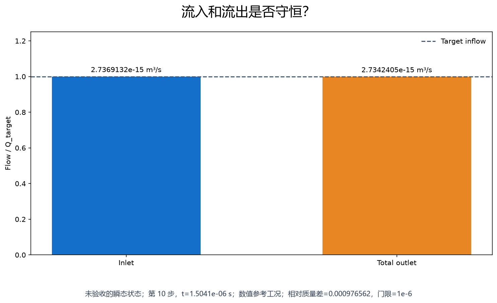

## 三个出口怎么分流？

以下比例是当前诊断状态的实测 Qout_i / sum(Qout)，没有预设。**不作为稳态分流结论。**

| 出口 | 流量 / m³/s | 占当前总流出量 |
|---|---:|---:|
| OUTLET_01 | 1.163964532270e-16 | 4.25699401% |
| OUTLET_02 | 2.329710968771e-15 | 85.20505027% |
| OUTLET_03 | 2.881330502570e-16 | 10.53795572% |

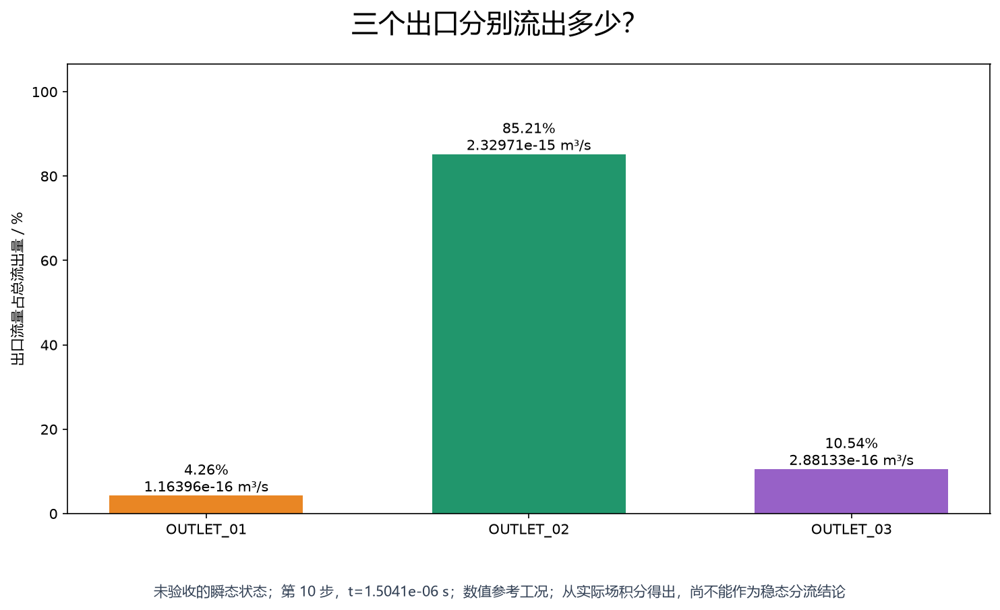

## 壁面 no-slip 是否满足？

实际 wall 节点速度 magnitude：max=0.000000000000e+00 m/s，P95=0.000000000000e+00 m/s。检查门限为 1e-10·Umean=3.528406971250e-14 m/s，结果 **PASS**。共享入口周边节点也包含在壁面检查内。

## 结果能否重新读取？

**诊断文件重读 PASS；物理验收仍为 FAIL。** 原生进程结束后，在新的 Python 进程重新读取原始 VTU，复核文件 SHA256，并重新计算速度 L2、压力范围、入口/三个出口流量与质量闭合。

重读相对速度范数差 0.000e+00，最大流量差/Qtarget 0.000e+00，压力范围一致=True。这证明失败状态保存、解析和积分可复现，不意味着存在已验收的最终流场。[重读证据](solution_reload.json)、[测试结果](pytest_results.xml)、[图片来源](visual_provenance.json)。

## 当前还没有做什么？

- experimental pump flow
- mesh convergence
- WSS validation
- RBC/microbubble
