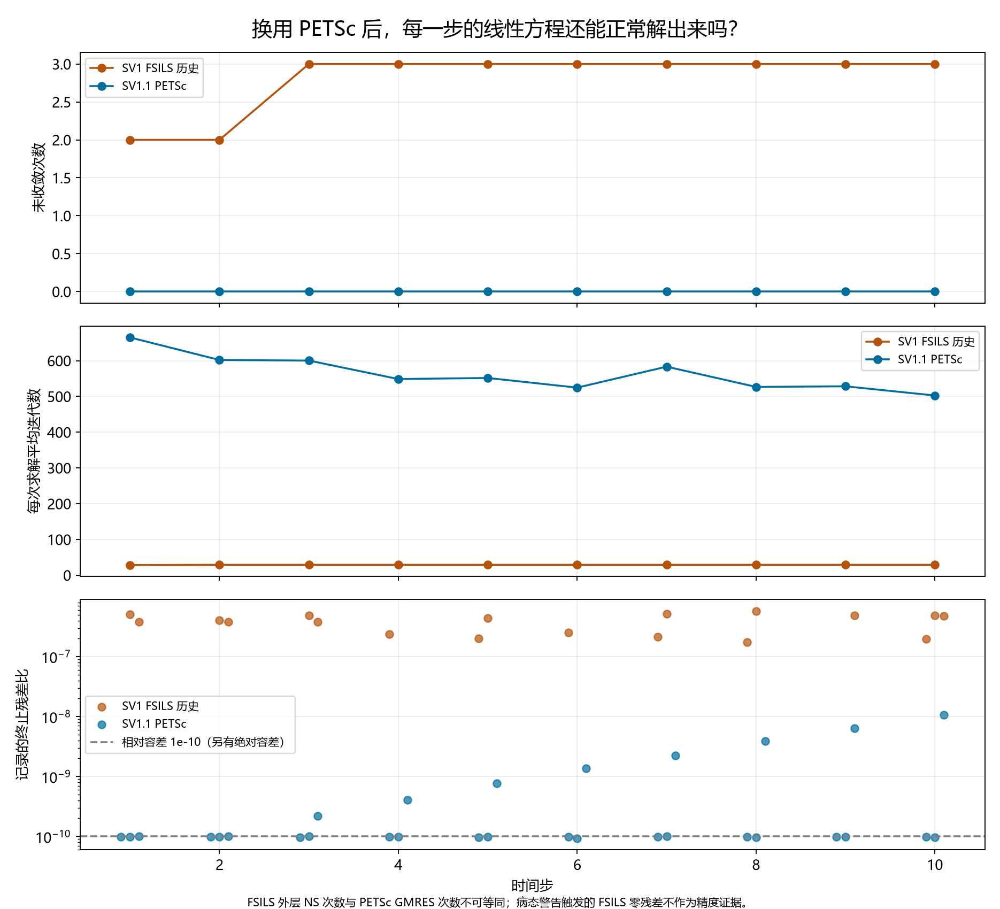
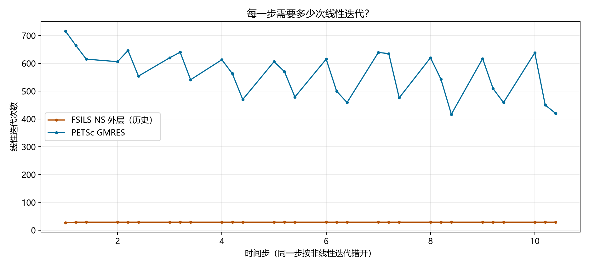
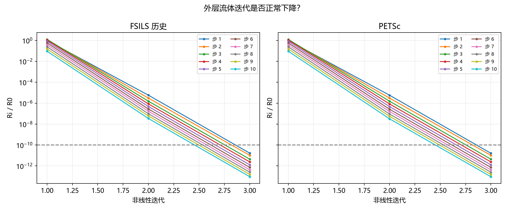
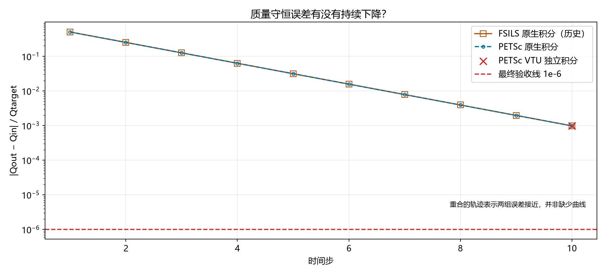
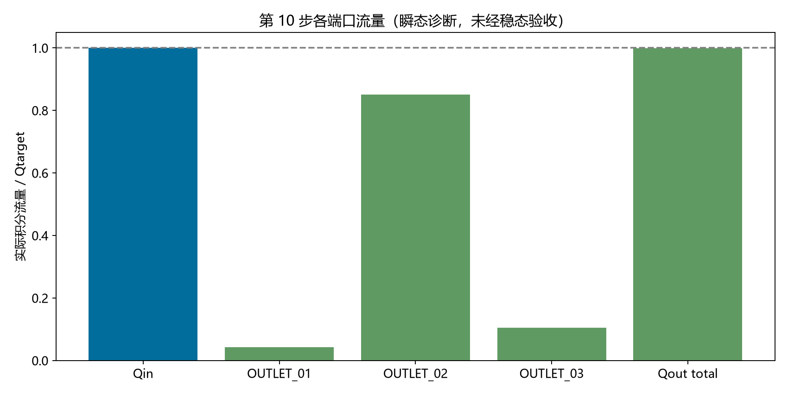
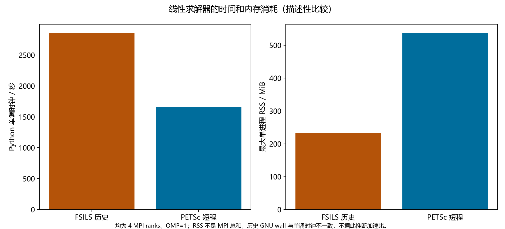

# Stage SV1.1 — 调整 SimVascular 求解器并重新验证真实血流

**STAGE SV1.1 STATUS: FAIL**  
**REASON: SHORT_RUN_MASS_NOT_IMPROVED**

前 10 步独立积分质量误差未严格优于 SV1，短程硬门槛失败。
已执行的前 10 步：LINEAR_SOLVER_PASS，非线性收敛=True；正式 full run 和稳态验收未执行。

## SV1 为什么失败？

重新读取冻结 XML、完整日志和真实 VTU 后确认：网格有效；SV1 的 30 次顶层线性求解中，28 次报告未收敛，另有 12 条病态 LHS 警告。问题在第 1 步已出现，并非后期才恶化。计划 400 步，实际仅到 10 步；第 10 步 ε_mass=0.0009765624999998679，没有达到稳态。

逐步、逐非线性迭代、逐顶层线性求解的证据见 [baseline_linear_history.csv](baseline_linear_history.csv)、[baseline_boundary_history.csv](baseline_boundary_history.csv) 和 [完整诊断](baseline_solver_diagnosis.json)。FSILS NS 内部 GM/CG 的逐次轨迹没有被旧日志记录；没有伪造这些记录，也没有重跑 FSILS。

冻结配置为 NS/FSILS，外层最大 30，rtol=1e-10，atol=1e-24，Krylov=100；内部 GM 最大 20、CG 最大 1000，二者容差 1e-3。源码显示病态分支可能把残差诊断置零，因此旧日志中的零残差不证明高精度收敛。

## 这次哪些东西完全没动？

geometry、selected volume/surface mesh、face IDs、WALL/INLET/三个 OUTLET、rho、mu、Q_reference、入口速度规定、wall no-slip、三个 zero-Neumann outlet、初始条件、dt、保存频率和 time-policy 均保持冻结。

生产 XML 仅 LS 部分不同：[xml_diff.txt](xml_diff.txt)。前 10 步仍使用原 XML 中的 400 步计划，通过官方 STOP_SIM=10 停止；网格路径经新目录中的符号链接解析到原冻结文件。完整性审核检查 178 项 SV1 历史条目和 7440 项旧 FEM 条目，结果 **PASS**；旧 FEM 原有 Git 工作区差异也未变化。见 [preservation_audit.json](preservation_audit.json)。

## 换了什么？

只更换线性代数实现：FSILS → PETSc 3.19.6，GMRES，restart=100，最大 2000 次；右侧 ASM 预条件，overlap=2，每个子域使用 PETSc 自带 ILU(2)。这一固定配置保留速度—压力耦合，适用于当前非对称系统，未引入其它线性代数包，也未进行多个 PC 或 MPI 数量扫描。

XML 中的 `petsc-jacobi` 是当前接口接受的初始 PC；现有 `KSPSetFromOptions` 在设置阶段把它覆盖为 ASM，运行日志证实实际 PC。源码中的 XML rtol/atol 写入 FSILS 参数而非 PETSc 参数，restart 调用也被注释，所以新 XML 删去这些无效字段，改由明确冻结的 `PETSC_OPTIONS` 设置并核验；没有宣称被忽略的 XML 选项已生效。

容差未放宽。两者在未约束的自由度上采用相同的对角缩放公式 `W_ii = 1 / sqrt(abs(A_ii))`，零对角按 1 处理。PETSc 使用右预条件和缩放系统的未预条件残差范数，零初始猜测；判据为 `||W(b-Ax)||₂ < max(1e-10 ||Wb||₂, 1e-24)`。固定 Dirichlet 自由度的修正及右端项为零。并行归约和递推残差并非逐位相同；日志另含 true residual。部分末次求解由绝对容差通过，不能只看相对比值。子域 `preonly` 是一次因子应用，KSP view 中的默认子域 rtol 不参与迭代停止。

详见 [实际设置与容差对应](petsc_settings.json)、[固定源码能力](linear_solver_capabilities.json)；PETSc 官方定义见 [KSPConvergedDefault](https://petsc.org/release/manualpages/KSP/KSPConvergedDefault/) 和 [KSPSetFromOptions](https://petsc.org/release/manualpages/KSP/KSPSetFromOptions/)。具体行为已核对本地 3.19.6 源码。

## PETSc 真正启用了吗？

**YES。Build PASS；official fluid/newtonian smoke PASS。** 原 binary 未链接 PETSc。本机没有兼容开发库；Ubuntu 开发包的模拟安装将新增 81 个包，因此按 [官方源码构建方式](https://petsc.org/release/install/install_tutorial/) 在工程内构建最小 PETSc，复用系统 Open MPI 与 BLAS/LAPACK。未构建 Trilinos、MUMPS、HYPRE 或 CUDA。最初的 Python/库名配置问题及修正保留在 build manifest。

svMultiPhysics 仍为 `c3f0bb892b765b718f61069ecd9726dbc6d177fd`，源码未修改。新 binary SHA256：`b474676e457a4d8c35eb22e7157a079eaae9f16c54f64eff75a73361ecdf9560`。`ldd` 显示实际链接 PETSc；smoke 的 4 次求解均有正向收敛原因，新 VTU 含有限速度、压力。4 MPI ranks，OMP=1。

[构建清单](petsc_build_manifest.json)含版本、路径、编译器、MPI、CMake 命令、库链接及 SHA256；[smoke 结果](petsc_smoke.json)、[smoke 原始日志](../../logs/sv1_1/petsc_smoke.log)及真实案例 [原始日志](../../logs/sv1_1/petsc_short.log)提供运行证据。

## 前 10 步与旧 FSILS 相比如何？

| 指标 | SV1 FSILS 历史 | SV1.1 PETSc |
|---|---:|---:|
| 完成时间步 | 10 | 10 |
| 线性失败次数 | 28 | 0 |
| 病态警告 | 12 | 0 |
| 平均 / 最大迭代数 | 28.93333333333333 / 29 | 563.3333333333334 / 716 |
| step10 ε_mass，独立 VTU 积分 | 0.0009765624999998679 | 0.0009765625000001561 |
| 单调时钟用时 / s | 2854.973097987997 | 1661.414619175004 |

FSILS 列是 NS 外层次数，PETSc 列是 GMRES 次数，不能按次数直接比较计算工作量。质量误差减少量（旧−新）=-2.881809374466471e-16；严格改善门槛 **False**。近舍入量级的差异不代表实质物理改善。两次第 10 步速度场的相对 L2 差=2.011521095949623e-15，最大压力差=5.115907697472721e-13 Pa；见 [field_comparison.json](field_comparison.json)。

[solver_comparison.json](solver_comparison.json)、[新逐次求解表](petsc_short_linear.csv)、[新逐步边界流量](petsc_short_boundary.csv)。

## 线性问题解决了吗？

**YES（仅已执行的前 10 步；未执行区间不作结论）。** 已执行记录中线性失败=0，病态警告=0。外层非线性验收=True；验收程序同时检查残差，防止源码把达到迭代上限视作结束而被误报成收敛。

## 如果 YES，完整计算跑完了吗？

没有启动 400 步正式计算。短程硬门槛未通过，按要求停止；未从 FSILS checkpoint 启动，也未缩短 dt、改变算法或延长时间。

## 达到稳态了吗？

**NOT_REACHED / 尚无 accepted steady solution。** 冻结要求是最后连续 5 个保存区间 E_u≤1e-5、E_Q≤1e-6，E_Q 继续按冻结实现以 Qtarget 归一化。短程只有 1 个已保存状态，不能形成这些区间。

## 质量守恒达到要求了吗？

尚未获得通过最终质量验收的正式解。 最新短程诊断的 ε_Q=1.297035661486338e-15，ε_mass=0.0009765625000001561。最终阈值仍为两者≤1e-6；短程门槛只要求 ε_mass 严格优于 SV1，没有将最终阈值提前强加到第 10 步。

独立计算来自实际 VTU 的 P1 三角面通量积分，未用目标 Q 代替实测流量；原生积分与独立积分的最大差值/Qtarget=1.042542853195368e-11。

质量误差轨迹接近逐步交替减半。这与固定 generalized-alpha 参数及启动入口条件一致，是源码与测量支持的**推断**，并未用解析递推值替代实测值或放宽门槛，详见 [startup_mass_analysis.json](startup_mass_analysis.json)。

## 正式速度场和压力场

没有 accepted steady solution，所以未生成正式 velocity_global / velocity_slices / pressure_global / pressure_sections 图。没有复用 SV1 图片。

短程真实字段的 finite velocity=True，finite pressure=True，wall no-slip=True。这些是瞬态诊断，不能替代正式流场验收。

## 三个出口最终各流多少？

最终份额 **N/A**；稳态未通过，未发布正式 outlet fractions，也未生成 outlet_flow_split.png。

## 资源消耗

短程用时=1661.414619175004 s；最大单进程 RSS=549904 KiB，不能当作四个 MPI 进程的内存总和；MPI=4，OMP=1。正式 full runtime=N/A。完整资源原文见 [petsc_short_resources.txt](../../logs/sv1_1/petsc_short_resources.txt)。

SV1 的 Python 单调时钟与 GNU time wall 记录不一致，二者均保留，仅作描述性比较，不推断加速比。

## 结果能否重新读取？

**PASS（unaccepted transient diagnostic）**。新 Python 进程重新读取同一 VTU，速度 L2、压力范围、Qin、三个 Qout、质量闭合和 wall no-slip 均逐项比较；见 [solution_reload.json](solution_reload.json)。

正式 accepted solution reload=N/A，尚无正式 accepted solution。

## 下一步还剩什么？

本阶段停止于 **SHORT_RUN_MASS_NOT_IMPROVED**。线性稳定性在已执行的 10 步内已验证。下一独立阶段应先审视启动质量误差与短程比较门槛的关系；本阶段不改变初始条件、时间积分或任何冻结参数，也不越过失败门槛启动 full run。

SV1.1 测试：38 passed，1 failed，4 skipped。完整 pytest：56 passed，4 failed，4 skipped。按用户确认，SV1 的历史失败另列，旧测试及证据未改；没有用 xfail 或删除测试隐藏失败。未执行的下游验收明确 skipped，不视作通过。

失败项目：

- `tests.test_sv11_short_run_mass::test_actual_step_ten_mass_strictly_improves`
- `tests.test_sv1_mass_balance::test_actual_field_mass_conservation`
- `tests.test_sv1_solver_result::test_real_solver_converged`
- `tests.test_sv1_solver_result::test_required_steady_intervals_reached`

[SV1.1 JUnit](pytest_sv11.xml)、[完整 JUnit](pytest_all.xml)、[测试口径与分类](test_results.json)。

本阶段新图（诊断图不等于正式结果）：

- [linear_solver_before_after.png](linear_solver_before_after.png) — diagnostic comparison
- [linear_iterations_over_time.png](linear_iterations_over_time.png) — diagnostic comparison
- [mass_balance_over_time.png](mass_balance_over_time.png) — diagnostic comparison
- [nonlinear_convergence.png](nonlinear_convergence.png) — diagnostic comparison
- [steady_convergence.png](steady_convergence.png) — availability / steady gate evidence
- [flux_balance.png](flux_balance.png) — unaccepted transient diagnostic
- [solver_resource_usage.png](solver_resource_usage.png) — diagnostic comparison

未生成的正式图：velocity_global.png, velocity_slices.png, pressure_global.png, pressure_sections.png, outlet_flow_split.png；原因：缺少 accepted steady solution。
