# Stage SV1.2 — 使用稳定 PETSc 求解器完成真实三维血管稳态流场

**状态：CONDITIONAL PASS**；数值验收完成，等待用户人工审核正式场图。

## 为什么现在可以继续完整计算？

只重查 SV1.1 已有证据，未重复短程 benchmark。前 10 步的 30 次 PETSc 求解全部收敛，0 linear failures、0 ill-conditioned warnings，外层非线性收敛、速度和压力有限、实际壁面零速。SV1 与 SV1.1 的历史 FAIL 状态保留。

[前置证据](prerequisites.json)、[原生续算审计](restart_decision.json)。checkpoint 含完整 Y_n、A_n、时间步、物理时间和方程初始范数；同一网格、二进制与四个 MPI ranks。VTU 仅用于独立 QC，未用作 restart。

## 这次改了什么？

没有改变科学模型。SV1.2 policy 取消 step10 质量误差必须严格优于 FSILS 的短程排名门槛；没有修改 SV1.1 历史报告。本阶段继续原定完整时间块，移除短程 STOP_SIM=10，XML 只启用合法 native restart；若批准规则触发唯一一次 extension，则仅把总步数改为 800。

## 哪些内容完全冻结？

| 项目 | 实测值 |
|---|---:|
| geometry | True |
| mesh | True |
| physics | True |
| BC | True |
| dt | True |
| PETSc_settings | True |
| MPI_OMP | True |

dt=1.5040600916882215e-07 s，每 10 步保存；rho=1056 kg/m³，mu=0.00345312 Pa·s，Qtarget=2.7369132390905703e-15 m³/s。上述值读取自冻结 artifact。原始入口流量、wall no-slip、三个 zero-Neumann outlets、积分参数及初值历史均保留。PETSc 3.19.6，right GMRES(100)，max 2000，ASM overlap 2 + ILU(2)，4 MPI ranks，OMP=1。逐项 SHA 与实际运行 OPTIONS 见 [冻结清单](frozen_input_manifest.json)。

最终保护审计 **PASS**：329 个历史条目、旧 FEM 7440 个条目及 Git 状态。没有历史文件、旧测试或旧失败状态被改写。

## 计算到底跑了多少步？

从合法原生 step10 checkpoint 开始；绝对时间步达到 **400**，SV1.2 新完成 390 步；extension 使用 0 次。累计物理时间 6.016240366753e-05 s，即 20 个粘性时间尺度。最终保存步为 400。前 10 步属于已验证继承证据，未重复计算。

## PETSc 全程稳定吗？

新增 linear failures=0，ill-conditioned warnings=0。逐次 KSP reason、报告残差和 true residual monitor 均保留，不以退出码代替收敛证据。

新增求解迭代分布：总数 789，总迭代 266547，mean=337.828897338，median=326，P95=601.2，max=691。

包含继承 step1–10 的完整历史：总数 819，总迭代 283447，mean=346.089133089，median=328，P95=640.1，max=716。

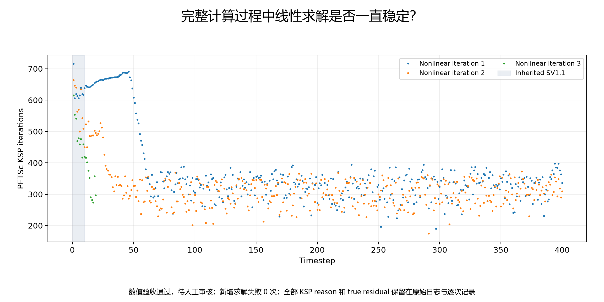

## 外层非线性求解稳定吗？

新增失败步数 0；总数 390，总迭代 789，mean=2.02307692308，median=2，P95=2，max=3。每步记录初始和最终缩放残差以及 Ri/R0、Ri/R1；最少 2 次、最多 12 次，残差门限沿用 1e-10。达到迭代上限不能单独视为收敛。

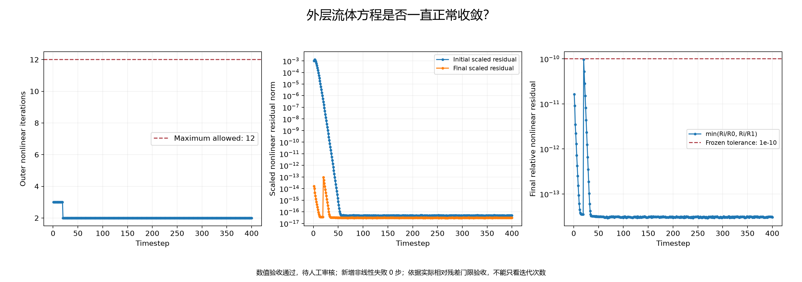

## 质量误差如何随时间变化？

所有 40 个保存状态均对原生 P1 速度做真实端面积分。step10 是复制的 SV1.1 QC 起点；其 εmass=0.0009765625。最新保存状态 εmass=0。早期 startup transient 不能替代最终质量验收。完整序列见 [mass_history.csv](../../outputs/sv1_2/qc/mass_history.csv)。

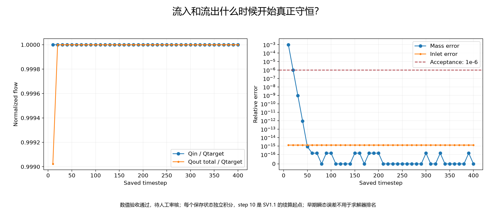

## 是否达到稳态？

首个通过质量门限的保存场：step 20；首次完整满足连续 5 个联合稳态区间：step 70。这些记录不触发提前停止，最终验收仍使用完整时间块的最后保存场。

联合 steady 判据：**True**。最后 E_u=1.88828468347e-15，E_Q=1.44115073498e-16；连续共同通过 38 个保存区间。E_u 由四面体 P1 速度差的精确体积 L2 积分计算，E_Q 为四端口通量差最大值/Qtarget；要求最后连续 5 区间 E_u≤1e-5 且 E_Q≤1e-6，至少需要 6 个连续保存状态。

| 保存区间 | E_u | E_Q | 联合通过 |
|---|---:|---:|---|
| 350 → 360 | 1.92108023e-15 | 3.60287684e-17 | True |
| 360 → 370 | 1.72415392e-15 | 9.00719209e-18 | True |
| 370 → 380 | 1.78415631e-15 | 3.60287684e-17 | True |
| 380 → 390 | 1.83191349e-15 | 1.44115073e-16 | True |
| 390 → 400 | 1.88828468e-15 | 1.44115073e-16 | True |

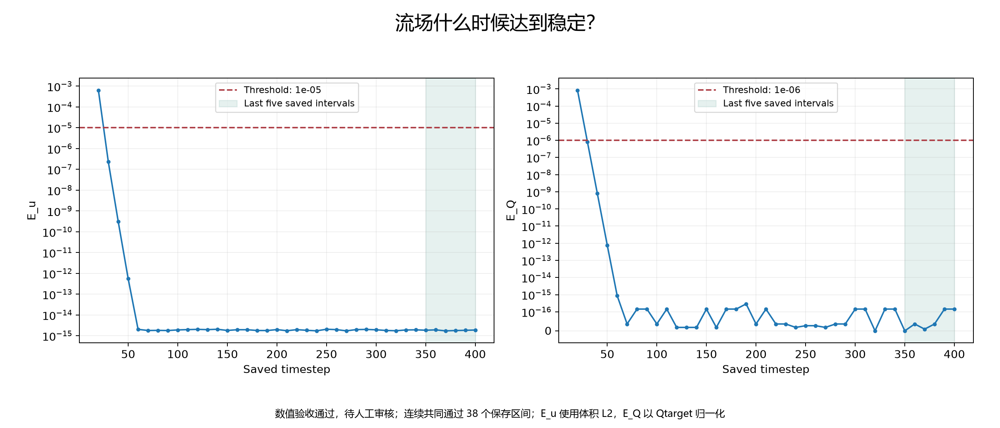

## 最终质量守恒如何？

下表来自 accepted 最后保存状态。

| 项目 | 实测值 |
|---|---:|
| Qtarget / m³·s⁻¹ | 2.73691323909e-15 |
| Qin / m³·s⁻¹ | 2.73691323909e-15 |
| OUTLET_01 / m³·s⁻¹ | 1.16534178798e-16 |
| OUTLET_02 / m³·s⁻¹ | 2.33199206703e-15 |
| OUTLET_03 / m³·s⁻¹ | 2.88386993266e-16 |
| Qout_total / m³·s⁻¹ | 2.73691323909e-15 |
| epsilon_Q | 1.29703566149e-15 |
| epsilon_mass | 0 |

两项相对误差均以 Qtarget 归一化，验收门限均为 1e-6。

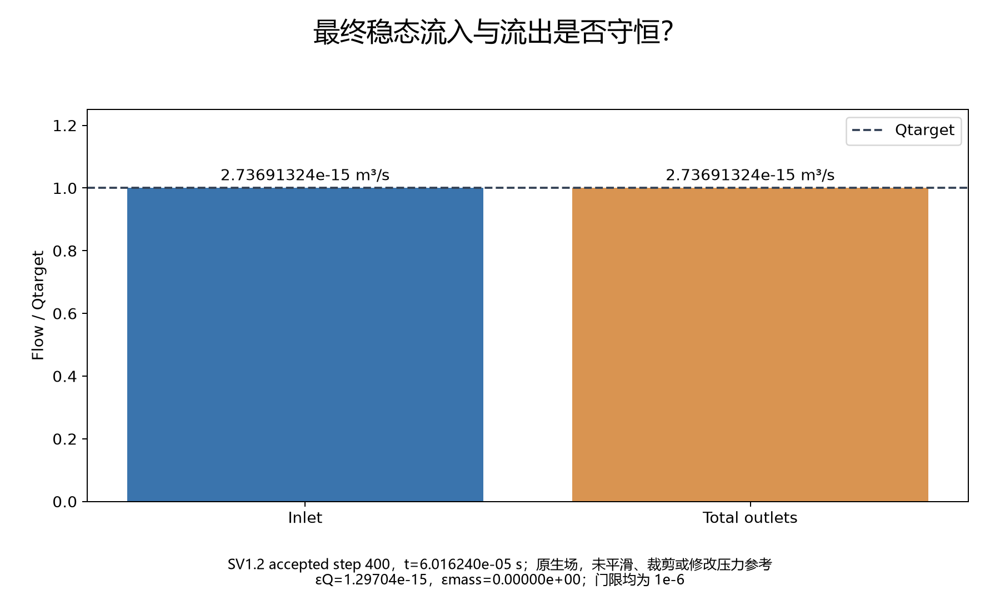

## 三个出口最终各流多少？

| 项目 | 实测值 |
|---|---:|
| OUTLET_01 | 4.2578689428% |
| OUTLET_02 | 85.2051878634% |
| OUTLET_03 | 10.5369431938% |

上述比例为实际 Qout_i / Qout_total，属于 accepted steady solution 的 final outlet flow split。

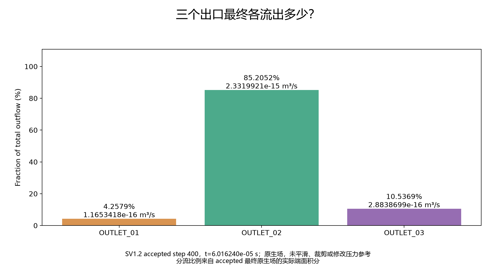

## 最终速度场

原生 [VTU](../../outputs/sv1_2/vascular_flow/4-procs/result_400.vtu)，SHA256 `24503c70ad7242f3b76b25c23e355e14d60766fefc8670a7223471d57339899f`；velocity finite=True，max |u|=0.00125221594768 m/s，volume L2=1.00934389016e-11。没有平滑、裁剪、过滤或覆写保存场；全局图显示全部原生节点，截面只用于显示原生 P1 场。

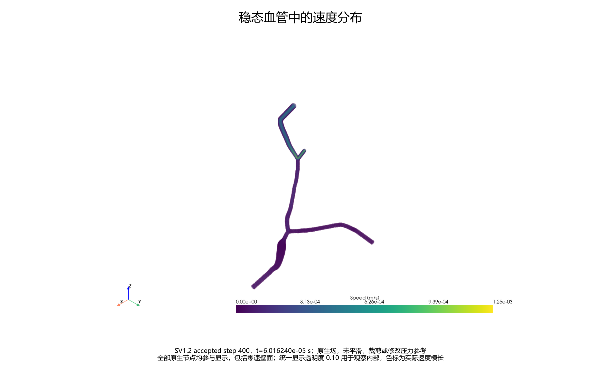

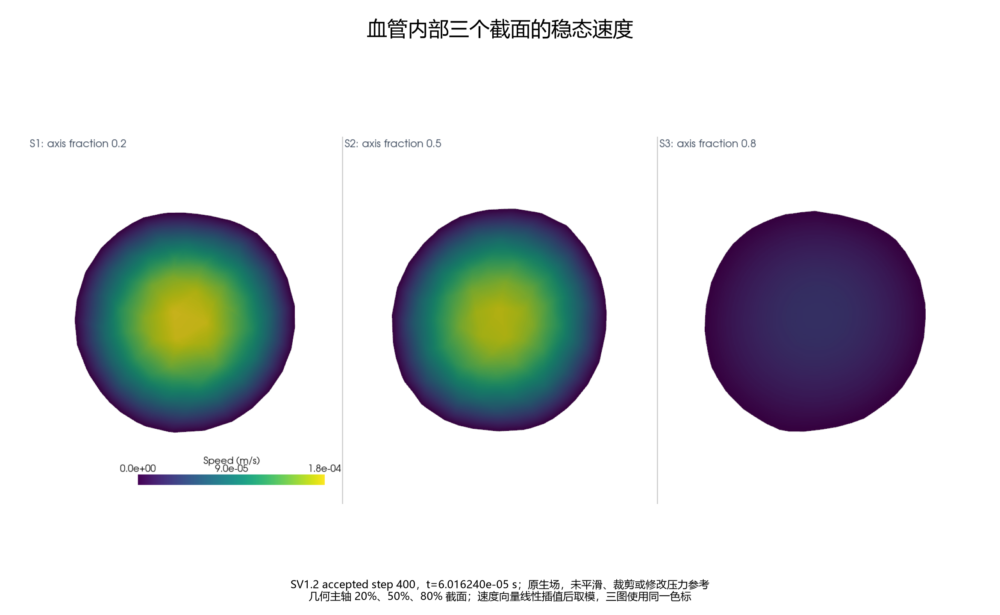

## 最终压力场

原生全局范围 [-0.223741429848, 434.334710732] Pa；pressure finite=True。保持 zero-Neumann outlet reference，未减出口压力、未 pin pressure。

| 项目 | 实测值 |
|---|---:|
| OUTLET_03 面积平均 / Pa | 0.341635613834 |
| OUTLET_01 面积平均 / Pa | 0.171830835029 |
| INLET 面积平均 / Pa | 429.199970649 |
| OUTLET_02 面积平均 / Pa | 3.79036591847 |

12 个几何主轴截面使用三角面面积加权 P1 压力。平面可能跨多个分支，不能解释为单根血管中心线压降。

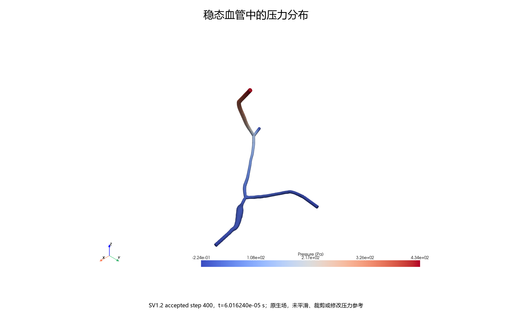

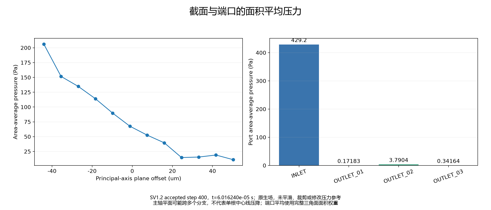

## 壁面条件

最终 accepted 场 WALL max |u|=0 m/s，P95=0 m/s；冻结门限 3.52840697125e-14 m/s，实际场检查=True。

## 结果重读

**PASS**。求解器退出后，独立新 Python 进程重读原生 VTU，重算速度 L2、压力范围、所有端口流量、质量误差、壁面速度和分流比例。比较采用 rtol=1e-12 与量纲对应绝对容差，未使用会淹没微小 SI 流量的默认绝对容差。

[独立重读证据](solution_reload.json)。

## 资源

| 项目 | 实测值 |
|---|---:|
| SV1.2 solver wall / s | 22959 |
| Python monotonic / s | 22959.9257938 |
| peak single-process RSS / KiB | 550916 |
| MPI ranks / OMP | 4 / 1 |
| 结果文件数 | 85 |
| 结果逻辑字节数 | 557119416 |

GNU time 的 RSS 是最大单进程常驻量，不是所有 MPI rank 内存之和。原生日志 elapsed 继承 checkpoint 计时，GNU/Python 新时钟分别保留；没有推算加速比或比较 FSILS 性能。PETSc 和非线性迭代分布见前述完整记录。

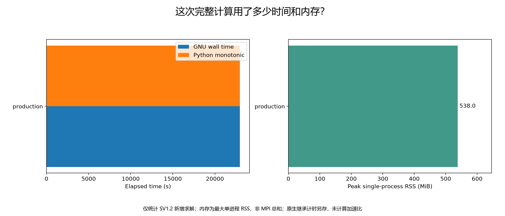

SV1.2 当前测试：36 passed，0 failed，0 skipped，0 errors。完整回归：92 passed，4 failed，4 skipped，0 errors。

历史阶段预期失败按原样单独列出，未删除、修改或 xfail：

- `tests/test_sv11_short_run_mass.py::test_actual_step_ten_mass_strictly_improves`
- `tests/test_sv1_mass_balance.py::test_actual_field_mass_conservation`
- `tests/test_sv1_solver_result.py::test_real_solver_converged`
- `tests/test_sv1_solver_result.py::test_required_steady_intervals_reached`

## 尚未完成什么？

- experimental pump Q
- mesh convergence
- WSS validation
- RBC/microbubble
