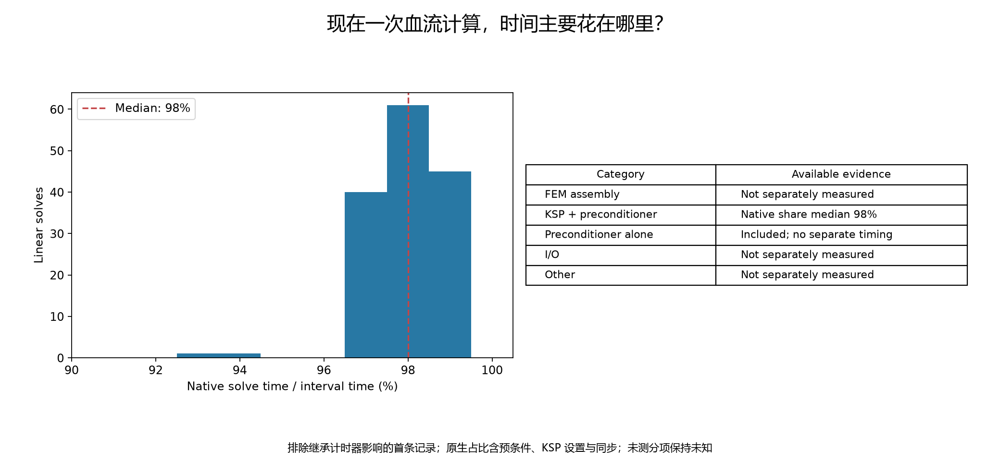
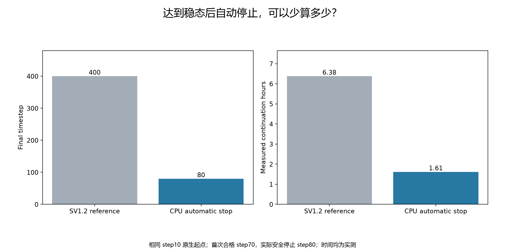
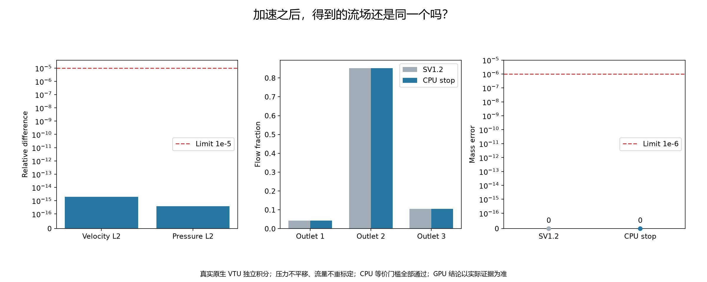
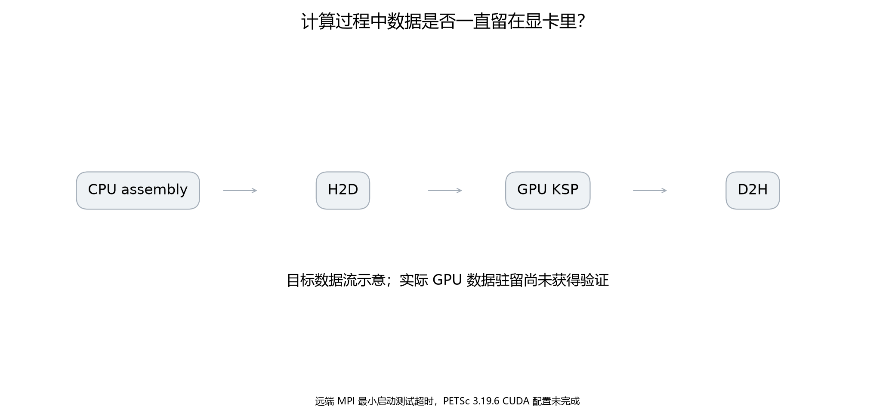
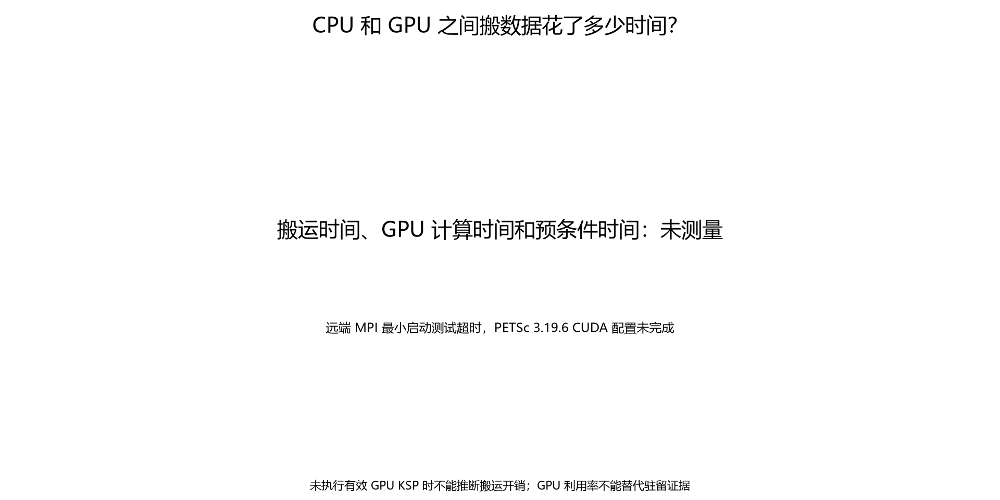
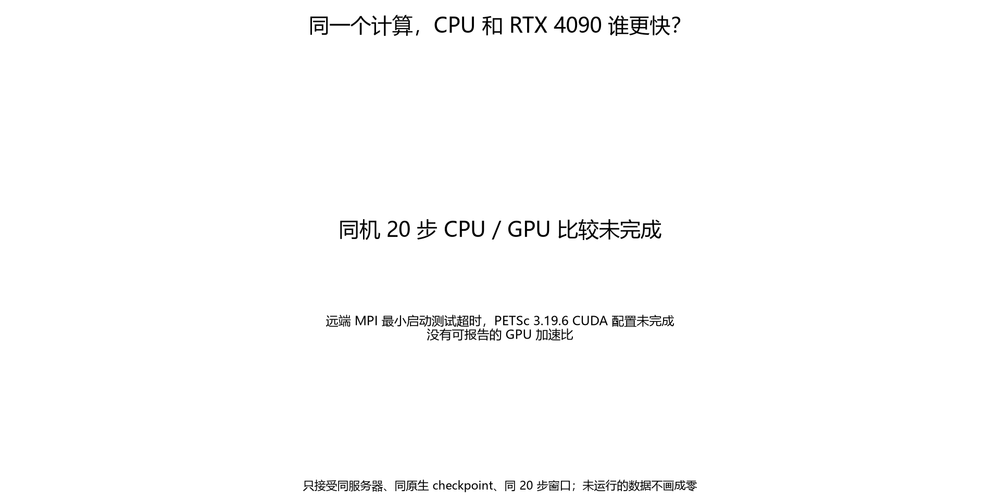
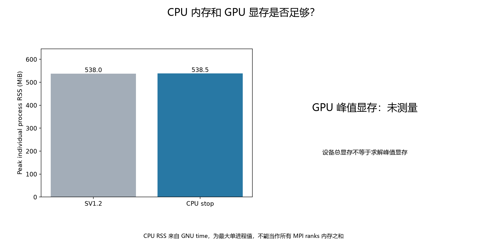
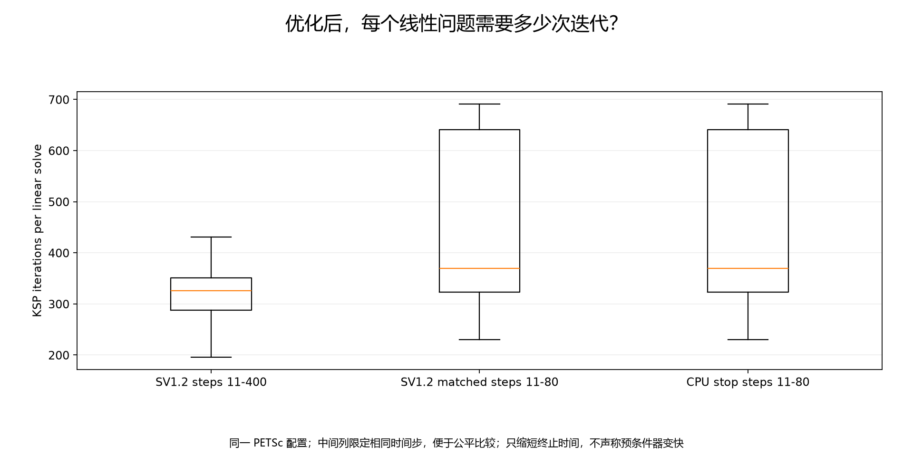
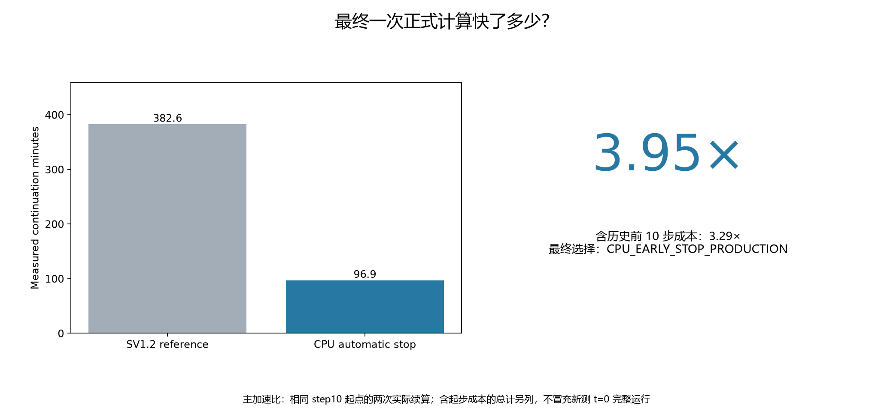
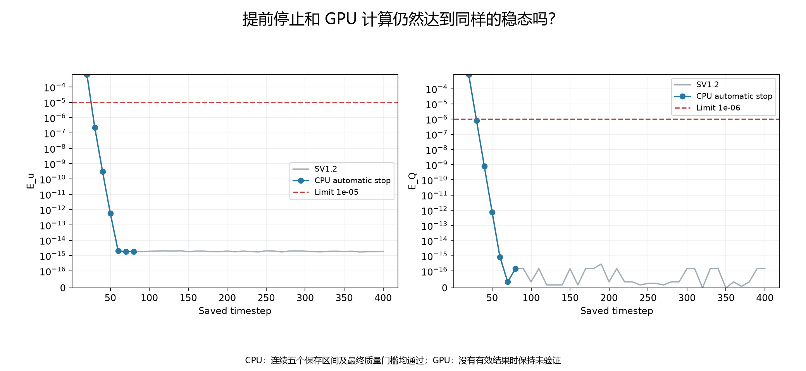

# Stage SV1.3 — SimVascular 血流计算性能优化与 GPU 加速验证

**CONDITIONAL PASS — CPU optimization only，等待人工审核。** 推荐 `CPU_EARLY_STOP_PRODUCTION`。同一起点的实测续算从 22959 s 降至 5813 s，**3.9496×**；计入共同继承的前 10 步成本后为 **3.2935×**。GPU 状态为 `GPU_BLOCKED: CUDA_PETSC_BUILD`，没有 GPU 性能或驻留的实测结论。

## 为什么现在开始优化？

用户在本阶段请求中确认 SV1.2 已通过数值验收和人工审核。本阶段保持该 step400 解作为 `VALIDATION_REFERENCE`，只改变终止策略并尝试独立 CUDA build。新的性能配置属于 `FAST_PRODUCTION_CONFIGURATION`。所有网格、物理、边界、时间积分、非线性方法和官方求解器科学源码均保持不变。本阶段没有执行 Mesh convergence、WSS、RBC 或 microbubble。

冻结证据：[reference_freeze.json](reference_freeze.json)、[policy.json](../../configs/sv1_3/policy.json)。重新读取确认：

| 项目 | 冻结值 |
|---|---|
| 实际网格 | 70363 points / 371402 tetrahedra |
| mesh-complete.mesh.vtu SHA256 | `1a7a69dcba52f0475b2280775921e4dedcdfefa67b7965096d86cb9dba38bdf9` |
| 输入 exterior_surface.npz SHA256 | `31746b2c2ef95a0b9044d96ef4b470a83592a91ae9132c5d6810736880734ac6` |
| 密度 / 动力黏度 | 1056 kg/m³ / 0.00345312 Pa·s |
| Qtarget | 2.7369132390905703e-15 m³/s |
| dt | 1.5040600916882215e-07 s |
| 时间积分 | native generalized alpha；spectral radius 0.5 |
| BC | 入口 steady flat Dirichlet、Impose_flux；三个出口零自然牵引；壁面零速度 |
| PETSc / MPI / OMP | 3.19.6 / 4 ranks / 1 thread |
| svMultiPhysics commit | `c3f0bb892b765b718f61069ecd9726dbc6d177fd` |
| accepted step / VTU SHA256 | 400 / `24503c70ad7242f3b76b25c23e355e14d60766fefc8670a7223471d57339899f` |
| reference velocity volume L2 | 1.0093438901648216e-11 |
| reference pressure range | [-0.2237414298476227, 434.33471073169545] Pa |

生产模型 XML 为 [SV1.2 原 XML](../../configs/sv1_2/sv_flow.xml) 的逐字节副本。完整 PETSc runtime options 为：

```text
-skip_petscrc -ksp_type gmres -ksp_pc_side right -ksp_norm_type unpreconditioned -ksp_rtol 1e-10 -ksp_atol 1e-24 -ksp_max_it 2000 -ksp_gmres_restart 100 -ksp_diagonal_scale -ksp_diagonal_scale_fix -pc_type asm -pc_asm_overlap 2 -sub_ksp_type preonly -sub_pc_type ilu -sub_pc_factor_levels 2 -ksp_monitor_true_residual -ksp_converged_reason -ksp_view -options_view -options_left
```

## 原来一次计算有多慢？

SV1.2 终点为 step400，同一合法 native step10 起点之后执行 390 个新时间步，GNU wall time 22959 s（6.378 h）。首次连续五个稳态区间截止在 step70。线性和非线性失败均为 0。

| KSP 指标 | SV1.2 新增 steps11–400 | SV1.2 含前10步完整历史 | CPU_EARLY_STOP 新增 steps11–80 |
|---|---:|---:|---:|
| solve count | 789 | 819 | 149 |
| total iterations | 266547 | 283447 | 66082 |
| mean | 337.828897 | 346.089133 | 443.503356 |
| median | 326.0 | 328.0 | 370.0 |
| P95 | 601.200000 | 640.100000 | 678.800000 |
| maximum | 691 | 716 | 691 |

数据来自原始 [SV1.2 resources](../sv1_2/solver_resource_usage.json)、[SV1.2 solver history](../sv1_2/solver_history.json) 和 [本次执行记录](cpu_execution.json)。原生日志的逐次线性求解占比中位数为 98%；该段计时包含 KSP 设置、预条件和同步。首条记录因继承计时器而排除于占比图，原始记录仍完整保留。Assembly、PC 单项、I/O 和 other 没有独立 profiler 数值，图中明确标为未拆分/未测，不能据此构造精确总时间饼图。



## 最简单的优化是什么？

通用 `SteadyStopMonitor` 逐个读取真实保存场，用同一网格的 P1 体积 L2 计算 E_u，以 Qtarget 归一化四个端口的最大流量变化 E_Q。要求 E_u≤1e-05、E_Q≤1e-06 连续 5 个保存区间；当前质量、入口误差均≤1e-06，场有限、壁面条件通过，且累计线性/非线性失败为零。

离线重放实际 40 个 SV1.2 VTU，首次 stop=true 在 step70，与原报告完全一致。新 CPU 计算没有固定 step70 终点。算法在 step70 合格后原子写入 `STOP_SIM`，请求下一个保存步 step80。固定源码先完成 restart，再完成 VTU，然后退出；最终 exit code 0。没有向原生流体进程发送 kill 或暂停信号。

原生机制证据见 [termination_source_audit.json](termination_source_audit.json)，请求见 [cpu_stop_request.json](cpu_stop_request.json)，完整原生终态检查见 [cpu_final_checkpoint.json](cpu_final_checkpoint.json)。最终又通过 6 个连续合格区间的检查；最后 E_u=1.81943e-15，E_Q=1.44115e-16。



## 自动停止有没有改变答案？

[独立等价性计算](cpu_reference_equivalence.json) 与 [fresh-process 重读](solution_reload.json) 均 PASS。门槛在运行前冻结：速度与压力相对体积 L2≤1e-5，Qin 相对差≤1e-6，各 Qout 相对差≤1e-5，分流绝对差≤1e-5，各端口平均压力采用共同 reference max(abs(p)) 尺度归一化后≤1e-5；另检查最大速度相对差≤1e-5。没有压力平移或流量重标定。

| 检查 | 实测误差 |
|---|---:|
| velocity relative volume L2 | 1.96657012813e-15 |
| pressure relative volume L2 | 3.74240481927e-16 |
| Qin relative difference | 0 |
| 最大各 Qout relative difference | 3.41928087795e-16 |
| 最大分流 absolute difference | 4.16333634234e-17 |
| 最大端口压力 scale-normalized difference | 5.23498743769e-16 |
| max velocity relative difference | 5.19496101847e-16 |

首次收尾比较曾因原生流量日志额外包含 WALL 列而报告后处理错误。已按既有 SV1.2 做法只选择四个开口端口；该修正与原错误保留于 [cpu_postprocess_attempt1.json](cpu_postprocess_attempt1.json)。求解器没有失败或重跑，原生 VTU、checkpoint、日志均未修改。



## RTX 4090 是否真正被 PETSc 使用？

**尚未获得有效 PETSc CUDA 运行。** 实际环境为 NVIDIA GeForce RTX 4090，物理显存 24564 MiB，driver 595.84，compute capability 8.9，toolkit/nvcc 13.2 / 13.2.86。空闲时 PCIe 观测为 gen1×8，报告上限 gen4×16；这不是带载吞吐测量。[gpu_environment.json](gpu_environment.json) 保存原始 nvidia-smi、nvcc、CPU/MPI 信息。

本机是 RTX 4060 Laptop 且没有 nvcc，因此 CUDA build 位于既有远端独立 `sv1_3` 目录。没有运行 Docker 命令或修改驱动。WSL 仍持有源码、配置和同步回来的构建证据。

PETSc 3.19.6 的真实 `configure --help` 已分别在新 WSL 副本和远端副本执行。首轮默认 CUDA 库搜索缺少 `nvToolsExt`；第二轮用该版本支持的显式库列表通过 CUDA 库/版本检查，随后 `mpiexec --oversubscribe -n 1` 测试超时，configure 返回失败。独立 `/bin/true` 启动在默认、关闭绑定和本地通信设置下也超时。见 [两轮构建汇总](cuda_petsc_build.json)、[首轮记录](cuda_petsc_build_attempt1.json)、[第二轮完整配置日志（凭据脱敏）](../../outputs/sv1_3/remote_build_attempt2/configure_detail.log)、[MPI 探测](remote_mpi_probe.json)。

因此 make、CUDA-enabled svMultiPhysics build、两种 CUDA smoke 均未执行；CUDA binary SHA、actual Mat type、actual Vec type、实际 GPU KSP/PC view 与 kernel 证据均为 NOT_OBSERVED。静态源码确实调用 MatSetFromOptions / VecSetFromOptions，但不能当作运行时 CUDA 验证。没有升级 PETSc，也没有证明 PETSc 源码与 CUDA 13.2 必然不兼容；实际阻塞点是远端 MPI 启动。

## 数据有没有频繁在 CPU/GPU 之间搬？

未知。本次没有有效 CUDA KSP，所以 matrix resident、vectors resident、传输次数随 nonlinear solves 或 KSP iterations 增长、H2D/D2H 时间等都保持 null/NOT_RUN。[gpu_residency_audit.json](gpu_residency_audit.json) 明确记录这一点，GPU 利用率和硬件可见性没有替代这些测量。





## GPU-A 做了什么？

完成了硬件与接口源码审核，以及独立 PETSc CUDA 配置尝试。原计划保持 GMRES、容差、ASM+ILU(2)，用 1 MPI rank / 1 GPU / OMP=1 验证 CUDA Mat/Vec。由于构建前置门槛失败，GPU_A vascular benchmark 没有启动。

## GPU-A 值得采用吗？

本阶段没有达到可评估性能的条件，不采用 GPU_A。以下同机固定 20-step、同一完整 native checkpoint 的比较全部 NOT_RUN，未用跨机器 CPU 耗时冒充 GPU 加速比，也没有用单次最优值代替重复试验。

| 同机固定窗口 | wall time | 等价性 |
|---|---|---|
| CPU_1R | NOT_RUN | NOT_RUN |
| CPU_4R | NOT_RUN | NOT_RUN |
| GPU_1R | NOT_RUN | NOT_RUN |

[benchmark 状态](../../benchmarks/sv1_3/status.json) 保留固定窗口与重复计时规则。源代码的 native checkpoint stamp 同时校验 MPI rank 数与本地节点数；没有把 4-rank checkpoint 静默当成 1-rank restart，也没有替换为丢失历史的 VTU 初态。



## 如果运行 GPU-B

GPU_B = **NOT_RUN**，尝试数 0。GPU_A 尚未证明科学正确，也没有 PC/传输主导性能的 profiling 证据，因此不满足 GPU_B 启动条件。没有运行 GPU_C/D/E、field-split、Schur solver、自定义 GPU block solver 或 GPU FEM assembly。

## 最终哪套配置最快而且可靠？

**CPU_EARLY_STOP_PRODUCTION** 是本阶段唯一完成全部数值、稳态、质量、等价性、完整 restart、独立重读与实测加速门槛的配置。GPU 状态是 blocked，并非测出更慢。

正式配置：[production_performance.yaml](../../configs/sv1_3/production_performance.yaml)。它保留原 CPU PETSc 选项、4 MPI ranks、OMP=1，GPU count=0，规定动态稳态停止及最终检查。已完成证据目录受防覆盖保护；后续独立运行应使用新的输出目录，不能覆盖本次或 SV1.2。SV1.2 step400 永久保留为验证参考。

本次最大单进程 RSS 551448 KiB（538.523 MiB），不是所有 MPI ranks 的内存总和。GPU 峰值显存未测，不能将设备总显存用作求解峰值。



## 实际节省多少时间？

| 计时口径 | SV1.2 reference | CPU_EARLY_STOP | speedup |
|---|---:|---:|---:|
| 同一 step10 native 起点，GNU 实测 wall | 22959.000 s | 5813.000 s | 3.949596× |
| 同一历史前10步成本 + 各次 Python monotonic | 24621.340413 s | 7475.804871 s | 3.293470× |
| best same-server CPU / GPU 20-step window | NOT_RUN | NOT_RUN | NOT_MEASURED |

节省实测续算时间 17146 s（4.763 h）。第二行的前10步成本 1661.414619 s 来自历史原生运行，不是本阶段新测 t=0 全程；两种计时口径没有混用。自动停止的收益来自少计算 320 个时间步，未更换预条件器。一次 CPU early-stop validation 按请求运行；它不是重复的同机 GPU benchmark。





## 科学结果有没有变化？

在预冻结等价门槛下没有可辨识改变。最终 Qin=2.7369132390905739e-15 m³/s，Qout total=2.7369132390905739e-15 m³/s；epsilon_Q=1.29703566149e-15，epsilon_mass=0。质量误差为 0 指双精度积分之差为零，并非离散误差证明。速度和压力有限，wall max=0 m/s，最大速度 0.0012522159476823847 m/s，pressure range=[-0.22374142984762185, 434.33471073169574] Pa。

| 端口 | SV1.2 Qout (m³/s) | CPU Qout (m³/s) | CPU fraction | fraction absolute difference |
|---|---:|---:|---:|---:|
| OUTLET_01 | 1.165341787982557e-16 | 1.165341787982557e-16 | 0.0425786894279 | 1.388e-17 |
| OUTLET_02 | 2.331992067025926e-15 | 2.331992067025926e-15 | 0.852051878634 | 0 |
| OUTLET_03 | 2.883869932663918e-16 | 2.883869932663917e-16 | 0.105369431938 | 4.163e-17 |

| 端口 | SV1.2 mean pressure (Pa) | CPU mean pressure (Pa) | reference-scale normalized error |
|---|---:|---:|---:|
| INLET | 429.1999706485308 | 429.199970648531 | 5.235e-16 |
| OUTLET_01 | 0.1718308350291519 | 0.1718308350291519 | 6.39e-20 |
| OUTLET_02 | 3.790365918465772 | 3.790365918465772 | 0 |
| OUTLET_03 | 0.3416356138340616 | 0.3416356138340615 | 2.556e-19 |

最终保存解：[result_080.vtu](../../outputs/sv1_3/cpu_early_stop/4-procs/result_080.vtu)，SHA256 `f9b1476313b0d9595c9819e55f80dd2808f5f3bedae37f4db53f05b2dec8ec89`。比较仅验证对同一 SV1.2 解的保持，不能替代网格独立性验证。



永久测试新增 22 个模块。SV1.3：**41 passed / 0 failed / 10 skipped / 0 errors**。10 个真实 GPU 验证因前置环境阻塞而显式跳过；CPU 类型假冒 GPU、逐 KSP 大量搬运、OOM、科学不等价、质量失败、speedup<1.25、参考被修改、四区间提前停止等负例测试仍实际执行。

完整回归：**133 passed / 4 failed / 14 skipped / 0 errors**。保留的历史失败集合与 SV1.2 完全相同：

- `tests.test_sv11_short_run_mass::test_actual_step_ten_mass_strictly_improves`
- `tests.test_sv1_mass_balance::test_actual_field_mass_conservation`
- `tests.test_sv1_solver_result::test_real_solver_converged`
- `tests.test_sv1_solver_result::test_required_steady_intervals_reached`

没有删除、改写或 xfail 历史失败。最终 [preservation_audit.json](preservation_audit.json)：514 个历史条目及旧 FEM 7440 个条目均未改变；旧 FEM git 状态保持原样。新测试汇总见 [test_results.json](test_results.json)，图像 SHA 见 [visuals.json](visuals.json)。

## 下一步

本阶段停在 **CONDITIONAL PASS**，等待用户审核上述 10 张图，尤其是 CPU 实测加速、场等价性和 GPU 尚未验证的边界。只有 performance stage 获得正式 PASS 后才进入 Mesh convergence。本次没有自动开始下一阶段。
