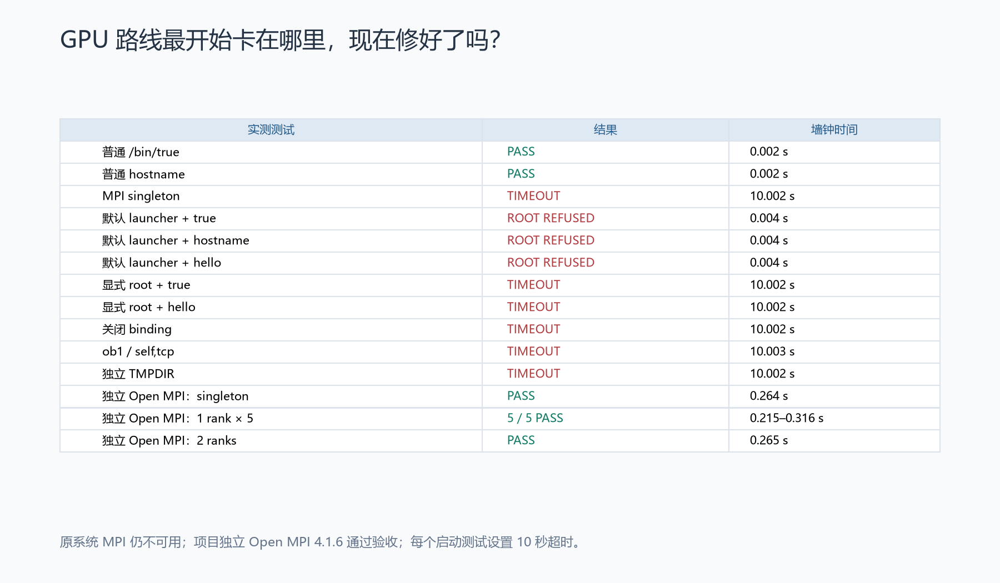
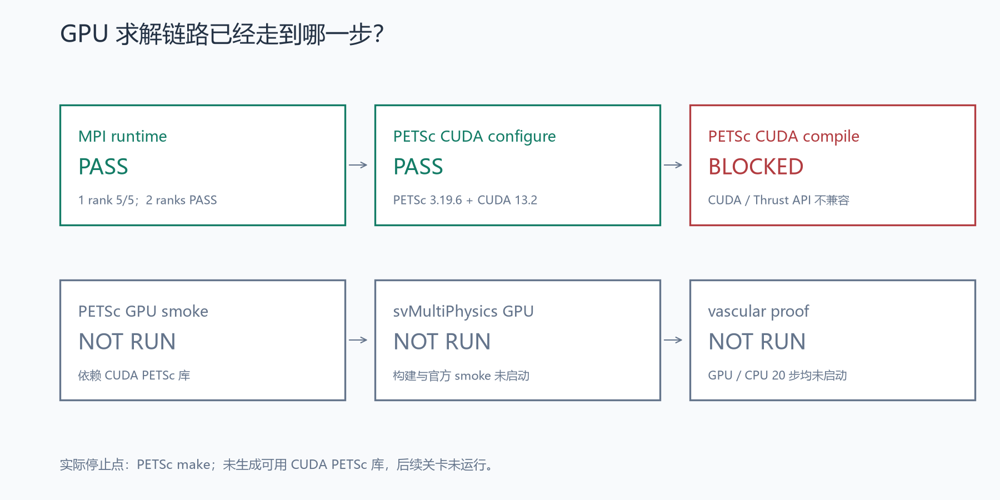
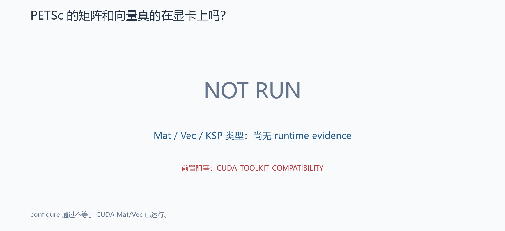
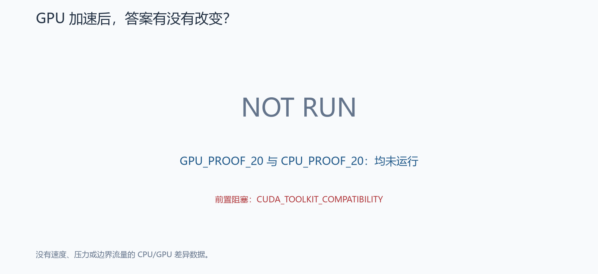
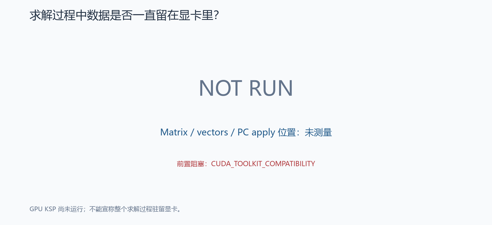
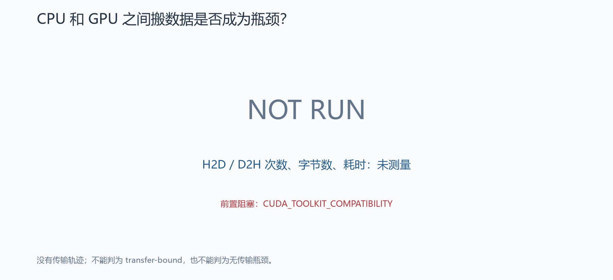
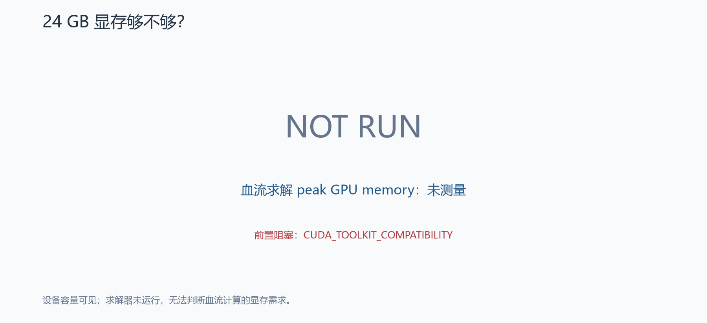
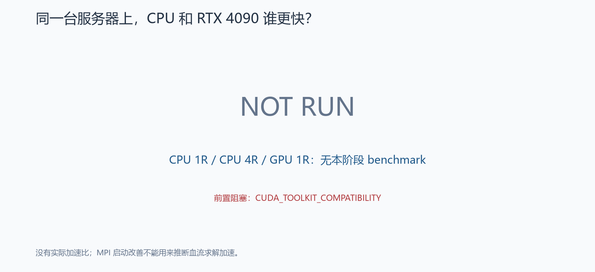

# Stage SV1.3G — RTX 4090 GPU 求解环境排查与 CUDA PETSc 验证

**状态：BLOCKED — CUDA_TOOLKIT_COMPATIBILITY。** MPI 运行环境已通过硬门槛，PETSc CUDA configure 已通过；原版 PETSc 3.19.6 在现有 CUDA 13.2 API 上编译失败。本阶段按请求第 31、63 节停止，GPU runtime、vascular proof、profiling 与 benchmark 均为 NOT RUN。

CPU production 继续采用原有 `CPU_EARLY_STOP_PRODUCTION`，配置与历史证据只读。以下结论均来自本阶段实测日志；GPU 的科学正确性和性能尚无结论。

## GPU 上一次为什么没跑起来？

SV1.3 的最早阻塞发生在 PETSc configure 的 MPI 测试：连 `mpiexec -n 1 /bin/true` 都无法正常完成。该阶段未到 vascular solve、CUDA KSP、CUDA Mat/Vec 或传输测试。历史事实来源：[SV1.3 build artifact](../sv1_3/cuda_petsc_build.json)；本阶段冻结记录：[reference_manifest.json](reference_manifest.json)。

| 冻结对象 | SHA256 |
|---|---|
| SV1.2 正式 reference VTU | `24503c70ad7242f3b76b25c23e355e14d60766fefc8670a7223471d57339899f` |
| SV1.3 CPU early-stop VTU | `f9b1476313b0d9595c9819e55f80dd2808f5f3bedae37f4db53f05b2dec8ec89` |
| 官方 svMultiPhysics commit | `c3f0bb892b765b718f61069ecd9726dbc6d177fd` |

完整 manifest 记录 mesh、geometry、physics、BC、dt、CPU PETSc 配置与生产配置 SHA。CPU PETSc 版本从历史 artifact 读取为 3.19.6。本阶段没有重网格或修改科学设置。

## MPI 到底出了什么问题？

远端为 Open MPI 4.1.6，UID = 0。系统 launcher、compiler wrapper、libmpi 和 ORTE 同属 `/usr`；未发现初始 MPI stack 混装。`mpiexec` 实际为 `orterun`，compiler wrapper 为 `opal_wrapper`。系统 PMIx 插件依赖 `libpmix.so.2`；该版本使用 ORTE，未使用 PRRTE。完整 hostname、uname、OS、身份、PATH、LD_LIBRARY_PATH、CUDA_VISIBLE_DEVICES、版本、wrapper show 与 ldd 保存在 [mpi_environment.json](mpi_environment.json)、[mpi_stack_consistency.json](mpi_stack_consistency.json) 和 [mpi_runtime_libraries.json](mpi_runtime_libraries.json)。

按要求执行五个正式分支：默认、显式 root override、关闭 binding、已确认存在的 ob1 + self,tcp、本阶段可写 TMPDIR。默认命令明确拒绝 root；加入官方 root override 后仍超时。后续三个分支也超时，singleton 同样超时。普通 `/bin/true` 和 hostname 通过。未进行 MCA 参数扫描。

一次最多 10 秒的 [launcher strace](../../logs/sv1_3g/mpi_launcher_strace.log) 捕获：加载系统 hwloc GL/OpenCL 插件后，逐个尝试 X11，最终连接 `::1:6006`，发送 X11 握手并阻塞于读取。目标 `/bin/true` 尚未启动。**观测支持硬件／图形设备探测期间的 X11 等待；没有函数调用栈，因此不把具体插件归因写成完全证明。** hwloc 官方文档也说明 GL 探测可能在连接 X server 时挂起：[Components and plugins](https://www.open-mpi.org/projects/hwloc/doc/v2.14.0/plugins.html)。

系统五个分支失败后，仅构建了一套项目独立 Open MPI 4.1.6。源码来自 [Open MPI 官方 4.1 下载页](https://www.open-mpi.org/software/ompi/v4.1/)，SHA 与官方一致：`44da277b8cdc234e71c62473305a09d63f4dcca292ca40335aab7c4bf0e6a566`。构建使用内置 hwloc、libevent、PMIx；该版本内置 hwloc 配置明确禁用 GL/OpenCL/CUDA/NVML 探测插件，无需修改 MPI 源码。源码证据：[mpi_hwloc_configure.m4](../../outputs/sv1_3g/mpi_hwloc_configure.m4)。MPI 的 `--without-cuda` 只禁用 MPI 的设备缓冲通信支持，本阶段目标仍是 CUDA PETSc、单 rank GPU 求解。

安装 prefix：`/workspace/formal_3D_flow_solver_FEM_SimVascular_lzy/sv1_3g/external/gpu_mpi`。编译器：`gcc (Ubuntu 13.3.0-6ubuntu2~24.04.1) 13.3.0`。完整 configure / make / install 命令和结果：[mpi_fallback_build.json](mpi_fallback_build.json)。系统 `/usr`、linker configuration、NVIDIA driver 均未修改。

诊断过程的 stdout pipe 曾被 singleton 派生 daemon 保持打开；已改为普通日志文件，确保超时后的采集不会继续等待 pipe。初次记录保留在 [diagnostic_pipe_attempt](../../outputs/sv1_3g/diagnostic_pipe_attempt/)，终止对象只涉及本阶段诊断程序，未运行任何 flow solver。补充 PMIx ldd 的首轮环境选择也已纠正并保留 probe1；正式 launcher、MPI 验收和 PETSc build 使用独立、已验证的 MPI stack。

## mpiexec 现在可靠吗？

项目独立 MPI **PASS**。原系统 MPI 并未被覆盖，后续必须使用统一 wrapper：[scripts/run_gpu_mpi.sh](../../scripts/run_gpu_mpi.sh)。这是远端 native wrapper，路径指向上述远端 prefix；只设置 PATH、LD_LIBRARY_PATH，并在实际 UID 为 0 时加入明确的 Open MPI root flag，不包含科学参数。

| 连续实测 | exit | 输出 | wall time |
|---|---:|---|---:|
| rank1 #1 | 0 | rank=0 size=1 | 0.314490 s |
| rank1 #2 | 0 | rank=0 size=1 | 0.215104 s |
| rank1 #3 | 0 | rank=0 size=1 | 0.266078 s |
| rank1 #4 | 0 | rank=0 size=1 | 0.215350 s |
| rank1 #5 | 0 | rank=0 size=1 | 0.315509 s |
| rank2 sanity | 0 | rank=0 size=2；rank=1 size=2 | 0.264842 s |

singleton 与 wrapper 附加 smoke 也通过。最终五次 rank1 使用完全相同的命令，无 timeout；rank2 仅用于基本 sanity，GPU 计划仍为单 rank。PETSc configure 前，普通 C 和 MPI executable 的编译、直接运行及 wrapper 运行全部通过：[preconfigure_smoke.json](preconfigure_smoke.json)。

证据：[mpi_hard_gate.json](mpi_hard_gate.json)、[mpi_resolution.json](mpi_resolution.json)。MPI 源码与安装归档已同步回 WSL：[native_artifact_mirror.json](native_artifact_mirror.json)，避免仅依赖远端非持久存储。

## PETSc CUDA 能编译了吗？

| 项目 | 实际结果 |
|---|---|
| GPU | NVIDIA GeForce RTX 4090，24564 MiB |
| driver / compute capability | 595.84 / 8.9 |
| nvcc | CUDA 13.2，13.2.86 |
| PETSc | 3.19.6，原版 source archive SHA `6045e379464e91bb2ef776f22a08a1bc1ff5796ffd6825f15270159cbb2464ae` |
| clean source | `/workspace/formal_3D_flow_solver_FEM_SimVascular_lzy/sv1_3g/external/petsc-3.19.6-cuda-clean` |
| PETSC_ARCH | `arch-sv13g-cuda` |
| CUDA configure | **PASS**，exit 0，18.047 s |
| make | **FAIL**，exit 2 |
| install / self-test | NOT RUN |
| CUDA PETSc library SHA | 无可用安装库，null |

configure 使用验证过的 mpicc/mpicxx 和唯一 MPI wrapper，optimized、real double、32-bit indices、architecture 89、C++17；复用系统 BLAS/LAPACK。沿用 SV1.3 已验证的显式 CUDA library list，避免重复引入缺失 nvToolsExt 的失败路线。未加入 hypre、MUMPS、Trilinos、Kokkos 等包。

实际命令与阶段结果：[cuda_configure.json](cuda_configure.json)、[cuda_build.json](cuda_build.json)。原始未分类执行结果仍保留在 [remote/cuda_build.json](remote/cuda_build.json)。日志：[configure stdout](../../logs/sv1_3g/remote/petsc_configure.log)、[configure detail](../../logs/sv1_3g/remote/petsc_configure_detail.log)、[make](../../logs/sv1_3g/remote/petsc_make.log)、[make detail](../../logs/sv1_3g/petsc_make_detail.log)。构建采用白名单环境，没有把远端凭据环境传给 PETSc configure。

## 如果仍失败，失败在哪一层？

唯一当前 blocker：**CUDA_TOOLKIT_COMPATIBILITY**；细分类 **CUDA_API_VERSION_FAIL**，发生在 PETSc `make` 的 C++/CUDA 编译阶段，MPI 与 configure 已通过。

实际 compiler errors：

- `cupmdevice.cxx:135`：`cudaDeviceProp` 没有 `clockRate`。
- `cupmdevice.cxx:136,138`：`cudaDeviceProp` 没有 `memoryClockRate`。
- `curand2.cu:23`：`thrust` 没有 `unary_function`；后续 initializer 错误由该定义失败引出。

这是运行 compiler 得到的 API 不匹配证据。NVIDIA 的 [CUDA 13 release notes](https://docs.nvidia.com/cuda/archive/13.0.3/pdf/CUDA_Toolkit_Release_Notes.pdf) 列出了相关设备属性字段移除；[CCCL 3 migration guide](https://nvidia.github.io/cccl/unstable/cccl/3.0_migration_guide.html) 列出了 `thrust::unary_function` 移除。没有据此推断 GPU KSP、数值结果或性能失败。

只读扫描 `/usr/local`、`/usr/lib`、`/opt`、`/workspace`、`/root/.local`、`/root/.conda` 中现有 nvcc，访问 38267 个目录且无权限错误；找到的编译器均为 CUDA 13.2，包括已有 NVHPC 工具链。未发现可用 CUDA 12.x：[cuda_toolkit_inventory.json](cuda_toolkit_inventory.json)。所以 CUDA 12.x fallback 尝试次数为 0，未下载或安装新 toolkit，未升级 PETSc，未修改求解器源码。

完整分类：[failure_classification.json](failure_classification.json)。

## PETSc 真的在 GPU 上吗？

**NOT RUN。** CUDA PETSc 库没有构建成功，三次 standalone GPU smoke 尚未执行；Mat、Vec、KSP、PC runtime type、残差、迭代数、KSPView 和 log_view 都没有可接受证据。设备可见、configure 成功不能替代 runtime CUDA types。已准备小型三对角 GMRES smoke 源码：[petsc_cuda_smoke.c](../../benchmarks/sv1_3g/petsc_cuda_smoke.c)，该源码没有被宣称为已运行通过。

## svMultiPhysics 真的用了 CUDA PETSc 吗？

**NOT RUN。** 固定 commit 的 CUDA svMultiPhysics build 和 official fluid/newtonian GPU smoke 未启动，没有新 GPU solver binary、CUDA PETSc linkage 或 runtime Mat/Vec 证据。官方 source worktree 与冻结时一致。阶段状态记录：[svmp_gpu_build.json](svmp_gpu_build.json)、[svmp_gpu_smoke.json](svmp_gpu_smoke.json)。

## 真实 vascular 20-step GPU proof 成功了吗？

**NOT RUN。** `GPU_PROOF_20` 与 `CPU_PROOF_20` 均未启动；steps、linear/nonlinear failures、finite fields、wall no-slip、Qin/Qout、mass error、reload 均未测量，保留 null。没有使用 4-rank checkpoint 启动 1-rank。未来 proof 的 t=0 起点、20 步窗口、科学比较阈值已在任何 proof 执行之前冻结：[policy.json](../../configs/sv1_3g/policy.json)。

## GPU 和 CPU 的答案一样吗？

**未验证。** 速度 relative L2、压力 relative L2、Qin、各 Qout、mass error difference 都没有测量值；没有将零或估计值填入结果。[gpu_cpu_equivalence.json](gpu_cpu_equivalence.json)。

## 数据有没有频繁在 CPU/GPU 搬？

**未测量。** matrix/vector residency、每次 MatMult 的 H2D、PC apply 的执行设备、H2D/D2H 次数与 KSP iteration 或 nonlinear solve 的比例、peak GPU memory 均未知。正式 ASM + ILU(2) 配置保持原样；不能将 MatMult 支持 GPU 等同于全部 KSP 驻留 GPU。没有 GPU_B、AMG 或 field-split 调优。

## GPU 实际快吗？

**无法回答。** 同机 CPU_1R、CPU_4R、GPU_1R 的 20-step benchmark 均未启动；重复次数为未运行，runtime 和 speedup 为 null。MPI 启动通过与编译耗时都不能用作血流 GPU 加速证据。分类保持 BLOCKED，不使用 GPU_A_PROMISING、GPU_SLOWER_THAN_CPU 或 GPU_TRANSFER_BOUND。

## 下一步

唯一技术建议：后续单独授权阶段，在服务器并存安装 CUDA 12.x toolkit，保持 NVIDIA driver、PETSc 3.19.6 与 svMultiPhysics commit 不变，再从 clean CUDA configure / build 开始验证。CUDA 12.x 尚未经本工程实际编译验证，不承诺它必然解决全部后续问题。本阶段已停止，不自动启动 GPU production 或 mesh convergence。

本阶段新增并永久保留 22 个 `test_sv13g_*.py` 文件：**30 passed / 0 failed / 12 skipped**。跳过项明确依赖未完成的 CUDA build / runtime；超时、stack mismatch、root override、CPU Mat/Vec、错误 PETSc linkage、跨 rank checkpoint、非有限场、数值偏差、每迭代大量传输、单次 benchmark 等负向门槛测试实际执行。测试通过只代表已到达的关卡和拒绝逻辑正确，不是整条 GPU 路线通过。

完整回归：**163 passed / 4 failed / 26 skipped**。以下 4 项历史验收失败按已有用户授权保留，未改旧测试、未 xfail、未改历史数据：

- `tests.test_sv11_short_run_mass::test_actual_step_ten_mass_strictly_improves`
- `tests.test_sv1_mass_balance::test_actual_field_mass_conservation`
- `tests.test_sv1_solver_result::test_real_solver_converged`
- `tests.test_sv1_solver_result::test_required_steady_intervals_reached`

JUnit：[本阶段](pytest_sv13g.xml)、[完整回归](pytest_all.xml)；摘要：[test_results.json](test_results.json)。

历史审计 **PASS**：677 项历史 evidence 和 7440 项旧 FEM 条目均无增删改，SHA、size、mtime、mode、symlink target 检查通过，旧 FEM git 状态与原先一致。官方求解器源码与生产配置未改：[preservation_audit.json](preservation_audit.json)。远端 native 构建和诊断已结束，没有 flow solver 留在后台：[remote_completion.json](remote_completion.json)。

供人工审核的 8 张图；前两张来自实际 MPI/build 结果，其余六张为明确 NOT RUN 状态页，无伪造柱状数据：

- [mpi_unblock.png](mpi_unblock.png) — GPU 路线最开始卡在哪里，现在修好了吗？（MEASURED）
- [gpu_build_pipeline.png](gpu_build_pipeline.png) — GPU 求解链路已经走到哪一步？（OBSERVED STATUS）
- [cuda_types.png](cuda_types.png) — PETSc 的矩阵和向量真的在显卡上吗？（NOT RUN）
- [gpu_residency.png](gpu_residency.png) — 求解过程中数据是否一直留在显卡里？（NOT RUN）
- [gpu_transfer_cost.png](gpu_transfer_cost.png) — CPU 和 GPU 之间搬数据是否成为瓶颈？（NOT RUN）
- [gpu_cpu_solution_difference.png](gpu_cpu_solution_difference.png) — GPU 加速后，答案有没有改变？（NOT RUN）
- [cpu_gpu_runtime.png](cpu_gpu_runtime.png) — 同一台服务器上，CPU 和 RTX 4090 谁更快？（NOT RUN）
- [gpu_memory.png](gpu_memory.png) — 24 GB 显存够不够？（NOT RUN）

**STAGE SV1.3G STATUS: BLOCKED — CUDA_TOOLKIT_COMPATIBILITY。**
