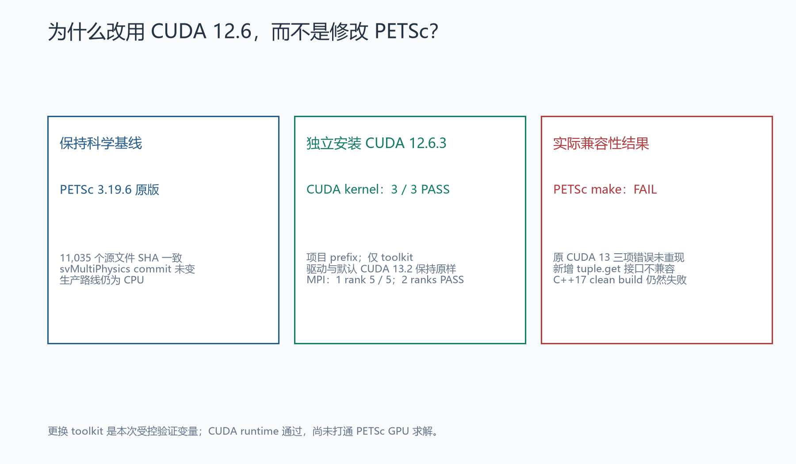
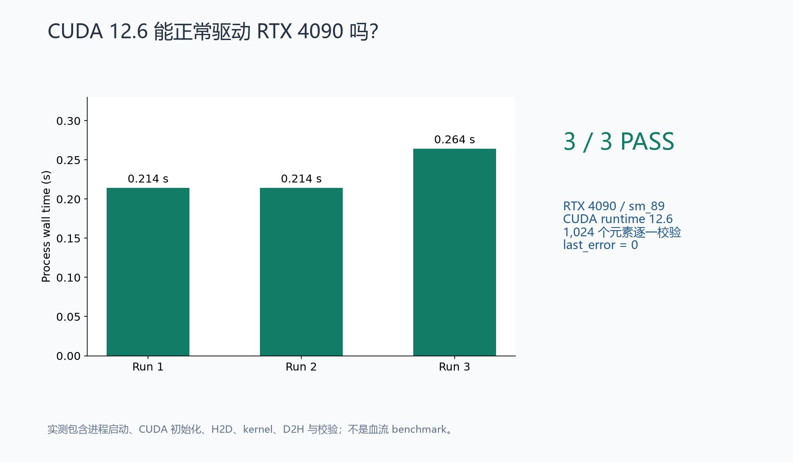
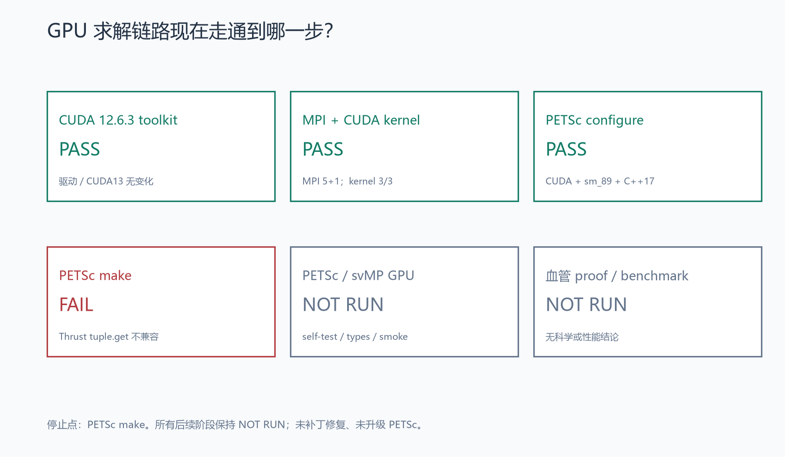
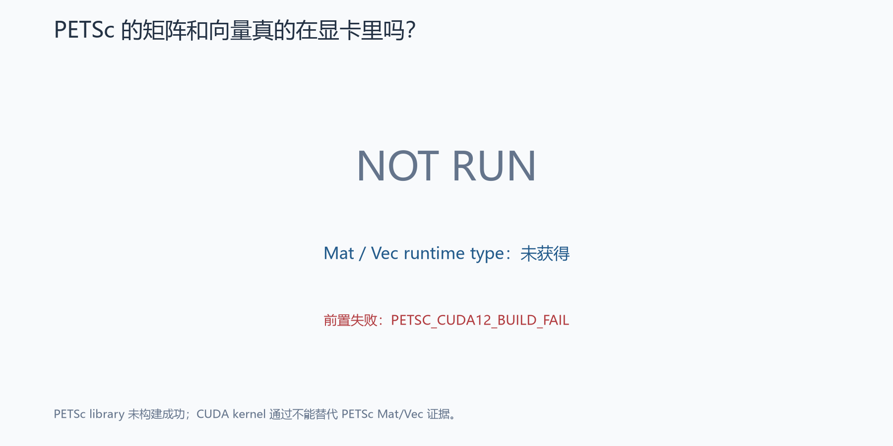
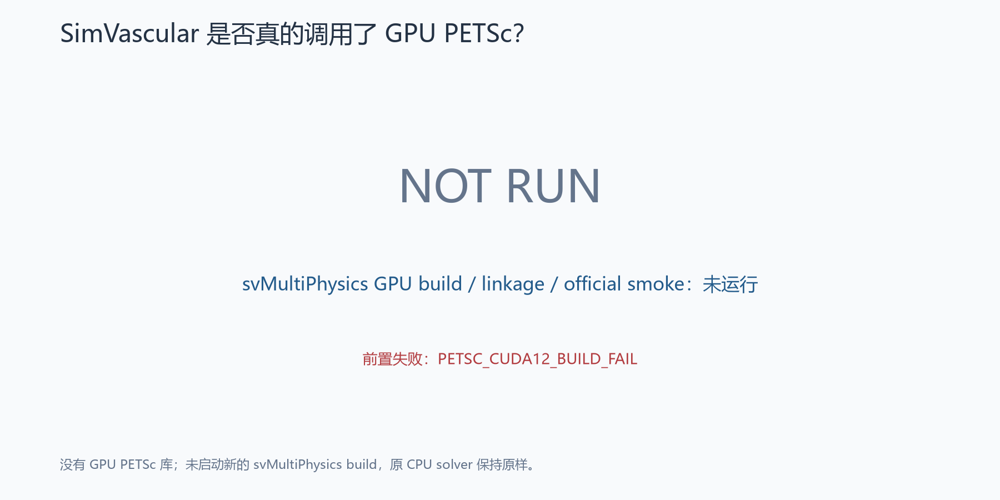
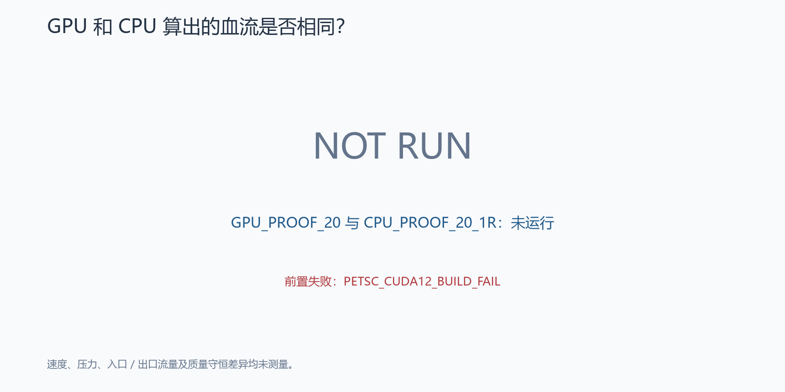
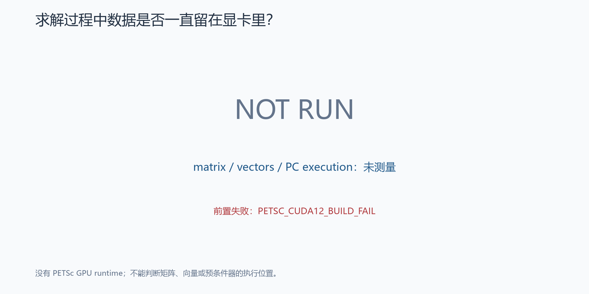
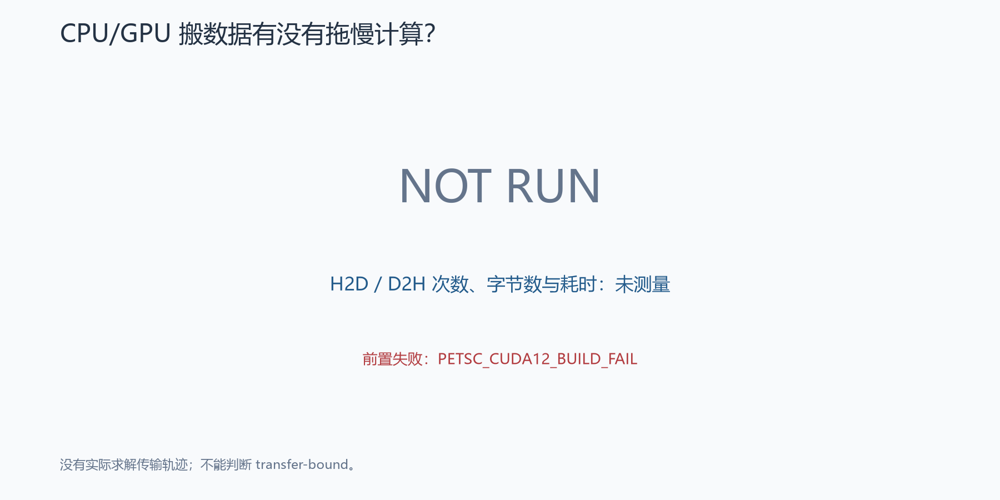
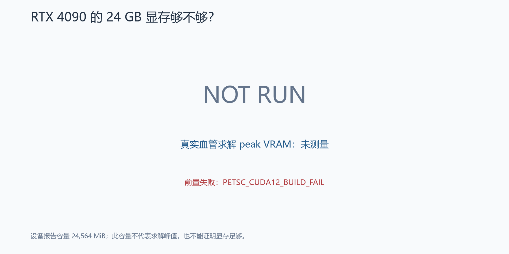
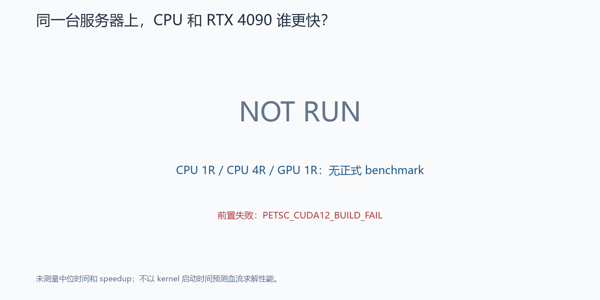

# Stage SV1.3H — 使用 CUDA 12.6 打通 RTX 4090 PETSc GPU 求解链路

**结果：FAIL — PETSC_CUDA12_BUILD_FAIL。** CUDA 12.6.3 独立安装、MPI 回归和三次真实 CUDA kernel 均通过；原版 PETSc 3.19.6 的 CUDA C++17 构建仍因 `thrust::tuple` 缺少成员 `get` 而失败。GPU 求解链路尚未打通。生产路线保留 `CPU_EARLY_STOP_PRODUCTION`。

本报告中的 PASS 仅适用于已经运行的关卡。所有未知科学指标、GPU 类型、显存峰值和性能结果保存为 `null`，对应阶段为 `NOT_RUN`。阶段验收失败与工程证据交付完成分别记录。

| 关卡 | 实测结果 |
|---|---|
| NVIDIA driver / CUDA 13.2 / 默认 symlink | 完整比对未变化 |
| CUDA 12.6.3 toolkit-only 安装 | PASS；项目独立 prefix |
| 原 SV1.3G MPI，在 CUDA12 环境下 | 单 rank 5/5 PASS；双 rank PASS |
| CUDA12 kernel | 3/3 PASS，逐元素计算校验 |
| 原版 PETSc CUDA12 configure | PASS，显式 host/CUDA C++17、sm_89 |
| PETSc make | FAIL，exit 2，Thrust tuple API 不兼容 |
| PETSc self-test / Mat / Vec / GPU smoke | NOT RUN |
| svMultiPhysics GPU / 真实血管 proof | NOT RUN |
| 科学等价 / profiling / 正式 benchmark | NOT RUN |

## 上一阶段真正卡在哪里？

SV1.3G 已修复 MPI：项目独立 Open MPI 4.1.6 可稳定启动，原系统 MPI 的问题与本次 PETSc 编译失败分属不同层。本阶段直接复用该安装和原 `run_gpu_mpi.sh`，没有重建 MPI。

上一阶段原版 PETSc 3.19.6 配合 CUDA 13.2 配置成功，编译因 `clockRate`、`memoryClockRate`、`thrust::unary_function` 三项旧接口不兼容失败。本次 CUDA12 的最终编译错误中，这三项均未重现；出现了另一项 tuple 成员访问不兼容。历史证据保持原样，参见 [SV1.3G 报告](../sv1_3g/REPORT.md)。

## 为什么不修改 PETSc？

本阶段固定 PETSc 3.19.6 和 svMultiPhysics commit `c3f0bb892b765b718f61069ecd9726dbc6d177fd`，以 toolkit 版本作为受控变量。原始 PETSc archive SHA256 为 `6045e379464e91bb2ef776f22a08a1bc1ff5796ffd6825f15270159cbb2464ae`；最终逐文件核验 **11,035 个原始文件，0 修改**，未 patch、未升级。科学网格、物理、BC、dt、CPU solver 和已接受结果不变。

[PETSc 3.19 版本说明](https://petsc.org/release/changes/319/) 提到支持 CUDA 12；该描述不能保证之后所有 CUDA 12.x 小版本都兼容。此次实际结果证实，固定原版 3.19.6 与本次 12.6.3 组合仍无法完成编译。



## CUDA 12.6 是如何安装的？

从 [NVIDIA 官方 archive](https://developer.nvidia.com/cuda-toolkit-archive) 核对 12.6 系列后，选择最后一个补丁版本 **12.6.3**。安装文件来自 [NVIDIA 官方下载](https://developer.download.nvidia.com/compute/cuda/12.6.3/local_installers/cuda_12.6.3_560.35.05_linux.run)，大小 **4,446,722,669 bytes**。

- 官方发布的 [MD5 清单](https://developer.download.nvidia.com/compute/cuda/12.6.3/docs/sidebar/md5sum.txt)：`29d297908c72b810c9ceaa5177142abd`，下载文件实算匹配。
- 下载完成、执行安装器之前冻结的 SHA256：`81d60e48044796d7883aa8a049afe6501b843f2c45639b3703b2378de30d55d3`。
- NVIDIA 此下载页使用 MD5 清单；上述 SHA256 为本次实算值，未声称它是 NVIDIA 发布的 SHA256。
- 下载耗时 95.923 s；官方 runfile 保留在远端，新证据与运行日志已镜像至 WSL。

远端主机 `f7c62a262077`：RTX 4090、compute capability 8.9、24,564 MiB，driver 595.84；Ubuntu 24.04.4，gcc/g++ 13.3.0。CUDA12 文档的 Ubuntu 24.04 测试表列至较早点版本，不能把当前点版本称为表内完全相同环境；本报告以真实编译和 kernel 结果说明已验证范围。[NVIDIA 安装指南](https://docs.nvidia.com/cuda/archive/12.6.3/cuda-installation-guide-linux/index.html)

新 toolkit prefix：

```text
/workspace/formal_3D_flow_solver_FEM_SimVascular_lzy/sv1_3h/external/cuda-12.6
```

使用官方 runfile 的 `--silent --toolkit --toolkitpath=... --defaultroot=... --no-man-page`；通过现有 uid 65534、清空附加组和 `no-new-privs` 限制安装进程，未执行 `--driver`。先提取 payload 进行检查，提取出的 bundled driver 文件未执行。首次安装因新项目 `external` 父目录权限失败（exit 1）；保存原日志后，只临时调整该新目录的权限并恢复，第二次安装 exit 0，耗时 **70.376 s**。原安装失败没有删除或覆盖。

非特权安装器无法写全局卸载 / desktop 元数据的提示保留在原始日志中；toolkit 二进制安装及 CUDA runtime 验收通过。未写永久 shell 配置，未运行全局 ldconfig，未安装 driver。

[安装记录](cuda12_install.json)、[首次尝试](cuda12_install_attempt1.json)、[原始安装日志](../../logs/sv1_3h/remote/cuda12_installer_detail.log) 和 [source manifest](cuda12_source_manifest.json) 保留完整命令、校验与时间。

[use_cuda12_gpu_env.sh](../../scripts/use_cuda12_gpu_env.sh) 只设置本次 `CUDA_HOME`、`PATH`、`LD_LIBRARY_PATH`；其绝对路径指向远端 native 安装，WSL 中的副本用于审计，不是 WSL CUDA 安装器。原 MPI wrapper 会重设 PATH，因此 MPI rank 程序前再次使用 CUDA12 wrapper，使 rank 内的 toolkit 选择仍为 CUDA12。

系统 `/usr/local/cuda -> /usr/local/cuda-13.2` 保持原样，绝对路径调用原 nvcc 仍报告 13.2.86；新 nvcc 报告 **12.6.85**。12.6.3 是 toolkit release，组件版本不同属于实际版本清单，不应误判为装错补丁。

安装前、安装后以及 PETSc 构建后均做了比对：CUDA13 树 **3,309 项**、driver 文件 **42 项**、默认 symlink、系统 linker 配置未变化；原 MPI artifact 与 wrapper SHA 也未变化。[最终环境审计](final_cuda13_preservation.json)、[完整环境快照](final_environment.json)、[源码 / MPI 审计](petsc_failure_audit.json)。

## CUDA 12.6 自己能运行吗？

**能，本阶段 CUDA runtime smoke 3/3 PASS。** 原 MPI 在 CUDA12 环境下先运行单 rank 五次、双 rank 一次，均 exit 0、无超时、rank 输出正确。单 rank 时间范围 0.165–0.265 s；双 rank 0.264 s。[MPI 原始验收](mpi_with_cuda12.json)

CUDA 程序以 `-std=c++17 -arch=sm_89 --cudart shared` 编译，执行 GPU 识别、分配、H2D、kernel、同步、D2H、逐元素校验和 free。测试计算 1,024 个整数的 `2*x+1`，三次都报告 runtime=12060、RTX 4090、arch=8.9、last_error=0。动态 libcudart 实际解析到新 prefix。

| Run | exit | 正确元素 | last_error | 进程墙钟 s |
|---|---:|---:|---:|---:|
| 1 | 0 | 1,024 / 1,024 | 0 | 0.214140 |
| 2 | 0 | 1,024 / 1,024 | 0 | 0.214201 |
| 3 | 0 | 1,024 / 1,024 | 0 | 0.264215 |

上述时间包含启动及初始化，不是 kernel-only 时间，也不是正式血流 benchmark。[完整 runtime 记录](cuda12_runtime.json) 和 [kernel 源码](../../benchmarks/sv1_3h/cuda_kernel_smoke.cu) 可复查，运行 binary 已镜像到 [outputs](../../outputs/sv1_3h/native/cuda_kernel_smoke)。



## PETSc CUDA build 成功了吗？

**没有。configure PASS；make FAIL，exit 2。** 新源树从固定官方 archive 解包；所有库显式来自新 CUDA12 prefix，cc/cxx/mpiexec 显式使用原项目 MPI。未增加 solver package。

首次配置指定 host C++17，但 PETSc 为 CUDA 自动选择了 C++20；首次 configure/make 和源文件审计完整保留。随后仅添加 PETSc 正式选项 `--with-cuda-dialect=C++17`，在全新 `PETSC_ARCH=arch-sv13h-cuda12-cxx17` 中再次配置构建。最终生成的 CXX_FLAGS 和 CUDAC_FLAGS 都是 C++17；无源码修改、无工具版本变化。

最终配置：optimized、real double、32-bit indices、MPI、CUDA、sm_89、host/CUDA C++17。CUDA libraries 包含 cudart、cufft、cublas、cusparse、cusolver、curand 及 CUDA12 自带的 nvToolsExt。完整 [configure 命令及 build provenance](petsc_cuda12_build.json)、[编译器命令](compiler_commands.json)、[生成参数](remote/build_failure_evidence/petscvariables)、[完整 configure log](remote/build_failure_evidence/configure.log) 已保存。

最终 configure 耗时 **17.996 s**，make 耗时 **15.489 s**。make 的 48 条 error diagnostics 来自两个 CUDA vector 编译单元，主错误为 `thrust::tuple` 缺少成员 `get`，其余包括相关表达式解析错误。源码位置位于 `vecseqcupm.hpp` 的 1324、1379、1394、1397、1399 行。

本机 headers 的 Thrust 版本为 2.5.0；PETSc 官方 [MR !7354](https://gitlab.com/petsc/petsc/-/merge_requests/7354) 已记录 CUDA 12.4 下相同的成员访问错误，其方案需要修改 PETSc 调用方式。[NVIDIA CCCL 2.3 说明](https://github.com/NVIDIA/cccl/releases/tag/v2.3.0) 也记录了 tuple 实现更换。官方说明与本次编译日志一致，支持“源接口不兼容”的归因；本次没有应用该修复。

旧 `clockRate` / `memoryClockRate` / `unary_function` 三项错误在最终 error diagnostics 中均未出现，所以**不是** `UNEXPECTED_CUDA12_API_FAILURE` 的“相同 API 错误复现”。细分原因是 `CUDA12_THRUST_TUPLE_API_INCOMPATIBILITY`；按用户第 65 条，阶段仍分类为 **FAIL: PETSC_CUDA12_BUILD_FAIL**。

没有生成可用 `libpetsc.so`，其 SHA 为 null；install、CPU/MPI/CUDA self-test 均 NOT RUN。[完整 make log](../../logs/sv1_3h/remote/petsc_cuda12_cxx17_make.log)、[失败诊断](failure_classification.json)、[第一次构建记录](petsc_cuda12_build_attempt1.json) 保留原始证据。



## PETSc 真的使用 RTX 4090 吗？

**尚无证据；NOT RUN。** 三次 PETSc sparse solver smoke 均未启动，Mat/Vec/KSP/PC runtime type 未获得。独立 CUDA kernel 证明 toolkit 能执行 kernel，不能代替 PETSc 矩阵 / 向量验收。已准备的 standalone PETSc 脚本因 build hard gate 不满足而未执行。



## SimVascular 真的用了 GPU PETSc 吗？

**NOT RUN。** 同 commit GPU svMultiPhysics build、ldd/运行库验证、官方 fluid smoke、runtime Mat/Vec 均未启动。未产生新的 GPU solver binary，没有把原 CPU PETSc 的链接当成 GPU backend 成功。原 CPU production binary 和配置保持不变。



## 真实血管 20 步能跑吗？

**本阶段未验证。** `GPU_PROOF_20` 与匹配的 `CPU_PROOF_20_1R` 均 NOT RUN：实际 steps、线性 / 非线性失败数、速度 / 压力有限性、流量、mass error 和 reload 状态都是 null。没有从 4-rank native checkpoint 启动 1-rank proof，也没有拿 SV1.2 的 steady field 冒充匹配的 t=0 20-step 对照。

冻结的未来 proof 条件为 t=0、20 步、GPU 1 rank / 1 GPU / OMP1；物理及生产 GMRES / ASM / ILU(2) 参数未改。

## GPU 和 CPU 的答案一样吗？

**未知；没有成对 proof field。** 未测量 volume-weighted velocity / pressure relative L2、Qin、各 Qout、mass error difference 和 max velocity difference。冻结阈值依次为 1e-5、1e-5、1e-6、各 1e-5、1e-6、1e-5；没有压力平移或其他后处理来放宽比较。[冻结 policy](../../configs/sv1_3h/policy.json)



## 数据会不会反复 CPU/GPU 搬？

**未知；profiling NOT RUN。** matrix/vector residence、PC execution location、逐 KSP iteration 的 H2D/D2H 次数 / 字节 / 时间均未测量，不能判为驻留通过或 transfer-bound。CUDA smoke 自身的 H2D/D2H 不能代替血流 solver 的轨迹。





设备的 24,564 MiB 只是容量，真实血管求解 peak VRAM 未测量，不能宣称显存足够。



## RTX 4090 快多少？

**没有可报告的加速比。** 本阶段未启动 CPU1 / CPU4 / GPU1 固定 20-step benchmark；三组中位数和 speedup 全部 null。未预测 GPU 时间，未将初始化 smoke 或 profiling 当成正式性能样本。已实现并回归测试：至少两次；相差大于 10% 要求第三次；正式值取全部 2 或 3 次的中位数。



## 当前是否值得继续 GPU production？

当前性能决策分类 **BLOCKED**；阶段验收状态 **FAIL**。没有达到 `GPU_A_PROMISING`，不启动 GPU production，不运行完整 steady solve。保留 `CPU_EARLY_STOP_PRODUCTION`。

新增 **21 个永久测试文件**；新增阶段测试 **54 passed / 1 failed / 12 skipped**。唯一真实失败是 `test_actual_petsc_cuda12_build_acceptance`，保留 make hard gate 失败；12 项 skip 只用于未运行的下游 runtime 验收，未把已发生的编译失败转为 skip 或 xfail。

完整 pytest：**217 passed / 5 failed / 38 skipped**。额外四项是保留的历史失败：

- `tests.test_sv11_short_run_mass::test_actual_step_ten_mass_strictly_improves`
- `tests.test_sv1_mass_balance::test_actual_field_mass_conservation`
- `tests.test_sv1_solver_result::test_real_solver_converged`
- `tests.test_sv1_solver_result::test_required_steady_intervals_reached`

所有要求的负例已测试：未启用 / 错指 CUDA wrapper、driver 改变、MPI 被库路径破坏、编译无 CUDA、CPU Mat/Vec、错误 PETSc 链接、exit0 但 KSP diverged、NaN field、不等价 field、单样本和 profiling 冒充 benchmark，均被拒绝。[阶段 pytest](../../logs/sv1_3h/pytest_stage.log)、[完整 pytest](../../logs/sv1_3h/pytest_full.log)、[计数与失败节点](test_summary.json)

测试后的最终历史审计 PASS：**1,017 项历史工程条目、7,440 项旧 FEM 条目**不变；45 项冻结 reference SHA 不变；svMultiPhysics commit、worktree 与 source diff 不变。旧 FEM 未写入。文件 access time 不作为写入变化，其余固定 hash / size / mtime / mode 与 symlink 按基线比较。[保全审计](preservation_audit.json)

全部 10 张审核图片如下；前三张为真实结果 / 状态，后七张明确 NOT RUN，无虚构数值柱图。图像 SHA 与标题见 [visuals.json](visuals.json)，图片可直接打开审核。

| 文件 | 证据状态 | 标题 |
|---|---|---|
| [cuda_version_strategy.png](cuda_version_strategy.png) | OBSERVED STATUS | 为什么改用 CUDA 12.6，而不是修改 PETSc？ |
| [gpu_build_pipeline.png](gpu_build_pipeline.png) | OBSERVED STATUS | GPU 求解链路现在走通到哪一步？ |
| [cuda_runtime_smoke.png](cuda_runtime_smoke.png) | MEASURED | CUDA 12.6 能正常驱动 RTX 4090 吗？ |
| [petsc_gpu_backend.png](petsc_gpu_backend.png) | NOT RUN | PETSc 的矩阵和向量真的在显卡里吗？ |
| [svmultiphysics_gpu_smoke.png](svmultiphysics_gpu_smoke.png) | NOT RUN | SimVascular 是否真的调用了 GPU PETSc？ |
| [gpu_cpu_solution_difference.png](gpu_cpu_solution_difference.png) | NOT RUN | GPU 和 CPU 算出的血流是否相同？ |
| [gpu_residency.png](gpu_residency.png) | NOT RUN | 求解过程中数据是否一直留在显卡里？ |
| [gpu_transfer_cost.png](gpu_transfer_cost.png) | NOT RUN | CPU/GPU 搬数据有没有拖慢计算？ |
| [gpu_memory.png](gpu_memory.png) | NOT RUN | RTX 4090 的 24 GB 显存够不够？ |
| [cpu_gpu_runtime.png](cpu_gpu_runtime.png) | NOT RUN | 同一台服务器上，CPU 和 RTX 4090 谁更快？ |

## 下一步

本阶段停止。**不建议进入 Stage SV1.3I GPU full steady-flow validation**，继续保留已验收的 CPU production。

若将来继续 GPU 路线，应先另立 toolkit / PETSc 兼容性验证阶段，明确允许的版本或源码策略。当前仅确认这组固定版本不能完成构建，未测试其他组合，也不把上游补丁记录当成本机修复成功。用户要求的固定原版边界在本阶段保持有效。

[最终终端摘要](terminal_summary.txt) · [阶段结果](stage_result.json) · [交付哈希清单](delivery_manifest.json)
