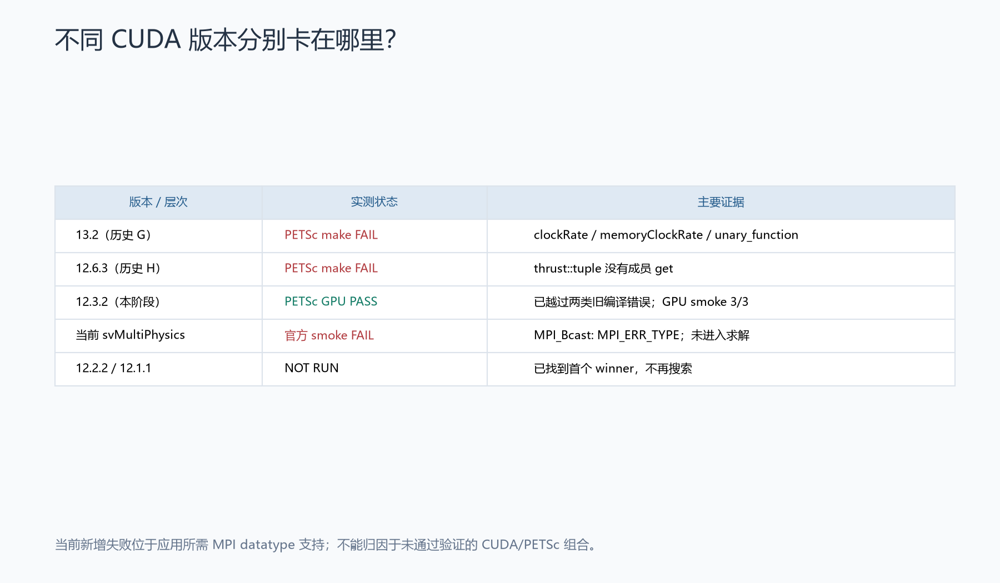
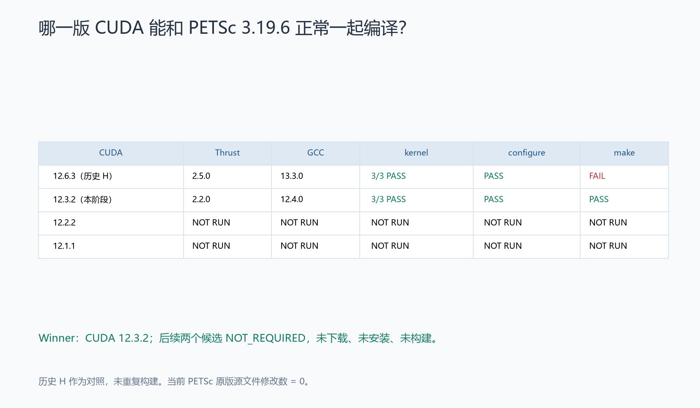
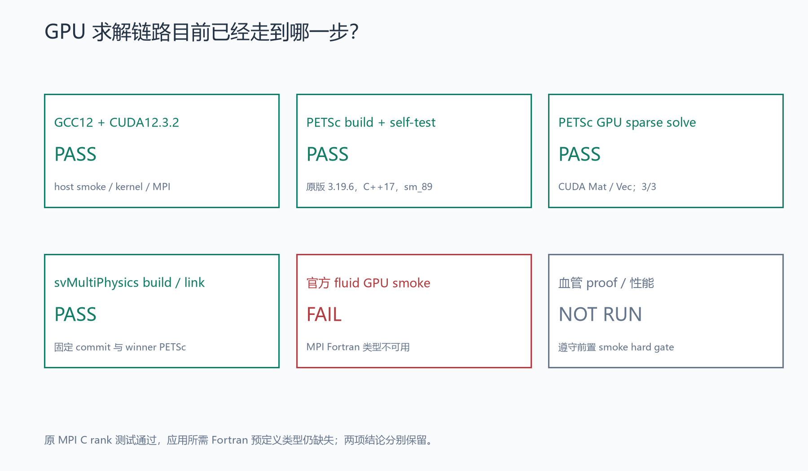
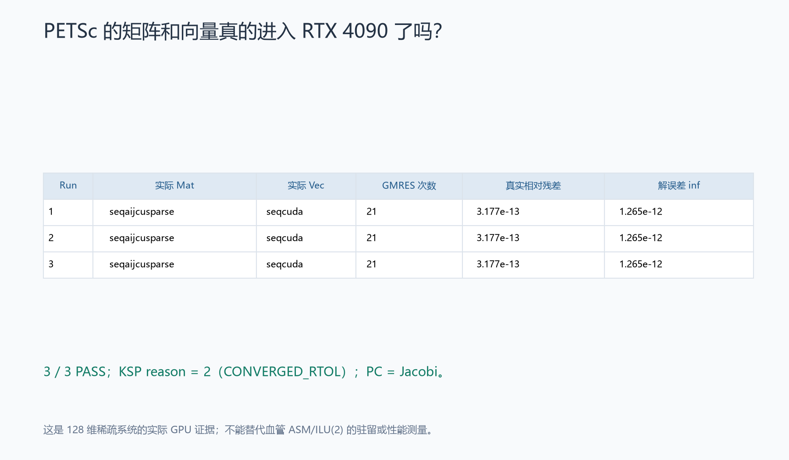
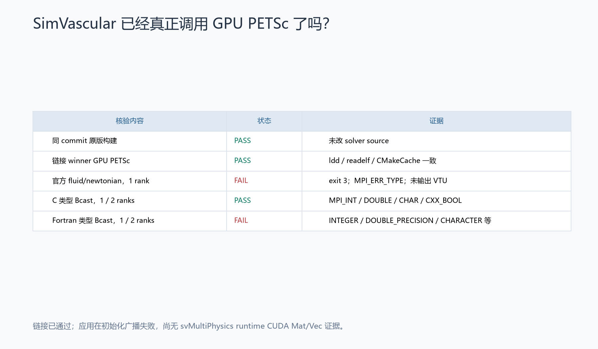
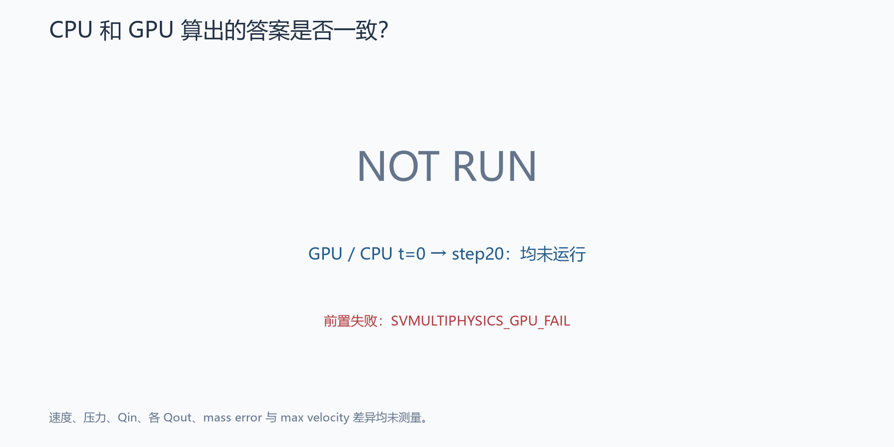
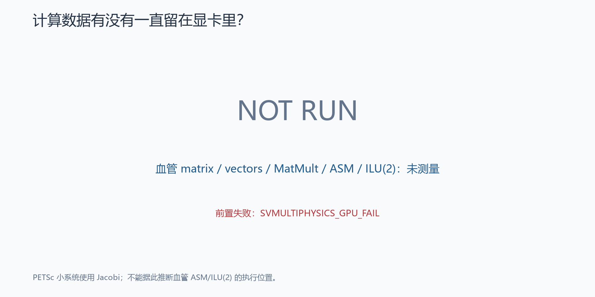
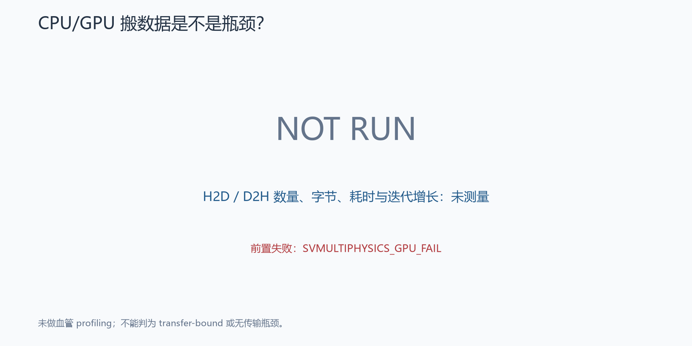
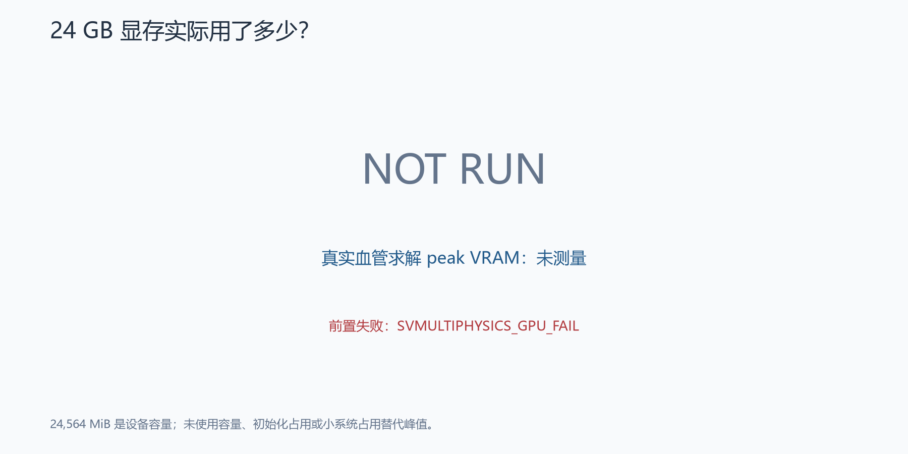
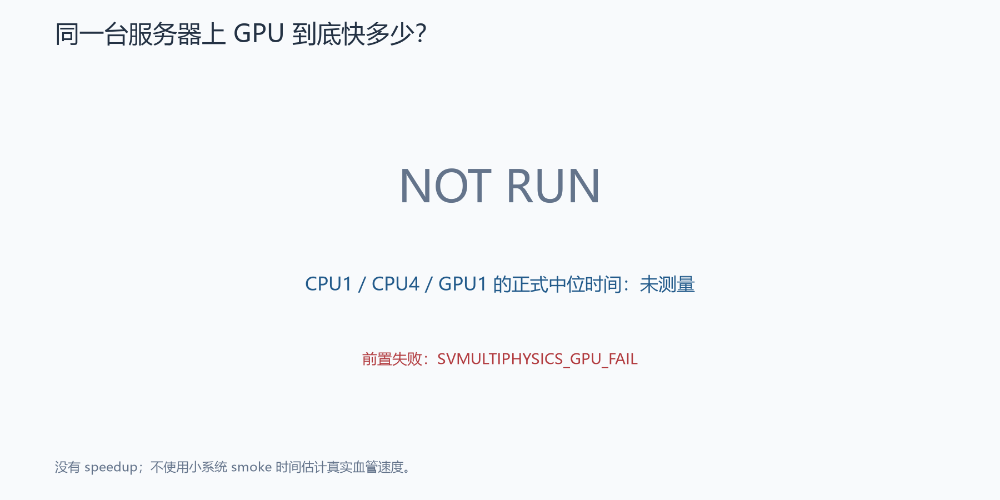

# Stage SV1.3J — PETSc 3.19.6 与 CUDA 12.x 兼容性验证

**阶段结果：FAIL — SVMULTIPHYSICS_GPU_FAIL。兼容组合已找到，PETSc GPU runtime 已通过；svMultiPhysics 官方流体案例在 MPI 初始化广播处失败。**

细分类为 `MPI_FORTRAN_PREDEFINED_DATATYPES_UNAVAILABLE`。正式 production 保持 `CPU_EARLY_STOP_PRODUCTION`。真实血管 proof、科学等价、驻留分析与性能计时均未运行。证据见 [阶段结果](stage_result.json)、[测试汇总](test_summary.json)、[终端摘要](terminal_summary.txt)及 [交付 SHA256 清单](delivery_manifest.json)。

## 为什么继续尝试更早的 CUDA？

历史 SV1.3G 的 CUDA 13 构建遇到 `clockRate`、`memoryClockRate`、`unary_function` 等旧接口问题。SV1.3H 换用 CUDA 12.6.3 后，这些主错误消失，但原版 PETSc 3.19.6 在 Thrust tuple 的 `.get` 接口处编译失败。该结果来自冻结的 [SV1.3H 报告](../sv1_3h/REPORT.md)，本阶段未重跑历史构建。

PETSc upstream 记录了 CUDA 12.4 开始的 tuple 兼容问题；CCCL 2.3 的发布说明也记录了 tuple 实现变化。因此先试变化之前的 CUDA 12.3.2，保留 12.2.2、12.1.1 为按顺序启用的后备候选。[PETSc MR !7354](https://gitlab.com/petsc/petsc/-/merge_requests/7354)、[NVIDIA CCCL 2.3 发布说明](https://github.com/NVIDIA/cccl/releases/tag/v2.3.0)。

## 为什么还要换 GCC？

服务器默认 GCC/G++ 为 13.3.0。CUDA 12.3 的 host compiler 表列出 GCC 6.x–12.2，因而本阶段使用 Ubuntu 官方的并行安装包 `gcc-12`、`g++-12`，实际版本为 **12.4.0-2ubuntu1~24.04.1**。NVIDIA 同页明确说明 NVCC 按编译器主版本检查，并支持所列主版本的更新次版本；因此这里记录的实际版本是 GCC 12.4.0，未将其写成 GCC 12.2，也未使用 `--allow-unsupported-compiler`。[NVIDIA CUDA 12.3.2 安装指南与 host compiler policy](https://docs.nvidia.com/cuda/archive/12.3.2/cuda-installation-guide-linux/index.html)。

实际服务器为 Ubuntu 24.04.4，该发行版未列入这份旧 CUDA 文档的 qualified OS 表。本报告证明这一环境上的编译和 runtime 结果，并区分编译器主版本政策与整套操作系统的官方认证范围。

安装前模拟检查只新增 GCC12/G++12 及必要依赖，未升级或删除既有软件包；默认 GCC/G++ 的实际文件、SHA256 和 symlink 均保持不变。C 和 C++17 小程序分别编译运行通过，结果均为 42。`libstdc++` 实际路径与哈希、安装命令、版本和 smoke 日志见 [gcc12_environment.json](gcc12_environment.json)。

候选 wrapper 只作用于子进程，设置 CUDA 路径与 GCC12/G++12；原 MPI 编译 wrapper 通过本次命令环境中的 `OMPI_CC`、`OMPI_CXX` 选择 GCC12，`--showme:command` 已核验。未修改 shell 启动文件或系统编译器链接。

## 实际测试了哪些组合？

全部新测试使用 RTX 4090、原版 PETSc 3.19.6、C++17、`sm_89`，以及原项目 Open MPI 4.1.6。

| CUDA | Thrust | GCC | kernel | configure | make | result |
| --- | --- | --- | --- | --- | --- | --- |
| 12.6.3，历史 H 对照 | 2.5.0 | 13.3.0 | 3/3 PASS | PASS | FAIL | 历史 tuple API 不兼容，本阶段未重跑 |
| **12.3.2，Candidate A** | **2.2.0** | **12.4.0** | **3/3 PASS** | **PASS** | **PASS** | **COMPATIBLE_BUILD** |
| 12.2.2，Candidate B | NOT RUN | NOT RUN | NOT RUN | NOT RUN | NOT RUN | NOT_REQUIRED |
| 12.1.1，Candidate C | NOT RUN | NOT RUN | NOT RUN | NOT RUN | NOT RUN | NOT_REQUIRED |

Candidate A make 首次通过后立即停止版本搜索。B/C 没有下载、安装或构建，版本字段保留 null，没有将预期的 Thrust 版本伪装成测量。见 [compatibility_matrix.json](compatibility_matrix.json)。

CUDA 12.3.2 安装包来自 [NVIDIA 官方 archive](https://developer.nvidia.com/cuda-12-3-2-download-archive)，大小 **4,368,514,070 bytes**。官方 MD5 与实测均为 `9d3585b651f4909f72c4db379beb3e01`；安装前冻结的本地 SHA256 为 `24b2afc9f770d8cf43d6fa7adc2ebfd47c4084db01bdda1ce3ce0a4d493ba65b`。SHA256 是本地计算值，官方提供的是 MD5。[安装来源清单](cuda123_source_manifest.json)、[官方 MD5](https://developer.download.nvidia.com/compute/cuda/12.3.2/docs/sidebar/md5sum.txt)。

仅安装 toolkit 到新阶段的 `external/compat_cuda/cuda-12.3.2/`，未安装随包驱动。实际 NVCC 为 **12.3.107**；CUDA runtime 为 **12030**；`THRUST_VERSION=200200`、`CUB_VERSION=200200`、`_LIBCUDACXX_VERSION=10000`。独立 `cuda/version` 头不存在，安装包组件清单的 `cuda_cccl` 为 12.3.101；头文件原文和哈希见 [版本记录](cuda123_versions.json)。三个实际 kernel run 均在 RTX 4090 上比较结果通过，CUDA 最后错误为 0。[CUDA runtime](cuda123_runtime.json)。

相同 CUDA wrapper 下，原项目 MPI 的 **5 × rank1、1 × rank2 全部通过**。这是原有 C 类型 smoke 的回归，应用所需的 Fortran 预定义类型另行诊断，见后文。[MPI 回归](cuda123_MPI.json)。

## 找到 compatible winner 了吗？

**YES：CUDA 12.3.2 + NVCC 12.3.107 + Thrust 2.2.0 + GCC/G++ 12.4.0 + 原版 PETSc 3.19.6。** [Winner 冻结记录](compatibility_winner.json)。

PETSc 从相同官方 archive 重新解压，archive SHA256 为 `6045e379464e91bb2ef776f22a08a1bc1ff5796ffd6825f15270159cbb2464ae`。新 source 为 `external/compat_cuda/petsc-3.19.6-cuda123/`，独立 `PETSC_ARCH=arch-sv13j-cuda123`，安装 prefix 为 `external/compat_cuda/petsc-cuda123/`；这些是 RTX 4090 服务器上 SV1.3J 目录下的路径。没有复用历史 object、arch 或生成头。

配置为 real double、32-bit indices、optimized shared build、system BLAS/LAPACK、原项目 MPI，并显式设置 host 与 CUDA 两个 C++17 dialect。CUDA compiler、headers、libraries 均来自新 prefix；未加入额外代数软件包。configure exit 0，用时 19.092 s；make exit 0，用时 58.796 s。完整命令与日志见 [configure](petsc_cuda123_configure.json)、[make](petsc_cuda123_build.json)、[构建证据](remote/cuda123_build_evidence)。这些是构建耗时，不是血流计算 benchmark。

构建前后及所有 runtime 结束后，共 **11,035 个原版 PETSc 文件修改数为 0**；svMultiPhysics **1,564 个 tracked 文件修改数为 0**，commit 保持 `c3f0bb892b765b718f61069ecd9726dbc6d177fd`。[最终源文件审计](final_source_integrity.json)。

历史保护核验覆盖 **1,245 个历史条目、7,440 个旧 FEM 条目、53 个冻结 reference 文件**。文件内容、大小、mtime、权限与链接均未发生受保护变更；atime 不参与读操作审计。远程驱动文件、系统 CUDA13、历史 CUDA12.6、默认 GCC/G++、动态库配置、原 MPI 及 wrapper 全部保持不变。[reference_manifest.json](reference_manifest.json)、[本地保护审计](preservation_audit.json)、[远程环境保护审计](environment_preservation.json)。

Winner PETSc 安装归档、svMultiPhysics 二进制及三个独立 probe 二进制已同步至 [WSL native 归档](../../outputs/sv1_3j/native)，逐项 SHA256 校验通过。[native_mirror_verification.json](native_mirror_verification.json)。它们保留远程依赖路径，不表示已在 WSL 安装 CUDA；4.37 GB 原安装包未复制到 WSL，官方来源和校验记录可用于恢复。[安装目录说明](../../external/compat_cuda/README.md)。

## PETSc GPU runtime 是否成功？

**PASS。** PETSc 安装成功；官方 basic CPU、2-rank MPI 和 CUDA 自测均通过。[self-test](petsc_self_test.json)。官方 CUDA 自测包含其自带 GAMG 示例，该测试只用于 PETSc 基础安装检查；本阶段没有进行生产 GPU_B 或 AMG 调参。

使用已经准备的 `petsc_cuda_smoke.c`，对 128 维稀疏系统运行 GMRES/Jacobi，连续三次均实际通过。以下类型来自 runtime `MatGetType`、`VecGetType`，并保留了 `KSPView`、`PCView`、`OptionsView` 与 GPU log；不依赖 GPU utilization 推断 backend。

| 实际 run | Mat | Vec | reason | iterations | true relative residual | solution error infinity norm |
| --- | --- | --- | --- | --- | --- | --- |
| 1 | seqaijcusparse | seqcuda | 2，CONVERGED_RTOL | 21 | 3.1767506586176323e-13 | 1.2652101588628284e-12 |
| 2 | seqaijcusparse | seqcuda | 2，CONVERGED_RTOL | 21 | 3.1767506586176323e-13 | 1.2652101588628284e-12 |
| 3 | seqaijcusparse | seqcuda | 2，CONVERGED_RTOL | 21 | 3.1767506586176323e-13 | 1.2652101588628284e-12 |

证据：[petsc_gpu_smoke.json](petsc_gpu_smoke.json)、[实际 CUDA 类型](petsc_cuda_types.json)、[run 1 日志](../../logs/sv1_3j/remote/petsc_gpu_smoke_1.log)、[run 2 日志](../../logs/sv1_3j/remote/petsc_gpu_smoke_2.log)、[run 3 日志](../../logs/sv1_3j/remote/petsc_gpu_smoke_3.log)。该 Jacobi 小系统验证了 PETSc CUDA backend，尚不能回答血管案例 ASM/ILU(2) 的驻留和性能问题。

## SimVascular 是否真正用上 GPU？

**尚未证明。构建与链接通过，官方 fluid/newtonian 运行失败。** 同 commit、零 source 修改的 GPU solver 位于新 `external/build/svmp_gpu_compat/`。`ldd`、`readelf` 与 CMake cache 一致确认链接 winner 的 `petsc-cuda123/lib/libpetsc.so.3.19.6`、CUDA12.3 和原项目 MPI，没有缺失动态库。[GPU build](svmp_gpu_build.json)、[link audit](svmp_gpu_link.json)。

官方案例实际以 1 MPI rank、1 RTX 4090、OMP=1 运行，exit **3**，耗时 **1.502 s**。首个运行错误为 `MPI_Bcast: MPI_ERR_TYPE: invalid datatype`；VTU 数量为 **0**，没有进入线性或非线性求解。空的迭代记录不构成“零求解失败”，runtime Mat/Vec 为 **NOT_REACHED**，也无法据此判断选项是否被忽略。[原始执行记录](official_fluid_gpu_smoke_execution.json)、[官方 smoke 原始日志](../../logs/sv1_3j/remote/official_fluid_gpu_smoke.log)、[验收结果](svmp_gpu_smoke.json)。

独立诊断发现，历史 MPI4.1.6 构建明确使用 `--disable-mpi-fortran`，`ompi_info` 记录 Fortran compiler 为 none；solver 的 `CmMod.h` 却将整数、实数、字符通信别名分别定义为 `MPI_INTEGER`、`MPI_DOUBLE_PRECISION`、`MPI_CHARACTER`。这些来自 Fortran 的预定义类型在 C++ 代码中也会被使用。[历史 MPI 构建记录](../sv1_3g/mpi_fallback_build.json)、[实际 solver 头文件](remote/mpi_datatype_evidence/CmMod.h)、[Open MPI 配置选项说明](https://docs.open-mpi.org/en/main/installing-open-mpi/configure-cli-options/mpi.html)。

同 MPI、同 CUDA wrapper 下的独立 probe 在 1-rank 和 2-rank 中均得到：

| 类型组 | MPI_Type_size | MPI_Bcast | 结论 |
| --- | --- | --- | --- |
| MPI_INT / DOUBLE / CHAR / CXX_BOOL | 返回成功，大小分别 4 / 8 / 1 / 1 | 返回 0 | C 类型工作正常 |
| MPI_INTEGER / DOUBLE_PRECISION / CHARACTER / LOGICAL | 返回成功，但大小全部为 0 | 返回 3，MPI_ERR_TYPE | Fortran 预定义类型不可用 |

这直接证明了 solver 所需的一组 MPI 类型不可用，与官方 smoke 的错误一致；未声称已追踪到应用中第一个失败的具体广播调用。历史 MPI hello 回归通过与这个应用类型缺口可以同时成立。[完整诊断](mpi_datatype_diagnosis.json)、[rank1 原始日志](../../logs/sv1_3j/remote/mpi_datatype_rank1.log)、[rank2 原始日志](../../logs/sv1_3j/remote/mpi_datatype_rank2.log)。

诊断数据的首次分类器预期 `MPI_Type_size` 返回错误，故原始 JSON 保留 `UNRESOLVED`；实际是该函数返回成功且大小为 0，`MPI_Bcast` 才报错。最终分类按同一批原始数据修正，修正说明保留在 JSON 中，没有重跑、改 MPI 或改原日志。本阶段没有替换 MPI、修改 datatype 别名或 patch solver。

新增指定的 **24 个永久测试文件，共 59 项测试**，阶段结果 **51 passed / 1 failed / 7 skipped / 0 errors**。唯一阶段失败是本次真实官方 GPU smoke 验收，保留为失败，没有 xfail 或隐藏。未运行的后续 gate 跳过；B/C 的 NOT_REQUIRED 状态检查通过。回归覆盖错误 GCC、unsupported flag、错误 wrapper、复用对象、source patch、首胜后继续搜索、configure 成功但 make 失败、CPU Mat/Vec、错误 PETSc 链接、NaN、科学不等价、单次性能样本等。

完整 pytest 为 **268 passed / 6 failed / 45 skipped / 0 errors**。6 项失败中，本阶段 1 项，历史 5 项：SV1.1 短程质量误差未严格改善，SV1 质量守恒、真实求解收敛、稳态区间三项，以及 SV1.3H CUDA12.6 PETSc build 失败。历史测试和证据未修改。[阶段 JUnit](pytest_stage.xml)、[完整 JUnit](pytest_full.xml)、[完整测试日志](../../logs/sv1_3j/pytest_full.log)、[分类测试汇总](test_summary.json)。

## 真实血管 20 步是否正确？

**NOT RUN。** 官方 GPU smoke 未通过，依照阶段前置规则，未启动 `GPU_PROOF_20` 或同服务器的 `CPU_PROOF_20_1R`。已完成输入准备并冻结 SHA；真实网格为 70,363 点、371,402 四面体，geometry、mesh、rho、mu、Q、BC、dt、time integration、nonlinear method 和 production GMRES/ASM/ILU(2) 参数均保留。待运行输入仅将 continuation 关闭、步数设为 20，起点 t=0，未使用 4-rank restart。[输入清单](flow_input_manifest.json)、[预冻结策略](../../configs/sv1_3j/policy.json)。

GPU/CPU 步数、线性和非线性失败数、场有限性、wall no-slip、flow、reload 均为未测量，JSON 为 null。未用历史稳态 VTU 冒充本阶段 20 步输出。[gpu_proof.json](gpu_proof.json)、[cpu_proof.json](cpu_proof.json)。

## CPU/GPU 结果是否一致？

**NOT RUN。** 没有成对的血管结果，不能判定等价或不等价。预冻结阈值如下，所有实测值均为空：[science_equivalence.json](science_equivalence.json)。

| 指标 | 预冻结上限 | 实测 |
| --- | --- | --- |
| velocity relative L2 | 1e-5 | NOT RUN |
| pressure relative L2 | 1e-5 | NOT RUN |
| Qin relative difference | 1e-6 | NOT RUN |
| each Qout relative difference | 1e-5 | NOT RUN |
| mass-error absolute difference | 1e-6 | NOT RUN |
| max velocity relative difference | 1e-5 | NOT RUN |

## CPU/GPU 通信情况如何？

**NOT RUN。** 科学等价 gate 未到达，没有启动独立 profiling。血管案例的 matrix/vector 长期驻留、MatMult/ASM/ILU(2) 执行位置、H2D/D2H 次数与字节数、传输相对 KSP iteration 的增长以及 peak VRAM 均未知。[驻留](gpu_residency.json)、[传输](gpu_transfer.json)、[显存](gpu_memory.json)。

硬件记录的 24,564 MiB 是设备容量，不是峰值使用量；PETSc 小型 Jacobi smoke 也不能替代 production ASM/ILU(2) 的实测。因此既不判定 GPU_RESIDENCY_PASS，也不判定 GPU_TRANSFER_BOUND。

## GPU 真正快多少？

**NOT RUN，当前没有可报告的 speedup。** 同服务器、t=0→step20 的 CPU_1R、CPU_4R、GPU_1R 均未进入 warm-up 或 measurement；没有样本、median 或运行时间估计。构建时间、MPI 初始化失败时间、PETSc 小系统时间均未拿来计算血管性能。[benchmark.json](benchmark.json)、[speedup.json](speedup.json)。

后续如通过所有前置 gate，仍应遵守至少两次、差异超过 10% 加第三次、使用 median、正式计时关闭 heavy profiling 的冻结规则，并用 `min(T_CPU1R, T_CPU4R) / T_GPU1R` 比较。当前 performance classification 为 BLOCKED，阶段验收状态则明确为 **FAIL: SVMULTIPHYSICS_GPU_FAIL**；没有 GPU_A_PROMISING 等性能结论。

本阶段共交付 10 张图；5 张呈现实测构建或 runtime 证据，5 张明确标示 NOT RUN，未运行数据没有填零或理论估计。[图表清单](visuals.json)。

## 如果原版 compatibility matrix 全失败

**本次不适用：第一个原版组合已经成功。** 未耗尽候选矩阵，也不需要继续降低 CUDA、应用 MR !7354、升级 PETSc 或修改 `vecseqcupm.hpp`。用户指定的“最小 upstream patch / newer PETSc”二选一仅在三个原版 candidate 全失败时触发，本次未触发。

当前下一步应另立 MPI 应用类型兼容阶段：在保持已验证 CUDA/PETSc winner 和 solver commit 的前提下，解决原项目 MPI 缺少 Fortran 预定义类型的问题，再重做官方 GPU smoke，通过后才进入真实血管验证。本阶段没有执行该环境变更。

正式 production 继续为 **CPU_EARLY_STOP_PRODUCTION**。未启动 GPU full steady solve、GPU_B 或 mesh convergence。本阶段在保存失败证据、完成测试和保护审计后停止。
