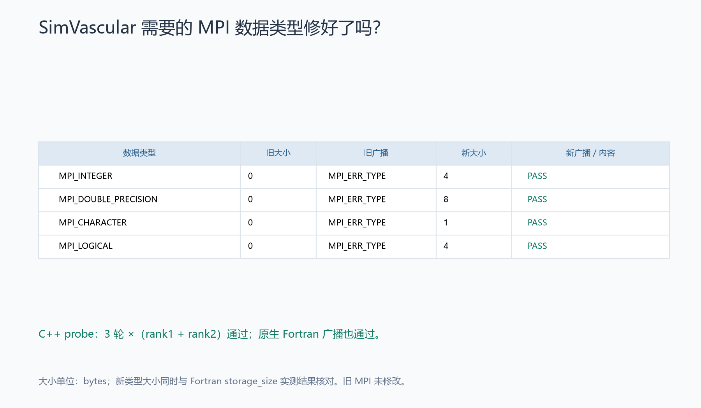
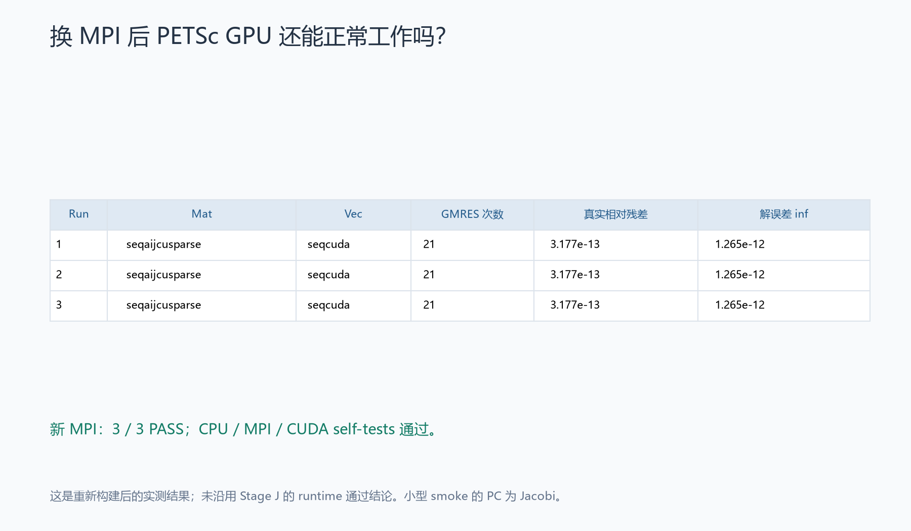
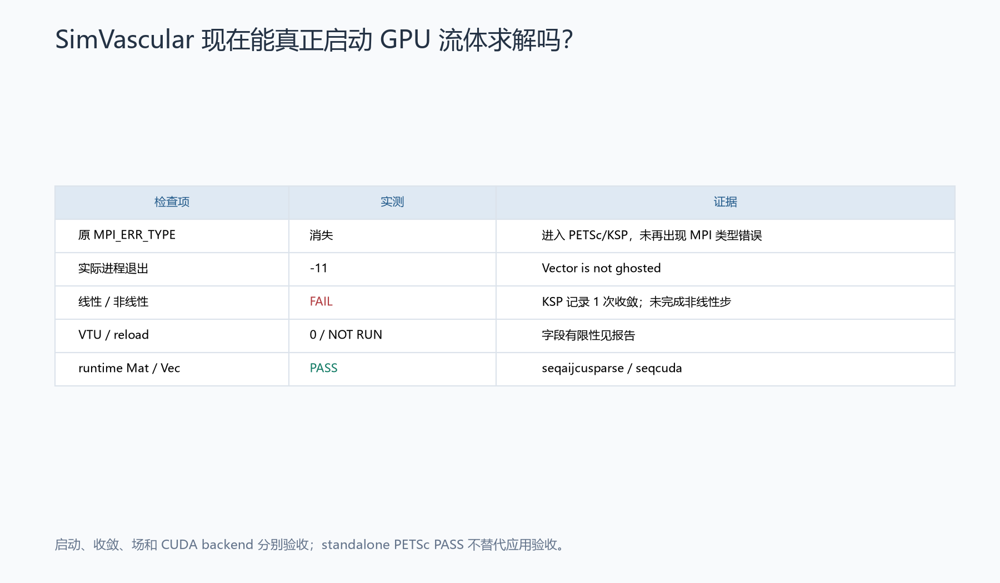
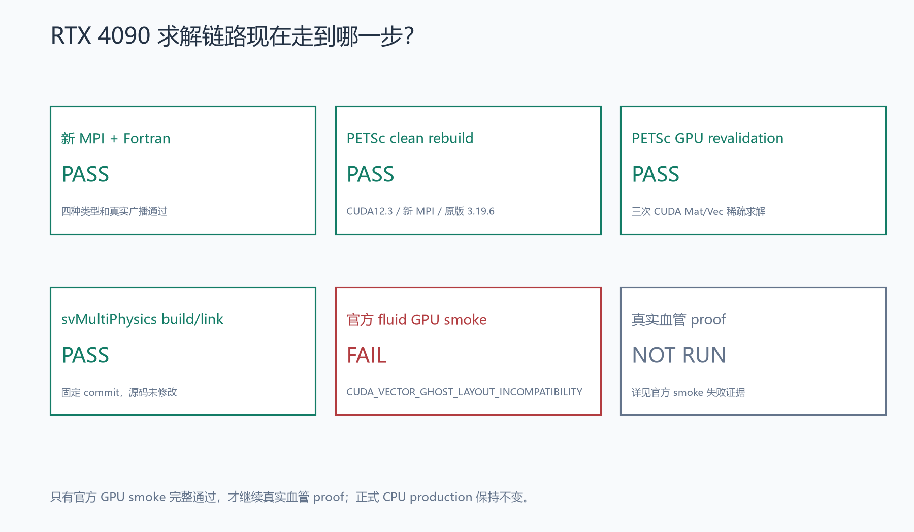

# Stage SV1.3L — 修复 MPI 数据类型并完成 SimVascular GPU 首次真实验证

**阶段状态：FAIL。MPI Fortran datatype 修复通过；重建后的 PETSc GPU 验证通过；svMultiPhysics 已实际启用 CUDA Mat/Vec，但官方流体案例因 ghost-vector 接口错误失败。**

本次新增失败分类为 `SVMULTIPHYSICS_GPU_SMOKE_FAIL / CUDA_VECTOR_GHOST_LAYOUT_INCOMPATIBILITY`。错误原文是 `Vector is not ghosted`。它不属于仍有 MPI 类型错误或 CUDA backend 未激活的情况，因此单独记录这个实际出现的失败，未误用请求中已有的其他分类。[阶段结果](stage_result.json)、[完整终端摘要](terminal_summary.txt)。

真实血管 proof、匹配 CPU proof、科学等价、profiling 和 benchmark 均为 **NOT RUN**。正式 production 保持 `CPU_EARLY_STOP_PRODUCTION`。

## 上一阶段为什么失败？

重新读取 Stage J 的 [MPI 诊断](../sv1_3j/mpi_datatype_diagnosis.json)和 [官方 smoke 记录](../sv1_3j/svmp_gpu_smoke.json)：旧项目 Open MPI 4.1.6 的普通 C 类型可用，但 `MPI_INTEGER`、`MPI_DOUBLE_PRECISION`、`MPI_CHARACTER`、`MPI_LOGICAL` 的大小均为 0，广播返回 `MPI_ERR_TYPE`。旧构建显式使用 `--disable-mpi-fortran`，而固定 solver 的 `CmMod.h` 使用这些 Fortran 预定义类型。因此 Stage J 在启动广播处 exit 3，尚未进入 PETSc 求解。

Stage J 的 CUDA12.3.2、原版 PETSc3.19.6 GPU build、三次 standalone GPU smoke、svMultiPhysics build/link 均已通过。本阶段保留这些历史结论和失败证据，没有重新搜索 CUDA 版本。

## 这次改了什么？

新建 GPU 专用 MPI 安装，启用完整 Fortran bindings，再让 PETSc 和 svMultiPhysics 从全新 source/build tree 链接新 MPI。实际开发根目录为 `FEM_SimVascular`；native 构建和运行位于原 RTX4090 服务器的 `/workspace/formal_3D_flow_solver_FEM_SimVascular_lzy/sv1_3l/`，以下新 prefix 均相对此目录。

| 组件 | 本阶段实际配置 |
| --- | --- |
| MPI | Open MPI 4.1.6，`external/gpu_mpi_fortran/` |
| C / C++ / Fortran compiler | gcc-12 / g++-12 / gfortran-12，均为 12.4.0 |
| CUDA | 继续使用 Stage J 的 12.3.2 toolkit，NVCC12.3.107 |
| PETSc source / arch | `external/compat_cuda/petsc-3.19.6-cuda123-mpif/` / `arch-sv13l-cuda123-mpif` |
| PETSc install | `external/compat_cuda/petsc-cuda123-mpif/` |
| svMultiPhysics build | `external/build/svmp_gpu_mpif/` |
| solver commit | `c3f0bb892b765b718f61069ecd9726dbc6d177fd` |

GFortran12 原先不存在，本次从 Ubuntu 官方仓库安装 `gfortran-12` 及必要依赖。安装前模拟确认零升级、零删除；C、C++17、Fortran 三个 compiler smoke 均 exit 0，结果均为 42。版本、which/realpath、libstdc++/libgfortran/libquadmath 路径及 SHA 见 [compiler_environment.json](compiler_environment.json)。系统默认 GCC/G++、原有 Fortran 路径和 alternatives 未替换。

MPI 使用与 G 阶段完全相同的官方 archive，SHA256 为 `44da277b8cdc234e71c62473305a09d63f4dcca292ca40335aab7c4bf0e6a566`。先运行这个 4.1.6 source 自身的 `configure --help`，确认 `all` 明确代表 mpif.h、use mpi、use mpi_f08，而非套用新版 MPI 参数。[source manifest](MPI_source_manifest.json)、[实际 configure help](../../logs/sv1_3l/remote/openmpi_configure_help.log)。

实际 configure 选用 `--enable-mpi-fortran=all`、internal hwloc/libevent/PMIx，并沿用 `--without-cuda --without-ucx --without-ofi --without-verbs --disable-oshmem`。4.1.6 的 embedded hwloc 配置自身将 GL、OpenCL、CUDA、NVML 探测关闭。这仅限制 MPI/hwloc topology detection，PETSc CUDA 仍启用。[MPI 构建记录](mpi_fortran_build.json)、[原版 hwloc 配置证据](remote/embedded_hwloc_configure.m4)。

MPI configure/make/install 分别 exit 0，耗时 61.046 / 107.653 / 26.651 s。新 [MPI wrapper](../../scripts/run_gpu_mpi_fortran.sh)只设置查找路径、动态库路径和 UID=0 时的显式 root launcher 参数；不包含 PETSc 或科学参数。CUDA 子进程 wrapper 继续指向原 CUDA12.3.2 和 GCC12。

运行前冻结了 **1,604 个历史条目、7,440 个旧 FEM 条目、150 个 reference 文件**。最终本地审计全部通过；远程旧 Stage J 全目录、旧 MPI prefix、驱动、系统 CUDA13、历史 CUDA12.6、默认编译器及动态库配置全部保持不变。[reference_manifest.json](reference_manifest.json)、[本地保护审计](preservation_audit.json)、[远程保护审计](environment_preservation.json)。

## 新 MPI 的 Fortran 支持真的存在吗？

**YES，编译配置与 native runtime 均有证据。** `mpifort`、`mpif90` 都存在，`--showme` 指向 gfortran-12；configure summary 明确列出 `mpif.h, use mpi, use mpi_f08`。原生 Fortran 测试使用 `use mpi`，广播 INTEGER、DOUBLE PRECISION、CHARACTER、LOGICAL，并检查内容。[wrapper/build](mpi_fortran_build.json)、[configure log](../../logs/sv1_3l/remote/mpi_configure.log)、[Fortran 测试](mpi_fortran_basic.json)。

| 验证 | 实际结果 |
| --- | --- |
| C MPI rank1 | 5/5 PASS |
| C MPI rank2 | PASS |
| Fortran MPI rank1 / rank2 | 均 PASS |
| C++ Fortran datatype probe | 连续 3 轮，每轮 rank1 + rank2，全部 PASS |

| 类型 | 旧 MPI size | 新 MPI size | 原生 Fortran storage_size | 新 rank1 / rank2 广播与内容 |
| --- | --- | --- | --- | --- |
| MPI_INTEGER | 0 | 4 bytes | 4 bytes | PASS / PASS |
| MPI_DOUBLE_PRECISION | 0 | 8 bytes | 8 bytes | PASS / PASS |
| MPI_CHARACTER | 0 | 1 byte | 1 byte | PASS / PASS |
| MPI_LOGICAL | 0 | 4 bytes | 4 bytes | PASS / PASS |

C++ probe 保留 Stage J 的八种 MPI handle，并增加非 root 接收缓冲区的实际内容核验；四种 Fortran 类型的预期大小来自独立 Fortran 程序的实测结果。全部 `Type_size`、`Bcast` 返回成功，既检查大小，也检查广播内容。[C 基础测试](mpi_c_basic.json)、[三轮完整 probe](mpi_fortran_datatypes.json)、[application gate](mpi_application_gate.json)。旧 MPI 二进制和 wrapper 未改动。



## 原来的 MPI_ERR_TYPE 消失了吗？

**YES。** 相同官方 fluid/newtonian 输入的新运行中未再出现 `MPI_ERR_TYPE`，并已进入 PETSc 的对象创建、矩阵装配和 KSP 调用。官方 XML 的 SHA256 仍为 `800a59a37f0abe01d1ae343c680b2bdab6804ccfedadd7c52892936a0ea73ec8`，与 Stage J 完全相同。[实际执行记录](official_fluid_gpu_smoke_execution.json)。

MPI datatype repair 可以判为 PASS。但用户规定“official smoke 完整 PASS 后正式关闭 Stage J 的官方 smoke blocker”，本次因另一个错误未达到这项条件，因此 [official_gpu_smoke_resolution.json](official_gpu_smoke_resolution.json)分别记录 `MPI_ERR_TYPE_disappeared=true`、`official_smoke_pass=false`、完整 smoke blocker 尚未正式关闭。

## PETSc GPU 重建后仍然正常吗？

**PASS。** 使用相同 PETSc3.19.6 archive，SHA256 为 `6045e379464e91bb2ef776f22a08a1bc1ff5796ffd6825f15270159cbb2464ae`，从全新 source tree 构建。沿用 Stage J 的 real double、32-bit indices、optimized shared、C++17、CUDA C++17、sm_89、system BLAS/LAPACK 和同一 CUDA 安装；configure 命令只改变 MPI 编译器/launcher 与隔离后的 prefix/arch，差异共五项。[petsc_rebuild.json](petsc_rebuild.json)。

有一次已保留的实施错误：最初新 CUDA wrapper 未带入 Stage J 的私有 GCC12 查找目录，NVCC 因而找到默认 GCC13，首次 configure 失败。在没有使用 unsupported-compiler override 的情况下，补回原先已验证的 GCC12 PATH。随后用 NVCC 编译期断言验证 GCC major=12、C++17，并归档失败 source tree，再从 archive 全新解压后重试；没有复用失败对象。[首次 configure](petsc_configure_attempt1.json)、[完整失败日志](../../logs/sv1_3l/remote/petsc_configure_attempt1_detail.log)、[修正证据](compiler_path_correction.json)。这次修正恢复了要求中的工具链，不改变 PETSc 配置或源代码。

最终 configure/make/install 均 exit 0，耗时 19.745 / 57.022 / 1.265 s；CPU basic、2-rank MPI basic、CUDA basic self-tests 均通过。`ldd` 明确解析到新 MPI。[self-test](petsc_self_test.json)、[MPI linkage](petsc_mpi_link.json)。PETSc 保持 Stage J 的 `--with-fc=0 --with-fortran-bindings=0`；这里关闭的是 PETSc 自己的 Fortran API，与底层 MPI 必须提供的 Fortran datatype 支持不同。

| 新 MPI 下实际 run | Mat | Vec | GMRES reason / iterations | true relative residual | solution error inf |
| --- | --- | --- | --- | --- | --- |
| 1 | seqaijcusparse | seqcuda | 2 / 21 | 3.1767506586176323e-13 | 1.2652101588628284e-12 |
| 2 | seqaijcusparse | seqcuda | 2 / 21 | 3.1767506586176323e-13 | 1.2652101588628284e-12 |
| 3 | seqaijcusparse | seqcuda | 2 / 21 | 3.1767506586176323e-13 | 1.2652101588628284e-12 |

三次 standalone GPU smoke 的 PC 为 Jacobi，和此前准备的测试源一致；没有把它作为 production PC。记录包含实际 Mat/Vec、KSPView、PCView、OptionsView、converged reason、iterations 和重新计算的 true residual。[petsc_gpu_smoke.json](petsc_gpu_smoke.json)、[run 1 原始日志](../../logs/sv1_3l/remote/petsc_gpu_smoke_1.log)。



## SimVascular GPU smoke 成功了吗？

**整体 FAIL；startup 与 CUDA backend activation 已通过。** 固定 commit 的 solver 在新 `svmp_gpu_mpif` 目录独立构建，`ldd`、`readelf` 和 CMake cache 确认链接新 `gpu_mpi_fortran`、新 `petsc-cuda123-mpif`，未混入旧 no-Fortran MPI 或 CPU PETSc。[build](svmp_gpu_build.json)、[linkage](svmp_gpu_link.json)。

官方案例保持相同 scientific input，实际以 1 MPI rank、1 RTX4090、OMP=1 运行。实际 Mat=`seqaijcusparse`，Vec=`seqcuda`，KSP=`gmres`，PC=`asm`，overlap=2，子 PC 为 ILU(2)。矩阵为 12,428 × 12,428、600,272 nonzeros，向量长度 12,428。上述来自该应用运行的 MatView/VecView/KSPView/PCView，没有用 standalone 结果替代。[runtime_backend.json](runtime_backend.json)。

首个错误在 KSP 收敛之前出现：

```text
PETSC ERROR: Invalid argument
PETSC ERROR: Vector is not ghosted
#1 VecGhostUpdateBegin() ... commonmpvec.c:216
#2 petsc_set_vec() ... petsc_impl.cpp:669
```

原版 solver 先在 `petsc_impl.cpp:576` 创建 ghost block vector，`:578` 通过 options 选择 CUDA vector，再于 `:669` 调用 ghost update。原版 PETSc3.19.6 的 `VecGhostUpdateBegin` 只对精确的 `VECMPI` 和 `VECSEQ` 类型走正常分支，实际 `seqcuda` 到达 `commonmpvec.c:216` 的最终报错分支。这个首次错误的位置由运行栈和实际未修改 source 共同确认。[原版 PETSc source](remote/ghost_failure_evidence/commonmpvec.c)、[原版 solver source](remote/ghost_failure_evidence/petsc_impl.cpp)、[诊断记录](ghost_failure_diagnosis.json)。

Ghost vector 接口用于维护 local/global 表示间的 ghost 数据；其 API 的输入要求见 [PETSc VecGhostUpdateBegin 官方说明](https://petsc.org/release/manualpages/Vec/VecGhostUpdateBegin/)。网页是当前文档，本次 3.19.6 的具体类型判断依据上面的本地原版 source。

随后日志仍出现一次 `CONVERGED_RTOL`，18 次迭代、最后 true relative residual 为 `9.826048976106e-11`。然而此前已有 PETSc 错误，且没有完成任何 solver 非线性记录；这条 KSP 收敛不能使 smoke 通过。监视器约 1.003 s 检出 PETSc 错误并发出终止信号；原日志还记录了 solver SEGV、MPI_ABORT 59 和 launcher 在 abort/finalize 路径上的段错误，最终 launcher return 为 -11，总时长 1.503 s。没有独立 debugger trace 证明后续具体非法访问位置，因此不把后续信号覆盖成新的主因。[原始日志](../../logs/sv1_3l/remote/official_fluid_gpu_smoke.log)。

| 项目 | 结果 |
| --- | --- |
| 原 MPI_ERR_TYPE | 已消失 |
| CUDA Mat/Vec 和预期 KSP/PC | 实际观察到 |
| KSP 调用 | 一次收敛记录，之前已有 ghost 错误 |
| 完整非线性步 | 未完成 |
| VTU | 实际数量 0 |
| velocity/pressure finite、reload | NOT RUN，无输出场可验证 |
| 官方 smoke | FAIL |

未修改 `CmMod.h`、PETSc source、solver source，也未替换 PC、尝试不同 CUDA、跳过 ghost 更新或再次运行失败的官方案例。该案例失败后没有继续真实血管阶段。[svmp_gpu_smoke.json](svmp_gpu_smoke.json)。



## 真实血管 GPU 20 步是否成功？

**NOT RUN。** 官方 smoke hard gate 未通过。输入准备沿用 Stage J 已冻结的真实 mesh/geometry、rho、mu、Q、inlet/outlet/wall BC、dt、generalized-alpha、nonlinear method、GMRES tolerance 和 ASM/ILU(2) 语义。待运行 proof 从 t=0 开始，20 steps，不使用 4-rank checkpoint。[输入清单](flow_input_manifest.json)、[本阶段冻结策略](../../configs/sv1_3l/policy.json)。

GPU_PROOF_20 和同一新 binary/MPI/PETSc 的 CPU_PROOF_20_1R 均未启动。步数、线性/非线性失败数、场有限性、wall no-slip、Qin、三个 Qout、mass 和 fresh-process reload 均为 null / NOT RUN。[GPU proof](gpu_proof.json)、[CPU proof](cpu_proof.json)。未把无记录解释为零失败，也未使用历史 VTU 冒充新输出。

## CPU 和 GPU 答案是否一致？

**NOT RUN，无法作科学等价判断。** 阈值在本阶段运行前从 J 策略继承并冻结，未因错误或尚无结果而放宽。

| 指标 | 阈值 | 实测 |
| --- | --- | --- |
| velocity relative volume L2 | ≤1e-5 | NOT RUN |
| pressure relative volume L2 | ≤1e-5 | NOT RUN |
| Qin relative difference | ≤1e-6 | NOT RUN |
| each Qout relative difference | ≤1e-5 | NOT RUN |
| mass-error absolute difference | ≤1e-6 | NOT RUN |
| max velocity relative difference | ≤1e-5 | NOT RUN |

见 [science_equivalence.json](science_equivalence.json)。

## 数据会不会频繁搬来搬去？

**NOT RUN。** 科学等价 gate 未到达，没有开启单独 vascular profiling。矩阵/向量长期驻留、MatMult 的完整执行轨迹、ASM apply、ILU(2) factorization/triangular solve 的位置、每次 KSP 迭代是否有大型 H2D/D2H、传输次数/字节/耗时和 peak VRAM 都未测量。[驻留](gpu_residency.json)、[传输](gpu_transfer.json)、[显存](gpu_memory.json)。

失败的官方 smoke 的 PCView 确实写出 ILU(2) 和 `package used to perform factorization: cusparse`；它是局部对象配置证据，不能替代完整驻留和传输审计。也不能从设备容量 24,564 MiB 推出峰值显存用量。本次不作 GPU_TRANSFER_BOUND 或 GPU_RESIDENCY_PASS 结论。

## RTX 4090 实际加速多少？

**NOT RUN，没有 speedup 结论。** 同服务器、同新 stack、t=0→step20 的 CPU1、CPU4、GPU1 均没有 benchmark 样本。没有把编译时间、1.503 s 的失败进程时间或小型 PETSc smoke 时间拿来比较真实血管性能。[benchmark.json](benchmark.json)、[speedup.json](speedup.json)。

冻结的未来计时规则仍是每类至少两次、首次 warm-up、两次差异超过 10% 时增加第三次、使用 median，并关闭 heavy profiling；speedup 按 `min(CPU1 median, CPU4 median) / GPU1 median`。本次没有到达执行条件。

## 当前结论

**FAIL — SVMULTIPHYSICS_GPU_SMOKE_FAIL，细分类 CUDA_VECTOR_GHOST_LAYOUT_INCOMPATIBILITY。** MPI Fortran datatype repair、PETSc GPU revalidation 和 svMultiPhysics runtime CUDA backend activation 分别通过；完整 GPU 流体验收失败。当前不属于 GPU_A_PROMISING、GPU_WORKS_BUT_NOT_WORTH_COMPLEXITY、GPU_SLOWER_THAN_CPU 或 GPU_TRANSFER_BOUND，性能分类为 NOT_MEASURED。

新增要求中的 **22 个永久测试文件，共 55 项**。最终阶段测试 **47 passed / 1 failed / 7 skipped / 0 errors**。唯一阶段失败是本次真实的官方 GPU smoke 验收，未改成 xfail 或 skip；七项跳过对应未运行的后续 runtime 测量。回归覆盖关闭 Fortran、缺少 wrapper、零 size、Type_size 成功但 Bcast 失败、C 成功但 Fortran 失败、旧 MPI/CPU PETSc 错链、CPU Mat/Vec、NaN、科学不等价、单次 benchmark，以及“KSP 收敛不能掩盖此前 PETSc ghost 错误”。[阶段 JUnit](pytest_stage.xml)、[阶段日志](../../logs/sv1_3l/pytest_stage.log)。

完整测试为 **315 passed / 7 failed / 52 skipped / 0 errors**。其中历史失败 6 项：SV1.1 短程质量误差、SV1 三项科学/收敛验收、H 的 CUDA12.6 PETSc build、J 的旧 MPI 官方 GPU smoke；新增本阶段真实失败 1 项。历史文件和测试保持原样。[完整 JUnit](pytest_full.xml)、[完整日志](../../logs/sv1_3l/pytest_full.log)、[测试汇总](test_summary.json)。首次阶段测试曾因新 NOT_RUN 显存记录漏写“设备容量”元数据而额外失败，已补入实际 nvidia-smi 容量并通过复测；原测试日志/XML保留为 attempt1，最终 ghost failure 仍保留。

最终 **11,035 个 PETSc 原版文件和 1,564 个 solver tracked 文件修改数为 0**；没有升级或 patch。[源码保护审计](final_source_integrity.json)。新 MPI 安装归档、新 PETSc 安装归档、solver 及四个 native smoke/probe 二进制已同步到 [WSL native 目录](../../outputs/sv1_3l/native)，逐项验证 SHA256。[镜像校验](native_mirror_verification.json)、[全部交付清单](delivery_manifest.json)。这些归档保留远程依赖路径，不表示已在 WSL 安装 GPU stack。

按“official smoke PASS 后才生成 E–I”的要求，本次生成 A–D 四张图，均展示实测证据；E–I 对应流程未运行、图片未生成。人工审阅入口见 [图表清单](visuals.json)。



## 下一步

继续保留已通过的 MPI/PETSc/CUDA stack，下一阶段应针对固定 solver 的 ghost-vector 创建、CUDA 类型选择和 ghost-update 接口兼容性设计最小验证，并审查错误返回后的处理。是否允许 solver/PETSc 的最小适配，应由下一阶段任务明确；本阶段没有越过零 source 修改约束。

在官方 GPU smoke 完整通过之前，不进入真实血管 proof 或性能计时。当前不具备建议 SV1.3M 完整 GPU steady validation 的条件，也没有证据要求更换预条件器。正式 **CPU_EARLY_STOP_PRODUCTION** 保持不变；未运行 GPU full steady solve 或 mesh convergence。本阶段完成证据、测试和保护审计后停止。
