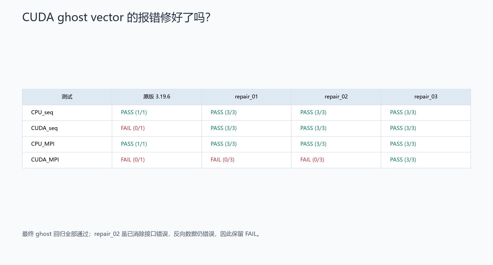
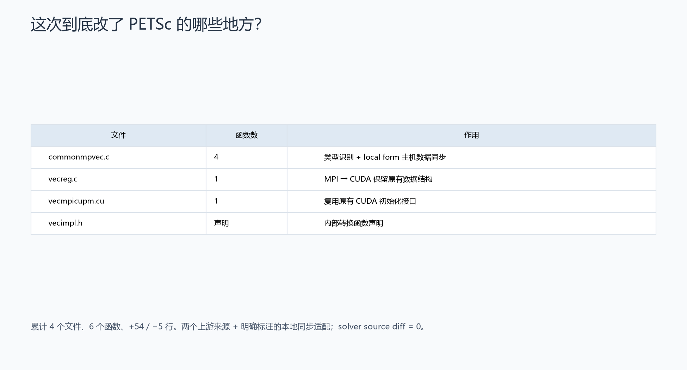
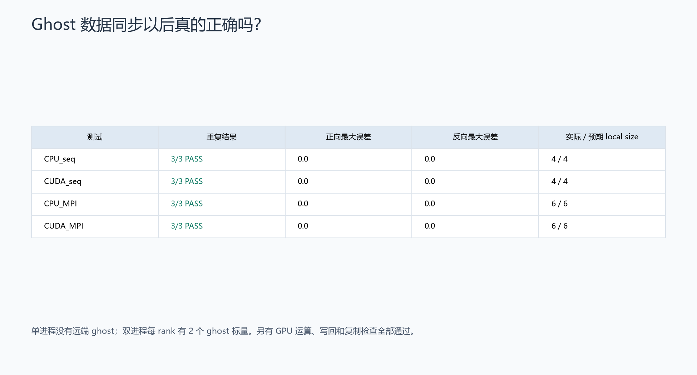
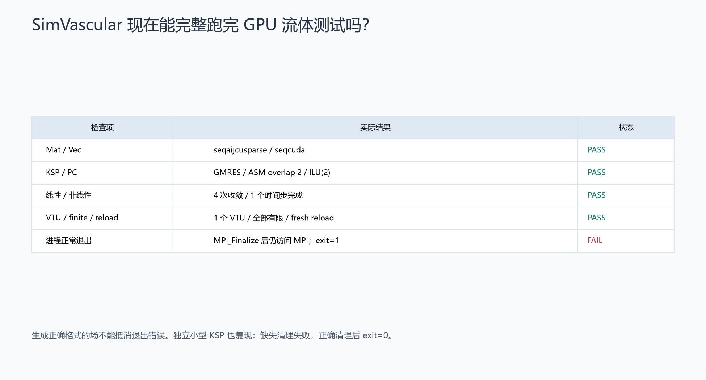
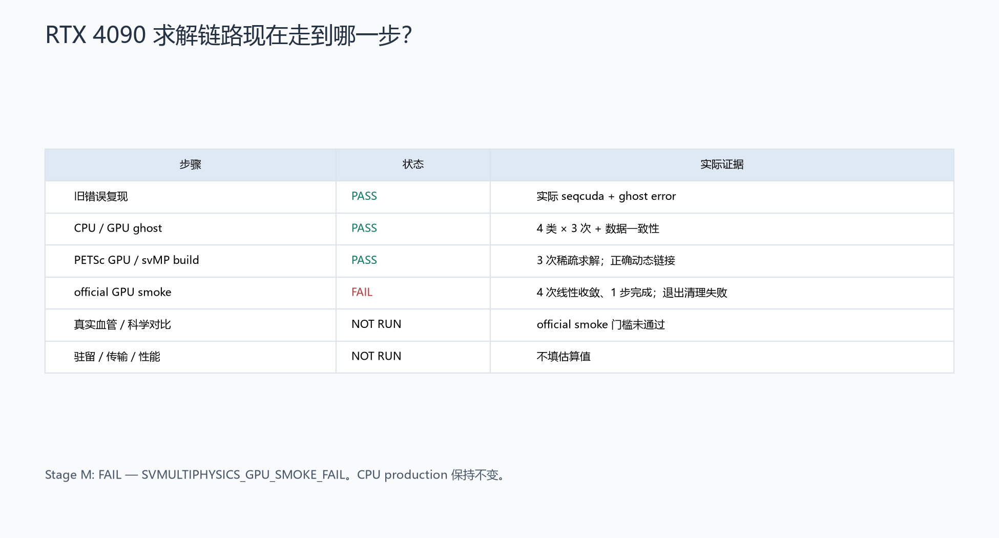

# Stage SV1.3M — 修复 CUDA Ghost Vector 并完成 SimVascular GPU 真实验证

**STAGE SV1.3M: FAIL — SVMULTIPHYSICS_GPU_SMOKE_FAIL。** Ghost 修复和 PETSc GPU 基础回归通过；official fluid 已完成 1 步并输出有限场，但退出清理失败。不能用线性收敛或 VTU 覆盖这一失败。生产仍为 `CPU_EARLY_STOP_PRODUCTION`。

## 上一阶段到底为什么失败？

旧栈实际创建 CUDA Mat/Vec，旧 ghost 接口却按精确类型识别普通 seq/mpi。Stage M 在新目录**只复现一次**旧 official run，得到 `seqaijcusparse`、`seqcuda` 和 `Vector is not ghosted` / `VecGhostUpdateBegin` 调用栈；监控器终止了 run。[基线](baseline_ghost_failure.json)、[原始日志](../../logs/sv1_3m/baseline_ghost_failure.log)。

## 是怎么确认根因的？

最小 probe 完整覆盖 CreateGhostBlock → SetFromOptions → GetLocalForm → Forward/Reverse → Restore，逐元素核对。原版 CPU 两类通过，CUDA 两类失败。官方 commit [`8ba8e283c7d3ba8c2bd73cc674b79590a073ab5a`](https://gitlab.com/petsc/petsc/-/commit/8ba8e283c7d3ba8c2bd73cc674b79590a073ab5a)，首次发布于 v3.25.0，改用 base type 判断。[官方 issue 1096](https://gitlab.com/petsc/petsc/-/issues/1096) 也指出类型转换会销毁 ghost 元数据。git log、blame、tag diff 和旧/新源码全部保存。[审计](upstream_ghost_fix_audit.md)。

## 为什么允许修改 PETSc？

用户授权最多三次局部工程兼容修复。所有改动局限于 PETSc Vec 层；svMultiPhysics `c3f0bb892b765b718f61069ecd9726dbc6d177fd` 的 1564 个 tracked 文件无变化，科学输入不变。正式名称为 **PETSc 3.19.6 + upstream CUDA ghost compatibility backport**。其中第三轮是有独立最小复现、以官方 host mapping API 为依据的本地同步适配，明确不冒充逐字 upstream cherry-pick。

## 实际 patch 多大？

累计 **4 个文件、6 个函数、+54 / −5 行**：`commonmpvec.c` 的四个 ghost 入口、`vecreg.c` 的 VecSetType、`vecmpicupm.cu` 的内部 CUDA 转换函数，另有 `vecimpl.h` 声明。五行类型判断来自上述 v3.25 提交；保留 MPI 数据结构的转换来自 [`ca0374c5dd2e044b693bca7c31c716bd3be32b2a`](https://gitlab.com/petsc/petsc/-/commit/ca0374c5dd2e044b693bca7c31c716bd3be32b2a)，首次 v3.20.0，按旧 CUPM API 最小适配。未整份替换新版源码。

[累计 patch](../../patches/sv1_3m/petsc319_cuda_ghost_backport.patch)、[provenance / revert](../../patches/sv1_3m/PATCH_PROVENANCE.md)、[源树哈希与 scope](patch_integrity.json)。三轮均独立解压原始 archive、clean configure/make/install/self-tests；只改变构建路径和 patch，未复用旧 objects。最终采用源码已在 WSL 重建，11035 个文件哈希与远端一致。[WSL 源码镜像](WSL_source_mirror.json)。

## Ghost 数据真的正确吗？

| 测试 | 重复 | Forward 最大误差 | Reverse 最大误差 | local size |
|---|---:|---:|---:|---:|
| CPU seq | 3/3 PASS | 0 | 0 | 4/4 |
| CUDA seq | 3/3 PASS | 0 | 0 | 4/4 |
| CPU MPI 2R | 3/3 PASS | 0 | 0 | 每 rank 6/6 |
| CUDA MPI 2R | 3/3 PASS | 0 | 0 | 每 rank 6/6 |

单进程与真实 solver 一样没有远端 ghost；双进程每 rank 有 4 个 owned、2 个远端 ghost 标量，验证真正的数据通信和反向贡献。CPU 行为与原版一致。另用真实 CUDA VecScale、local owned 写回、Reverse 和 VecDuplicate 检查，CPU/CUDA 各 3/3 通过。[逐元素证据](ghost_probe_after.json)、[额外 coherence 检查](ghost_coherence.json)。永久测试独立重建期望值，不只相信 probe 的 PASS 标签。

## PETSc GPU 基础功能有没有被破坏？

CPU/MPI/CUDA self-tests 全部通过；原 standalone GMRES 稀疏 smoke 重跑 3/3 PASS。Mat=`seqaijcusparse`，Vec=`seqcuda`，21 次迭代，真实相对残差 `3.1767506586176323e-13`，解误差 inf `1.2652101588628284e-12`，与 Stage L 一致。此小基准 PC 为 Jacobi；正式流体继续 GMRES/ASM overlap 2/ILU(2)。[运行结果](petsc_gpu_smoke.json)。

## SimVascular official GPU smoke 现在通过了吗？

**未通过。** clean build 和 ldd/readelf/CMake linkage 均通过，实际 Mat=`seqaijcusparse`、Vec=`seqcuda`、KSP=`gmres`、PC=`asm`，ILU fill level=2。4 次线性求解收敛，线性失败 0，非线性失败 0，1 个时间步完成，1 个 VTU，velocity/pressure 有限，独立新进程 reload PASS。原 ghost 和 MPI_ERR_TYPE 均消失。

但 native exit=1，日志出现 `MPI_Comm_rank() function was called after MPI_FINALIZE was invoked`。单独诊断 replay 在退出时捕获 PETSc CUDA `event_pool` 全局析构 / `PoolAllocator` 的 SIGSEGV。原源码 `PetscLinearAlgebra::finalize()` 是空实现，main 随后直接 MPI_Finalize，未在正常退出路径清理 PETSc。独立 KSP lifecycle probe 在缺失清理时复现 exit=1，正确销毁对象并 PetscFinalize 后 exit=0；向量-only probe 未复现，也原样保留。官方 [PetscFinalize 合约](https://petsc.org/release/manualpages/Sys/PetscFinalize/) 说明其清理职责。

这定位到退出生命周期问题；没有把 gdb 输出当成已完成内存 sanitizer 的证明。GDB launcher exit=0 仅表示调试器完成，不能算 solver PASS。[完整 smoke](svmp_gpu_smoke.json)、[退出诊断](exit_failure_diagnosis.json)、[调用栈](../../logs/sv1_3m/official_exit_diagnostic.log)、[KSP 复现](finalize_ksp_probe.json)。

## 如果中间又出现兼容问题

| 修复 | 根因 | 结果 |
|---|---|---|
| repair_01 | 精确类型判断不识别 CUDA | seqcuda 修复；MPI 仍丢失 metadata |
| repair_02 | VecSetType 销毁 localrep/localupdate | Forward 正确；Reverse 读到旧 owner 值，拒绝接受 |
| repair_03 | GPU owner / CPU local form 有效性不同步 | 四类数据回归和额外 coherence 全通过 |

[三轮记录](repair_iterations.json)。额度 **3/3 已用完**；新退出问题需要另一项修复，且 Stage M 要求 solver source diff=0，因此未打第四个 patch、未吞掉错误。用户随后发来的 Stage N 请求允许新的现代 PETSc 兼容验证；该工作在新目录开始，Stage M 此后封存只读。

## 真实血管 GPU 20 步成功了吗？

**NOT RUN**。official smoke 完整 PASS 门槛未达到；没有把小 official 场当成真实血管 proof。

## CPU 和 GPU 算出来一样吗？

**NOT RUN**。没有 vascular CPU/GPU 场对，无 velocity/pressure/Q/mass 比较结论；未做 pressure shift。

## Ghost 同步会不会拖慢 GPU？

**NOT RUN**（vascular profiling）。实际两进程 probe 的 global Vec 为 mpicuda，localrep 为 seq，第三轮通过 PETSc host access 同步既有主机 local form。这说明可能有数据搬运，不能据此填写传输次数、bytes 或速度。真实 MatMult、ASM、ILU 的完整驻留/传输归因均未测；正式单进程 seqcuda 路径没有远端 ghost。

## RTX4090 实际快多少？

**NOT RUN**。未运行三组同机 20-step benchmark；不报告推测 speedup，不使用 profiling 或失败 smoke 的时间充当性能。

## 最终结论

**FAIL — SVMULTIPHYSICS_GPU_SMOKE_FAIL / POST_MPI_FINALIZE_GPU_RESOURCE_TEARDOWN_FAILURE**。Ghost compatibility repair PASS；完整应用退出失败。保持 `CPU_EARLY_STOP_PRODUCTION`，未启动 full GPU steady、PC tuning 或 mesh convergence。

永久 Stage M 测试：**45 passed / 1 failed / 6 skipped / 0 errors**。唯一新真实验收失败是 official smoke；下游未运行 tests 明确 skip，不用 xfail 隐藏失败。完整 pytest：**360 passed / 8 failed / 58 skipped / 0 errors**，其中 7 个历史失败保留。[测试汇总](test_summary.json)、[完整日志](../../logs/sv1_3m/pytest_full.log)。

历史保护：本工程 2003 项、旧 FEM 7440 项、266 个 reference files 无变化；远端 L/J/MPI/CUDA/driver/default compiler 栈也保持不变。[本机审计](preservation_audit.json)、[远端审计](remote_preservation.json)。7 项 native artifacts 已校验并镜像到 WSL，包含最终 PETSc、solver、probe 和未修改原始 archive。[镜像清单](native_artifact_mirror.json)。
