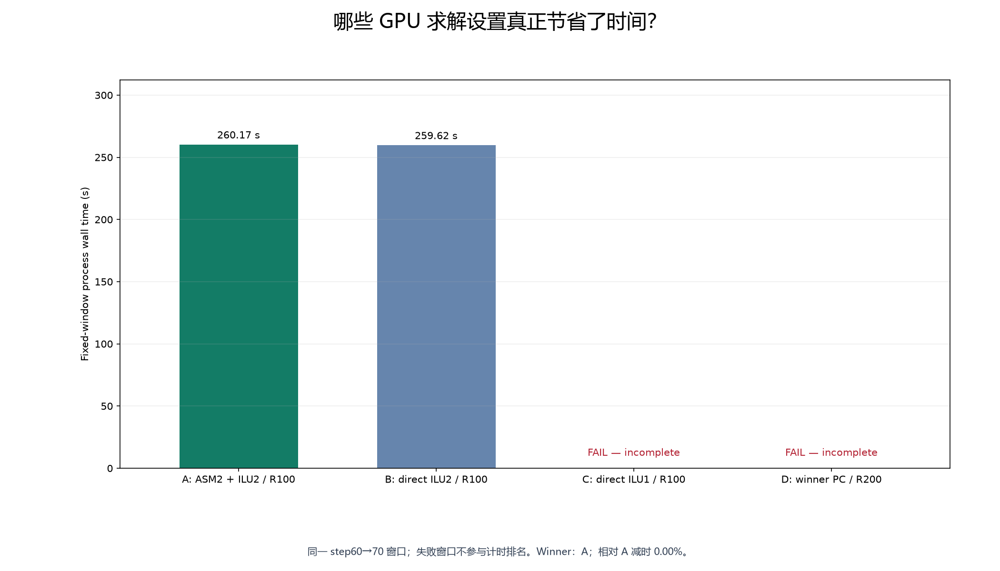
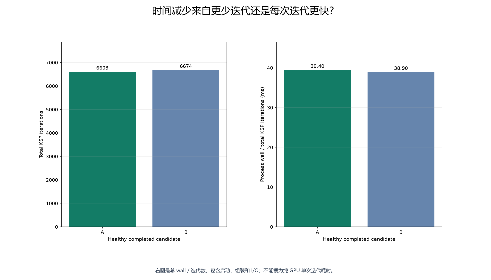
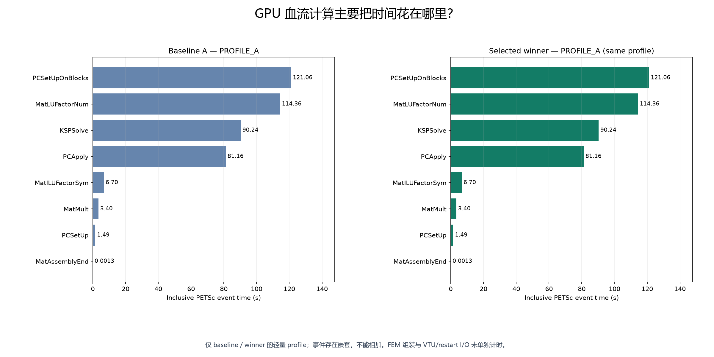
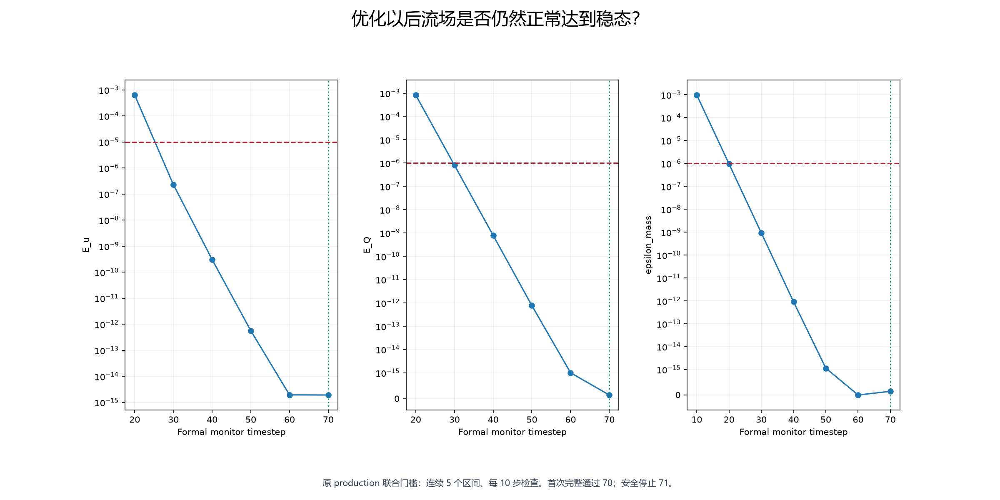
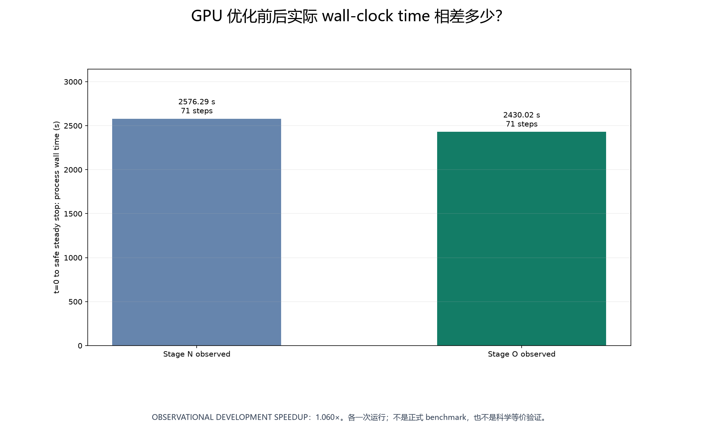

# Stage SV1.3O — RTX 4090 单 GPU 血流求解性能优化

**PASS: SIMPLE_GPU_TUNING_EXHAUSTED。保留配置 A；结果为 GPU_OPTIMIZED_STEADY_CANDIDATE，NOT YET SCIENTIFICALLY VALIDATED。**

正式 scientific production 仍是 `CPU_EARLY_STOP_PRODUCTION`。全部 CFD 均为 1 MPI rank、1 RTX4090、OMP=1；没有 CPU 对照或多 rank CUDA 测试。

## 优化前是什么状态？

Stage N 实际完成 71 步，wall=2576.288518 s，161 次 KSP solve、83090 次 iteration，平均 516.086957。首次完整稳态判据为 step70，安全停止为 step71。

这些记录为 **DEVELOPMENT_BASELINE_OBSERVED**，不是重复 benchmark median。PETSc `v3.25.5` / commit `a0b507cc1cc9eac739c34d6e71521f4854e84e36`、CUDA13.2、OpenMPI4.1.6、Stage N lifecycle adapter、mesh/geometry、rho/mu/Q/BC/dt、时间积分、非线性容差及 production steady policy 均冻结。[冻结清单](reference_freeze.json)、[历史审计](preservation_audit.json)。

## 首先减少了什么无效开销？

Stage N 每步写 VTU。新的 **PERFORMANCE_OUTPUT_POLICY** 正常每 10 步写正式 VTU，继续每 10 步运行原 steady monitor；收到 STOP_SIM 后完成当前步，同时写 final VTU 和完整 native checkpoint。

源码唯一新增差异是 `main.cpp` 的输出条件：`save_vtu || (com_mod.saveVTK && reached_stop_time_step)`。原 restart 保存逻辑已经包含停止条件，未改变其二进制格式；方程、组装、积分和 lifecycle adapter 均不变。[最小补丁](../../patches/sv1_3o/final_output_on_stop.patch)、[逐文件来源](source_patch.json)、[GPU clean build](svmp_build.json)。构建沿用已冻结的 PETSc/MPI 前缀，没有重新构建 PETSc。远端原源码包缺失的 866 个受跟踪文件由 WSL 原始副本补齐，已有文件哈希全部一致。

短官方测试实际完成 11 步，仅保存 [10, 11]，step11 在正常 cadence 之外仍产生完整 VTU/checkpoint；fresh reload PASS。这一机制验证没有运行额外完整 vascular steady。[官方输出测试](OFFICIAL_OUTPUT_STOP_acceptance.json)。最终完整运行保存 8 份 VTU，步号 [10, 20, 30, 40, 50, 60, 70, 71]，Stage N 为 71 份。

固定窗口从 Stage N 原生 **step60 checkpoint** 继续至 step70，实际执行61—70共10步；初始文件 SHA256 `435b93923b549ebcdf6e854ce91733f09684ec342e08eda4fbd69f6921e7872a`。Y_n/A_n/step/time/history 完整，PERF_A 使用新二进制的原生读取器成功加载，所有候选使用同一 SHA、XML、mesh、GPU backend 和 rank 数。继承日志的累计 elapsed 不作窗口计时，统一使用新进程单调时钟。[checkpoint 验证](checkpoint_window.json)。

## ASM 在单 rank 下有没有必要？

实际 PERF_A 的每次 PCView 均报告 **1 个 ASM block、overlap2**；子域与全局矩阵均为 **281452 × 281452**，单 rank local/global rows 相同。[实际 topology](asm_topology.json)。

因此执行了 direct ILU(2)。B 的 observed wall=259.624404 s，相比 A 减时 0.210%。这个观测不能证明所有单 rank 场景都不需要 ASM；本次固定窗口是否保留 B 由预先冻结的收益门槛决定。

## 哪个线性配置最快？

| Candidate | 配置 | 实际状态 | 完整10步 wall / s | KSP iterations | Mean / solve |
|---|---|---|---:|---:|---:|
| A | ASM overlap2 + ILU(2), restart100 | PASS | 260.169648 | 6603 | 330.150 |
| B | direct ILU(2), restart100 | PASS | 259.624404 | 6674 | 333.700 |
| C | direct ILU(1), restart100 | FAIL | 不参与完整窗口排名 | 200 | 200.000 |
| D | winner PC, restart200 | FAIL | 不参与完整窗口排名 | 2557 | 639.250 |

失败候选的 iteration 数只覆盖中止前的部分窗口，不用于性能比较。C 在 step61、D 在 step62 出现 `DIVERGED_BREAKDOWN`（reason=-5），因此均拒绝。C/D 原始失败、退出码、负 KSP reason 和日志完整保留于 [失败明细](candidate_failures.json)，未通过放松 tolerance、改变 dt 或增加参数扫描挽救。

| Candidate | KSP solves | Max iterations / solve | GMRES cycles / restarts | 整卡显存采样最大值 / MiB |
|---|---:|---:|---:|---:|
| A | 20 | 424 | 75 / 55 | 3836 |
| B | 20 | 410 | 79 / 59 | 3820 |
| C | 1 | 200 | 2 / 1 | 1 |
| D | 4 | 691 | 14 / 10 | 4252 |

GMRES cycles/restarts 由实际 iteration 与固定 restart 长度推算，未增加 trace 运行。显存每 15 秒低成本采样，不能视为精确进程峰值；C 约 10 秒即失败，1 MiB 启动采样不代表其真实显存需求。A–D 的 PCView 实际配置均已独立核对，包括 C 的 `1 level of fill`；该配置核对不会改变 C/D 的求解失败状态。[配置与成本明细](candidate_runtime_summary.json)。

完整且健康的单次原始计时最小值是 **B：259.624404 s**。按用户规则保留的 winner 是 **A**，选优计时 260.169648 s，相对 A 减时 0.000%。低于 5% 视为无明显收益；只有 5%—10% 区间允许一次确认，不默认 median。本次没有因为失败候选的短暂运行时间而把它判为更快。

- B: KEEP_INCUMBENT；相对当前配置减时 0.210%。
- C: REJECT_UNHEALTHY；未满足求解健康门槛。
- D: REJECT_UNHEALTHY；未满足求解健康门槛。



## 时间改善来自哪里？

必须区分总 iteration、每次 iteration 的成本和其它开销。下图的 wall/iteration 包含启动、组装、PC、输出，不能解释为纯 GPU kernel 的单次时间。winner 的选择依据完整10步 wall 与健康门槛。

B 的总迭代从 A 的 6603 增至 6674，wall/iteration 从 39.402 降至 38.901 ms；最终 wall 差异只有 0.210%，不能据单次小差异认定去掉 ASM 有稳定收益。没有为 B/C/D 追加 PC/KSP 计时 profile，相关分项标为 NOT_MEASURED；轻量诊断仅覆盖允许的 baseline/winner。



仅在 baseline 与最终 winner 的固定窗口进行了轻量 PETSc `log_view` / GPU event timing。两者同配置时共用一次 profile；实际 profile 次数 **1**。这些运行全部排除在选优计时之外。

| Profile | PCSetUpOnBlocks / s | MatLUFactorNum / s | KSPSolve / s | PCApply / s | MatMult / s | PCSetUp / s |
|---|---:|---:|---:|---:|---:|---:|
| PROFILE_A | 121.06 | 114.36 | 90.238 | 81.155 | 3.401 | 1.4939 |

主要记录成本是 **PCSetUpOnBlocks=121.060 s**，其中 MatLUFactorNum=114.360 s，MatILUFactorSym=6.6972 s；顶层 PCSetUp 不能代表全部预条件器准备成本；ASM 的块内预条件器 setup 另由 PCSetUpOnBlocks 完成。[官方说明](https://petsc.org/release/manualpages/PC/PCSetUpOnBlocks/)。KSPSolve=90.238 s 内 PCApply=81.155 s 是主要事件，MatMult=3.401 s 明显较小。应用标记的 PETSc Solve stage 共 213.240 s（PETSc 总计时的 82.1%）。因此现有证据支持以后优先研究 PC 的准备与应用成本，而不是继续扫描 restart。

PETSc 事件有嵌套，表中数值不能相加。同名事件按本次单 rank 日志的不同 stage 汇总，并保留逐 stage 原行。MatAssemblyBegin/End 共 0.00133616 s，仅为 PETSc 矩阵最终装配，不代表完整 FEM 方程组装。FEM assembly 与 VTU/restart I/O 的独立时间均为 **NOT_SEPARATELY_MEASURED**；I/O 的已证实变化是输出文件数量减少，不能把全部 wall 差异归因于 I/O。[profile 数据](profile_summary.json)、[官方 profiling 说明](https://petsc.org/release/manual/profiling/)。

实际 Mat=`seqaijcusparse`、Vec=`seqcuda`，factorization package=['cusparse']；显式 fallback warning 记录为 []。这不证明整条 PC 路径都在 GPU 上；官方 PCILU 文档对 cuSPARSE 矩阵的分解位置有 CPU 说明，端到端 residency 本阶段标为 **NOT_MEASURED**，没有追加 residency CFD。[官方 PCILU](https://petsc.org/release/manualpages/PC/PCILU/)。



## 最终优化配置是什么？

最终采用 A。完整 PETSc options：

```text
-skip_petscrc -ksp_type gmres -ksp_pc_side right -ksp_norm_type unpreconditioned -ksp_rtol 1e-10 -ksp_atol 1e-24 -ksp_max_it 2000 -ksp_diagonal_scale -ksp_diagonal_scale_fix -ksp_monitor_true_residual -ksp_converged_reason -ksp_view -options_view -options_left -use_gpu_aware_mpi 0 -mat_type aijcusparse -vec_type cuda -vec_view ::ascii_info -mat_view ::ascii_info -ksp_view_mat ::ascii_info -ksp_view_rhs ::ascii_info -ksp_view_solution ::ascii_info -ksp_gmres_restart 100 -pc_type asm -pc_asm_overlap 2 -sub_ksp_type preonly -sub_pc_type ilu -sub_pc_factor_levels 2
```

1 MPI rank、1 RTX4090、OMP=1；VTU cadence10，并在停止时强制保存最终 VTU/restart。rtol1e-10、atol1e-24、max_it2000、right preconditioning、非线性及稳态容差保持不变。[winner](winner.json)、[完整运行 XML](../../outputs/sv1_3o/REAL_VASCULAR_GPU_PERF/solver.xml)。

## 优化后真实 vascular 到第几步稳态？

唯一一次 `REAL_VASCULAR_GPU_PERF` 从 t=0 运行。首次完整满足 production 连续 **5** 个区间是在 **step70**，安全停止 **step71**；物理时间 1.0678826651e-05 s，wall **2430.023319 s**。

161 次 KSP solve，81757 次 iteration，mean=507.807453，max=801；linear/nonlinear failures=0。最后正式区间 E_u=1.918643957e-15、E_Q=1.441150735e-16，final mass=0。低成本整卡显存采样最大观测值 3836 MiB；不是精确进程峰值。

原 `SteadyStopMonitor` / `stop_gate` 直接复用，阈值、连续区间数、cadence 未变。第一次通过即请求 STOP_SIM，仅完成当前步并保存，没有额外余量时间步。[steady history](steady_history.json)、[停止请求](steady_stop_request.json)。



最终 VTU SHA256 `6f4bead0ad1238384a13e36243cb5e9215b338bc219bd454c232880d44bb9b6b`；checkpoint SHA256 `f855c14cd33da54c31e449d220f70ecf2eb128856c45495cd382bbd75a4123d3`；solver SHA256 `77df0083f6a331835a0a528100c73da4847fa7bc6af6240f93cf776191e16022`。VTU 内 TimeValue 与 checkpoint 时间均为 1.0678826650986389e-05 s；fresh-process reload、有限速度/压力/流量、wall no-slip 和 mass 检查全部通过。[输出时间与重载](output_consistency.json)、[冻结 GPU 候选](optimized_steady_candidate.json)、[原生构建镜像](native_artifact_mirror.json)。

## 实际开发加速多少？

Stage N observed wall=2576.288518 s；Stage O observed wall=2430.023319 s；S_dev=1.060191×。

**OBSERVATIONAL DEVELOPMENT SPEEDUP — SINGLE-RUN DEVELOPMENT COMPARISON。** 两者均达到相同 production steady criteria，但各只运行一次；这不是正式 benchmark，也不是 scientific production comparison。完整运行改善与固定窗口调参改善是不同记录，阶段分类按相对 low-I/O PERF_A 的调参收益判断。



## 哪些工作仍然推迟？

- CPU/GPU science equivalence — **DEFERRED**。
- OLD/NEW PETSc science comparison 与 CPU benchmark — **DEFERRED**。
- Formal benchmark — **DEFERRED**。
- Multi-GPU / multi-rank CUDA 与 mpicuda reverse — **DEFERRED**。
- Advanced GPU-native PC — **DEFERRED**。

简单调参收益不足 10%，本轮已停止；后续如继续性能研究，建议单独开展 GPU-native preconditioner study。本次没有进入 Stage SV1.3P。

阶段结论 **SIMPLE_GPU_TUNING_EXHAUSTED**；科学等价仍为 **DEFERRED**，正式 production 保持 `CPU_EARLY_STOP_PRODUCTION`。Stage O tests={'passed': 28, 'failed': 0, 'errors': 0, 'skipped': 0}；完整 pytest={'passed': 462, 'failed': 8, 'errors': 0, 'skipped': 65}；历史结果={'passed': 434, 'failed': 8, 'errors': 0, 'skipped': 65}。新 tests 读取已有 artifact，不启动 CFD；对 C/D 的拒绝测试不会把真实求解失败改写为 PASS。[测试记录](test_summary.json)、[本地保留审计](preservation_audit.json)、[原生保留审计](remote_preservation.json)。
