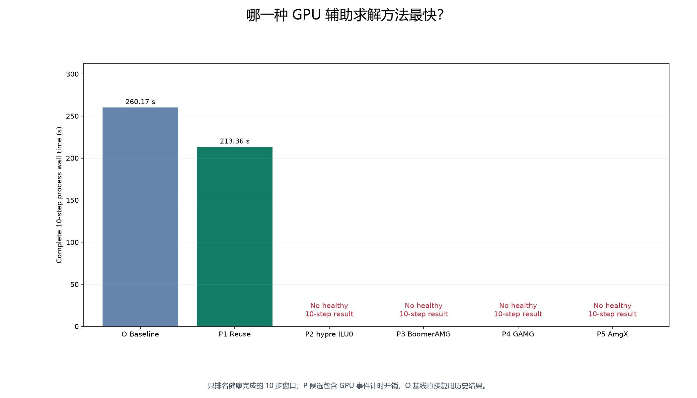
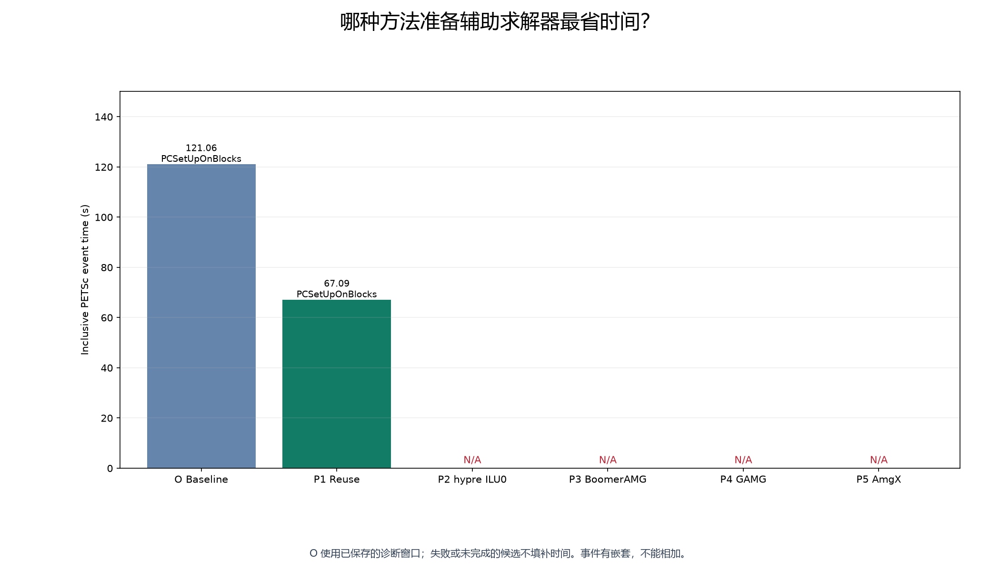
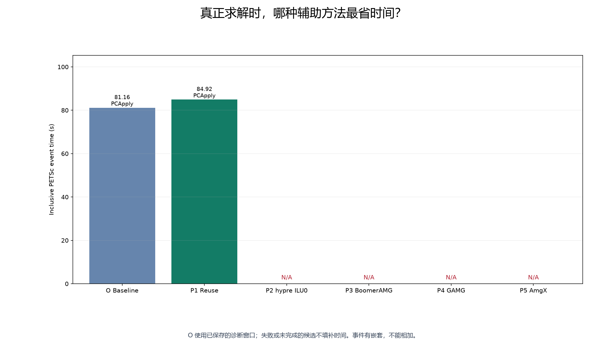
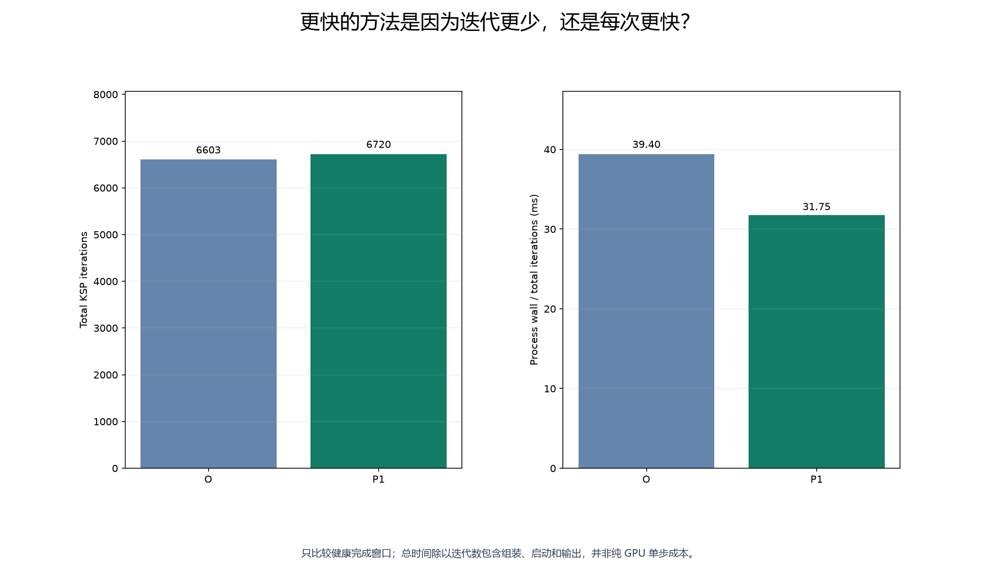
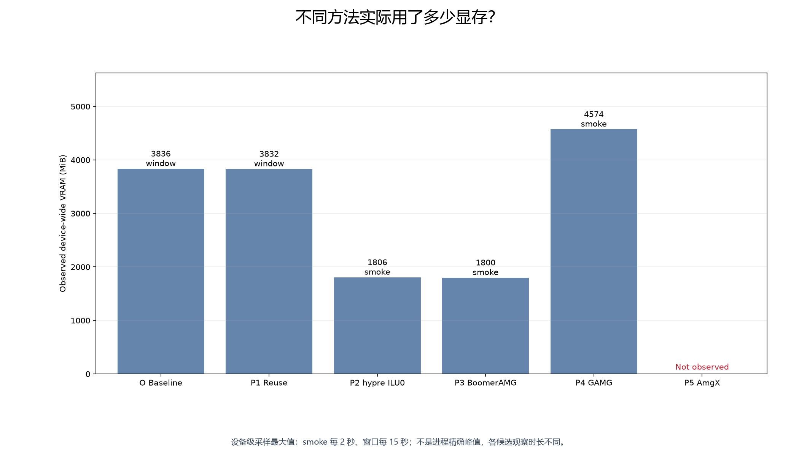
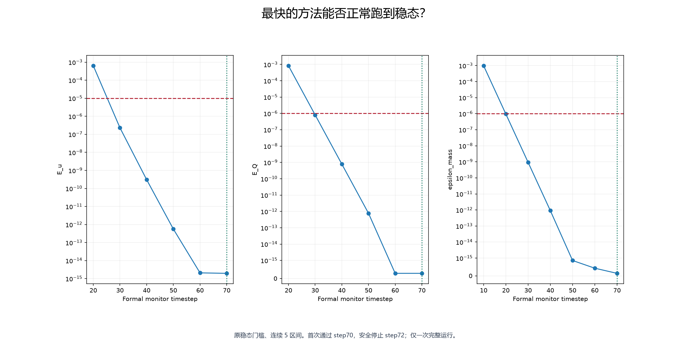
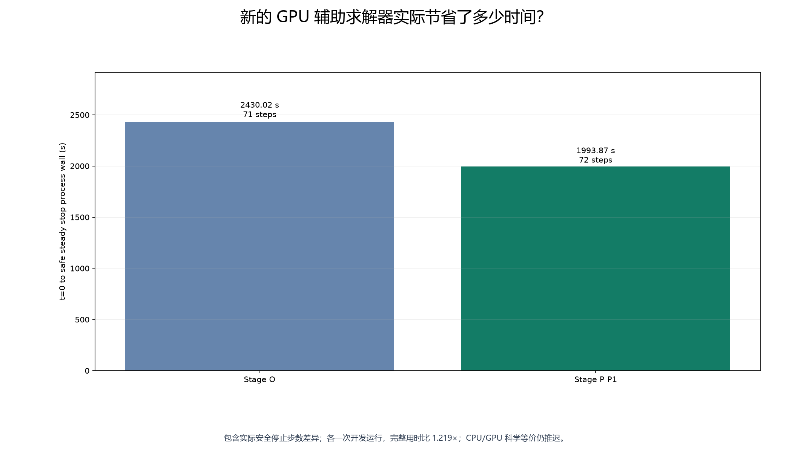

# Stage SV1.3P — 测试现有 GPU 友好的辅助求解方法

最终状态：**GPU_PC_WINNER_FOUND**。Stage O 成功配置和 CPU production 均保留。

## 为什么要换辅助求解器？

GPU 的矩阵乘法已经很快。Stage O 的诊断窗口中，准备子域辅助求解器约 121.06 秒，其中数值分解约 114.36 秒；使用辅助求解器约 81.16 秒，矩阵乘法约 3.40 秒。因此本次只改变辅助求解方法。矩阵、物理参数、边界条件、时间步、稳态标准，以及 GMRES 的 restart100、rtol1e-10、atol1e-24、max_it2000 全部冻结。

## 这次测试了什么？

| 方法 | 最多 2 步 smoke | 健康完成的 10 步时间 | 10 步迭代数 | 结论 |
|---|---|---:|---:|---|
| 原 ASM2 + ILU2 | 复用历史证据 | 260.17 秒 | 6603 | Stage O fallback |
| P1 同一步内复用 ILU | PASS | 213.36 秒 | 6720 | USEFUL_GAIN |
| P2 hypre GPU ILU0 | FAIL | 无健康完整窗口 | — | REJECT_UNHEALTHY |
| P3 hypre BoomerAMG | FAIL | 无健康完整窗口 | — | REJECT_UNHEALTHY |
| P4 PETSc GAMG | FAIL | 无健康完整窗口 | — | GAMG_NOT_SUITABLE_CURRENT_MONOLITHIC_LAYOUT |
| P5 NVIDIA AmgX | 未进入 CFD | 无健康完整窗口 | — | BUILD_FAILED_CUDA13_NVTX_COMPATIBILITY |

所有窗口读取同一个 Stage N 原生 step60 检查点，执行 61—70；SHA256 为 `435b93923b549ebcdf6e854ce91733f09684ec342e08eda4fbd69f6921e7872a`。单张 RTX4090、单 MPI 进程、OMP=1。VTU 每 10 步输出，停止时补写最终场和检查点。没有重复旧基线，没有参数扫描。

候选时间来自实际进程单调时钟，不能用检查点继承的旧累计时间。P 候选开启 GPU 事件计时，历史 A 基线未开启，因此这属于各一次开发测量；计时同步可能额外增加候选开销。事件时间存在嵌套，不能把各项相加当作总时间。初始 P1 smoke 的 PETSc 事件时间为 `n/a`，保留原始记录，只修正解析器读取事件计数，没有重跑。

## “复用”有没有帮助？

有。P1 保留同一个 KSP/PC，每个时间步第一次求解重新准备，后续非线性求解使用已有 ILU。实际 20 次求解只发生 10 次数值分解，窗口 213.36 秒，减少 17.99%。迭代数为 6720，均值 336.00，最大 409。判定：P1_PROMISING。

生命周期和每次请求见 `ksp_lifecycle_audit.json`、`P1_WINDOW_acceptance.json`；一次源码补丁只增加步内复用控制和计数。PETSc 实际 `MatLUFactorNum` 计数用于交叉核对，不能只凭 flag 判断复用有效。P1 继续链接 Stage O 原来的 PETSc/CUDA/MPI，只使用隔离编译的最小 svMultiPhysics 复用补丁。该策略使用 [PETSc 官方复用接口](https://petsc.org/release/manualpages/KSP/KSPSetReusePreconditioner/)。

## hypre GPU ILU0 怎么样？

结论：`REJECT_UNHEALTHY`。

只选 BJ-ILU0，关闭局部重排，使用迭代三角求解，保留默认上下三角各 5 次 Jacobi 迭代。所有参数名先由实际帮助输出确认。

smoke 实际运行 6.78 秒；已结束并记录的线性求解 1 次、迭代 200 次。健康状态 FAIL。

原始停止原因：`{'reason': 'DIVERGED_BREAKDOWN', 'elapsed_s': 5.543002235936001}`。失败前未完成的线性迭代不冒充完整求解统计；完整残差日志保留。

线性求解出现负收敛原因后已停止，因此没有完整的最终场输出可供验收。原始错误项保存在对应验收 JSON 中。

独立 PETSc 构建：PASS；hypre 3.1.0，提交 `85b779557005b2eb94c231c1b516e988b87f4e53`，归档 SHA256 `76051b711e4d684270c888f7be0b0524f626e19eca3b091939321e0fb68bbc25`。固定 PETSc 3.25.5、CUDA 13.2、原 MPI、双精度和 32 位索引。cuSPARSE/CUDA/device 宏及独立 GPU 小算例记录在构建报告和 standalone 日志中。GPU 算法支持来自[本次固定源码的官方文档](https://github.com/hypre-space/hypre/blob/85b779557005b2eb94c231c1b516e988b87f4e53/src/docs/usr-manual/solvers-ilu.rst)。设备路径证据与每个内核的驻留测量不同，本次未做内核级驻留分析。

新二进制上的原 ASM2+ILU2 短 smoke 通过；前两步迭代数：旧 1415、新 1343。没有证据要求重跑完整基线窗口，因此未补跑。

## BoomerAMG 怎么样？

结论：`REJECT_UNHEALTHY`。

只选官方支持 GPU 的粗化、插值和平滑组合；粗网格同样使用 l1-Jacobi。

smoke 实际运行 8.22 秒；已结束并记录的线性求解 1 次、迭代 400 次。健康状态 FAIL。

原始停止原因：`{'reason': 'DIVERGED_BREAKDOWN', 'elapsed_s': 7.019603721098974}`。失败前未完成的线性迭代不冒充完整求解统计；完整残差日志保留。

线性求解出现负收敛原因后已停止，因此没有完整的最终场输出可供验收。原始错误项保存在对应验收 JSON 中。

只选一个 GPU 支持的组合：PMIS 粗化、extended+i 插值、各层 l1-Jacobi 平滑。依据[固定 hypre 版本的 GPU 支持表](https://github.com/hypre-space/hypre/blob/85b779557005b2eb94c231c1b516e988b87f4e53/src/docs/usr-manual/solvers-boomeramg.rst)，没有统一内存下的 CPU 算法回退。

## PETSc GAMG 怎么样？

结论：`GAMG_NOT_SUITABLE_CURRENT_MONOLITHIC_LAYOUT`。

只测试 PETSc 默认聚合型 GAMG，不构造新的物理近零空间。

smoke 实际运行 7.57 秒；已结束并记录的线性求解 1 次、迭代 200 次。健康状态 FAIL。

原始停止原因：`{'reason': 'DIVERGED_BREAKDOWN', 'elapsed_s': 6.370102851069532}`。失败前未完成的线性迭代不冒充完整求解统计；完整残差日志保留。

线性求解出现负收敛原因后已停止，因此没有完整的最终场输出可供验收。原始错误项保存在对应验收 JSON 中。

当前矩阵有 281452 行、块大小 4，按节点排列三个速度分量与压力。没有提供物理近零空间，也没有改变自由度排列。[PETSc 官方说明](https://petsc.org/release/manualpages/PC/PCGAMG/)要求向量问题提供恰当的块大小及近零空间信息。这里未额外构造物理近零空间，通用多层方法直接处理这种速度与压力耦合矩阵可能收敛困难；这里只能据本次默认配置的实测结果判断，不能推断 GAMG 对所有血流模型都无效。

## NVIDIA AmgX 怎么样？

结论：`BUILD_FAILED_CUDA13_NVTX_COMPATIBILITY`。

PETSc 官方提供的 AmgX 2.4.0 包在固定 CUDA 13.2 下未能完成配置：Linux 构建无条件链接 CUDA::nvToolsExt，而该目标不存在。没有进入血流求解。这里记录直接官方构建的兼容失败，并不声称唯一修复办法是降级驱动。未扩展为 AmgX 兼容移植，也没有改变成功的 CUDA/PETSc 环境。

固定依赖包版本 2.4.0；没有替换驱动、系统 CUDA 或 production PETSc。详情见 `amgx_feasibility.json`。

## 哪一种最快？

健康完成 10 步的最快新方法为 **P1**，相对历史基线减少 **17.99%**。

## 时间到底省在哪里？

P1 子域准备事件为 67.09 秒，其中数值分解 59.87 秒；外层 PCSetUp 另为 0.806 秒。使用辅助求解器 84.92 秒，矩阵乘法 3.59 秒。主要收益来自减少 ILU 分解次数，迭代数没有减少。外层与子域事件的调用方式不同；各事件还包含内部操作，不把它们相加当作总时间。

P1 窗口设备级采样显存最大值 3832 MiB。各候选采样值见图 E 和验收 JSON；这不是进程精确显存峰值。没有取得的失败运行事件时间明确保留为空。

## 有没有明显 winner？

YES：最快健康窗口达到 10% 门槛，并用唯一完整运行验证。

## 如果有 winner

唯一完整运行 `REAL_VASCULAR_GPU_PC_WINNER` 使用 P1，从 t=0 开始。耗时 **1993.87 秒**，正式连续 5 区间稳态首次通过 **step70**，原生安全停止在 **step72**；最终 VTU 和完整检查点已独立重读。

总线性求解 163 次，总迭代 80398，均值 493.24，最大 748；线性与非线性失败为零，速度和压力有限。正式质量误差 0。相比 Stage O 完整运行的观察用时比为 1.219×。

停止请求在监测器确认第 70 步正式通过后立即发出。但现有 WSL 监测先传输并重读 VTU 和检查点，确认期间求解器已经推进到第 72 步，随后完成这一在途时间步并停止。因此首次合格到实际停止相差 2 步，存在监测延迟；不把它表述为第 70 步即时停机。没有重新启动、补跑或删除这段真实用时。Stage O 参考止于第 71 步，本次用时比较包含实际停止步数差异。

## 如果没有 winner

本次已有通过完整验证的 winner，保留 Stage O 作为回退；不进入下一阶段。

CPU/GPU 科学等价、多进程 CUDA、FieldSplit 均为 DEFERRED。当前结论是 GPU 开发结果，不是 CPU production 替换批准。

新增 Stage P 测试：23 通过、0 失败。完整测试：485 通过、8 项历史失败、65 跳过。测试只读运行证据，不启动 CFD；历史失败列表见 `pytest_summary.json`。

本机历史保护检查、旧 FEM 工程检查及远端驱动/CUDA/MPI/成功求解器检查通过；原始日志、运行计划、源码补丁、构建记录、输入 SHA、最终输出和逐文件交付清单均保留。
