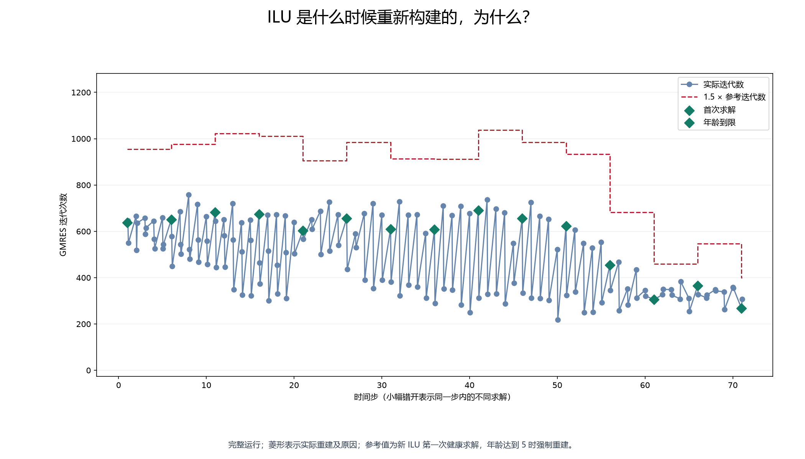
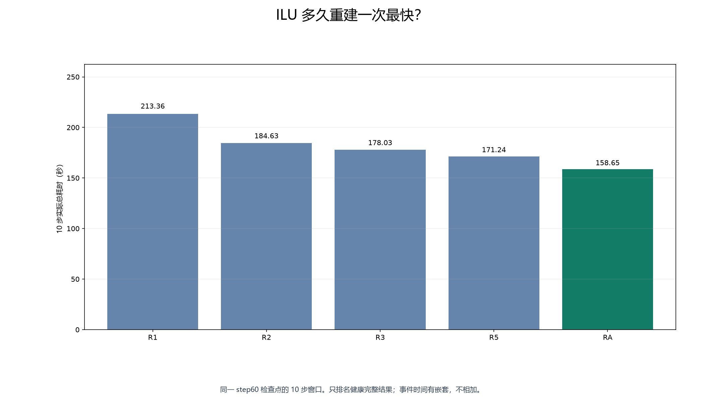
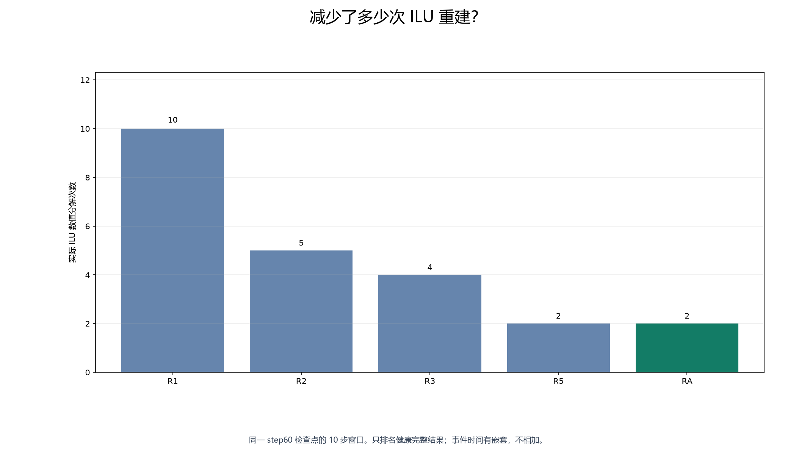
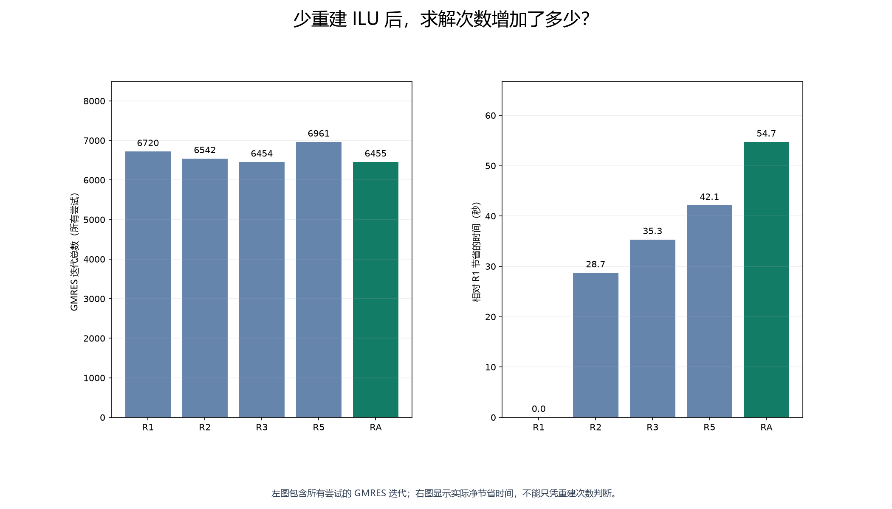
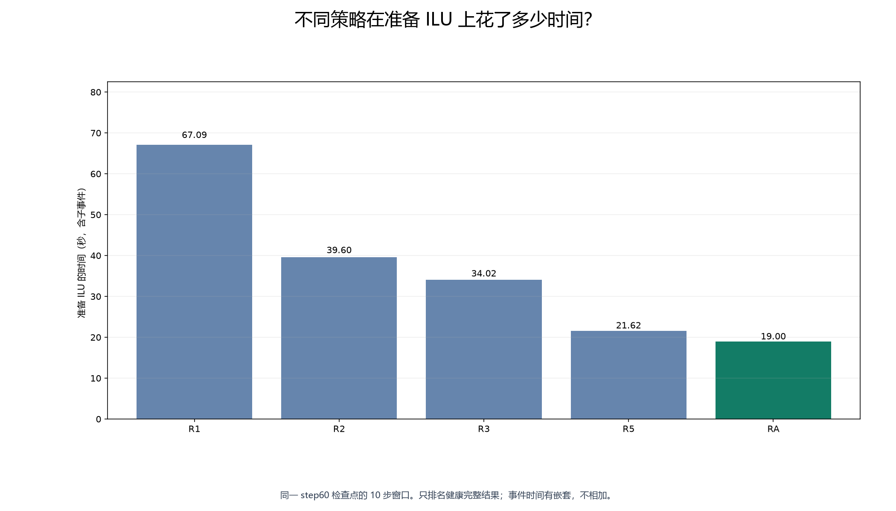
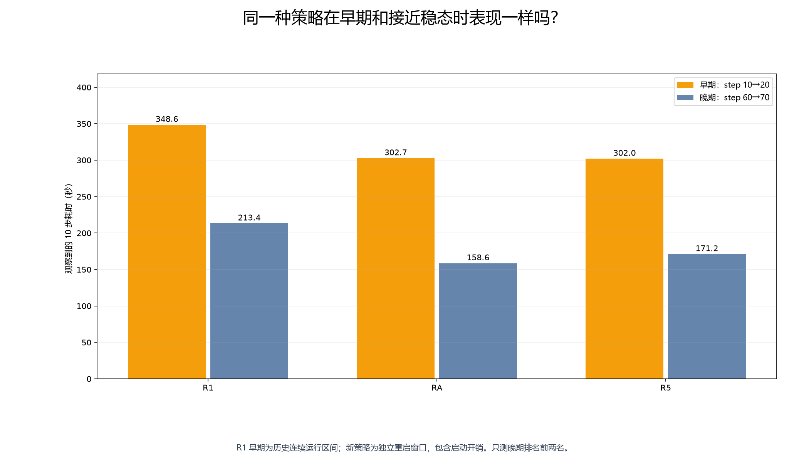
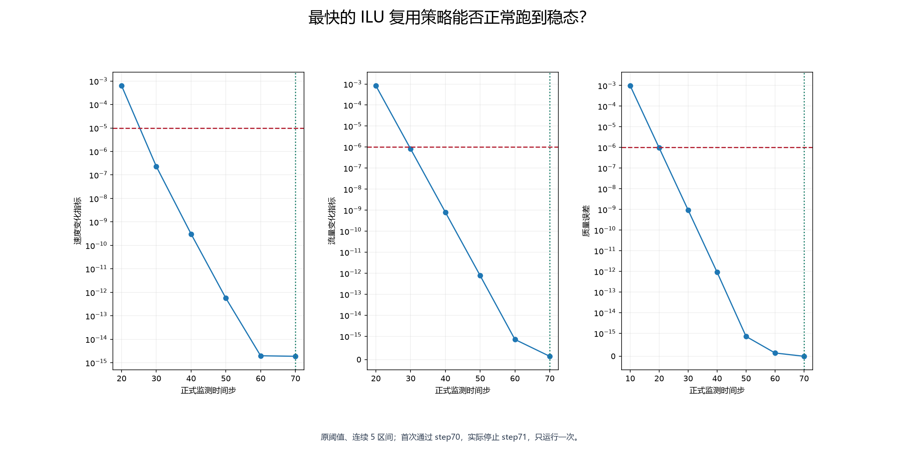
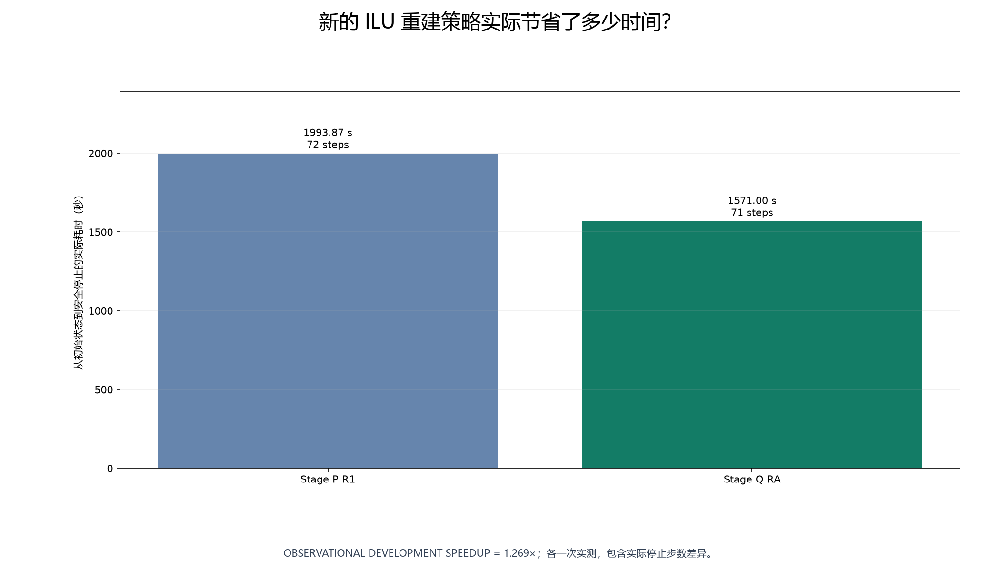

# Stage SV1.3Q — ILU 到底多久重新构建一次最快？

本阶段状态：**ILU_REBUILD_POLICY_WINNER_FOUND**。只改变原 ASM overlap2 + ILU(2) 的重建时机，保留 Stage P 作为回退。

## 为什么不需要每一步都重新做 ILU？

相邻时间步的方程通常相似，因此可以保留上一份 ILU。收益取决于少做分解省下的时间，能否抵消旧 ILU 造成的额外 GMRES 迭代。本阶段只根据实际完整窗口时间判断。

PETSc 提供正式的 [KSPSetReusePreconditioner 接口](https://petsc.org/release/manualpages/KSP/KSPSetReusePreconditioner/)。原有 KSP/PC 对象持续保留，矩阵值照常更新，只有重建标志变化。

## 当前基线是什么？

R1 即 Stage P：每个时间步第一次求解重建，步内继续复用。历史晚期窗口为 **213.355802 秒**，6720 次迭代、20 次 KSP 求解、10 次实际数值分解。本阶段没有重跑 R1。

R1 早期基线从唯一历史完整运行的 step10 最后一轮日志到 step20 最后一轮日志直接提取：**348.6 秒**、15379 次迭代。它是连续运行区间，日志时间有有限分辨率；新策略是独立重启窗口，含启动开销。因此早期比较是带此限制的开发观测，不能当成完全对称的正式基准。

所有运行保持 1 MPI rank、1 RTX4090、OMP=1、PETSc 3.25.5、CUDA 13.2、real double、32 位索引。GMRES 右预条件、restart100、rtol1e-10、atol1e-24、max_it2000 和对角缩放不变。网格、物理、边界条件、时间步、非线性及稳态阈值不变。

晚期均使用原 Stage N step60 原生检查点；早期使用验证通过的 Stage P step10 原生检查点。同一窗口的起始检查点 SHA256 完全相同。检查点不包含 ILU，因此启动后第一次实际求解必须重建；间隔从该步开始计数。

| 策略 | 最多 3 步早期 smoke | 健康晚期 10 步时间 / 秒 | 全部尝试迭代数 | 实际分解次数 |
|---|---|---:|---:|---:|
| R1 每步重建 | 已有 Stage P 验收 | 213.36 | 6720 | 10 |
| R2 | PASS，122.22 秒 | 184.63 | 6542 | 5 |
| R3 | PASS，116.47 秒 | 178.03 | 6454 | 4 |
| R5 | PASS，117.56 秒 | 171.24 | 6961 | 2 |
| RA | PASS，115.11 秒 | 158.65 | 6455 | 2 |

## 每2步重建怎么样？

晚期 10 步实测 **184.634245 秒**，全部尝试共 6542 次迭代，实际 ILU 分解 5 次、复用 15 次。平均迭代 327.10，最大 365。线性/非线性失败均为零。

## 每3步怎么样？

晚期 10 步实测 **178.028730 秒**，全部尝试共 6454 次迭代，实际 ILU 分解 4 次、复用 16 次。平均迭代 322.70，最大 384。线性/非线性失败均为零。

## 每5步怎么样？

晚期 10 步实测 **171.238515 秒**，全部尝试共 6961 次迭代，实际 ILU 分解 2 次、复用 18 次。平均迭代 348.05，最大 421。线性/非线性失败均为零。

## 自动判断什么时候重建怎么样？

RA 每次新建 ILU 后，以第一次健康求解的迭代数作为参考。复用时若本次迭代数严格超过参考的 1.5 倍，下一次线性求解就重建；年龄等于当前时间步减去上次重建步，达到 5 时也强制重建。规则在运行前固定，未扫描阈值。

若旧 ILU 的求解原因为负或达到迭代上限，只重建并重试同一个线性问题一次。第一次失败及其原因、迭代数始终保留。恢复发生在把修正量交回血流求解器之前，原 RHS 从设备副本恢复，零初值和矩阵不变。PETSc 原有 diagonal_scale_fix 在返回时恢复矩阵缩放。参见 [KSPSolve 文档](https://petsc.org/release/manualpages/KSP/KSPSolve/) 与本机固定版本源码审计。

RA 实际晚期窗口结果为 PASS，耗时 158.648342 秒，迭代 6455，分解 2 次，成功恢复 0 次。

实际重建原因：第一次求解 1 次，年龄到限 1 次，迭代增长 0 次，旧 ILU 失败 0 次。

本窗口没有触发迭代增长或失败恢复，RA 实际上采用了与 R5 相同的重建步序。二者一次运行的时间差不能证明自适应规则本身更优。

独立 GPU 合成故障算例使用同一生产头文件，验证了 RHS 恢复、一次 fresh 重试成功，以及 fresh 重试仍失败后停止。它不属于 CFD，也不参与性能排名。测试程序初次遗漏已冻结的 MPI 选项、第二次使用了旧版上下文清理调用；这些原日志均保留，修正只涉及测试程序，最终完整退出成功。

## 哪一种策略最快？

晚期排名前两名为 RA、R5。按健康的早期与晚期两个窗口总时间，最快为 **RA**：晚期 158.648342 秒，早期 302.739226 秒，总计 **461.387568 秒**。相对 R1 的 561.955802 秒，预计节省 **17.90%**。

## 为什么它最快？

| 策略 | 分解次数 | 少一次分解对应净节省 / 秒 | 每少一次分解增加迭代 | 准备 ILU / 秒 | 使用 ILU / 秒 | KSP 求解 / 秒 | MatMult / 秒 | 观察到的显存 / MiB |
|---|---:|---:|---:|---:|---:|---:|---:|---:|
| R1 | 10 | — | — | 67.09 | 84.92 | 94.58 | 3.59 | 3832 |
| R2 | 5 | 5.74 | -35.60 | 39.60 | 82.80 | 92.52 | 3.68 | 3836 |
| R3 | 4 | 5.89 | -44.33 | 34.02 | 81.67 | 91.06 | 3.49 | 3836 |
| R5 | 2 | 5.26 | 30.12 | 21.62 | 88.09 | 98.26 | 3.76 | 3832 |
| RA | 2 | 6.84 | -33.12 | 19.00 | 81.50 | 90.52 | 3.38 | 3836 |

表中“每少一次分解”是两次完整运行差值的描述，不是独立因果测量。准备时间采用包含子块分解的 PCSetUpOnBlocks；MatLUFactorNum、PCSetUp 及其他原始事件详见验收 JSON。事件可能嵌套，不能相加充当 wall。显存是设备级离散采样最大值，不是进程精确峰值。

## 早期 transient 和接近 steady 结果一样吗？

只对晚期前两名运行 step10→20。早期耗时比历史 R1 高超过 5% 时，按预先固定的“明显慢于基线”规则排除；任何不健康结果也排除。其余候选不补跑早期窗口。

| 策略 | 早期时间 / 秒 | 晚期时间 / 秒 | 早期迭代 | 早期分解 | 恢复 | 健康 |
|---|---:|---:|---:|---:|---:|---|
| RA | 302.74 | 158.65 | 15286 | 2 | 0 | PASS |
| R5 | 302.02 | 171.24 | 15280 | 2 | 0 | PASS |

## 如果 adaptive 最好

RA 在本次两个窗口总时间中胜出。逐次轨迹完整记录年龄、参考值、当前迭代、比值及重建原因；完整运行同样保留这些字段。

## 最终完整血管计算怎么样？

RA 按两个窗口总时间胜出且达到至少 10% 收益门槛，因此只对该优胜策略从 t=0 运行一次 `REAL_VASCULAR_GPU_ILU_REUSE_WINNER`。完整耗时 **1571.003470 秒**；首次连续 5 个正式区间达标为 **step70**，实际原生安全停止为 **step71**。

KSP 共 161 次尝试，78874 次迭代；ILU 分解 15 次、复用 146 次。未恢复的线性失败 0，非线性失败 0，已恢复尝试 0。最终速度和压力有限、质量门槛通过、壁面无滑移通过，final VTU 和原生 checkpoint 已由独立过程重新读取。

停止检测时间戳 1789869056.654399，请求时间戳 1789869058.634684，求解器确认时间戳 1789869063.394504（Unix 秒）。检测使用 WSL 时钟，请求和确认使用远端时钟，时钟探测见 `clock_probe.json`。请求到原生确认耗时 4.760 秒。

完整运行重建原因：首次求解 1 次，年龄到限 14 次，迭代增长 0 次，旧 ILU 失败 0 次。逐时间步、逐次求解记录见 `adaptive_timestep_history.json`；未在真实 CFD 中触发的分支不宣称具有实测性能收益。

原 production SteadyStopMonitor 和全部阈值未改。小改动仅将 VTU 与 checkpoint 合并压缩传输、将停止请求提前到判定后立即发出，并在原生确认处写一个时间戳。允许完成当前在途步和最终输出，没有额外补跑，也没有扣除停止延迟来美化耗时。

## 相对 Stage P 快多少？

Stage P 为 1993.867926 秒，本次为 1571.003470 秒，实测用时比 **1.2692×**，节省 **21.21%**。标签：**OBSERVATIONAL DEVELOPMENT SPEEDUP**。包含真实停止步数差异，不是重复运行统计。

CPU/GPU 科学等价验证继续推迟；没有 CPU benchmark、multi-rank、多 GPU、FieldSplit、网格收敛或粒子耦合。Stage P winner 和 CPU production 保留。

本阶段测试 20 通过、0 失败、0 跳过；完整测试 505 通过、8 项历史失败、65 跳过。历史失败集合未变。pytest 只读取已有 artifact，不运行 CFD。

复查入口：`REPRODUCIBILITY.md`、`reference_freeze.json`、`source_patch.json`、逐次验收文件、原始日志、`preservation_audit.json`、`native_artifact_mirror.json` 和最终 `delivery_manifest.json`。
