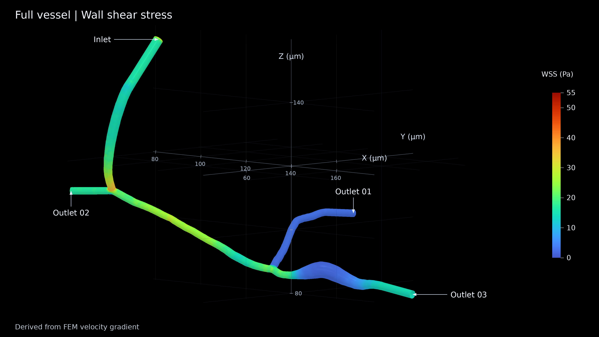
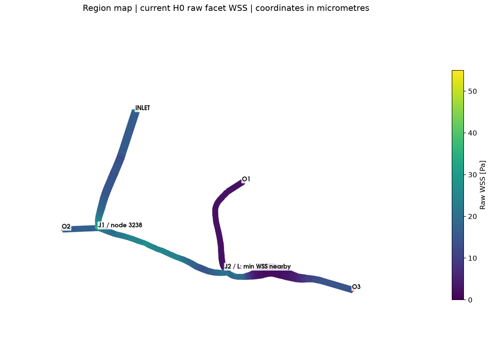
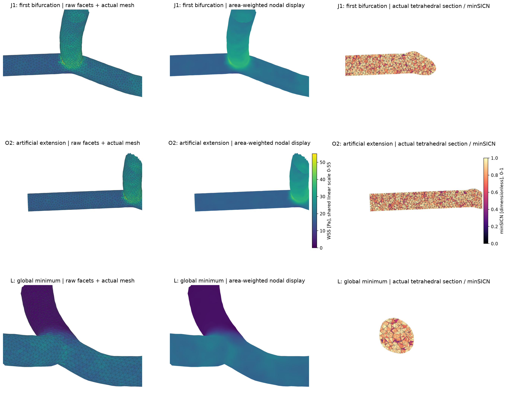
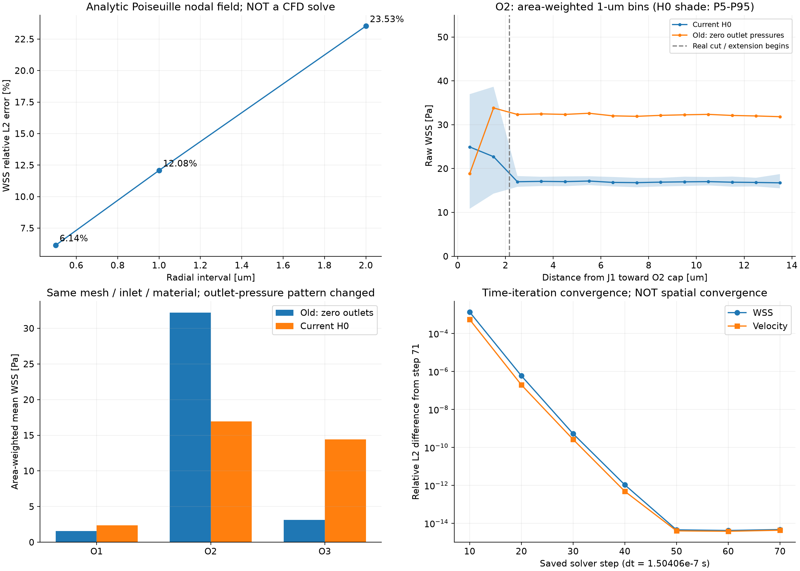

# 当前小鼠微血管 WSS 代码与数值审核报告

审计日期：2026-09-27。对象：`mean-2p0-mmps-A-H0-pressure-v1` 第 71 步、当前 `rotate_visualization` WSS 图。审计方式：读取源码、复算现存解、运行解析场及管网验证、复用同网格旧 BC 解、只读核对服务器。未修改正式源码、配置、几何、网格、流场或图片；没有启动新的 3D CFD 求解。

## 1. 通俗结论（不超过 500 字）

当前 WSS 确实来自 FEM 速度梯度，不是管网经验公式或合成场。原计算代码复算后，面片值与显示值均逐数值一致；未发现公式、单位、端口编号、压力符号或数据错配。发现一项明确的工程问题：正式 WSS 重算入口依赖的脚本已缺失，本轮从 Git 找回哈希一致的副本完成审计。

现有图并不能证明 WSS 定量准确。P1 四面体无专门边界层，梯度为单元常数；解析圆管的三档离散仍分别低估 23.53%、12.08%、6.14%。实际出口延伸段比圆管尺度估算低约 11.5%–13.2%，支持进一步检查近壁精度，但不能直接当作真实血管误差。第一分叉内为 2.76–46.52 Pa；全局最低值在第二分叉，未与最差单元重合。流量分配可解释 O1 比 O2 低，但不能证明所有斑块均属物理现象。当前图可用于描述此离散模型；局部峰值、低值区面积等尚不宜当作已验证的生理定量结果。

## 2. 审计对象、版本与实际计算链路

### 2.1 路径、软件及证据范围

为避免同名配置混淆，下文使用以下路径代号；代码快照已随报告保存，审阅者无需访问整个项目即可阅读核心实现。

| 代号 | 绝对路径及作用 |
|---|---|
| C | `/home/lzy/projects/formal_3D_flow_solver/FEM_SimVascular`：当前网格与可视化项目 |
| F | `/home/lzy/projects/ulm_flow_mean_2p0_mmps/formal_3D_flow_solver/FEM_SimVascular`：冻结流场算例与历史求解支持 |
| H | `F/flow_cases/mean-2p0-mmps-A-H0-pressure-v1`：本次审核的新 BC 流场 |
| O | `F/flow_cases/mean-2p0-mmps`：相同网格、三个出口零压力的旧对照解 |
| N | `/home/lzy/projects/ulm_3D_vascular`：vascular A、ROI、1D/0D 管网与 H0 边界生成 |
| V | `C/rotate_visualization`：当前 WSS 数据准备及渲染入口 |
| A | `C/wss_audit`：本报告及全部诊断产物 |

实际软件为 **SimVascular 的 TetGen 网格接口 + svMultiPhysics 流体 FEM + PETSc 线性求解 + NumPy/PyVista/VTK 后处理**，并非把所有步骤都交给同一个软件。流体使用线性 TET4、等阶 P1/P1 稳定化离散；冻结声明为 P1/P1 + VMS，`fluid.cpp` 内可见速度细尺度、压力梯度和 `tauM` 稳定项。未见当前算例改用 P2/P1。

本地求解器源码标识 `March_2025-99-gc3f0bb8-dirty`，不是干净官方发行版。构建记录给出 PETSc 3.25.5、CUDA 13.2、单 MPI rank；实际日志为 `seqaijcusparse`/`seqcuda`。不能把本地 Git 描述当作完整构建证明；本次另外核对服务器实际可执行文件 SHA256，与冻结构建记录相同。相关源码快照见 [冻结求解器源码](evidence/source/solver_frozen/)，构建记录见 [solver_build_from_git.json](evidence/solver_build_from_git.json)，当前数值环境见 [versions.json](evidence/versions.json)。

当前审计数值环境：Python 3.13.11、NumPy 2.5.3、SciPy 1.18.1、PyVista 0.49.0、VTK 9.7.0。原样式渲染使用已有 Particle Python 环境中的 imageio-ffmpeg 0.6.0；未安装依赖。网格使用官方 SimVascular 2023.05.31 分发的 `sv.meshing.TetGen`（嵌入 Python 3.5.5、VTK 8.1.1；未单独查明其中 TetGen 库版本），生成记录为 66.41 s、尺寸因子 1.0。[网格生成记录](evidence/mesh/generation.json)

### 2.2 从当前图片反向追踪

| 环节 | 实际输入、函数与行号 | 输出与实际行为 |
|---|---|---|
| 几何入口 | `C/inputs/fem_reference/exterior_surface.npz`；[prepare_surface.py](evidence/source/prepare_surface.py) 15–28 行 | 读取 `points_m/triangles/facet_tags`，无坐标变换写 `model/source.vtp`；初始表面 33,875 点、67,746 三角形，之后由网格器重划分 |
| 模型导入 | [import_surface_model.py](evidence/source/import_surface_model.py)；[geometry_import.json](evidence/mesh/geometry_import.json) | PolyData 模型，面 ID 1–5，单位 m；原表面到网格的既有几何 QC 保留，本轮不重新构造影像或 ROI |
| 四面体生成 | [generate_tetra_mesh.py](evidence/source/generate_tetra_mesh.py) 23–47 行 | TetGen；`global_edge_size=3.917947590640251e−7 m`；表面和体网格同时生成；无 MMG、无棱柱边界层 |
| 网格准备 | [audit_mesh.py](evidence/source/audit_mesh.py) 55–85 行；[geometry.py](evidence/source/geometry.py) 7 行 | 从实际四面体提取唯一外表面、确定外法向、映射面标签；保存 solver mesh、NPZ、`GlobalNodeID` |
| 管网 → BC | [idealized_h0.py](evidence/source/idealized_h0.py)、[extension_transfer.py](evidence/source/extension_transfer.py) 73–93 行、[fem_h0_case.py](evidence/source/fem_h0_case.py) 12–69 行 | 1D 阻力网络决定出口压力；延伸段压降修正后统一平移；只修改三个出口 XML 值，不生成 3D 速度或 WSS |
| 求解 | [H0 solver.xml](inputs/H0/solver.xml)；[solve_a_h0_fem_remote.py](evidence/source/solve_a_h0_fem_remote.py) 29–65、89–104 行 | 对实际流体方程求解，零初始状态，PETSc 参数经环境传入；第 70 步满足停止监测后写 STOP_SIM，最终落盘第 71 步 |
| 冻结解 | `H/run/1-procs/result_071.vtu` → `H/frozen_flow/steady_flow_mean_2p0_mmps_A_H0.vtu`、`flow_arrays_si.npz` | 速度、压力均为节点字段；XML 没有要求保存原生 WSS |
| WSS 恢复 | [prepare_surface_data.py](evidence/source/prepare_surface_data.py) 12–47 行调用 [compute_field_diagnostics.py](evidence/source/compute_field_diagnostics.py) 42–97 行 | 对 WALL 面片的唯一相邻四面体求 P1 速度梯度，再算切向黏性牵引力；面片模长与节点显示模长分别保存 |
| 绘图 | [render_surface_fields.py](evidence/source/render_surface_fields.py) 19–26、57–68、130–141 行 | 选择节点字段 `WSS_display_Pa`，0–55 Pa 线性色标；几何乘 10⁶ 仅用于 μm 坐标显示；固定 Z 轴旋转 |

图像入口的核心依赖 `F/scripts/flow_2mmps/compute_field_diagnostics.py` **当前不存在**。从 Git 提交 `fab4cf0eb3c8f8ad1ce40dfe995181c147cb9a9d` 恢复到 A 内，SHA256 为 `efa12e218bcaf99ba07db7194d3b8da79251da709c0a54a97ad6f6179be6e438`，与当前 [COMPUTE_VALIDATION.json](inputs/display/COMPUTE_VALIDATION.json) 记录完全相同。只导入该文件的实际函数，没有运行其会写旧 case 的 `main()`，没有在正式目录恢复或修补文件。

### 2.3 数据对应与会议版本限制

**已运行验证：**H 原始第 71 步、H 冻结 VTU、V 打包 VTU 的 SHA256 全为 `064cbd28f3efa72f426fc946b2f29da21f056c596609095e7283d39070aa55f4`。三者速度、压力与 NPZ 逐值相同；原生 `stFile_071.bin` 解码后的速度和压力也逐值相同。当前 C 网格 NPZ 与 H 的点、四面体、边界及标签逐值相同。旧/新 BC 的上述网格数组亦相同。

一个容易误判的细节：求解 VTU 中每个四面体的前两个局部顶点与正向 NPZ 顺序互换，**原单元次序及各单元节点集合一致**。审计已比较每个单元的排序节点集合，不是将局部顺序差异误判为解错配。生产 WSS 明确使用 NPZ 正向单元求梯度；壁面原始节点 ID、三角形连接、父单元 ID、全局面 ID 均与显示 VTP 对应。

**基线计算复现：**45,221 个原始面片 WSS 最大绝对差 = **0 Pa**；节点显示值最大绝对差 = **0 Pa**。独立 4×4 仿射求解对全部 371,402 四面体梯度的最大差为 **1.364×10⁻⁹ s⁻¹**。无无效/NaN/零权重壁面点。[完整数值证据](data/baseline_validation.json)

**基线图像复现：**使用当前原渲染类、数据、相机和 0–55 Pa 色标重新生成 3840×2160 图；与当前保存的 4K PNG 平均通道绝对差 **7.23×10⁻⁷ /255**，约 18 个像素存在至少一个通道差异，属于极小渲染差异。见图 1 和 [render_reproduction.json](data/render_reproduction.json)。

会议使用的原始 WSS 图片或文件哈希未提供，不能证明会议展示正是该 H0 版本。尤其旧全零出口解的 O2 分配为 85.21%，当前为 44.82%，两者图像本应明显不同。此前对话中彩色 `mesh-complete.exterior.vtp` 截图也不能当作本次会议 WSS 图。本报告复现的是**当前磁盘文件**。



## 3. WSS 定义、实现与单位

### 3.1 流体模型和实际公式

模型为不可压缩、常黏度牛顿流体、刚性无滑移壁；未耦合 RBC 或微泡对流场的反作用。当前输出为最终第 71 步的壁面切向黏性牵引力向量及其**模长**。它是稳定后的单时刻结果，**不是 TAWSS、不是平均剪切向量模长，也不是脉动时间平均**。18 秒动画仅旋转相机，不代表 18 秒物理演化。

以下是恢复的生产代码核心内容，未为验证另写替代公式（恢复文件 42–45、77–88 行；模长取值见包装器 40–43 行）：

```python
def p1_gradients(points, tetra, velocity):
    x = points[tetra]
    u = velocity[tetra]
    return np.swapaxes(np.linalg.solve(x[:, 1:] - x[:, :1],
                                      u[:, 1:] - u[:, :1]), 1, 2)

def tangential_traction(gradient, normal, viscosity):
    traction = viscosity * np.einsum(
        'nij,nj->ni', gradient + gradient.swapaxes(1, 2), normal)
    return traction - np.einsum('ij,ij->i', traction, normal)[:, None] * normal

magnitude = np.linalg.norm(traction, axis=1)
```

令 `G[i,j]=∂u_i/∂x_j`，代码就是

\[
\boldsymbol\tau_w=(I-\mathbf n\mathbf n^T)\,\mu(G+G^T)\mathbf n,
\qquad WSS=\|\boldsymbol\tau_w\|.
\]

P1 速度在四面体内仿射，因此该梯度对**当前离散速度**是精确的，但不保证接近连续物理场的壁面导数。程序使用壁面三角形所属四面体的内部速度信息，不是对壁面零速度做表面差分。壁上三个节点为零时，第四个内部节点仍提供法向变化；本次没有“四个节点全部是墙面节点”的四面体。

法向来自三角形叉积归一化，并按面重心到父四面体重心的方向翻到流体外侧（代码 64–76 行）。单位法向误差 ≤3.33×10⁻¹⁶；`tau·n` 最大误差 1.07×10⁻¹⁴ Pa。翻转法向使剪切向量反号、模长不变，解析测试实测两者模长差为 0。

压力项 `−pI` 的切向投影对单位法向为零，代码没有把压力或总牵引力当 WSS。没有把速度模长梯度、某一坐标分量或涡量当 WSS；没有遗漏转置项或切向投影。原生 svMultiPhysics `post.cpp` 也计算对称黏性应力，并采用相反剪切向量符号约定；其节点恢复方式并不等同本后处理，本报告**没有声称与原生 WSS 节点输出逐值相同**。

只对 `facet_tags == 1` 的 WALL 面片计算；483 个入口/出口人工截面面片被排除。**人工延伸段的侧壁仍属 WALL，正常参与 WSS**，不可混同“排除出口截面”与“排除所有延伸段”。

### 3.2 显示映射

显示节点值为相邻面片**模长**的面积加权平均：

\[
w_i=\frac{\sum_{f\ni i}A_f\|\tau_f\|}{\sum_{f\ni i}A_f}.
\]

这是明确的空间平均，不是矢量平均，也不是时间平均。`nodal_average` 为无关联节点初始化零，但输出表面仅保留真实 WALL 节点；本次所有输出节点权重 >0，故没有缺失值被补零后进入图像的问题。原始值为 cell data `WSS_raw_Pa`；渲染使用 point data `WSS_display_Pa`，随后三角形内线性插值。

无几何平滑滤波、无阈值筛选、无归一化或物理标量裁剪。存在面积平均和 `smooth_shading=True` 光照法向平滑；后者会影响视觉明暗，不改变 WSS 数组。固定 0–55 Pa 色标的最低颜色覆盖非零低值。原始最大值 46.520 Pa 经显示映射变为 41.933 Pa，原始最小值 0.415 Pa 变为 0.697 Pa：不能直接在图上读取原始峰值，更不能将深色看成严格零值。

### 3.3 实际单位与来源

| 量 | 实际值/单位 | 来源及检查 |
|---|---|---|
| 原始 SWC 坐标 | raw voxel × `[1,1,2]` → μm；半径原值为 μm | `N/network_1d0d/swc_graph.py` 49–52、`case_audit.py` 320–321；这是保存的校准约定，本轮未重新校准原始影像 |
| 管网、FEM 几何 | μm ×10⁻⁶ → m；FEM 输入字段 `points_m` 已为 m | 管网保存图、端口坐标及实际网格相符；表面适配阶段不重复缩放 |
| 速度 | m/s；入口平均 0.002 m/s = 2 mm/s | H policy；实际最大 0.00707066606 m/s |
| 流量 | m³/s；入口 1.551359160440232×10⁻¹⁴ | 面片积分；转换到 μL/min 乘 6×10¹⁰，即 9.30815496264×10⁻⁴ μL/min |
| 时间 | s；FEM dt=1.5040600916882215×10⁻⁷ s | H solver.xml 第 7 行；终态 71dt=1.06788266510×10⁻⁵ s。微泡 dt=1 ms 不是这个 FEM 时间步 |
| 密度 | 1056 kg/m³ | H solver.xml 第 44 行 |
| 运动黏度 | 3.27×10⁻⁶ m²/s | 参考物性与 H policy，nu=mu/rho |
| 动力黏度 | 0.00345312 Pa·s = 3.45312 mPa·s | rho×nu；H XML、管网常量和 WSS 包装器一致；未将 nu 直接代入剪切应力 |
| 梯度 | (m/s)/m = s⁻¹ | 先在 SI 坐标上求梯度，再做绘图缩放 |
| 压力、WSS | Pa | 当前压力节点范围 −1.8581 至 4985.0809 Pa；WSS 无额外压力单位换算 |
| 绘图坐标 | μm | 仅网格坐标乘 10⁶，WSS 字段仍为 Pa |

需特别注意：`C/configs/reference_physics.yaml` 仍含较早参考流量 `2.7369132390905703e−15 m³/s`，**不是当前 H0 实际入口**。本轮按 H 的 XML、运行日志和最终积分判断生效配置，没有使用顶层同名参考配置推断实际算例。包装器第 38 行硬编码黏度恰好正确，但未来换材料后可能失配，应最小化改为读取已锁定的 case XML 并断言一致。

## 4. 边界条件、压力参考与流场质量

### 4.1 端口实际位置

标签固定映射：1=WALL、2=O3、3=O1、4=INLET、5=O2。下面坐标为实际 FEM cap 的面积重心，单位 μm；与原 ROI 切面不同，因为有人工延伸段。

| 边界/区域 | x | y | z | 标记及说明 |
|---|---:|---:|---:|---|
| INLET | 103.67291 | 57.55505 | 158.80568 | tag 4 |
| O1 | 113.72258 | 133.77179 | 99.20543 | tag 3 |
| O2 | 79.43402 | 43.18361 | 110.42968 | tag 5 |
| O3 | 176.56096 | 97.10021 | 81.04118 | tag 2 |
| J1 第一分叉 | 92.00000 | 49.00000 | 111.00000 | SWC 3238；从真实入口沿 ROI 图走 40.556 μm 后遇到的第一个度≥3 节点 |
| J2 第二分叉 | 130.04000 | 82.04000 | 87.18000 | SWC 3274；沿图距真实入口 99.016 μm |

J1 是通过 ROI 图拓扑识别，非仅凭绘图中“branch focus”的变量名猜测。详见 [regions.json](data/regions.json)、随附 [ROI 端口映射](inputs/network/roi_ports_in_a.json)。图 2 的 J2/L 对应全局最低值所在的第二分叉邻域。



### 4.2 真正生效的边界

入口是 `Dir + Steady + Flat + Impose_flux=true + Zero_out_perimeter=true`，负值表示相对于流体外法向流入。它不是处处抛物线入口。壁为零速度 Dirichlet。出口为稳态 Neumann 压力牵引，不是将全部出口节点压力强制设成同一数值。

| 边界 | XML 实际值 | 实测流量 m³/s（入口列正向流入量） | 占入口流量 | 表面节点压力面积平均 Pa |
|---|---:|---:|---:|---:|
| INLET | −1.551359160885543×10⁻¹⁴ m³/s | 1.551359160440232×10⁻¹⁴ | 100% | 4955.97637 |
| O1 | +585.2864332598318 Pa | 1.0147168098399344×10⁻¹⁵ | 6.540825% | 586.78264 |
| O2 | +2932.0152710782013 Pa | 6.953210612489333×10⁻¹⁵ | 44.820122% | 2943.31675 |
| O3 | 0 Pa | 7.545664182073052×10⁻¹⁵ | 48.639054% | 8.93877 |
| WALL | u=0 | 法向通量为零 | — | — |

[boundary_values.csv](data/boundary_values.csv) 同时保留旧 BC 值及 μL/min 转换。墙面节点最大速度为严格 0；整体质量误差按现有积分的双精度求和为 0，相对目标入口误差 2.87046×10⁻¹⁰。该 0 是数值求和结果，不是无限精度守恒声明。出口面片平均法向速度未出现倒流；未据此宣称域内绝无局部回流。

压力符号通过冻结源码核对：`set_bc.cpp` 1610 行 `h(0)=lBc.g`，1638 行 `hg(Ac)=-h(0)*lBc.gx(a)`，`fluid.cpp` 69 行 `hc=h*nV`。正 XML 压力对应 `−P n` 牵引，**不需要再手工取负**。实际服务器 XML SHA 为 `b9139cef...01eb43`，与本地 H 和冻结 manifest 一致，排除了仅改本地配置但服务器仍用旧 XML 的情形。[服务器核对日志](logs/server_hashes.log)

出口节点平均压力与设置值差 1.4962、11.3015、8.9388 Pa，并非“压力值应当逐节点等于 BC”。不过，也不能只用“有黏性正应力”就完全解释这些差：直接 P1 梯度计算的出口平均法向黏性应力约 −0.0538、−0.6825、−0.5796 Pa，不能抵消全部差值。弱形式边界、稳定化及离散恢复使点值牵引未必精确；本轮没有重组边界弱残量作进一步证明。该差异作为局部精度待验证项保留，不能据此倒置压力符号。[cap_traction_check.csv](data/cap_traction_check.csv)

### 4.3 管网初值、延伸段修正和压力平移

本轮实际重新求解了 7,422 节点、7,421 边的 H0 管网。结构源节点 2410 设单位压力 1 Pa，其他 122 个结构叶端设 0 Pa；这是一项明确的模型假设，未被血压测量验证。每段采用线性变半径阻力：

\[
R_e=\frac{8\mu}{\pi}\int_0^{L_e}\frac{ds}{r(s)^4}
=\frac{8\mu L_e}{\pi}\frac{r_0^2+r_0r_1+r_1^2}{3r_0^3r_1^3},\quad
Q_{ij}=\frac{p_i-p_j}{R_{ij}},\quad\sum_jQ_{ij}=0.
\]

代码由 conductance matrix 构建后用 SciPy `splu` 求内部节点压力。单位源压得到 ROI 入口流量 `2.9684572242588213e−18 m³/s`；为匹配 `1.551359160440232e−14`，压力乘 `5226.146254566908`，因此源压为 5226.1463 Pa。重算压力及边流量与保存的 H0 数组最大差均为 **0**。[network_reproduction.json](data/network_reproduction.json)

人工延伸段使用当前表面的 40 个闭合截面等效圆半径积分估计阻力，端部半格采用最近半径。真实切面的压力转成 FEM cap 压力：`p_cap_raw=p_real−R_ext*Q_outward`；之后所有出口减去同一个最小值。

| 出口 | 真实切面压力 Pa | 管网 Q m³/s | 延伸阻力 Pa·s/m³ | 压降 Pa | raw cap 压力 Pa | 最终压力 Pa |
|---|---:|---:|---:|---:|---:|---:|
| O1 | 342.341401 | 9.777176252×10⁻¹⁶ | 5.382667221×10¹⁶ | 52.627286 | 289.714115 | 585.286433 |
| O2 | 3065.607999 | 7.693191550×10⁻¹⁵ | 5.578504626×10¹⁶ | 429.165047 | 2636.442953 | 2932.015271 |
| O3 | 0 | 6.842682429×10⁻¹⁵ | 4.319538740×10¹⁶ | 295.572318 | −295.572318 | 0 |

统一加 `295.57231837550194 Pa` 的操作保持任意出口对压差，重算最大误差 4.55×10⁻¹³ Pa。在当前刚壁、常黏度、不可压缩、给定入口流量模型中，若所有出口压力和内部解压力同加常数，这只改变压力零点，不改变速度和 WSS。已对切向投影做代数数值验证，**未为压力平移再跑一遍 3D CFD**。

反之，延伸段各自减去不同 `R_ext Q`、以及从旧 `[0,0,0]` 换到新 `[585.286,2932.015,0]`，均改变出口之间压差，确实会改变流量分配。不得混同统一参考平移与相对压力调整。管网流量与最终 3D 流量并不完全相同：网络 O2 占比 49.5900%，FEM 为 44.8201%；这是固定压力的一次性下传，没有迭代使 1D/3D 支路流量一致。等效圆阻力及统一远端压力因此是模型适用限制，而非已证实的编码错误。

### 4.4 收敛与质量指标

实际 PETSc 环境覆盖 XML 中名义 `petsc-jacobi`：日志显示 GMRES restart 100、rtol=10⁻¹⁰、atol=10⁻²⁴、ASM overlap 2、子域 ILU fill 2、右预条件、对角缩放。160 次线性求解均有监测记录，无解析遗漏、失败求解、恢复重试或非线性失败信息；终步非线性 Ri/R0=6.33×10⁻¹⁵。监测 true residual 除以 `max(atol,rtol*r0)` 的最大比值 1.0017785：接近阈值并在原 1.01 审核容差内，但不能写成每次都严格 ≤1，也不是未缩放原方程的独立残差。[residual_solves.csv](data/residual_solves.csv)

日志 98455–98458 行有一项真实警告：`-skip_petscrc` 被报告为未使用。它不是线性求解发散记录；本轮以实际 KSP/PC 日志确认生效参数，没有声称日志无警告，也没有在本轮更改该选项。

对保存的 10、20、30、40、50、60、70、71 步实际重算 WSS。与第 71 步相比，面积 L2 相对差分别约 1.342×10⁻³、5.887×10⁻⁷、5.226×10⁻¹⁰、1.058×10⁻¹²、4.513×10⁻¹⁵、4.169×10⁻¹⁵、4.685×10⁻¹⁵、0。第 70/71 步面片最大差 5.47×10⁻¹³ Pa。说明该离散解已稳定；**不是时间步无关性、更不是空间网格无关性**。[time_convergence.csv](data/time_convergence.csv)

额外对全部四面体计算 `div(u)=trace(G)`：体积加权 RMS 178.59 s⁻¹；RMS(div)/RMS(G)=5.45%，最大绝对 div 为 5210.48 s⁻¹。等阶稳定化不可压缩 FEM 并不逐单元强制零散度；整体流量守恒不能掩盖该局部指标。没有统一阈值据此直接判失败，也不能将质量守恒良好写成局部场已精确。

## 5. 网格、可疑区域与未经显示加工的 WSS

### 5.1 网格是否具体坏在哪里

本轮重新计算所有四面体体积和项目定义的 minSICN，检查所有面连接数。70363 节点、371402 TET4、45704 外表面三角形，其中 WALL 45221。没有非正体积、面连接数>2或壁面多父单元；外表面个数与边界表一致。形状质量使用正则四面体映射的有符号逆 Frobenius 条件数 `3 sign(det J)/(||J||F ||J⁻¹||F)`，不套用别的软件通用阈值。

| 指标 | 实测 |
|---|---:|
| 全域 minSICN 最低 / P1 / P5 / 中位 | 0.15020 / 0.27904 / 0.47872 / 0.85251 |
| 壁面父单元最低 minSICN | 0.39452 |
| 全域所有四面体边长：最小 / 中位 / P95 / 最大 | 0.1442 / 0.3376 / 0.4619 / 0.6444 μm |
| 近壁对顶高度 3V/A：面积加权 P5 / 中位 / P95 | 0.2112 / 0.2616 / 0.3658 μm |
| 最小四面体体积 | 0.000572218 μm³ |
| 相邻壁面法向夹角：中位 / P95 / P99 / 最大 | 4.875 / 13.958 / 17.417 / 56.940° |

`h_wall_m=0.23717 μm` 出现在策略文件，但实际生成脚本只传了 `global_edge_size=h_ref_m`，**不能将 h_wall 当作已施加的第一层网格厚度**。没有棱柱边界层或高阶近壁梯度方法；实际对顶高度比出口半径约为 0.21–0.23 的量级。这是解析二次速度壁面导数的风险，单元形状好不能消除。

| 定位 | 坐标 μm | 面片 / 父四面体 ID（从 0 开始） | WSS / minSICN / 对顶高度 |
|---|---|---|---|
| 全局最小 WSS，J2 邻域 | (131.51855,82.22919,86.92281) | 20365 / 19674 | 0.41477 Pa / 0.97080 / 0.35029 μm |
| 全局最大 WSS，J1 邻域 | (91.30050,47.61557,111.98667) | 29659 / 110006 | 46.52024 Pa / 0.78394 / 0.20433 μm |
| 最低 minSICN 单元，入口至 J1 上游段 | (98.65808,42.07592,131.95373) | 非壁面父单元 / 189107 | minSICN=0.15020；距 J1 23.05 μm，距最近 <2 Pa 面中心 67.14 μm |

因此，**未找到“最差单元正好导致高/低 WSS 区”的证据**。低值区父单元 minSICN 最低 0.65777，中位 0.90232；第一分叉最低 0.66798。相邻法向变化可由曲率和三角化共同贡献，尚未用更光滑几何或更细网格分离两者。体网格剖面见图 3 右列，不应只看总单元数判断精度。

### 5.2 原始区域统计

分位数均按三角形面积加权；区域是明确坐标球或延伸段空间过滤，不是凭颜色手动裁选。<1、<2、>30 Pa 仅为本次诊断阈值，没有生理正常/异常含义。

| 当前 H0 区域 | 面片数 | 面积 μm² | 原始最小–最大 Pa | 面积平均 Pa | P5–P95 Pa |
|---|---:|---:|---:|---:|---:|
| 全 WALL | 45221 | 2024.191 | 0.415–46.520 | 12.5310 | 2.031–26.101 |
| J1 中心半径 5 μm | 2211 | 98.181 | 2.763–46.520 | 23.3055 | 15.320–35.787 |
| O1 人工延伸侧壁 | 1954 | 87.636 | 1.937–2.829 | 2.38975 | 2.239–2.547 |
| O2 人工延伸侧壁 | 1935 | 86.011 | 14.737–20.415 | 16.94059 | 15.923–18.129 |
| O3 人工延伸侧壁 | 2276 | 101.337 | 12.708–17.335 | 14.40993 | 13.578–15.288 |

全表面 <1 Pa 面积占 0.02656%，<2 Pa 占 4.56403%，>30 Pa 占 1.61674%；没有 WSS=0 的原始面片。J1 的 5 μm 球内没有 <2 Pa 面片。全网格共享边的邻接面片中，未找到一侧 <2 Pa、另一侧 >20 Pa 的直接相邻对；这只排查了共享边邻居，不排除较大空间尺度上高低区靠近。

邻接面片 WSS 差 P95=1.767 Pa、P99=3.217 Pa，最大 16.597 Pa 位于入口边缘附近；入口 Flat 与壁面零速度交汇可能形成发展/角点影响，不能拿该最大跳变代表真实分叉。J1 内存在明确跳变，例如面 17953/17956 在约 (90.91590,48.55931,112.10973) μm 附近，27.053/41.737 Pa，差 14.684 Pa，父单元 minSICN 为 0.807/0.759，面法向夹角仅 1.80°。这说明 P1 离散梯度的面间变化值得检查，不能全部归咎于法向几何折角，也尚不能将该局部峰值当作精确物理峰值。

完整面片坐标、面积、值及网格指标在 [wall_facets.csv](data/wall_facets.csv)，相邻跳变在 [largest_adjacent_jumps.csv](data/largest_adjacent_jumps.csv)，区域统计在 [region_summary.csv](data/region_summary.csv)。



图 3 前两列统一 0–55 Pa；右列为无量纲 minSICN 0–1，不能把右列颜色当 WSS。每行视角、平行投影尺度相同，取附近单元避免远处支路遮挡。剖面穿过所标区域中心；第三行穿过最低 WSS 面中心。图中的局部裁取仅用于诊断展示，统计始终使用未裁剪的原始数据。

## 6. 有判别力的验证及限制

### 6.1 解析场：调用原项目的实际函数

使用原文件的 `p1_gradients/boundary_owners/wall_geometry/tangential_traction/nodal_average/surface`，因此不是另写一套正确算法后自行验证。

| 验证 | 输入/理论 | 实际计算结果 | 判断 |
|---|---|---|---|
| 任意仿射三维场 | 非对称 G=100×[[1,2,3],[4,5,6],[7,8,9]] s⁻¹；4 个不同单位法向 | 梯度最大误差 1.14×10⁻¹³ s⁻¹；牵引误差 9.99×10⁻¹⁶ Pa | 本测试下张量方向、对称项和投影正确 |
| 刚体旋转 | 反对称速度梯度，理论 WSS=0 | 最大 2.19×10⁻¹⁶ Pa | 未把刚体旋转误计为剪切 |
| Couette | z=0 三墙节点零速；内部节点 u_x=1250z，理论 μγ=4.3164 Pa | 4.3164 Pa；误差 0 | 正确取到了内部法向梯度 |
| 反向法向 | n→−n | 向量之和为 0，模长差 0 | 法向符号与模长区分正确 |
| 压力投影 | 同一 G，p=0/295.5723/5000 Pa | 加压力后的切向差最大 5.53×10⁻¹³ Pa | 代数压力参考不进入切向剪切；不是 CFD 压力平移重算 |

Poiseuille 测试：R=4 μm、L=40 μm、平均速度 0.002 m/s、μ=0.00345312 Pa·s，Q=1.00530964915×10⁻¹³ m³/s，Δp=138.1248 Pa；理论 WSS=4μQ/(πR³)=ΔpR/(2L)=**6.90624 Pa**。圆柱三角剖分并沿轴向分层拆四面体，在节点赋值解析二次速度，墙面置零。取 0.2L<z<0.8L，实际面心采样位置记录在 CSV 中。

| 径向/周向/轴向划分 | 节点 / TET4 | 径向间距 μm | 算得面积平均 Pa | 相对面积 L2 误差 | 相对平均偏差 |
|---|---:|---:|---:|---:|---:|
| 2 / 16 / 4 | 165 / 576 | 2.0 | 5.281156 | 23.5307% | −23.5307% |
| 4 / 32 / 8 | 1161 / 5376 | 1.0 | 6.072199 | 12.0766% | −12.0766% |
| 8 / 64 / 16 | 8721 / 46080 | 0.5 | 6.482408 | 6.13694% | −6.13694% |

误差随细化约减半，说明代码正确计算 P1 场导数的同时，粗网格仍可能系统低估解析壁面导数。这个结果包含直线四面体与多边形圆柱近似误差；**未运行圆管 CFD，未验证实际求解器圆管速度场，也未证明真实分叉网格收敛**。最细档仍有 6.14% 误差，不标为“解析精度完全通过”。输入 NPZ 和壁面 VTP 均保存在 [validation_cases](validation_cases/)。[解析数值表](data/poiseuille_validation.csv)

### 6.2 实际延伸段的尺度对照

用实际 FEM 流量和实际 cap 等效半径计算 `4μQ/(πR³)`，只作近直管尺度对照：

| 延伸段 | 圆管尺度 Pa | 实际原始 WSS 面积平均 Pa | 相对差 |
|---|---:|---:|---:|
| O1 | 2.73262 | 2.38975 | −12.5472% |
| O2 | 19.50601 | 16.94059 | −13.1520% |
| O3 | 16.28278 | 14.40993 | −11.5020% |

三个方向一致，且近壁高度/半径约 0.2，与解析测试中一阶梯度低估的方向、量级相容。它们仍非严格圆管：半径来自 cap 等效面积，侧壁有多边形、细微变径、端部及分叉影响；**这些差不能直接用作原血管的真实误差或统一校正系数**。不建议将 WSS 整体乘一个系数修正。[extension_scale_check.csv](data/extension_scale_check.csv)

### 6.3 固定网格的 BC 情景对照

已复用两次真实求解结果，重新计算 WSS；实际 XML 对比除了三个出口 Value 文本外完全一致，O3 只是 `0.0→0`，数值不变。入口、材料、dt、网格和 PETSc 文件保持一致。

| 指标 | 旧全零出口 | 当前 H0 |
|---|---:|---:|
| O1/O2/O3 流量占比 % | 4.2579 / 85.2050 / 10.5371 | 6.5408 / 44.8201 / 48.6391 |
| 全壁面积平均 WSS Pa | 8.24677 | 12.53100 |
| O1 延伸平均 Pa | 1.55567 | 2.38975 |
| O2 延伸平均 Pa | 32.20676 | 16.94059 |
| O3 延伸平均 Pa | 3.12173 | 14.40993 |

全壁 WSS 变化的面积 L2 范数除以旧场范数为 72.557%。这证明**相对出口压力设置是重要的模型因素**；不是统一参考零点造成的变化。由于 O1 和 O2 压力同时不同，此处仅能归因于整组出口压力方案，不能独立判断某一个出口压力的因果贡献。单出口 ±1% 扰动没有执行；已给出独立副本准备脚本和后续运行命令，不把两状态比较写成完整局部敏感性曲线。

### 6.4 已执行与未执行总表

| 检查 | 本轮实际运行？ | 判定依据/结果 | 限制或未执行原因 |
|---|---|---|---|
| 生产公式、单元父子关系、单位、WALL/cap | 代码检查 + 数值复算 | 全场梯度、切向性、节点编号、法向验证；单位一致 | 不证明连续场精度 |
| 当前 WSS 数值和 4K 基线图 | 是 | raw/display 0 Pa 差；图像差极小 | 会议原图版本缺失 |
| H0 管网、压力下传、统一平移 | 是 | 压力/流量重现 0 差；压差保持到 4.55e−13 Pa | 结构端点压力假设未被实验验证 |
| 实际最终流量和无滑移 | 是 | εQ=2.87e−10；整体质量求和误差 0；墙速度 0 | 未做每条任意内部截面守恒检查 |
| 日志、实际参数、8 个保存时刻 WSS | 是 | 160 次线性求解；70/71 WSS 差≤5.47e−13 Pa | 没有不同 dt 结果，不能称 dt 无关 |
| 全域及局部网格质量 | 是 | 正体积、面连接、minSICN、对顶高度、邻法向及跳变 | 未重新网格化，不证明细度足够 |
| 仿射、旋转、Couette、法向/压力投影 | 是，调用生产函数 | 舍入误差量级或精确相等 | 属后处理验证 |
| 三档解析圆管节点场 | 是 | 误差 23.53→12.08→6.14% | 不是 CFD 共同验证或血管网格独立性 |
| 相同网格两种真实 BC 结果对照 | 是，复用既有解 | 流量和区域 WSS 明显响应 | 两个出口同时变化，仅整体情景对照 |
| 新的单出口扰动 CFD | 否 | 已给 ±29.32015 Pa 的 O2 方案 | 优先复用结果；原血管单次历史约 1675 s；不能伪称已得到导数 |
| 相同血管至少三档 CFD 网格 | 否 | 仅一档有效求解网格，两个 BC 使用的是同一档 | 需新网格、端口映射和多次完整求解；旧失败网格不能充当有效对照 |
| 圆管求解器+后处理共同验证 | 否 | 有解析赋值后的后处理测试 | 本轮未构建并求解独立圆管 BC 算例 |
| 原生 WSS/弱牵引恢复与当前方法对比 | 仅源码检查 | 原生输出符号约定不同；当前 XML 不输出 WSS | 需单独开启原生输出或装配恢复，不能据源码声称数值吻合 |
| 服务器当前文件身份 | 是，只读 SSH | binary/XML/result SHA 与本地记录相同 | 未重编译、未启动求解器 |



## 7. 问题与证据表

| 编号 / 对象 | 分类 / 影响 | 具体证据 | 判断与不确定性 | 最小措施及验证 |
|---|---|---|---|---|
| E01 重算入口断链 | **已确认错误**；高（复现性），尚无证据污染现有数值 | `prepare_surface_data.py:14–16` 指向缺失文件；Git 恢复文件 SHA 与生成记录相同；复算 0 差 | 是工程依赖缺失，不能扩大为“WSS 公式错误” | 恢复受版本管理的共享核心模块并显式导入；重算后与本审计逐值比较 |
| N01 近壁 P1 梯度 | **数值精度风险**；高 | 无边界层；对顶高度中位 0.262 μm；解析误差随细化下降；三出口尺度差 −11.5% 至 −13.2% | 当前未证明近壁解析充分，不能给原血管统一误差百分比 | 先三档同几何/BC 网格，固定恢复方法；比较区域面积均值、分位和低/高区位置 |
| N02 局部跳变/峰值 | **数值精度风险**；中高 | J1 面 17953/17956 差 14.684 Pa，法向仅差 1.80°；形状质量非极差 | P1 导数面间不连续有具体证据；物理梯度变化与离散误差未分离 | 加密 J1、J2、弯曲段；报告 raw 与 display；不要单纯平滑 |
| N03 局部不可压缩及牵引恢复 | **数值精度风险**；中 | RMS(div)/RMS(G)=5.45%；出口平均压力差不能仅由恢复法向黏性应力解释 | 稳定化弱解允许局部不满足强条件；未重组弱边界残量 | 加入内部截面通量、弱牵引和网格敏感性检查；不改符号猜修 |
| M01 H0 出口压力模型 | **模型适用限制**；高（生理解释） | 2410 单源、122 叶端同压；等效圆延伸阻力；1D 与 3D 分流差异 | 数值传递正确不等于真实生理边界正确 | 用有依据的远端条件约束；固定网格做单出口扰动；不以 WSS 均匀为目标拟合压力 |
| P01 O1 低、O2 高 | **可能合理的物理现象**；中 | 流量比例 6.54% vs 44.82%；半径相近；延伸段 2.390 vs 16.941 Pa；BC 对照呈相应响应 | Q/R³ 解释量级与分支差异，不能证明所有局部斑块 | 保留该解释为模型内证据，待网格验证后定量 |
| P02 分叉高低邻域 | **可能合理的物理现象**；中 | 全局最低在 J2；minSICN 0.971；无 <2/>20 Pa 的直接共享边邻居 | 流动分配、几何转向可造成周向差异；本轮未证明驻点或分离结构 | 在标定坐标处对比速度方向、切向剪切和网格细化；不要求周向均匀 |
| D01 显示值与原始值不同 | **模型适用限制（展示口径）**；中 | 原始 0.415–46.520、显示 0.697–41.933；代码先平均模长，光照平滑 | 合法但影响读图；没有零值填充、裁剪或场错选证据 | 明示“面积加权节点显示，Pa”；统计一律用 raw+面积；保留现有风格 |
| U01 黏度硬编码及参考配置混杂 | **尚未验证（未来失配风险）**；中 | wrapper 固定 .00345312；当前 H XML 一致；C 参考 Q 与 H 当前 Q 不同 | 当前数值未错，未来改材料/读取错 case 有风险 | 参数取自已锁定 case；加入 SHA、mu 与单位断言；不改当前参数值 |
| U02 会议版本/空间收敛 | **尚未验证**；高（结论边界） | 缺会议文件哈希；仅一档实际血管网格 | 不能声称复现会议全部异常，也不能宣称网格无关 | 取得会议源文件后核对哈希；按固定区域重复三档 CFD |

## 8. 逐条回答会议疑问

**1）第一分叉和 O2 附近高值与近零相邻是否合理？** 当前 J1 半径 5 μm 原始范围为 2.763–46.520 Pa，O2 延伸侧壁为 14.737–20.415 Pa，两者均无 <2 Pa 面片；当前数据不支持“该邻域有严格零 WSS”。整个模型的极低值主要另有位置，最低在 J2。共同边上没有 <2/>20 Pa 的直接邻居，但 J1 确有约 14.7 Pa 的面间跳变。因此不能仅凭颜色定错，也不能将所有变化判为物理合理；需要原会议视角/文件及实际细化结果。

**2）O2 下游先升再降能否解释？** 明确路径后，当前从 J1 指向 O2 的 1 μm 箱平均在 s=0.5、1.5、2.5 μm 约为 24.936、22.716、16.999 Pa，随后大致 16.75–17.16 Pa；当前延伸段没有明显的大幅第二峰。旧零出口解在前两箱约 18.835→33.829 Pa，之后约 32 Pa，呈更明显先升后降。首箱涉及分叉融合区，不能当作精确周向截面均值；单条表面路径或背面局部仍可能非单调。现有证据不能把会议所述形状直接等同当前 H0 全段，也不能臆定为出口压力错设。

**3）出口压力是否发现具体错误？** 未发现当前数值、单位、端口、正负号、序列化或统一平移的错误；管网重算完全对应，服务器文件一致。发现的是生理边界模型未验证、1D/3D 一次性耦合近似及局部牵引精度限制。统一压力参考平移不会在本模型中制造 WSS 高低；改变各出口之间压差则会改变分流，实测情景对照证实这一点。

**4）网格是否存在具体问题，是否重合？** 未检出负体积或异常面连接；最低形状质量单元并不在高/低 WSS 位置，极低 WSS 父单元质量良好。因此“局部畸形单元导致异常”尚无证据。更有依据的风险是**低阶近壁分辨率**，它即使在形状规整的单元中也存在；解析测试和延伸段尺度检查支持这个方向。无边界层本身不是自动错误，但当前未提供其他足够准确的近壁解析证据。

**5）能否区分物理、数值和显示？** 已能排除本次检查范围内的明显 WSS 张量/单位/映射错误、缓存时间步错误、零值填充和明显未收敛；已量化显示平均、离散梯度误差风险及 BC 对分流的响应。还不能分离具体高低斑块中的物理与空间离散贡献。速度图平滑与残差下降均不足以填补这一证据缺口。

## 9. 后续处理顺序与可用结论

1. **先恢复可复现入口。** 将哈希确认的 WSS 核心模块恢复为受管理依赖；黏度从明确 case 读取并断言一致。最小修复不需要改变任何压力、网格、速度或色标。验收为本次 raw/display 逐值结果保持一致，解析张量/Couette 测试通过。此次只在 A 内恢复副本，正式工程尚未修补。
2. **先做空间精度验证，再谈定量局部 WSS。** 同几何、同 BC 的至少三档血管网格；重点覆盖 J1、J2、上游弯曲段和出口延伸壁。不要只比较极大值；使用本报告的坐标区域、面积平均、P5/P95、低/高区面积与位置，另外检查内部截面质量平衡。原始 P1 恢复作为固定基线。提高阶次或改牵引恢复应另开一项对照，不能与网格/BC 同时改动后混合归因。
3. **补求解器圆管验证。** 先确认速度与压降，再分开看 WSS 恢复误差；解析赋值测试不能替代这一步。必要时独立比较原生 WSS/弱牵引恢复，不以让颜色更平滑作为评价标准。
4. **固定网格验证边界模型。** 独立只改 O2 的 ±1% O2−O3 压差，保留其他条件，记录区域和流量响应；之后再评估结构终端同压、延伸段等效圆阻力及真实生理来源。不要反推压力来追求分叉 WSS 均匀。
5. **展示口径和版本标识。** 保留现有可视化风格，随图注明 case、第 71 步、Pa、节点面积平均显示、旋转非时间演化。取得会议图片对应文件后再判断是否为旧 BC 图。不要通过裁剪、归一化或平滑覆盖原始低值。

**有证据支持：** 当前原始离散 WSS 的算法定义、单位、数据身份、端口位置、整体分流、无滑移、时间迭代稳定，以及 O1/O2/O3 差异对 BC 方案的响应。

**暂不能作为已验证定量结论：** 生理绝对 WSS、J1 的真实峰值、低 WSS 生理阈值面积、局部梯度细节、所谓 O2 第二峰的机制、网格无关性、真实远端压力正确性。它们可以被准确描述为“本离散模型的计算值”，不能升级为已验证的物理事实。

## 10. 交付与独立审阅

主报告、四张图、数值 CSV、原代码快照、核心输入副本及日志都在本目录。快速独立复核只需 [verify_bundle.py](scripts/verify_bundle.py) 与随附 NPZ/VTP；无需整个项目，运行结果见 [portable_review.json](data/portable_review.json)。完整命令、数据字典、未执行项目的具体输入和运行方法见 [REPRODUCE.md](REPRODUCE.md)。

核心附件：

- [区域原始统计 CSV](data/region_summary.csv)、[全部壁面数值与网格定位 CSV](data/wall_facets.csv)、[端口 BC 和流量 CSV](data/boundary_values.csv)。
- [圆管解析验证 CSV](data/poiseuille_validation.csv)、[时间迭代收敛 CSV](data/time_convergence.csv)、[O2 路径统计 CSV](data/outlet2_path_profile.csv)。
- [当前 WSS/网格复算 JSON](data/baseline_validation.json)、[关键位置 JSON](data/critical_locations.json)、[独立管网复算 JSON](data/network_reproduction.json)。
- [输入 SHA256 清单](evidence/input_hashes.json)、[原件保留检查](evidence/preservation_check.json)、[服务器同一性核对](logs/server_hashes.log)。

完整服务器路径：

```text
SSH 别名：vast4090
当前算例：/workspace/flow_mean_2p0_mmps_A_H0_20260924T181140Z/mean-2p0-mmps-A-H0-pressure-v1
求解器：/workspace/formal_3D_flow_solver_FEM_SimVascular_lzy/sv1_3q/external/build/svmp_gpu_reuse/svMultiPhysics-build/bin/svmultiphysics
运行环境：/workspace/formal_3D_flow_solver_FEM_SimVascular_lzy/sv1_3n/use_gpu13_env.sh
构建记录：/workspace/formal_3D_flow_solver_FEM_SimVascular_lzy/sv1_3q/reports/svmp_reuse_build.json
```

本轮联网仅用于官方/原始研究背景核对及只读服务器验证。项目判定以随附实际代码和数值为依据：svMultiPhysics 官方项目说明其 FEM/VTK 输入输出体系，可参见 [官方仓库](https://github.com/SimVascular/svMultiPhysics)；不同有限元阶次及牵引恢复方法对 WSS 精度的影响已有专门数值研究，[Brunátová 等，2025 原始论文](https://arxiv.org/abs/2501.02987)。这些外部材料不能替代本血管的网格收敛数据，本报告也没有将文献中的误差值移用到本项目。
