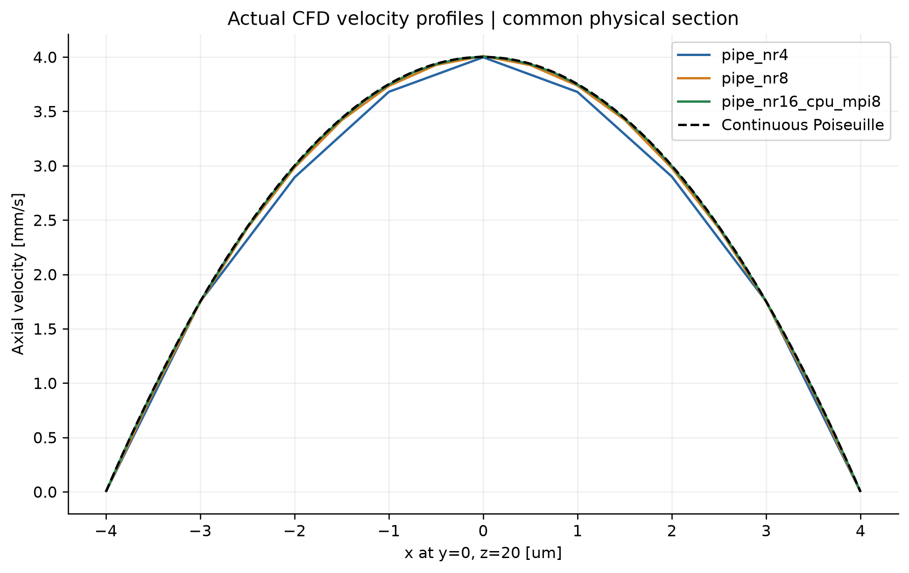
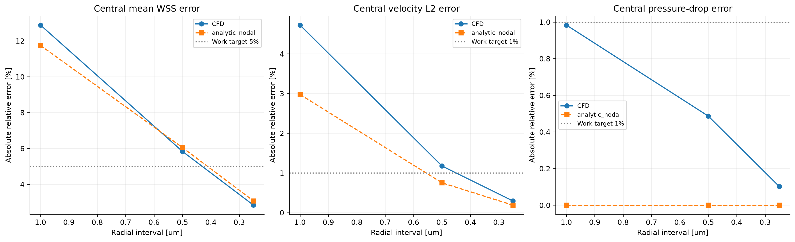
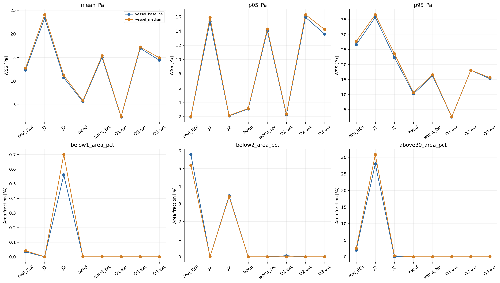
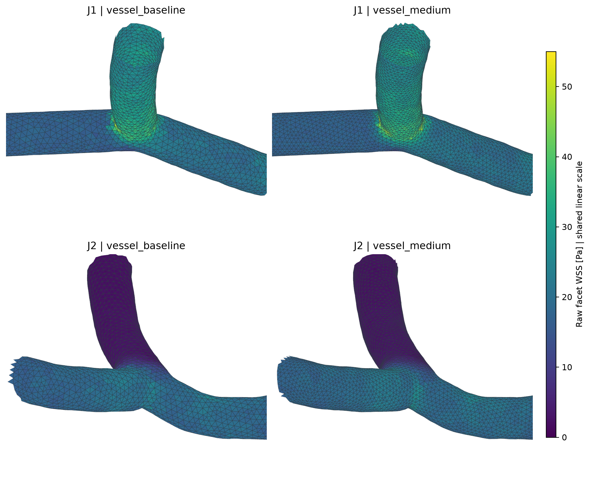
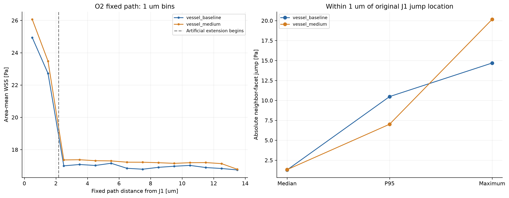

# WSS 第二轮修复与数值验证报告

**最终交付版（2026-09-27）：完成阶段一、三档圆管CFD、原网格—中档血管两档敏感性分析。按用户最终指令，细档真实血管CFD及出口压力敏感性均为SKIPPED_BY_USER。**

## 1. 通俗结论（不超过500字）

已修复正式WSS重算入口并绑定算例黏度，原H0面片及显示值回归差均为0。三档圆管实际CFD已完成，最细速度、压降和平均WSS误差约0.293%、0.102%、2.834%，达到预登记目标。中档血管按原标准收敛；原—中两档J1均值增加3.32%，J2的P95增加5.71%。最大内部截面流量偏差由入口流量1.97%降至1.12%，但未消失；局部最大邻片跳变和高低值小区域仍不稳定。这是两档网格敏感性分析，不能证明网格无关或确定血管离散误差。细档血管与出口压力敏感性因用户限制时间成本取消，均未求解。当前数据支持离散模型的区域统计及敏感性讨论，尚不支持把局部极值、近零岛或压力生理依据视为已验证。

## 2. 审计边界、版本与四阶段状态

本次目录 `V=/home/lzy/projects/formal_3D_flow_solver/FEM_SimVascular/wss_validation_v2`；工程根 `C=V/..`。服务器独立目录 `vast4090:/workspace/wss_validation_v2_20260927T1230Z`。原审计 `C/wss_audit`、正式网格、冻结流场和正式可视化原图不用于存放新增结果。所有新网格、CFD、日志、图表在 V 或对应服务器目录。

当前基线 H0 为 `/home/lzy/projects/ulm_flow_mean_2p0_mmps/formal_3D_flow_solver/FEM_SimVascular/flow_cases/mean-2p0-mmps-A-H0-pressure-v1`，实际第71步；原速度VTU SHA256 `064cbd28f3efa72f426fc946b2f29da21f056c596609095e7283d39070aa55f4`。会议图片版本仍未获得文件/哈希对应，不声称已复现会议原图。原工程HEAD为 `a4ff70fa77d49a319cb701617a30c243fc3c37e2`；它不能代表既有工作区修改，修改前状态及本轮差异单独保存。

| 阶段 | 实际执行状态 | 主要证据 | 结论范围 |
|---|---|---|---|
| 1 生产入口修复 | 完成，实际重算和测试 | `stage1/regression.json`、`stage1/data/`、`evidence/production_fix.patch` | 工程复现和离散张量代数；不是物理精度认证 |
| 2 三档圆管完整CFD | 完成，包括最细dt/2 | `data/pipe_validation.csv`、`data/pipe_timestep_comparison.json`、各例原始日志 | 本参数、几何、取样区及离散方法的完整链路验证 |
| 3 两档真实血管敏感性 | 原网格身份/稳态复核及中档实际CFD、独立分析完成；细档SKIPPED_BY_USER | `stage3/completion.json`、`data/vessel_mesh_comparison.csv`、各例日志和场 | 仅原网格与中档；不能证明网格无关或确定离散误差 |
| 4 O2压力±1% | SKIPPED_BY_USER，因用户限制时间成本未执行 | `stage4/user_cancellation.json`及服务器核查 | 无压力敏感性结论，不阻止本轮交付 |

本轮未提高原数值门槛以制造“通过”，未改出口压差使图均匀，未通过平滑、裁剪或归一化改变 WSS。新增诊断图使用原始面片值；既有正式渲染样式保持原样。

## 3. 实际软件、单位与计算链路

几何基准NPZ/`imported.vtp` → 官方 SimVascular TetGen → TET4 体网格及壁/端口面 → svMultiPhysics 不可压缩牛顿流体 P1/P1 VMS → 节点速度、压力 → 原坐标上的逐四面体P1速度梯度 → 壁面切向黏性牵引 → 原始面片模长 → 面积加权节点显示值。

求解器二进制沿用当前H0，SHA256 `0e509fe21424b5b1f731c4b4f519839b0104bfb2aab0817b01556cc4054f7fc7`。冻结源码标识为 `March_2025-99-gc3f0bb8-dirty`，不能冒充干净官方发行版；构建/运行记录见 `evidence/server_environment.json`。PETSc 3.25.5，库SHA256 `b79e98d278e105aa8a1848bd08d66ef36a3e2425458610f97213d3fc8e45c5ef`；OpenMPI 4.1.6、CUDA 13.2。网格为官方 SimVascular 2023.05.31 分发，嵌入Python3.5.5/VTK8.1.1；未单独确定其TetGen库版本。诊断环境Python3.13.11、NumPy2.5.3、SciPy1.18.1、PyVista0.49.0、VTK9.7.0；服务器诊断Python3.13.15。

| 量 | 实际值/约定 | 来源 |
|---|---|---|
| 长度 | 求解和梯度使用m；图/表明确转换到μm | `points_m`及原体网格 |
| 速度、时间 | m/s、s；H0流场dt=1.5040600916882215e-7s | 当前H0 `run/solver.xml`；不能与Particle输出间隔1ms混同 |
| 密度 | 1056 kg/m³ | XML `Density` |
| 动力黏度 | 0.00345312 Pa·s | XML `Viscosity model="Constant"` |
| 运动黏度 | 3.27e-6 m²/s | 同算例policy，与μ/ρ核对 |
| 压力、WSS | Pa；无额外压力换算 | SI应力定义及生产字段 |
| 壁条件 | 刚性、无滑移u=0 | `WALL` Dirichlet |

核心为实际生产模块 `solver_support/src/flow_solver_support/wss.py` 10–13、32–48行：

```python
x = points[tetra]
u = velocity[tetra]
G = np.swapaxes(np.linalg.solve(x[:, 1:] - x[:, :1],
                              u[:, 1:] - u[:, :1]), 1, 2)
traction = mu * np.einsum('nij,nj->ni', G + G.swapaxes(1, 2), normal)
tau = traction - np.einsum('ij,ij->i', traction, normal)[:, None] * normal
WSS = np.linalg.norm(tau, axis=1)
```

`G[i,j]=∂u_i/∂x_j`。壁三角形唯一父单元由节点集合查找；面积叉积归一化为单位法向，并用父单元中心确定外法向。此式等于 `(I−nnᵀ)μ(G+Gᵀ)n`，包含对称项和切向投影，没有以速度大小梯度、压力、某坐标分量代替WSS。当前输出为稳态终态的向量及模长，不是时间平均量。

`wss_case.py` 50–69行只对 `tags==1` 的壁面恢复；入口/出口截面不混入壁面。原始面片为 `WSS_raw_Pa`；`WSS_display_Pa` 是周围面片**模长**的面积加权平均，不是先平均剪切向量再取模长。节点分母检查保证壁面无无效权重填零。诊断统计全部使用原始面片值，不用节点显示值替代。完整必要代码与行号见 `evidence/CODE_AND_CONFIG.md`。

## 4. 阶段一：最小修复及实际回归

修改仅涉及三个生产文件，完整最小差异为 `evidence/production_fix.patch`：

1. `solver_support/src/flow_solver_support/wss.py`：从哈希对应的旧诊断脚本恢复7个核心函数。六个纯数值函数AST完全一致；surface只增加局部PyVista导入。正常导入不读取旧算例，不依赖日志解析器或绘图模块。
2. `solver_support/src/flow_solver_support/wss_case.py`：从显式算例XML读常黏度/密度，与同一policy的ν或μ核对；恢复字段、索引与来源记录。
3. `rotate_visualization/prepare_surface_data.py`：取消缺失脚本依赖；支持明确指定case/config/mesh/flow/arrays/output；核对VTU与NPZ字段、节点和四面体对应、边界、有限值、无滑移、入口和质量。绑定冻结manifest中的XML哈希及新增算例input_hashes，防止用新配置解释旧解。

旧恢复脚本SHA256 `efa12e218bcaf99ba07db7194d3b8da79251da709c0a54a97ad6f6179be6e438`，与原WSS计算记录一致。原副本和包装器保存在 `evidence/before/`。本轮三个修复文件已纳入本地Git暂存；未提交、未覆盖用户其他未提交改动。

实际圆管首次运行暴露了新增坐标检查过严：svMultiPhysics VtkData.cpp 240–260使用默认vtkPoints，以float32写几何。实际输出恰好等于原坐标的float32序列化。修复仅允许“逐位原坐标”或“逐位精确float32序列化”，继续核对连接关系；梯度仍使用原double输入坐标，不插值速度。任意坐标偏移负测试仍拒绝。首次失败数据和旧监视器保留，修复后圆管从零重跑，H0再次回归。

| 实际测试 | 参数/判定 | 结果 |
|---|---|---:|
| 生产H0原始面片/节点回归 | 各最大绝对差≤1e-9Pa | 0 / 0 Pa |
| 向量、法向、面积、节点/面片/父单元对应 | 原数据逐值核对 | 差均0 |
| 仿射场 | `G=100*[[1,2,3],[4,5,6],[7,8,9]] s⁻¹`，轴向及斜法向 | 梯度最大误差1.13687e-13s⁻¹，牵引9.99201e-16Pa |
| 刚体旋转 | 反对称G | 最大WSS2.19456e-16Pa |
| Couette | `u_x=1250z`，z=0壁面，μ同H0 | 理论/计算均4.3164Pa |
| 法向反转 | 比较模长差、向量和 | 0 / 0 Pa |
| μ与νρ不一致 | 真实读取函数 | 按预期拒绝 |
| μ、ν同时乘2 | 材料内部仍一致，真实生产入口 | 因冻结配置哈希不符拒绝 |
| 任意坐标偏移 | 真实坐标保护函数 | 按预期拒绝 |

这些测试证明已实现的离散代数和同输入复现，不证明真实流场已达到连续解精度。

## 5. 阶段二：完整圆管CFD与误差分解证据

### 5.1 登记、边界与取样

运行前 `stage2/PREREGISTRATION.md` 登记：R=4μm，L=40μm，U=0.002m/s，μ=0.00345312Pa·s，ρ=1056kg/m³；理论Q=1.0053096491487337e-13m³/s、全长Δp=138.1248Pa、WSS=6.90624Pa。中央段z=12–28μm，理论取样压降55.24992Pa。工作目标为最细速度相对L2≤1%、中央压降误差≤1%、中央平均WSS误差≤5%；不是通用认证标准。

入口为解析抛物线**节点值**，User_defined、Impose_flux=false；离散圆截面/线性速度的Qh与连续Q不完全相同，未归一化掩盖差异。出口不是普通压力条件，而是与对称应力相容的完整解析牵引：

`t=(-4μUx/R², -4μUy/R², 0), p(L)=0`。

实际XML使用 `Type=Trac` 和 `Traction_values_file_path`；冻结源码的读取和装配摘录见 `evidence/solver_boundary_excerpt.md`。这样避免把有限长度管道出口切向牵引不相容误判成求解器错误。壁与人工截面分开标记。

三档由同样圆环挤出/三四面体分棱柱生成，P1/P1 VMS、广义α谱半径0.5，零初值。主dt=1e-6s，最细另跑5e-7s。线性GMRES restart100、右预条件、ASM overlap2/ILU2、rtol1e-10/atol1e-24；非线性容差1e-10，最少2最多12次。保存每5步；最少20步，连续3个保存间隔速度/压力/WSS相对加权变化<1e-7、总质量和入口误差≤1e-6、壁面速度≤1e-12m/s才停止。再独立解析实际求解日志。

速度误差对中央段体积积分，Duffy 4×3×3 Gauss可精确积分此问题的四次平方误差；截面流量和压力用P1三角形积分；WSS均值、分位数及L2用壁面积权重。解析节点赋值实验在**同一网格上调用同一生产核心**，与实际CFD分列，不能代替实际求解。

### 5.2 实际三档结果

| 指标 | 粗 | 中 | 细 |
|---|---:|---:|---:|
| 节点 / 四面体 | 1067 / 5040 | 8085 / 43200 | 63017 / 357120 |
| 径向 / 周向 / 轴向区间数 | 4 / 24 / 10 | 8 / 48 / 20 | 16 / 96 / 40 |
| 径向 / 轴向间距μm | 1 / 4 | 0.5 / 2 | 0.25 / 1 |
| 近壁对顶高度μm | 0.991445 | 0.498929 | 0.249866 |
| CFD速度体积L2误差% | 4.724046 | 1.174316 | 0.292940 |
| CFD中央压降误差%（有符号） | −0.983366 | −0.486158 | −0.101695 |
| CFD中央WSS均值Pa | 6.016547 | 6.503453 | 6.710509 |
| CFD中央WSS均值误差% | −12.882458 | −5.832219 | −2.834119 |
| CFD中央WSS面积L2误差% | 12.917677 | 5.867258 | 2.856119 |
| 解析节点场WSS均值Pa | 6.095104 | 6.488492 | 6.694004 |
| 解析节点场WSS均值误差% | −11.744966 | −6.048843 | −3.073104 |
| 入口离散Qh相对连续Q误差% | −3.198024 | −0.804681 | −0.201495 |
| 中央截面Q相对入口最大偏差% | 2.349497 | 0.508175 | 0.125610 |

最细三个工作目标全部达到，误差随加密下降。入口/出口总体守恒不等于内部逐点或逐截面严格守恒：最细全域RMS(div u)/RMS(grad u)=0.0804%，中央段为0.000187%，中央截面流量仍比入口低0.1256%。数据见 `data/pipe_validation.csv`、`pipe_internal_sections.csv`、`pipe_divergence.csv`；图1为实际速度剖面，图2为CFD与解析节点实验的误差趋势。

对于本轮环形网格，解析节点场P1壁面斜率满足：

`τ_P1/τ_exact = [1−Δr/(2R)] / cos(π/Nθ)`，`h_n=Δr cos(π/Nθ)`。

实际生产计算与此离散几何表达式的平均WSS差最大4.44e-15Pa。此为离散斜率解释，不是另一套算法自证物理正确，也不把两组误差简单相减作唯一归因。实际CFD同时含速度场、几何、离散边界和导数恢复误差。

圆管全域最小minSICN随加密从0.12165降至0.03367，位于近轴心的规则环形网格；壁面父单元另行报告。不能凭统一形状阈值否定合理各向异性，实际解析误差是更直接的精度证据。反之，血管的单元质量好也不等于壁面导数精确。

### 5.3 时间步、残差与执行后端

最细主步长和半步长均第51步结束，各119次线性求解，无遗漏、失败或恢复重试；末步非线性Ri/R0约6e-15。质量相对误差约5.03e-16，墙面速度0。PETSc日志为其实际代数系统的残差，不能用低代数残差替代空间精度和内部流量检查。线性停止使用绝对/相对阈值二者较大者：`max(1e-24, 1e-10*r_initial)`；当初始残差已很小时，打印的相对残差可以大于1e-10而由绝对阈值收敛，不能只截取单列判定。

| 同网格dt/2比较 | 实测差 |
|---|---:|
| 速度体积L2相对差 | 9.54208e-9 |
| 压力体积L2相对差 | 9.68859e-9 |
| WSS面积L2相对差 | 1.52824e-8 |
| 最大面片WSS绝对差 | 5.11417e-7Pa |
| 中央平均WSS | 6.710508971 → 6.710509035Pa |
| 中央压降 | 55.193733617 → 55.193734131Pa |

因此本圆管的时间步影响远小于空间误差；不据此宣布血管时间步无关。最细圆管h_n/R≈0.06247，原血管半径约1.2μm、近壁高度约0.26μm，相对分辨率更低，不能把圆管2.834%直接当作血管误差。

粗、中主序列GPU单MPI，细网格CPU8；同一二进制/PDE/BC/残差目标。粗网格CPU/GPU终态WSS相对L2差2.93e-16；细网格同第5步CPU8/GPU1速度、压力、WSS差均<1e-15。记录在 `stage2/BACKEND_CHECK.md`。重复GPU细网格运行在第8步主动停止，CPU单进程和ASM16性能试验亦主动停止，均不计为收敛结果；失败/停止原因与日志保留。有效主细网格为 `stage2/pipe_nr16_cpu_mpi8`，半步长为对应`_halfdt`。

## 6. 阶段三：已完成的两档真实血管网格敏感性分析

登记见 `stage3/PREREGISTRATION.md` 及带时间/哈希的receipt；同源几何、h=0.391794759/0.293846069/0.195897380μm，无边界层、无MMG，保持原P1/P1 VMS、入口、出口、材料和H0 dt。用户随后明确取消细档CFD，细档仅保留已生成网格/配置，未初始化、未启动实际求解。依据`stage3/USER_SCOPE_CHANGE.md`，有效流场比较仅限原网格与中档。已完成的原网格半步长实验单独保留，不能当作第三档网格。

固定物理区域：J1(92,49,111)、J2(130.04,82.04,87.18)、bend(154.34,94.58,83.0)、worst_tet(98.658078,42.075917,131.953726)μm，半径均5μm。bend来自距分叉/切口>8μm的ROI度2节点中最大折线转角节点4475（15.239°），不是按WSS挑选。最差体单元邻域与弯曲段分开保留。真实ROI和四个延伸段按原切口及法向固定划分；三角形中心决定区域归属，未作跨界三角形精确裁切。

必须比较面积均值、P5/P50/P95、极值/坐标、<1/<2/>30Pa面积及位置、各出口和内部截面、邻片跳变与O2路径。阈值只是诊断阈值。自身阈值掩码与映射的固定基线掩码分表，最近面片映射误差另报。原中—细5%工作门槛因用户取消细档而无法执行。现在只报告粗—中变化，不以任何小变化宣称网格无关、确定真实血管离散误差或计算GCI。

### 6.1 已实际生成并核查的网格

| 指标 | 原基线 | 中 |
|---|---:|---:|
| 节点 / 四面体 | 70363 / 371402 | 159595 / 884975 |
| 全局尺寸μm | 0.391794759 | 0.293846069 |
| 体积μm³ | 1450.795109 | 1455.233158 |
| 相对同一源体积差% | −0.676911 | −0.373077 |
| 壁面积μm² | 2024.190790 | 2026.418291 |
| 近壁高度面积P5 / P50 / P95 μm | .211233 / .261638 / .365776 | .158236 / .195550 / .274234 |
| 全体积最低minSICN | .150198 | .150142 |
| 壁面父单元最低minSICN | .394521 | .440020 |
| 双向表面采样最大距离μm | .066919 | .035201 |
| 双向表面采样P95距离μm | .013988 | .009270 |

同一源表面体积1460.682631μm³。新网格各实际通过正体积、无重复四面体、单一连通体、无非流形体面、闭合外表面、端口单盘及面标记对应检查。近壁高度定义为壁面父四面体对顶点到面法向距离 `3V/A`，不是配置中的 `h_wall`。生成器没有调用边界层功能；中档近壁中位高度由0.261638降至0.195550μm，实际细化约25.26%。另已生成但未求解的细档为515875节点/3006849四面体、h=0.195897380μm；其网格/几何记录保留并标注SKIPPED_BY_USER，不能进入流场敏感性比较。

端口面积相对源表面的差（按INLET/O1/O2/O3）为：原网格−0.805/−1.365/−1.768/−1.205%；中网格−0.545/−0.888/−0.879/−0.649%；细网格−0.063/−0.348/−0.319/−0.186%。因此这是**同一几何基准下的重划分序列**，包含有限的几何逼近变化，不能把后续WSS变化全部拆成纯体网格误差。表面距离只是所有顶点和面中心的双向采样距离，不冒充连续表面的严格Hausdorff上界。原始数据见 `data/mesh_geometry.csv`、`data/vessel_geometry_comparison.csv`。

### 6.2 实际求解及独立验收

中档`vessel_medium`从零以CPU8/LU实际完成第51步，4079.429秒，峰值求解器RSS约16.55GiB。第40、45、50步连续三个保存间隔满足原速度/压力/WSS变化<1e-7、质量/入口误差≤1e-6、壁速≤1e-12m/s门槛；在第50步发STOP_SIM，求解器正常写出第51步终态，没有强制截取中间场。118次接受线性校正、118次KSP尝试，无失败/遗漏/重试/非线性失败；最大实际true residual/原阈值0.980673，末步非线性Ri/R0=7.112e-15。独立终态质量误差4.83072e-16、入口误差3.51949e-10、壁速0，输入哈希全部未变化。

原中档监视器源文件按启动SHA256精确恢复存档，恢复方法和字节匹配证据见`evidence/medium_runner_source_reconstruction.json`；实际版本为`evidence/run_solver_at_medium_LU_launch.py`。后续取消入口的保护修改没有重启或改变该运行进程。`reports/execution.json`、`flow_quality.json`及原日志SHA256 `86a389257c4d5c7aff0f7c6654021499fabb8f65b474c44708dfa0349522597f`共同支持此判断。

以下额外执行检查均发生在用户最终禁止新增试验之前，已完成结果直接复用，未再次求解：

原H0所有复制输入和冻结解逐字节对应，末四个保存间隔均满足当前速度/压力/WSS变化标准；实际160次线性求解无失败或遗漏，终态质量相对误差5.085e-17，壁面速度0。旧日志重构的最大true residual/阈值为1.001779，处于监测数值比较容差1.01内；不将其描述成逐次都严格小于1。该代数残差与局部不可压缩误差不是同一量。

执行试验与主科学序列分开：CPU8原网格复算已于第51步完成（4721秒），120次接受线性校正，无失败/遗漏/恢复重试；终态速度/压力/WSS相对原H0的L2差分别4.107e-15/1.178e-13/4.290e-15，最大WSS差4.476e-13Pa。其第10步与原GPU1第10步速度、压力、WSS相对L2差分别3.830e-15、5.171e-16、4.202e-15，最大WSS差5.898e-13Pa。GPU8独立试验首轮出现DIVERGED_BREAKDOWN，未获得合格场，已停止且不用于任何精度结论；底层故障原因未在本轮定位。半步长使用原H0已采用的GPU1，与原GPU1基线比较。中档GPU1实际首轮fresh线性求解在300次迭代DIVERGED_BREAKDOWN，下一fresh retry也失败，已停止并完整保存在`stage3/failed_attempts/vessel_medium_gpu1/`，不作网格比较。之后恢复CPU8输入并完成原网格CPU8/ILU2复算。中档CPU8/ILU2可收敛但执行成本很高，已保留其未完成记录；独立原网格CPU8/子域LU及CPU16/子域LU同第5步场检查均与对应参照相差<5e-15，满足预登记1e-9执行一致性标准。主中档据此改用CPU8/ASM-overlap2/原生子域LU，从零重新运行；细档曾准备CPU16同方法及显式共享8个物理核的启动参数，但实际细档CFD未启动。PDE、网格、dt、所有容差不变。ILU6和Schur-GAMG未完成同场验证，不采用；首次slots和Schur字段配置错误及全部失败/主动停止日志保留，详见`stage3/EXECUTION_UPDATES.md`。

细档在准备阶段曾登记中档场初始化及CPU16执行方案，但用户在细档尚未启动前取消后续计算。`vessel_fine_LU16`及其他细档自动启动项均停止/禁用，确认无细档求解进程；保留网格和原零初值配置，状态`SKIPPED_BY_USER`。细档初始化、实际CFD、时间步检查均未执行，不用于数值结论。已完成的同原网格映射和执行一致性小试验属于取消前历史记录，不是细档求解。

原网格GPU1半步长已实际完成，第51步，1812.276秒。与原H0同网格对比：速度/压力/WSS相对加权L2差为1.67642e-5、1.09715e-5、1.60547e-5；全壁平均WSS增加0.000526432%，最大面片差0.00123535Pa。仅说明当前原网格上的步长影响，不能自动约束更细网格的时间误差。

半步长存在一次被丢弃的旧预条件器失败尝试；原RHS恢复、零初值核对、新预条件器重试均有日志和求解器源码证据，最终接受的120次线性校正无失败。原监视器对任意DIVERGED标记判整例失败，已用8项正常/负向日志测试修正分类，实际GPU8和中档GPU1未恢复失败仍拒绝。原FAIL记录保留在`execution_original_monitor.json`，复核记录含原输入/解/日志哈希，CFD未重跑也未改容差。见`stage3/MONITOR_RECOVERY_REASSESSMENT.md`；不能将“最终接受校正无失败”写成“全部尝试零失败”。

| H0端口 | 实际cap面积重心坐标μm | 外法向 | 网格标签 | 实际XML条件 |
|---|---|---|---:|---|
| INLET | (103.67291,57.55505,158.80568) | (.02517,.67209,.74005) | 4 | Dir，Flat，Impose_flux，−1.55135916089e-14m³/s |
| O1 | (113.72258,133.77179,99.20543) | (.02550,.99446,−.10200) | 3 | Neu，585.28643326Pa |
| O2 | (79.43402,43.18361,110.42968) | (−.90646,−.42027,−.04120) | 5 | Neu，2932.01527108Pa |
| O3 | (176.56096,97.10021,81.04118) | (.98882,.05874,−.13706) | 2 | Neu，0Pa |

入口负值表示相对于外法向流入；压力Neu施加的是−P n牵引，不是把每个出口节点压力强制设为该值。端口坐标/法向由实际边界三角形面积积分得到，新网格对应表见`data/port_identity.csv`，不能用标签数字大小推断出口编号。

### 6.3 已核实的内部流量差与P1壁面取样

基线内部截面与对应边界流量差最大约入口总流量1.973%。每个选中截面为一个完整连通管腔，选择圆盘没有切掉管腔。进一步在四个延伸段截出真实控制体，积分当前P1速度散度，并比较“上游/下游截面通量差”；8个控制体的散度定理差最大仅入口流量4.99e-16。因此这些通量差确实存在于当前离散速度场中，不是切面积分漏算造成；这不等于已经唯一定位求解器中哪一稳定化或边界项导致它。

例如O2四分之一延伸段截面到出口cap的Q差为2.06735e-16m³/s（入口的1.33260%），与控制体内∫div(u)dV一致；四分之一到中点的差仅入口0.04062%。入口对应cap到四分之一截面的差约1.61961%。当前全体积RMS(div)/RMS(grad u)=5.45254%。总体边界流量守恒不能替代这些局部检查。冻结三维连续性装配代码为 `lR(3,a) += w*(Nq(a)*divU - upNx)`，含VMS细尺度项；因此它没有逐点强制原P1场散度为零。三维稳定参数包含 `kT=4*(ctM/dt)^2`、`tauM=1/(rho*sqrt(kT+kU+kS))`，即使终态近稳态，离散解仍可能有dt依赖；详见 `evidence/VMS_STABILIZATION_EXCERPT.md`。这解释了需要分别做空间与时间步验证，未宣称已把各误差项唯一分解。见 `data/control_volume_flux.csv`、各例 `internal_sections.csv` 和 `flow_quality.json`。

三个壁节点严格为零时，现有P1恢复等价于 `τ=−μ u₄,tangent / h_n`；对基线所有壁面实际计算，向量分量最大差1.12e-12Pa。这只是对当前离散模板的解释，不是独立物理验证。原J1坐标(90.915902547,48.559306985,112.109730253)μm处两片WSS为27.053456/41.737351Pa，其h_n为0.248289/0.230687μm、第四节点切向速度为1.945222/2.788277mm/s；面法向只差1.804°，父单元minSICN为0.807/0.759。故不能仅以网格形状尚可或法向相近排除导数取样敏感性。中档按相同物理邻域查找，不沿用旧ID；见 `data/known_jump_stencils.csv`。

### 6.4 区域WSS：均值、分位数、面积与位置

以下全部为生产方法的**原始壁三角形WSS模长**，面积权重；分位数对按WSS排序的面积累积分布作中心位置插值。原→中是同一物理区域的两档网格，不能把差值当作相对于真实解的误差。统计球半径5μm，图4为了显示上下游取8.5μm局部面片；二者范围明确区分。

| 区域 | 均值Pa：原→中 | P5 Pa：原→中 | P50 Pa：原→中 | P95 Pa：原→中 | 均值变化% |
|---|---:|---:|---:|---:|---:|
| all_wall | 12.5310 → 12.9304 | 2.0314 → 2.0784 | 14.7158 → 15.1073 | 26.1012 → 27.1791 | 3.187 |
| J1_r5um | 23.3055 → 24.0793 | 15.3198 → 15.9087 | 20.4386 → 21.3331 | 35.7873 → 36.6740 | 3.320 |
| J2_r5um | 10.6897 → 11.1847 | 2.0833 → 2.1473 | 6.3196 → 6.3600 | 22.3893 → 23.6671 | 4.631 |
| bend_r5um | 5.6500 → 5.8130 | 3.0680 → 3.1275 | 5.0810 → 5.1802 | 10.2912 → 10.6979 | 2.885 |
| worst_tet_r5um | 15.0296 → 15.3574 | 14.0184 → 14.2895 | 14.9773 → 15.2943 | 16.2369 → 16.6187 | 2.181 |
| INLET_extension | 16.4773 → 16.9596 | 15.2863 → 15.8131 | 16.0611 → 16.4324 | 19.0388 → 19.6526 | 2.927 |
| O1_extension | 2.3898 → 2.4664 | 2.2391 → 2.3381 | 2.3860 → 2.4669 | 2.5475 → 2.5944 | 3.207 |
| O2_extension | 16.9406 → 17.2109 | 15.9232 → 16.3029 | 16.8907 → 17.1863 | 18.1292 → 18.1310 | 1.595 |
| O3_extension | 14.4099 → 14.9315 | 13.5779 → 14.2199 | 14.3929 → 14.9312 | 15.2876 → 15.6427 | 3.620 |
| real_ROI | 12.3470 → 12.7551 | 1.9441 → 1.9820 | 14.2402 → 14.5526 | 26.6487 → 27.7594 | 3.305 |
| artificial_extensions | 13.2129 → 13.5804 | 2.3191 → 2.4120 | 15.5928 → 16.0417 | 17.7535 → 17.8311 | 2.782 |

真实ROI均值增加3.305%，J1增加3.320%，J2增加4.631%，弯曲段增加2.885%；J2 P95增加5.707%。O2延伸段P95仅变0.00975%，也不代表其点值或整个血管已网格无关。因为只有两档，原登记的中—细门槛无法执行，不重新把粗—中变化小于5%包装成收敛认证。

以下比例基于**每档自己的阈值区域**；变化单位是百分点，阈值无生理正常/异常含义：

| 区域 | <1Pa面积%：原→中 | <2Pa面积%：原→中 | >30Pa面积%：原→中 |
|---|---:|---:|---:|
| all_wall | 0.0266 → 0.0331 | 4.5640 → 4.0866 | 1.6167 → 2.0990 |
| J1_r5um | 0.0000 → 0.0000 | 0.0000 → 0.0000 | 28.0206 → 30.8333 |
| J2_r5um | 0.5609 → 0.7007 | 3.4530 → 3.4045 | 0.0510 → 0.3237 |
| bend_r5um | 0.0000 → 0.0000 | 0.0000 → 0.0000 | 0.0000 → 0.0000 |
| worst_tet_r5um | 0.0000 → 0.0000 | 0.0000 → 0.0000 | 0.0000 → 0.0000 |
| INLET_extension | 0.0000 → 0.0000 | 0.0000 → 0.0000 | 0.5976 → 1.3095 |
| O1_extension | 0.0000 → 0.0000 | 0.0631 → 0.0000 | 0.0000 → 0.0000 |
| O2_extension | 0.0000 → 0.0000 | 0.0000 → 0.0000 | 0.0000 → 0.0000 |
| O3_extension | 0.0000 → 0.0000 | 0.0000 → 0.0000 | 0.0000 → 0.0000 |
| real_ROI | 0.0337 → 0.0420 | 5.7922 → 5.1884 | 1.9949 → 2.5375 |
| artificial_extensions | 0.0000 → 0.0000 | 0.0129 → 0.0000 | 0.2156 → 0.4727 |

位置和固定掩码提供了不同于均值的证据：

- J1的>30Pa面积增加2.81271个百分点，高值面积重心只移动0.05427μm，映射到中档后的面积Jaccard为0.84096；整体高值区大致保留，但面积及局部点值仍变。J1两档都没有<2Pa面片，不能把本次J1区域直接等同会议图中未定位的“近零区”。
- J2的<1Pa面积从0.56088%变0.70068%，重心移动0.29503μm，Jaccard仅0.41362；>30Pa面积从0.05099%变0.32368%，重心移动0.95662μm，映射后Jaccard为0。原高值岛只有很小面积，对阈值、位置及离散较敏感。原J2>30Pa固定掩码上的中档平均值为27.29341Pa，已低于30Pa，而中档自己的新>30Pa区域位于别处；这两类统计不能混用。
- 上述固定基线掩码采用最近原面片映射，J1高值掩码最大映射距离0.03004μm，J2低值/高值掩码分别0.00841/0.00601μm；不能冒充精确物质点配准。坐标和形状重合度结合判断，不能只用重心判断小区域稳定性。
- 全局最小值0.41477→0.27571Pa，均在J2；位置由(131.51855,82.22919,86.92281)到(131.55701,82.22022,87.04305)μm，移动0.12656μm。两档均无恰好为零的原始WSS面片，也无四个速度节点全部在无滑移壁面的四面体；不支持“壁面零速度被错误差分成零WSS”的诊断。
- J1最大值46.52024→49.08454Pa，位置仅移0.01333μm；但全局最大值变为人工入口延伸段的52.83196Pa，坐标(102.24940,58.02979,158.32624)μm，距入口cap平面内侧约0.07158μm。此位置与Flat入口/周缘无滑移交界有关联，存在边界及离散局部峰值风险；本轮未单独证明其唯一来源，不能将全局最大值直接当作真实ROI生理极值。

CSV证据：`vessel_region_wss.csv`、`vessel_mesh_comparison.csv`、`vessel_spatial_changes.csv`、`fixed_baseline_mask_wss.csv`、`threshold_overlap.csv`；入口峰值坐标核对为`inlet_global_peak_location.json`。

### 6.5 邻片跳变：整体下降不等于最大跳变消失

| 物理区域/指标 | 原网格Pa | 中档Pa |
|---|---:|---:|
| J1所有邻片跳变中位数 | 0.77243 | 0.63723 |
| J1所有邻片跳变P95 | 3.94021 | 3.08521 |
| J1所有邻片跳变最大值 | 14.68390 | 20.15677 |
| 原跳变坐标半径1μm内中位数 | 1.28373 | 1.31533 |
| 同一1μm邻域P95 | 10.47754 | 7.01351 |
| 同一1μm邻域最大值 | 14.68390 | 20.15677 |

这里权重是共享边的面片对计数，区别于区域WSS的面积权重。原27.05346/41.73735Pa对的物理中点为(90.91590,48.55931,112.10973)μm。中档最近面片对中点距其0.05310μm，值32.73695/44.55679Pa、跳变11.81984Pa。**在这一最近位置附近，跳变有所降低；但不能以此代表整个邻域。** 同一1μm邻域的最大跳变移到(91.15737,47.72896,111.91552)μm，距原点0.88628μm，值26.58214/46.73891Pa、跳变20.15677Pa。

中档最大跳变对的父单元minSICN为0.74846/0.97873，法向高度0.176419/0.176435μm，第四节点切向速度1.35808/2.38810mm/s；面法向相差55.4097°。原跳变对法向仅相差1.804°，因此不同位置既有不同内部速度取样，也有明显不同的曲面法向/切向投影影响。没有证据将其简单归因为翻转或极端畸形四面体；也不能由形状指标良好证明梯度准确。中档P1壁面模板与完整生产切向牵引的分量最大差1.97531e-12Pa，证明这些跳变来自当前离散场/几何上的实际恢复值，而非图像平滑或节点编号错配。

两档O2固定路径1μm分箱均由J1近端较高WSS下降，在约2.2μm处进入人工延伸段后维持约17Pa，只有小起伏（图5）。该路径在分叉附近可能包含相邻分支面片；它不是唯一沿壁流线，也没有与会议图片逐文件对应。本轮不足以确认会议所谓“再次升高随后降低”的具体峰值或唯一物理机制。O1延伸段均值仍明显低于O2，与更低的离散流量方向相符，但没有因此证明其绝对WSS准确。

### 6.6 内部流量偏差随加密改善，但未消除

符号按`internal_sections.csv`中固定截面法向及所比边界定义；下表均以该例入口总流量为分母，**不是相对于各小出口流量的百分比**。所有截面为单一完整管腔，选取圆盘不切掉管腔。

| 固定截面 | 原网格偏差%Qin | 中档偏差%Qin | 绝对偏差降低% |
|---|---:|---:|---:|
| INLET_extension_0.25 | 1.61961 | 0.88692 | 45.24 |
| INLET_extension_0.5 | 1.60237 | 0.88034 | 45.06 |
| O1_extension_0.25 | -0.18298 | -0.10201 | 44.25 |
| O1_extension_0.5 | -0.18208 | -0.10066 | 44.72 |
| O2_extension_0.25 | -1.33260 | -0.74362 | 44.20 |
| O2_extension_0.5 | -1.29198 | -0.72155 | 44.15 |
| O3_extension_0.25 | -1.17968 | -0.66119 | 43.95 |
| O3_extension_0.5 | -1.20391 | -0.66994 | 44.35 |
| inlet_trunk | -1.59996 | -0.88904 | 44.43 |
| J1_to_J2 | -1.97302 | -1.11683 | 43.39 |

全部10个固定截面的绝对偏差均下降约43%–45%；最大值从1.97302%降到1.11683%，因此加密改善得到实际证据支持，但仍有约1%入口流量的局部偏差。两档每例8个延伸段控制体的“截面/出口通量差−∫div(u)dV”最大相对入口差分别4.99e-16、8.82e-16，表明这些偏差确实属于当前P1场，而非截面漏算。全域RMS(div)/RMS(grad u)由5.45254%降至4.30616%，不能写成点态或局部质量守恒已经完全满足。

在同一入口流量及出口压力下，边界分流也有如下空间敏感性：

| 出口 | 原流量m³/s | 中流量m³/s | 原分流% | 中分流% | 差：百分点 |
|---|---:|---:|---:|---:|---:|
| OUTLET_01 | 1.01471681e-15 | 1.01779447e-15 | 6.540825 | 6.560663 | +0.019838 |
| OUTLET_02 | 6.95321061e-15 | 6.88092655e-15 | 44.820122 | 44.354181 | -0.465940 |
| OUTLET_03 | 7.54566418e-15 | 7.61487059e-15 | 48.639054 | 49.085156 | +0.446102 |

总体入口—出口质量误差可达10⁻¹⁶量级，同时内部截面仍偏离约1%，两者并不矛盾。主中档与原网格使用相同dt，因此此两档比较没有主动混入步长变化；已有原网格dt/2变化较小，但不能替代中档时间步检查。本轮按用户限制不再增加求解。证据为`vessel_internal_flow_comparison.csv`、`control_volume_flux.csv`、`vessel_flow_split_comparison.csv`及各例`flow_quality.json`。

## 7. 阶段四：出口压力敏感性因用户限制时间成本未执行

状态为`SKIPPED_BY_USER`，不是PASS。取消时O2_minus1pct、O2_plus1pct目录均不存在，未生成、未排队、未注册、未启动，没有压力扰动流场或响应数据。旧自动衔接进程已停止，活动`finish_numerical_sequence.py`已移除压力生成/注册/启动/等待代码；求解、等待和注册入口同时识别阶段取消标记。核查不影响中档原进程和结果回传。

因此，本轮不能量化O2±1%压力变化的WSS或分流响应、不能判断其正负对称性，也不能声称对出口压力不敏感。实际生效出口值仍列在第6节，两个血管网格使用相同值；两档结果差异不来自主动更改出口压力。压力物理来源的独立验证与生理适用性仍未建立，本轮不新增压力来源重算或CFD。既有上一轮证据保留在`wss_audit/`，不能用它冒充本轮已执行压力实验。

## 8. 相对上一轮的变化、证据等级与可用范围

| 检查对象 | 本轮结论及证据等级 | 影响/限制 |
|---|---|---|
| 缺失依赖、包装器硬编码黏度 | 已确认工程缺陷已最小修复；实际生产入口回归及配置负测试完成 | 解决当前重算和未来算例参数误用风险，不代表提高了P1空间阶次 |
| WSS张量公式、单位、表面对应 | 仿射/旋转/Couette/法向测试、H0逐值一致及实际场子集复现支持当前实现；未发现已测链路中的公式/索引错误 | 不能等同证明任意算例、任意输入正确 |
| 只有解析赋值圆管测试 | 已增加三档真正CFD及最细dt/2，达到预登记最细工作目标 | 证明本圆管完整链路；圆管误差不是血管误差界 |
| 原来只有一档真实血管有效解 | 已获得第二档独立实际CFD，并做固定物理区域/截面比较 | 两档敏感性分析；无法确定渐近阶次、外推误差或GCI |
| 近壁解析与局部WSS | 均值通常变化数个百分点，阈值小区域/极值/局部跳变仍明显变化；属数值精度及几何离散风险 | 局部极值、近零岛面积/位置不能作为已验证的生理定量结果；未实施边界层 |
| 内部连续性 | 10个截面偏差随加密降低约43%–45%，仍残留最大1.11683%Qin；控制体恒等式实际验证 | 总体质量守恒和残差小不足以证明局部流场精确 |
| 绘图 | 当前比较用原始面片值、同视角/单位/0–55Pa色标，无平滑、归一化、填零或色标裁剪 | 节点显示平均会改变可见细节；图4低值颜色区分有限，定量依据CSV |
| 出口压力及生理依据 | 两档实际施加值一致；压力扰动因用户限制时间成本未执行，来源的生理真实性尚未验证 | 不能称不敏感、不能靠调压消除斑块、不能唯一归因出口条件 |
| 会议图像版本 | 仍缺原图文件/配置/哈希对应 | 不声称重现或解决了会议图片全部细节 |

**可以定量讨论的内容**：本轮明确模型、网格、边界条件下的区域均值/分位数、面积和出口分流；须同时列出原—中变化及统计区域。圆管的已测误差、两档内部截面偏差及其改善量，可以作为可复核的数值证据。它们是条件明确的离散模型结果，不能直接标为生理实测值或已知误差范围的真实WSS。

**仍不能作为已验证定量结论的内容**：血管局部最高/最低WSS、单个小阈值岛及其稳定位置、网格无关性、血管总离散误差、压力敏感性和压力生理真实性。不存在“分叉应当均匀”的验收目标；J1总体较高、O1延伸段较低在两个离散解中保留，可能包含合理物理差异，但空间误差/几何离散的贡献尚不能唯一分离。

本轮的必要工程修改已完成；在未来另获授权的研究中，优先针对固定几何的近壁梯度分辨率和局部连续性补充证据，再考虑额外牵引恢复/高阶方法与压力来源约束。这里列为未解决研究问题，**不再提交任何新算例，也不以补算作为本次交付前提**。

## 9. 关键图、独立复核与实际文件位置

五张图均有PNG/PDF。图1、2属于已完成的**三档圆管验证**；图3–5属于**两档真实血管敏感性分析**，两者不能混淆。图4相同相机方向(1,−2.2,1.1)、Z轴向上、正交尺度6μm、线性色标0–55Pa，照明和平滑关闭，显示原始面片值及实际网格边。局部面片最大值49.08454Pa未被色标裁剪，参数保存在`figures/Figure_04_metadata.json`。











| 附件 | 内容 |
|---|---|
| `data/pipe_validation.csv` | 三档圆管实际CFD与同网格解析节点场分列，单位/权重/参考明确 |
| `data/mesh_geometry.csv`、`vessel_geometry_comparison.csv` | 网格、近壁尺度、质量、体积/端口/表面差；细档明确SKIPPED_BY_USER，仅几何 |
| `data/vessel_region_wss.csv`、`vessel_mesh_comparison.csv` | 原始面片固定区域均值/分位数/极值/阈值面积及原—中差 |
| `data/vessel_spatial_changes.csv`、`threshold_overlap.csv`、`fixed_baseline_mask_wss.csv` | 自身阈值位置、重合度与固定原掩码分别报告 |
| `data/vessel_local_jump_comparison.csv`、`known_jump_stencils.csv` | 邻片统计、局部坐标、单元/节点编号及第四节点取样 |
| `data/vessel_internal_flow_comparison.csv`、`control_volume_flux.csv`、`vessel_flow_split_comparison.csv` | 内部偏差、散度定理核对、各出口分流 |
| `data/validation_stage_status.csv` | 实际完成及SKIPPED_BY_USER明确分列；没有伪造的压力响应零值 |
| `evidence/production_fix.patch`、`evidence/CODE_AND_CONFIG.md` | 最小生产差异、关键源码/参数内容及行号 |
| `CASE_STATUS.csv`、`ARTIFACT_INDEX.csv` | 实际成功、失败、主动停止、未执行、用户取消及本地/服务器大文件路径、SHA256 |

实际原始目录：

- 本地新增根：`/home/lzy/projects/formal_3D_flow_solver/FEM_SimVascular/wss_validation_v2/`。
- 有效中档：该根下`stage3/vessel_medium/`；`run/solver.xml`、`policy.json`、`input_hashes.json`为输入；`run/solver.log`为原日志；`run/8-procs/`为实际VTU/重启文件；`frozen_flow/flow_arrays_si.npz`为终态；`wss/data/wall_wss_si.vtp`同时含原始面片和节点显示值。
- 原网格身份核对副本：`stage3/vessel_baseline/`；原冻结H0来源见第2节。圆管有效主序列为`stage2/pipe_nr4/`、`pipe_nr8/`、`pipe_nr16_cpu_mpi8/`，半步长为`pipe_nr16_cpu_mpi8_halfdt/`。
- 服务器原始新增根：`vast4090:/workspace/wss_validation_v2_20260927T1230Z/`，中档为其`stage3/vessel_medium/`；本地诊断生成的WSS/CSV以本地为准，服务器栏仅列实际有对应副本的原始文件。
- 细档`stage3/vessel_fine/`只保留已生成网格/配置和取消记录，无初始化和CFD解；两个压力算例从未生成。失败/主动停止执行实验保留在`stage3/failed_attempts/`和`stage3/execution_checks/`等目录，不能混入主结果。

精简附件`WSS_VALIDATION_V2_REVIEW_BUNDLE.zip`含主报告、汇总CSV、五图PNG/PDF、差异、配置/代码、带原行号日志摘录及真实J1/J2场的小子集；大型VTU/NPZ/完整日志留在上述原目录。包内`REVIEW_BUNDLE_MANIFEST.json`给出文件SHA256，包外`.sha256`给出ZIP校验值。

不用整个项目也能在解压目录实际复核局部生产WSS（仅依赖NumPy）：

```bash
python -B scripts/reproduce_local_wall_evidence.py
```

已在本地真实执行：原网格及两个原网格控制例各4347面片、中档7708面片，向量分量/模长最大差均0Pa。子集不是闭合CFD域，不是新求解或独立物理准确性证明；包解压复核另有包外记录`bundle/verification.json`。本工程中重新分析现有场的命令为：

```bash
cd /home/lzy/projects/formal_3D_flow_solver/FEM_SimVascular
PYTHONDONTWRITEBYTECODE=1 OPENBLAS_NUM_THREADS=1 .venv/bin/python -B wss_validation_v2/scripts/analyze_vessel.py --case wss_validation_v2/stage3/vessel_medium
PYTHONDONTWRITEBYTECODE=1 OPENBLAS_NUM_THREADS=1 .venv/bin/python -B wss_validation_v2/scripts/collect_results.py
PYTHONDONTWRITEBYTECODE=1 .venv/bin/python -B wss_validation_v2/scripts/summarize_two_mesh.py
PYTHONDONTWRITEBYTECODE=1 .venv/bin/python -B wss_validation_v2/scripts/make_figures.py --part vessel
```

执行记录见`COMMANDS.md`、`PROGRESS.md`；历史细档/压力/性能命令按用户最终范围撤销，禁止据此自动启动。`finish_numerical_sequence.py`现在只完成现有结果分析和绘图，无生成、注册或启动CFD逻辑。阶段四与细档状态始终为SKIPPED_BY_USER；最终服务器核查`stage4/final_no_new_CFD_verification.json`确认中档已退出、压力未注册且无对应算例。原审计、正式网格、原图和冻结输入270项保护清单最终逐一核对，记录见`evidence/protected_inputs_after.json`；生产文件仅保留本轮已列最小修复，用户已有工作区修改保留。
