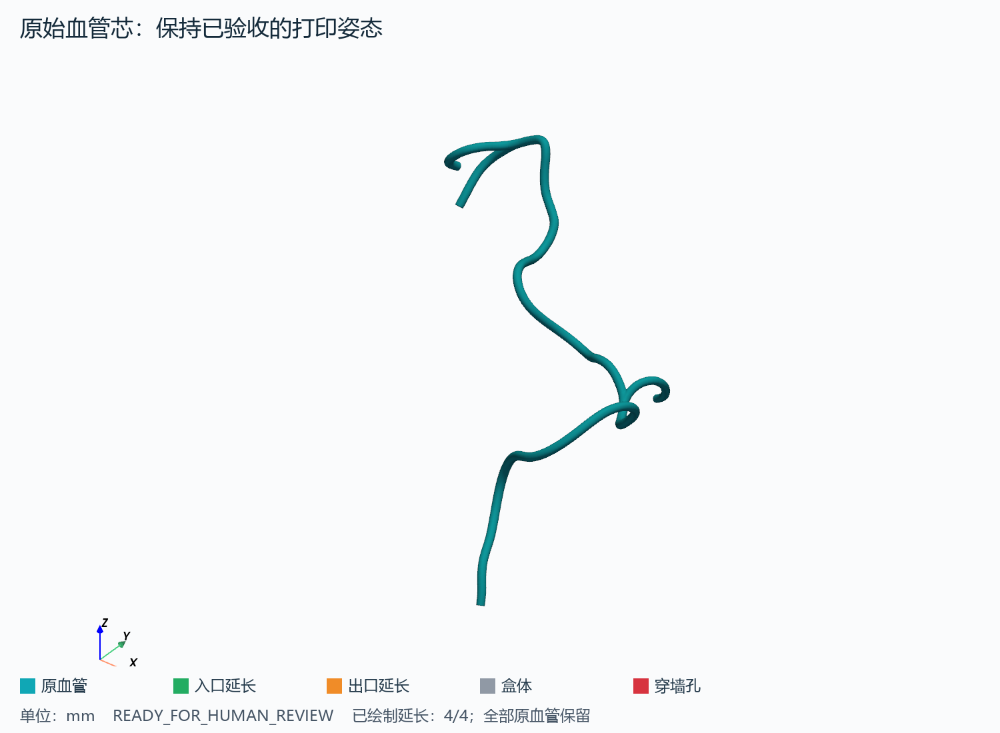
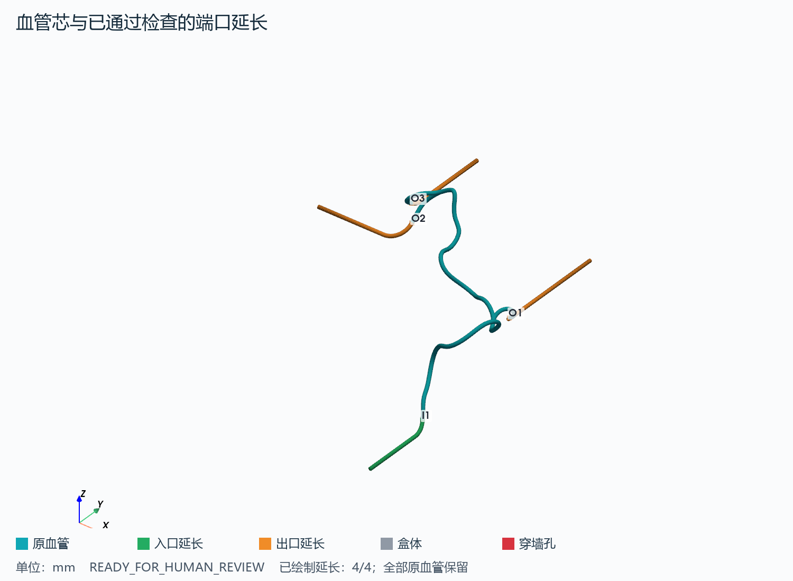
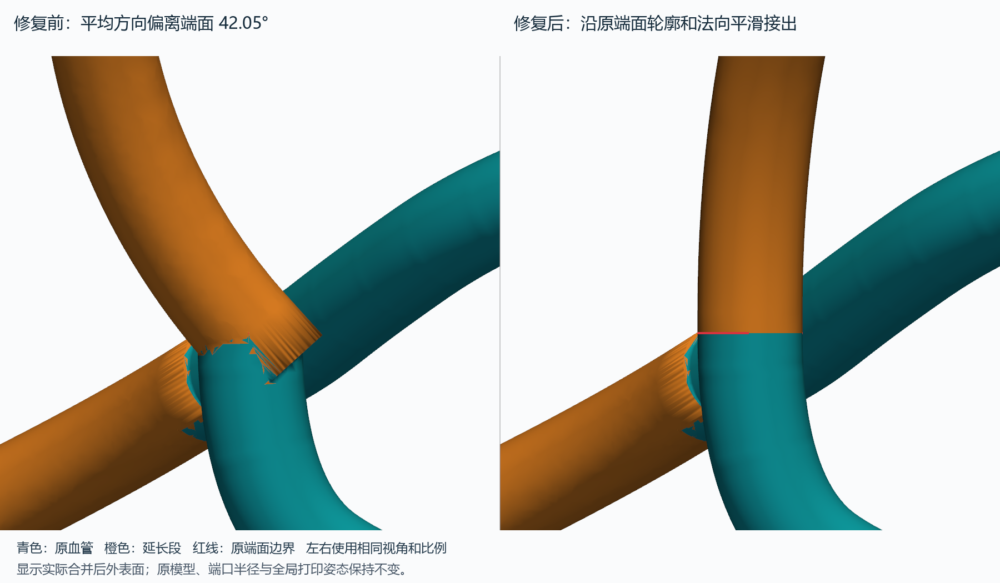
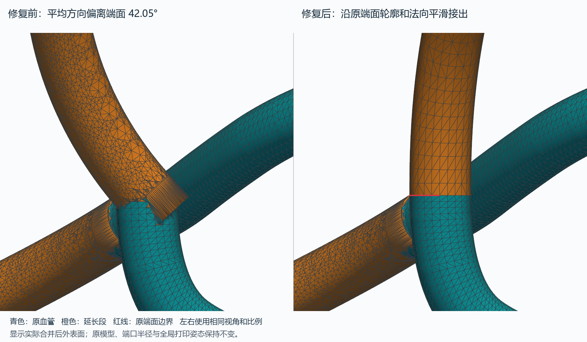
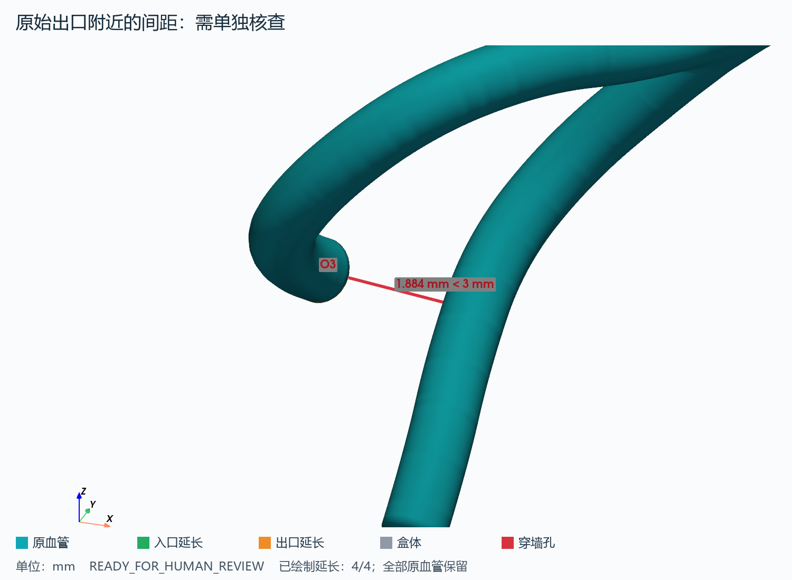
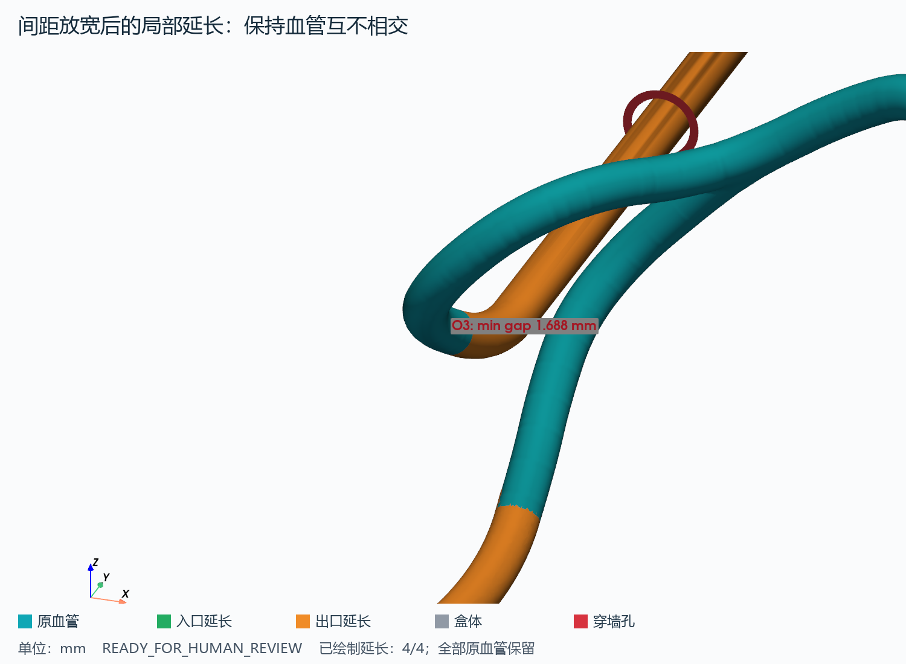

# BALANCED 血管芯与浇注盒设计审核

## 1. 这次做了什么

本轮围绕已经验收的血管芯设计了一个顶部开放的浇注盒。入口和出口的位置来自原有中心线及其编号对应表，延长段沿端点几何方向起步，再通向允许的盒体边界。原血管与延长段构成牺牲芯，盒体单独保存为另一个部件。图片用于人工检查位置、弯曲和装配关系，本轮没有切片或提交打印。

## 2. 输入是什么

- 已验收血管 STL：`/home/lzy/projects/ulm_3D_vascular/outputs/topbrain_brava_transfer/nn_production/BG001/RMCA/compact_manufacturing_roi/BG001_RMCA_BALANCED_print_candidate.stl`。
- 紧凑血管中心线：`/home/lzy/projects/ulm_3D_vascular/outputs/topbrain_brava_transfer/nn_production/BG001/RMCA/compact_manufacturing_roi/candidates/BALANCED/compensated.swc`。
- 生成最终表面的拟合中心线：`/home/lzy/projects/ulm_3D_vascular/outputs/topbrain_brava_transfer/nn_production/BG001/RMCA/compact_manufacturing_roi/candidates/BALANCED/VascularMD/compensated_vmd_smooth.swc`。
- 来源清单：`/home/lzy/projects/ulm_3D_vascular/outputs/topbrain_brava_transfer/nn_production/BG001/RMCA/compact_manufacturing_roi/compact_manifest.json`。
- 固定打印坐标变换：`/home/lzy/projects/ulm_3D_vascular/outputs/topbrain_brava_transfer/nn_production/BG001/RMCA/compact_manufacturing_roi/print_transform.json`。

SWC 用来确认真实端点、父子关系、原分支编号和半径；STL 用来计算盒体尺寸、碰撞与最终实体。本轮不重新识别 MeVO，也不重新运行配准、NN、半径补偿、VascularMD 建模或朝向搜索。端口使用拟合中心线中与原封口记录一致的实际半径，早期补偿值和原始值一并保存在端点表中。



## 3. 盒子多大

- 内部：**78.29 × 81.85 × 56.39 mm**（X × Y × Z）。
- 外部：**84.29 × 87.85 × 59.39 mm**。
- X、Y 两侧分别留 12、12 mm；原血管下方留 10 mm，上方留 12 mm。
- 侧壁厚 3 mm，底板厚 3 mm，顶部无盖。

本轮仅允许 ±X、±Y 四个侧壁；−Z 底板和 +Z 顶部均不放置端口。顶部保持开放。

“顶部开放”指盒内空腔可从上方进入；盒壁和底板作为一个有厚度的实体，其三角网格仍应闭合，不能有破面。沿用原打印坐标，因此盒底可能位于 Z=0 以下；这不是重新选择打印姿态，后续切片时再分别定位两个部件。

## 4. 有几个入口和出口

来源拓扑确认 **1 个入口、3 个出口**，未根据 STL 外观猜测身份。本次仅有 **4/4 个端口**的延长通过检查；端点没有被删除。

I 表示入口，O 表示出口。端点箭头是中心线向模型外侧的几何方向，不是实测血流方向。

## 5. 每个端口在哪里

| 端口 | 原 SWC 编号 / 分支 | 盒壁 | 路线 | 延长长度 mm | 半径 mm | 最小弯曲半径 mm |
|---|---|---|---|---:|---:|---:|
| I1（入口） | 2039 / 137_138 | -Y | 平滑曲线 | 26.39 | 0.6026 | 6.20 |
| O1（出口） | 2081 / 138_139 | +Y | 平滑曲线 | 41.84 | 0.5851 | 6.19 |
| O2（出口） | 2123 / 140_141 | -X | 平滑曲线 | 32.55 | 0.6263 | 6.19 |
| O3（出口） | 2127 / 140_142 | +Y | 平滑曲线 | 29.49 | 0.6311 | 6.20 |

盒壁名称属于当前打印坐标，与左右脑解剖方向无关。每段长度从原端点算到最外端，不包含向原封口内侧的布尔连接重叠。

端口在盒外继续延伸 10 mm。穿墙孔的余量为**径向 0.2 mm**，即孔直径比端口直径大 0.4 mm；孔不是软管接头。
同壁孔中心间距至少 8 mm，且不少于两半径加两倍径向余量；孔中心距顶部、底部和侧角至少 8 mm。



## 6. 有没有风险

- 穿墙孔留有径向 0.20 mm 装配余量，浇注前需要确认定位和防漏方式。
- 当前固定打印坐标保持不变；两个部件尚未进行新一轮切片或打印误差验证。
- 端口方向来自中心线或其已确认端面的几何方向，不据此推断生理血流。
- O3 已核实没有原始下游血管可补。仅此端口至原血管的间距下限从 3 mm 逐级放宽至 1.6 mm；完整延长实体的实测最小间距为 1.6877 mm，未接受相交。
- 入口/出口中最小盒壁边距为 8.021 mm，接近 8 mm 下限，人工审核时需留意实际打印公差。

**本轮端口对准修复。** O3 原先沿约 5 mm 中心线的平均方向起步，该方向与已验收端面的法向相差 42.05°，造成斜接。本轮通过已有 SWC 和端口记录定位原封口，取其实际轮廓及向外法向作为连接基准；没有从 STL 猜测新的出口。起始轮廓沿用原端面的 24 个点，半径仍为 0.631140 mm。向内连接改为长度 0.2 mm 的收窄锥段，其位于原血管外的数值体积为 3.88e-07 mm³，避免原来的完整半径倒插管从弯曲管壁侧面露出。
实际生成网格在端面外 0.02 mm 处进行截面核对：中心偏差 1.02e-14 mm，轮廓最大差异 2.59e-14 mm，起始轴向误差 0.000000°。这项检查独立于闭合、连通和体积检查，专门防止斜接或错位。





装配预览沿用现有配色和视角，数据改为合并后的实际外表面，不再显示两实体交叠处的内部封口。VTM 中三个血管图层是同一外表面的互不重叠分组；两个物理部件仍分别导出。详细数值见 [接口对准检查](attachment_alignment_qc.json)。
- 最大端点方向转角：90.23°。该值是起始切线与盒壁法线的总方向差，并非接口处的尖角。
- 路线至非连接区血管的最小表面间距：1.688 mm。
- 任意两个端口的最小表面间距：4.493 mm。
- 同壁端口最小中心间距：43.24 mm。



橙色圆盘是端口必须包含的起始截面，红线表示它到旁边血管的最短距离。由于这段距离在延长起点就已经不足，改变目标盒壁、加大盒子或修改后续曲线都无法消除该冲突。图中显示原始起点与原血管的关系；实际延长实体（含连接重叠）的最小间距另行逐口核验。

**先检查能否补回原始血管。** 本轮读取完整原始 SWC，并核对源文件哈希、所有保留节点坐标及有向父子边。补回长度应由真实下游路径和间距需要决定，不能凭空外推血管，也不能把旁边的血管接到当前出口。
O3 对应原始节点 2127，原始子节点为 []，可补回的真实下游长度为 **0.000 mm**。该节点已是完整原始模型的末端，所以自适应搜索也没有可继续选取的原血管；本次没有伪造补回段。

完整依据见 [原始血管补回检查](native_restoration_audit.json)。

**最后手段：仅对受限端口放宽间距。** 在确认原始血管无法补回后，按用户允许的顺序，以 0.1 mm 步长由 3 mm 向下搜索。首次完成全部端口布局的门槛为 **1.6 mm**，仅适用于 O3 到原血管的距离。其他端口以及端口两两之间仍要求 3 mm，血管相交、壁边距不足或弯曲过急的候选仍被拒绝。这不代表已经满足原来的全程 3 mm 条件，需人工确认局部 PDMS 壁厚是否可接受。
O3 完整实体的最小间距为 1.6877 mm；从原封口向外的截面抽样最小值为 1.6878 mm。最后一个低于 3 mm 的抽样截面位于起点后约 3.75 mm。抽样仅用于定位局部狭窄位置，是否相交仍由完整三角表面检查决定。

[逐级搜索记录](clearance_fallback_audit.json)；[沿程间距表](tables/route_clearance_profile.csv)。



已输出的芯体包含 1 个连通实体，闭合检查为 True，退化面为 0 个；原血管体积减损的数值检验结果为 4.43e-07 mm³，低于 0.001 mm³ 数值容差。盒体已开 4 个侧壁穿孔；完整设计要求全部 4 个端点均有可用通路。

**设计参数的含义。**

端点方向通过约 5 mm 的中心线估计，按 0.25 mm 重采样后作直线回归，真实窗口和原采样点数逐口记录。只有方向差不超过 45° 且间距满足要求时才考虑沿切线直连，否则使用 CadQuery 曲线扫掠。弯曲半径至少 6 mm，并以 1.02 倍安全系数筛选；曲率按不超过 0.25 mm 的弧长间隔查询 OCC。首选血管及端口之间保持 3 mm 表面间距；仅上面明确记录的最后手段例外可降低下限。无论是否放宽，均另留两倍 0.02 mm 网格离散余量。

未启用端面对准修复的端口沿用向原封口内侧重叠 0.6 mm 的方法；已修复端口使用上文记录的内埋连接段。碰撞检查仅豁免同一父分支端点附近 5 mm 的连接区；其他分支及更远父分支仍参与检查。表面归属依据已有 SWC，以 0.2 mm 间隔关联；一个面仅在三个顶点都属于此连接区时才豁免。表面最短距离由 FCL 计算，不以最近网格顶点距离代替。

允许的候选边界为 -X、+X、-Y、+Y，按距离、方向变化、碰撞和边缘条件评分；权重依次为 0.35、0.35、0.2、0.1。距离除以盒内对角线，角度除以 180°，不满足条件的候选被拒绝。优先入口和出口相对，若曲线总转向超过偏好值 120° 则尝试其他布局；出口最多占 2 个相邻面。所有候选（含被拒绝者）的分数、坐标和原因保存在 CSV。

为避免把目标孔强制放在端点同一高度，程序还尝试沿端点方向顺势转弯。试用的弯曲半径为 [6.2, 8.0, 10.0, 12.0] mm，各用 17 个圆弧导点交给 CadQuery 拟合，转弯后直达盒壁。另一组候选在壁面横向偏移 [0, -10, 10] mm、竖向偏移 [0, 8, -8] mm；两点样条的端切线幅度取端点间距的 [0.7, 1.0, 1.5, 2.0] 倍。每面保留至多 8 个不同目标位置进入组合比较，曲线在穿墙前至少直行 3 mm。

几何离散角度精度为 0.1 rad，来源坐标核对容差为 0.0001 mm，面积不大于 1e-10 mm² 的三角形按退化面处理。仅当合并结果出现数值退化面时，才使用 Manifold 官方简化功能，容差为 1e-05 mm；不修改输入 STL，并重新检查体积保留和连通性。完整数值和图像显示参数保存在 [本次配置](resolved_design_config.yaml)。表内空的距离或弯曲半径表示不适用，不代表零。

VMTK 检查：现有 VMTK 可调用，但已验收 STL 没有开放边界，不能直接作 flow extension；采用 CadQuery 局部延长，避免切开或重建原主体。

## 7. 当前能不能进入下一步

**READY_FOR_HUMAN_REVIEW**

几何检查通过，可先人工查看图像和装配文件，再决定是否开展后续打印验证。

这不是打印批准。两件套没有增加可拆壁或卡扣，刚性芯能否穿入多个固定侧孔、穿墙余量如何密封，以及实际打印误差，仍需人工确认。

所有端口均已包含在本次审核模型中。

审核入口：[装配图](QC/08_assembly_preview.png)；[顶视图](QC/09_top_view.png)；[交互装配](assembly/assembly_preview.vtm)；[端口表](tables/port_layout_summary.csv)；[完整检查](geometry_qc.json)；[源文件哈希](protected_source_hashes.json)。

VTM 在 ParaView 中打开后可分别控制 vascular_core、inlet_ports、outlet_ports、casting_box 四层。3MF 若成功导出则只含两个物理部件。

**本次实际验证。** 76 项测试通过，无失败、错误或跳过；76 条提示为现有 VTK/NumPy 接口弃用警告。已重新读取最终 STL、STEP、VTM 和 3MF：芯体是一个闭合连通实体，盒体有效，装配包含两个物理部件。VTM 血管三层合并后与最终芯体有相同的面数，保持闭合，没有重复的内部端盖。最终 STL 在 O3 端面外 0.02 和 0.20 mm 的切面均与原轮廓吻合，最大轮廓误差为 3.65e-06 mm，实测轴向偏差为 0.000351°。1228 个受保护文件哈希均未改变，包括原 STL、上一轮结果及 s1-2、s1-3。详见 [最终 STL 切面核对](exported_attachment_alignment.json) 和 [验证记录](validation_results.json)。

输出文件：[芯体 STL](core/BG001_RMCA_BALANCED_core_with_ports.stl)；[盒体 STL](box/BG001_RMCA_BALANCED_casting_box.stl)；[盒体 STEP](box/BG001_RMCA_BALANCED_casting_box.step)；[两件装配 3MF](assembly/BG001_RMCA_BALANCED_assembly.3mf)。

从项目根目录运行：

```bash
/home/lzy/projects/ulm_particle_3d_particle0/.venv/bin/python s1-4_sacrificial_box_and_ports.py
```

默认结果目录为 `/home/lzy/projects/ulm_3D_vascular/outputs/topbrain_brava_transfer/nn_production/BG001/RMCA/compact_manufacturing_roi/print_fixture_design_aligned`，上一轮 `print_fixture_design_adaptive` 结果完整保留。
