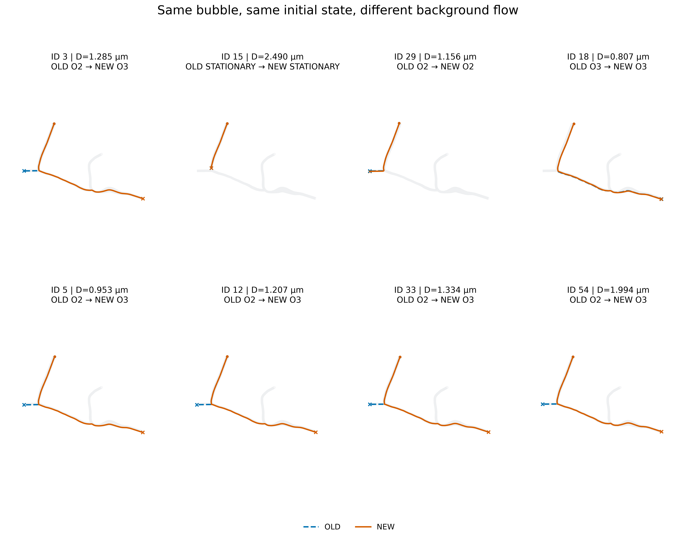
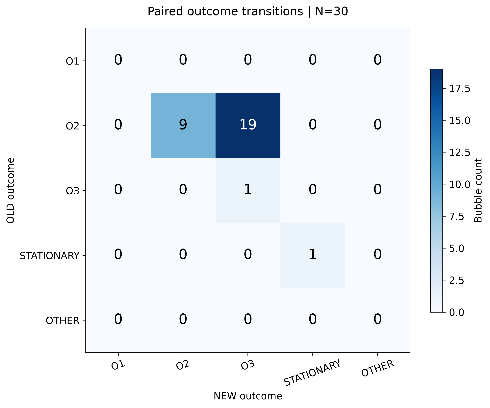

# 一句话结论

仅替换为 network-derived 背景流后，这 30 个固定 Bubble 得到 **29 completed、1 stationary、0 solver fail**；与 OLD 配对相比，**19 颗从 O2 改走 O3**。穿透、未解决 handoff 违规、NaN/Inf、未分类求解器损坏均为 0。最终状态：`NETWORK_FLOW_MB_VALIDATION_PASS_WITH_STATIONARY`。

| N=30 固定配对组 | completed | stationary | solver fail | O1 | O2 | O3 |
| --- | --- | --- | --- | --- | --- | --- |
| OLD | 29 | 1 | 0 | 0 | 28 | 1 |
| NEW | 29 | 1 | 0 | 0 | 9 | 20 |

# 为什么停止 Taylor-Hood

Taylor-Hood 已安全停止并保留全部已有进度。原 ILU2 超过 25 分钟且主存约 36 GiB，RCM 后 ILU2 出现 GPU OOM；停止前最后一次单步 ILU1 smoke 已自行正常退出，但仍没有完整稳态 P2 解。因此按资源工程成本停止，不构成 Taylor-Hood 科学失败。详见 [停止说明](TAYLOR_HOOD_STOP_NOTE_ZH.md)。

状态固定为 `TAYLOR_HOOD_VALIDATION_STOPPED_RESOURCE_COST`。本机 37,689 个、服务器 2,685 个先前受保护文件检查均为 0 变更；没有删除失败日志，也没有继续调试或运行完整 P2 求解。

# 新旧流场有什么区别

OLD 使用原 equal-pressure 2.0 mm/s 场，NEW 使用网络推导的出口压力场。NEW authoritative VTU 由 case 的 `reports/physics_validation_H0.json` 中 PASS export 记录定位并核对 SHA，未按名字猜测。

重新从实际 VTU 对原始边界三角形进行 P1 精确积分：OLD 的 O1/O2/O3 = **4.257917/85.205026/10.537057%**；NEW = **6.540825/44.820122/48.639054%**。两者 Qin = 1.5513591604402322e-14 m³/s，原始双精度求和相对总质量残差约 2.03e-16，均通过。独立已存审计使用补偿求和得到另一舍入量级的残差；本轮不将残差强制置零。

OLD SHA256：`129ebb77396550b300b20ce29cde7b03919e6037b7a81de60fe75d6c6efb616d`。NEW SHA256：`064cbd28f3efa72f426fc946b2f29da21f056c596609095e7283d39070aa55f4`。

两者均为 70,363 点、371,402 个 TET4。坐标、连接、WALL/INLET/O1/O2/O3 及 Global IDs 的 numeric equality 和 bitwise equality 均通过。[几何契约](data/old_new_flow_contract.json)及[重新积分结果](data/reintegrated_flow_flux.json)保存全部路径和哈希。

# 这一轮哪些东西没有改变

同一 ID 的直径、物理半径、初始位置、四元数、保存的初始速度与角速度、seed/stream、初始 tetra 全部相同。原 P9-A.1/P6.5、nearfield、lubrication、壁面流体动力学、translation–rotation、contact、handoff、active-set、积分、终止与出口分类均保持原实现。dt=0.00025 s、物理 horizon=1.5 s、所有原有安全终止门槛不变。SonoVue、浓度、半径和 clearance/floor 未改。

本轮新增的 adapter 仅负责选择已冻结输入和装入已保存的初始状态，调用原 `integrate_admitted`、`Particle9AStepper` 与原可选诊断观察器。NEW 后续每一步读取 NEW 的速度/梯度。没有速度平滑、divergence 修正、重新求 FEM、入口改动或任何动力学调参。

本机保护清单涵盖 206 个原有包内文件（含全部源码及既有缓存），最终变更与新增均为 0；服务器独立快照 114 个源码/源码资产文件也为 0 变更。旧服务器目录少了若干后来增加的诊断模块，故本轮同步并验证了完整本地快照，而未使用旧服务器目录静默替代。

# 30 个 paired Bubble 是什么

完全恢复历史 **P9-A.1 smoke30** 的 30 个稳定 ID，master seed=202609249。沿用历史 Method B 外部 inlet 的已接受事件；没有重新生成 population，没有使用 Method C 或 P9-A.3 interior injection。历史随机分位数没有单独落盘，但精确 anchor、position seed、完整事件元数据和已保存的状态都可恢复，所以无需重抽样。

唯一永久 cohort：[paired_cohort_manifest.csv](data/paired_cohort_manifest.csv)，SHA `1ad59e2cc4fe78e3502b9f2589a9914b6ba6f15e9659bd940f10bab1ecf568a2`。其配套 [paired_events.json](data/paired_events.json) 和 [paired_initial_states.json](data/paired_initial_states.json)保存全部状态。OLD/NEW 的 finite sphere admission、fluid inclusion、wall clearance、open-cap 规则与 initial tetra 对所有 30 颗都相同且可接受。

历史 OLD 的 flow SHA、当时全部 106 个 Python 源码哈希、各事件哈希、初始数组及轨迹文件哈希均匹配，故直接复用其完整轨迹与诊断日志，原输出不改写。配对表并未把两批不同抽样的泡混在一起。

# 同一颗 Bubble 的路线发生了什么

| OLD → NEW | 颗数 |
| --- | --- |
| O2 -> O3 | 19 |
| STATIONARY -> STATIONARY | 1 |
| O3 -> O3 | 1 |
| O2 -> O2 | 9 |

改变出口的 ID：3, 5, 7, 10, 11, 12, 14, 17, 19, 22, 24, 26, 27, 28, 33, 42, 50, 53, 54。没有 O3→O2，也没有 stationary 与 completed 之间的转变。[逐泡配对表](data/paired_outcome_transition.csv)保留所有 30 行。

Figure 02 的八颗示例按 outcome 类别、稳定 ID 和直径跨度选取，规则在 [representative_selection.json](data/representative_selection.json)，未按轨迹外观挑选。蓝色虚线为 OLD，橙色实线为 NEW；重合段可能互相覆盖，不表示丢失 OLD 轨迹。

# stationary 怎么变了

OLD 的唯一 stationary 为 **ID 15，D=2.489958 µm**，NEW 中仍 stationary，恢复数 0，新增加数 0。末态位置约 (92.8863, 46.6312, 114.7719) µm，新旧差距处于几何舍入预算内；wall gap 约 2 nm，NEW 局部流速约 6.0812 mm/s，并非当地流体停滞。

两组末段连续 32 个已接受求解均有 3 个独立接触约束，rank=3、非负乘子，平移速度处于原求解器 velocity budget 内。证据支持当前刚性有限尺寸模型下的接触静止结果，不是软件失败，也不等于体内生理捕获的实验证据。没有做虚拟半径或变形实验。

# transit time 怎么变了

仅比较两组均 completed 的 29 颗：平均 **37.962→70.318 ms**；配对差值中位数 +56.654 ms，NEW/OLD 比值中位数 3.068。28 颗变慢，1 颗变快。ID 18 虽仍走 O3，时间由 367.163 ms 降至 86.910 ms，所以均值和中位数描述不同。stationary 的 33 ms 等已模拟时间不当作 transit time。

# near-wall exposure 怎么变了

30 颗各自最小 wall gap 的中位数在两组都约 2 nm；均值 **3.618→2.320 nm**。这与原 molecular/handoff floor 保持不变相容，不能据此宣称发生穿透。最小 h/a 中位数约 0.003344→0.003284。基于已保存接受步的 h/a≤0.1 暴露时间，均值约 **10.713→17.543 ms**；这只是离散路径诊断，不是新积分或新壁面模型。

# point tracer 和 Bubble 有什么区别

没有找到与本 cohort 30 个中心逐一匹配的既存 NEW tracer 记录，因此只从这些相同中心运行原有 double-precision tetra-adjacency P1 RK23 诊断器，step=0.2 µm、error=1e-11、path horizon=2 mm。没有重新审核全场。全部 30 tracer 到达原始出口三角形，并由原分类器复核。

| NEW point tracer → NEW MB | 颗数 |
| --- | --- |
| O3 -> O3 | 18 |
| O3 -> STATIONARY | 1 |
| O2 -> O3 | 2 |
| O2 -> O2 | 8 |
| O1 -> O2 | 1 |

**3 颗两者均完成但出口不同**：ID 26、27（point O2，MB O3），ID 46（point O1，MB O2）。另有 ID 15：point O3，MB stationary。因此总 outcome difference 为 4，不能把 stationary 也计作“换出口”。这表明同一初始位置的有限尺寸与壁面动力学能进一步改变背景流路由。

# 有没有 penetration / solver failure

NEW 的 penetration=0、采样态 handoff violation=0、全部连续证书（含分段 union 的子证书）违规=0、NaN/Inf=0、未分类 solver corruption=0、solver fail=0、inlet escape=0。ID 15 的 stationary 单独按接触证据审核，未伪装成 completed。

1 worker 与 3 workers 在 ID 3/15/22 上的完整 samples、终点、状态、出口、时间和解压事件日志逐位一致，正式 6 workers 的同三颗也一致。永久测试 **12 passed，7.58 s**。首次新测试只识别单段证书，遇到 union 证书产生 KeyError；已保留初次日志并补充逐段审核，未改动力学、数值参数或轨迹。

NEW 30 泡服务器轨迹阶段 **123.13 s（6 workers）**；同中心 point tracer 阶段 0.480 s。1-worker/3-worker 预检分别 62.50/27.08 s，并行启动；这些阶段计时不含输入加载、传输、制图和报告时间。OLD 本轮复用，不重复积分。

# P1 局部 conservation limitation

NEW 总流量与分流验证通过，但 **P1/P1+VMS 局部守恒仍不完美**。实际已有审计的 599 个合法 root 截面（612 个候选中 13 个按几何排除）：max flux deviation **3.454212%**，RMS **1.789924%**。引用的原始 JSON/CSV 已按 SHA 复制为 [known flow limitation](data/known_flow_limitation_sources.json)。本轮接受并显式保留这个模型限制，没有修复或掩盖它；也未运行 P2 对照。

# 这一轮能说明什么

在原有 Particle 科学实现、几何、固定初始状态和容差下，新出口边界条件得到的冻结 3D 流场如何改变这一组微泡的出口、通过时间及近壁经历；并支持当前 30 泡的数值安全性与 worker 确定性。

# 这一轮不能说明什么

N=30 是历史固定 paired validation cohort，不是新 entering population；其 O1/O2/O3 数量不能当作真实微泡分流，更不能与 fluid 6.54/44.82/48.64% 做统计等价判断。网络推导边界条件没有因本轮通过而成为 physiological ground truth。stationary 也不能单独证明体内捕获或排除真实可变形效应。

# 是否建议进入正式大样本

建议 **`READY_FOR_LARGE_SAMPLE_REVIEW`**：数值安全门槛、确定性与失败审计通过，仍需用户人工审核本报告和 ID 15 的模型含义后决定下一阶段。**本轮未启动 500 MB production。**

全部机器可读结果：[final_summary.json](data/final_summary.json)。详细[配对审核](PAIRED_OLD_NEW_TRAJECTORY_REVIEW_ZH.md)及[安全审核](NEW_FLOW_MB_SAFETY_AUDIT_ZH.md)。服务器独立工作区：`/workspace/particle_network_flow_mb_validation_v1_20260924T210047Z`。
