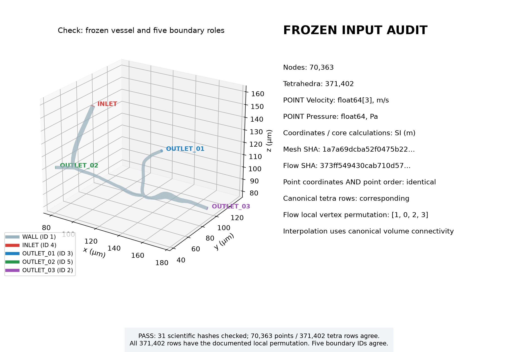
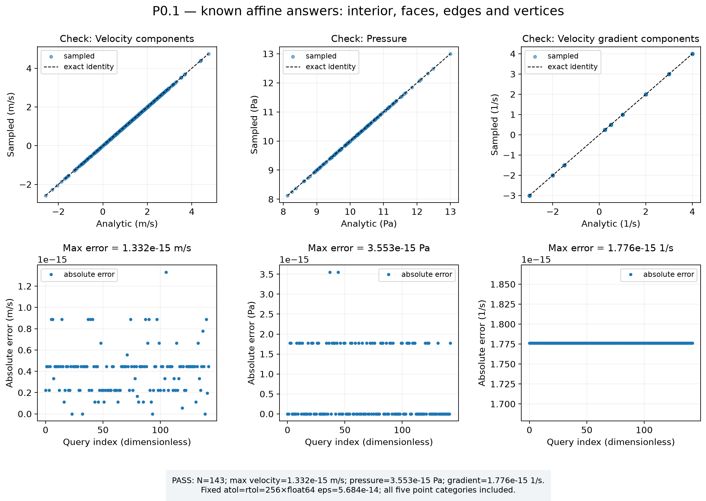
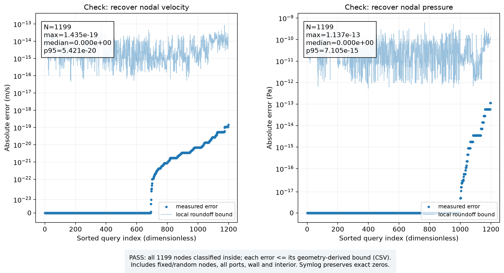
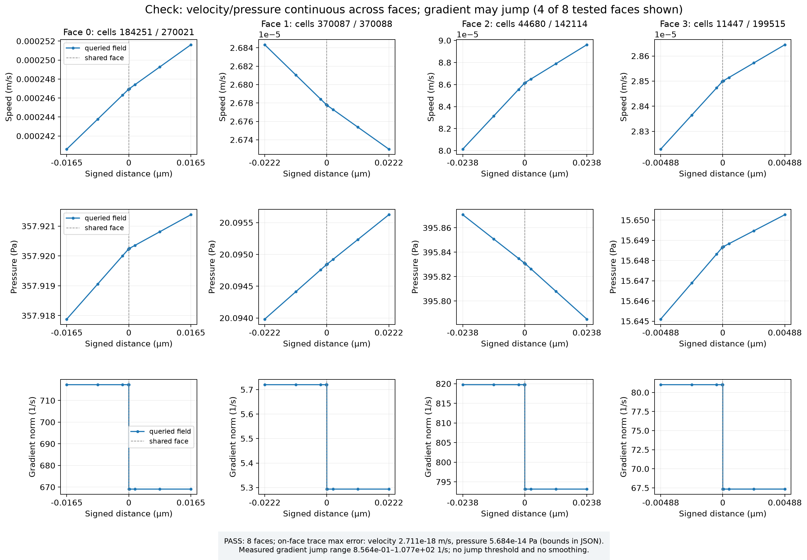
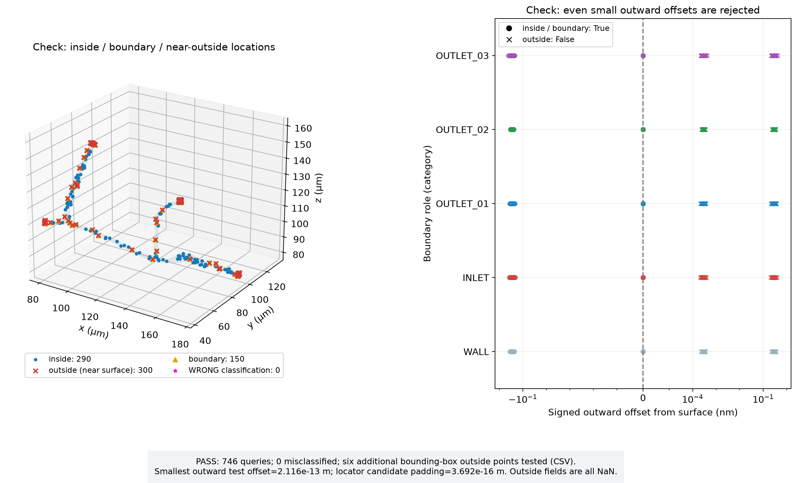
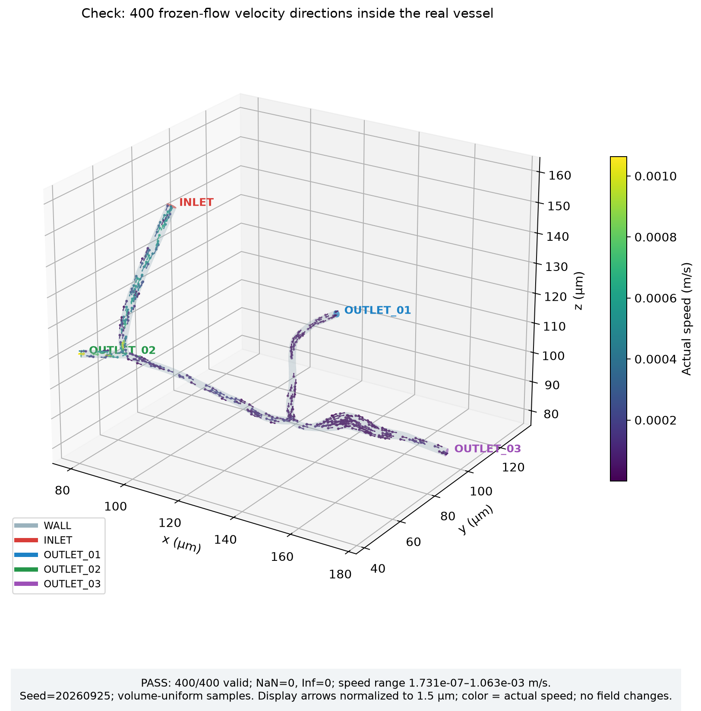
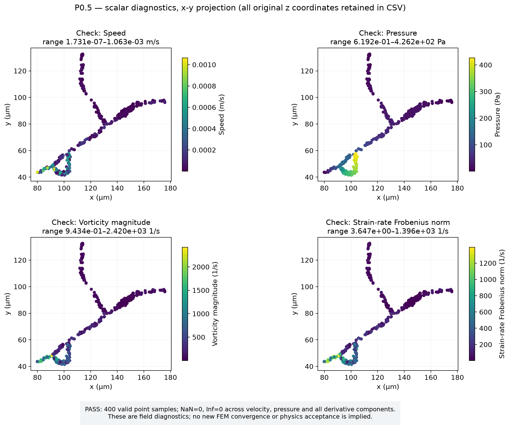

# Particle-0 人工审核报告

## 1. 这一阶段做了什么

这一阶段建立了一个只读的三维流体场查询接口 `FrozenFEMField`，没有移动任何微泡或 RBC。
给它一个以米表示的位置，就返回速度、压力、三项导数信息，以及位置是否在域内和所属四面体编号。
正式单元和顶点编号来自冻结体网格，速度和压力只读取冻结流场的节点数组。
先用人工知道答案的四面体检查数学，再用真实节点、共享面和血管边界检查实际文件。
每个小步骤都保留了永久测试、PNG 图、作图数据和中文说明。
批量查询已与逐点查询比较，CPU 计时仅作信息记录。
整个阶段只在 WSL CPU 上运行，下一阶段尚未开始。

## 2. 输入有没有变

FEM 保持只读，**本阶段修改 FEM：NO**。开发目录为 `/home/lzy/projects/ulm_particle_3d_particle0`。

| 输入 | 当前记录 |
|---|---|
| mesh SHA256 | `1a7a69dcba52f0475b2280775921e4dedcdfefa67b7965096d86cb9dba38bdf9` |
| flow SHA256 | `373ff549430cab710d57eb4406f2e7588f7a5bb68ebaa68cf32f8da5662e26f1` |
| 节点 / 四面体 | 70363 / 371402 |
| 边界 | WALL=1，OUTLET_03=2，OUTLET_01=3，INLET=4，OUTLET_02=5 |
| Frozen Git branch | `sync/fem-simvascular-stage-q-particle-handoff-20260920` |
| Frozen Git commit | `c83dccea0f1fe5cd9fd3f5939e2eba883aeba9c2` |
| Particle Git branch | `dev/particle-0-frozen-fem-sampler-20260920` |
| 被测试的实现提交 | `7cfe5141382600e28582f05bff712a6f09c38a39` |

`git_commit` 指向被测试的实现提交；随后可以有只保存报告和日志的证据提交。代码和测试的逐文件 SHA 保存在机器记录 `source_sha256`，便于对应。

网格实际路径：`/home/lzy/projects/ulm_particle_3d_particle0/formal_3D_flow_solver/FEM_SimVascular/frozen_reference/SV_MESH/mesh-complete.mesh.vtu`。

流场实际路径：`/home/lzy/projects/ulm_particle_3d_particle0/formal_3D_flow_solver/FEM_SimVascular/frozen_reference/flow/steady_flow_stage_sv1_3q.vtu`。

你给出的旧路径 `/home/lzy/projects/formal_3D_flow_solver/FEM_SimVascular` 没有 handoff/manifest，且已有历史改动；它被原样保留，前后 Git 状态已对比。总仓库中已有指定的干净冻结分支，本次从它建立独立开发 worktree，按其中 manifest 定位输入。没有修改、清理旧目录，也没有修改 main 或 frozen branch。

开始前和结束后运行官方只读检查。最终 worktree 内两个完整性脚本均返回成功；完整官方 handoff pytest 在仍保留冻结分支名的原 checkout 运行，结果 18 passed、0 failed。历史测试会锁定分支名称，故不能把它改成在 Particle 分支上假装仍是冻结交接；原测试未修改。

SonoVue：`/home/lzy/projects/sonovue_size_distribution_v0/`，对应分支 `codex/sonovue-size-distribution-20260920_111258`，仅登记存在，没有读取它生成粒子或修改 sampler。旧 2D 两个参考文件只阅读组织方法，没有复制二维插值或 RBC 代码。

## 3. 我们怎样查询一个位置

```text
位置（m）
  → VTK 空间索引枚举可能的 tetra（四面体）
  → 用自己的四面体公式验证位置，算四个权重
  → 按 canonical volume 的四个全局节点编号取 Velocity / Pressure
  → 对节点值加权，返回速度 / 压力
  → 从四面体节点速度差计算 gradient
  → 返回 vorticity / strain rate
```

barycentric weights 就是位置分别靠四个顶点多少的四个贡献权重。令 `A=[x1−x0,x2−x0,x3−x0]`，计算 `N[1:]=inv(A)@(x−x0)`，`N0=1−sum(N[1:])`。

gradient 是速度沿三个空间方向变化的快慢，固定定义 `G[i,j]=∂u_i/∂x_j`。vorticity 是流动的局部旋转趋势，按 curl(u) 的三个分量计算。strain rate 是流动的局部拉伸和剪切快慢，使用 `(G+G.T)/2`。

线性四面体内这些导数是常数。共享面上的速度和压力连续，但相邻四面体的导数可以不同；本次没有平滑。多个单元包含同一点时选最小 canonical 零起始 tetra_id，所以面、边和顶点上的结果确定可重复。

几何容差固定为 `tau=64*eps*kappa_inf(A)*(1+c/h)`，其中 `h=||A||inf`，`c` 为该单元节点坐标最大绝对值。eps 是 float64 舍入尺度，kappa 衡量单元形状放大误差的程度，`c/h` 计入 SI 坐标相减误差。64 为固定的一小段减法、求逆和乘加留出舍入余量，未随测试结果调整。候选包围盒仅扩展 `max(4*tau*h)`，最终仍按每个单元自己的权重判断；`tau>=sqrt(eps)` 则拒绝几何。

本次最大 kappa=41.2181，最大 tau=1.061069e-10，候选搜索 padding=3.691652e-16 m。最小明确域外测试偏移 2.116169e-13 m，远大于浮点搜索余量。

精确落在闭合域表面上时 `inside_lumen=True`；域外返回 False、tetra_id=-1，速度、压力和所有导数量统一为 NaN。无效坐标形状或 NaN/Inf 输入抛出 ValueError。这个规则只说明场是否存在，不说明有半径的粒子能否放在墙上。

## 4. 自动测试结果

Particle-0：**46 passed / 0 failed / 0 skipped**。

| 检查 | 结果 | 实际误差 / 数值 | 测试文件 |
|---|---|---|---|
| 冻结输入与边界 | PASS | 31 个科学 SHA；4602 个 payload 文件；坐标/顺序一致 | [ test_frozen_input_integrity.py ](../../tests/particle0/test_frozen_input_integrity.py) |
| 人工速度、压力、梯度 | PASS | 速度 1.332e-15 m/s；压力 3.553e-15 Pa；梯度 1.776e-15 1/s | `test_affine_*.py`, `test_tetra_barycentric.py` |
| 真实节点回采样 | PASS | 1199 次；速度 1.435e-19 m/s；压力 1.137e-13 Pa | [ test_real_node_back_sampling.py ](../../tests/particle0/test_real_node_back_sampling.py) |
| 共享面速度、压力 | PASS | 8 个面；速度 2.711e-18 m/s；压力 5.684e-14 Pa | `test_shared_face_velocity_continuity.py`, `test_shared_face_pressure_continuity.py` |
| 单元内常梯度、跨面记录 | PASS | 跳变量 8.564e-01–1.077e+02 1/s；不设跳变失败阈值 | [ test_gradient_piecewise_constant.py ](../../tests/particle0/test_gradient_piecewise_constant.py) |
| 顶点排列 | PASS | 人工 24 种 flow 排列和真实另一种排列，结果完全一致 | [ test_vertex_order_regression.py ](../../tests/particle0/test_vertex_order_regression.py) |
| 域内 / 域外与闭合边界 | PASS | 746 点，错误 0；306 域外点全部 NaN | `test_inside_outside_contract.py`, `test_boundary_point_contract.py` |
| 真实随机场 | PASS | 400 点；NaN=0、Inf=0 | [ test_real_random_field.py ](../../tests/particle0/test_real_random_field.py) |
| 标量 / 批量 | PASS | 413 个混合位置，差异项数 0 | [ test_scalar_batch_equivalence.py ](../../tests/particle0/test_scalar_batch_equivalence.py) |
| 文件、数组保护和图数据 | PASS | 全部 8 图及源数据保留；拒绝输入数组别名修改 | `test_sampler_ownership.py`, `test_review_artifacts.py` |

人工场预设 atol=rtol=5.684342e-14，来自 `256*eps`。真实节点误差上界为 `4*tau*局部值跨度 + 16*eps*局部最大绝对值`；共享面为 `4*tau*局部最大绝对值`，各点实际界保存在数据文件。本轮没有为通过测试放宽任何科学标准。真实梯度没有连续真解；“最大 gradient error”明确指人工场，不冒充真实 FEM 的物理误差。

完整输出见 [Particle 测试日志](logs/particle0_pytest.log)、[JUnit 结果](logs/particle0_junit.xml)、[冻结验收摘要](logs/final_check_commands.json)。所有新增文件见 [FILES_CHANGED.txt](FILES_CHANGED.txt)。

## 5. 人工审核图片



应检查血管形状和五个边界位置是否符合交接。图中显示一个入口、三个出口和壁面，节点数、单元数与 manifest 一致；文件哈希没有异常。



上排应落在解析值等于采样值的对角线上，下排看误差大小。143 个位置的结果与已知答案吻合，最大梯度误差 1.776e-15 1/s，未发现超出预设界的误差。



看实际误差与各点计算出来的舍入上界。1199 次查询全部恢复节点值到浮点精度，速度/压力中位误差都为零；图保留精确零值，没有用假小数代替。



重点看速度和压力在距离零处衔接，第三排梯度可以切换。图展示 8 个受测面中的 4 个，速度/压力没有数值断裂；梯度台阶是本次离散场的预期行为，左右九个分量都在 CSV。



左图看采样位置覆盖，右图看沿实际法线向域外移动后是否被拒绝。746 点中误分 0 个，红叉为域外测试位置，错误分类另用紫星标识，本次紫星数量为零；极近位置在全局图会重叠，右侧距离图用于核对。



检查箭头方向与血管走向是否协调，尤其是入口和各出口附近。400 个有效点的速度范围 1.731e-07–1.063e-03 m/s，较快区域集中在入口至 OUTLET_02 支路附近；箭头统一显示长度以便看清低速分支，颜色保留实际速度。自动检查未发现域外点或无效数值，流向的最终视觉认可仍等用户确认。



分别看速度、压力、局部旋转和局部拉伸剪切，不把不同单位放进同一色标。各图为 x-y 投影，原始 z 坐标及全部分量在 CSV；400 个样本没有 NaN/Inf，也未做平滑，但这不构成新的 FEM 物理验收。


这里看查询数量增加时耗时怎样变化。10000 点批量耗时为 21.369 s，逐点与批量的返回值完全一致；计时只跑一次、只做信息记录，没有性能通过阈值，也没有为性能改变科学实现。

全部图片由永久脚本 [generate_particle0_report.py](../../scripts/generate_particle0_report.py) 生成，各步原数据在 [data](data/)；三维表面图通过 `00_frozen_input_summary.json` 中的路径及 SHA 重读全部原始边界三角形。只在绘图层把米转成 µm/nm，未移动、重采样或修改原 FEM 数据。

## 6. 当前已知限制

- FEM 本身仍然是 frozen Stage Q。
- 没有重新做 mesh convergence（网格加密后结果是否稳定的检查）。
- 没有重新做 FEM timestep study（改变流体计算时间步后的敏感性检查）。
- 没有做新的 CPU/GPU field equivalence（两种计算设备输出流场是否一致的检查）。
- gradient 是 linear tetra 内 piecewise constant，也就是每个线性四面体里是常数，跨面可跳变。
- Particle-0 没有真实粒子、微泡或 RBC 状态。
- 还没有 wall gap，即有限半径粒子与壁面的间隙。
- 还没有 particle dynamics，即粒子随时间运动的方程或积分。
- SonoVue sampler 尚未接入正式 particle population。
- 极端无法用 float64 分辨的四面体会明确报错；本次真实网格不触发该拒绝。
- 批量接口首先保证正确，当前使用逐点科学实现；计时不代表生产性能，未控制 WSL 全部背景负载。

## 7. 人工审核状态

AUTOMATED_CHECKS = PASS

MANUAL_VISUAL_REVIEW = PASS

下一阶段：Particle-1。**尚未开始 Particle-1**。本轮只作本地提交，没有 push、merge main、启动 GPU server 或重新求解 FEM。

## 用户审核证据更新（不改数值代码）

审核日期：2026-09-20（Europe/Zurich）。Reviewer = USER_CHAT_REVIEW；blocking issue = NONE。

用户已审核本报告、验证 JSON 和全部 8 张图，人工审核通过，并授权开始 Particle-1。用户明确未要求增加 Particle-0 增强测试；沿用现有 46 项回归测试。以上历史运行记录和图注保留原样，末节的“尚未开始 Particle-1”描述的是 Particle-0 当次交付状态。
