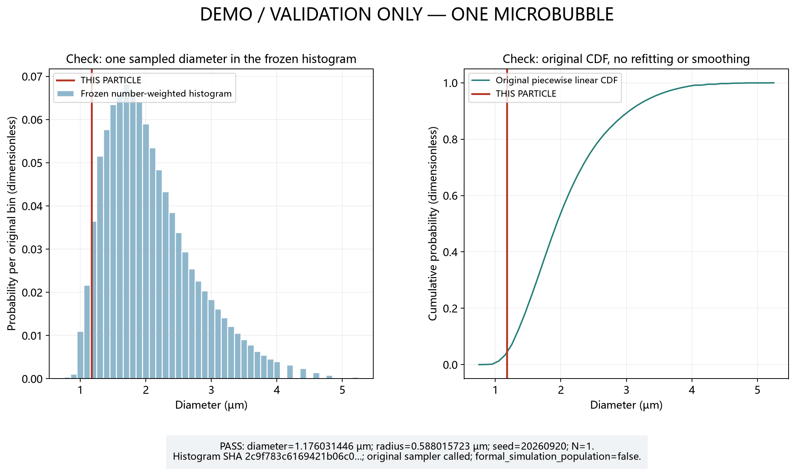

# Particle-1 小步骤 1 检查说明

固定 seed=20260920 调用原始 SonoVue sampler 抽一个验证直径，为 1.176031446 µm；半径为 5.880157228e-07 m。适配层只把 µm 转为 m，再除以二，不改变 histogram、CDF（累积概率曲线）或随机算法。CSV 相邻 metadata 绑定样本文件 SHA；没有生成正式粒子群。

