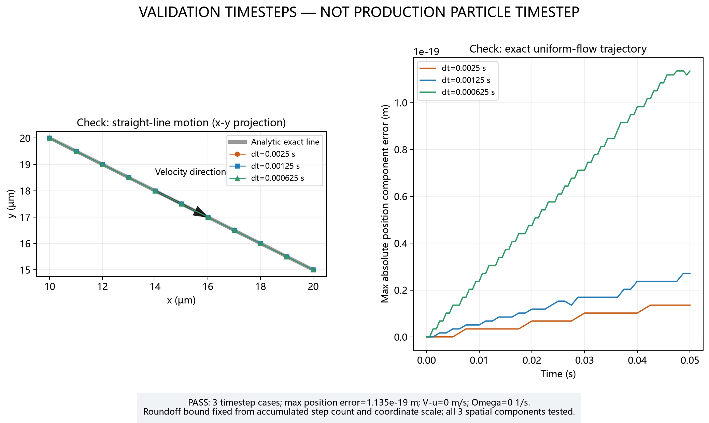
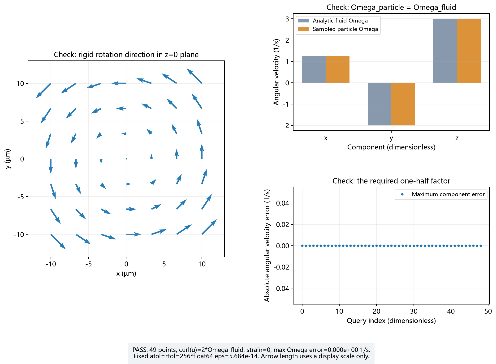
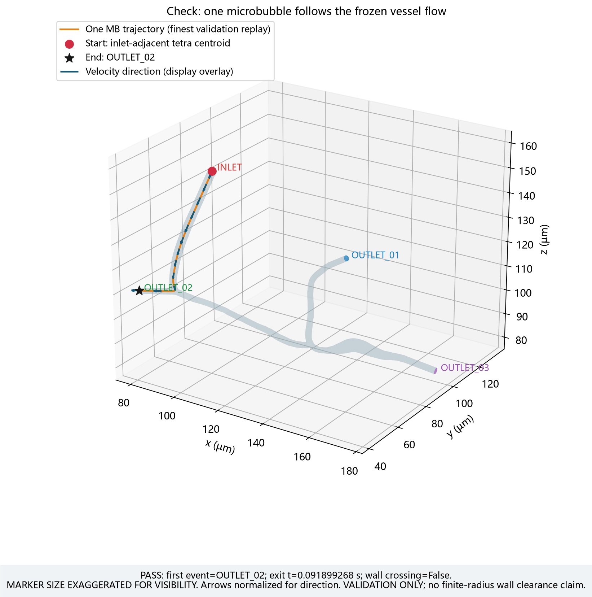
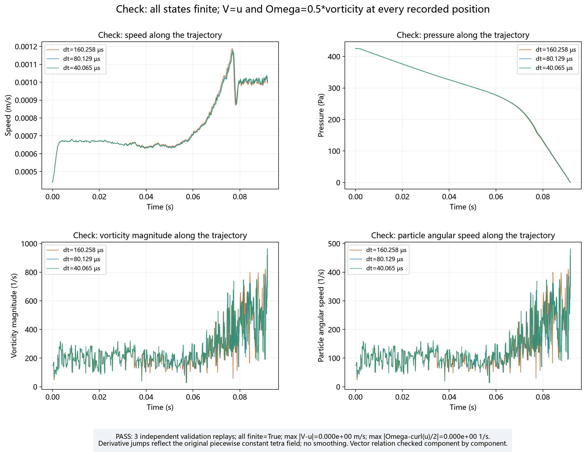

# Particle-1 人工审核报告

## 1. 这一阶段做了什么

这一阶段第一次让一个球形微泡在冻结的三维 FEM 流场里真正运动。
微泡每到一个位置，就向 Particle-0 查询当地的流体速度和旋转信息，
再用显式 Euler 更新位置。这里只有一个微泡；三个时间步结果是同一微泡的三次独立验证重放。
每一步开发都永久保留测试、PNG、CSV/JSON 源数据和简短中文说明。
本轮在 WSL CPU 完成，没有运行 CFD，也没有进入 Particle-2。

开发目录：/home/lzy/projects/ulm_particle_3d_particle0

Particle-1 branch：dev/particle-1-single-mb-20260920

被测试的实现 commit：6e59c605cb8251b9fa2e80d2dbed0cfa6daaf03c

机器记录中的 git_commit 指向已提交的源码版本；随后可有仅保存最终报告和日志的证据提交。
代码、测试、脚本、图片和数据的逐文件 SHA 保存在 PARTICLE1_VALIDATION.json。

## 2. 沿用了什么

| 依赖 | 本轮处理 |
|---|---|
| Particle-0 implementation | 7cfe5141382600e28582f05bff712a6f09c38a39，源码、数学、容差和原测试保持字节一致 |
| P0 人工审核 | 用户已审核现有报告、JSON 和 8 图；记录 PASS / USER_CHAT_REVIEW |
| P0 evidence-only commit | 889e2686060f924d2b1a0137e9a88e63292d2378，只更新原报告和 JSON |
| Frozen FEM base | c83dccea0f1fe5cd9fd3f5939e2eba883aeba9c2，只读 |
| Frozen branch | sync/fem-simvascular-stage-q-particle-handoff-20260920，未改动 |
| mesh SHA256 | 1a7a69dcba52f0475b2280775921e4dedcdfefa67b7965096d86cb9dba38bdf9 |
| flow SHA256 | 373ff549430cab710d57eb4406f2e7588f7a5bb68ebaa68cf32f8da5662e26f1 |
| SonoVue histogram SHA256 | 2c9f783c6169421b06c057e16653878e7385139a179682c0648519e72a9f5198 |
| SonoVue version | SONOVUE_CONTINUOUS_EMPIRICAL_INVERSE_CDF_V0 |

P0 人工审核日期和授权证据完整保存在本次 JSON 的 particle0_manual_review_evidence，
包括 reviewer=USER_CHAT_REVIEW、blocking issue=NONE、不要求增强 P0 测试、允许开始 P1。
本次没有增加全节点回采样等 P0 增强项目，只重复原有 46 项回归测试。

SonoVue 原目录为 /home/lzy/projects/sonovue_size_distribution_v0，全部 24 个 manifest 文件重新核验一致。
适配层只调用原函数抽取一个样本，并完成 µm→m→半径的换算，没有复制或修改 sampler。
seed=20260920，直径 1.1760314455311 µm，
半径 5.88015722765549e-07 m；formal_simulation_population=false。
样本 CSV 旁边有绑定文件 SHA 的 metadata。
本次环境 NumPy 2.5.3、Python 3.13.11，
核对的是同一环境中原始 sampler 的精确输出，不声称不同 NumPy 版本逐位一致。

旧 2D 参考代码只用于了解 field 与 state 分开的组织方式，没有复制二维坐标、µm 核心单位、
旧网格 cache、RBC drift 或二维边界行为。FEM 没有重新求解。

## 3. 单微泡现在有哪些状态

| 状态 | 含义 | 单位 / 形状 |
|---|---|---|
| particle_id | 当前微泡的编号 | 非负整数 |
| position_m | 中心的位置 | m，float64，3 分量 |
| radius_m | 微泡半径 | m，有限正 float64 |
| velocity_m_s | 平移速度 | m/s，float64，3 分量 |
| angular_velocity_s_inv | 旋转速度 | 1/s，float64，3 分量 |

状态拒绝非有限输入，数组不与外部输入共享可写内存。
返回新状态，不原地修改旧状态。没有质量、线加速度、角加速度、quaternion 或惯性积分。
球形外观不随朝向改变，因此当前只保存旋转速度。

位置更新为 x_new=x_old+dt*u(x_old)，dt 由调用者显式传入，必须有限且大于零，没有默认值。
更新后在新位置重新查询一次，只刷新输出 V 和 Ω，不再次移动位置。
因此每行速度与该行位置一致，位置积分仍是显式 Euler。
普通 motion API 的域外起点/终点会报错；逐段边界检查由独立的验证程序完成。

## 4. 为什么 V = u_inf

当前假设小球很快达到流体作用下的平衡速度。保留的阻力公式是：

F_hydro = −6πμa(V−u_inf)

μ 是动力黏度，a 是半径，V 是粒子速度，u_inf 是背景流速。
因为当前没有其它力，平衡要求 F_hydro=0，所以 V=u_inf。
这一步没有求解 m dV/dt=F，也没有偷偷加入重力、浮力或其它未批准的物理。
半径仍保存在状态和来源记录中，但在本阶段无其它力的平移速度公式中会消去。

## 5. 为什么 Omega = 0.5*vorticity

Particle-0 给出的 vorticity 是 curl(u)。在整体刚体旋转的人工流场中，
curl(u) 恰好是流体实际旋转速度的两倍，所以球形微泡取一半：

Ω_particle = 0.5 curl(u_inf)

测试专门使用三个非零旋转分量；若误写成 Ω=vorticity，永久回归测试会失败。

## 6. 自动测试

Particle-0：**46 passed / 0 failed**。
Particle-1：**67 passed / 0 failed**。
Frozen handoff：**18 passed / 0 failed**。
上述测试 skipped 均为 0。

| 检查 | 结果 | 误差 / 证据 | test file |
|---|---|---|---|
| P0 依赖与范围 | PASS | P0 原 26 个 Python 文件 SHA 一致；原 46 项测试不变 | test_particle0_dependency_locked.py、test_particle1_scope.py |
| 状态、单位和输入保护 | PASS | float64；3 分量；拒绝别名改写和非正半径 | test_microbubble_state.py、test_microbubble_units.py |
| SonoVue 原函数与只读 | PASS | seed 重现；原函数同环境精确匹配；24 个文件 SHA 一致 | test_sonovue_single_mb_adapter.py、test_sonovue_sampler_unchanged.py |
| Stokes 平衡与零旋转 | PASS | V−u 最大误差 0 m/s；Ω=0 | test_stokes_following_uniform_flow.py、test_zero_vorticity_zero_rotation.py |
| 均匀流解析直线 | PASS | 最大位置分量误差 1.1350241493207625e-19 m | test_uniform_flow_trajectory.py |
| 纯旋转及 1/2 | PASS | 最大旋转分量误差 0.000e+00 1/s | test_pure_rotation_angular_velocity.py、test_vorticity_half_factor.py |
| 显式一步与无惯性状态 | PASS | 使用旧点速度；输入保持不变；非法 dt 拒绝 | test_single_mb_step_api.py、test_step_does_not_modify_input_state.py、test_invalid_dt.py、test_no_inertial_acceleration_state.py |
| 确定性真实起点 | PASS | 全部 179 个候选；tetra_id=208001 | test_real_single_mb_initialization.py |
| 真实 V=u | PASS | 全部 4016 行重新查询 P0；最大误差 0.000e+00 m/s | test_real_single_mb_velocity_matches_fem.py |
| 真实 Ω=curl/2 | PASS | 全部 4016 行各分量；最大误差 0.000e+00 1/s | test_real_single_mb_rotation_matches_half_vorticity.py |
| 逐段边界与出口 | PASS | 4013 条线段；无 WALL/INLET；均为 OUTLET_02 | test_boundary_segment_classification.py、test_real_single_mb_no_wall_crossing.py、test_real_single_mb_outlet_classification.py |
| 时间步对比、图与源数据 | PASS | 3 个预先确定的减半 dt；8 图及数据齐全；可重新作图 | test_validation_timestep_comparison.py、test_particle1_review_artifacts.py、test_particle1_plot_generation.py |

测试文件均在 [particle1 tests](../../tests/particle1/)。Frozen integrity=PASS：
当前 worktree 的 validate_frozen.py 和 verify_manifest.py 全部通过，4602 个 payload 文件和 31 个科学 SHA 保持一致。
原有 18 项 handoff pytest 锁定 frozen branch 名称，因此在原干净 frozen checkout 执行，没有修改历史测试。

均匀流预设舍入界是 16*(step_count+1)*eps*max(abs(x0)+abs(u)*duration)，
因为累加次数更多可能产生更多浮点舍入；这里没有把极小舍入误差误称为 Euler 截断误差。
纯旋转预设 atol=rtol=256*eps=5.6843418860808015e-14，没有根据结果放宽阈值。

边界检查覆盖全部五个原始表面，使用 VTK 搜索候选后计算线段与三角形首次交点。
误差预算由 float64 eps、实际坐标尺度及三角形条件数决定。
同一边角同时命中时优先 WALL，再 INLET，再出口。专门的人工穿壁用例确认首次 WALL 就记录 FAIL 并停止，
保存原始试探端点和交点，没有反弹、推回、继续走或重调时间步。

真实起点是入口相邻 tetra 的中心，选择中心向内流速最大者，精确并列取最小 canonical tetra_id。
位置为 [0.00010343884423491545, 5.7755787565838546e-05, 0.00015849126066314057] m，速度为 [-2.983058177638452e-06, -0.00030541254544440874, -0.0003164417293694706] m/s。
最短局部边长为 2.819245124947e-07 m，起点速率为 4.397966457776e-04 m/s。
首次运行前按 dt0=0.25*最短边长/起点速率确定以下三个验证步长，没有根据是否穿壁试调参数。

| case | VALIDATION_ONLY dt (s) | 保存行数 | 首次边界 | 出口时间 (s) | 轨迹长度 (m) | 最大试探步长 (m) |
|---|---|---|---|---|---|---|
| 0 | 0.0001602584485360342 | 574 | OUTLET_02 | 0.091747776998 | 6.917382497453e-05 | 1.905476e-07 |
| 1 | 8.01292242680171e-05 | 1147 | OUTLET_02 | 0.091826841966 | 6.912572306213e-05 | 9.434027e-08 |
| 2 | 4.006461213400855e-05 | 2295 | OUTLET_02 | 0.091899268025 | 6.910142145305e-05 | 4.697439e-08 |

三条轨迹的全部 active 与终止状态有限；每条线段重新检查，没有 WALL 或 INLET 穿出。
出口时间按 Euler 线段内的交点比例计算，事件发生后立即停止。
最大一步位移只作信息记录，没有用任意跳跃阈值宣布人工审核通过。
相邻出口时间差为 7.906496777407e-05、7.242605939588e-05 s，差值略减小，
但不能据此宣布一阶收敛、验证真实连续流的误差或确定正式时间步。

完整命令和日志见 [final_check_commands.json](logs/final_check_commands.json)，
[P0 测试](logs/particle0_pytest.log)、[P1 测试](logs/particle1_pytest.log) 和 [Frozen 测试](logs/frozen_pytest.log)。
开发过程曾发生作图 JSON 的 NumPy 布尔值序列化错误，使后续图未生成，相关测试报 7 failed / 105 passed。
已修复序列化并重新生成全部图；原失败日志保留在 combined_development_tests.log，
修复后完整回归为 113 passed / 0 failed，最终独立回归结果如上。没有改变科学模型或容差来修复该问题。

## 7. 人工审核图片

- 应该看什么：P0 已接受、FEM 只读、只有一个球，依赖和 SHA 有来源。
- 实际看到了什么：流程从冻结场查询到 V=u、Ω=curl/2，再到位置更新。
- 有没有异常：自动来源核验通过；不代表用户已完成本轮图审。

- 应该看什么：原 histogram / CDF 上 THIS PARTICLE 的位置、直径、半径和 seed。
- 实际看到了什么：直径 1.176031446 µm，半径 0.588015723 µm，仅一个验证样本。
- 有没有异常：单位换算和原函数一致，没有重拟合分布或正式粒子群。

- 应该看什么：三套 dt 的点是否在解析直线上，误差轴的数量级。
- 实际看到了什么：轨迹重合，最大位置误差约 1.135e-19 m，速度误差为零。
- 有没有异常：均在预设舍入界内；较多步数产生较多舍入是预期现象。

- 应该看什么：左侧流向，以及右侧解析与微泡角速度的三个分量。
- 实际看到了什么：49 个位置的角速度误差为零，Ω=0.5*vorticity。
- 有没有异常：自动检查未发现漏乘 1/2 的错误；箭头长度仅为显示比例。

- 应该看什么：从旧位置沿旧点速度指向新位置，旁边的中文步骤。
- 实际看到了什么：位移等于 dt*u_old，新状态查场刷新 V/Ω，输入状态不变。
- 有没有异常：自动检查通过；图上的 marker 只作示意，不代表真实半径。

- 应该看什么：真实表面、入口和三个出口，以及微泡起终点、速度箭头、是否出现明显一步跳跃。
- 实际看到了什么：展示最细验证重放，轨迹由 INLET 附近走向 OUTLET_02；方向箭头叠加显示以免被透明表面遮挡。
- 有没有异常：逐段自动检查无 WALL/INLET 穿出；突然跳跃的最终视觉审核仍待用户。marker 已标明视觉放大，不证明有限半径壁面间隙。

- 应该看什么：四个独立单位的曲线，旋转速度与 vorticity 的一半关系。
- 实际看到了什么：速度和压力三套结果接近；旋转曲线细碎变化明显，Ω 始终满足逐分量的一半关系。
- 有没有异常：数值全部有限。导数跨 tetra 跳变来自原始离散场，未平滑，也未当作连续流体真解。

- 应该看什么：轨迹重合程度、出口分类、出口时间和路径长度随验证 dt 的变化。
- 实际看到了什么：三条轨迹接近、出口相同；出口时间差略减小，最细路径只是比较参考，不是解析真值。
- 有没有异常：没有自动判定异常边界事件；趋势只作开发验证，不确定 production dt，也不是 FEM timestep study。

## 8. 当前限制

- 只有一个 MB，且 MB 是球；没有第二个微泡或 RBC。
- 没有质量、线加速度、角加速度、惯性积分或 NVE。
- 没有 wall force、wall correction、wall reaction、contact、lubrication、adhesion 或 molecular binding。
- 没有 particle-particle hydrodynamics、MB-MB / RBC-MB interaction、collision 或多体阻力系统。
- 没有 Brownian、acoustic force、gravity、buoyancy、lift、added mass 或 Basset history。
- 没有 LAMMPS、正式 continuous injection、粒子删除生命周期、flux schedule、浓度或 hematocrit。
- 不穿 WALL 只说明本次中心轨迹在三个验证步长下未穿过表面，不证明有限半径球的 clearance。
- validation dt 不是 production dt；production_particle_timestep_frozen=false。API 仍要求调用者传入 dt。
- FEM 仍然 frozen，未运行新的 CFD、网格收敛或 FEM 时间步研究。
- Particle-0 gradient 仍然是 tetra 内常数，跨单元可跳变；未改变数学、容差或性能实现。
- 一次单微泡验证不等于正式 simulation population，不代表全部入口位置或全部尺寸已验证。
- 轨迹视觉上是否有突然跳跃仍需用户审核，不由任意硬阈值代替。

## 9. 人工审核状态

AUTOMATED_CHECKS = PASS

MANUAL_VISUAL_REVIEW = PASS

PRODUCTION_PARTICLE_TIMESTEP_FROZEN = false

FEM_MODIFIED = NO

PARTICLE2_STARTED = false

Particle-1 在此停止。只做本地提交，没有 push 或 merge main。
全部新增文件见 [FILES_CHANGED.txt](FILES_CHANGED.txt)，接口和复现命令见 [PARTICLE1_README.md](../../PARTICLE1_README.md)。

## 后续人工审核证据更新

用户已在当前聊天审核本报告、机器记录和 8 张图，并接受 Particle-1。

MANUAL_VISUAL_REVIEW = PASS

VISUAL_STEP_JUMP_REVIEW = PASS

STAGE_RESULT = PASS

reviewer = USER_CHAT_REVIEW

review_date = 2026-09-20

blocking_issue = NONE

particle2_authorized_to_start = true

这是 evidence-only 更新。上述开发过程及分次运行数据中的待审核描述为当时历史记录，未改写任何数值代码、测试、图或轨迹。
