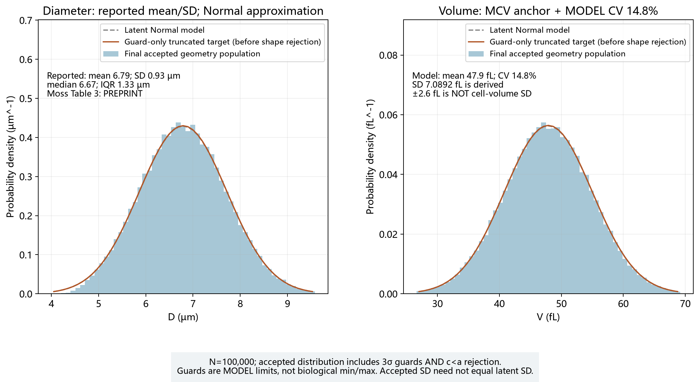
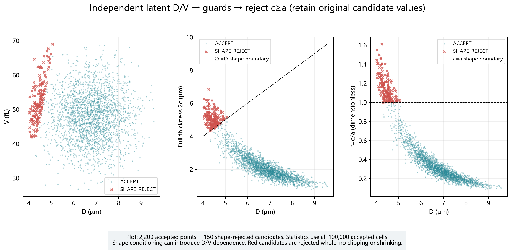
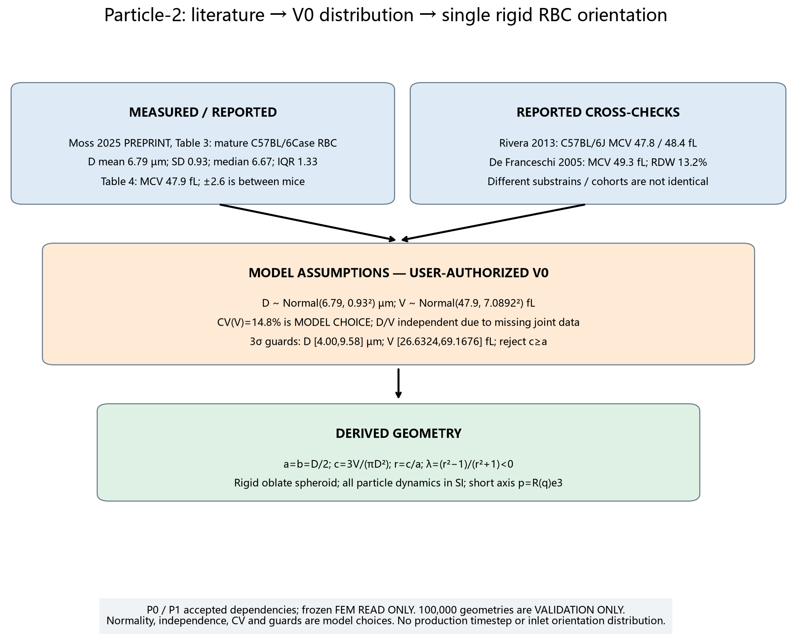
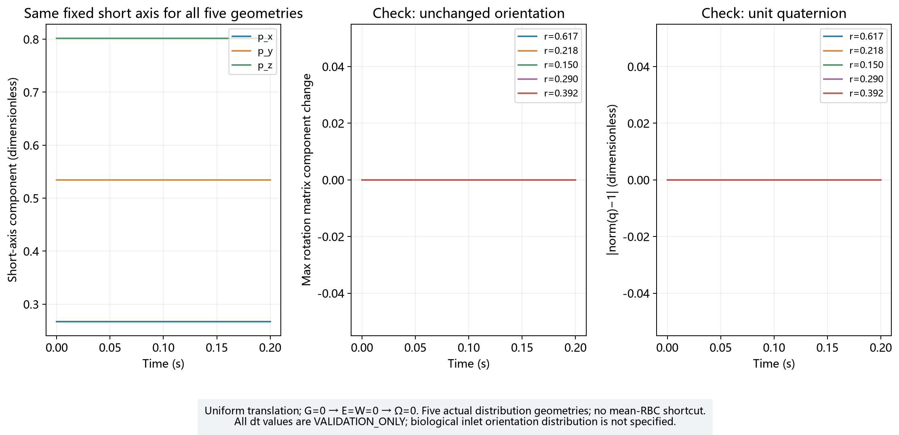
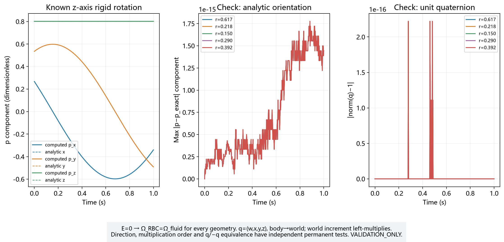
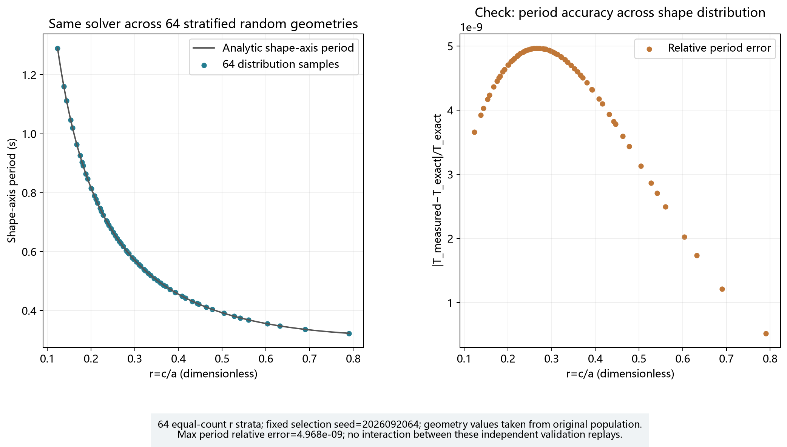
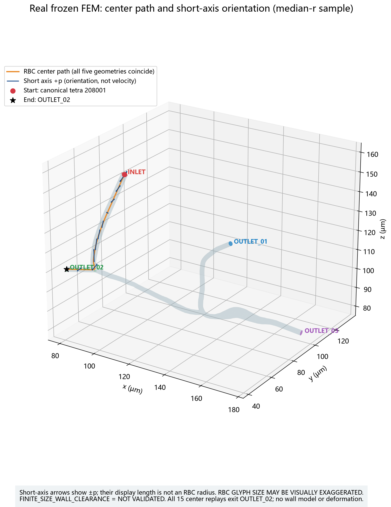
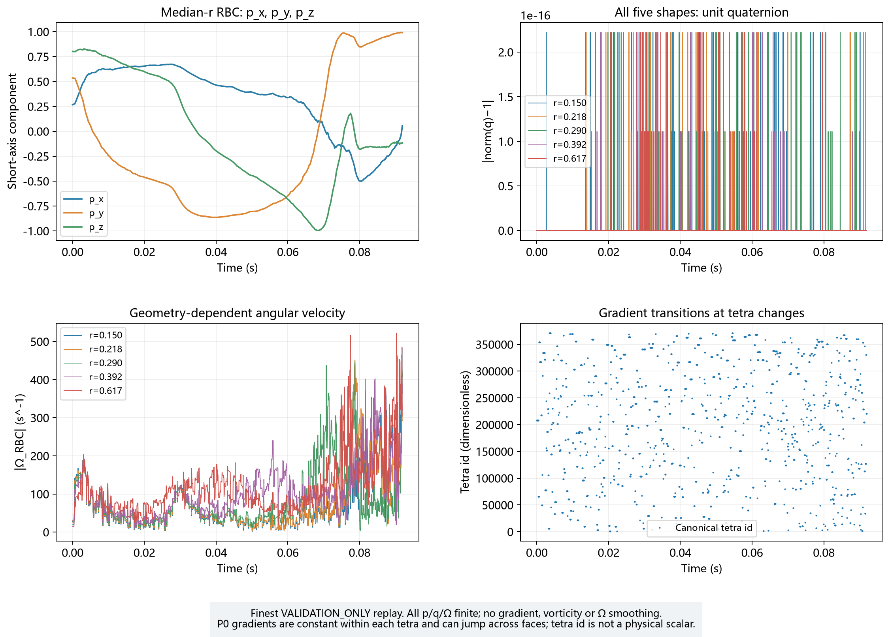
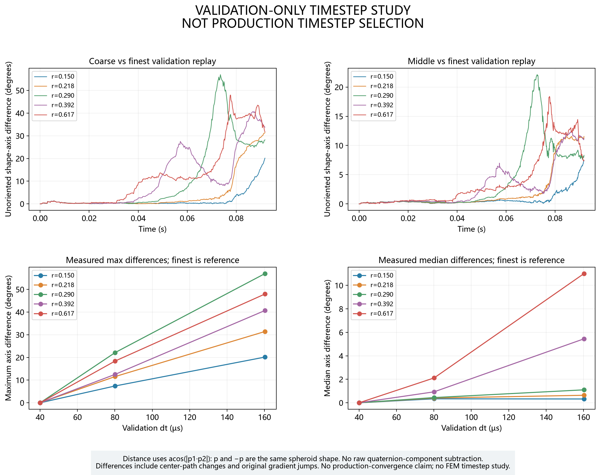

# Particle-2 人工审核报告

## 1. 这一阶段做了什么

第一次建立 C57BL/6 RBC 尺寸分布，再让分布中不同形状的单个刚性 RBC 平移和旋转。
100,000 个样本只验证几何分布；五个代表样本、64 个分层样本及真实 FEM 重放都是独立单 RBC 算例。
没有用一只“平均 RBC”替代分布。自动检查 **PASS**，本阶段人工审核已由用户接受，见第 10 节。

分支：`dev/particle-2-rbc-orientation-20260920`。被测试的实现 commit：`c704e08d39f6134da300fc91cc93c8561314a17b`。
机器记录指向已提交源码；之后仅保存报告和日志的证据提交不改变该实现。
P1 用户审核先以 `0b78c309390566c94c737742f1cfd926e2efe752` 单独提交：USER_CHAT_REVIEW、PASS、blocking_issue=NONE。
P0 依赖 `7cfe5141382600e28582f05bff712a6f09c38a39`；P1 依赖 `6e59c605cb8251b9fa2e80d2dbed0cfa6daaf03c`；FEM base `c83dccea0f1fe5cd9fd3f5939e2eba883aeba9c2`。
P0/P1 旧源码、测试、图片及数据逐文件 SHA 核验一致；FEM 冻结数据未变，也没有运行 CFD。

## 2. 文献真正告诉了我们什么

Moss 等 2025 年的 [PREPRINT](https://pmc.ncbi.nlm.nih.gov/articles/PMC12132290/) Table 3 报告
WT C57BL/6Case 成熟 RBC 共 1,156,720 个：直径 mean=6.79、SD=0.93、mode=6.67、median=6.67、IQR=1.33 µm。
Table 4 的 MCV 是 47.9±2.6 fL，其中 ±2.6 是不同小鼠 MCV 的变化，不能当成单细胞体积 SD。
这份来源不是经过同行评审的最终分布结论。

[Rivera 2013](https://pmc.ncbi.nlm.nih.gov/articles/PMC3656420/) Table 1 的 C57BL/6J 雌/雄 MCV 为 47.8/48.4 fL；
[De Franceschi 2005](https://pmc.ncbi.nlm.nih.gov/articles/PMC1895196/) Table 1 的 C57BL6 control 为 MCV 49.3±0.9 fL、RDW 13.2±0.9%。
后两者为同行评审文献，只交叉核查量级；不同亚系和测量体系没有被当成完全相同。
原文复核还发现 Moss Table 4 的 RDW=17.3±0.5%，**并非本项目的 14.8%**。
14.8% 按用户明确批准的 V0 选择保留，角色是 MODEL CHOICE，不冒充直径数据集的单细胞体积测量。

直接报告量是上述文献统计；正态分布、CV=14.8%、D/V 独立和三个标准差范围是模型近似/假设；
c、2c、r、λ 及 accepted population 的统计是模型推导结果。
主要 D 来源是 C57BL/6Case，交叉核查涉及其它 C57BL/6 亚系，合同标记 MIXED_SOURCE_WITHIN_C57BL6_FAMILY。
完整文献信息及 source role 见 [sources.json](literature/sources.json) 和 [文献审核](00_distribution_literature_report.md)，未复制论文全文。

## 3. RBC distribution 怎么生成

先独立抽取 D~Normal(6.79,0.93²) µm 和 V~Normal(47.9,7.0892²) fL；每个候选同时具有 D/V。
固定 chunk=4096，按原顺序依次做 D guard、V guard、算 a=b=D/2 与 c=3V/(πD²)，再检查 c<a。
D guard=[4.00,9.58] µm，V guard=[26.6324,69.1676] fL，都是 3-SIGMA PARAMETRIC MODEL GUARD，**不是实验 min/max**。
过厚的 c≥a 组合整对丢弃，继续抽下一个；不 clip c，不改 D 或 V。
D/V 独立是缺少 matched single-cell joint data 时的临时假设，形状拒绝后可产生相关性。

合同 [C57BL6_RBC_GEOMETRY_DISTRIBUTION_V0.json](../../contracts/C57BL6_RBC_GEOMETRY_DISTRIBUTION_V0.json)
SHA256：`deb829a254201a9e08bf49bbd6991be3651e5b79d220f0c575a0d89cf9fdeb87`。
N=100000，seed=2026092002，角色 RBC_GEOMETRY_VALIDATION_ONLY；不是 hematocrit 或生产粒子群。
实际检查 101222 个候选，D guard 拒绝 250，V guard 拒绝 299，
合计 guard 拒绝 549，shape 拒绝 673，接受率 98.7927525637%。
这些拒绝计数按先后顺序互斥；整块生成 102400 个候选，末尾 1178 个未检查，不计入 candidate_count。

进入状态前 axes×1e−6 转成 m，V×1e−18 转成 m³；1 fL=1 µm³。
所有 accepted geometry 均 finite、a=b>c>0，体积重建最大相对误差 9.992e-16。
同 N/seed/环境的两个独立进程输出 float64 数组、CSV 和候选台账完全一致：PASS。
环境 Python 3.13.11、NumPy 2.5.3、PCG64；没有声称跨 NumPy 版本逐位一致。
样本 CSV SHA：`8a6b7e229c6f52f2febc8d6779fcf5f6ee6d4b1dab9e135c6316b5eacd0e6896`，相邻 metadata 保存 D/V/axes 数组 SHA、来源、单位和版本。

## 4. 分布长什么样

下表来自全部最终接受样本，SD 使用 ddof=1，50% 等于 median；这些是 **FINAL-DERIVED statistics**。
保护范围和形状拒绝改变了最终分布，所以不要求最终 SD 精确等于 latent SD。
accepted D/V 的样本相关系数为 0.01133696；这不是生物学独立性证据。

| 模型最终接受量 | mean | SD | 1% | 5% | 25% | 50% / median | 75% | 95% | 99% |
|---|---:|---:|---:|---:|---:|---:|---:|---:|---:|
| D (µm) | 6.80323273 | 0.89849587 | 4.84143325 | 5.33005128 | 6.17746368 | 6.79124705 | 7.41546913 | 8.31155897 | 8.92430246 |
| V (fL) | 47.86772214 | 6.97953521 | 31.73073398 | 36.27214776 | 43.13981643 | 47.85626785 | 52.61835292 | 59.37331728 | 64.03237324 |
| a=b (µm) | 3.40161636 | 0.44924793 | 2.42071662 | 2.66502564 | 3.08873184 | 3.39562353 | 3.70773457 | 4.15577948 | 4.46215123 |
| c (µm) | 1.04198927 | 0.32732645 | 0.50486771 | 0.60760719 | 0.80467867 | 0.98777506 | 1.22241570 | 1.67179100 | 2.04156084 |
| 2c (µm) | 2.08397853 | 0.65465289 | 1.00973542 | 1.21521438 | 1.60935734 | 1.97555013 | 2.44483139 | 3.34358201 | 4.08312168 |
| r | 0.32360059 | 0.14746849 | 0.11750516 | 0.14994530 | 0.21813417 | 0.29024966 | 0.39244750 | 0.61720294 | 0.82611136 |
| λ | -0.79402128 | 0.16456803 | -0.97276117 | -0.95602161 | -0.90915748 | -0.84460177 | -0.73307966 | -0.44828940 | -0.18873555 |

图 01 保留 latent 与只做 guard 的目标曲线，图 02 区分半厚度 c 和完整厚度 2c。
图 03 的红叉保留原始拒绝值，绘图只确定性抽取部分点，统计不抽样。
latent 和 guard-only 在形状拒绝之前分别用独立 erf CDF 做 smoke 检查，预设 DKW α=1e−6，全部通过；
没有把最终 accepted 分布拿去强行拟合未拒绝的正态分布。

## 5. RBC 姿态怎样表示

RBCGeometry 保存 SI 轴长、体积、r、λ 与来源；RBCState 保存编号、位置、四元数、速度、角速度及 geometry。
状态不可变，数组使用独立只读内存，正式几何由 sampler provenance 构造；手填轴长只允许明确标记 SYNTHETIC_ONLY 的数学测试。
四元数固定 **q=(w,x,y,z)**，R(q) 把 body 坐标变到 world 坐标。
body 短轴 e3=(0,0,1)，世界短轴 **p=R(q)e3**，表示厚度方向。
q 与 −q 是同一旋转；轴对称椭球的 p 与 −p 是同一形状朝向，这是两种不同的等价关系。
每步用 world Ω 的增量从左乘：q_new=normalize(delta_q ⊗ q_old)，不使用欧拉角。
显示时选择与前一 q 点积非负的等价符号，不改变物理旋转；Ω=0 时姿态不变。
真实初始短轴为 (1,2,3)/sqrt(14)，仅为 VALIDATION_INITIAL_ORIENTATION_ONLY，没有冻结入口姿态分布。

## 6. RBC 为什么会旋转

当地流体整体转动会带动 RBC；当地的拉伸和剪切也会改变扁球短轴方向，影响大小由本个样本的 r 决定。
G 分为 E=(G+G.T)/2 的拉伸/剪切部分与 W=(G−G.T)/2 的整体旋转部分。
r=c/a<1，λ=(r²−1)/(r²+1)<0，世界角速度为 Ω=0.5*vorticity+λ cross(p,E@p)。
独立数学测试确认 cross(Ω,p)=W@p+λ(E@p−(p.T@E@p)p)，还以四元数增量的中心差分核查 p_dot。
位置继续使用旧位置速度的显式 Euler，V=u_inf；姿态用旧 Ω 的有限旋转增量，新位置只刷新 V/Ω。
没有质量/惯性、旧 drift、其它力或额外动力学。

简单剪切 γ=20 s⁻¹ 只是 SYNTHETIC_VALIDATION_PARAMETER。
形状轴 Jeffery 周期 T_axis=π/γ(r+1/r)，对应 p 到 −p 后形状重复；有向 p 的完整周期为 2*T_axis。
测量周期由数值未折叠角第一次经过 −π 的相邻时间点插值得到，未把解析值直接当成测量值。

## 7. 自动测试

| 检查 | PASS/FAIL | 最大误差 / 范围 | test file |
|---|---|---|---|
| P0 原回归 | PASS | 46 passed，原源码/测试/数据/图 SHA 不变 | tests/particle0/ |
| P1 原回归 | PASS | 67 passed，原源码/测试/数据/图 SHA 不变 | tests/particle1/ |
| P2 总计 | PASS | 74 passed / 0 failed / 0 skipped | tests/particle2/ |
| Frozen handoff | PASS | 18 passed；原冻结分支执行 | 原 frozen checkout tests/ |
| Frozen integrity | PASS | validate_frozen + verify_manifest；4602 payload 文件、31 科学 SHA | frozen 脚本及日志 |
| 合同与来源 | PASS | PREPRINT、参数、guard 和 CV role 核验 | test_rbc_distribution_contract.py |
| RNG/guard/复现/拒绝 | PASS | 独立进程逐位一致；独立 CDF smoke | test_rbc_distribution_reproducibility.py、test_rbc_distribution_guards.py、test_rbc_shape_rejection.py |
| 几何、SI、分布来源 | PASS | 体积相对误差 9.992e-16 | test_rbc_volume_reconstruction.py、test_rbc_si_units.py、test_rbc_geometry.py、test_no_average_rbc_shortcut.py |
| 四元数约定/不可变/等价 | PASS | body→world、左乘、方向、q/−q、Ω=0 | test_rbc_state.py、test_quaternion_convention.py、test_quaternion_sign_equivalence.py |
| q 和 p 单位长度 | PASS | max q 2.220e-16；max p 8.882e-16 | test_quaternion_norm.py、test_real_rbc_quaternion_norm.py |
| Jeffery 独立恒等式 | PASS | 全部场最大绝对分量误差 4.832e-13 s⁻¹ | test_gradient_decomposition.py、test_jeffery_angular_velocity_identity.py |
| 无梯度静止姿态 | PASS | 旋转矩阵误差 0.0e+00 | test_rbc_static_orientation.py、test_rbc_translation_follows_flow.py |
| 整体旋转 | PASS | 轴分量误差 1.776e-15；Ω 误差 0 | test_rigid_rotation_orientation.py |
| 五几何/三 dt 剪切周期 | PASS | 最大周期相对误差 7.914e-08 | test_simple_shear_jeffery_period.py |
| 64 几何覆盖分布 | PASS | 最大周期相对误差 4.968e-09 | test_distribution_wide_jeffery.py |
| 真实中心/V=u | PASS | 20080 行 / 20065 段；V−u=0 | test_real_rbc_center_finite.py、test_real_rbc_velocity_matches_fem.py |
| 真实不同形状/姿态 | PASS | 5×3 次；全部有限；每行公式与每步增量核查 | test_real_rbc_distribution_geometries.py、test_real_rbc_orientation_finite.py |
| 时间步对比与 11 图 | PASS | acos(abs(dot))，源数据 SHA，PNG 分辨率，重新作图 | test_particle2_timestep_comparison.py、test_particle2_review_artifacts.py、test_particle2_plot_generation.py |

以上 P2 文件均在 [tests/particle2](../../tests/particle2/)。完整命令见 [final_check_commands.json](logs/final_check_commands.json)，
各 suite 日志及 JUnit 见 [TEST_SUMMARY.md](logs/TEST_SUMMARY.md)。所有最终 suite 无失败、无跳过。
norm 预算在运行前固定为 512eps=1.136868e-13；合成恒等式预算为 1024eps×γ；
γdt=1/512、1/1024、1/2048 的周期相对误差预算为 4γdt，未根据结果放宽。
整体旋转的舍入界为 7.119638e-12。
真实恒等式误差除以 max(1,||G||_F) 后最大 7.464e-16。

开发中修复了 Ω=0 时非单位输入 quaternion 的 API 归一化，并加永久回归测试；重新生成受影响静止流证据。
图 08 调整标题后自动 PNG 分辨率检查曾为 1 failed / 73 passed，已扩大画布并保留失败日志；
最终重新检查通过，没有改测试阈值或科学参数。还修复了字体缺字和图例重叠等显示问题。

真实起点沿用 P1 的入口相邻 tetra 选择规则，在 179 个候选中选 canonical tetra 208001。
同一中心起点为 [0.00010343884423491545, 5.7755787565838546e-05, 0.00015849126066314057] m；五个样本取 r 的 5/25/50/75/95% 附近原始样本。
64 样本按 r 分成等数量区间，seed=2026092064 每层选择一个。
真实三个 VALIDATION_ONLY dt (s)：[0.0001602584485360342, 8.01292242680171e-05, 4.006461213400855e-05]，与 P1 已验证值相同，未为改善结果试调。
每段检查首次表面交点；出口处按实际分段 dt 更新姿态，保存终点场并停止，不投影、不反射。
15 次均从 OUTLET_02 离开，同 dt 不同形状的中心线相同。三个出口时间为
0.091747776998, 0.091826841966, 0.091899268025 s。

真实姿态与最细重放的比较如下，单位为度。采用共同时间、最细 p 的线性插值后归一化与 acos(abs(dot))；
其中还包含中心路径不同导致的采样梯度不同，最细重放不是解析真解。

| r | 粗/最细 max (°) | 粗/最细 median (°) | 中/最细 max (°) | 中/最细 median (°) |
|---|---:|---:|---:|---:|
| 0.14994539 | 20.148148 | 0.323121 | 7.406335 | 0.338059 |
| 0.21813435 | 31.428838 | 0.638310 | 11.557726 | 0.403505 |
| 0.29025224 | 56.961730 | 1.102214 | 22.126063 | 0.443325 |
| 0.39244558 | 40.687783 | 5.446033 | 12.523632 | 0.932239 |
| 0.61719845 | 47.959568 | 11.003199 | 18.401236 | 2.115141 |

五个最大差均下降；最薄样本 median 略增，其余下降，不能写成所有误差都单调。
**最大差仍可达 22.126°，真实姿态时间步敏感，未证明生产收敛。**
线性 tetra 中 G 是分片常数，跨 tetra 可跳变；保留原 G/vorticity/Ω，不进行平滑，也没有修改 frozen FEM。
自动 PASS 表示满足本阶段规定的算法、有限性、单位长度、合成解析及只读要求，不表示已满足生产姿态精度。

## 8. 人工审核图

每张图的输入 CSV/JSON 及 SHA 在 data/00_figure_sources.json 至 data/10_figure_sources.json。
剪切时间序列为绘图稀疏保存，误差最大值计算覆盖每一步；真实轨迹保存每一步。

应该看什么：蓝色是文献报告，橙色是 V0 假设，绿色是推导几何。实际看到了什么：从 D/V 抽样到 a、b、c 的来源可追溯，PREPRINT 和模型 CV 标记清楚。有没有异常：文献 RDW 不统一，14.8% 保留为用户指定模型选择，不能写成该直径样本的实测值。

应该看什么：D/V 柱状图与 latent、guard-only 曲线的区别。实际看到了什么：最终接受分布在小直径尾部受形状拒绝影响，平均值和 SD 与 latent 参数稍有差异。有没有异常：这是拒绝采样的预期结果，保护范围不是实验极值，未强迫 accepted SD 等于 0.93。

应该看什么：a=b、c、完整厚度 2c、r 和 λ 的分布。实际看到了什么：全部样本满足 a=b>c>0、0<r<1 和 −1<λ<0。有没有异常：c/r/λ 均为模型推导量，不能当成文献直接测量的厚度或形状分布。

应该看什么：D 对 V、2c、r 的散点，以及被拒绝的红叉。实际看到了什么：c≥a 的组合被原样拒绝，较小 D 和较大 V 更容易过厚。有没有异常：最终样本不再被要求独立；散点只作确定性抽样显示，统计使用全部 100,000 个样本。

应该看什么：零梯度时姿态是否保持不变。实际看到了什么：五种样本的旋转矩阵误差为 0.0e+00，平移最大误差 2.236e-19 m。有没有异常：没有数值异常；这里静止指流体不旋转且无梯度，另有恒定平移来同时验证 V=u。

应该看什么：p 三分量与解析整体旋转是否重合，以及 q 的单位长度。实际看到了什么：五种 r 的结果一致，最大轴分量误差 1.776e-15。有没有异常：误差在预先设定的舍入预算内，未漏掉 curl 的 1/2。

应该看什么：五种不同 r 的翻转速度，以及测量周期和解析周期。实际看到了什么：较小 r 周期更长，三种验证 dt 的最大周期相对误差为 7.914e-08。有没有异常：没有超过预设预算；图中是 p 与 −p 等价的形状周期，有向 p 的完整周期还要乘 2。

应该看什么：覆盖分布的 64 个样本是否沿解析曲线排列。实际看到了什么：全部通过，最大周期相对误差 4.968e-09。有没有异常：未发现仅中等形状可用而较薄/较厚样本失效的情况；这不是 64 个相互作用粒子的模拟。

应该看什么：真实血管、INLET/三个 OUTLET、中心线和蓝色短轴箭头。实际看到了什么：图示中位 r 样本的最细验证重放，五种形状中心线重合，15 次均从 OUTLET_02 离开。有没有异常：中心检查通过；箭头长度为显示比例且不是速度或物理半径，整个椭球的壁面间隙仍未验证。

应该看什么：短轴分量、q 长度误差、角速度大小及 tetra 切换。实际看到了什么：各状态有限，q 误差在浮点舍入量级；角速度随原始梯度切换而有细碎变化。有没有异常：没有平滑 G、vorticity 或 Ω；有限性和单位长度并不证明真实姿态时间精度。

应该看什么：粗/中步长相对最细重放的短轴夹角差。实际看到了什么：最大差从 56.962° 降到 22.126°，最薄样本的中位差略增，其余中位差下降。有没有异常：局部差异仍明显，真实姿态对 dt 敏感，未达到生产收敛证明；最细步长与自身为零仅是参照定义。

## 9. 当前限制

- diameter 来源是 C57BL/6Case PREPRINT；不同 C57BL/6 亚系没有被当成相同群体。
- D 正态是 V0 approximation，volume SD 来自 MCV 与所选 RDW-CV 的模型组合，不是直接单细胞联合测量。
- D/V independence 是 provisional assumption；guard 是模型范围，accepted 统计是模型推导结果。
- RBC 是 rigid spheroid，非真实 biconcave membrane；没有 deformation、膜节点、弹簧或弯曲能。
- 没有 wall gap、wall force、contact、lubrication、reflection 或 projection。FINITE_SIZE_WALL_CLEARANCE=NOT_VALIDATED_PARTICLE3。
- 没有 RBC-RBC、RBC-MB、多体阻力、Brownian、lift、重力或旧 reduced-order RBC drift。
- 没有 LAMMPS，没有 hematocrit injection，没有 production particle population。
- 没有 production timestep，也没有 production inlet orientation distribution；真实 dt 敏感性仍明显。
- 毛细血管中真实 RBC 会变形，本 V0 不能描述；没有通过缩小 RBC 或修改 distribution 来隐藏此限制。

## 10. 人工审核状态

AUTOMATED_CHECKS = PASS

MANUAL_VISUAL_REVIEW = PASS

STAGE_RESULT = PASS

FINITE_SIZE_WALL_CLEARANCE = NOT_VALIDATED_PARTICLE3

PRODUCTION_PARTICLE_TIMESTEP_FROZEN = false

PRODUCTION_ORIENTATION_DISTRIBUTION_FROZEN = false

NO_CFD_EXECUTED = true

PARTICLE3_STARTED = false

Particle-2 在此停止。只做本地提交，没有 push 或 merge main。
全部变更见 [FILES_CHANGED.txt](FILES_CHANGED.txt)，复现方法见 [PARTICLE2_README.md](../../PARTICLE2_README.md)，
机器验证记录见 [PARTICLE2_VALIDATION.json](PARTICLE2_VALIDATION.json)。本轮人工审核已由用户在聊天中完成。

用户审核记录（2026-09-20）：reviewer=USER_CHAT_REVIEW；blocking_issue=NONE；particle3_authorized_to_start=true。

C57BL6_RBC_GEOMETRY_DISTRIBUTION_V0=PROVISIONAL_PASS；REAL_FEM_TIMESTEP_CONVERGENCE=NOT_ESTABLISHED。

FINITE_SIZE_WALL_CLEARANCE=NOT_VALIDATED_PARTICLE3。仅更新审核证据，P2 数值代码、参数、测试及历史数据均不改动。
