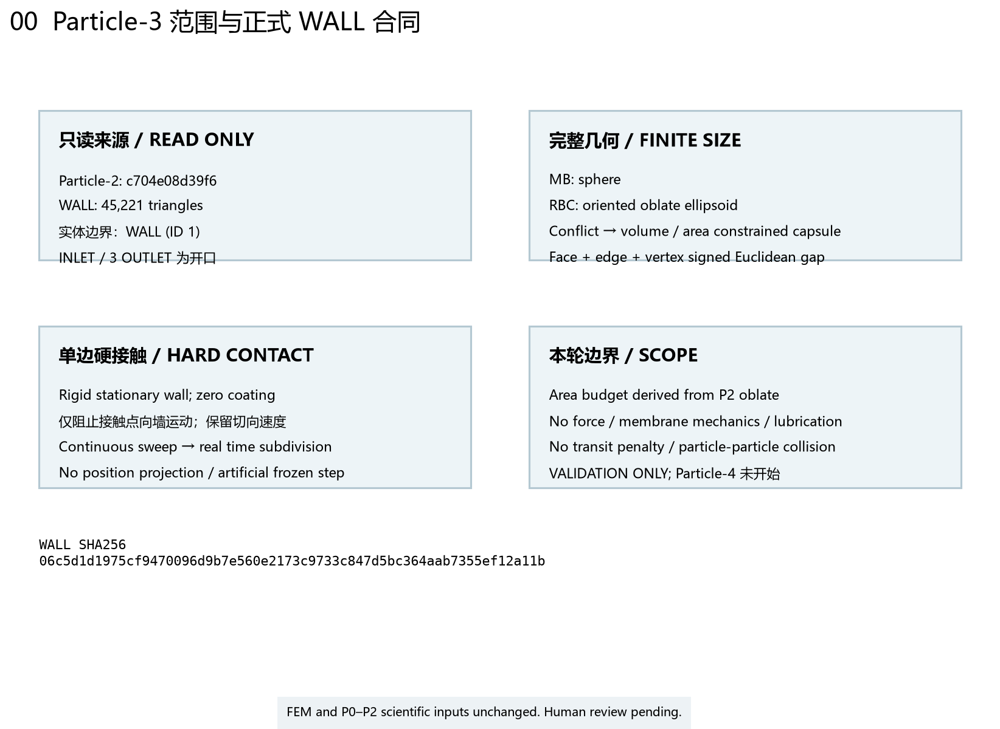
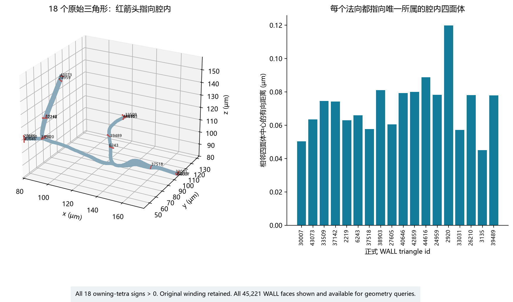
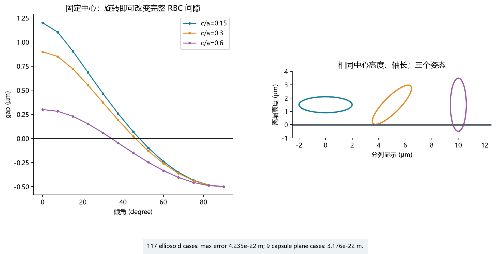
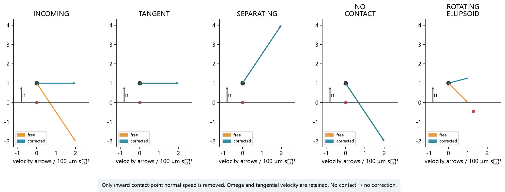
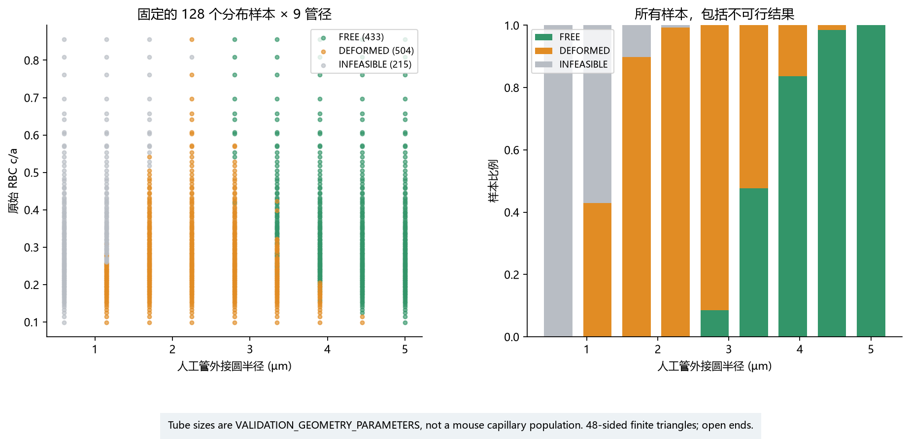
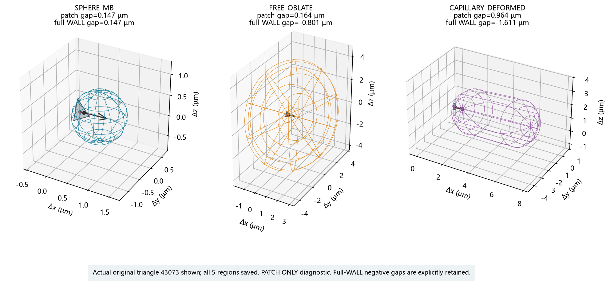
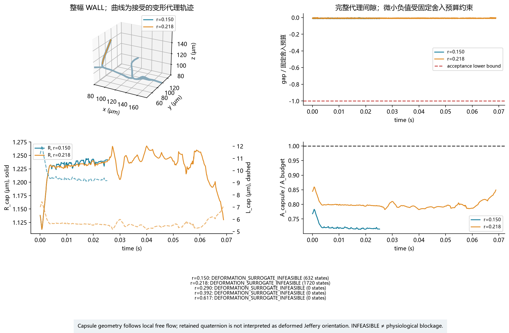
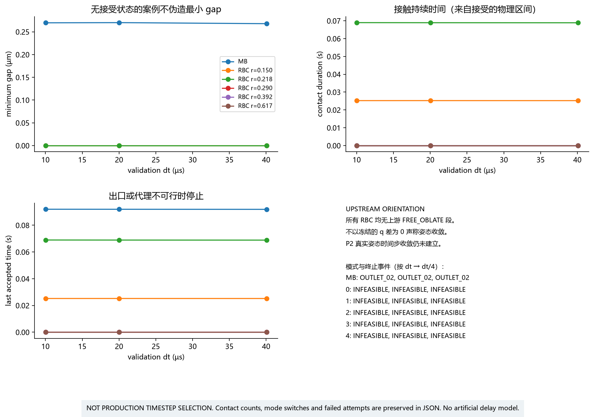

# Particle-3 人工审核报告

分支：`dev/particle-3-wall-contact-20260920`。被测源码提交：`95e54fe474349c35aaad2e2754aff0bad7108c42`（EXACT_TESTED_SOURCE_COMMIT; source hashes unchanged since full regression）。
机器记录：[PARTICLE3_VALIDATION.json](PARTICLE3_VALIDATION.json)。复现与算法说明：[PARTICLE3_README.md](../../PARTICLE3_README.md)。

## 1. 这一阶段做了什么

现在第一次真正检查完整粒子有没有碰墙。球形 MB、按当前姿态放置的 RBC 椭球，以及窄管中的定体积胶囊代理，都与原始有限 WALL 三角形比较。
只读正式 WALL，共 45221 个三角形；WALL 刚性、静止，物理涂层厚度为零。入口和三个出口不是实体壁。
WALL SHA256：`06c5d1d1975cf9470096d9b7e560e2173c9733c847d5bc364aab7355ef12a11b`。P0/P1/P2 实现、科学参数、分布和 Frozen FEM 均保持原样。
用户对 P2 的聊天验收已先单独提交 `705dd0c`，只改 P2 两份审核证据；P2 分布仍为 PROVISIONAL_PASS，真实姿态步长收敛仍未建立。

## 2. wall gap 是什么

中心没有出血管，不等于整个粒子没碰墙。gap 是完整粒子表面到有限三角形的欧氏间隙：正值分离，零为接触，负值表示相交深度。
对每个三角形计算面、边、顶点的有限几何，再对 WALL 取最小值；中心在不在腔内仍由 P0 独立判断。
负值是该单个三角形的最小平移脱离深度取负，不声称等于同时脱离所有重叠壁面的整体最短位移。
数值舍入界固定为 512×float64 eps×实际坐标/几何尺度；真实 WALL 的量级约 2.0094e-17 m。
这是浮点误差预算，不是额外的物理间隙；开发中没有扩大它。

## 3. MB 怎么算

使用冻结 SonoVue sampler 给出的真实球半径；正式重放半径为 5.88015722765549e-7 m，起点完全沿用 P1。
球心到有限三角形最近点的距离减去半径，得到球面间隙，面、边和顶点均单独验证。
三个真实步长均记录每个接受状态。MB 最小间隙为 2.678304804e-07 m。
三个 MB 重放终止事件：OUTLET_02, OUTLET_02, OUTLET_02；接触次数：[0, 0, 0]。
没有为展示碰墙而挪动入口起点。

## 4. RBC 怎么算

FREE_OBLATE 使用 P2 原始 a、b、c 和当前 quaternion。旋转会改变支撑高度，因此不能用中心距离减去一个固定 RBC 半径。
算法按椭球有限面/边/顶点的全部平稳特征求距离；独立凸优化的原始/对偶夹界验证外部距离，独立椭圆边界积分/优化及平面解析式验证其他分支。
真实重放使用原 5%、25%、50%、75%、95% r 的五个样本。所有轨迹始终查询整幅 WALL。

| 几何序号 / r | dt (µs) | 终止事件 | 接受状态数 | 最后接受时间 (s) | 最小 gap (m) |
|---|---:|---|---:|---:|---:|
| 0 / 0.150 | 40.064612 | DEFORMATION_SURROGATE_INFEASIBLE | 632 | 0.025200641 | -2.63851e-19 |
| 0 / 0.150 | 20.032306 | DEFORMATION_SURROGATE_INFEASIBLE | 1268 | 0.0252206733 | -2.63851e-19 |
| 0 / 0.150 | 10.016153 | DEFORMATION_SURROGATE_INFEASIBLE | 2520 | 0.0252106572 | -2.63851e-19 |
| 1 / 0.218 | 40.064612 | DEFORMATION_SURROGATE_INFEASIBLE | 1720 | 0.0688710683 | -2.29969e-19 |
| 1 / 0.218 | 20.032306 | DEFORMATION_SURROGATE_INFEASIBLE | 3441 | 0.0689111329 | -2.29969e-19 |
| 1 / 0.218 | 10.016153 | DEFORMATION_SURROGATE_INFEASIBLE | 6886 | 0.0689612136 | -2.29969e-19 |
| 2 / 0.290 | 40.064612 | DEFORMATION_SURROGATE_INFEASIBLE | 0 | 0 | 无接受状态 |
| 2 / 0.290 | 20.032306 | DEFORMATION_SURROGATE_INFEASIBLE | 0 | 0 | 无接受状态 |
| 2 / 0.290 | 10.016153 | DEFORMATION_SURROGATE_INFEASIBLE | 0 | 0 | 无接受状态 |
| 3 / 0.392 | 40.064612 | DEFORMATION_SURROGATE_INFEASIBLE | 0 | 0 | 无接受状态 |
| 3 / 0.392 | 20.032306 | DEFORMATION_SURROGATE_INFEASIBLE | 0 | 0 | 无接受状态 |
| 3 / 0.392 | 10.016153 | DEFORMATION_SURROGATE_INFEASIBLE | 0 | 0 | 无接受状态 |
| 4 / 0.617 | 40.064612 | DEFORMATION_SURROGATE_INFEASIBLE | 0 | 0 | 无接受状态 |
| 4 / 0.617 | 20.032306 | DEFORMATION_SURROGATE_INFEASIBLE | 0 | 0 | 无接受状态 |
| 4 / 0.617 | 10.016153 | DEFORMATION_SURROGATE_INFEASIBLE | 0 | 0 | 无接受状态 |

无接受状态的初始不可行案例用 null gap 表示，不虚构零间隙或轨迹。它们的初始尺寸、面积、体积和冲突原因仍完整保存。
对于有变形的案例，只能解释为：当前 rigid surrogate 与 WALL 几何冲突，V0 reduced-order model 找到了满足 volume / area-budget / wall-clearance 的 capsule surrogate。
这不表示真实 RBC 在那里一定如此变形。

## 5. 硬接触怎么处理

不反弹、不摩擦、不穿墙，切向照常走。接触点向墙运动时，只调整中心法向速度来抵消自由平移与转动造成的入墙分量，Omega 不变。
球和胶囊采用平移约束；没有接触或正在离墙时不干预。多个同时接触点通过最小必要法向速度修正共同处理。
最大法向残差 1.950497e-16 m/s；单法向受控试验最大切向变化 3.086880e-22 m/s。
真实残差逐区间用实际速度和所有实际接触法向独立复算。原有速度求解器舍入界为 1024×float64 eps×速度尺度；原有近重合法向合并阈值为 256×float64 eps。
合并法向与原始法向的微小差异按“法向差的长度×实际速度大小”单独传播到残差预算中，另加转动项差异。最大实际残差与完整预算之比为 0.999768466。
共有 6 个区间只看速度求解器预算时会超界；它们均受原有法向合并误差的传播界覆盖。首次漏计该项的审计失败记录已保存；任何 WALL、速度和法向合并阈值均未改变。
这是运动学约束，不计算真实接触力。
CSV 的自由速度是当前行位置的自由速度；corrected_velocity 是到达当前行所用的区间速度，须与前一行自由速度配对解释。
状态文件中的 normal_constraint_error 是求解器诊断；独立复算的完整残差另存 04_real_contact_residuals.csv，最终最大误差采用完整复算结果。

## 6. 为什么要真实时间细分

不能时间过去了但粒子偷偷留在原地。失败区间分成真实的左右两半，右半从已完成左半的状态继续；失败本身不推进时间。
薄墙试验中大步的两个端点都可能分离，仍必须检查中间是否穿墙。三种请求步长均在 0.375 s 接触，随后继续沿墙运动，完整覆盖到 1 s。
所有合成、真实 patch 和 FEM 案例最大时间覆盖误差为 0.000000e+00 s。
最大细分深度 48 和时间 ULP 下限都是实现保护，不是生产步长；保护触发时保存明确错误，不接受失败状态。
胶囊轴和半径变化使用重新计算的连续支撑路径。
在最大可行半径随位置变化时，可用同体积、同面积预算的辅助连续胶囊证明每一时刻存在可行形状；接受状态仍取全区间搜索的最大可行半径，辅助形状不替代 RBC，也不缩小体积。

## 7. 为什么窄管 RBC 可以变形代理

这里不用完整膜求解，而使用低成本胶囊几何。先检查实际原椭球 WALL 冲突，再沿局部自由流方向寻找胶囊，不能仅凭一个手写管径触发。
选择不添加迟滞：每个接受状态先尝试原椭球，允许时立即使用 FREE_OBLATE；否则尝试 CAPILLARY_DEFORMED。
在 128 个固定分布样本 × 9 人工管径的 1152 个组合中，FREE / DEFORMED / INFEASIBLE 为
433 / 504 / 215。
另外保留五个分位样本加两个合法极端样本的 63 个例子。管径、初始间隙比例与指定控制速度均为 VALIDATION_ONLY，不代表真实小鼠血管分布。
胶囊仍不可行时明确停止，不能把代理不可行直接叫作生理堵塞。

## 8. capsule 怎样保证不过度变形

原 RBC volume 必须保持，所需光滑面积不能超过由原 oblate 推导的模型预算；没有修改 D/V 分布、缩小体积或增加面积。
L 是两半球球心间的轴段长度，满足 L=V0/(πR²)−4R/3；半径范围由定体积和面积约束共同求得。
在整个允许区间寻找最大的可行半径，不能假设缩细总有利，因为胶囊同时变长。搜索使用包含关系与保守距离变化界排除区间。
最大相对体积误差 4.440892e-16；最大面积超预算 0.000000e+00 m²。
A_budget 是 MODEL_DERIVED_FROM_PARTICLE2_OBLATE_GEOMETRY，不是直接测到的真实 membrane area。
小于预算的剩余面积只代表未展开部分，本模型不计算膜褶皱。

## 9. 自动测试

| 检查 | 结果 | 最大误差 / 条件 | 测试文件或完整日志 |
|---|---|---|---|
| frozen | PASS：18 passed | 0 failures / errors | logs/frozen_pytest.log |
| particle0 | PASS：46 passed | 0 failures / errors | logs/particle0_pytest.log |
| particle1 | PASS：67 passed | 0 failures / errors | logs/particle1_pytest.log |
| particle2 | PASS：74 passed | 0 failures / errors | logs/particle2_pytest.log |
| particle3 | PASS：90 passed | 0 failures / errors | logs/particle3_pytest.log |
| 球有限面/边/顶点 | PASS | 0.000e+00 m | test_convex_triangle_geometry.py |
| 椭球姿态、穿透、有限边/顶点 | PASS | 平面解析 4.235e-22 m | test_support_feature_consistency.py、test_convex_triangle_geometry.py |
| 胶囊解析几何 | PASS | 3.176e-22 m | test_capsule_area_budget.py、test_convex_triangle_geometry.py |
| 接触法向 / 切向 | PASS | 1.950e-16 / 3.087e-22 m/s | test_hard_contact.py、test_real_wall_controlled.py |
| 无穿墙 / 真实时间覆盖 | PASS | 0.000e+00 s | test_physical_time.py、test_real_fem_evidence.py |
| 体积 / 面积 / 最小变形 / 明确不可行 | PASS | 相对体积 4.441e-16，面积 0.000e+00 m² | test_deformation_selection.py、test_capsule_area_budget.py |
| 输入、方向、范围、原分布不变 | PASS | 18 个所属四面体方向检查及 P2 全部历史 SHA | test_input_scope_and_normals.py |
| 13 图、源数据、重作图、报告 | PASS | SHA 与重新生成 PNG 一致 | test_particle3_artifacts.py |

开发中修复了三个实现问题：面法向混入数值最近点偏差、细长三角形的固定重心坐标阈值误判、半径搜索在全局误差尚未闭合时过早丢弃小区间。
固定阈值没有为通过测试扩大，失败日志和永久回归测试均保留。
独立数值参考求解器也增加了原始/对偶夹界认证，避免只相信优化器状态字符串；没有改变生产几何公式。

## 10. 人工审核图

应该看什么：实体边界、有限粒子几何和本轮工作边界。

实际看到什么：只有正式 WALL 是实体壁，入口与三个出口保持开口。

有没有异常：没有加入润滑、膜力学、粒子间相互作用或生产步长。

应该看什么：不同位置、方向和面积的三角形内法向。

实际看到什么：18 个内法向均指向唯一所属腔内四面体。

有没有异常：自动方向检查没有异常；网格外观仍待人工审核。

应该看什么：球面到有限三角形面、边、顶点的距离和符号。

实际看到什么：12 个正负间隙案例与解析值重合。

有没有异常：误差在原先声明的浮点舍入预算内。

应该看什么：固定中心时，椭球旋转如何改变壁面间隙。

实际看到什么：不同轴比的倾角曲线与解析支撑高度一致。

有没有异常：没有用中心距离减去固定 RBC 半径替代姿态几何。

应该看什么：入墙、平行、离墙、无接触和旋转椭球的两种速度箭头。

实际看到什么：只在接触点向墙运动时补偿法向平移，其他情形不改速度。

有没有异常：法向残差和切向变化均在浮点预算内。

应该看什么：未接受的大步、接触时间和实际接受的时间片。

实际看到什么：三个请求步长均在 0.375 秒接触，余下时间继续沿墙移动。

有没有异常：没有穿过薄墙，也没有把失败步的时间直接跳过去。

应该看什么：同一个原始 RBC 在宽、窄、极窄人工管中的几何。

实际看到什么：依次得到原始椭球、满足体积与面积约束的胶囊、代理不可行。

有没有异常：不可行情形停止验证，没有缩小 RBC 或增加面积预算。

应该看什么：样本形状和人工管径变化时的三类结果。

实际看到什么：1,152 个组合完整保留，窄管中的不可行结果也计入分母。

有没有异常：这些管径仅用于算法验证，不能解释为小鼠血管分布。

应该看什么：原 WALL patch 与球、椭球、胶囊的两个最近点及内法向。

实际看到什么：局部正间隙与解析构造一致，整幅 WALL 的间隙另列。

有没有异常：部分局部摆放会碰到其他壁面，已保留负的全局间隙，不宣称全局可放入。

应该看什么：真实 patch 上的四种指定运动方向、接触后的间隙和法向速度。

实际看到什么：40 个受控案例保持不穿透，接触后保留切向运动。

有没有异常：这些是指定速度的局部诊断，不作为真实流动或完整血管通行结论。

应该看什么：原始入口起点的真实 FEM 球心轨迹、完整球间隙和接触状态。

实际看到什么：三个减半步长均保留全部实际接受状态和终止事件。

有没有异常：是否发生自然接触由结果决定，起点和尺寸没有为展示接触而改变。

应该看什么：五个原始 RBC 的接受轨迹、模式、胶囊半径和面积比例。

实际看到什么：各案例的变形和不可行终止均直接列出，初始不可行的案例没有虚构轨迹。

有没有异常：这里只证明当前代理的几何可行性，不声称真实红细胞必然如此变形。

应该看什么：三个减半步长的最小间隙、接触持续时间、终止时间和上游姿态可比性。

实际看到什么：18 个重放均保存，初始不可行结果与实际有轨迹的案例分开显示。

有没有异常：这些比较不确定生产步长，P2 姿态收敛限制继续保留。

## 11. 当前限制

- WALL 是刚性静止壁；没有 glycocalyx、物理涂层、wall lubrication 或 near-field resistance。
- hard contact 是 kinematic constraint，不输出真实 contact force，没有反弹或摩擦。
- deformation surrogate 不是真实膜力学，不计算膜应力、FSI、真实压降或皱褶；A_budget 是模型推导值，不是直接膜面积测量。
- CAPILLARY_DEFORMED 中保留 q，但胶囊只用局部自由流向；JEFFERY_ORIENTATION_NOT_INTERPRETED_WHILE_DEFORMED。
- 当前真实 RBC 在入口即进入变形或不可行，没有可比较的上游 FREE_OBLATE 段；不能把冻结 q 的零差叫作姿态收敛。P2 原有明显 dt 敏感性仍然保留。
- 没有 transit-time penalty 或固定 60%–80% 减速；这些与 squeeze resistance 留给 Particle-5。
- 没有 RBC→MB margination、particle-particle contact、连续注入、hematocrit 或 LAMMPS。
- 没有 production timestep；三个 dt 只做验证比较，不是生产步长选择。
- Frozen FEM 仍然 one-way。RBC 强烈堵塞时真实流场会变化，本模型不会重新求 FEM。
- 真实 WALL patch 控制试验只验证局部有限特征接触；全局放不下的摆放另列负 gap。真实 FEM 使用整幅 WALL。
- 准静态模式切换和最大半径路径不描述连续膜变形动力学。代理不可行是模型结果，不能替代生理堵塞结论。

## 12. 人工审核状态

AUTOMATED_CHECKS = PASS

MANUAL_VISUAL_REVIEW = PASS

STAGE_RESULT = PASS_WITH_CARRY_FORWARD_LIMITATION

当前人工验收以 [PARTICLE3_MANUAL_ACCEPTANCE.json](PARTICLE3_MANUAL_ACCEPTANCE.json) 为准，reviewer = USER_CHAT_REVIEW。原 PARTICLE3_VALIDATION.json 保留被测时刻的不可变快照，其中 PENDING_USER_REVIEW 是当时状态。

Real MB finite-size passage = PASS；Real RBC passage = NOT_ESTABLISHED；Physiological blockage conclusion = NOT_ALLOWED；blocking_software_issue = NONE；particle4_authorized_to_start = true。

PRODUCTION_WALL_MODEL_STATUS = V0_VALIDATION_ONLY_PENDING_USER_REVIEW

PRODUCTION_PARTICLE_TIMESTEP_FROZEN = false

NO_CFD_EXECUTED = true

PARTICLE4_STARTED = false

Particle-3 实现保持不变。用户已在后续聊天中允许进入 Particle-4；真实 RBC 通行限制继续保留。
