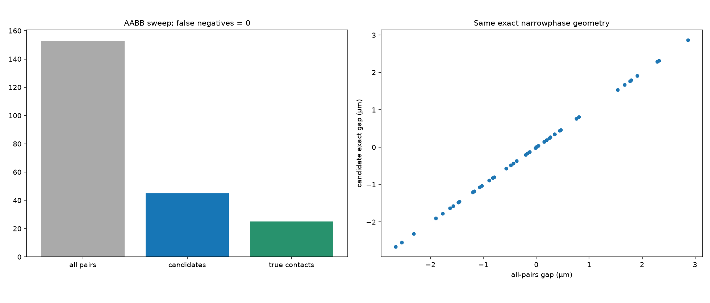

# Particle-4 人工审核报告

分支：`dev/particle-4-particle-contact-20260920`。被测源码提交：`a1e09cb3e2db7c91d7adc75adf40a0f939a880bf`（EXACT_TESTED_SOURCE_COMMIT; source hashes unchanged since full regression）。
机器记录：[PARTICLE4_VALIDATION.json](PARTICLE4_VALIDATION.json)。算法和复现：[PARTICLE4_README.md](../../PARTICLE4_README.md)。

## 1. 这一阶段做了什么

现在粒子之间也不能互相穿过去。复用 P3 的真实有限尺寸形状，增加成对间隙、对称硬接触，以及所有 WALL 和粒子接触的同时求解。
P0–P3 原源码和测试没有修改，Frozen FEM 和正式 WALL 保持原样，没有执行 CFD。
P3 用户验收单独保存于 PARTICLE3_MANUAL_ACCEPTANCE.json；原 P3 验证 JSON 是被测时刻的历史快照。
真实 RBC 通行仍为 NOT_ESTABLISHED，不能把 DEFORMATION_SURROGATE_INFEASIBLE 当作生理堵塞。

## 2. 什么叫 pair gap

它表示两个完整粒子表面还剩多少距离。正值表示分开，零表示接触，负值表示几何相交深度。
法向从第二只指向第一只；交换输入后间隙不变，两个接触点交换，法向反向。
计算使用原 shape support、Minkowski 差、GJK 和支撑函数平稳点细化。穿透方法经过独立数值验证，但不声称是任意凸体的形式化全局证明。
不使用 RBC 中心距离减有效半径的替代模型；不能可靠闭合接触点时明确报错。
几何舍入界沿用 P3 的 512×float64 eps×实际尺度，没有固定比例 overlap 或物理 padding。

## 3. 哪些 shape 可以互相碰

球–球、球–椭球、球–胶囊、椭球–椭球、椭球–胶囊、胶囊–胶囊，共六类。
RBC–MB 使用原 P2 的五个分位样本及不同姿态。胶囊取自原 P3 定体积、面积预算允许的几何。
已经 DEFORMATION_SURROGATE_INFEASIBLE 的 RBC 不是可继续模拟的状态。
粒子接触不修改 RBC 尺寸、分布、面积预算或胶囊轴；没有碰撞诱导变形。

## 4. 接触以后怎么处理

不弹、不摩擦，只去掉继续互相钻入的运动。每条粒子接触约束给两边成对相反的中心平移修正。
全部约束一起选择最小的几何加权速度修正，球的自旋和胶囊保存的角速度不受法向接触改变。
接触乘子是 KINEMATIC_CONTACT_MULTIPLIER，不是 force、impulse 或真实接触力，没有 N 或 pN 单位。
最大法向违反量为 1.482308e-21 m/s；孤立球接触最大切向变化误差为 0.000000e+00 m/s。

## 5. 为什么 RBC 会有角速度修正

偏心接触时，转动和中心平移可以共同去掉入侵速度。FREE_OBLATE 的角速度修正由接触点位置、法向和原尺寸自动算出，不手写转动角度。
比较平移与转动时使用 ell=max(a,b,c)，目标包含 ell²×角速度修正的平方；这是几何尺度，不是质量、惯性或物理能量。
CAPILLARY_DEFORMED 的轴由 P3 局部流向定义，所以不通过粒子接触转动它。

## 6. 三个粒子一起碰怎么办

把所有当前接触放进同一个约束问题，不能先左后右地逐对推开。
直线、三角形和四粒子案例均检查非负乘子、非负法向速度及互补条件；WALL 加粒子接触也一起解。
三粒子与四粒子的 36 个排列中，稳定 ID 保持原样，速度、角速度和接触集合完全一致。
求解后独立复算实际接触点速度；退化不相容或保护条件触发时报告 MULTI_CONTACT_INFEASIBLE。

## 7. 为什么还要真实时间细分

不能一步从另一只粒子的身体里穿过去，即使大步的两个端点看起来分离。
先用运动上界和连续分离平面证明区间安全，不能证明时真实分成左右两个时间区间；右半从左半接受状态继续。
最大时间覆盖误差为 0.000000e+00 s。没有中心位置投影、推开重叠或失败后偷偷推进时间。
孤立双球持续擦边时，使用同一接触速度方程的解析积分，避免弦推进反复离开/返回接触面的数值抖动；独立 ODE 积分已验证。
改变 P3 形状模式或胶囊轴/尺寸时，旧 pair 运动证书作废，必须重新计算路径；本轮不绕过真实 RBC 通行限制去运行真实 RBC 对。

## 8. 自动测试

| 检查 | 结果 | 最大误差 / 条件 | 测试文件或完整日志 |
|---|---|---|---|
| frozen | 18 passed | 0 failures/errors | logs/frozen_pytest.log |
| particle0 | 46 passed | 0 failures/errors | logs/particle0_pytest.log |
| particle1 | 67 passed | 0 failures/errors | logs/particle1_pytest.log |
| particle2 | 74 passed | 0 failures/errors | logs/particle2_pytest.log |
| particle3 | 90 passed | 0 failures/errors | logs/particle3_pytest.log |
| particle4 | 69 passed | 0 failures/errors | logs/particle4_pytest.log |
| 六类有限尺寸几何 | PASS | 球球 8.470e-22 m；球胶囊 8.470e-22 m；胶囊胶囊 8.470e-22 m | test_pair_geometry.py |
| 椭球独立原始/对偶参考 | PASS | 到参考界端点最大 2.128e-20 m | test_pair_geometry.py |
| reciprocity | PASS | gap 0.000e+00 m；normal 0.000e+00 | test_pair_geometry.py |
| 成对对称、切向、自旋、偏心转动 | PASS | 平移平衡 5.294e-23 m/s | test_contact_projection.py |
| 同时 WALL / pair；排列不变性 | PASS | primal 1.482e-21；dual 0.000e+00；complementarity 1.334e-26 | test_contact_projection.py |
| 无穿透、真实时间、初始重叠拒绝 | PASS | 时间 0.000e+00 s | test_pair_time_and_broadphase.py |
| broadphase 与穷举 | PASS | 漏检 0 | test_pair_time_and_broadphase.py |
| 真实双球、旧输入、图与报告 | PASS | 源文件 SHA、图重生成及有限状态检查 | test_scope_and_artifacts.py |

人工混合轨迹使用 dt / dt/2 / dt/4 = 0.2 / 0.1 / 0.05 s，只作 VALIDATION_ONLY。
三类接触事件均发生；最小接受 pair gap 为 -1.715982e-21 m，处于原有坐标舍入界内。
它使用中心线接触和零自由角速度，短轴差为零不代表真实 FEM 姿态收敛。
真实双球烟雾结果：NO_NATURAL_PAIR_CONTACT；共 257 个接受状态，至 0.00256413518 s。
真实 pair 最小 gap 为 4.398743e-07 m；WALL 最小 gap 为 3.058380e-10 m；出口事件：验证窗口内没有出口事件。
使用原 SonoVue 两个固定种子 20260920 / 20260921，没有缩小第二只 MB 或添加人工力。
初值取原 P3 路径中后续 256 个参考点均可容纳原大球的第一个宽段；最初仅检查瞬时可行的候选发生后续大球碰壁和大量 P3 子步，该开发尝试中止并保留日志。
正式烟雾检查不宣称验证了大球持续沿曲壁滑动。
开发中修复了 WALL 返回元组的适配、初始化搜索窗口过短和双球擦边积分抖动，失败日志保留；没有改变接触模型或科学阈值。
P4 平移更新精确保留原胶囊轴，避免重复构造时的单位化改变末位浮点数；独立接触步回归验证轴、自旋和尺寸不变。
补充深重叠检查时，独立参考优化器曾陷入较深的另一方向极值；参考改为覆盖八个角度区域的独立搜索，未使用正式解作为初值，也未放宽阈值。

## 9. 人工审核图

应该看什么：看清 P4 继承哪些输入、只新增什么接触规则。

实际看到什么：本阶段复用 P0–P3，新增粒子间有限尺寸硬接触和同时求解。

有没有异常：真实 RBC 通行仍未建立；没有润滑、黏附、新变形或生产步长。

应该看什么：看六类配对在分离、接触、穿透时是否返回正确符号。

实际看到什么：六类均有固定方向和旋转几何检查，输入交换后间隙不变、法向反向。

有没有异常：负间隙只用于几何诊断，不作为轨迹初始状态。

应该看什么：看两球正碰时两边速度修正是否对称。

实际看到什么：接触后相对法向速度消失，两边中心修正相反。

有没有异常：没有反弹或自旋修正；箭头仅作显示。

应该看什么：看擦边接触时切向运动是否保留。

实际看到什么：只去掉继续入侵的法向分量，切向速度保留，轨迹随后分开。

有没有异常：分开来自原有切向运动，不是人为反弹。

应该看什么：看五个分位 RBC 与球的真实接触点和法向。

实际看到什么：使用原 P2 样本及三种姿态，不用一个平均 RBC 代替分布。

有没有异常：轮廓是标明平面的几何投影，接触判断仍为三维。

应该看什么：看同样中心位置下转动 RBC 怎样改变间隙。

实际看到什么：两个不同 P2 样本随相对姿态变化出现不同间隙。

有没有异常：这里是静态几何检查，可能显示穿透，不是被接受的轨迹。

应该看什么：看偏心接触时中心速度和角速度如何共同修正。

实际看到什么：自由椭球的角速度修正来自同一个几何加权求解，接触法向速度满足约束。

有没有异常：乘子不是接触力，图中角速度变化不代表碰撞冲量。

应该看什么：看胶囊与三类粒子接触时哪些量会变化。

实际看到什么：胶囊只接受平移速度修正，轴、尺寸和保存的自旋保持不变。

有没有异常：胶囊不通过碰撞进一步压扁或拉长。

应该看什么：看端点分离的大步是否仍检测到中途相撞。

实际看到什么：三个请求步长均在 0.375 秒接触，并完整处理到 1 秒。

有没有异常：所有细分区间都有真实起止时间，失败尝试不消耗时间。

应该看什么：看直线和三角形三粒子能否同时满足全部约束。

实际看到什么：所有接触一起求解，图中列出修正前后法向速度。

有没有异常：没有按粒子输入顺序逐对修正。

应该看什么：看保持粒子 ID 不变时，排列输入是否改变结果。

实际看到什么：三粒子的全部排列和四粒子的全部排列给出相同速度、角速度及接触集合。

有没有异常：没有按位置重新编号。

应该看什么：看粒子被 WALL 与另一粒子夹住时是否两边都满足约束。

实际看到什么：WALL 和粒子接触进入同一个求解，球和 RBC 混合案例均通过。

有没有异常：固定 WALL 的作用不要求所有粒子的平移修正总和为零。

应该看什么：看候选筛选有没有漏掉真正接触的配对。

实际看到什么：同一批混合形状的候选结果与穷举精确接触结果一致。

有没有异常：候选可以多给，但不能漏给；耗时只作烟雾检查。

应该看什么：看四粒子轨迹中的三类接触事件及最小间隙。

实际看到什么：两球和两个原 P2 椭球产生球–球、球–RBC、RBC–RBC 接触，所有接受状态满足舍入界。

有没有异常：此例使用中心线接触及零自由角速度，不能据此宣称真实姿态收敛。

应该看什么：看真实 WALL 内两只原尺寸 MB 的轨迹、间隙和出口记录。

实际看到什么：冻结流场驱动两只 MB，初始壁面及粒子间间隙均为正；自然接触结果直接标在图中。

有没有异常：这是 256 个验证步的烟雾检查，不是完整悬浮液；未到出口会明确记录。

应该看什么：看步长减半后接触时间、间隙、末位置、速度和短轴差。

实际看到什么：三个步长均只用于人工混合场景验证，比较的是短轴而非 quaternion 分量。

有没有异常：NOT PRODUCTION TIMESTEP SELECTION；真实 RBC 通行限制仍保留。

## 10. 当前限制

- no contact force；no mass/inertia collision；乘子只是运动学求解量。
- no friction；no restitution；no lubrication；no particle-particle hydrodynamics。
- no collision-induced deformation；不修改 P2 distribution 或 P3 deformation。
- CAPILLARY_DEFORMED 不接受 contact angular rotation；模式或轴变化必须重新认证路径。
- no adhesion；no LAMMPS；no continuous injection 或 hematocrit。
- no production timestep；全部步长仅用于验证。
- real RBC passage from P3 is still NOT_ESTABLISHED；不能作生理堵塞结论。
- 真实 FEM two-MB smoke 不等于正式 suspension，也不表示这两个尺寸已完成整条血管通行。
- penetration 使用经过独立参考验证的固定种子 support-stationary 方法；没有任意凸体的形式化全局最优证明。
- 数值保护触发时明确停止，不允许重叠或静止状态消耗失败时间。

## 11. 人工审核状态

AUTOMATED_CHECKS = PASS

MANUAL_VISUAL_REVIEW = PASS

STAGE_RESULT = PASS

当前人工验收见 [PARTICLE4_MANUAL_ACCEPTANCE.json](PARTICLE4_MANUAL_ACCEPTANCE.json)，reviewer = USER_CHAT_REVIEW。原 PARTICLE4_VALIDATION.json 保留原被测时刻快照，其中 PENDING_USER_REVIEW 是当时状态。

blocking_issue = NONE；particle5_authorized_to_start = true；REAL_RBC_PASSAGE = NOT_ESTABLISHED；REAL_RBC_PAIR_VALIDATION = DEFERRED；PRODUCTION_PARTICLE_TIMESTEP_FROZEN = false。

PRODUCTION_PARTICLE_TIMESTEP_FROZEN = false

NO_CFD_EXECUTED = true

PARTICLE5_STARTED = false

Particle-4 实现保持不变。用户已在后续聊天中允许进入 Particle-5；真实 RBC 通行和配对验证限制继续保留。
