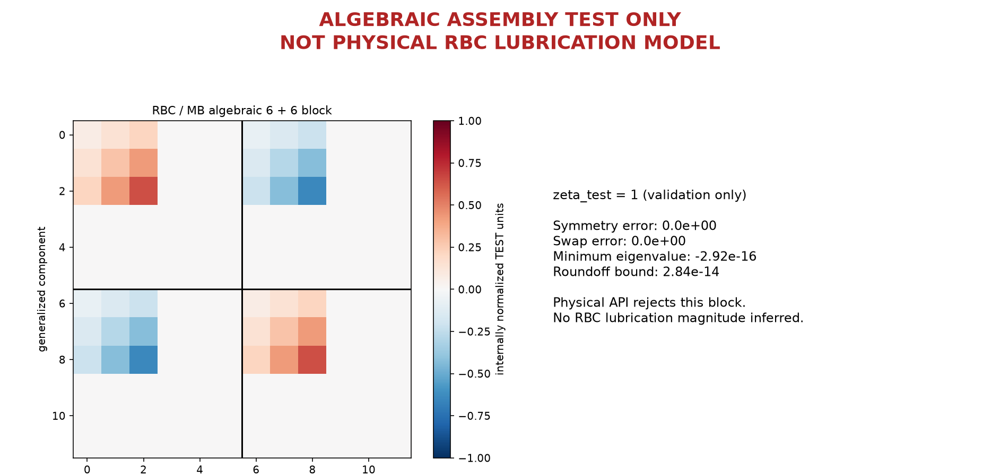

### 图 04：04_rbc_mb_resistance_symmetry

应该看什么：只看矩阵对称、交换互易和非负耗散。

实际看到什么：使用测试单位下的正系数 1，交换球和原 P2 椭球的块顺序不改变矩阵。

有没有异常：这张图不是 RBC 润滑模型；测试系数不能进入真实物理接口。

数据：[04_algebraic.json](data/04_algebraic.json)、[04_algebraic.csv](data/04_algebraic.csv)。
