# Particle-5 人工审核报告

分支：`dev/particle-5-resistance-lubrication-20260920`。被测源码提交：`adbde27d31824e1a3ec5c47c9b297e1c0a248d6d`，状态：`EXACT_TESTED_SOURCE_COMMIT; source hashes unchanged since full regression`。
机器记录：[PARTICLE5_VALIDATION.json](PARTICLE5_VALIDATION.json)。复现说明：[PARTICLE5_README.md](../../PARTICLE5_README.md)。
P4 用户验收已保存为独立证据提交 `0fca8cdd8340c7bb802f57f068e3fc878717ac49`，未改 P4 历史科学快照、算法或测试。

## 1. 这一阶段做了什么

现在球形粒子还没碰到，夹在表面之间的薄层血液就会抑制它们继续靠近。新增 self、墙面法向和双球法向阻力，统一解全部粒子的平移与自转速度。
原有硬接触继续负责最终非穿透，全部墙面和粒子接触一起处理。P0–P4 原科学源码、测试和 Frozen FEM 保持原样，开始前和结束时均运行完整回归，没有执行 CFD。

## 2. resistance 是什么

这里的 resistance 是速度与液体阻力项之间的比例关系。背景流通过 self 项驱动粒子，近墙和相对靠近会增加额外阻力，同样的背景流驱动下就更难继续靠近。
实际方程是 `R U = b`，其中 `R = R_self + R_wall + R_pair`，`b = R_self U_free`。静止墙面和 pair 项不把自由速度加回右端，否则会错误地得到所有粒子永远等于自由速度。
每只球都有六个未知量，包括三个平移和三个自转分量。本轮无外加非流体力，也没有质量或惯性。

## 3. 为什么不能简单乘 60%-80%

减速由间隙、尺寸和阻力平衡自动计算，不是把所有速度乘一个常数。球靠平面时，法向速度比例为 `h/(a+h)`；间隙越小，比例越低，切向和自转在当前法向模型中保持原值。
所有阻力项均使用同一黏度，因此在本轮零外力的速度比例中黏度会约掉；阻力系数和耗散仍随黏度变化。真实使用 μ = 0.00345312 Pa·s，来自冻结 `baseline_summary.json` 与 `run/solver.xml` 的一致记录，并核对 ρν，没有新增黏度选择。

## 4. self / wall / pair 三种阻力

self 表示粒子偏离背景流时的阻力，球平移为 `6πμa`、自转为 `8πμa³`。孤立球解出原自由速度。
wall 表示球相对静止墙的法向阻力，系数为 `6πμa²/h`。pair 表示两球相对法向运动，系数为 `6πμR_eff²/h`，其中 `R_eff=ai aj/(ai+aj)`，四个矩阵块是 `[K,-K;-K,K]`。
共同平移不会触发 pair 阻力。这里的 resistance contribution 是无惯性平衡里的液体阻力项；接触乘子依旧标记 `KINEMATIC_CONSTRAINT_MULTIPLIER`，不称为真实接触力。
当 h 小于等于原几何舍入界时进入硬接触，没有人为抬高 h。真实 near-field 资格采用 `h/relevant_radius <= 0.01`，只作 VALIDATION_ONLY；合成的 0.1、0.01、0.001、0.0001 是显式公式验证点。

## 5. 球和墙怎么验证

人工平面中，`阻力×间隙/(6πμa²)` 应等于 1，最大无量纲误差为 0.000000e+00。法向速度直接比较标量解析解，同时检查切向和自转不变。
P4 对照在接触前恒速；P5 随间隙缩小而减速，在四秒验证时长内仍保留正间隙，不要求一定接触。每一步都使用真实时间和连续几何证书，没有碰墙后移动中心的处理。
真实静态回放保留了原始两种状态。原绝对最小墙隙 3.058379824e-10 m 对应离墙运动，不能把它写成靠近。
用于靠近验证的是 P4 原轨迹第 125 行、ID 203，间隙 3.232872763e-09 m；自由法向速度 -2.359377865e-06 m/s，修正后 -6.010408739e-09 m/s，比例 0.00254745491。
切向变化 1.673913e-18 m/s，处于浮点误差量级。中心、半径、原 WALL 与间隙都未人为改变。这里只验证 one-way frozen-flow 的局部 leading normal 修正，尚未处理切向迁移率、自转耦合、有限曲率和多墙面流体影响。

## 6. 两个球怎么验证

等半径和不等半径两组比较独立二元解析解，最大 pair 标度误差 0.000000e+00。输入顺序交换、共同平移、成对相反贡献均有永久测试。
12 球例中 P4 包围盒查询给出 6 个候选，穷举为 66 对。稀疏与穷举矩阵及求解速度逐元素一致；扩展只作用于验证查询包围盒，不改变真实球尺寸。
真实双球完全沿用 P4 初值、原 SonoVue 两个半径、dt=1.00161530335e-05 s、horizon=0.00256413517658 s。
得到 260 个接受状态，实际时间 0.00256413517658 s，覆盖误差 0.000e+00 s。最小 pair gap 为 4.337142743e-07 m，gap/R_eff=1.08022273，明显大于 0.01，因此 `PAIR_LUBRICATION_NOT_ACTIVE_IN_THIS_REAL_SMOKE`。
墙面近场启用 259 次，新轨迹最小墙隙 2.354088551e-11 m，是原初值演化后的结果；没有修改 0.3 nm 原样本，也没有为了 pair 图把两球移近。窗口内无出口事件，不能据此声称完整血管通行。

## 7. 为什么目前不声称 RBC lubrication 已解决

这不是忘记实现，而是当前没有人工批准的非球形润滑物理系数。椭球和胶囊的真实润滑依赖姿态、局部曲率和变形，不能用一个等效球半径代替。
图 04 只检验通用 pair 块的对称性、互易性和非负耗散，系数 1 仅存在于内部归一测试单位。正式接口收到这类形状时明确报 `NONSPHERICAL_LUBRICATION_NOT_FROZEN`，也拒绝把验证矩阵当成物理块输入。
真实 RBC 流体回放为 DEFERRED：一是 P3 的 REAL_RBC_PASSAGE 仍为 NOT_ESTABLISHED，二是 P5 非球形润滑未冻结。这不是 P5 自动失败，也不是生理堵塞结论。

## 8. 为什么耗散必须非负

液体阻力消耗相对运动，不能凭空产生能量。分别计算相对背景流的 self 耗散、相对静止墙的 wall 耗散，以及两粒子相对运动的 pair 耗散。
固定种子生成 1024 个完整速度向量，各项均非负。随机样本最小总耗散为 4.964264e-15 W；包含无作用方向和零贡献的全部保存求解中，最小分项耗散为 0.000000e+00 W。
物理系统 self 缩放后的最小特征值为 1。代数 rank-one 测试的最小特征值为 -2.916288e-16，其舍入界为 2.842171e-14；原负号完整保留，没有取绝对值掩盖结果。
用代数对角缩放和稀疏 LU 求解，不直接求逆；缩放与未缩放的解有独立比较。最大缩放条件数 53772.4259，最大相对后向残差 1.013197e-16。
超出 float64 可靠范围时明确报告 `RESISTANCE_SYSTEM_ILL_CONDITIONED`，请求物理时间细分；仍失败则停止案例。永久测试检查失败状态不移动、不消耗时间。

## 9. 自动测试

| 检查组 | 通过数 | 失败 / 错误 / 跳过 | 证据 |
|---|---:|---|---|
| frozen | 18 通过 | 0 失败 / 0 错误 / 0 跳过 | [日志](logs/frozen_pytest.log)、[JUnit](logs/frozen_junit.xml) |
| particle0 | 46 通过 | 0 失败 / 0 错误 / 0 跳过 | [日志](logs/particle0_pytest.log)、[JUnit](logs/particle0_junit.xml) |
| particle1 | 67 通过 | 0 失败 / 0 错误 / 0 跳过 | [日志](logs/particle1_pytest.log)、[JUnit](logs/particle1_junit.xml) |
| particle2 | 74 通过 | 0 失败 / 0 错误 / 0 跳过 | [日志](logs/particle2_pytest.log)、[JUnit](logs/particle2_junit.xml) |
| particle3 | 90 通过 | 0 失败 / 0 错误 / 0 跳过 | [日志](logs/particle3_pytest.log)、[JUnit](logs/particle3_junit.xml) |
| particle4 | 69 通过 | 0 失败 / 0 错误 / 0 跳过 | [日志](logs/particle4_pytest.log)、[JUnit](logs/particle4_junit.xml) |
| particle5 | 63 通过 | 0 失败 / 0 错误 / 0 跳过 | [日志](logs/particle5_pytest.log)、[JUnit](logs/particle5_junit.xml) |

| 科学检查 | 结果或最大误差 | 永久测试 |
|---|---|---|
| 黏度双来源与不一致停止 | PASS | test_resistance_core.py |
| Stokes 平移 / 自转系数 | 相对误差 0.000e+00 | test_resistance_core.py |
| 球墙 / 双球 1/h 标度 | 0.000e+00 / 0.000e+00 | test_resistance_core.py |
| 独立解析平移速度 | 4.286e-19 m/s | test_resistance_core.py |
| 未缩放物理矩阵对称性 | 0.000e+00 | test_resistance_core.py |
| 正耗散 / 原符号谱 / 交换 / 稀疏穷举 | PASS | test_resistance_core.py |
| 非球形拒绝与验证系数隔离 | PASS | test_resistance_core.py |
| 同时接触、穿越检测与失败不推进 | PASS；最大违反 6.353e-22 m/s | test_contact_and_time.py |
| 原真实状态 / 初始化与完整时长 | PASS | test_real_and_artifacts.py |
| dt、dt/2、dt/4 与独立隐式 ODE | 一阶误差随细化下降；仅验证步长 | test_contact_and_time.py、test_real_and_artifacts.py |
| 全部图重新生成及 SHA、历史源锁定 | PASS | test_real_and_artifacts.py |

开发中修正了图 01 刻度重叠、图 07 零附近自动放大和图 08 离散 P4 速度连线的展示方式。图 08 明确显示接触前恒速和接触后零法向速度，不用两点斜线暗示 P4 连续减速。
所有修正保持物理公式、旧阈值和 Frozen 不变。初次命令缺少源码导入路径的问题通过现有脚本路径约定处理；开发与最终测试日志保留。

## 10. 人工审核图

### 图 00：00_particle5_scope_and_resistance_contract

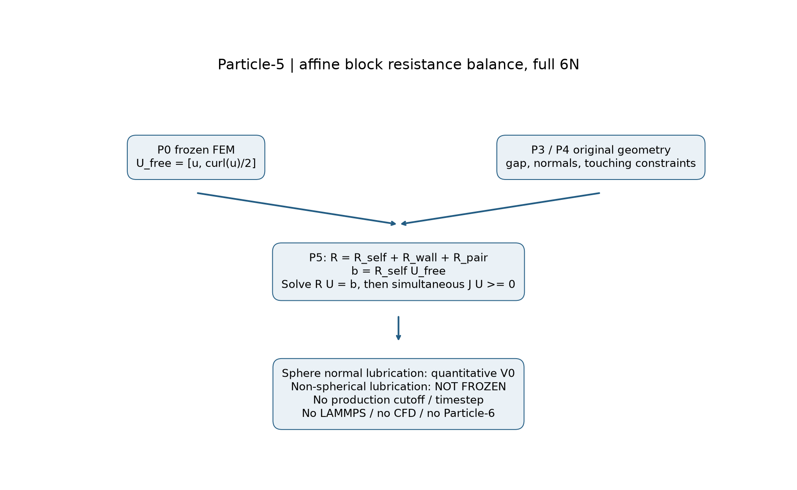

应该看什么：看清背景流、几何与新增阻力之间的数据关系。

实际看到什么：6N 求解包含平移和自转；右端只由背景流的 self 项提供。

有没有异常：这里只定量验证球形法向润滑，生产截断和生产步长没有冻结。

数据：[00_scope.json](data/00_scope.json)、[00_scope.csv](data/00_scope.csv)。

### 图 01：01_isolated_sphere_stokes_resistance

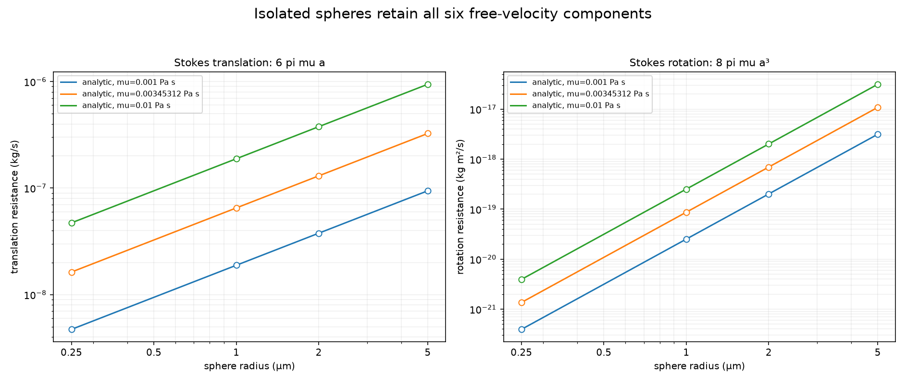

应该看什么：看平移和转动阻力是否分别随半径的一次方、三次方变化。

实际看到什么：三个黏度、四个半径的计算点都落在解析线上，孤立粒子保持自由速度。

有没有异常：测试黏度扫描仅作公式验证，真实回放使用冻结来源核对的黏度。

数据：[01_stokes.json](data/01_stokes.json)、[01_stokes.csv](data/01_stokes.csv)。

### 图 02：02_sphere_wall_lubrication

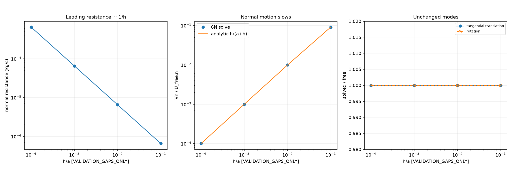

应该看什么：看间隙减小时阻力是否增大、法向速度是否连续降低。

实际看到什么：阻力按间隙倒数增长，法向速度符合解析解，切向速度与自转保持原值。

有没有异常：0.1 等指定比值只验证渐近公式代数，不代表已验证任意间距的墙面流体动力学。

数据：[02_wall.json](data/02_wall.json)、[02_wall.csv](data/02_wall.csv)。

### 图 03：03_sphere_sphere_lubrication

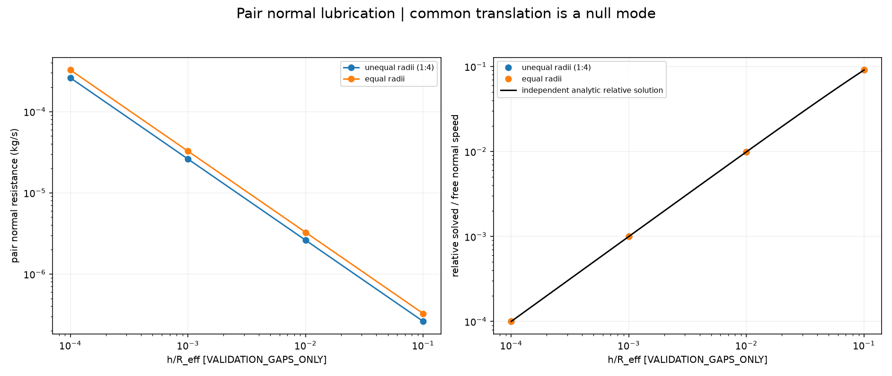

应该看什么：看等大和不等大两球的相对法向速度是否随间隙缩小而下降。

实际看到什么：两组都符合独立二元解析解；成对项作用相反，共同平移不受影响。

有没有异常：没有人为固定减速比例，也没有把远处配对当作近场。

数据：[03_pair.json](data/03_pair.json)、[03_pair.csv](data/03_pair.csv)。

### 图 04：04_rbc_mb_resistance_symmetry

应该看什么：只看矩阵对称、交换互易和非负耗散。

实际看到什么：使用测试单位下的正系数 1，交换球和原 P2 椭球的块顺序不改变矩阵。

有没有异常：这张图不是 RBC 润滑模型；测试系数不能进入真实物理接口。

数据：[04_algebraic.json](data/04_algebraic.json)、[04_algebraic.csv](data/04_algebraic.csv)。

### 图 05：05_sparse_resistance_matrix

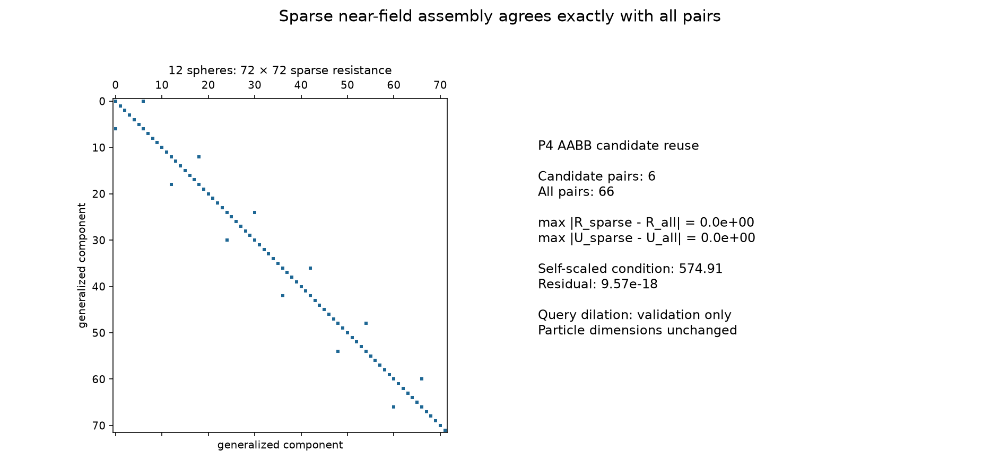

应该看什么：看 12 个球的非零块分布，以及候选筛选是否漏掉近场项。

实际看到什么：复用 P4 候选查询后，稀疏矩阵和求解结果与穷举完全一致。

有没有异常：查询包围盒扩展只服务本轮近场验证，不改变球尺寸，也不是生产邻居层。

数据：[05_sparse.json](data/05_sparse.json)、[05_sparse.csv](data/05_sparse.csv)。

### 图 06：06_resistance_dissipation_validation

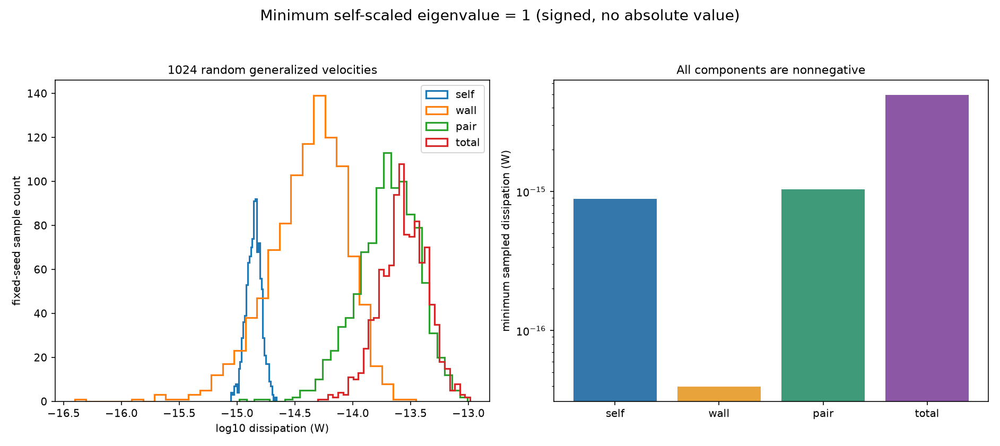

应该看什么：看固定种子的大量速度下，各类耗散是否出现负值。

实际看到什么：1024 个向量的 self、wall、pair 与总耗散均非负，self 缩放矩阵最小特征值为正。

有没有异常：舍入界与特征值原符号一起保存，没有对负特征值取绝对值。

数据：[06_dissipation.json](data/06_dissipation.json)、[06_dissipation.csv](data/06_dissipation.csv)、[05_sparse.json](data/05_sparse.json)、[05_sparse.csv](data/05_sparse.csv)。

### 图 07：07_resistance_metric_contact

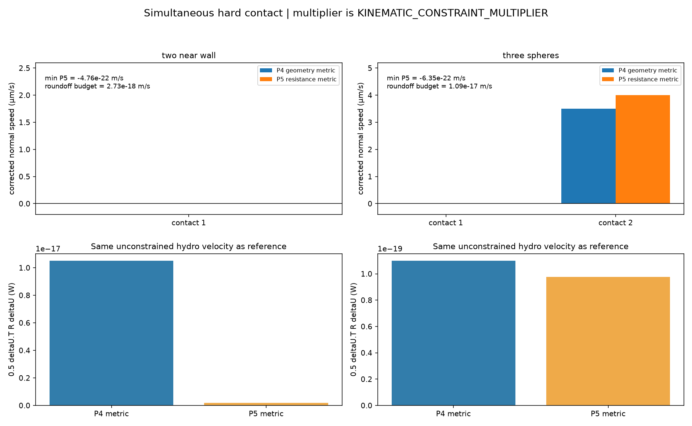

应该看什么：看相同流体速度起点下，两种接触修正是否都阻止继续入侵。

实际看到什么：两球近墙和三球案例均满足约束；P5 的阻力加权修正代价更小。

有没有异常：乘子仍只是运动学约束量，不是物理接触力；微小负速度在原舍入界内。

数据：[07_contact.json](data/07_contact.json)、[07_contact.csv](data/07_contact.csv)。

### 图 08：08_lubrication_transit_delay

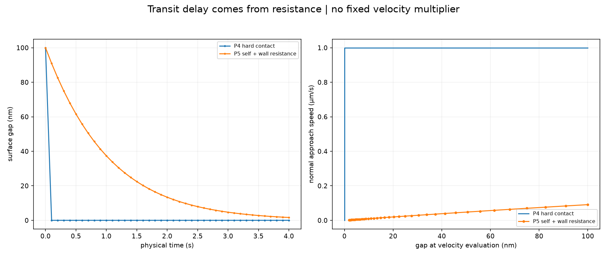

应该看什么：看同一初始间隙下，P4 恒速靠墙与 P5 逐渐减速的区别。

实际看到什么：P4 到墙后停止法向运动；P5 随间隙降低而持续变慢，在验证时长内仍未碰墙。

有没有异常：没有为了产生接触而添加间隙下限，也不要求有限时间一定碰上。

数据：[08_delay.json](data/08_delay.json)、[08_delay.csv](data/08_delay.csv)、[08_p4_wall_states.json](data/08_p4_wall_states.json)、[08_p4_wall_states.csv](data/08_p4_wall_states.csv)、[11_wall_dt1_states.json](data/11_wall_dt1_states.json)、[11_wall_dt1_states.csv](data/11_wall_dt1_states.csv)。

### 图 09：09_real_fem_near_wall_mb_lubrication

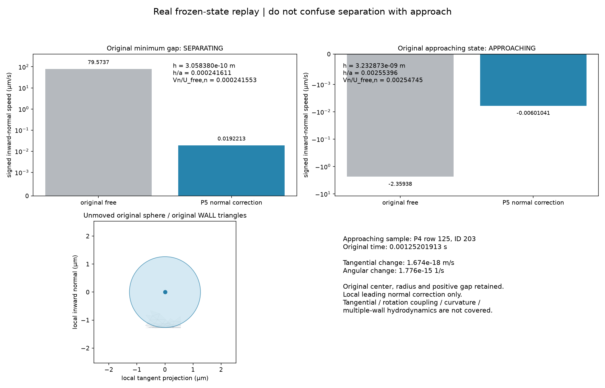

应该看什么：分别看原最小间隙样本和原轨迹中的靠墙样本，注意法向速度正负。

实际看到什么：原最小间隙样本正在离墙；另一个原始靠墙样本的法向速度显著减小，切向变化仅为浮点误差。

有没有异常：没有移动中心或缩放球；这是局部法向修正，尚未包含切向、转动耦合、曲率和多墙效应。

数据：[09_real_near_wall.json](data/09_real_near_wall.json)、[09_real_near_wall.csv](data/09_real_near_wall.csv)。

### 图 10：10_real_fem_two_mb_resistance_smoke

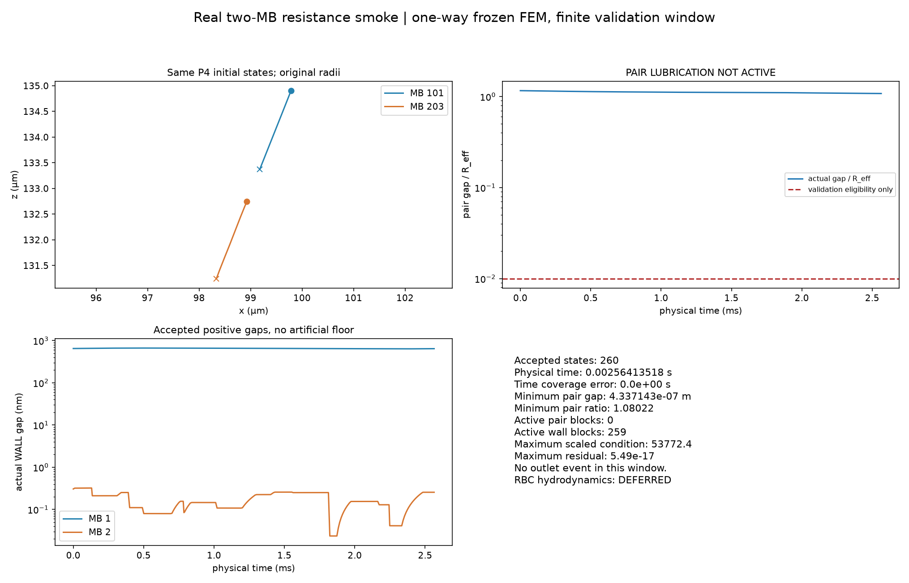

应该看什么：看原 P4 双球初值、尺寸和时长下的新轨迹，以及每一步的近场资格。

实际看到什么：完整烟雾回放状态有限且无穿透；墙面近场启用，双球间隙比仍远大于 0.01，pair 润滑没有启用。

有没有异常：新轨迹产生更小墙隙是积分结果，不是改初值；验证窗口没有出口事件，也不代表完整悬浮液。

数据：[10_initialization.json](data/10_initialization.json)、[10_initialization.csv](data/10_initialization.csv)、[10_real_summary.json](data/10_real_summary.json)、[10_real_summary.csv](data/10_real_summary.csv)、[10_real_two_mb_states.json](data/10_real_two_mb_states.json)、[10_real_two_mb_states.csv](data/10_real_two_mb_states.csv)、[10_pair_eligibility.json](data/10_pair_eligibility.json)、[10_pair_eligibility.csv](data/10_pair_eligibility.csv)、[09_real_near_wall.json](data/09_real_near_wall.json)、[09_real_near_wall.csv](data/09_real_near_wall.csv)。

### 图 11：11_particle5_timestep_comparison

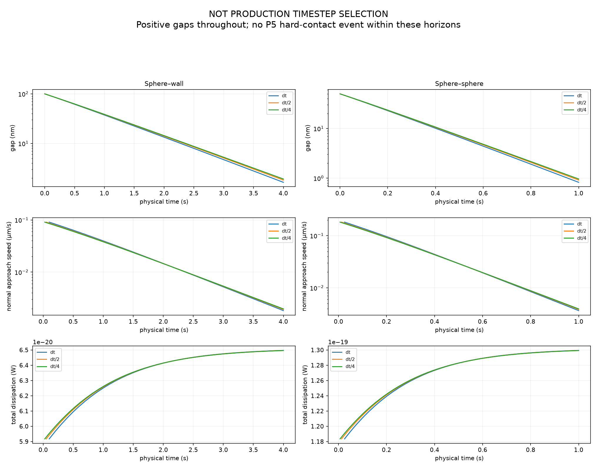

应该看什么：看球墙和双球在步长减半后的间隙、速度和耗散差异。

实际看到什么：两类案例完整覆盖物理时间，保持正间隙；末间隙差与独立隐式解析关系的误差随细化减小。

有没有异常：图中所有步长仅用于验证，不能据此选定生产步长。

数据：[11_timestep.json](data/11_timestep.json)、[11_timestep.csv](data/11_timestep.csv)、[11_wall_dt1_states.json](data/11_wall_dt1_states.json)、[11_wall_dt1_states.csv](data/11_wall_dt1_states.csv)、[11_wall_dt2_states.json](data/11_wall_dt2_states.json)、[11_wall_dt2_states.csv](data/11_wall_dt2_states.csv)、[11_wall_dt4_states.json](data/11_wall_dt4_states.json)、[11_wall_dt4_states.csv](data/11_wall_dt4_states.csv)、[11_pair_dt1_states.json](data/11_pair_dt1_states.json)、[11_pair_dt1_states.csv](data/11_pair_dt1_states.csv)、[11_pair_dt2_states.json](data/11_pair_dt2_states.json)、[11_pair_dt2_states.csv](data/11_pair_dt2_states.csv)、[11_pair_dt4_states.json](data/11_pair_dt4_states.json)、[11_pair_dt4_states.csv](data/11_pair_dt4_states.csv)。

## 11. 当前限制

- normal lubrication only；no tangential lubrication；no rotational lubrication coupling。
- leading asymptotic only；有限曲率、多墙面和任意分离距离的完整 mobility 尚未验证。
- production cutoff not frozen；0.01 是本轮真实回放的验证资格，pair / wall 生产 cutoff 均为 null。
- RBC/capsule lubrication not frozen；real RBC passage not established；真实 RBC hydrodynamics 为 DEFERRED。
- Frozen FEM one-way；粒子不反作用于流场，没有运行 CFD。
- no Brownian；no gravity、buoyancy、lift、added mass、Basset history、acoustics；no mass/inertia。
- no adhesion；no friction、restitution、springs；no RBC membrane mechanics 或 collision-induced deformation。
- no LAMMPS；no continuous injection、hematocrit；no full suspension。
- no production timestep；三组步长只用于验证，速度降低不代表可以放大生产步长。
- 稀疏组装与直接求解已验证 5–20 球；条件数检查使用小规模稠密谱分解，大规模性能未验证。
- 真实新轨迹的极小间隙按原模型保留，本轮没有引入分子尺度表面物理，因此不能将其解释成该尺度上的完整真实物理验证。

## 12. 人工审核状态

AUTOMATED_CHECKS = PASS

MANUAL_VISUAL_REVIEW = PASS

STAGE_RESULT = PASS_WITH_CARRY_FORWARD_LIMITATIONS

用户在当前聊天完成验收，记录见 [PARTICLE5_MANUAL_ACCEPTANCE.json](PARTICLE5_MANUAL_ACCEPTANCE.json)。原验证 JSON 保留被测时刻的历史快照，不覆盖原数值证据。

非球形润滑未冻结；真实 RBC 流体回放为 DEFERRED，通行仍为 NOT_ESTABLISHED；亚纳米间隙连续介质有效性尚未建立；生产润滑截断及步长仍未冻结。

BLOCKING_SOFTWARE_ISSUE = NONE

PARTICLE6_AUTHORIZED_TO_START = true

本次仅更新人工验收证据，不修改 P5 数值代码、测试和物理参数。
