# Particle-6 人工审核报告

## 1. 这一阶段做了什么

把已经验证的 particle solver 接进实际 LAMMPS。没有修改 P0–P5 数值源码。P5 人工审核已按本轮授权单独记录为 PASS，并保留全部上游限制。

分支：`dev/particle-6-lammps-bridge-20260920`。本轮源码提交：`c8e22f99359d15fd6075f2083ed60724ad0cfc2f`；绑定状态：`EXACT_TESTED_SOURCE_COMMIT`。

结果来自本轮实际运行；源码、数据、图、checkpoint 和日志的 SHA256 全部保存在 [机器验证记录](PARTICLE6_VALIDATION.json)。

## 2. LAMMPS 到底负责什么

保存稳定 ID、类型、位置与自定义状态，生成邻居候选，输出 dump 和二进制 restart。版本 20250722，Python 3.13.11，WSL CPU 单 MPI rank。

Python 模块：`/home/lzy/projects/ulm_particle_3d_particle0/.venv/lib/python3.13/site-packages/lammps/__init__.py`。共享库：`/home/lzy/projects/ulm_particle_3d_particle0/.venv/lib/python3.13/site-packages/lammps/liblammps.so`。LAMMPS 和 MPICH 仅安装在项目 venv；已有 FEM 数值依赖只读复用，未修改 Frozen FEM venv。安装审计见 [环境记录](data/00_lammps_environment.json)。

## 3. LAMMPS 不负责什么

不算 F=ma，不做加速度积分，不计算 lubrication 或 contact physics，不重新决定 V / Omega。只用 pair_style zero、property/atom 和零步维护；所有 LAMMPS 时间步均为 0。

4112 条重建前后审计中，force 最大值为 0。atomic 模式没有 torque 数组，诊断记为 0 并标注未定义、未使用；不能解读成物理力矩测量。mass = 1 只是 LAMMPS_BRIDGE_PLACEHOLDER_ONLY。永久测试还主动污染 force，确认在 run 0 清零之前被拒绝。

## 4. particle state 怎样映射

ID 和位置使用 LAMMPS 原生存储。类型编码 MB=1、RBC=2；形状编码 SPHERE_MB=1、FREE_OBLATE=2、CAPILLARY_DEFORMED=3。不可行变形状态拒绝插入。其余 q、V、Omega、半径、半轴、胶囊轴/半径/柱段长度和包围半径使用 custom properties。完整字段见 [V1 契约](../../contracts/particle6_state_v1.json)。

额外保存原 P4 椭球旋转矩阵，避免从 q 重建产生舍入变化。胶囊几何由轴、半径、长度决定：RETAINED_QUATERNION_NOT_CAPSULE_ORIENTATION。六个固定粒子全部状态往返最大差均为 0。

## 5. neighbor list 怎样比较

先使用相同 ValidationNeighborPolicy，再将 LAMMPS half list 的本地索引转换成稳定 ID，去重排序；原 P4/P5 精确几何与近场资格决定哪些候选进入物理计算。13 个粒子的 78 个可能配对中，standalone 和 LAMMPS 各产生 8 对候选，精确筛选后 6 对；额外候选 2，漏检 0，不匹配 0。六种形状组合均覆盖，ID 非连续且输入打乱。

每次接受物理子步后写回并强制重建。跨范围压力测试证明旧候选会失效，而重建后逐步一致。所有 center cutoff 和 skin 都是 VALIDATION_NEIGHBOR_QUERY_ONLY，不是生产物理截断。

## 6. 一个 timestep 是否完全一致

P5 球体靠墙与成对近场场景在 dt = 0.001 s 后，x、q、V、Omega、类型与邻居完全一致，最大误差为 0。相同状态组装的 R、b、U、J 最大差均为 0，稀疏结构、接触 ID 和活动集相同。

桥接只向原 trial 的私有依赖副本提供候选；使用完全相同 code object、原 P3 时间细分及原 P2 四元数积分。没有模块全局 monkeypatch，没有宽松 rtol。每步保存 float64 舍入预算，但本次实际达到逐位一致。

## 7. 多步是否漂移

P5 球体与 P4 混合形状各独立推进 100 个验证步，未用 reference 覆盖桥接状态。位置、q 轴、V、Omega、几何字段最大差均为 0，邻居不匹配总数为 0。混合形状仅复用 P4/P2 已有运动学；它不代表 P5 已具备 RBC 流体动力学。

## 8. checkpoint / restart 是否连续

球体和混合形状均实际运行 40 步，写 state.restart 与全局 sidecar，销毁旧 LAMMPS 实例，再在新实例中 read_restart，并继续 60 步。最终所有状态、邻居、physical_time_s = 0.1 s 和 step_index = 100 与连续路径完全一致。

三种形状的全部 custom properties 从二进制恢复；sidecar 不保存逐粒子数组，也不重新采样。本例无运行时随机过程，rng_states = null。清单记录 binary/sidecar SHA、schema、LAMMPS 版本和源码提交；sidecar 记录 31 个 Frozen 文件哈希、依赖提交、黏度与模型/查询策略。两个交付 bundle 见 [混合形状](checkpoints/mixed/checkpoint_manifest.json) 和 [球体](checkpoints/sphere/checkpoint_manifest.json)。

## 9. 真实 two-MB 是否一致

原两个 SonoVue 半径为 5.88015722765549e-07 m、1.2658269815352818e-06 m。原初始位置未动，dt = 1.0016153033502137e-05 s，horizon = 0.0025641351765765472 s，256 个请求步、259 个接受子步。

本轮重新运行完整原 P5 simulate_resistance，与桥接逐接受子步比较：x、V、Omega、墙隙、pair gap、阻力残差最大差均为 0，近场启用和出口事件一致。此窗口墙面近场启用，pair 润滑未启用，没有出口事件。原计算出现的亚纳米墙隙没有被人为截断；其连续介质有效性仍未建立。真实 RBC 动力学记录为 DEFERRED_DUE_TO_UPSTREAM_PHYSICS。

## 10. 自动测试

| 测试组 | 开发前 | 最终回归 |
|---|---:|---:|
| frozen | 18 / PASS | 18 / PASS |
| particle0 | 46 / PASS | 46 / PASS |
| particle1 | 67 / PASS | 67 / PASS |
| particle2 | 74 / PASS | 74 / PASS |
| particle3 | 90 / PASS | 90 / PASS |
| particle4 | 69 / PASS | 69 / PASS |
| particle5 | 63 / PASS | 63 / PASS |
| particle6 | — / PENDING | 62 / PASS |

原历史测试保持原内容。P6 永久测试实际调用 LAMMPS，包括 100 步、真实 FEM 和销毁重启；图测试重新生成 PNG 并比较 SHA256。初始/最终完整命令、返回码和 JUnit 都在 [logs](logs)。复现接口与环境说明见 [P6 README](../../PARTICLE6_README.md)。

## 11. 人工审核图

**00 — 00_particle6_scope_and_lammps_environment.png**

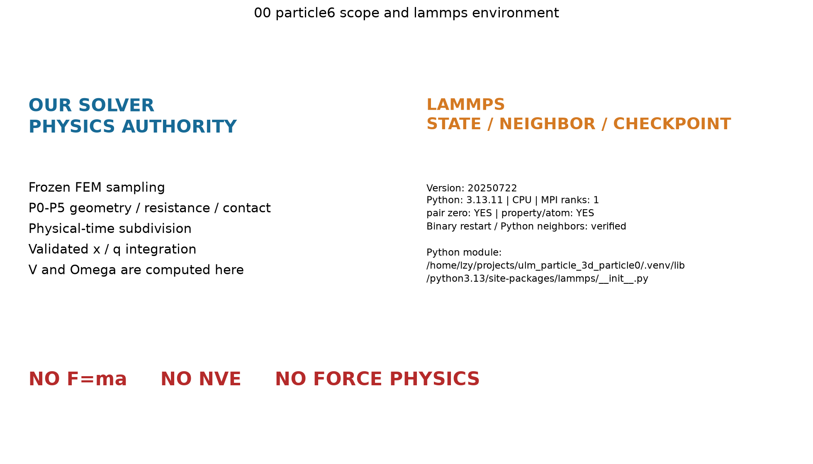

应该看什么：看清谁计算物理、谁只保存状态，并确认实际 LAMMPS 环境。

实际看到什么：原 particle_3d 负责全部物理与积分；LAMMPS 只保存状态、查询邻居和重启，实际版本为 20250722。

有没有异常：只验证单 MPI rank；安装包虽有其他物理模块，本轮命令白名单不会调用它们。

**01 — 01_lammps_state_roundtrip.png**

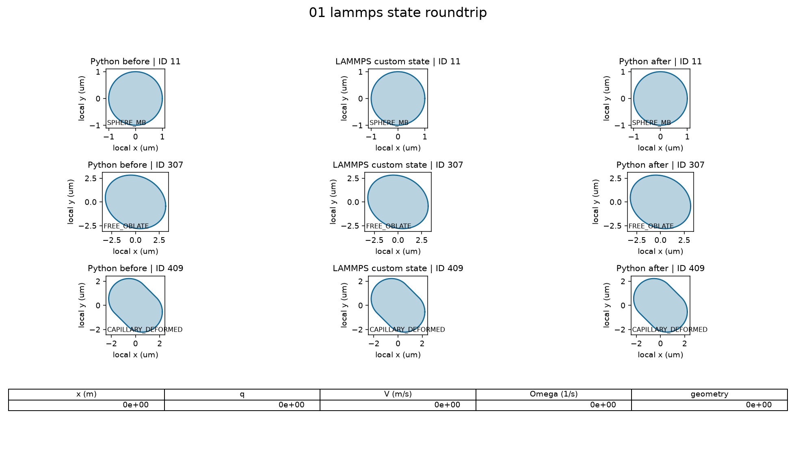

应该看什么：看三种形状进入 LAMMPS 再取出后，形状和所有状态字段是否变化。

实际看到什么：三个阶段的形状重合，ID、类型、位置、四元数、速度、角速度及几何字段逐位相同。

有没有异常：胶囊的四元数只是保留字段；胶囊轴、半径和柱段长度独立决定几何。

**02 — 02_lammps_neighbor_equivalence.png**

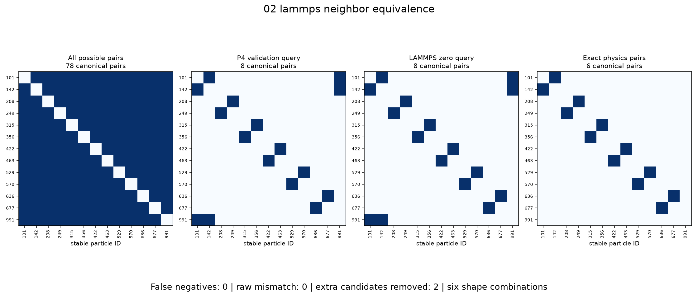

应该看什么：比较所有可能配对、两条查询路径与精确筛选，确认没有遗漏。

实际看到什么：六种形状组合都有接触见证；查询候选完全一致，精确筛选排除了额外候选，漏检为 0。

有没有异常：查询距离包含验证 skin；这些数值只用于验证，候选本身不是接触或润滑。

**03 — 03_one_step_standalone_vs_lammps.png**

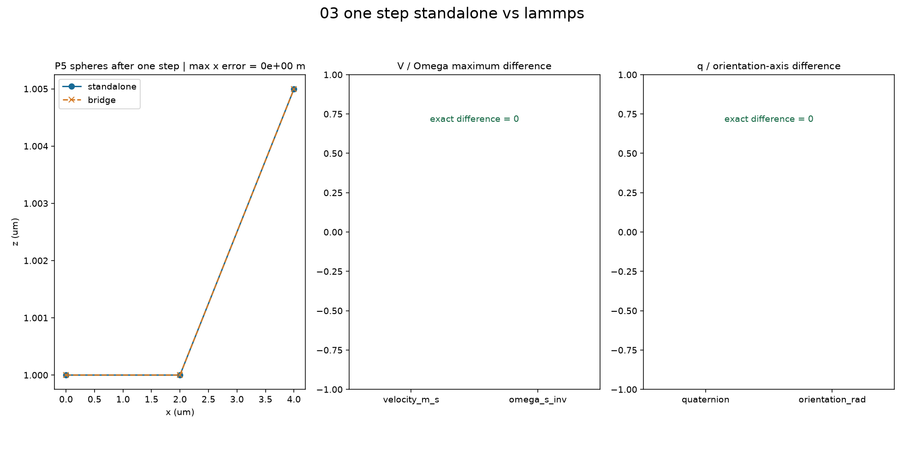

应该看什么：看相同初值经过一个 P5 步长后，位置及 V、Omega、q 是否一致。

实际看到什么：两条路径独立计算后完全重合，位置、速度、角速度和姿态误差均为 0。

有没有异常：未放宽容差；同时保存按 float64 运算尺度推导的舍入预算。

**04 — 04_multistep_bridge_parity.png**

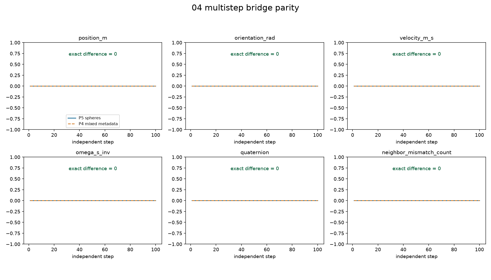

应该看什么：看独立连续推进 100 步是否积累误差，以及邻居是否分歧。

实际看到什么：P5 球体场景和 P4 混合形状场景的所有误差曲线均为 0，邻居不匹配数为 0。

有没有异常：混合 RBC 只验证原 P4/P2 运动与元数据，不新增或宣称 P5 非球形流体动力学。

**05 — 05_resistance_system_parity.png**

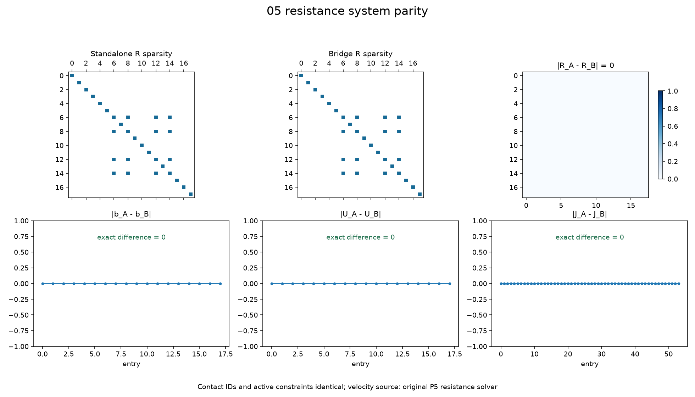

应该看什么：比较 R 的非零结构、元素、右端、求解速度和接触约束。

实际看到什么：R、b、U、J 的最大差均为 0，接触活动集也一致。

有没有异常：接触约束乘子仍沿用 P5 运动学含义，不是 LAMMPS 物理接触力。

**06 — 06_lammps_zero_force_audit.png**

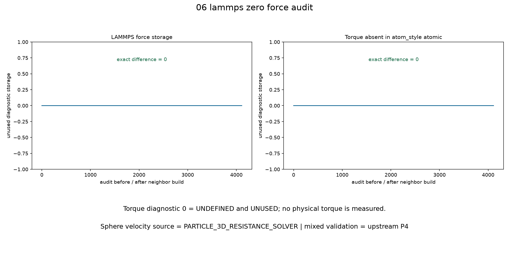

应该看什么：检查每次邻居重建前后是否出现力，并确认速度来源。

实际看到什么：所有已记录 LAMMPS force 为 0；atomic 模式没有 torque 数组，诊断值记为 0，未读作物理输入。

有没有异常：torque 的 0 表示未定义且未使用，不能解释成测得的物理力矩；LAMMPS 时间步始终为 0。

**07 — 07_checkpoint_restart_parity.png**

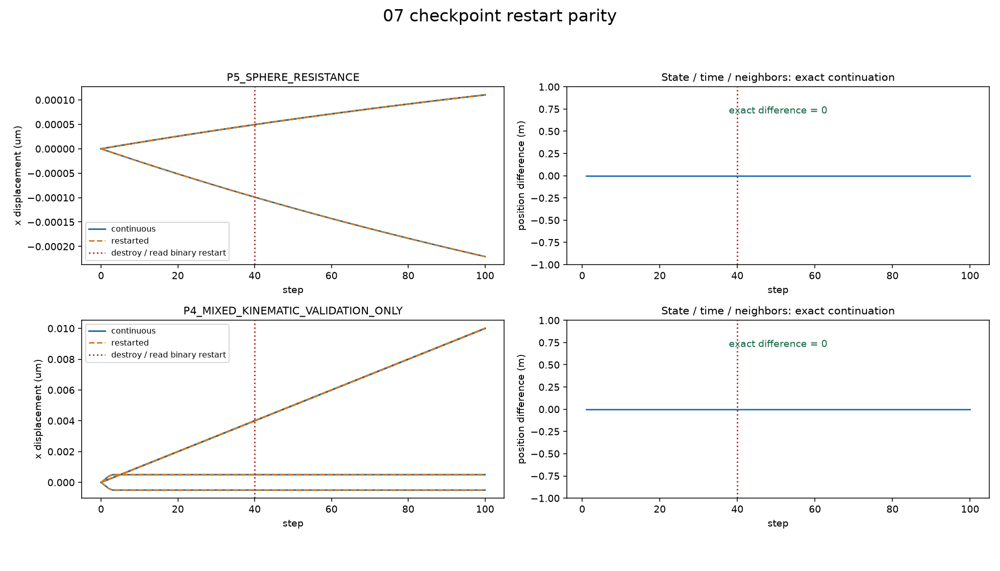

应该看什么：看第 40 步销毁实例并读二进制重启后，是否继续原来的轨迹。

实际看到什么：混合形状和球体场景均完成 40 + 60 步，与连续 100 步逐位相同，时间和步号一致。

有没有异常：重启从二进制恢复粒子，不按种子重新采样；全局物理时间来自带哈希的 sidecar。

**08 — 08_shape_metadata_restart.png**

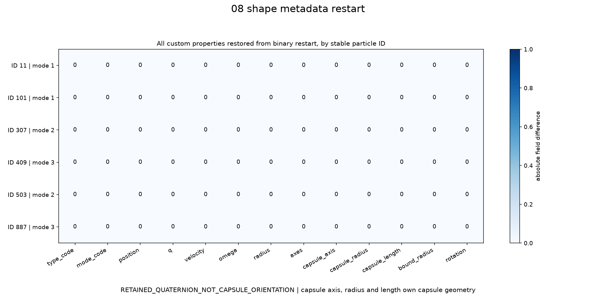

应该看什么：逐字段比较三种形状在 checkpoint 前后的几何和状态。

实际看到什么：每个粒子的全部字段差为 0，椭球原旋转矩阵、胶囊轴和保留四元数都恢复。

有没有异常：RETAINED_QUATERNION_NOT_CAPSULE_ORIENTATION；额外保存旋转矩阵是为保留原 P4 状态的最后一位。

**09 — 09_real_fem_standalone_vs_lammps.png**

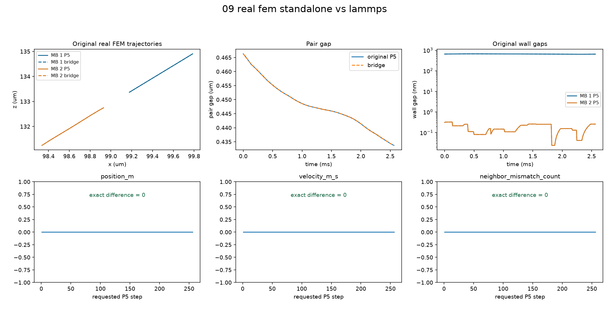

应该看什么：看原 P5 双 MB 在真实冻结流场中的轨迹、间隙及误差。

实际看到什么：原始 P5 入口重新运行后与桥接结果完全一致，墙隙、粒子间隙、近场启用、阻力残差和出口事件一致。

有没有异常：没有移动初值或改半径、步长、时长；亚纳米墙隙的连续介质有效性仍未建立，真实 RBC 动力学仍延期。

**10 — 10_neighbor_rebuild_stress.png**

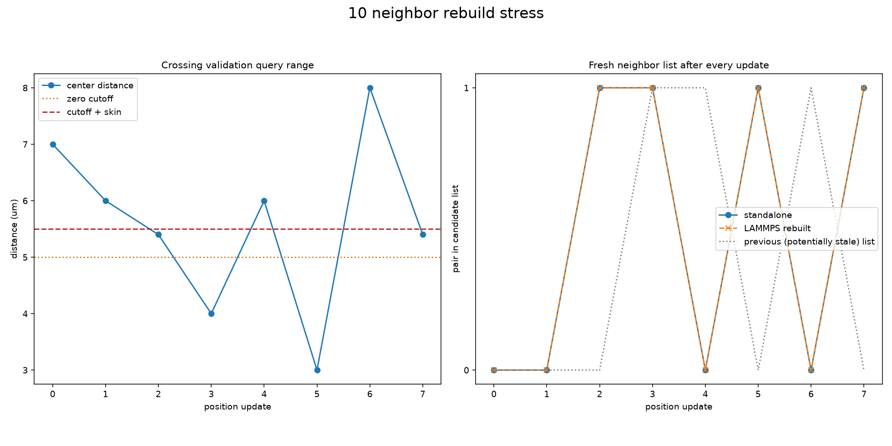

应该看什么：看粒子跨过查询范围后，更新位置能否刷新候选列表。

实际看到什么：每次更新都强制重建，LAMMPS 与 standalone 的候选状态一致；保存的旧列表在多次跨越时确实会失效。

有没有异常：这是显式位置写入的查询压力测试，不是新物理积分器，也不冻结生产 cutoff 或 skin。

## 12. 当前限制

- no LAMMPS force physics；
- no LAMMPS dynamics integrator；
- no production neighbor cutoff；
- no production neighbor skin；
- no production lubrication cutoff；
- no production timestep；
- non-spherical lubrication not frozen；
- real RBC passage not established；
- real RBC dynamics bridge deferred；
- serial correctness only，本轮没有 MPI 多 rank smoke；
- no full suspension。

亚纳米间隙连续介质有效性 NOT_ESTABLISHED。固定验证 box 越界会报错；私有依赖适配只支持锁定 P0–P5 版本。没有执行 CFD，没有开始 Particle-7，也没有 push 或 merge main。

## 13. 人工审核状态

AUTOMATED_CHECKS = PASS

MANUAL_VISUAL_REVIEW = PASS

STAGE_RESULT = PASS_WITH_CARRY_FORWARD_LIMITATIONS

用户在 Particle-6.5 请求中确认本阶段人工审核通过并授权继续。全部上游限制继续保留；确认来源和状态见 [人工审核确认记录](PARTICLE6_MANUAL_ACCEPTANCE.json)。原 PARTICLE6_VALIDATION.json 保留生成时的待审核快照，不重写历史自动证据。
