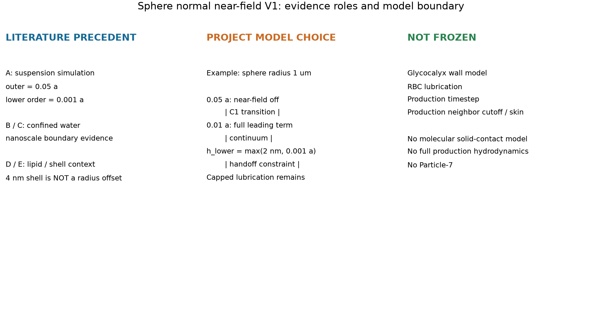
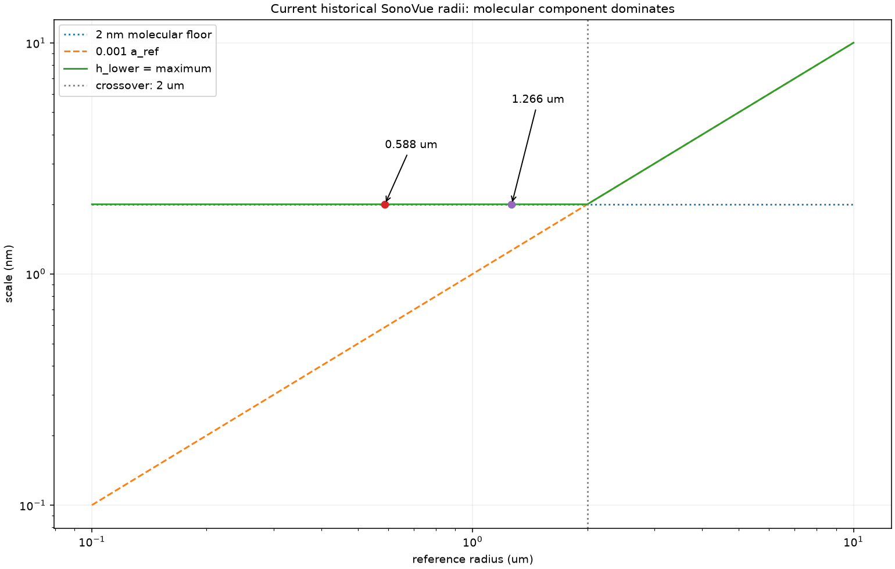
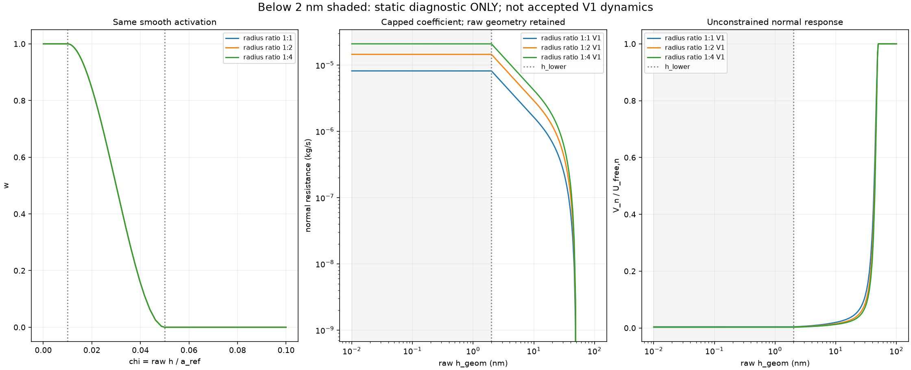
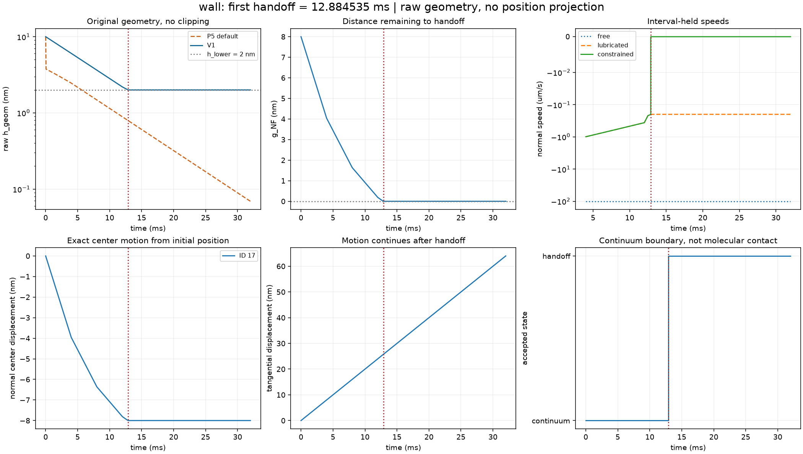
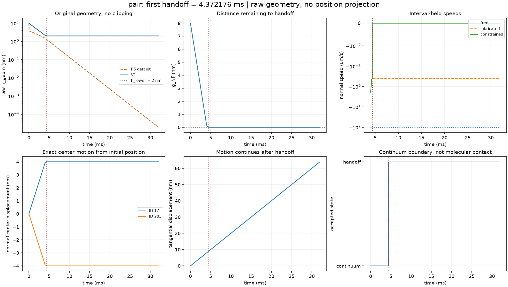
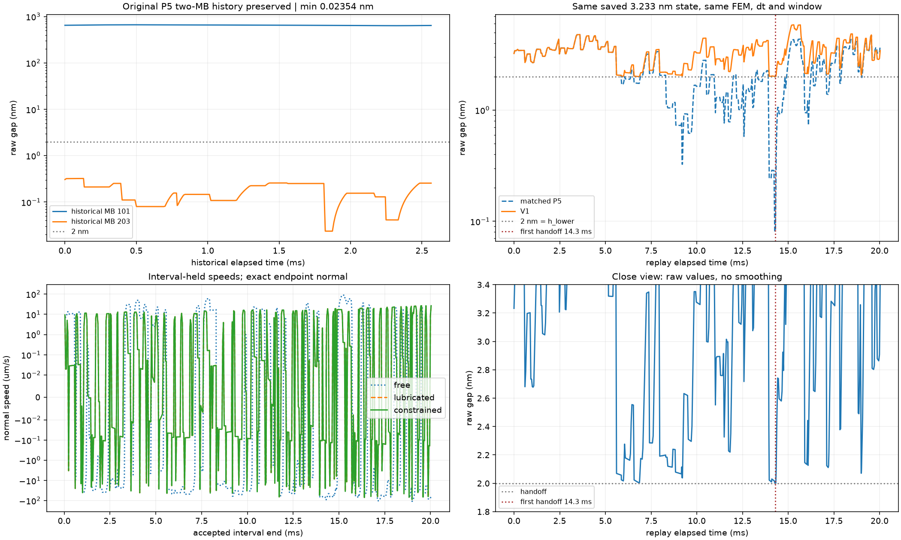
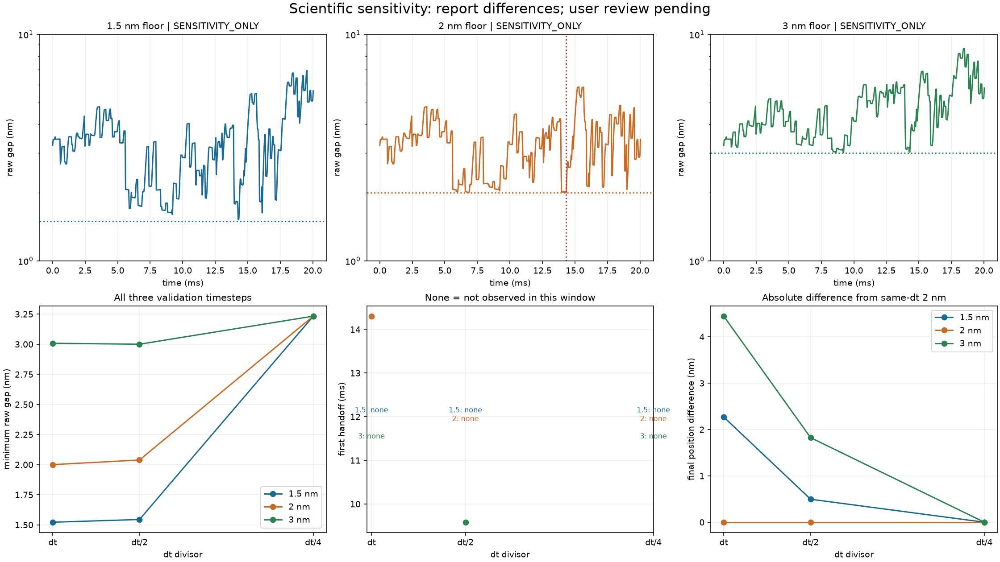
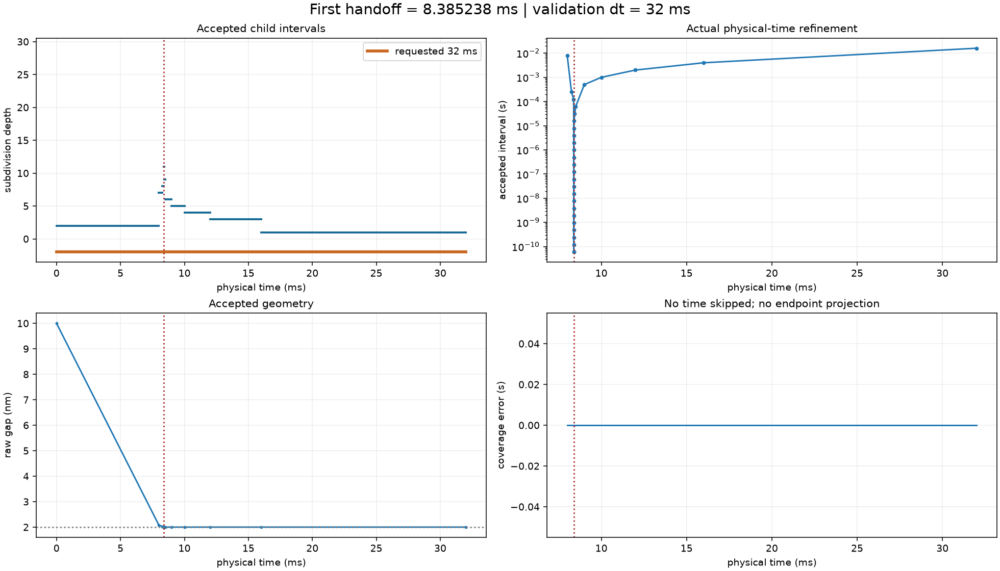
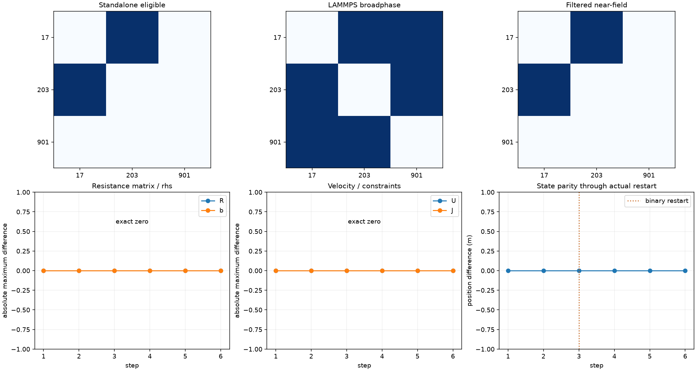
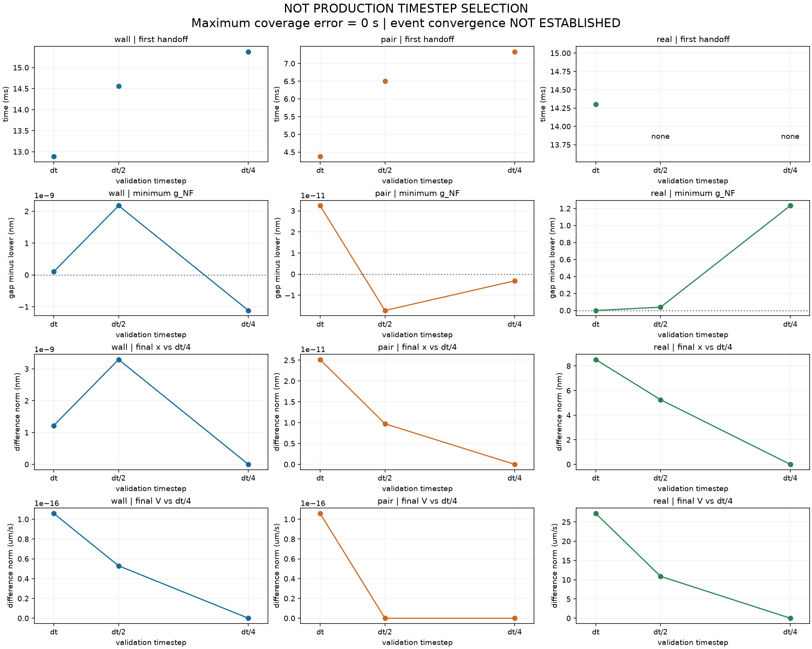

# Particle-6.5 人工审核报告

分支：`dev/particle-6-5-nearfield-regularization-20260921`。源码提交：`57dfe7bd15b29aca9a941ab4fd74dae081d9f161`（EXACT_COMMIT_SOURCE_SHA_VERIFIED）。机器记录：[PARTICLE6_5_VALIDATION.json](PARTICLE6_5_VALIDATION.json)。

## 1. 为什么要做这一阶段

P5 只要原始几何间隙大于 float64 舍入预算，就继续使用球形法向 1/h 阻力，因此旧双 MB 回放算到了 0.0235408855 nm。它是保存下来的数值结果，不能解释为可信的普通血液连续薄膜。P6 只增加桥接，没有解决这一物理解释边界。旧 P5 报告、图、数据和 P0–P6 数值源码逐文件哈希保持不变；P6 人工 PASS 只作证据更新。

## 2. 文献告诉了我们什么

直接模拟先例来自 Ness (2023)：典型低间距尺度 O(10⁻³a)，外截断 0.05a。受限水的 PNAS 2017 与 Nature Materials 2026 结果只是跨领域连续介质边界证据：前者讨论纳米孔直径，后者使用特定固体界面，不能直接标定血管薄膜。Marsh 的约 0.2–0.3 nm 是脂质水合力衰减长度；Tu 等采用的 4 nm 是壳厚假设，均只作界面背景。

2 nm、完整启用边界 0.01、平滑过渡和两球 min-radius 参考长度属于明确批准的项目建模选择。完整来源、DOI、定位与适用限制见[文献审计](literature/NEAR_FIELD_REGULARIZATION_LITERATURE.md)与[机器来源表](literature/SOURCES.json)。没有引入文献中的惯性、摩擦、表面力或壳层力学。

## 3. 三个关键尺度

χ=h_geom/a_ref。χ≥0.05 时仅关闭本 leading 近场修正，Frozen FEM 的自由流仍在。χ≤0.01 且 h_geom>h_lower 时完整使用 P5 leading term。h_lower=max(2 nm,10⁻³a_ref) 是连续介质交棒边界。球墙 a_ref=a；球球 a_ref=min(ai,aj)，系数仍使用 ai·aj/(ai+aj)。对极小半径，完整区可能为空，代码按合同计算而不改尺度顺序。

当前历史半径约 0.588 与 1.266 µm，悬浮液分量分别约 0.588 与 1.266 nm，两者由 2 nm 控制；大于 2 µm 后由粒径项控制。原始 h_geom 始终保存；h_eff=max(h_geom,h_lower) 只进入阻力分母；约束使用独立的 g_NF=h_geom−h_lower。

## 4. 为什么不能突然打开 lubrication

在 0.01–0.05 中使用 w=1−3s²+2s³，s=(χ−0.01)/0.04。权重有界、单调，两个端点导数为零，避免人为硬开关。源码使用代数等价的 (1−s)²(1+2s)，改善外端附近的舍入表现。它是数值耦合选择，并非生物测量参数。

## 5. 为什么是 2 nm

2 nm 是用户批准的 continuum handoff model choice，**不是直接测得的 SonoVue–小鼠血管 cutoff，也不是真实固体接触距离**。纳米约束水与脂质界面证据提示不能无条件把体相连续介质公式延伸到任意小距离。合同因此停止解释更小间隙；没有把 2 nm 伪装成浮点误差或糖萼厚度。

## 6. 为什么还有 1e-3 a

该相对粒径尺度有悬浮液模拟先例，防止将下限永远固定为 2 nm。V1 取相对尺度与分子尺度的较大值，保留两个分量及主导项。壳厚 4 nm 仅作背景，不加到 sampled outer radius；墙面也未增加糖萼偏置。

## 7. 什么叫 CONTINUUM_HANDOFF_CONTACT

这是当前连续介质模型到达下限的状态，**不是原子或分子意义的真实固体接触**。保留封顶的润滑阻力，用原 P5 阻力度量和无摩擦约束限制继续靠近的法向速度，切向仍可运动。原 P3/P4 的 h_geom=0 几何接触实现未改。

跨界试探调用原 P3 二分物理时间积分器，重新解左子区间，再完整处理右子区间。连续证书同时检查原几何与 g_NF；不接受端点安全但中间穿越的路径，不回推位置。交棒判定只允许原几何舍入预算，例如真实 WALL 为约 2.0094×10⁻¹⁷ m，远小于 0.1 nm。到达时刻对应这个数值带，不宣称数学根的无限精度。

## 8. 真实 P5 亚纳米轨迹怎样改变

原双 MB 起点中 ID203 的间隙已为 0.305838 nm，无法同时保留原中心又作为 V1 合法初态；新 API 明确拒绝，未移动粒子。改用 **P5 已保存的 `MINIMUM_ORIGINAL_APPROACHING_GAP` 原样本**：来自 P4 保存轨迹第 125 行、原时刻 0.001252019129187767 s，半径 1.2658269815352818 µm，原始间隙 3.2328727626623765 nm。这里“改用”是选取另一个既存合法状态，不是修正其几何。

从该完全相同的单球状态分别运行旧 P5 默认模型与新 V1；Frozen FEM、WALL、采样自由速度与半径不变。重放时间从这个状态归零，窗口 20.0323061 ms；较短的历史窗口内粒子先离墙，延长窗口用于覆盖再次靠墙。验证基准 dt=4.0064612134008549e-05 s（历史 dt 的 4 倍），另外比较 dt/2、dt/4，全部仅用于验证。

旧双 MB **历史**最小 gap=0.0235408855 nm；本次 **同初态单球 P5 重放**最小 gap=0.0815004496 nm；两者不是同一条轨迹，均明确保留。基准 V1 最小原始 gap=1.99999998541 nm，下限为 2 nm，差值 -1.4593e-17 m 在原几何舍入预算内。首次交棒约 14.302664 ms，进入交棒判定带 6 次，时间覆盖误差 0 s。进入次数按接受状态判定带的进出计数，可能包含网格特征切换或离散步长导致的再进入，不等于独立物理碰撞次数。

**步长敏感性未收敛：** dt/2 最小约 2.03837 nm，dt/4 最小约 3.23287 nm，窗口内交棒计数均为 0。不能把基准的 6 次事件和 14.30 ms 当作稳定物理预测。各组都满足连续间隙约束；安全性通过不等于时间精度通过。该窗口没有出口事件，不宣称出口或真实 RBC 通行结果。

## 9. 1.5 / 2 / 3 nm 敏感性

三个尺度使用同一真实初态、FEM、半径、WALL、dt 集合和窗口；仅尺度改变。正式参数仍为 2 nm，1.5 和 3 nm 仅 `SENSITIVITY_ONLY`。2 nm 正式运行同时作为敏感性基准，比较表的所有行均属于科学敏感性证据。

| floor (nm) | 步长 | 首次交棒 (ms) | 进入次数 | 最小 raw gap (nm) | 切向位移 (µm) | 终位置差 (nm) | 终速度差 (µm/s) |
|---|---|---|---|---|---|---|---|
| 1.5 | dt/1 | 未观察到 | 0 | 1.52172688 | 14.5359784 | 2.26877478 | 0.184836656 |
| 1.5 | dt/2 | 未观察到 | 0 | 1.54427847 | 14.5387945 | 0.495723032 | 0.359896115 |
| 1.5 | dt/4 | 未观察到 | 0 | 3.23287276 | 14.5443703 | 0 | 0 |
| 2 | dt/1 | 14.302664 | 6 | 1.99999999 | 14.5359739 | 0 | 0 |
| 2 | dt/2 | 未观察到 | 0 | 2.03837206 | 14.5392743 | 0 | 0 |
| 2 | dt/4 | 未观察到 | 0 | 3.23287276 | 14.5443703 | 0 | 0 |
| 3 | dt/1 | 未观察到 | 0 | 3.00798603 | 14.5401186 | 4.4449765 | 3.06600702 |
| 3 | dt/2 | 9.58206308 | 126 | 2.99999998 | 14.5409883 | 1.82380661 | 1.3348578 |
| 3 | dt/4 | 未观察到 | 0 | 3.23287276 | 14.5443703 | 0 | 0 |

终态差均相对相同 dt 的 2 nm 结果，向量差使用欧氏范数；切向位移定义为首个球净位移在初始精确法向垂直平面内的投影长度，不是沿曲壁积分路程。JSON/CSV 同时保存原始终态向量、绝对差、相对差及排序。未观察到的交棒时间为 null，不用 0 或窗口末值冒充。

全部结果有限且连续约束安全，物理时间完整处理；**事件次数、时刻和终态速度有明显尺度/步长依赖，尚未证明科学稳定性。** 不设置任意 5% 门槛，不代替用户决定可接受性。`SCIENTIFIC_SENSITIVITY_REVIEW = PENDING_USER_REVIEW`。

## 10. 自动测试

开发前 Frozen/P0–P6 共 489 项全部通过。最终回归如下；详细命令、stdout 与 JUnit 在 [logs](logs/) 中，源码、历史证据、数据与图片哈希见机器记录。

| 测试组 | 数量 | 状态 |
|---|---|---|
| frozen | 18 | PASS |
| particle0 | 46 | PASS |
| particle1 | 67 | PASS |
| particle2 | 74 | PASS |
| particle3 | 90 | PASS |
| particle4 | 69 | PASS |
| particle5 | 63 | PASS |
| particle6 | 62 | PASS |
| particle6_5 | 60 | PASS |

新增永久测试覆盖合同、文献角色、C1 端点、粒径交叉、原半径和墙不变、球墙/球球解析阻力、交换对称、交棒、连续区间证书、每步 x_new=x_old+dt·V、时间覆盖、真实样本、3×3 敏感性、实际 LAMMPS 和二进制重启，以及从保存数据逐位再生全部图。静态扫描下限以下只是诊断，不会成为 V1 动态接受状态。LAMMPS 多余候选被物理筛选剔除，R、b、U、J、x 与独立路径完全相同。原 P6 62 项回归保留三形状元数据与历史重启验证。

## 11. 人工审核图片

应该看什么：区分文献先例、项目选择和尚未冻结的模型。

实际看到什么：0.05a 与 10⁻³a 有悬浮液先例；2 nm、0.01 与平滑函数按批准的项目合同使用。

有没有异常：文献没有直接测得 SonoVue–小鼠血管 2 nm 接触距离；图中尺度顺序以 1 µm 球为例。

应该看什么：看权重是否有跳变，两个端点斜率是否归零。

实际看到什么：权重从 1 平滑降到 0，导数在两个端点为 0，区间内不回升。

有没有异常：无数值异常；smoothstep 是数值耦合选择。

应该看什么：看分子尺度与粒径尺度在哪相交。

实际看到什么：2 µm 半径处相交；历史约 0.588 与 1.266 µm 两个例子的下限都为 2 nm。

有没有异常：没有将下限硬编码为总是 2 nm，也没有改采样半径。

应该看什么：看原始 gap、权重、阻力和未施加约束时的法向速度。

实际看到什么：V1 外区贡献为零，完整区与 P5 leading term 一致，分母在下限封顶。

有没有异常：下限以下仅为静态诊断扫描；虚线 P5 leading 是公式参照，点线 P5 default 保留原启用范围。

应该看什么：看等半径、1:2 和 1:4 配对的权重、阻力与相对法向速度。

实际看到什么：参考长度均取较小半径，阻力仍使用原 R_eff；交换配对顺序不改变结果。

有没有异常：图示为未约束的静态响应；下限以下不属于可接受的动态状态。

应该看什么：看靠墙球到交棒时刻后的间隙、速度和切向位移。

实际看到什么：V1 保留约 2 nm 原始间隙并约束法向速度；切向位移继续增长，P5 对照继续进入更小间隙。

有没有异常：无位置回推；P5 对照沿用旧 0.01 硬切换，初期差异也包含旧启用边界效应。交棒时刻需结合图 11。

应该看什么：看两球是否对称靠近，交棒后是否继续处理切向运动。

实际看到什么：两球中心关于中线对称，间隙停在下限，公共切向运动继续。

有没有异常：图中旧 P5 初始 gap 超过它的默认配对启用范围；该历史默认行为保留。

应该看什么：区分旧双 MB 历史、同初态 P5 重放和 V1 重放。

实际看到什么：旧 0.02354 nm 历史保留；同一 3.233 nm 保存状态重放中，P5 最小约 0.0815 nm，V1 最小约 2 nm。

有没有异常：旧双 MB 起点已低于下限而被拒绝；本图的有效起点未移动，交棒次数对步长敏感。

应该看什么：分别看 1.5、2、3 nm 原始轨迹及差异，留意未观察到的事件。

实际看到什么：三个尺度独立显示，记录最小 gap、交棒时间、位移与终态差异；未发生的交棒不填零。

有没有异常：事件及终态速度有步长和尺度依赖；没有用人为百分比宣布科学敏感性通过。

应该看什么：看跨越下限的大试探是否细分，剩余时间是否处理。

实际看到什么：越界试探被拒绝，接受子区间完整覆盖请求窗口，原始 gap 保留，切向运动继续。

有没有异常：时间细分保证约束安全，不能替代整体时间精度收敛验证。

应该看什么：看多余 LAMMPS 候选如何筛选，以及 R、b、U、约束和位置差。

实际看到什么：候选包含额外配对，精确近场筛选后与独立路径相同；所有矩阵及状态差为零，实际二进制重启后继续一致。

有没有异常：只验证单 MPI rank；邻居 cutoff 与 skin 均为验证设置。

应该看什么：看 dt、dt/2、dt/4 的事件、最小间隙、终态位置和速度。

实际看到什么：各组完整覆盖时间并保持下限；真实场景交棒次数由 6 变为 0、0，合成事件时间也随步长变化。

有没有异常：尚未证明时间精度或事件拓扑收敛；本图不选择生产步长。

## 12. 当前限制

- 仅 sphere normal near-field；没有完整远场多体 mobility 或多墙流体动力学。
- 没有切向润滑、旋转润滑耦合、RBC 润滑。
- 没有糖萼模型、真实分子接触模型、黏附、表面粗糙度分布、壳层力学。
- 生产 timestep、neighbor cutoff 和 skin 均未冻结；事件和时间精度收敛尚未建立。
- 没有 full suspension；真实 RBC 动力学仍延期，真实 RBC passage 仍未建立。
- LAMMPS 仅验证单 MPI rank，负责状态、邻居、重启；没有采用其力积分或时间推进。

合同可称 `SPHERE_NORMAL_NEAR_FIELD_REGULARIZATION_V1`，不能称为完整生产流体动力学。P0–P6 默认模型与历史证据保留。未运行 CFD、未 push、未 merge main；完成后停止于 Particle-6.5。

## 13. 人工审核状态

AUTOMATED_CHECKS = PASS

MANUAL_VISUAL_REVIEW = PENDING_USER_REVIEW

SCIENTIFIC_SENSITIVITY_REVIEW = PENDING_USER_REVIEW

Particle-7 started = NO

用户在 Particle-7 请求中已完成本阶段人工审核：MANUAL_VISUAL_REVIEW=PASS，SCIENTIFIC_SENSITIVITY_REVIEW=PASS_WITH_LIMITATION，STAGE_RESULT=PASS_WITH_CARRY_FORWARD_LIMITATIONS。事件时间收敛仍未建立，事件次数仅为求解器诊断。原机器验证快照保留，后续授权以[人工验收记录](PARTICLE6_5_MANUAL_ACCEPTANCE.json)为准。
