# Particle-7 人工审核报告

## 1. 这一阶段做了什么

已建立 RBC 和微泡的持续入口预约、有限尺寸接纳、保留原粒子的排队、稳定 ID、出口记录与删除、动态 LAMMPS 存储及二进制重启。P6.5 人工验收已用独立 evidence commit `b0e92f1` 记录；原数值结果未改。

本阶段是入口与生命周期基础设施。长测试使用宽开口的短控制区和共同平移速度；实际 LAMMPS 混合生命周期另做独立验证。真实 Frozen 场景只做接纳与拥堵 smoke，接纳后的形状作为静态障碍保留；没有把尚未接受的真实混合 RBC 运动模型补进去。真实通量控制预约时刻，但真实 smoke 不能解释为 42.9863 秒的血管内输运轨迹。另有独立的真实入口单微泡 P6.5 验证：保持原始尺寸，出生在入口面，随后用 1 ms 真实时间推进，位移 0.440609 µm；它不与混合拥堵场景合并计数。

## 2. 为什么 RBC 用 45%

[Patel 等 2025，表 2](https://pmc.ncbi.nlm.nih.gov/articles/PMC11808370/) 给出 10–14 周 C57BL/6 小鼠 Hct：雄鼠 45.7±2.37%，雌鼠 44.8±2.55%。本项目按用户确认采用 H_D=0.45，作为文献支持的 V0 入口 RBC 体积流率比例。

H_D 说的是入口带进来的 RBC 体积相对于全血流量的比例；tube Hct 说的是选定区域里此刻统计到的 RBC 体积。这里没有强迫管内每一刻都是 45%，也没有降低 H_D 来制造毛细血管效应。

## 3. 为什么微泡用 8.5e6/mL

[Dauba 等 2025，第 2.6.1 节](https://pmc.ncbi.nlm.nih.gov/articles/PMC12445601/) 的 C57BL/6 动物体重为 32.6±10.6 g，静脉微泡剂量为 2e7。[FAU IACUC 指南](https://www.fau.edu/research-admin/research-integrity/files/guidelines-for-rodent-survival-blood-collection-final.pdf) 提供 72 mL/kg 的成年健康鼠血量估计。

0.0326×72=2.3472 mL；2e7/2.3472≈8.52079e6/mL，按用户合同取 8.5e6/mL，即 8.5e12/m³。这是名义充分混合后的稀释锚点，不是直接测量的血中浓度，不是用户实验鼠的实测值。浓度接口保留 C_MB(t)，当前常数只用于验证窗口；未加入完整 PK、清除、溶解、破坏或半衰期。

## 4. 入口为什么不能均匀撒粒子

流得快的位置每秒带进更多粒子。正式 INLET 的线性法向速度先按 q=0 裁剪，再精确积分正通量；三角形选择和三角形内位置都按通量加权。位置采样使用等价的 Dirichlet 混合方法，不是均匀面积撒点。保存了 100000 个真实入口验证点和三个各 100000 点的解析对照。

Q_in=2.73691323909e-15 m³/s；三个出口分别为 {'OUTLET_03': 2.8838699326639187e-16, 'OUTLET_01': 1.1653417879825574e-16, 'OUTLET_02': 2.3319920670259264e-15}。有符号质量相对差 -1.441e-16，未调整 FEM。出生中心在正式入口表面，没有人工向内偏移。

## 5. MB 怎么决定什么时候出生

累计 A_MB=∫C_MB(t)Q(t)dt，每跨过一个整数就预约一个微泡，使用区间内部的真实事件时刻。尺寸只从原 SonoVue inverse-CDF 抽取一次。当前真实入口速率为 0.0232637625 个/s，平均间隔 42.9853081 s。预约数相对期望数的误差小于一个粒子；这不是 Poisson 到达。

## 6. RBC 怎么决定什么时候出生

先用原 P2 分布抽好下一只 RBC，包括真实体积和原始来源。当目标体积 B_RBC=∫0.45Qdt 达到已预约体积加这只 RBC 的体积，才预约它，然后预抽下一只。平均体积只用于展示事件密度，绝不用于生成时刻。真实入口目标 RBC 体积流率为 1.23161096e-15 m³/s。

长测试目标体积 5.29544117647e-11 m³，预约实际体积 5.29543837933e-11 m³，末端差 2.79713878e-17 m³，小于下一只 RBC 的 3.63742113e-17 m³。

## 7. 为什么有 pending queue

入口暂时放不下时，保留原来的 ID、尺寸、四元数、来源和预约时刻，下一次再试位置。MB 与 RBC 各自按预约时刻和 ID 排成 FIFO；这避免一个不能入场的 RBC 让 MB 连实际尝试都没有。单次候选数上限 512 是实现保护，不是科学参数；真实 smoke 为控制计算成本对 RBC 每次访问尝试 1 个位置，对 MB 最多 512 个，失败不丢弃。

真实 smoke 实际预约/接纳/排队：MB=1/0/1，RBC=1110/1/1109。拒绝记录为 `{'DEFORMATION_INFEASIBLE': 1767, 'GUARD_EXHAUSTED_PENDING': 2224, 'ACCEPTED': 1, 'PAIR_REJECTED': 627, 'WALL_REJECTED': 850, 'WALL_NEARFIELD_REJECTED': 2}`。这些计数属于有静态障碍的入口接纳验证，不能当作真实血管通量或生理尺寸筛选结论。

## 8. RBC orientation

采用四维各向同性高斯归一化得到 Haar SO(3) 姿态，使用原 P2 的 wxyz、body→world 约定。这是暂定的 ISOTROPIC_RANDOM_SO3_V0，并非实测 C57BL/6 入口姿态分布。MB 尺寸、MB 位置、RBC 几何、RBC 姿态、RBC 位置、重试六条 RNG 相互独立，主种子 2026092107。未来改变姿态算法不会改变 MB 尺寸序列。

## 9. ID / outlet / restart

ID 在预约时分配，严格递增，不因排队或离场复用。首次穿过出口由原 P1/P3 三角形相交器判定，保存预约、接纳、退出时刻、寿命、出口角色、原始来源和轨迹摘要；随后从 Python 与 LAMMPS 同时删除。邻居在增删后重建并与独立枚举对照。LAMMPS 的局部索引不当作 ID，删除明确禁止重新编号。

实际 LAMMPS 混合验证在 1180 个事件后保存并销毁实例，恢复后继续至 2358 个事件，未来事件和活动状态完全一致。checkpoint 保存实际二进制状态、原 P6 属性模式、全部 RNG 状态、下一只 RBC、预取缓冲区、两条 pending 队列、当前累计通量和历史记录，不重新抽样重建历史。

长混合测试有 1000 个 MB 与 1106244 个 RBC，全部实际接纳；末端 MB 活动/退出=0/1000，RBC 活动/退出=4/1106240。原参数下 1000 个微泡自然对应约 110 万个 RBC；调 Q 只会改变速度，不能改变该数量比例。完整压缩 CSV 有 1107244 行，并经过独立逐行守恒核查。

## 10. 自动测试

| 测试组 | 数量 | 结果 |
|---|---:|---|
| frozen | 18 | PASS |
| particle0 | 46 | PASS |
| particle1 | 67 | PASS |
| particle2 | 74 | PASS |
| particle3 | 90 | PASS |
| particle4 | 69 | PASS |
| particle5 | 63 | PASS |
| particle6 | 62 | PASS |
| particle6_5 | 60 | PASS |
| particle7 | 56 | PASS |

当前总数 605，自动状态 `PASS`。测试日志、JUnit、命令清单及 source/data/figure SHA256 均保存。永久测试覆盖文献合同、正通量积分、解析/真实入口采样、非恒定 profile、确定性事件、体积阈值、SO(3)、随机流、finite-size admission、pending、ID、LAMMPS、出口、重启与证据文件。

## 11. 人工审核图片

### 00. 00_particle7_scope_and_literature

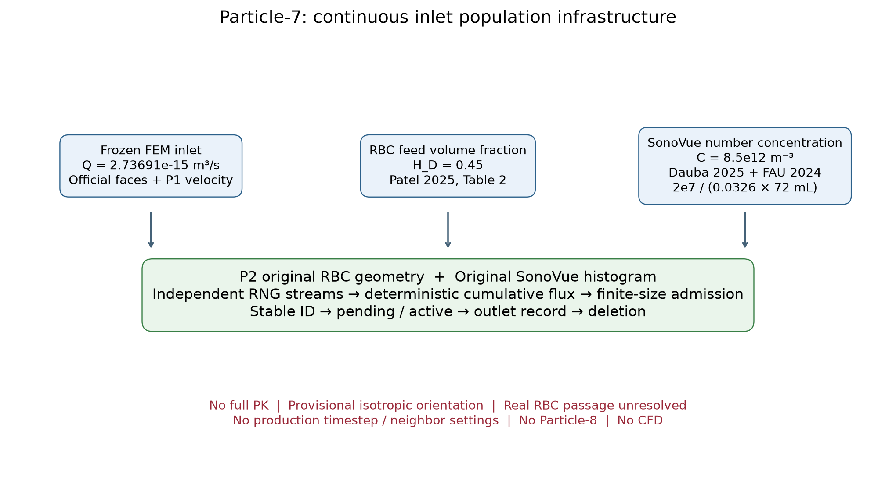

应该看什么：入口流量、两条文献依据和模型范围。

实际看到什么：图中连接了 Frozen 通量、P2/SonoVue 原采样器和生命周期；浓度是估算锚点。

有没有异常：没有把估算浓度、暂定姿态或基础设施测试说成最终生理模型。

### 01. 01_frozen_inlet_flux_map

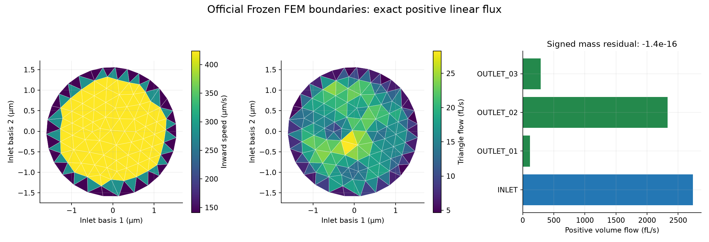

应该看什么：入口三角形速度及通量贡献；三个出口总流量。

实际看到什么：入口 Q=2.73691324e-15 m³/s；有符号相对流量差 -1.44e-16。

有没有异常：无需调整 Frozen FEM。

### 02. 02_flux_weighted_inlet_sampling

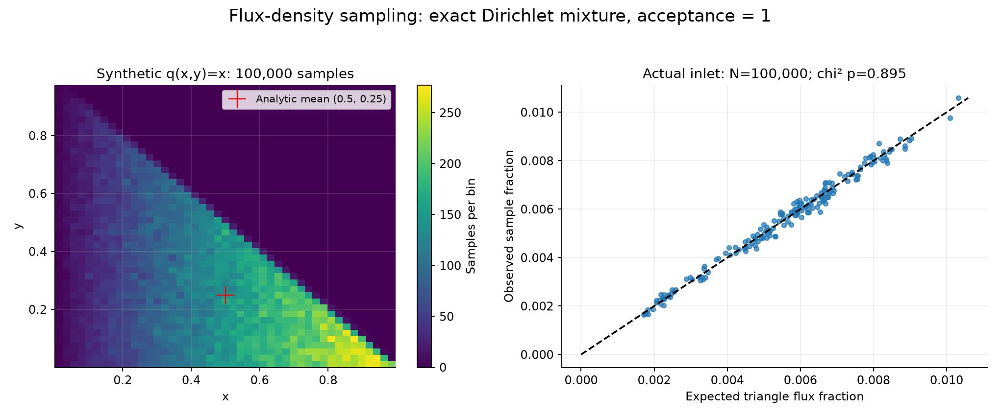

应该看什么：线性速度越高的区域是否更常被采到。

实际看到什么：真实入口保存 100000 点；三角形频率检验 p=0.8952。

有没有异常：未发现采样统计异常；显示点不是正式粒子。

### 03. 03_mb_cumulative_flux_scheduler

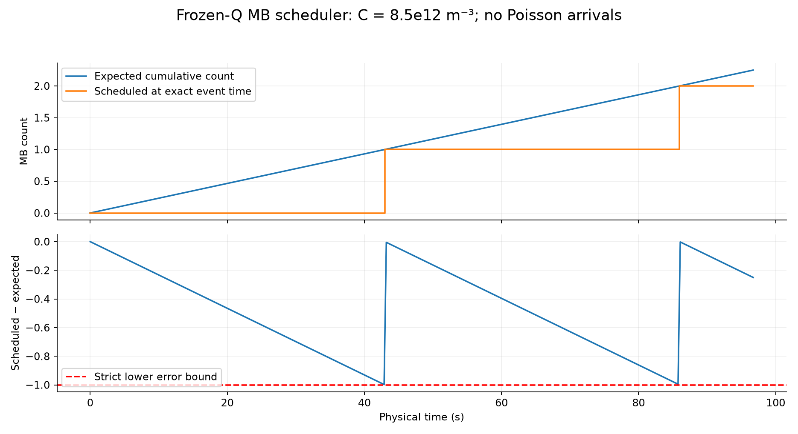

应该看什么：微泡事件是否落在累计数量跨整数的真实时刻。

实际看到什么：预约数与期望数差始终小于 1；记录的最大绝对差 0.999121957。

有没有异常：没有把事件钉在调用步长末端。

### 04. 04_rbc_volume_flux_scheduler

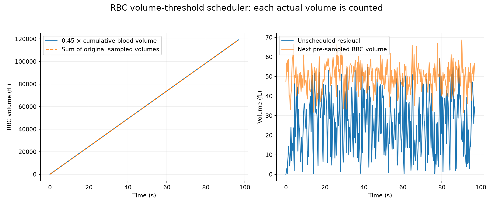

应该看什么：实际 RBC 体积之和是否跟随目标；残差是否小于下一只 RBC。

实际看到什么：最大记录残差 59.162 fL；所有检查点都小于各自下一只 RBC 体积。

有没有异常：没有用平均 RBC 体积决定事件。

### 05. 05_rbc_isotropic_orientation_validation

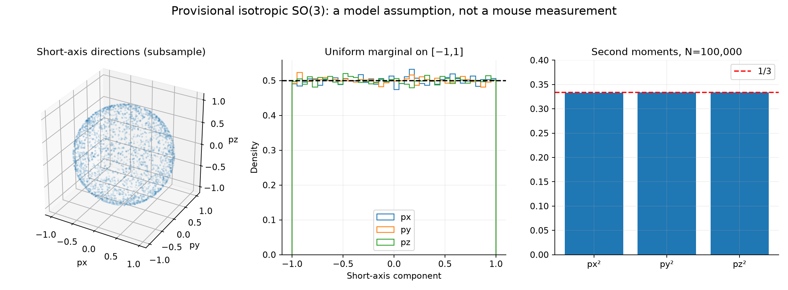

应该看什么：短轴是否遍布球面，分量二阶矩是否接近 1/3。

实际看到什么：100000 个姿态的二阶矩为 [0.332697 0.333451 0.333852]。

有没有异常：统计正常；这仍是暂定的各向同性假设。

### 06. 06_finite_size_inlet_admission

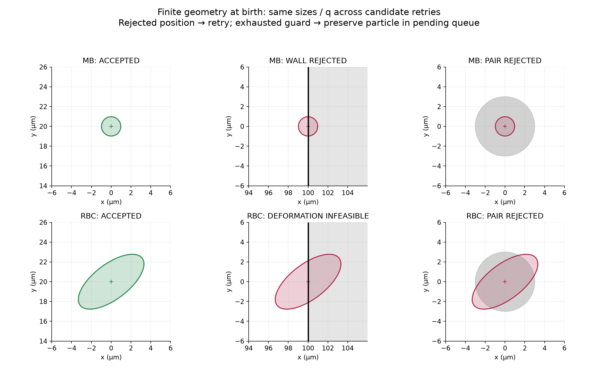

应该看什么：同一个有限形状在接纳、撞壁和撞粒子的候选点表现。

实际看到什么：局部放大图显示原始形状的投影，拒绝后只重试位置。

有没有异常：RBC 的壁冲突按原 P3 判断，不通过换小 RBC 消除冲突。

### 07. 07_pending_injection_queue

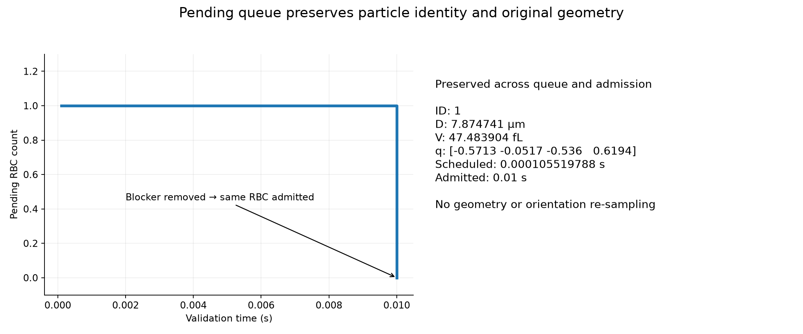

应该看什么：堵塞消失后是否还是原来的粒子。

实际看到什么：ID、预约时刻、D/V、四元数和来源保持一致；队列从 1 降到 0。

有没有异常：未重抽几何或姿态。

### 08. 08_injection_timestep_independence

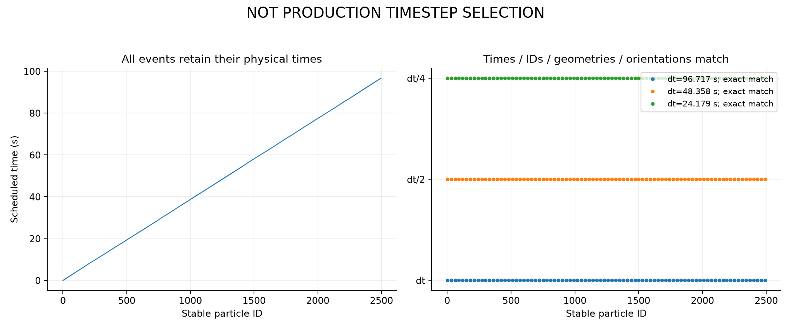

应该看什么：dt、dt/2、dt/4 的预约时刻、ID、几何和姿态是否一致。

实际看到什么：三个分割方式产生完全相同的事件序列。

有没有异常：只证明入口调度独立于调用分割，不证明生产粒子动力学时间步收敛。

### 09. 09_particle_lifecycle_and_outlet_removal

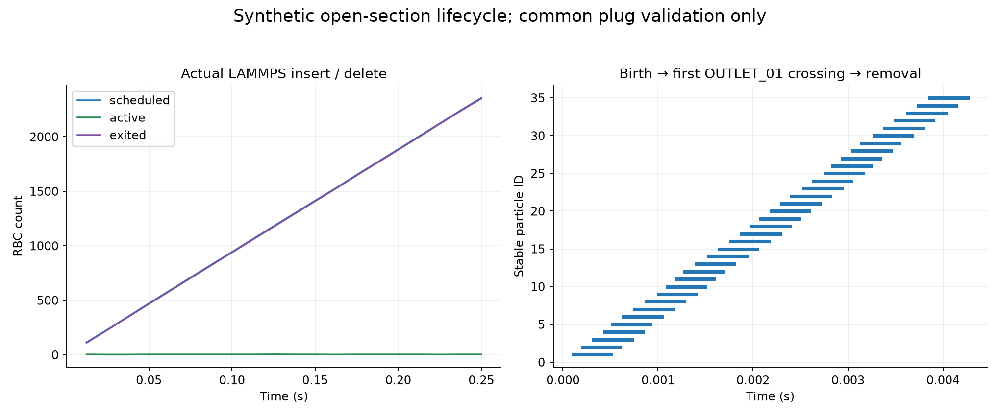

应该看什么：出生、活动、出口记录和删除能否闭合。

实际看到什么：实际 LAMMPS 验证中的粒子按原边界相交器离开 OUTLET_01，退出 ID 不再出现于活动或邻居表。

有没有异常：此处共同平移是基础设施验证，不是完整 RBC 水动力学。

### 10. 10_injection_checkpoint_restart

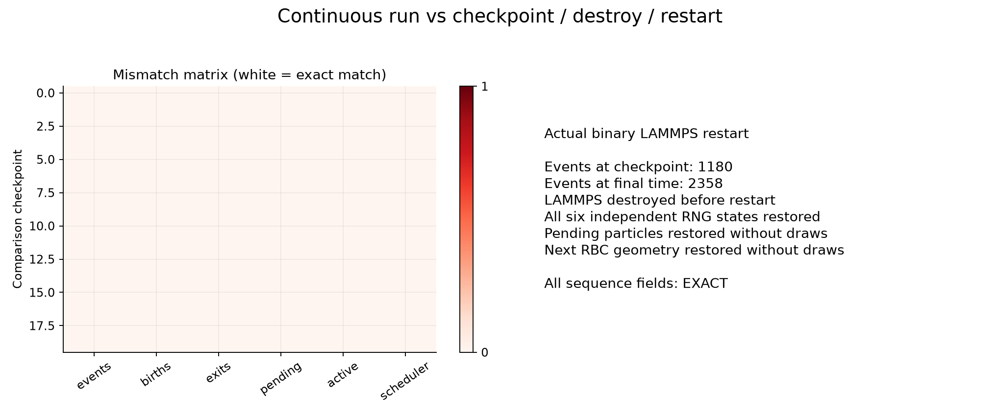

应该看什么：销毁 LAMMPS 后恢复是否改变未来随机序列。

实际看到什么：在 1180 个事件处重启，最终 2358 个事件逐项一致。

有没有异常：随机状态和预抽 RBC 从文件恢复，没有靠 seed 重跑历史。

### 11. 11_long_injection_population_balance

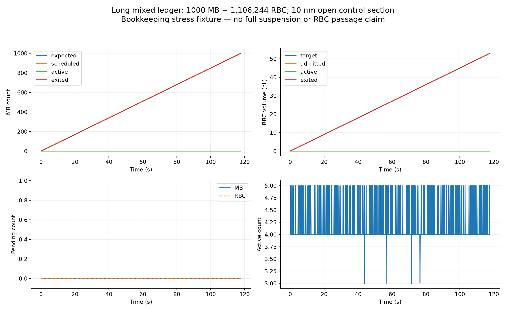

应该看什么：两种粒子的数量、体积、pending 和活动数是否守恒。

实际看到什么：完整长账本有 1000 个 MB、1106244 个 RBC；全部接纳，无 backlog。

有没有异常：通道宽 200 µm、控制区长 10 nm，有限形状跨出开口；只检验生命周期账本和全程几何证书，不支持真实 RBC passage 结论。

### 12. 12_scheduled_vs_admitted_distributions

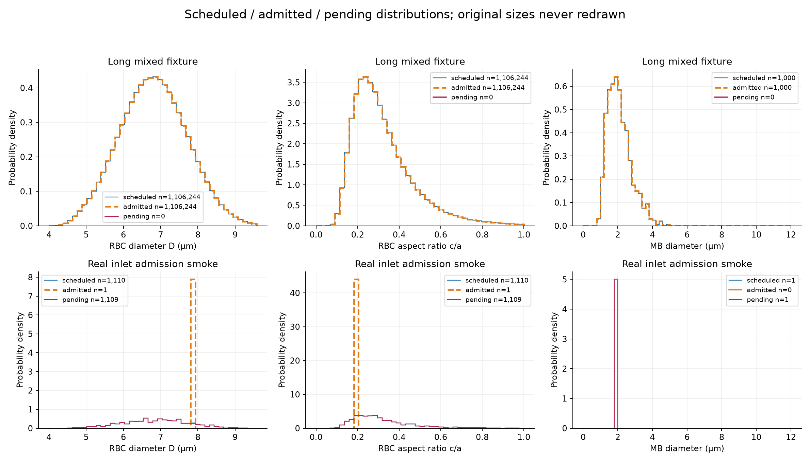

应该看什么：预约、接纳、排队三个分布是否分别显示。

实际看到什么：长测试预约与接纳完全一致；真实入口的接纳数极少，单列原始尺寸，不能据此推断总体偏差方向。

有没有异常：只说明预约分布保留原采样器；真实入口接纳偏差不能隐藏，样本不足以定量外推。

### 13. 13_real_frozen_inlet_injection_smoke

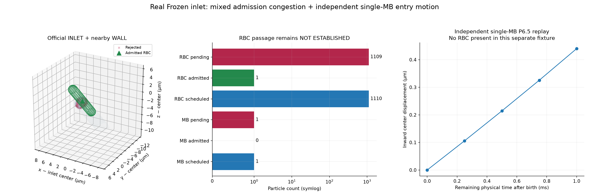

应该看什么：正式入口、附近 WALL、候选点和实际接纳形状。

实际看到什么：真实 smoke：MB 1/0/1，RBC 1110/1/1109（预约/接纳/排队）。

有没有异常：左侧混合场景将接纳形状保留为静态障碍；右侧是另一个无 RBC 的单微泡 P6.5 入管验证，不能把两个场景混成真实混合输运。

### 14. 14_local_tube_hematocrit_diagnostic

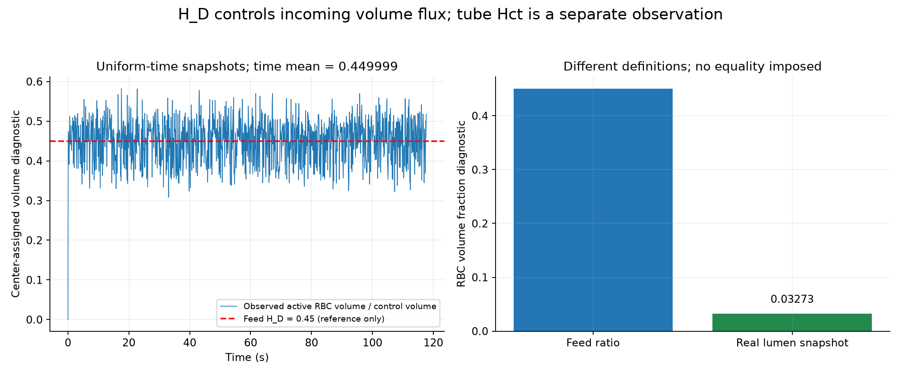

应该看什么：入口 H_D 与控制区实际活动 RBC 体积诊断的区别。

实际看到什么：真实全腔快照诊断=0.03272957；长测试按等间隔物理时间取样，精确驻留时间加权平均=0.449999，没有强制等于 0.45。

有没有异常：跨开口形状按中心归属计完整体积；短控制区值不是几何相交体积分数或已验证的生理 tube Hct。

## 12. 当前限制

- H_D=0.45 是文献 V0，不是该实验鼠实测。
- C_MB 是 nominal post-bolus estimate；没有完整 PK、半衰期或器官清除。
- 各向同性 RBC 姿态是 provisional。
- 真实 RBC passage 仍未建立。真实 smoke 的一个胶囊替代形状入场不代表成功穿过血管。
- 长压力测试采用 200 µm 宽、10 nm 长的开口控制区，共同平移速度；它不是生理血管或完整悬浮液模型。精确支撑平面证明整个平移过程不穿侧壁，P4 判定所有可能相交的粒子对。
- 真实 smoke 是静态障碍接纳验证，不提供完整混合动力学轨迹；完整生命周期已在合成场景执行。
- tube Hct 不强制等于 0.45。跨开口形状以中心归属计完整 RBC 体积，是指定的账本诊断，不能当作相交几何体积分数或生理测量。
- 旧 RBC 漂移关闭；未加入非球形 RBC 润滑。
- 生产时间步、邻居 cutoff/skin、glycocalyx 模型未冻结。P6.5 的 handoff 事件时间收敛仍未建立，事件计数仍是求解器诊断。
- 未执行 CFD，未开始 Particle-8，也不宣称最终 full suspension physics。

## 13. 人工审核状态

AUTOMATED_CHECKS = PASS

MANUAL_VISUAL_REVIEW = PENDING_USER_REVIEW

分支：`dev/particle-7-inlet-population-20260921`。当前证据绑定基础提交：`33493be8a04224781b0f04131692f069ec7b9811`，准确实现以机器 JSON 中逐文件 SHA256 为准。

[机器验证记录](PARTICLE7_VALIDATION.json) · [文献数值来源](literature/sources.json) · [完整长账本](data/11_long_lifecycle.csv.gz)
