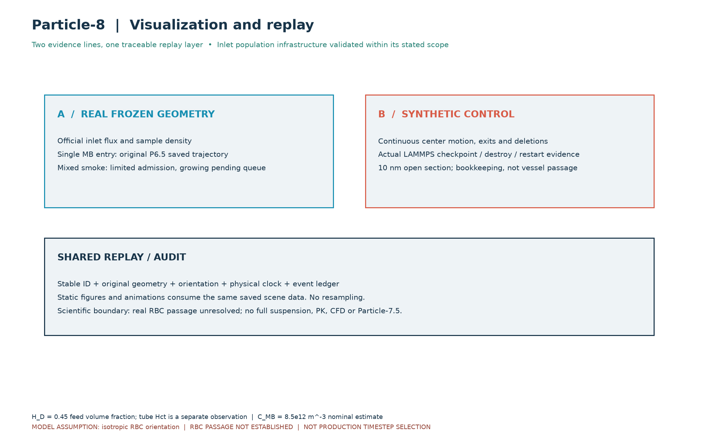
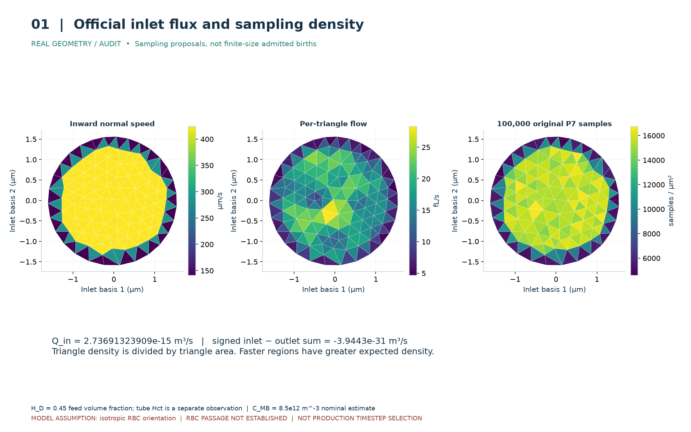
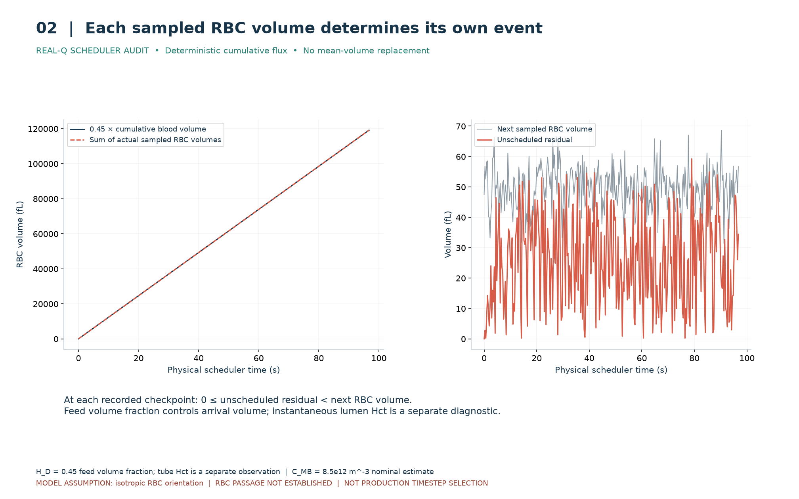
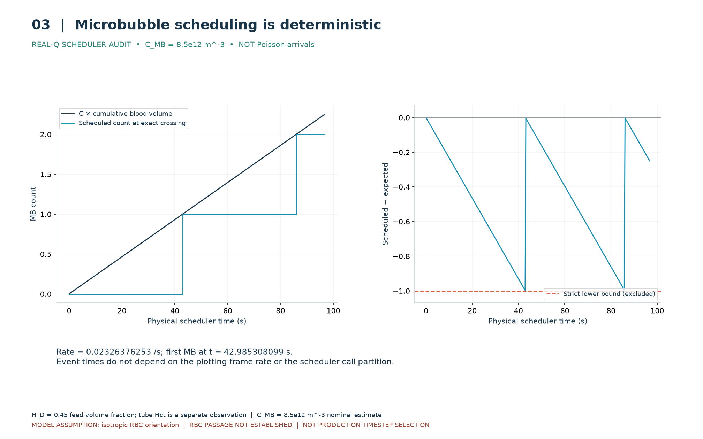
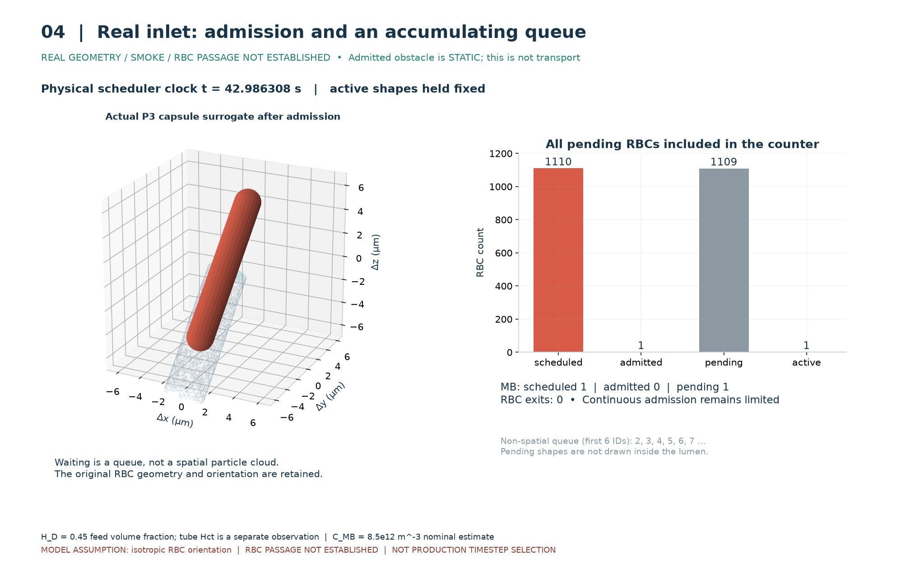
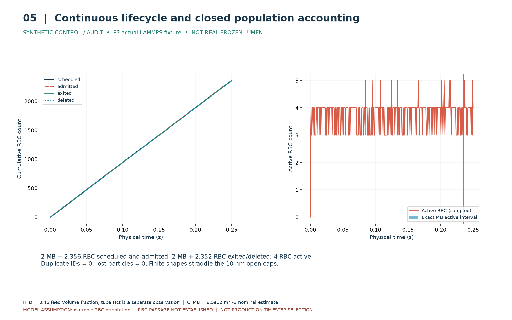
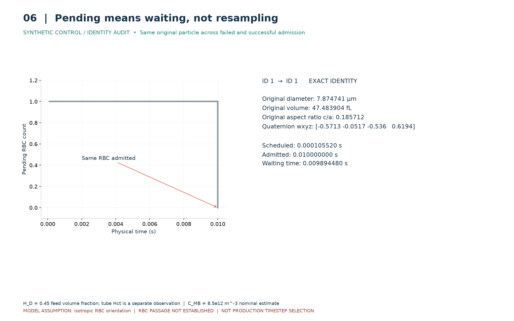
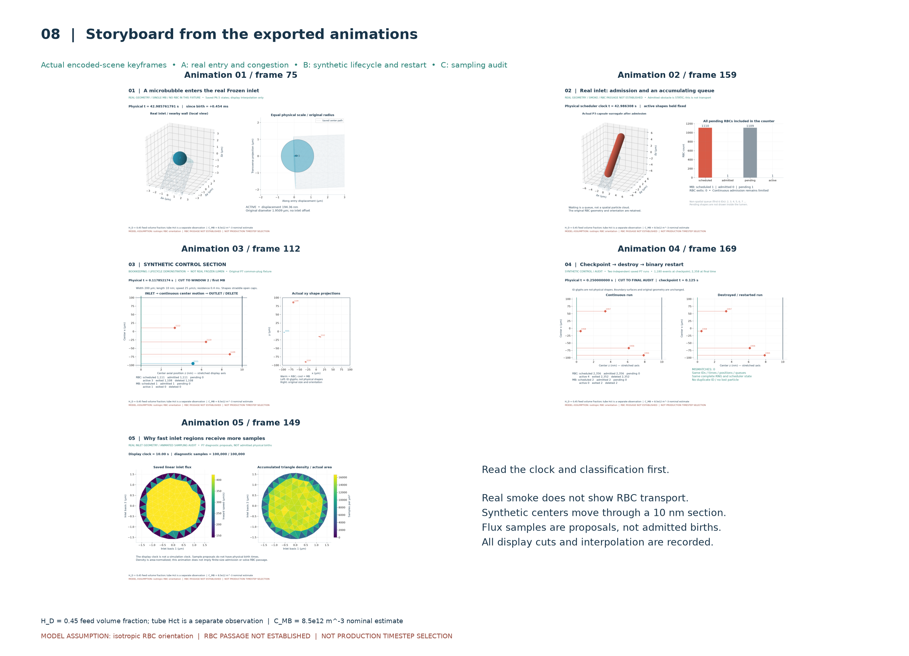
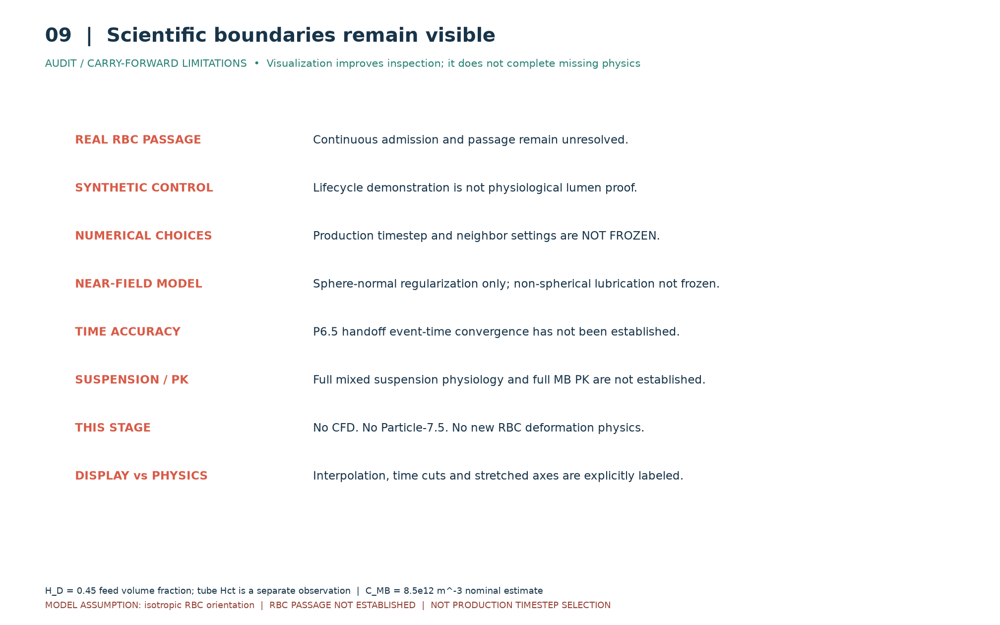

# Particle-8 连续混合入口可视化与回放审核报告

## 1. 阶段定义

Particle-8 是可视化与回放层：把原始事件、稳定 ID、形状、姿态、物理时刻、pending、接纳、活动、出口、删除和重启记录变成可审查的图和动画。本轮新增 replay/scene/frame 导出、编码、自动验证及报告，未修改 P0–P7 科学代码，没有启动 Particle-7.5 或新的 RBC 变形模型。

## 2. 继承依赖

用户指定的 `/mnt/data/PARTICLE6_5_*` 和 `/mnt/data/PARTICLE7_*` 在本 WSL 中没有副本，采用仓库中相应的已提交文件。上游文件路径和 SHA256 均在 `data/upstream_provenance.json`。P7 的 285 个源码文件和 53 个数据/来源文件逐项核对；不改写上游历史报告中的审核快照。当前 Particle-8 指令明确把 P6.5、P7 作为已接受基础。

沿用 H_D=0.45（feed volume fraction）、C_MB=8.5e12 m⁻³（名义浓度估算）、确定性累计通量调度、暂定各向同性 SO(3) 姿态。沿用原 P2 RBC 与 SonoVue 样本、原 P6.5 sphere-normal near-field、P7 FIFO 和 LAMMPS 二进制重启。

## 3. 关键结果

真实入口 Q=2.73691323909e-15 m³/s；有符号入口减出口差为 -3.9443e-31 m³/s，相对差 -1.44115e-16。保留原 Frozen 数值，未重新运行 CFD。

RBC 目标体积为 0.45×累计全血体积，逐只使用原采样体积；MB 按累计期望数量跨整数生成预约。调度物理时间与视频帧率无关。pending 前后几何、身份、姿态和来源不变，排队不产生虚假的管腔内位置。

实际 LAMMPS 合成回放记录有 2358 个预约/接纳事件：2356 RBC、2 MB。退出并删除 2352 RBC 和 2 MB，最终 4 RBC 活动；没有重复 ID 或粒子丢失。checkpoint 在 0.125 s、1180 个事件时保存；销毁恢复后的未来事件、完整 RNG、下一只 RBC、scheduler 与活动状态均与连续运行完全一致。

独立真实单 MB 保留 5 个接受状态，1 ms 位移 0.440609 µm。真实混合 smoke 接纳 1 个 RBC 胶囊替代形状，1109 RBC 和 1 MB 排队，未发生出口事件；这不能证明真实 RBC 连续 admission 或 passage。

已输出 10 张 PNG、5 个 H.264 MP4 和 5 个 GIF 预览。MP4 为 1440×900、15 fps，逐帧完整解码验证；GIF 是 3 fps 缩小预览。视频时间不是生产 timestep。每部动画有带物理/显示时钟角色、场景状态、ID、计数和状态 SHA256 的逐帧 manifest。

## 4. 两条证据线应该怎样理解

证据线 A 使用真实 Frozen 边界和已保存的数值轨迹，负责回答真实几何上目前观察到了什么。它诚实显示拥堵，而不是把 RBC 画成通过了血管。

证据线 B 使用 P7 合成开口控制区，负责展示持续预约、接纳、移动、出界、删除和重启这些机制。10 nm 控制区比粒子短，有限形状跨越开口；中心穿过控制区不是整个形状穿过生理血管。图中主流向拉伸只影响显示，真实位置始终按 SI 保存；原尺度的横截面投影并列保留。

真实混合 smoke 中，既有形状作为静态障碍保留；原始尺寸的后续粒子无法通过有限尺寸接纳检查就必须等待。保留 pending 是系统正确处理限制的表现，不能用缩小 RBC、降低 H_D 或重抽小粒子掩盖。它说明入口基础设施能诚实报告限制，不说明真实混合输运已完成。

Tube Hct 是独立诊断。原真实全腔中心归属快照约 3.273%，并没有强制为 45%；跨开口粒子按中心归属计完整体积，也不等于几何交集体积分数。

## 5. 动画审核

### 动画 01

[MP4](animations/particle8_anim_01_real_single_mb_entry.mp4) · [GIF 预览](animations/particle8_anim_01_real_single_mb_entry.gif)

真实 Frozen 入口；单 MB 在原入口面出生，无人工偏移，按原 P6.5 保存状态在 1 ms 内移动 0.440609 µm。左右分别为局部 3D 和等物理尺度投影。开始前 0.1 ms 留空。中间帧只是显示插值，没有新增动力学证据。

### 动画 02

[MP4](animations/particle8_anim_02_real_mixed_inlet_smoke.mp4) · [GIF 预览](animations/particle8_anim_02_real_mixed_inlet_smoke.gif)

真实 Frozen 混合入口接纳 smoke；时钟推进、预约队列增长，唯一已接纳的 P3 胶囊替代 RBC 保持静止。最终 RBC 1110/1/1109、MB 1/0/1（预约/接纳/排队）。队列在图表中显示，不伪造其空间位置。

### 动画 03

[MP4](animations/particle8_anim_03_synthetic_open_section_lifecycle.mp4) · [GIF 预览](animations/particle8_anim_03_synthetic_open_section_lifecycle.gif)

合成控制区，宽 200 µm、长 10 nm，公共速度 25 µm/s，中心驻留时间 0.4 ms。三段真实物理时间窗口展示启动、第一只及第二只 MB；窗口之间明示剪切，末帧切到 0.25 s 记账。左图拉伸主流向并用 ID 图标表示中心，右图保留原尺寸、原姿态的 xy 投影。有限形状跨越开口端面，不能称为完整粒子通过血管。

### 动画 04

[MP4](animations/particle8_anim_04_restart_continuity.mp4) · [GIF 预览](animations/particle8_anim_04_restart_continuity.gif)

独立的连续与重启保存数据分屏回放，跨越 0.125 s checkpoint。原 P7 确实销毁 LAMMPS 并读取二进制；本阶段读已有证据，不重新演出或生成随机历史。逐帧位置、ID、队列与计数一致，完整 scheduler/RNG 等字段也逐项比较。

### 动画 05

[MP4](animations/particle8_anim_05_flux_weighted_births.mp4) · [GIF 预览](animations/particle8_anim_05_flux_weighted_births.gif)

真实入口几何上的采样诊断。100000 个原 P7 候选点逐步累积，按三角片面积归一化为密度。10 s 是播放时钟，不是物理出生时钟；这些候选点不是已接纳粒子。

## 6. 静态图审核

### 图 00

审核观察：两条证据线和共用回放层分开；真实几何结果没有被合成动画代替。

### 图 01

审核观察：真实入口速度、三角片通量与面积归一化采样密度并列；质量差保留原值。

### 图 02

审核观察：累计目标与每只原 RBC 的体积之和一致，残差小于下一只原样本体积。

### 图 03

审核观察：MB 在累计数量跨整数时预约，误差严格大于 −1；不是 Poisson。

### 图 04

审核观察：真实入口排队达到 1109 个 RBC 和 1 个 MB；静态已接纳形状与排队计数分开。

### 图 05

审核观察：合成生命周期闭合，最终 4 个 RBC 活动；退出与删除同步，ID 不复用。

### 图 06

审核观察：等待前后 ID、几何、体积、四元数、来源完全一致，没有重抽。

### 图 07

审核观察：六类重启字段全部相等；0.125 s 后未来事件保持一致。

### 图 08

审核观察：从实际动画场景抽取关键帧；不是另外绘制的示意结果。

### 图 09

审核观察：真实 RBC passage、生产参数、完整悬浮液、PK 等边界醒目标明。

## 7. 风险与限制

- 真实 RBC 连续接纳与穿管仍未建立；一个 P3 胶囊替代形状接纳不能外推成功穿管。
- Synthetic control 不是真实生理管腔证明；真实 smoke 没有混合输运。
- 非球形润滑、生产 timestep、neighbor cutoff/skin 均未冻结。
- P6.5 handoff 事件时刻与事件拓扑收敛未建立；事件计数仍是求解器诊断。
- 当前只有球形法向近场修正，没有完整多体远场流体动力学、切向/旋转润滑耦合或 RBC 润滑。
- 没有糖萼、黏附、表面粗糙度、真实分子接触或壳层力学模型；未建立 full suspension。
- LAMMPS 沿用单 MPI rank 的存储、邻居和重启用途，不承担粒子力积分。
- MB 浓度和 RBC 各向同性取向是模型假设，非该小鼠直接测量；没有完整 PK、清除或破坏模型。
- 没有 CFD、没有 Particle-7.5，也没有以可视化为由修改物理。
- 单 MB 中间视频帧为原接受状态之间的线性显示插值，不是新增求解状态或独立的连续壁间隙证明。
- 合成动画有明确时间剪切，流向坐标拉伸，左图粒子符号不按物理尺寸；不能据此衡量真实血管速度或粒径。

## 8. 自动测试与复现

| 测试组 | 数量 | 结果 |
|---|---:|---|
| frozen | 18 | PASS |
| particle0 | 46 | PASS |
| particle1 | 67 | PASS |
| particle2 | 74 | PASS |
| particle3 | 90 | PASS |
| particle4 | 69 | PASS |
| particle5 | 63 | PASS |
| particle6 | 62 | PASS |
| particle6_5 | 60 | PASS |
| particle7 | 56 | PASS |
| particle8 | 36 | PASS |

合计 641 项。完整命令和 JUnit 在 `logs/test_commands.json` 和各 `final_*.xml` 中。P8 永久测试验证缓存重导出一致、原几何/姿态逐项保留、精确出口删除、禁止外推和虚假 pending 位置、原轨迹回放、重启全状态一致、每帧再生、PNG 来源映射、MP4 完整解码、连续运动和 GIF 输出。开发中修复了相同状态插值引入浮点微扰的问题，并保留原失败日志及永久回归。

复现入口见 [PARTICLE8_README.md](../../PARTICLE8_README.md)。只重新作图无需重跑 P7 模拟；全部输出路径在 [OUTPUT_FILES.json](OUTPUT_FILES.json)，浏览入口为 [index.html](index.html)。

## 9. 审核结论

AUTOMATED_CHECKS = PASS

MANUAL_VISUAL_REVIEW = PASS

STAGE_RESULT = PASS_WITH_CARRY_FORWARD_LIMITATIONS

视觉检查角色：代理逐张查看 PNG，并查看从每个实际编码 MP4 解码抽取的联系表，另以全部帧解码和状态比较检查连续性。此处 PASS 仅指代理视觉检查完成，不代表用户已作人工验收；USER_ACCEPTANCE = PENDING_USER_REVIEW。

通过依据是回放层完成、全部动画可解码、调度/队列/生命周期/重启证据保持完整、分类及限制明确；不是 full scientific pass。

分支 `dev/particle-8-visualization-replay-20260921`；代码证据绑定 `4293ffd2d4bf07e00b4fff43f7c6cf575c60079d`，逐文件源码 SHA256 为准。用户未要求 push 或合并，本阶段只作本地交付。
