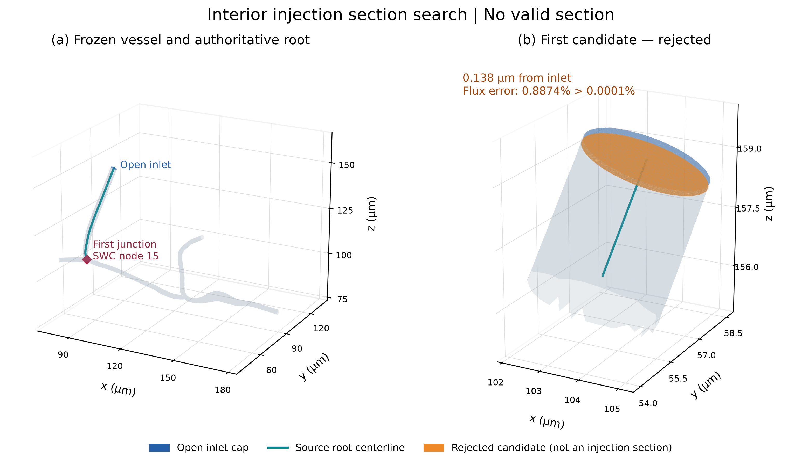
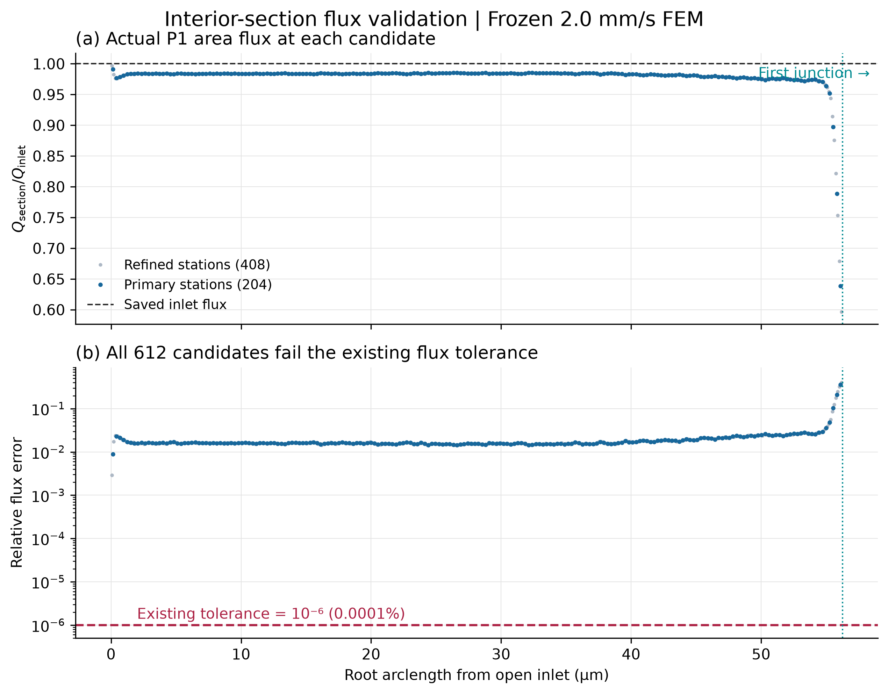

# 一句话结论

**NO_VALID_INTERIOR_INJECTION_SECTION。2D 思想向 3D 升级的前置截面检查未通过，因此本轮尚未产生新的 entering population。** 已开发真实四面体切面与流量验证代码，在服务器搜索了 204 个主候选和 408 个加密候选，没有合格截面。严格按本轮“无有效截面即 STOP”的要求，未继续实现下游 joint sampler，未生成 2000 个事件、30 条轨迹或新的正式 500。人工审核为 **PENDING**。

# 为什么不再在 open inlet cap 生成完整球

人工入口 cap 相当于把水管截断后留下的计算边界；它不应被误认为真实的挡板。内部截面则是在根血管里设置一个观察面，统计已经从上游过来的有限尺寸微泡。这个想法必须先有一个位置合法、血流量也与入口相符的截面。本轮尚未过这一关，不能把后续的粒径加权公式当成已验证实现。

已读取旧 Method C 审核报告与指定 2D Git 源文件。实际 blob 与要求一致。2D 到 3D 的对应及不能直接移植的部分见 [TWO_D_TO_THREE_D_MAPPING_ZH.md](TWO_D_TO_THREE_D_MAPPING_ZH.md)。特别是旧 2D 的“connected clearance”函数只查询局部壁距，不能直接充当 3D 上游可达证明。

# 新的内部截面在哪里

**没有选中的正式截面。** `data/interior_injection_section.json` 的 `selected_section=null`，不会把失败候选冒充正式入口，也没有输出一个误导性的正式 `interior_injection_section.vtp`。

几何来源经原 FEM `source_contract.json` 追溯至同一 ROI 的 `roi_core.swc`。实际入口 cap 面积质心连接到保存的 ROI root；这一段属于原血管几何已有的人工延长管段，其来源有 `port_classification.csv` 支持。其后沿原 SWC 节点 1–15，首个分叉为节点 **15**，子节点为 16、17。没有采用找不到中心线时的 inward-normal fallback。

- 实际入口中心：(103.672907, 57.555051, 158.805678) µm。
- 首个分叉位置：(92, 49, 111) µm。
- 沿 root 到首个分叉的弧长：**56.264349 µm**。
- 主候选间距使用冻结求解策略中的 mesh `h10=0.275672 µm`，每个区间中点为候选，法向取局部中心线切向；另用一半间距做一次分辨率检查。序列在读取结果之前就已确定，不随流量或球径调节。
- 第一个主候选距 inlet **0.137836 µm**，距首个分叉 **56.126513 µm**，但流量失败。图中的橙色面明确标为 rejected。

无限延伸的平面有时还会切到远处另一条血管。本实现只取包含 authoritative root 中心点的连通分量作为实际有限截面，并同时记录整张无限平面的分量数；没有把远处血管流量加进 root。检查截面边缘确实位于 WALL、是否触及 cap、是否在首个分叉之前，以及 daughter 轴线是否穿过同一截面。**这些是本轮前置几何检查，不等同于有限球上游连通性证书；后者未执行。** 主候选中 200 个通过这些几何检查，4 个同时触碰开放边界。所有 204 个均因流量误差被拒绝。

候选搜索是在声明的中心线候选族内进行的，不声称数学上排除了所有可能平面。没有为了逼近 cap 获得偶然数值吻合而无限缩小偏移，也没有越过首个分叉或为了容纳更大微泡移动截面。

图 01：左图为真实冻结血管、对应源 root 中心线和首个分叉；右图放大首个主候选。橙色截面未通过流量检查，不是选中的正式 injection section。原要求中“亮色选中截面”的图意在本轮改为明确展示失败证据。

# 这个截面的流量对不对

采用与现有微泡 `FrozenFEMField` 相同的 canonical tetra 点位、拓扑和 float64 节点速度。原文件坐标存储为 float32，读入后提升为 float64 计算，不改变几何数值。VTK 切割保留 double 坐标，P1 法向速度在切割三角形上精确积分；有负速度时先精确切分正半区。

独立重算 inlet cap 得到 **1.551359160440232e-14 m³/s**，与保存 inlet Q 一致。采用原 `policy.json` 的 `mass_limit=1e-6`，即 **0.0001%** 相对容差；这是依本轮要求沿用的原全局流量验证阈值，不是新发明的宽松内部容差。

| 对象 | 距 inlet 的 root 弧长 (µm) | 正向 Q (m³/s) | 相对 inlet 误差 | 结果 |
| --- | ---: | ---: | ---: | --- |
| 保存并独立复算的 inlet | 0 | 1.551359160440e-14 | 0 | reference |
| 最佳主候选（也是第一个主候选） | 0.137836 | 1.537591791096e-14 | 0.887439% | FAIL |
| 加密搜索中最佳候选 | 0.068918 | 1.546850866233e-14 | 0.290603% | FAIL |

加密后最小误差仍为容差的 **2906.0 倍**。另对首个、最佳、中部、末端及加密首个候选执行独立 NumPy 四面体边相交/多边形积分（首个与最佳重复，是 5 个审计记录、4 个不同位置），绕过 VTK 切割；与 VTK P1 积分的最大差为 inlet Q 的 **1.170e-15**，远小于此处的流量不匹配。原始记录见 `data/independent_section_flux_validation.json`。

**全局 inlet/outlet 总流量平衡，不保证保存的 P1 插值速度在任意内部截面上都给出相同流量。** 这里检查的是微泡实际使用的冻结 P1 场。本轮证据说明它无法通过本任务要求的内部截面流量门槛，不能仅凭这些数据确定责任在求解、导出还是冻结表示的哪个环节。没有缩放内部速度、平滑梯度、修改 FEM 或提高容差来让检查通过。

图 07：上图显示候选真实 P1 流量与 inlet 的比值；下图用对数轴显示相对误差和原容差。靠近分叉的候选还会受到几何截面与开放边界接触影响；每一项拒绝原因均保存在 CSV，不能只看上图曲线选择新入口。

# 不同尺寸真正能使用多少血流

**未计算。** D=1.0/1.5/2.0/2.5/3.0 µm 的 accessible flux fraction 均为 N/A；N/A 不是 0。截面最大可达刚性球直径也未计算，不能与旧 open-cap **3.1281 µm** 宣称改善或退步。不得在失败截面上继续算一个可用的粒径分布。

# source 与真正 entering size distribution 有什么区别

冻结 source 合同保持 `SONOVUE_DIAMETER_MAX4UM_V1`，支撑区间 0.75–4 µm，保留原直方图的分箱内均匀密度，并对 D≤4 条件化；未 clipping、未改原始 SonoVue。由现有合同直接计算的 source 平均直径为 **2.045375 µm**，P10/P50/P90 为 **1.304791/1.928730/2.992195 µm**。

计划的新 entering 分布应当是 source PDF 乘 `Q_feasible(D)` 后归一化，不能继续用 Method C 对每个尺寸反复找位置强制成功。但**本轮 entering PDF 尚未建立**，源分布统计不能当作 entering 统计。

# 实际进入率是多少

源浓度保持 **8.5×10¹² m⁻³**（modeled D≤4 µm source）。旧 raw 参考 `C×Q_inlet` 为 **0.131865528637 s⁻¹**。新的 `C×∫f(D)Q_feasible(D)dD`、降低比例、平均间隔及正式 500 的物理时间窗均 **N/A**。没有调浓度保持旧 event times。

# O1/O2/O3 的 joint accessible flux

**全部未计算，JSON 为 null。** 没有生产 joint sampler，也没有 outlet-basin 审核运行，不能把 null 当作 O1/O3 通量为零。没有使用 outlet quota。

# 2000 个入口样本结果

计划 2000，实际生成 **0**，point tracer 实际运行 **0**。未进行采样分布、worker 无关性或 joint basin 一致性验证，这些状态是 NOT_EXECUTED，不能写 PASS。

# 30 条真实轨迹

计划 30，实际运行 **0**。stationary、penetration、handoff violation、solver failure 和 outlet 统计均 N/A。零条运行不等于“30 条通过”或“零穿透验证通过”。正式 500 实际运行 **0**。

# 与 Method B/C 相比

| 历史入口 population | point O1 | point O2 | point O3 | no exit |
| --- | ---: | ---: | ---: | ---: |
| Method B accepted 500 | 9 | 469 | 20 | 2 |
| Method C audit 2000 | 1 | 1999 | 0 | 0 |
| Method C formal 500 的入口 point audit | 0 | 498 | 1 | 1 |
| P9-A.3 | N/A | N/A | N/A | N/A |

历史数字来自上轮 `PARTICLE9A2_INLET_REVIEW_ZH.md`，只作为背景，未重算或覆盖。本轮没有有效新入口 population，因此不能完成三代入口分布效果对照，也没有混入后续动力学出口统计。

# 目前说明血管几何什么问题

本轮**不能判断 P9-A.3 是否仍出现 O2 collapse，更不能把其原因归为 open-cap 或 rigid-size/root-geometry**，因为尚未执行联合通量和 point audit。已确定的阻断原因是“当前冻结 P1 场的内部截面流量不满足现有阈值”。若继续推进，需要先单独审查这一流量一致性问题；本轮禁止改变冻结物理，故在这里停止。

# 实际完成的代码、测试、数据和运行

新分支：`dev/particle9a3-interior-joint-flux-inlet`。新增 `interior_section.py`、`run_particle9a3_section_gate.py`、`render_particle9a3_section_gate.py`、本报告生成器，以及 3 个测试文件/1 个 fixture。没有修改现有科学模块。

前置阶段的 **7 项永久测试**在 WSL 和服务器均通过：首分叉前候选范围、分叉后拒绝、WALL 截面边界、触 cap 拒绝、常速解析面积通量、含正负速度的线性 P1 正通量精确积分，以及 1% 流量损失必须拒绝。它们只验证已实现的截面门槛；**不是全部 12 类 joint-model 测试已经完成，也不是 circular Poiseuille finite-size benchmark 已通过**。后续算法及测试按 STOP 条件暂未实现。

服务器目录：`/workspace/particle9a3_interior_inlet_20260924T100618Z`。使用 **6 workers**，OMP/OpenBLAS/MKL/NumExpr 均为 1。服务器截面搜索及独立积分的实测墙钟时间 **3.971 s**，不包含准备、传输、写代码或画图时间；未使用 GPU。服务器结果与本地交付一致性校验另见 `data/server_delivery_verification.json`。

预先保护的 **7668 个文件 SHA 全部不变**；原 Git index tree、HEAD 不变，原工作区已有修改完整保留。没有 commit/push。`logs/git_diff_stat.txt` 保存真实 `git diff --stat`（它包含此前已有未提交修改，不包含本轮未跟踪文件）；本轮新文件统计另存 `logs/new_files_stat.txt`。

数据入口：`data/interior_section_search.csv`（612 行）、`data/interior_injection_section.json`、`data/root_topology.json`、`data/independent_section_flux_validation.json`、被拒绝截面的 VTP。所要求的下游 CSV 仅保留表头，相关 JSON 用 null 和 NOT_EXECUTED 明确表示未计算；参见 `data/downstream_artifacts_status.json`。没有创建虚假轨迹或虚假数值。

图 01、07 提供英文白底 300 dpi PNG/PDF；02–06 所需数据未产生，故不绘制假图。图 01 可由冻结 WALL/INLET、`root_topology.json` 和保存的 rejected VTP 重绘；图 07 直接从 search CSV/section JSON 重绘。图像已检查，状态文字与实际失败结果一致。复现命令见 [REPRODUCE.md](REPRODUCE.md)。

# 是否建议启动新的 500 条

**NOT_READY**。阶段状态为 **NO_VALID_INTERIOR_INJECTION_SECTION**，不是 production complete。没有合格截面就不继续运行 2000/30，更不启动新的正式 500。

# 人工审核

- [ ] interior section 位置合理
- [ ] section flux 合理
- [ ] finite-size accessible flux 合理
- [ ] 3D synthetic tube benchmark 合理
- [ ] entering size distribution 合理
- [ ] O1/O2/O3 joint flux 可接受
- [ ] 30 smoke 合理
- [ ] 同意下一轮生成正式 500
