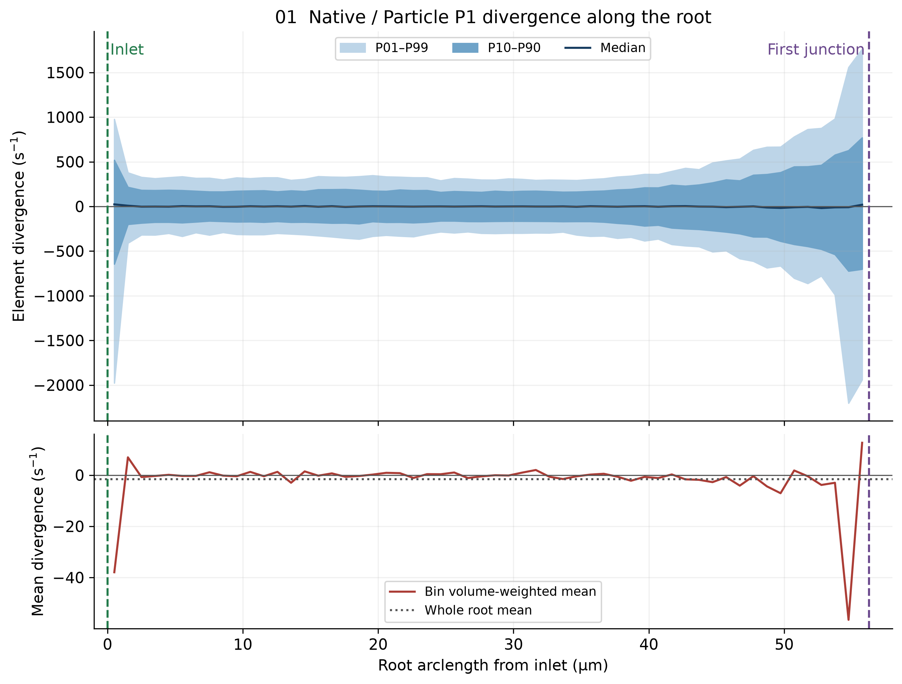
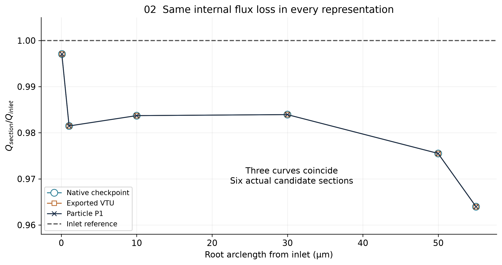
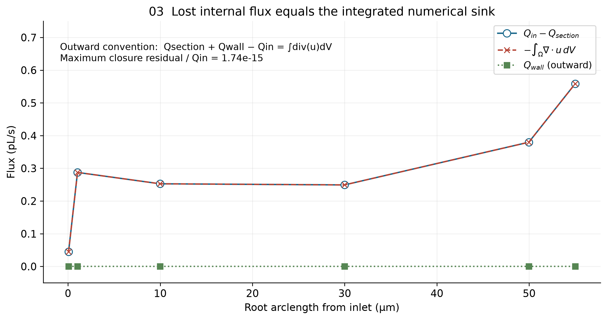
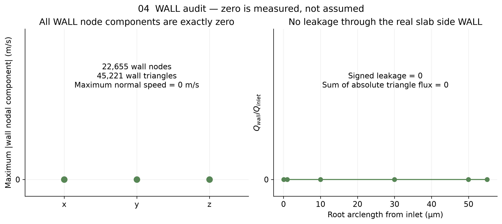
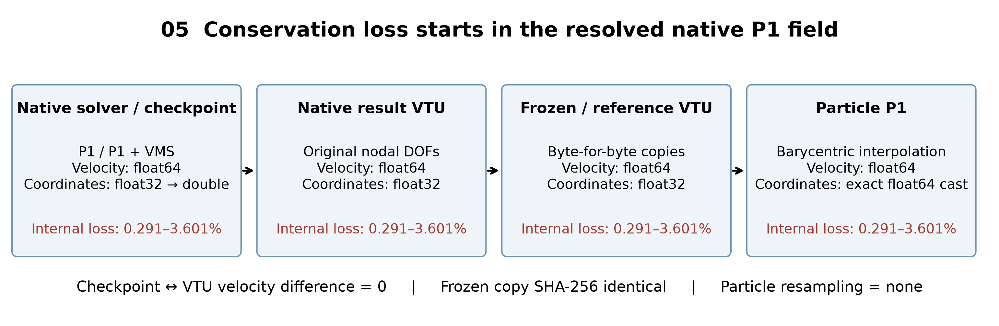

# 一句话结论

**NATIVE_FIELD_LOCAL_CONSERVATION_LIMITATION_FOUND。流量的局部不守恒首次出现于原生 svMultiPhysics 的已解析 P1 速度场；checkpoint、原生 VTU、frozen VTU 和 Particle 使用的是同一个速度场，导出或 Particle 读取没有新增损失。**

6 个真实内部截面的流量损失为 **0.290603%–3.601346%**，由封闭上游体积的负散度积分解释，最大 Gauss 残差 / Q_in 为 **1.742e-15**。没有提高 tolerance，没有修正/缩放速度，没有运行微泡。

# 为什么入口守恒但内部截面不守恒

把整个网格想成许多小水管单元。入口与所有出口合起来，流量差几乎为零；但某些小四面体像有数值上的微小水源，另一些像有水汇。全管的水源和水汇可以抵消，截到半路时却未必抵消。因此“总入口等于总出口”不等于“中间每一刀都等于入口”。这里不是物理血液被吸收，而是离散速度场没有逐单元零散度。

本次独立重算全局 inlet/outlet 相对差 **4.068e-16**；全域 ∫div(u)dV = **-1.529225e-30 m³/s**，确实接近零。这与内部百分量级误差并不矛盾。

# 原生 CFD 自己有没有这个问题

**有，准确说是原生离散求解所保存的 resolved nodal velocity 已有这个问题。** 原生为 TET4、连续线性速度 P1 / 线性压力 P1，VMS 稳定化；不是隐藏的高阶速度被导出降阶。

依据实际 solver.xml、与运行二进制构建源目录对应且逐文件 SHA 相同的源码，以及 checkpoint 数值。原生 checkpoint 中 70,363 节点 × 3 速度 DOF 与原生 VTU 的最大差、RMS 差、相对 L2 差均为 **0**；压力也逐值相同。运行二进制 SHA 与原算例 execution.json 一致。完整源码定位见 [NATIVE_VELOCITY_SPACE_AUDIT_ZH.md](NATIVE_VELOCITY_SPACE_AUDIT_ZH.md)。

VMS 连续性残差包含测试函数加权的 div(u) 和稳定化细尺度项。它没有把每个单元的 div(u)=0 当作单独约束。源码中的残差细尺度 `up` 不是一个已保存的高阶输运速度，不能虚构一条“更守恒的 native 高阶曲线”。本轮证明了损失所在层和数学机制；没有凭一张网格把误差幅度进一步归因到某个网格参数、稳定化常数或入口过渡。

# 导出 VTU 有没有增加问题

**没有可测新增误差。** 原生输出直接复制当前解的节点速度到 `vtkDoubleArray`；`scripts/flow_2mmps/validate.py:97` 再用 `shutil.copyfile` 保存 frozen VTU。三个 VTU 文件（native、frozen、Particle reference）的 SHA-256 均为 `129ebb77396550b300b20ce29cde7b03919e6037b7a81de60fe75d6c6efb616d`。

没有 interpolation、projection、averaging、速度 float32 转换或网格重采样。坐标在 VTK 中为 float32；求解器输入网格本身也为 float32，读入 double 后再写出，实际数值变化为 0。原网格 NPZ 的 float64 坐标同样只是这些数值的精确提升，不能冒充未量化原坐标。**cannot test authoritative precision loss**：没有另一套未量化且真正用于本次求解的坐标；不能据此评估重新用更高精度网格求解会怎样。当前求解输入→导出→Particle 的坐标变化为 0；六截面 native/Particle 重算的最大通量差为 3.1554e-30 m³/s（Q_in 的 2.034e-16，局部顶点排序引起运算次序差），不是坐标量化新增损失。

见 `data/native_to_export_audit.json`、`data/precision_audit.json`。

# Particle 读取有没有增加问题

**没有。** reference 仍是原 VTU 的逐字节副本；速度保持 float64 bitwise equal；坐标 float32→float64 后 numeric equal，最大差为 0（dtype 改变，所以字节比较不是 equal）。canonical tetra 相对 flow 文件只交换局部前两个顶点 `[1,0,2,3]`，每行四个节点集合与物理单元相同，没有换单元或错配节点。

`FrozenFEMField` 在同一个四面体上用重心权重做 P1 插值。永久测试直接抽查真实 tetra 内点与原 VTU 节点速度加权值相同；独立边方程求导与 Particle 梯度的最大散度差为 1.0914e-11 s⁻¹，属浮点运算顺序差。未发现明确读取、映射或重建软件 bug。见 `data/export_to_particle_audit.json`。

# P1 divergence 是什么情况

每个四面体内部速度为线性函数，所以 div(u) 是常数。本轮解析求解节点差分的线性方程，再取速度梯度的迹；没有 finite difference，没有平滑。

| 区域 | tetra 数 | min (s⁻¹) | max (s⁻¹) | RMS (s⁻¹) | 体积加权均值 (s⁻¹) |
| --- | ---: | ---: | ---: | ---: | ---: |
| 全域 | 371402 | -6417.055563 | 6779.191084 | 150.315387 | -1.05406005e-15 |
| root（中心线归属） | 104530 | -5998.271148 | 4976.303730 | 208.874333 | -1.59185276 |
| WALL 面相邻 | 45221 | -5998.271148 | 6779.191084 | 161.217756 | -0.569937826 |
| 非 WALL 面相邻 | 326181 | -6417.055563 | 6615.516408 | 148.740847 | 0.0823901076 |
| 入口→54.996557 µm 精确 slab | 103770 | -5998.271148 | 4160.947280 | 202.322541 | -1.3797238 |

root 的描述性统计按 tetra 质心到 authoritative root / daughter 中心线的最近归属划分，并要求 root arclength 在首分叉前；这不是分叉交界面的精确裁切定义。另列入口至最后合法截面的**真实裁切 slab**统计，体积权重使用真实截取体积。WALL-adjacent 指至少具有一个真实 WALL 三角面，其余组可能接触 cap 或仅接触 WALL 顶点，不能读作“离所有边界很远”。两种 root 统计的定义均明确保存在 JSON，Gauss 检查使用精确 slab，完全不依赖中心线归属近似。

全域及分组的 mean、median、P01/P05/P95/P99、普通/体积加权 RMS 均在 `data/divergence_statistics.json`；371,402 个 tetra 的质心、体积、散度、root arclength、wall/root 标签在 `data/tetra_divergence.csv`。

图 01 以约 1 µm 分箱显示分位带，并单独显示体积加权均值，避免散点堆叠。既有正也有负的局部散度；root 整体具有净负贡献，不能说每个位置都负。

# 流量少掉的水去了哪里

**由离散速度场中的净数值水汇解释，不是 WALL 漏水。** 使用外法向、Q_in 定义为正的入流：

`Q_section + Q_wall − Q_in = D = ∫Ω div(u)dV`

所以 `Q_in − Q_section − Q_wall = −D`。不能把正的损失与同号的负散度积分直接写成等号。本轮 Q_wall=0，于是流量损失正好是 `−D`。

真实 slab 是四面体网格与截面上游半空间的交，按共享面连通性保留 inlet 连通分量。完整 tetra 用原体积，截穿 tetra 用凸多面体几何的行列式体积；D 为这些体积乘单元常散度之和。边界分别来自真实 INLET、真实 WALL 和切面。6 个 slab 均完整包含入口、不含其他出口；另外切到的远处血管不会混入。没有圆柱或中心线管体替代。

| s (µm) | Q_section (m³/s) | 损失 / Q_in | Q_in−Q_section (m³/s) | D (m³/s) | 闭合残差 / Q_in |
| --- | ---: | ---: | ---: | ---: | ---: |
| 0.068918 | 1.546850866233e-14 | 0.290603% | 4.508294207e-17 | -4.508294207e-17 | 4.767e-17 |
| 1.033770 | 1.522618266586e-14 | 1.852627% | 2.874089385e-16 | -2.874089385e-16 | -1.271e-16 |
| 9.993109 | 1.526094170741e-14 | 1.628571% | 2.526498970e-16 | -2.526498970e-16 | 5.085e-16 |
| 29.979326 | 1.526436686411e-14 | 1.606493% | 2.492247403e-16 | -2.492247403e-16 | -3.178e-17 |
| 49.965544 | 1.513386086473e-14 | 2.447729% | 3.797307397e-16 | -3.797307397e-16 | 1.087e-15 |
| 54.996557 | 1.495489356892e-14 | 3.601346% | 5.586980355e-16 | -5.586980355e-16 | 1.742e-15 |

最大 VTK / 独立 NumPy 截面通量差 / Q_in = **6.102e-16**。Gauss 比较采用 signed flux，另保存 positive flux；这 6 个截面两者在舍入精度内一致（最大差 3.1554e-30 m³/s）。没有把正向积分误当净通量用于 Gauss。

图 02 三条曲线重合。数据 CSV 另保存原生 VTU 一列，它也重合；native 曲线来自真实 checkpoint 数值，不是假定。

图 03 使用 `−∫div(u)dV` 与正损失比较，单位 pL/s；WALL 修正单独为零。

# WALL 有没有漏水

**没有。** 22,655 个 WALL 节点的三个速度分量全部精确等于 0。45,221 个 WALL 三角面的最大法向速度、最大绝对三角形流量、所有绝对三角形流量之和、总 signed leakage 均为 **0**。真实 slab 中裁切后的 WALL 部分同样为 0；并非只靠正负抵消。

入口本身也复算一致：面积 7.756795804428e-12 m²，平均法向速度 1.999999999426 mm/s，最大节点速度 2.401930626 mm/s，Q_in=1.551359160440232e-14 m³/s。入向单位法向为 [-0.02517291675036908, -0.6720850419746561, -0.740045958448665]。INLET.vtp 只保存 GlobalNodeID，没有另一套独立速度；各层都通过这些 ID 取同一节点速度。

# 0.0001% tolerance 原来是干什么的

`mass_limit=1e-6` 是相对量，即 0.0001%。它用于 **global inlet-vs-target** 以及 **sum(outlets)-inlet** 两个 boundary flux gate，都以 Q_target 归一化。Stage SV1.3 `prepare.py:35` 明确设置，2.0 mm/s 算例从 Stage Q production_policy 继承。`postprocess.py:55-57` 给出两个误差定义，`sv13.py:49-52` 将其用于稳态停止门槛。不是任意内部平面的误差保证。

P9-A.3 按上一轮要求把原策略沿用到 internal-section gate，因此检测到了当前阻断；这属于验收用途扩展，不能据此宣称原生求解未满足其已有全局验收。完整引用和 SHA 见 `data/mass_tolerance_provenance.json`。

# 目前是否合理要求内部截面也达到这个值

可以把它保留为**尚未达成的严格输运目标**，但没有证据说当前原生 P1 场必然能满足它。**保留原全局 1e-6，不改现有内部 gate，本轮不推荐放宽值：NO_TOLERANCE_RECOMMENDATION_YET。**

当前 mesh h10=0.275672 µm；最小检查偏移仅 0.068918 µm，仍损失 0.290603%。节点/导出误差为 0、积分闭合为约 1e-15，说明百分量级差并非积分噪声。仅有一个网格和一种离散方案，没有网格收敛序列，也没有允许多少输运浓度/粒径通量偏差的预算，因此不能从观察到 0.3% 就倒推出 1% 合理。加密候选位置不是网格收敛验证。

# 真正应该修哪一层

需要面对**速度场的局部守恒性质**。简单重复导出、直接读原生 checkpoint 或替换 Particle 的同阶 P1 插值都不会改变结果。若保持已有 CFD，最小研究方向是隔离的、受约束的保守输运场重建原型；它会改变 Particle 用的速度，因此必须作为新表示独立审核，不能混称“无损重新导出”。

数学上连续 P1 已属于 H(div)；只标记 H(div) 或换容器不会自动零散度。下一方案必须同时施加局部零散度/面通量闭合，并检验 WALL 全矢量 no-slip、梯度与原端口 flux。详见 [NEXT_FIX_OPTIONS_ZH.md](NEXT_FIX_OPTIONS_ZH.md)。本轮没有实施任何方案，也不认定必须立刻重跑 CFD；是否需要新 CFD 算例取决于保守重建能否满足这些约束及误差预算。

# 2D→3D interior injection 是否还能继续

**BLOCKED_BY_NATIVE_FIELD_CONSERVATION。** 在保持当前 gate 和当前 field 的前提下，不能继续 joint sampler、2000 events、30 smoke 或正式 500。后续若独立保守场通过审核，才可进入 YES_AFTER_FLOWFIELD_FIX；本轮没有修复，不能提前写成该状态。

# 验证、复现和证据范围

永久测试目录为 `particle_3d/tests/particle9a3b_flowfield_conservation/`，8 项测试验证常速截面、线性零/非零散度 Gauss、Particle 解析梯度、零 WALL 节点、入口复算、原生/导出/Particle 节点与采样一致性、两种截面积分器。**本地 8/8 通过（3.246 s），服务器 8/8 通过（1.547 s），无 skip。**

此外在同一个真实 371,402 tetra 网格、约 30 µm 的实际裁切体积上替换三种解析控制场，复用已求得的真实几何体积。常速、线性 div-free 和 div=30 s⁻¹ 三组的 Gauss 相对残差分别约 6.16e-15、4.10e-15、4.02e-16。控制场可能有非零 WALL 通量，均显式纳入闭合；没有把 div-free 错解成任何切面通量都相同。

服务器目录：`/workspace/particle9a3b_flowfield_conservation_20260924T121004Z`。实际 **6 workers**（6 个不同 PID），OMP/OpenBLAS/MKL/NumExpr 全部为 1；计算 runtime **8.712710 s**，包含散度、6 slabs、各表示对照、真实网格解析控制和数据写出，不含开发、SSH 传输及画图。环境和 PID 在 `data/diagnosis_summary.json`，复现见 [REPRODUCE.md](REPRODUCE.md)。测试实际结果、保护校验和交付时长另见 `data/delivery_verification.json`，不把计算用时误称为整个任务用时。

源码与数据均为新增文件；**26,691 个既有文件的 SHA 全部未变**（包括旧 P9-A.3 全部53个文件），原 HEAD、index 均未变。`git diff --stat` 仍为原有12个文件、194行新增/13行删除，不包含本轮未跟踪新增文件；本轮独立统计在 `logs/new_files_stat.txt`。未 commit/push。根因结论限于当前固定算例，不把它外推成真实血流存在压缩性，也不声称已经有经过验证的保守修复。

# 本轮没有做什么

没有改 CFD physics、边界条件或 solver；没有改 P9-A.1、P6.5、handoff、contact solver、微泡分布或 Method B/C；没有改 tolerance；没有 rescale internal velocity；没有继续 joint sampler；没有生成 2000 bubble events，没有运行 30 smoke，没有生成新的正式 500。旧 `particle9a3_interior_inlet` 保持只读证据。
