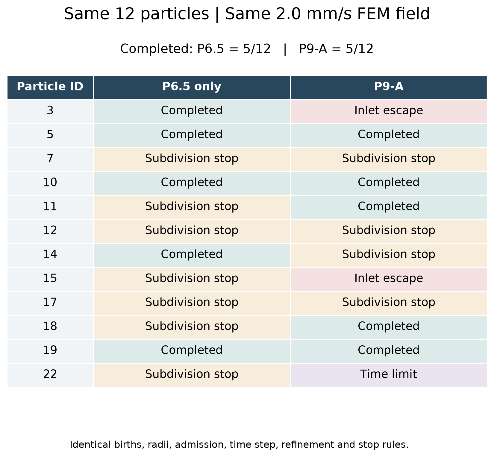

# 一句话结论

目前有两类主要问题：入口 rim 上，P9-A 用几乎为零、方向不一致的局部剪切目标替换了明显向内的 FEM 沿墙速度，导致 2 次入口退出和 ID 22 的严重减速；血管内部，P6.5 与 P9-A 都会遇到 2 nm handoff 附近反复启闭、候选步越界与极小时间推进的问题。ID 7 另有同一网格边上近重复约束引起的接触子问题秩病态。不是所有失败都由 P9-A 新引入。

本轮状态：**DIAGNOSIS_COMPLETE（诊断完成，不是 production validation）**。未修改生产物理、CFD、2 nm handoff、dt、horizon 或停止规则，未启动 500 条轨迹。

# P6.5 和 P9-A 同样 12 条发生了什么

P6.5 完成 **5/12**，其余 **7 条细分停止**。P9-A 完成 **5/12**，另有 **2 条入口退出、4 条细分停止、1 条时限结束**。两种方法完成的 ID 不完全相同。

| ID | P6.5 only | P9-A |
| --- | --- | --- |
| 3 | 完成 → OUTLET_02 | 入口退出 |
| 5 | 完成 → OUTLET_02 | 完成 → OUTLET_02 |
| 7 | 细分进展停止 | 细分进展停止 |
| 10 | 完成 → OUTLET_02 | 完成 → OUTLET_02 |
| 11 | 细分进展停止 | 完成 → OUTLET_02 |
| 12 | 细分进展停止 | 细分进展停止 |
| 14 | 完成 → OUTLET_02 | 细分进展停止 |
| 15 | 细分进展停止 | 入口退出 |
| 17 | 细分进展停止 | 细分进展停止 |
| 18 | 细分进展停止 | 完成 → OUTLET_02 |
| 19 | 完成 → OUTLET_02 | 完成 → OUTLET_02 |
| 22 | 细分进展停止 | 1.5 s 时限 |

全部出生事件直接取自原始 smoke 的 trajectory metadata，未重新抽样。ID、birth time、半径、位置、四元数、seed、admission provenance 与哈希均保留。两组共同使用 SHA256 为 `129ebb77396550b300b20ce29cde7b03919e6037b7a81de60fe75d6c6efb616d` 的 2.0 mm/s Frozen FEM；名义 dt=0.00025 s，horizon=1.5 s，原 physical-time refinement 与 guard 完全相同。

原保存的 12 条 P9-A 数组与服务器新诊断数组 **全部逐位相同**。旧约 0.352841 mm/s 流场仅用于明确指定历史输入的 P6.5 回归测试，没有用于 A/B。

# 为什么两条会从入口退出

| ID | FEM 向内速度 (m/s) | P6.5 向内速度 (m/s) | P9-A 向内速度 (m/s) | 沿墙 FEM 速度 (m/s) | H×剪切速度尺度 (m/s) | 权重 / 特征 |
| --- | --- | --- | --- | --- | --- | --- |
| 3 | 2.401931e-03 | 2.401931e-03 | -1.393360e-09 | 2.401931e-03 | 1.182366e-08 | 1 / EDGE |
| 15 | 2.401931e-03 | 2.401931e-03 | -1.025443e-08 | 2.401931e-03 | 1.634333e-08 | 1 / EDGE |

**ID 3：**出生点位于原入口 cap 三角形 105，局部有符号距离为 4.765e-22 m（舍入尺度的零）。最近 WALL 三角形为 35011，最近点是入口 rim 的 EDGE，距 rim 为 7.794e-21 m；wall normal 与入口向内法向夹角 90.001390°，gap/a=0.010291。FEM 沿墙速度 / H|s| 为 2.03e+05 倍，二者夹角 101.303°。权重为 1，因此 blended target 完全取自 q_wall，目标切向速度只有 7.109879e-09 m/s。模型在 t=0 的第一次求解就改变速度；首个 P9-A 保存端点 t=0.00025 s 已跨回真实入口面，有符号距离为 -3.483400e-13 m。P6.5 第一个保存点已向内 1.501207e-07 m，最终结果为“完成 → OUTLET_02”。对齐物理时刻的首个非零位置差出现在保存时刻并集的 t=6.25e-05 s；在 t=0.00025 s，位置差为 6.204937e-07 m。没有为“明显分叉”另设阈值。

**ID 15：**出生点位于原入口 cap 三角形 158，局部有符号距离为 2.846e-21 m（舍入尺度的零）。最近 WALL 三角形为 32812，最近点是入口 rim 的 EDGE，距 rim 为 3.005e-21 m；wall normal 与入口向内法向夹角 90.000760°，gap/a=0.077937。FEM 沿墙速度 / H|s| 为 1.47e+05 倍，二者夹角 134.686°。权重为 1，因此 blended target 完全取自 q_wall，目标切向速度只有 1.458308e-08 m/s。模型在 t=0 的第一次求解就改变速度；首个 P9-A 保存端点 t=0.00025 s 已跨回真实入口面，有符号距离为 -2.563607e-12 m。P6.5 第一个保存点已向内 6.004827e-07 m，最终结果为“细分进展停止”。对齐物理时刻的首个非零位置差出现在保存时刻并集的 t=0.00025 s；在 t=0.00025 s，位置差为 6.004852e-07 m。没有为“明显分叉”另设阈值。

两条在 P6.5 下都先正常向内进入，没有入口退出；ID 15 后来发生内部 handoff 停止，不能把它写成完整成功。入口处是有限三角形边缘法向，不是一个已验证适用静止无限平面线性剪切闭合的稳定 face interior。数据明确支持该处 `q_target` 替换与失败相关；本轮没有发明 mismatch threshold，也没有关闭这些位置的 P9-A。

真实 cap 并非数值上完全共面，全局拟合面最大偏差约 1.481e-11 m，大于两条失败的极小上游位移。因此入口判断采用原有限 cap 三角形相交、admission anchor 三角形的有符号距离以及 FEM inside-lumen 由 true 变为 false 三项证据。不能用全局拟合平面的正负号代替真实 cap。Figure 03 的 3D 图使用真实 mesh；右侧以 pm 展示微小退出，未夸大 3D 位移。如此小的反向量不是生理反流证据。

完整接受状态及 trial 求解点见 `data/inlet_escape_states.csv`；同一物理时刻的差值序列见 `data/inlet_divergence.csv`。数组首行保存的速度是初始化自由速度，不能拿它当作 P9-A 已求解速度；速度分叉用 t=0 的实际 trial solve 判断。

# 为什么四条会卡在 2 nm 附近

| ID | P6.5 从出生 | 相同 P9-A 状态切回 P6.5 | P9-A min accepted g_nf (m) | 末100次三角形切换 | 最大法向变化 (°) | 阻力矩阵条件数范围 |
| --- | --- | --- | --- | --- | --- | --- |
| 7 | 细分进展停止 | 细分进展停止 | -1.653436e-17 | 0 | 0.005836 | 408.805518–408.806384 |
| 12 | 细分进展停止 | 完成 → OUTLET_02 | -1.927631e-17 | 0 | 0.000550 | 302.661402–302.661408 |
| 14 | 完成 → OUTLET_02 | 细分进展停止 | -8.506390e-18 | 0 | 0.000758 | 384.864330–384.864346 |
| 17 | 细分进展停止 | 细分进展停止 | -2.007750e-17 | 0 | 0.001998 | 266.644709–266.644722 |

“最小 g_nf”是实际壁隙减去 handoff 下限。约 −1e-17 m 的小负值均在原几何舍入预算（约 2.0094e-17 m）内；真实 WALL gap 仍约为正的 2 nm。被拒候选步可能越过下限较多，但没有成为接受状态。

**ID 7：**与 P6.5 共享的 handoff 进展问题，并有接触子问题秩病态的附加证据；不能笼统排除所有 solver 问题。 首次拒步 t=0.049 s，首次 depth≥7（单次试步不足名义步长 1%，仅沿用原 guard 的尺度作描述）t=0.0534726563 s。诊断检查点 t=0.0535 s，重放前缀 282 个状态逐位一致；切回 P6.5 的结束时间 0.0535070288181 s。末 100 次 trial：50 次接受，HANDOFF_ENDPOINT_BELOW_LOWER: 47；HANDOFF_SWEEP_NOT_CERTIFIED: 2；EXCESSIVE_SUBDIVISION_PROGRESS_GUARD_64_STEPS_BELOW_1_PERCENT_NOMINAL_DT: 1。handoff 有约束的 trial 44 次，启闭 11 次；接受时间合计 1.363754e-07 s，为一个原名义步长的 5.455017e-04。末窗最小起点 g_nf=-1.653436e-17 m；所有接受状态的最小值见上表。

**ID 12：**相同检查点关闭 P9-A 后能够完成，说明这段贴壁续行对 P9-A 的切向/旋转修正敏感。P6.5 从出生仍会在另一段路径停止，不能说底层 handoff 已经可靠。 首次拒步 t=0.02 s，首次 depth≥7（单次试步不足名义步长 1%，仅沿用原 guard 的尺度作描述）t=0.026328125 s。诊断检查点 t=0.02625 s，重放前缀 174 个状态逐位一致；切回 P6.5 的结束时间 0.0287506799671 s。末 100 次 trial：50 次接受，HANDOFF_ENDPOINT_BELOW_LOWER: 49；EXCESSIVE_SUBDIVISION_PROGRESS_GUARD_64_STEPS_BELOW_1_PERCENT_NOMINAL_DT: 1。handoff 有约束的 trial 44 次，启闭 12 次；接受时间合计 4.577637e-08 s，为一个原名义步长的 1.831055e-04。末窗最小起点 g_nf=-1.666543e-17 m；所有接受状态的最小值见上表。

**ID 14：**P6.5 从出生能完成，但从已经走到该处的 P9-A 检查点切回 P6.5 仍停止。支持“P9-A 改变路线，进入共有 handoff 薄弱区”，不支持“只要末端关掉 P9-A 就一定恢复”。 首次拒步 t=0.01675 s，首次 depth≥7（单次试步不足名义步长 1%，仅沿用原 guard 的尺度作描述）t=0.02125 s。诊断检查点 t=0.02125 s，重放前缀 120 个状态逐位一致；切回 P6.5 的结束时间 0.0212724056244 s。末 100 次 trial：50 次接受，HANDOFF_ENDPOINT_BELOW_LOWER: 49；EXCESSIVE_SUBDIVISION_PROGRESS_GUARD_64_STEPS_BELOW_1_PERCENT_NOMINAL_DT: 1。handoff 有约束的 trial 46 次，启闭 9 次；接受时间合计 6.097555e-08 s，为一个原名义步长的 2.439022e-04。末窗最小起点 g_nf=-8.506390e-18 m；所有接受状态的最小值见上表。

**ID 17：**从出生的 P6.5、P9-A 和检查点切回 P6.5 都停止，属于共有 handoff 启闭/进展问题。 首次拒步 t=0.1765 s，首次 depth≥7（单次试步不足名义步长 1%，仅沿用原 guard 的尺度作描述）t=0.181203125 s。诊断检查点 t=0.18125 s，重放前缀 815 个状态逐位一致；切回 P6.5 的结束时间 0.18125702858 s。末 100 次 trial：52 次接受，HANDOFF_ENDPOINT_BELOW_LOWER: 47；EXCESSIVE_SUBDIVISION_PROGRESS_GUARD_64_STEPS_BELOW_1_PERCENT_NOMINAL_DT: 1。handoff 有约束的 trial 47 次，启闭 9 次；接受时间合计 6.103516e-08 s，为一个原名义步长的 2.441406e-04。末窗最小起点 g_nf=-2.007750e-17 m；所有接受状态的最小值见上表。

四条末窗的主拒步原因都是 **HANDOFF_ENDPOINT_BELOW_LOWER**。记录显示：略高于接触舍入带时不启用约束，仍存在向壁速度，较大候选步被拒；到达接触带后约束又启用，之后沿边运动让状态离开极窄接触带，再重复上述过程。原进展 guard 最终停止积分。ID 12、14、17 在启用约束的试步中，法向速度通常约为 1e-20 m/s；非激活时分别约 −7.5e-7、−3.1e-6、−3.4e-6 m/s。它们不是真正处于静止，也不能因可见位移很小就判断为生理捕获。

末 100 次 trial 的最近三角形切换均为 0，法向最大变化均小于 0.006°；描述用的 ≥10°/45°/90° 计数均为 0。这些角度分箱只用于报告，没有进入任何物理/接受 gate。该末窗不支持 TYPE C“频繁换三角形造成失败”为主因。全轨迹切换次数另存于 JSON，不能把末窗的零推广到整条轨迹。

**ID 7 的额外求解证据：**trial 453、454 中，WALL 三角形 3068 与 12079 共享同一条有限网格边。它们产生两条近重复约束，接触子问题条件数为 1.194932e13，内部 velocity budget 为 0.0332281 m/s；两条 multiplier 为 0，约 −6.7686e-7 m/s 的向壁速度未被消除，随后被端点几何证书拒绝。阻力矩阵自缩放条件数仍只有约 408.8。因而“阻力矩阵 SPD 正常”不等于“接触求解完全无问题”。此异常直接解释该两次拒步，但不能据此认定所有细分停止都由它造成。证据见 `data/contact_solver_edge_audit.json`。

分类以 **handoff activation / integration compatibility** 为主；P9-A 会改变到达位置与续行方向，ID 12 的同状态对照最直接体现这种影响。ID 7 另有 contact solver 数值问题。没有强行把四条全归入单一 TYPE A/B/C/D。

检查点对照保留了完整 P9-A 前缀、原 provider 调用计数、64 步历史与原停止规则，仅在已保存的名义时间边界切换后续切向/旋转修正 OFF。P9-A ON 分支直接复用同输入已完成的 B 轨迹，四条 OFF 分支均对全部前缀数组作逐位检查，未另造初始化状态，也未重置积分 guard。

# 1.5 s 那条是什么情况

ID 22 判为 **P9A_SLOWDOWN_ASSOCIATED**。

- P9-A：1.5 s 内路径仅 24.260 nm，平均速度 1.617332e-08 m/s；最后 10% 时间平均速度 1.751517e-08 m/s，仍然很低。gap 为 7.881–10.052 nm，handoff 激活时间占比 0%，wall weight=1 的时间占比 100%。
- P6.5：在 0.009449680 s 内已移动 20.388 um，平均速度 2.157517e-03 m/s，之后因另一个 handoff 问题停止，未在 1.5 s 内完成。

这不是“两个模型都走正常长路径、只是 horizon 太短”的证据。也不能说关闭 P9-A 就一定完成。没有延长 horizon。

# bulk velocity 和 shear prediction 是否一致

Figure 06 共 252 个代表状态：每条 P9-A 轨迹按接受序号均匀抽取最多 25 个，包含首、末求解点；两条入口退出各仅 1 个实际求解点。颜色表示整条轨迹的最终结果，不是给每个状态贴“坏状态”标签。

入口退出的 |Hs|/|u_t| 约为 4.92e-6 和 6.80e-6；ID 22 的代表状态中位数约为 1.011e-05。这里剪切预测与实际沿墙速度相差约五个数量级，入口两条方向夹角约 101°、135°。

但完成轨迹也包含相似的入口低剪切状态，细分停止与成功轨迹的内部状态明显重叠。完成组与细分停止组的速度比中位数分别为 0.598 与 0.552。因此 mismatch 对入口退出和极端减速有明确解释价值，**不足以单独区分所有成功/失败，更不能据此拟合一个阈值来开关模型**。这些是不等长轨迹的少量代表状态，不是统计显著性或失败概率估计。

诊断同时保留了 q_bulk、q_wall、q_target 的四分量及范数，转动分量采用 a×omega，因此三者范数均以 m/s 表示。small_reference 仅为机器 epsilon 乘当前速度尺度（下限为浮点 tiny），只保护除法；两向量任一低于数值分辨率时角度记 null 并附原因。它没有进入生产路径。

# 当前最可能的问题位置

1. **入口 rim 适用域与 q_target 构造**：`planar_wall_hydrodynamics.py:planar_wall_affine_block`。当 w=1 且局部剪切近零时，现有表达完全替换 bulk tangential state；在当前入口边缘产生近零/反向结果。
2. **handoff 启闭与连续几何验证的兼容性**：`nearfield_handoff.py:handoff_constraints`、`wall_handoff_certificate` 与 `particle65_motion.py:v1_trial`。四条末窗已有逐 trial 的启闭、法向速度、拒步和微小接受时间证据。
3. **同一网格边的近重复接触约束**：`kinematic_contact.py:_dual_active_set` 与 `resistance_solver.py:solve_resistance`。ID 7 的接触容差被秩条件数放大，与阻力矩阵条件数是两个不同问题。

这些位置均只作定位，本轮没有改动。

# 哪些东西已经排除

- 不是误读旧 active flow：SHA 和 manifest 检查通过；A/B 同用新 2.0 mm/s FEM。
- 不是诊断日志改变了解：新增开关一致性测试、真实 FEM 测试通过；12 条 P9-A 原轨迹全部逐位复现，四个检查点前缀逐位相同。
- 这四条末窗没有阻力矩阵 SPD failure：最小自缩放特征值约 1，条件数约 267–409，后向残差很小。**不排除接触子问题，ID 7 已观察到异常。**
- 这四条末窗不是频繁 nearest-triangle switching 或大法向跳变。
- 接受状态没有 WALL 穿透。正常方向 P6.5 回归和“无 wall-normal shear force”测试通过；记录到的最大绝对 wall-normal shear force 为 4.544e-26 N（浮点舍入量）。没有重复添加 normal lubrication 或加入 lift 的代码变更。

尚未确定：哪一种最小修复足以同时解决这些情况；12 条样本不能代表 500 条分布或所有出口；本轮没有重新验证 CFD/gradient 的物理充分性，也没有证明近零反向量是生理现象。只有 2.0 mm/s 同场 A/B，本轮不能单独量化“流速从旧值提高”对失败率的因果贡献。

# 下一轮最小修改建议

优先审查入口/剪切目标构造；并独立修正 handoff 与原约束激活的兼容性；ID 7 的同边约束秩处理作为第三个小问题。具体修改位置、物理含义、风险和最少回归测试见 [NEXT_DEVELOPMENT_OPTIONS_ZH.md](NEXT_DEVELOPMENT_OPTIONS_ZH.md)。本轮没有实现上述方案。

# 结果与复现

本地目录：`/home/lzy/projects/ulm_particle_3d_particle0/particle_3d/reports/particle9a_2mmps_diagnosis`。

服务器新目录：`/workspace/particle9a_2mmps_diagnosis_20260923T232212Z`。服务器原目录 `/workspace/particle9a_2mmps_20260923T222942Z` 仅作只读证据。A/B 采用 6 workers、每 worker 单线程；四个检查点续行采用 4 workers。A/B 用时 132.65 s，检查点批次 23.87 s；GPU 未使用。重点入口和时限分析复用 same-12 记录，未重复扩大计算。

代码：`particle_3d/src/particle_3d/particle9a_diagnostics.py`；`particle_3d/scripts/run_particle9a_diagnosis.py`、`analyze_particle9a_diagnosis.py`、`render_particle9a_diagnosis.py`、`finalize_particle9a_diagnosis.py`。执行命令与远程日志保存在 `logs/`，重放时的代码快照另存 `logs/replay_code_bundle.tar.gz`。最终交付的 API 和 CLI 记录开关均默认 OFF；重新运行诊断时显式加 `--diagnostics`，检查点参数也默认为空。运行器若发现目标轨迹已存在会拒绝覆盖；复现时选择新的输出目录。历史执行命令按当时版本原样保留，CLI 最终显式开关仅影响后续调用方式，不改变已经保存的解。

原始全部 trial 和 accepted-state 记录：`data/replays/{P65,P9A}/trajectories/*.jsonl.gz`；包含拒步、外部停止与 unavailable 原因。四个检查点续行：`data/checkpoint_replays/checkpoint/trajectories/`。压缩 JSONL 可直接逐行读取；CSV 中向量和嵌套 solver 字段为 JSON 字符串。字段语义详见 `data/diagnostic_schema.json`。

- [01_same12_p65_vs_p9a.png](figures/01_same12_p65_vs_p9a.png)；[矢量 PDF](figures/01_same12_p65_vs_p9a.pdf)。数据：[ab_outcomes.csv](data/ab_outcomes.csv)
- [02_inlet_escape_diagnosis.png](figures/02_inlet_escape_diagnosis.png)；[矢量 PDF](figures/02_inlet_escape_diagnosis.pdf)。数据：[inlet_escape_states.csv](data/inlet_escape_states.csv), [inlet_summary.csv](data/inlet_summary.csv), [figure02_plotted_intervals.csv](data/figure02_plotted_intervals.csv)
- [03_inlet_geometry_closeup.png](figures/03_inlet_geometry_closeup.png)；[矢量 PDF](figures/03_inlet_geometry_closeup.pdf)。数据：[inlet_geometry_closeup.json](data/inlet_geometry_closeup.json), [inlet_summary.csv](data/inlet_summary.csv)
- [04_handoff_stall_timeline.png](figures/04_handoff_stall_timeline.png)；[矢量 PDF](figures/04_handoff_stall_timeline.pdf)。数据：[handoff_stall_trials.csv](data/handoff_stall_trials.csv), [figure04_plotted_trials.csv](data/figure04_plotted_trials.csv), [analysis_summary.json](data/analysis_summary.json)
- [05_handoff_failure_reason_summary.png](figures/05_handoff_failure_reason_summary.png)；[矢量 PDF](figures/05_handoff_failure_reason_summary.pdf)。数据：[analysis_summary.json](data/analysis_summary.json), [handoff_stall_trials.csv](data/handoff_stall_trials.csv), [ab_outcomes.csv](data/ab_outcomes.csv)
- [06_bulk_vs_shear_consistency.png](figures/06_bulk_vs_shear_consistency.png)；[矢量 PDF](figures/06_bulk_vs_shear_consistency.pdf)。数据：[closure_consistency_states.csv](data/closure_consistency_states.csv), [analysis_summary.json](data/analysis_summary.json)

本地必要测试 **29 passed**，服务器诊断测试 **8 passed**。原本地 247 个受保护文件、原服务器 266 个文件的 SHA256 均未改变；实际 Git index 保持原样。已有用户改动保留，未提交、未推送。普通 `git diff --stat` 与本轮临时索引统计分别见 `logs/git_diff_stat.txt`、`logs/git_diagnosis_diff_stat.txt`。

# 人工审核

- [ ] same-12 A/B 可信
- [ ] inlet failure 定位清楚
- [ ] handoff stall 定位清楚
- [ ] 没有用参数放宽掩盖失败
- [ ] 可以进入修复阶段
