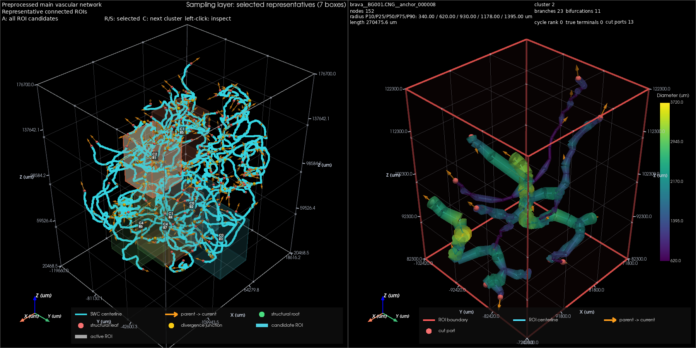

# 基于 BraVa 数据的人脑动脉网络预处理与代表性局部区域提取

本文记录原始 BraVa 数据接入及保留原半径的显示验证。当前 human 默认输入已切换为允许官方近邻分叉合并的 VascularMD 优化 SWC，详见[后续研究报告](文本记录%20-%20BraVa%20官方分叉合并与半径优化接入.md)。下文原始数据的数量和结果作为优化前对照保留。

## 摘要

**目的：**在保持既有三维可视化方法不变的条件下，将面向小鼠血管数据的预处理与局部感兴趣区域（region of interest，ROI）提取流程应用于 BraVa 人脑动脉重建数据。**方法：**以本地 BraVa 数据中的 BG001.CNG 为验证对象，直接读取 SWC 文件，依据文献中的形态测量尺度及本地几何数值，将坐标和半径按毫米解释并统一换算为微米。在保留原始连接关系的基础上构建分支图，以最远点策略选取空间锚点，提取连通局部区域，并结合半径分布和结构特征进行聚类与代表区域选择。**结果：**验证样本包含 2 810 个节点和 2 809 条父子连接，全部保留于分析网络；其中心线总长度为 6 058.637 mm。64 个候选位置产生 44 个有效 ROI，最终选出 7 个代表区域，覆盖 5 个聚类中的 4 个。所有有效 ROI 均通过连通性、来源追溯和边界语义检查，完整流程正常结束。既有可视化实现及其显示参数保持一致。**结论：**通过独立的数据编目、物理尺度适配和无影像条件下的空间范围确定，现有方法能够处理该人脑动脉样本。结果支持流程适配的可行性，但不等同于对完整人脑血管系统、真实血流方向或人群代表性的验证。

**关键词：**人脑动脉；BraVa；磁共振血管成像；SWC；连通区域；形态学分析

## 1 引言

血管局部模型的几何尺度和分支组织直接影响后续形态分析及仿真研究。小鼠微血管影像与人脑磁共振血管成像所覆盖的血管层级、空间分辨率和观察范围存在明显差异，因此，将已有处理流程用于人脑数据时，需要同时明确数据来源、长度单位和局部区域尺度。

Wright 等建立的 BraVa 数据库提供了由磁共振血管成像重建的人脑动脉树，为人脑动脉形态分析提供了公开数据基础[1]。本研究将这些重建作为既有 SWC 预处理与 ROI 提取方法的新输入，并以单个样本完成实际验证。研究重点是保证原始形态信息在数据读入、尺度统一和局部提取之间保持一致，同时沿用原有三维显示方式，使数据适配与显示方法的改变相互独立。

## 2 材料与方法

### 2.1 数据来源与研究对象

原始研究纳入 61 名健康志愿者，使用 3 T 时间飞跃法磁共振血管成像，采集分辨率为各向同性 620 μm。研究者追踪可见动脉，并以 SWC 格式记录节点位置、半径及父子连接关系[1]。该数据描述的是成像条件下可见的动脉树，不包含完整的毛细血管床或静脉系统。

本次使用的数据来自项目内的 BraVa SWC 目录。目录清点发现 123 个 SWC 文件，其中 62 个文件不含 ColorCoded 标记，61 个文件含该标记；按文件名称归并后得到 62 个基础标识。上述数量属于本地文件清点结果，不能直接视为独立受试者人数，也不应与原文的 61 名受试者机械对应。不同版本作为独立文件保留，同一基础标识的版本关联到同一组，不将多个版本拼接为新的血管网络。文件名称也不用于推断年龄、性别或临床信息。

默认分析对象为 BG001.CNG。采用单样本方式是为了保留原有逐例观察的研究流程，而非将该样本认定为人群中最具代表性的个体。其他 SWC 文件可以通过独立的人脑配置指定。人脑分析结果单独保存，以区分不同物种和不同数据来源。

### 2.2 物理尺度的确定与统一

SWC 的第六列表示半径，而非直径[1]。本地文件未提供明确的单位声明，因此本研究对长度单位采用有文献尺度支持的解释，并将该解释显式记录于配置中。具体而言，原文以毫米报告血管长度及空间范围；本地 BG001.CNG 的坐标跨度为 137.02、115.63 和 156.24，中心线总长度约为 6 058.637，半径中位数为 0.62。将这些数值解释为毫米，与人脑动脉的空间范围及原文报告的总长度量级一致。原文表 1 中的全树总长度范围为 4 752～9 171 mm。由于本地文件版本和统计范围未与论文逐例对应，本研究仅将这一比较作为量级核对，不将其表述为原始单位元数据的直接证明。

为与既有几何计算和显示中的微米单位保持一致，坐标和半径在首次读取时同时换算：

$$
\mathbf{x}_{\mu\mathrm{m}}=1000\mathbf{x}_{\mathrm{mm}},\qquad
r_{\mu\mathrm{m}}=1000r_{\mathrm{mm}}.
$$

这一处理仅改变数值的单位表达，不改变血管形状、节点编号或连接关系。归一化结果再次读入时，不重复进行该换算。原始 SWC 文件保持原样。由于输入已按物理坐标解释，原始 MRA 的 620 μm 分辨率不再作为坐标乘数；否则会对已经具有物理尺度的几何重复缩放。

本研究保留负坐标。负值表示相对于原有参考原点的位置，不意味着数据越界。BraVa 输入未包含配套 TIFF 图像，因此分析范围直接由 SWC 节点的三维最小、最大坐标确定，不套用小鼠影像的体素尺寸或固定图像范围，也不构造替代影像。

### 2.3 拓扑保留与分支表达

预处理检查节点编号、父节点引用、重复节点、自连接和有向环，并分别保存完整参考网络与用于分析的连通网络。当原始 SWC 包含多个连通分量时，沿用按中心线总长度选择主要分量的规则；其他分量保留于参考结果中，不自动认定为错误，也不通过人工补边连接。本次 BG001.CNG 原本只有一个连通分量，因而完整网络全部进入分析。

点级网络以 SWC 的父节点到当前节点作为结构方向。随后以根节点、分叉和末端为边界，将连续点串组织为分支，同时保留其与原始节点和边的对应关系。派生几何采用 620 μm 的重采样间距，不启用平滑。该间距用于连续曲线的计算表达，其选择参考原始成像分辨率，并不意味着增加了影像中不存在的解剖细节。

需要区分结构方向与生理流向。原文为获得一致的树结构，以基底动脉可见起点组织重建，并排除了前交通动脉连接[1]。因此，SWC 根节点不能直接解释为唯一真实血流入口，树结构也不能用于证明人体动脉不存在环路。此处保留的方向箭头仅表示原文件的父子关系。

### 2.4 连通 ROI 的形成与代表区域选择

为适应大尺度动脉，局部区域尺寸设为 30 × 30 × 40 mm³，候选锚点最小间距为 15 mm，候选数量上限为 80。锚点优先取自网络内部的结构关键节点，通过最远点策略使位置尽可能分散。以上为本研究的数据适配参数，并非原论文提出或验证的最优 ROI 参数。

每个锚点对应一个三维裁切区域。血管线段与区域边界的交点由几何计算获得，随后只保留与锚点连通的部分。原网络中的末端与裁切造成的新端口分别记录，以防将人为截断位置当作原始解剖末端。候选区域至少包含两条分支，并接受半径有效性和图结构检查。

有效候选采用九维特征表征：五个按血管长度加权的半径分位数，以及分支数、分叉数、血管总长度和环路数。特征经过稳健尺度标准化后进行 K-means 聚类，聚类数为 5，随机种子为 42。代表区域从真实候选中选择，按聚类均衡分配，每类至多选取两个，目标总数为 10；同时限制区域间重叠比例不超过 0.25，代表位置的间距不小于 10 mm。数量目标受到候选分布和空间约束的共同限制，不能保证每次恰好达到 10 个。

此外，沿用仅包含半径特征的对照分析，以观察加入结构特征对选样结果的影响。该对照用于描述当前样本内的方法差异，不作为统计显著性检验。

### 2.5 显示一致性与验证方法

本研究保留既有双视窗、配色、方向箭头、图例、坐标轴、相机与交互逻辑，也保留全部可视化参数。左侧显示整体网络及代表区域位置，右侧显示所选局部结构。没有配套影像时，使用既有的纯 SWC 显示路径。显示数据的更新来自人脑几何本身。

验证包括文件完整性比对、单位换算及保存后再读取的一致性检查、无影像输入的采样检查和全流程实际运行。自动验证采用离屏显示，以便程序完成后自动结束；正式人脑配置仍保持交互窗口开启。小鼠脚本、原小鼠配置及三个直接负责可视化的模块通过文件摘要比对，确认其内容未发生改变；human 脚本中的原有函数和类亦保持不变。新增的数据适配测试及既有相关回归测试均通过。

## 3 结果

### 3.1 文件质量与分析网络

对本地 123 个文件进行逐文件解析后，发现 BH0027.CNG 的第 3407 行缺少父节点字段，因而未通过结构合法性检查；另有 16 个文件含非正半径记录，其中包括该结构异常文件。这些问题如实保留于数据审计结果，没有自动修改原始文件。文件非空、能够被编目，并不等同于通过全部结构和半径检查。

默认样本 BG001.CNG 未发现上述问题。其节点半径均为正值，参考网络与分析网络完全对应。主要结果见表 1。

**表 1　BG001.CNG 的几何与拓扑结果**

| 指标 | 实际结果 |
| --- | ---: |
| 原始节点数 | 2 810 |
| 原始父子连接数 | 2 809 |
| 连通分量数 | 1 |
| 中心线总长度 | 6 058.637 mm |
| 三轴空间跨度 | 137.02 × 115.63 × 156.24 mm |
| 节点半径范围 | 0.3100～2.6288 mm |
| 节点半径中位数 | 0.6200 mm |
| 聚合分支数 | 197 |
| 分叉节点数 | 98 |
| 结构末端数 | 99 |
| 新增节点、原始边及父子关系改动数 | 均为 0 |

空间跨度反映本地文件的坐标包围范围，不直接等同于原文中针对特定动脉范围计算的宽度、高度或深度。结构末端指重建文件中的可见末端，同样不能视为经生理测量确认的出口。

### 3.2 局部区域与代表性结果

本次生成 64 个候选锚点，其中 44 个产生有效 ROI，20 个因分支数量不足被排除。44 个有效候选全部保持连通，均能追溯到原始血管节点或边，原始末端与裁切端口的标记均通过检查。

结合半径与结构特征的分析得到 5 个聚类，各类包含 3、9、1、1 和 30 个候选。由于两个聚类各仅包含一个候选，每类至多两个的规则使可分配名额由目标 10 个降为 8 个；进一步施加空间约束后，最终选出 7 个代表区域，覆盖 4 个聚类。全部聚类的覆盖率因此为 80%，而非 100%。代表区域的最大两两空间重叠比例约为 5.26%，平均最近邻距离为 39.42 mm。

仅使用半径特征的对照选择了 8 个区域，覆盖全部 5 个聚类。但其聚类划分与九维特征分析并不相同，因而覆盖率不能被单独用于判定哪一种特征方案更优。本次结果表明，结构特征会改变候选分组和最终选样，也提示后续研究需要结合研究目的权衡形态覆盖与空间分散程度。

### 3.3 显示结果与运行一致性

人脑样本完成了预处理、建图、ROI 采样和双视窗预览输出，整体处理与 ROI 完整性验收均通过，最终进程退出码为 0。图 1 为本次实际生成的预览。原有显示内容与交互实现保持不变，坐标轴和直径色标仍以微米表达；对应的人脑动脉尺度来自统一换算后的输入。

**图 1　BG001.CNG 的整体动脉树与局部 ROI。** 左侧为完整分析网络及七个代表区域的位置，右侧为其中一个区域的局部结构。橙色箭头表示 SWC 父子关系。图中的颜色和坐标标注沿用原有显示方法；本图不提供实测血流方向或流速信息。

## 4 讨论

本次适配表明，既有方法从小鼠数据扩展到人脑数据时，主要差异集中于输入组织方式和物理尺度。SWC 所表达的节点、半径和连接关系可以继续使用，但依赖影像尺寸确定分析范围的条件需要相应放宽。对于仅有 SWC 的输入，以节点实际范围界定分析空间，能够保留原有负坐标，也避免人为引入并不存在的图像边界。

这一适配不意味着不同数据源已经具有相同的生物学解释。BraVa 的可见血管受 MRA 分辨率与信号特性限制。原文指出，时间飞跃法信号与血流有关，血管直径可能被低估，对直径的纯结构性解释应保持谨慎[1]。因此，本文用于 ROI 分组的半径应视为重建半径；其数值适合描述当前文件内的形态差异，但尚不能直接作为经独立测量验证的真实管腔半径。将来若用于血流或微泡仿真，仍需要针对具体模型验证其几何和边界条件。

本研究的单位解释由文献量级和本地几何共同支持，而非来自每个 SWC 文件的显式单位标签。当前换算适用于所分析的本地文件集合；后续引入其他来源或经过重新缩放的版本时，应重新核对尺度。坐标的正负和轴顺序得到保留，但不能仅凭这些数值推断统一的临床解剖坐标约定。

ROI 尺寸、锚点间距和聚类数是本次研究设置。单个样本的成功运行尚不能证明这些参数对全部 BraVa 样本都最优，也不能证明所选区域具有健康人群代表性。本次 80% 的聚类覆盖率尤其说明，数据完整性验收通过与形态类别覆盖充分是两个不同层次的评价。后续若要求每一类至少有一个代表区域，需要另行研究空间约束与覆盖目标之间的取舍，不宜通过忽略未覆盖类别来报告“完全代表”。

此外，本地文件数量、文件版本和论文受试者数量之间尚未建立逐例对应关系，部分文件存在结构或半径质量问题。因此，本次全流程结论限定于 BG001.CNG；目录级审计提供了后续逐例研究的依据，但不构成全部文件均能通过后续采样或建模的保证。

## 5 结论

本研究完成了 BraVa 人脑 SWC 对既有预处理与代表性 ROI 提取流程的输入适配，并在不改变可视化实现的条件下完成单样本全流程验证。BG001.CNG 的原始节点和连接关系得到保留，44 个有效连通 ROI 和 7 个代表区域均具有可追溯的来源。该结果为后续人脑动脉局部形态研究提供了可复现的数据基础；其适用范围仍受成像分辨率、重建半径、树结构表达及单样本验证的限制。

## 6 补充验证：原始半径约束下的平滑显示

上述章节及图 1 记录了输入适配阶段的结果，该阶段沿用原有可视化实现。在此基础上，进一步针对局部血管逐段绘制时出现的接缝开展显示优化。优化的约束是保留每个已有节点的位置和半径，仅对节点之间的显示几何进行插值，不改变源 SWC、保存的 ROI、特征统计或代表区域选择结果。

首先，依据连接关系将非分叉的连续点串组织为完整分支。中心线采用通过全部原节点的三次 Hermite 插值，在相邻点串之间使用一致的切向，使弯折处连续过渡。半径则沿原点串的累计长度采用分段三次 Hermite 保形插值（PCHIP）[2–3]。该方法严格通过已有半径值，并保持各相邻采样区间内的单调性，不通过平均半径消除已有变化，也不产生超出该区间端点半径范围的过冲。因而，原数据中较大的半径差仍然保留，只是连接过程不再由彼此独立的短管表示。

每条完整分支采用连续的截面环构建管面，普通中间节点不再生成独立封口。封口仅位于度数为一的端点，包括相应的 ROI 截断位置；分叉节点保留原分支关系，不添加内部端面。这里得到的是用于观察的插值管面，并非经过分叉融合及体网格验证的流体计算模型。插值也不增加原始成像所包含的解剖信息。

对 44 个人脑 ROI 和 14 个小鼠 ROI 的全部源节点进行检查，插值曲线在原节点处的位置与半径均与保存值完全一致。直接测量生成管面顶点到对应截面中心的距离后，人脑和小鼠数据的最大半径数值误差分别为 2.02 × 10⁻¹¹ μm 以下和 3.16 × 10⁻¹⁴ μm 以下，均处于双精度浮点计算的舍入量级。所有输入 ROI 文件的摘要保持一致。相关测试还验证了截面连续连接、分叉处无内部封口及半径冲突不会被静默平均。

**图 2　原始采样约束下的平滑显示。** 与图 1 使用相同的人脑样本及代表区域。右侧血管在原节点位置保持原半径，节点间采用平滑插值；左侧全局场景、配色、图例、坐标和交互方式沿用既有设置。较明显的局部粗细差异来自输入半径，未被人为抹平。逐例测量结果见[半径一致性记录](../outputs/human_brava/radius_preserving_display_20260923_185147/radius_verification.json)。

## 数据与研究材料

本研究使用随项目提供的论文及本地 SWC 文件，未更改源数据。研究参数保存在[人脑分析配置](../configs/swc_roi_generate_human.yaml)中。2026 年 9 月 23 日的验证采用 Python 3.13.11，软件环境与此前配置的项目虚拟环境一致。验证数据包括[源文件审计](../outputs/human_brava/validation_f6xaghup/source_inventory.json)、[全局处理验收](../outputs/human_brava/validation_f6xaghup/rodent_vasculature/all_run_20260923_182549/acceptance.json)、[ROI 采样汇总](../outputs/human_brava/validation_f6xaghup/sampling/20260923_182551_radius_plus_structure_k5/report/sampling_summary.json)及[文件完整性与显示一致性记录](../outputs/human_brava/validation_f6xaghup/verification_summary.json)。离屏验证使用的配置副本与运行日志同时保留，以区分自动验证条件和正式交互显示条件。

## 参考文献

[1] WRIGHT S N, KOCHUNOV P, MUT F, et al. Digital reconstruction and morphometric analysis of human brain arterial vasculature from magnetic resonance angiography[J]. NeuroImage, 2013, 82: 170–181. DOI: [10.1016/j.neuroimage.2013.05.089](https://doi.org/10.1016/j.neuroimage.2013.05.089).

[2] SCIPY COMMUNITY. PchipInterpolator[EB/OL]. [2026-09-23]. [SciPy 文档](https://docs.scipy.org/doc/scipy/reference/generated/scipy.interpolate.PchipInterpolator.html).

[3] SCIPY COMMUNITY. CubicHermiteSpline[EB/OL]. [2026-09-23]. [SciPy 文档](https://docs.scipy.org/doc/scipy/reference/generated/scipy.interpolate.CubicHermiteSpline.html).
