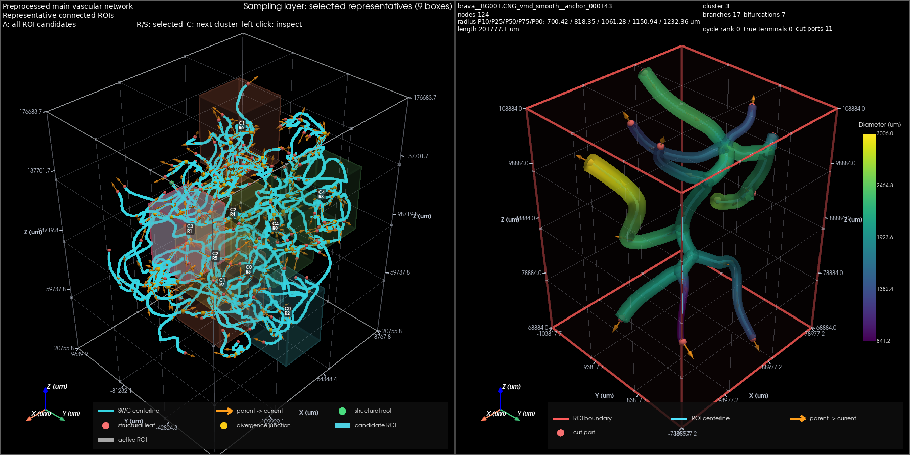

# 允许原生近邻分叉合并的 BraVa 脑血管半径正则化及局部区域分析

## 摘要

BraVa 血管中心线的离散半径变化可在管状显示中形成局部骤缩。严格经过原始数据点的平滑插值能够改善点间连接，却无法消除数据点本身的口径波动。本研究在接受 VascularMD 官方近邻分叉合并的条件下，对 BG001 完整脑血管样本进行空间轨迹和半径的原生正则化建模，并将派生 SWC 接入既有的人脑 ROI 分析流程。结果显示，原始分叉数由 98 减为 96，99 个末端全部保留；排除触及共享分叉节点的点对后，相邻半径对数跳变的第 95 百分位数由 0.693147 降至 0.078204，降低约 88.7%。在包含分叉点对的统计中，该指标亦降低约 86.1%。重新分析获得 40 个有效候选 ROI 和 9 个代表区域。原始 SWC 与既有显示方法保持不变。结果表明，官方连续模型可以减弱本样本中的离散半径波动，但不能据此推断所有原始波动均为误差，也不能将单半径 SWC 视为分叉三维表面的无损表达。

**关键词：** BraVa；脑动脉；VascularMD；半径正则化；近邻分叉；局部感兴趣区域

## 1 引言

SWC 用离散节点记录血管位置、半径及父子关系。当相邻节点半径相差较大时，忠实显示这些数值的管面必然出现粗细变化。此前采用的平滑显示保持所有节点的给定半径，因此即使节点间连接连续，局部收缩仍可能明显。这是数据拟合与显示插值的区别：前者允许连续模型偏离离散观测，后者要求经过这些观测。

本次工作的目的，是将已经确认接受的官方分叉合并与半径建模结果用于人脑 ROI 分析。研究对象仍为单个人脑样本，既有 ROI 大小、选择策略和交互显示方法均继续使用。此前严格要求原始拓扑完全一致的验证结果保留作为历史记录，本次单独评价允许原生合并后的完整样本。

## 2 材料与方法

### 2.1 数据与模型

输入为 `BG001.CNG.swc`，包含 2 810 个节点、2 809 条连接、98 个分叉和 99 个末端。坐标与半径沿用原文件的毫米数值，第六列始终解释为半径。原文件另行保留，不被派生结果覆盖。

建模依据 Decroocq 等的论文《Modeling and hexahedral meshing of cerebral arterial networks from centerlines》[1]，采用官方 VascularMD 固定提交 `770feb8fbfb591d6d43f966db57b1465010b9a13`[2]。通过原生 `model_network(radius_model=True, criterion="AIC")` 分别处理空间轨迹与半径，使用上游实现选择平滑参数。保留官方自动重采样及分叉模型，不额外加入均值滤波、半径截断、单调变细约束或母子血管口径平均。

### 2.2 分叉合并与来源追溯

近邻分叉是否合并由官方算法决定，包装程序不另设距离阈值。本次显式允许这类合并，同时检验原始根及每一个末端的身份是否保留，并要求合并后的每条连接均能追溯到原始血管树中的连续路径。末端丢失或其他无法解释为分叉合并的重连仍会被拒绝。程序默认的严格模式继续存在，只有明确启用原生合并选项时采用本次策略。

对于 BG001，原始编号为 10、12 的近邻分叉并入编号 8 对应的分叉，三个相邻二分叉由官方模型表示为一个四分叉。这些编号用于说明原始文件中的位置，不应与重新编号后的输出 SWC 混用。质量记录分别说明原始拓扑不再完全相同、输出忠实保留原生模型拓扑以及全部末端得到保留，避免把允许合并误写成原始拓扑不变。

### 2.3 连续模型采样与流程接入

普通血管段直接从官方连续样条按弧长取样。分叉内部位置来自原生轨迹，半径由对应原生形状样条读取；共享节点采用入口形状的代表半径，各子段继续采用各自模型值。这里没有新增一套半径拟合算法。

输出采用按原始路径点数采样的方式。发生合并后，一段原始短主干可能同时关联到多条保留下来的路径，因此这一规则不保证整树总点数完全不变。本次输出为 2 816 个节点。总体原始半径统计仍在原树上计算一次，不因路径重用而重复计入主干。

派生数据保存于 `vessel_model/T - Brava/swc_files_vmd/BG001.CNG_vmd_smooth.swc`。人脑入口 `s1-2_swc_roi_generate_human.py` 的默认配置改为读取该文件，分析结果保存于 `outputs/human_brava_vmd`。默认仍处理一个样本；切换样本时，应先生成相应派生 SWC，再在配置中选择其名称。原始数据目录及此前分析结果继续保留。

人脑流程在读取时统一将坐标与半径由毫米转换为微米，仅转换一次。既有 ROI 显示仍精确采用当前输入节点的半径，并平滑连接节点之间的内容；本次改变的是输入数据来源。可视化模块、配色、箭头、交互操作和显示参数均未修改。正式配置保持交互窗口开启，全流程自动验证仅在配置副本中关闭窗口并保存离屏预览。

### 2.4 评价方法

以相邻节点半径的对数比绝对值衡量跳变：

\[
J_i=\left|\log\frac{r_{i+1}}{r_i}\right|.
\]

该值为零表示相邻半径相等，数值越大表示相对变化越明显。主要统计排除触及共享分叉节点的点对，同时另行报告包含全部连接的结果，以免遗漏分叉处的变化。由于节点数与空间轨迹有所改变，另比较单位中心线长度上的对数半径变化，辅助判断改善是否仅来自采样密度差异。上述指标用于描述结果，不用于删点或再次修正半径。

## 3 结果

### 3.1 网络结构及半径变化

| 指标 | 原始 SWC | 优化 SWC |
| --- | ---: | ---: |
| 节点数 | 2 810 | 2 816 |
| 连接数 | 2 809 | 2 815 |
| 根节点数 | 1 | 1 |
| 分叉数 | 98 | 96 |
| 拓扑分支数 | 197 | 195 |
| 末端数 | 99 | 99 |
| 半径最小值，mm | 0.310000 | 0.230484 |
| 半径中位数，mm | 0.620000 | 0.497266 |
| 半径最大值，mm | 2.628800 | 2.157671 |
| 中心线折线总长，mm | 6 058.637 | 5 701.373 |

输出半径全部为有限正值，SWC 写出后重新读取所得连接、坐标、半径和类型与写出前一致。半径范围和中心线长度的变化说明，本次结果是正则化模型的采样，并非仅改变画面的外观。

| 半径变化指标 | 原始值 | 优化值 |
| --- | ---: | ---: |
| 排除共享分叉点对后的样本数 | 2 515 | 2 525 |
| 排除共享分叉点对后的 J：P95 | 0.693147 | 0.078204 |
| 排除共享分叉点对后的 J：最大值 | 1.386294 | 0.322453 |
| 包含全部连接的 J：P95 | 0.693147 | 0.096195 |
| 包含全部连接的 J：最大值 | 1.609438 | 0.504499 |
| 排除共享分叉点对后的单位长度对数变化：P95，mm⁻¹ | 0.542300 | 0.040057 |

主要指标 P95 降低约 88.7%，最大跳变降低约 76.7%；包含分叉点对后的 P95 降低约 86.1%。单位长度指标也明显减小。原始 J 的中位数为零，而优化后约为 0.014820，这是因为原始数据存在大量相邻相等的离散半径，拟合后可变为渐变曲线。因此不能要求所有统计量都下降，也不能把平滑程度单独作为解剖准确性的证明。

图 1. 原始跳变较明显的六条来源路径的半径曲线。两组曲线分别采用原始折线与连续模型的弧长，阴影为原生分叉附近区域；曲线之间不假定存在逐节点一一对应。

### 3.2 人脑 ROI 分析

默认人脑流程的全局处理与 ROI 采样均通过验收。优化网络生成 61 个候选锚点，其中 40 个产生有效 ROI，21 个因区域内分支数量不足被排除；没有因无效半径、无效图或不连通而拒绝的候选。最终选择 9 个代表区域，覆盖全部 5 个聚类。

40 个有效 ROI 均保持连通，节点或裁切边可追溯至优化后的全局血管网络，原始末端与裁切端口的语义检查全部通过。逐值核验表明，导入后的全局坐标与半径等于优化 SWC 对应数值的 1 000 倍；ROI 中累计 1 999 次保留源节点的坐标、半径记录亦与该输入一致。由此确认，半径优化确实传递到分析和显示数据，而非只生成了一个未被使用的文件。

图 2. 保持原有显示方法的全局网络与代表 ROI。左侧为重新计算的代表区域位置，右侧为当前 ROI；粗细变化来自优化后的输入半径。由于空间轨迹、分叉结构及节点编号已经变化，本次重新生成 ROI，没有复用旧结果中的锚点编号。

### 3.3 实现验证

本次 46 项自动测试全部通过，包括真实近邻分叉子树在严格模式下被拒绝、显式接受后成功导出、两种模式均拒绝末端丢失、原始总体统计不重复计数，以及 SWC 导出、单位换算和现有显示行为的回归验证。Python 环境依赖检查通过，官方兼容补丁可反向验证。

原始 BG001 文件及两个直接负责交互和 ROI 管面构造的模块，通过 SHA-256 比较确认未变。human 入口函数继续使用原有显示逻辑，配置中的可视化参数未变。完整验证使用同一默认配置，仅临时关闭交互窗口；正式配置仍为开启状态。

## 4 讨论

本次改善主要来自官方模型对半径与空间轨迹的正则化，不宜归因于“合并两个分叉就消除了全脑半径波动”。允许合并解决了完整 BG001 模型无法通过原始严格拓扑检查的问题，使其原生拟合结果能够完整导出并进入下游分析。

分叉处仍可能存在母、子血管口径差异，单个共享 SWC 节点又只能记录一个半径，因此不能保证任意分叉视角下均呈现完全均匀的管面过渡。本次保留了这些差异，没有以跨分支平均的方式将其抹平。若需要研究分叉的完整三维壁面，应使用原生分叉表面；当前 ROI 管面仍承担观察用途。

本研究仅验证一个完整脑血管样本，缺少独立管腔测量作为真值。原生优化后最小半径低于原始最小值，说明算法没有简单地把结果限制在原观测范围内。现有证据支持“离散跳变减弱且完整流程可运行”，不支持将输出解释为已恢复的真实解剖半径。

## 5 结论

在允许官方近邻分叉合并的条件下，BG001 完整脑血管数据已成功生成优化 SWC 并接入人脑 ROI 流程。所有原始末端得到保留，段内半径跳变明显减弱，新的 ROI 分析与预览通过验证。原始数据和既有可视化实现保留，为优化前后的后续比较提供了可追溯基础。

## 参考文献与数据记录

[1] Decroocq M, Frindel C, Rougé P, et al. Modeling and hexahedral meshing of cerebral arterial networks from centerlines[J]. Medical Image Analysis, 2023, 89: 102912. DOI: 10.1016/j.media.2023.102912。本文使用项目所附论文原文。

[2] Decroocq M. VascularMD[CP/OL]. https://github.com/megdec/vascularmd，固定提交 `770feb8fbfb591d6d43f966db57b1465010b9a13`。

主要结果包括[优化 SWC](../vessel_model/T%20-%20Brava/swc_files_vmd/BG001.CNG_vmd_smooth.swc)、[原生建模与合并记录](../vessel_model/T%20-%20Brava/swc_files_vmd/BG001.CNG_vmd_qc.json)、[完整接入验证记录](../outputs/human_brava_vmd/verification_summary.json)及[ROI 分析汇总](../outputs/human_brava_vmd/sampling/20260923_214710_radius_plus_structure_k5/report/sampling_summary.json)。使用配置见[人脑分析配置](../configs/swc_roi_generate_human.yaml)，复现方法见[处理工具说明](../vascular_processing/README.md)。
