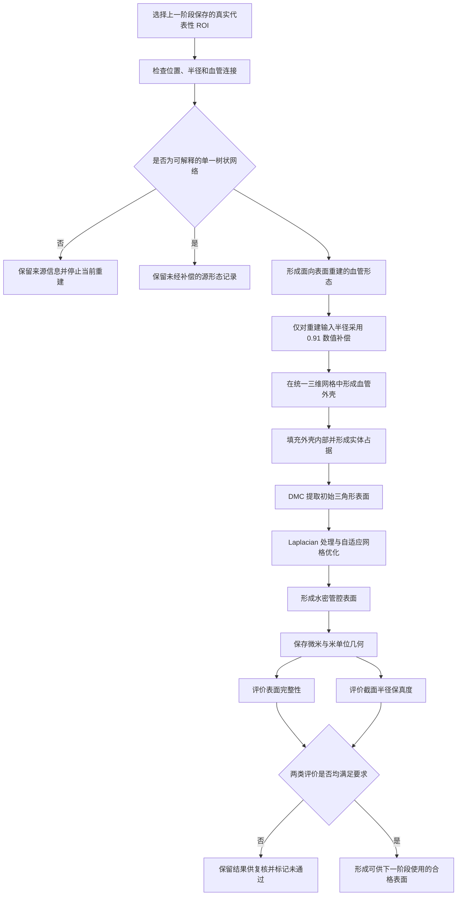

# 4.4 基于 Ultraliser 的小鼠脑血管 ROI 管腔表面重建

上一节获得的代表性感兴趣区域（region of interest，ROI）以血管中心线为主要表达形式。中心线上的每个采样点给出血管在三维空间中的位置及该处半径，采样点之间的连接则描述血管如何延伸和分叉。可以说，中心线回答了“血管沿什么路径生长”和“各处有多粗”，却没有直接回答“血管内腔的边界位于哪里”。计算流体动力学需要在一个具有明确内外之分的三维区域中求解流动，因此仅有中心线还不足以建立后续计算所需的空间边界。

从中心线恢复管腔表面并不是简单地沿每条线段套上一根圆管。血管具有弯曲、管径变化和分叉等结构，若分别生成各分支表面后再进行拼接，连接处可能留下裂缝、重叠面或几何歧义。即使外观上已经连成一体，重建管径若偏离源数据，也会改变截面积，并可能影响后续流阻和流量的计算。因此，本研究同时关注两个问题：所得表面能否构成完整、封闭的管腔边界，以及该边界是否保持了原始中心线所记录的局部尺度。

本研究采用 Ultraliser 的血管形态重建方法，将带半径的中心线先转换为三维体素形态，再从整体形态中提取三角形表面。体素可以理解为划分三维空间的小立方单元，每个单元只需判断其属于血管内部还是外部。由于全部分支在同一个空间中完成这一判断，分叉处不再是若干独立管面的人工接缝，而是同一管腔实体的自然组成部分。由此得到的表面经过网格处理和水密化后，作为后续端口准备、体网格划分和流体计算的几何基础。

本节中的“源半径”是指代表性 ROI 从人工修订 SWC 中继承的半径。源中心线、源半径和连接关系在重建过程中均保持不变。针对当前重建设置表现出的系统性管径偏大，本研究仅对送入表面重建阶段的半径采用 0.91 的数值补偿，并始终以未经补偿的源半径评价最终几何。需要说明的是，本节得到的仍是未经入口、出口切割的封闭管腔表面；裁切边界信息虽然得到保留，但尚未转化为流体计算中的端口面，也未涉及压力、流量、血流求解或微泡运动。

## 4.4.1 建模目标与方法选择

本阶段的目标是在保持 ROI 来源可追溯的前提下，将离散的中心线描述转换为单一、连续且封闭的三角形管腔表面。这里的“单一”并不是指 ROI 中只能包含一条血管，而是指多条相互连接的分支共同构成一个完整的表面对象。对于后续流体区域而言，只有这样的边界才能明确区分管腔内部与外部。

SWC 将血管记录为一系列带半径的空间点，但它并未规定相邻点之间应如何铺设三角形，也没有直接给出分叉处多个管腔共享的边界。如果逐条分支构造表面，就必须额外决定相交部分如何裁剪、哪些重叠面应被删除以及接口如何缝合。这些问题会随分叉角度、分支粗细和采样间距而变化，难以用一套局部拼接规则稳定处理。

体素化方法采用另一种思路。中心线确定血管在空间中的延伸路径，半径确定这条路径周围多大的范围属于管腔；二者共同决定每个空间单元的内外属性。所有分支向同一个三维空间写入占据信息，只要任一分支覆盖某个单元，该位置就被视为管腔内部。完成整体占据判断后，再沿内部与外部的分界提取三角形表面。由此得到的是整个 ROI 的统一外边界，而不是若干分支表面的并列集合。


**图4-X 实际 ROI 中心线、共享空间占据与统一管腔边界。** A 图给出锚点 3274 所在 ROI 的真实中心线和局部半径；B 图展示分别构造分支表面时形成的并列关系；C 图表示全部分支在同一空间中的占据结果；D 图为从整体形态获得的统一三角形表面。C 图用于解释共享占据的几何含义，D 图则直接来自通过验收的正式重建结果。

方法是否适用不能只依赖渲染图判断。完整的几何验收还需确认表面只有一个连通分量，能够封闭空间，并且不存在裂缝所对应的边界边、连接关系含糊的非流形边、彼此穿透的三角形或面积趋近于零的退化三角形。在这些拓扑条件满足以后，还要比较重建截面与源半径。前一类检查回答“表面是否构成合法边界”，后一类检查回答“表面尺度是否可信”，两者缺一不可。

## 4.4.2 整体处理流程

表面重建以已经完成预处理、局部裁切和代表性选择的真实 ROI 为起点。每个 ROI 均保留三维位置、局部半径、血管连接关系以及它在完整血管网络中的来源信息。因而，本阶段不再回到原始灰度图像或分割掩膜，也不重新进行 ROI 选择，而是直接处理上一阶段明确保存的局部血管结构。这样的衔接使表面结果能够追溯到同一个源模型，避免不同阶段对研究对象作出不一致的解释。

进入重建之前，需要确认每个中心线点都有合法位置和正半径，相邻关系能够组成一个连通的局部网络，并且当前输入形式可以无歧义地整理为血管分支。通过检查后，同一份形态信息承担两种不同职责：一份记录保留未经补偿的源位置和源半径，用于追溯；另一份按照重建方法所需的分支形式组织数据，并在其中采用经过验证的临时半径补偿。前者回答“数据原来是什么”，后者服务于“如何生成表面”，二者相互分离。

形态数据进入三维重建后，**中心线及其半径先形成血管的空间外壳**，随后将外壳内部标记为实体。实体化的意义在于明确整个血管树的内部区域，而不仅是在空间中留下薄薄的一层边界。**对偶行进立方体（Dual Marching Cubes，DMC）方法再沿实体与外部空间的交界生成初始三角网格**。初始网格仍保留体素离散带来的局部起伏和较高的三角形密度，因此还需经过邻域平滑、自适应优化和水密性处理，最终形成连续的管腔表面。

重建完成后，同一三角形几何分别以微米和米为单位保存。微米单位便于与 SWC 中心线和源半径直接比较，米单位则与后续采用国际单位制的数值计算相衔接。几何文件形成以后，处理重点由“生成表面”转向“验证表面”：一方面检查整个网格能否构成合法封闭边界，另一方面在多处血管截面测量等效半径。只有两类证据均满足要求，当前 ROI 的表面重建才被认为通过验收。

## 4.4.3 重建前的几何与拓扑条件

三维表面会把输入中心线扩展为具有体积的几何对象，因此某些在点线图中不易察觉的问题，可能在表面阶段被放大。例如，无法对应到实际节点的连接会产生来源不明的血管段，非正半径无法定义局部管径，彼此断开的血管片段也不能形成一个统一管腔。重建前的检查用于在几何扩展之前识别这些问题，而不是等表面生成后再凭外观猜测其来源。

每个 ROI 中的节点需要具有**有限的三维坐标**和**大于零的半径**，每条连接的两端都应指向实际存在的节点。由这些连接形成的局部图还必须是连通的，即从任一节点出发，都能够沿血管路径到达其余节点。设局部图包含 $|V|$ 个节点、$|E|$ 条连接和 $C$ 个连通分量，其独立环路数量可由环路秩表示为

$$
\beta_1=|E|-|V|+C.
$$

当前采用的血管形态输入要求局部网络为一个连通的树状结构，因此需满足 $C=1$ 且 $\beta_1=0$。若输入中存在环路，重建流程不会为了适应当前方法而擅自删除其中一条连接。明确终止虽然不能立即得到表面，却能避免在缺少生物学依据的情况下改变真实拓扑。

中心线记录中的方向还需要与生理血流方向区分。部分 SWC 已经具有明确的父子顺序，可以直接沿用；对于只确定了无向连接关系的局部树，本研究仅从锚点出发建立稳定的记录顺序，使形态能够被连续地写入重建输入。这种整理不移动节点、不改变半径，也不增删连接。由此得到的先后关系只服务于数据组织，不能据此判断入口、出口或真实血流方向。

## 4.4.4 形态转换与半径补偿

表面重建既要适应外部方法的数据组织要求，也要保证科研源数据不被改写。为此，本研究同时保留规范化的 SWC 记录和面向重建的层次化数据格式（Hierarchical Data Format，HDF5，简称 H5）形态记录。规范化 SWC 保存原始三维位置、半径及连接来源，并在重建前后比较文件指纹；内存中的坐标和半径也进行前后核对。H5 记录则把连续中心线整理为从一个关键位置延伸到下一个关键位置的血管段，并描述各血管段在分叉处的连接。相邻血管段可以共同记录同一个分叉端点，这只是为了表达连续连接，并不意味着源 ROI 中新增了节点。

体素化和表面提取会使最终截面相对于输入半径产生一定偏差。锚点 3274 的初始验证表明，**若直接使用源半径，重建截面整体偏大**。为校正这一由重建链路引入的系统性误差，本研究将实际送入重建阶段的半径设为源半径的 0.91 倍。设第 $i$ 个节点的源半径为 $r_i^{\mathrm{src}}$，重建输入半径为 $r_i^{\mathrm{in}}$，则

$$
r_i^{\mathrm{in}}=0.91\,r_i^{\mathrm{src}}.
$$

由于当前形态接口以直径而非半径记录局部尺度，写入重建输入的数值为

$$
d_i^{\mathrm{in}}=2r_i^{\mathrm{in}}
=2\times0.91\,r_i^{\mathrm{src}}.
$$

该比例只作用于临时重建输入，不能解释为真实血管发生了生理收缩，也不表示人工修订 SWC 的半径存在错误。最终几何仍与未经缩放的源半径比较。这样既保留了原始测量的科学含义，又对当前离散重建方法造成的可重复偏差进行了数值校正。

在相同体素分辨率和网格处理条件下，未补偿结果的截面半径中位有符号相对误差为 $+10.1496\%$，第 95 百分位绝对相对误差为 $11.9481\%$。采用 0.91 的输入比例后，两项指标分别降为 $+1.1558\%$ 和 $4.0114\%$。


**图4-X 不同输入半径比例下的分叉表面。** 左图为直接采用源半径的结果，右图为采用 0.91 比例后的结果。比例调整改变了管腔尺度，但未在该分叉处引入新的裂缝或断连。


**图4-X 源半径与重建等效半径的对应关系。** 虚线表示二者完全相等。采用 0.91 比例后，实际测得的重建截面更接近源半径参考线。图中数据均来自能够获得有效截面的真实分支位置，不含为补足数量而生成的人工样本。

## 4.4.5 体素化、表面提取与网格处理

体素化的第一步是建立能够覆盖整个 ROI 的三维规则网格。当前设置在每微米长度上布置 6 个体素，即单个体素边长约为 $0.167\ \mu\mathrm{m}$。若包含局部半径后的血管形态在最长方向上的跨度为 $L_{\max}$，该方向的体素数量近似为

$$
N_{\max}=\left\lfloor 6L_{\max}\right\rfloor.
$$

其余方向采用相同的物理采样密度。这样，不同尺寸的 ROI 都按照一致的空间尺度进行离散，而不是被压缩到相同数量的体素中。

在规则网格内，相邻中心线点由折线连接，每个采样点的局部半径则对应一个球形作用范围。**<span style="background-color: #fff2cc;">折线</span>**描述延伸方向，**<span style="background-color: #fff2cc;">球形范围</span>**描述局部粗细，二者共同形成连续的血管外壳。全部分支同时进入同一个网格后，分叉位置的占据范围自然合并。随后沿三个空间主轴判断外壳内外，将封闭外壳包围的区域填充为实体。此时的结果仍然是一组具有内外标记的小立方单元，还不是最终三角形表面。


DMC 根据相邻体素的内外变化寻找管腔边界，并用三角形近似这一连续界面。初始网格能够恢复整体形态，但其表面会保留体素离散造成的细小台阶，而且三角形数量较多。当前正式流程先进行 10 次拉普拉斯（Laplacian）平滑，使每个顶点参考邻近顶点的位置缓和局部高频起伏；这一阶段主要改变顶点位置，不以减少三角形为目的。随后进行 5 次自适应优化，其中包含 5 次表面平滑，并依据局部几何对过密区域进行整理。最后的水密化处理用于确认表面能够完整包围内部空间。


**图4-X 锚点 3274 ROI 的体素化与网格处理过程。** A、B 图根据真实中心线、重建输入半径和正式体素间距解释带球端折线及壳内填充；C—F 图来自同一次 Ultraliser 重建所保存的真实阶段网格。DMC 初始表面包含 145 172 个三角形；10 次 Laplacian 处理后，三角形数量保持不变；自适应优化及其内部平滑后，网格减少为 47 230 个三角形。最终水密表面与本研究采用的验收表面具有完全一致的文件指纹。

图中可以看到，Laplacian 处理与自适应优化承担不同作用。前者主要缓和顶点层面的局部起伏，后者还会调整网格密度，使较平缓区域不再保留过多三角形，同时维持分叉和弯曲区域所需的几何表达能力。所有阶段均在一次正式重建中按固定设置完成；表面返回后不再由另一套方法重复重建或任意平滑，从而保证最终几何与已验证参数保持一致。

## 4.4.6 表面完整性与半径保真度评价

质量评价分别考察表面完整性和局部尺度。表面完整性关注三角网格能否作为一个明确的管腔边界：只有一个连通分量说明各血管分支没有彼此断开；没有边界边说明表面不存在未封闭的裂口；没有非流形边说明每条边周围的表面连接关系是明确的；没有自相交说明不同表面片没有相互穿透；没有退化三角形则排除了面积接近于零、无法稳定表示局部几何的网格单元。

半径保真度评价以未经补偿的源半径为参照。在每条分支上选择若干位置，用垂直于局部中心线的平面截取重建表面，并从交线中寻找与当前中心线位置对应的闭合截面。分叉融合区的截面并不接近单一圆管，人工裁切端口也会受到封闭端面的影响，因此距离分叉点或裁切端口两个局部直径以内的位置不参与统计。每条分支最多选取 10 个位置，使不同分支均有机会参与评价。

实际血管截面未必是理想圆形。为便于与中心线记录的半径比较，本研究将截面面积换算为具有相同面积的圆半径。设第 $j$ 个有效截面的面积为 $A_j$，其等效半径为

$$
\widehat r_j=\sqrt{\frac{A_j}{\pi}}.
$$

相对于源半径 $r_j^{\mathrm{src}}$ 的有符号相对误差定义为

$$
e_j=\frac{\widehat r_j-r_j^{\mathrm{src}}}{r_j^{\mathrm{src}}}.
$$

当 $e_j>0$ 时，重建截面偏大；当 $e_j<0$ 时，重建截面偏小。有符号误差可以判断偏差方向，绝对误差则反映偏差大小。评价结果汇总中位误差、平均误差、第 95 百分位绝对误差和最大绝对误差。当前验收条件要求第 95 百分位绝对相对误差不超过 5%；若没有获得任何有效截面，则不能据此声称半径得到保持。

在锚点 3274 的真实 ROI 中，40 个计划测量位置均获得了有效截面。最终表面包含 23 617 个顶点和 47 230 个三角形，只有一个连通分量并且能够封闭空间；边界边、非流形边、自相交和退化三角形数量均为 0。半径中位有符号相对误差为 $+1.1558\%$，第 95 百分位绝对相对误差为 $4.0114\%$，低于 5% 的验收限值。该结果表明当前参数在这一 ROI 上同时满足表面完整性和局部尺度要求，但其他 ROI 仍需分别评价，不能由单个案例替代总体检验。

## 4.4.7 结果组织、异常处理与适用范围

重建结果按照“来源记录、几何表面和质量证据”三类内容保存。来源记录用于说明表面来自哪个 ROI、实际读取了哪一份完整 YAML 配置、采用了何种半径补偿以及原始形态在处理前后是否一致；几何结果包括便于与 SWC 比较的微米单位表面、便于三维分析的多边形数据以及供后续国际单位制计算使用的米单位表面；质量证据则记录完整性检查、逐截面半径测量和最终判定。这样的组织方式使一个表面不仅可以被查看，还能够回答它从何而来、经历了什么处理以及为何被接受或拒绝。

异常处理遵循不静默改变研究对象的原则。ROI 不存在、选择结果不唯一、坐标或半径不合法、局部网络不连通或包含当前方法无法表达的环路时，重建不会继续。外部重建未正常完成或没有形成水密表面时，也不会切换到未经验证的备用算法。若表面已经生成但完整性或半径评价未通过，几何和评价结果仍被保留以供复核，但该结果不会被视为合格输入。由此可以避免仅凭“目录中出现了 STL 文件”便将未经验证的几何送入后续计算。

当前表面仍然封闭了 ROI 裁切形成的端部。上一节记录的裁切端口只说明局部血管在何处与盒外结构相连，并不等于已经建立了流体入口和出口。端口开口、边界面识别、入口法向、体网格划分、压力或流量条件设置、血流求解及微泡输运均属于后续工作。因此，本节结论仅限于从中心线获得了通过几何和尺度检查的管腔表面，不能扩展解释为已经完成流体仿真。

---

### 建议插入的流程图

**图题：**

图4-X 小鼠脑血管 ROI 从中心线形态到水密管腔表面的重建与评价流程

**Mermaid：**



### 流程图对应正文

如图4-X所示，管腔表面重建承接上一阶段保存的真实代表性 ROI。位置、半径和连接关系满足要求后，源形态记录与重建输入分别保存，使原始数据追溯和数值重建承担不同职责。0.91 的半径补偿只存在于重建输入中，不改变源 SWC，也不改变后续半径评价所采用的参考值。

带半径的中心线在统一三维网格中形成血管外壳，壳内填充后得到具有明确内部的整体形态。DMC 从内外分界提取初始三角面，随后通过 Laplacian 处理、自适应优化及水密化得到正式表面。微米和米单位几何来自同一组三角形，分别服务于源尺度比较和后续数值计算。

表面生成并不代表流程已经完成。只有当整个网格能够形成合法封闭边界，且局部截面与源半径的偏差不超过规定范围时，结果才进入下一阶段。任一条件未满足时，现有几何仍可用于诊断，但不会被解释为已经通过验收。

---

# 本节小结

本节说明了代表性小鼠脑血管 ROI 从中心线表达转换为三角形管腔表面的研究思路。该过程以真实 ROI 的三维位置、源半径和连接关系为几何依据，通过统一体素域将全部分支组织为一个具有明确内部的血管形态，并从中提取连续表面。与逐分支拼接相比，这一方法把分叉连接转化为整体内外边界的确定问题，从而减少了人工缝合带来的几何歧义。

针对当前重建链路的系统性管径偏大，0.91 的数值补偿仅施加于临时重建输入，源 SWC 和源半径始终保持不变。锚点 3274 的真实 ROI 在表面完整性和半径保真度两方面均满足当前验收条件。所得结果是后续端口处理和体网格划分的几何基础，但尚不包含流体边界条件、血流求解或微泡输运。

---

## 附录：研究结果复现说明（不属于论文正文）

以下内容仅用于复现本节结果，不建议作为学位论文正文直接排版。

### A.1 运行条件与命令

在项目目录 `ulm_3D_vascular` 下运行。当前入口文件为 `swc_stl_model_generate.py`，全部 ROI 选择、表面重建和质量验收参数集中保存在 `configs/swc_stl_model_generate.yaml`。当前验证使用已经保存的代表性 ROI 数据，并复用本地构建的 Ultraliser；Windows 环境需要可调用 WSL2 的 Ubuntu 发行版。

使用当前正式配置时运行：

```powershell
D:\anaconda3\envs\pmp\python.exe swc_stl_model_generate.py configs\swc_stl_model_generate.yaml
```

不写配置路径时，程序也会读取同一默认文件：

```powershell
D:\anaconda3\envs\pmp\python.exe swc_stl_model_generate.py
```

YAML 分为 `paths`、`selection`、`reconstruction`、`ultraliser` 和 `surface_qc`。`paths` 明确指定代表性 ROI 的采样批次、结果目录、Ultraliser 位置和可选可执行文件；相对路径均以项目目录 `ulm_3D_vascular` 为基准。`selection` 中的锚点编号和完整 ROI 标识是两种互斥选择方式，必须且只能填写一种。当前正式配置采用锚点 3274，并明确指定 `outputs/sampling/20260825_133201_radius_plus_structure_k5`，从而避免存在多个历史采样结果时误选批次。

`ultraliser` 保存半径补偿、体素密度、占据方式、实体填充方向、表面提取方法、网格处理次数、线程数和导出要求；`surface_qc` 保存截面采样数、分叉与端口排除距离、半径误差限值，以及水密性、单一连通分量、边界边、非流形边、自相交和退化三角形的验收要求。程序会严格检查字段名称、数据类型和允许取值，未知字段或不合法参数会在正式重建开始前终止，不再通过命令行参数临时覆盖 YAML。

如需重建其他已选代表 ROI，应复制当前 YAML，再只修改 `selection.roi_anchor` 或 `selection.roi_id`；不建议直接改写已经用于正式实验的配置文件。若只想查看入口用法，可运行 `D:\anaconda3\envs\pmp\python.exe swc_stl_model_generate.py --help`。建模开始建立结果目录后，程序会先把本次读取的完整 YAML 复制到 `input/source_swc_stl_model_generate.yaml`，使异常诊断和成功结果都能追溯到原始参数文件。

### A.2 输出目录与内容

每次重建建立独立目录，主要内容如下：

```text
outputs/model_generate/
└── ultraliser_anchor003274_YYYYMMDD_HHMMSS/
    ├── input/       # 完整源 YAML、来源形态、实际重建输入与映射记录
    ├── geometry/    # 微米 STL、微米 VTP 和米单位 STL
    ├── qc/          # 表面完整性、半径保真度与运行汇总
    └── report/      # 供人工复核的结果摘要
```

`input` 目录中的 `source_swc_stl_model_generate.yaml` 是本次运行实际读取的完整源配置；同一目录还保存未经补偿的规范化 SWC、实际使用的 H5 形态、半径对应关系、裁切端口映射和来源信息。`geometry` 目录保存同一管腔表面的不同单位与格式；`qc` 目录保存全表面检查、逐截面半径测量和 `run_summary.json`，其中同时记录源配置路径与解析后的实际 Ultraliser 设置；`report` 目录汇总本次 ROI、重建设置和验收结论。正式几何文件包括 `lumen_surface_um.stl`、`lumen_surface_um.vtp` 和 `lumen_surface_m.stl`。

运行状态 0 表示表面完整性和半径保真度均通过，状态 2 表示几何已经生成但至少一类评价未满足要求，状态 1 表示输入、配置或外部重建执行发生异常。成功完成后，大体积临时体数据、阶段性网格和控制台日志不作为正式研究结果重复保存；若外部重建异常终止，诊断信息将被保留以便定位问题。
