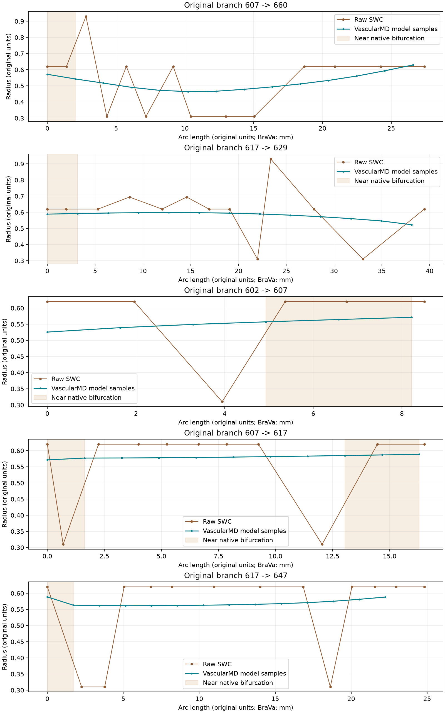

# 基于 VascularMD 的 BraVa 脑血管参数化重建与拓扑约束导出

本文记录最初严格保持原始拓扑的验证。此后已确认允许官方近邻分叉合并，完整 BG001 已成功导出并接入 human 流程；新的方法、结果与适用范围见[后续研究报告](文本记录%20-%20BraVa%20官方分叉合并与半径优化接入.md)。下文严格模式的失败记录保留作为对照。

## 摘要

BraVa 原始中心线中的离散半径变化会在管状显示中形成局部鼓包或骤缩，但这种变化不能仅凭外观判定为错误。本研究性实现采用 Decroocq 等提出的 VascularMD 原生参数化框架，对空间轨迹与半径分别进行带惩罚项的样条建模，并将模型转化为可重新读取的 SWC。实现不引入额外的半径滤波器或生理经验校正。验证表明，两个真实 BraVa 局部血管树能够在保留节点数与拓扑的同时显著降低连续段内的半径跳变；另一方面，完整脑血管样本中存在上游自动合并近邻分叉的情形，与严格拓扑等价约束不相容。对此，系统明确拒绝导出声称拓扑保持的 SWC，并保留诊断信息。结果应理解为正则化参数几何，而非真实解剖口径的恢复。

**关键词：** BraVa；VascularMD；惩罚样条；半径正则化；分叉；SWC

## 1 引言

中心线数据以离散坐标、局部半径和连接关系描述血管。其优势是结构紧凑并便于拓扑编辑，但它并不直接给出连续的血管壁。相邻半径的大幅变化在管面重建中可能表现为竹节状起伏；在缺少原始影像和独立测量时，既不能将全部起伏视为伪影，也不能将原始记录直接视为真实管腔尺寸。

此前采用严格通过原始半径的插值，只能改善样本之间的连接方式，不能消除样本本身的波动。本次工作因此改用 VascularMD 的原生正则化模型，允许拟合值偏离离散观测，同时将分叉拓扑与数值变化分别检验。所有处理输出均为派生文件，原始 SWC 保留不变。

## 2 材料与方法

### 2.1 数据及原生实现

理论依据为用户提供的论文《Modeling and hexahedral meshing of cerebral arterial networks from centerlines》[1]。实现采用官方 `megdec/vascularmd` 仓库提交 `770feb8fbfb591d6d43f966db57b1465010b9a13`[2]，实际阅读并核对了 `README.md`、`main.py` 及 `ArterialTree`、`Spline`、`Model`、`Nfurcation` 的实现。

验证材料包括官方 ICA 示例、五点半径突变序列、人工二分叉以及 BraVa 样本 `BG001.CNG.swc`、`BH0013.CNG.swc`。此外，从此前已选定的 BG001 ROI 提取锚点 8、155、647 对应的原始节点子树。局部子树保留坐标、半径、类型和原编号，只把裁剪后的唯一根节点父编号设为 −1，不加入人工裁剪端口或插值点。因此这些局部结果不能冒充完整脑血管文件的成功处理。

SWC 第六列始终作为半径读取，没有进行半径与直径的换算，也没有自动改变数值单位。本次 BraVa 数据按其原有毫米数值使用。输入须满足单根、有向无环、父节点存在、数值有限及半径为正等条件。

### 2.2 参数化建模

每个输入通过原生 `ArterialTree` 读取，并调用一次 `model_network(radius_model=True, criterion="AIC")`。空间坐标与半径分别由原生 `Model` 求解，平滑参数通过上游 AIC 目标函数及其搜索程序确定。没有自行编写样条基函数、惩罚项、AIC，也没有使用均值、Gaussian 或其他替代滤波。

分叉重建使用原生 `Nfurcation`。这里“不跨分叉普通平滑”指不把母血管与多个子血管串接后施加额外半径滤波；并不否定上游分叉建模本身联合使用母段与一个子段观测的设计。母、子血管半径没有人为取平均，也没有施加单调变细、Murray 定律或所谓正常半径范围。

默认保留官方自动重采样行为，同时记录重采样前后节点数。此预处理不等于最终输出密度：最终默认按每个原始拓扑段的点数重新采样。另一模式按原生弧长映射采样，所用的是 `length_to_time()`，不是对参数值等距取点。

### 2.3 SWC 表达与拓扑保护

上游 `model_to_full()` 与 `write_swc()` 不能直接满足本任务。前者直接使用默认样条点集，不能控制原始段点数；分叉轨迹包含零半径占位，分叉中心仅有三维坐标。后者会将节点 TYPE 简化为根节点 1、其余节点 3。因此新增的代码限于导出、数据关联和质量检查。

普通段直接读取原生样条的坐标与半径。分叉内部的空间坐标来自原生轨迹样条，半径则通过位置到对应原生形状样条的投影读取。SWC 的一个共享分叉节点只能存储一个半径，不能无损描述非圆形的三维分叉。本实现采用入口形状样条的代表半径，不平均各分支半径；各子段继续使用各自模型值。该约定在每份 QC 中明确记录，完整分叉形状应以官方 VTK 表面检查。

原始拓扑与模型拓扑通过带原始末端标识的有根结构签名比较，仅忽略普通度为 2 的采样节点。由此能够识别“末端数未变、分叉连接已改变”的情况。只有原始段连接均可对应时才生成最终 SWC，分叉共享一个节点，编号连续且父节点先于子节点。写出后重新读取，验证连接、坐标、半径及 TYPE。

### 2.4 表面与评价指标

表面由官方 `compute_cross_sections()` 和 `mesh_surface()` 生成，默认使用论文人脑实验中的圆周节点数 24、纵向比例 0.2。没有添加额外表面滤波；上游分叉网格自带的松弛与回投影过程予以保留。

连续段半径跳变采用无量纲指标

\[
J_i=\left|\log\frac{r_{i+1}}{r_i}\right|,
\qquad
R_i=\frac{|r_{i+1}-r_i|}{(r_{i+1}+r_i)/2}.
\]

统计时排除触及共享分叉节点的点对，分别报告样本数、中位数、P90、P95、P99 与最大值。同时记录半径范围、中心线长度以及拓扑数量。诊断曲线只比较原始数据和 VascularMD 输出，没有第三条自行滤波的曲线。指标只用于描述，不触发阈值删点、截断或再滤波。

## 3 结果

### 3.1 可保持拓扑的数据

下表为相邻半径对数跳变结果。ROI 两例使用 `original-count` 模式，比较前后每段点数保持一致。

| 数据 | 原始/输出节点数 | 有效比较点对 | 原始 P95 | 输出 P95 | 原始最大值 | 输出最大值 |
| --- | ---: | ---: | ---: | ---: | ---: | ---: |
| 官方 ICA 示例 | 96 / 96 | 89 | 0.128559 | 0.066607 | 0.223994 | 0.149377 |
| 五点突变序列 | 5 / 5 | 4 | 0.650283 | 0.244526 | 0.653926 | 0.246097 |
| BG001 ROI 155 | 42 / 42 | 38 | 0.693147 | 0.097676 | 0.693147 | 0.127661 |
| BG001 ROI 647 | 54 / 54 | 47 | 0.693147 | 0.051416 | 1.098612 | 0.058673 |

ROI 155 和 ROI 647 的 P95 分别下降约 85.9% 和 92.6%。它们分别保持 1 个分叉、2 个末端，以及 2 个分叉、3 个末端。ROI 155 的官方预处理将节点数由 42 调整为 36，随后从连续模型按原始段点数采样，输出恢复为 42；这两个过程在报告中分别记录，没有隐藏预处理变化。

五点试验使用半径序列 1.2、1.25、0.65、1.22、1.18。原生预处理将其变为 17 个建模样本，但输出仍为 5 个点。其最大跳变减少约 62.4%，对应测试同时验证空间和半径的两个原生 AIC 平滑参数均被实际求解。

人工二分叉具有不同的母、子段半径。输出保留一个共享二分叉和两个末端，并保留不同的子段类型与口径；没有将三个分支强行平均为同一半径。该试验用于检验分叉差异保留，不要求原本恒定的每个局部段在重建后都保持零跳变。

官方 ICA 示例以及上述成功 ROI 均生成了可由 PyVista 重新读取的 VTK 表面。ROI 155 表面含 12,707 个点、12,672 个面；ROI 647 表面含 24,094 个点、24,048 个面。表面的入出口保持开放，这些表面尚不构成完成体网格质量检查的 CFD 模型。

图 1. ROI 647 各原始拓扑段的半径曲线。横轴分别采用原始折线与模型的弧长，因此曲线端部的长度差异包含空间轨迹重建的影响。阴影标识原生分叉附近区域，不能据此把该处差异自动判定为错误。

### 3.2 必须人工复核的数据

| 数据 | 原始/原生模型分叉数 | 原始/原生模型末端数 | 处理结论 |
| --- | ---: | ---: | --- |
| BG001 完整样本 | 98 / 96 | 99 / 99 | 不导出拓扑保持 SWC；保留原生诊断表面 |
| BH0013 完整样本 | 68 / 64 | 69 / 69 | 原生模型改变拓扑，拒绝 SWC 导出 |
| BG001 ROI 8 | 10 / 7 | 11 / 11 | 不导出 SWC；保留原生诊断表面 |

BG001 中，原始节点 8、10、12 附近的三个近邻二分叉被原生算法合并为一个四分叉。这说明仅检查末端数量不足以证明拓扑保持。原生模型仍可以构造表面，但它不满足本任务对原始分叉结构的严格要求。

自动报告中的受影响节点包含连接变化的祖先，不能全部理解为“发生错误的血管”。BG001 的结构签名变化涉及原始节点 1、8、10、12；BH0013 涉及 1、6、56、130、134、276、279、282、335、376、413；ROI 8 涉及 5、8、10、12、63、72、111、489。具体错误阶段、原生节点或边、完成建模的边清单均写入相应 QC。

成功样本的说明性 warning 包括两项：单半径 SWC 对非圆形分叉的表达约定，以及 SWC 父子方向不等同于独立测量的真实血流方向。拓扑变化样本另有“表面仅用于诊断、需要人工复核”的明确提示。本次通过的样本没有偷偷替换算法或删除失败分支。

### 3.3 实现验证

共 43 项测试通过，覆盖官方示例、原生 AIC 双模型调用、五点突变、人工二分叉、弧长采样、输入单位保留、SWC 读写往返、非法输入、失败后批处理继续、拓扑改变拦截，以及现有 BraVa 输入和 ROI 可视化回归。Python 环境依赖检查通过。原始 BG001 文件、现有 ROI 渲染模块及人脑配置的 SHA-256 均与本次工作前一致。

第三方源代码只修改包内导入和 PyVista 关键字参数兼容性，没有改变建模数学。已保留固定提交、补丁和核心源码摘要；CLI、采样适配、SWC 写出和 QC 均为独立新增模块。

## 4 讨论

结果证明，严格通过离散半径的插值与允许观测残差的正则化建模解决的是不同问题。前者保留原始波动，后者在原生模型与数据一致性之间取得折中。在本次两个局部样本中，段内高频变化明显减小，但这种减小不构成解剖真值验证，也不能证明所有被削弱的变化都是伪影。

另一方面，“完全沿用官方分叉重建”与“对所有输入都严格保持原始分叉拓扑”并非天然兼容。上游会将相邻分叉合并为更高阶分叉；若通过修改核心模型强行阻止这一行为，就超出了本任务允许的最小兼容修改范围。本实现选择明确报告这一约束冲突，保留可复核的原生模型表面，并拒绝将改变后的结构包装成合法的拓扑保持 SWC。

后续若需处理这些完整脑血管样本，应首先在原始影像和原生编辑工具中复核近邻分叉位置及连接，而不能用另一套半径滤波掩盖问题。成功 SWC 也仍需要针对具体用途检查血管壁、入口出口、网格质量及边界条件；本工作没有进行 CFD 计算或宣称其结果为真实解剖口径。

## 5 结论

已建立可直接运行的 VascularMD 原生建模、弧长采样、SWC 导出和诊断流程。可对应原始拓扑的样本能够获得半径变化更连续且合法的 SWC 与官方表面；不满足拓扑约束的样本被明确识别，原始文件不受修改。这种区分使成功结果与需要人工复核的情况都具备可追溯依据。

## 参考文献与数据记录

[1] Decroocq M, Frindel C, Rougé P, et al. Modeling and hexahedral meshing of cerebral arterial networks from centerlines[J]. Medical Image Analysis, 2023, 89: 102912. DOI: [10.1016/j.media.2023.102912](https://doi.org/10.1016/j.media.2023.102912).

[2] Decroocq M. VascularMD[CP/OL]. [官方仓库](https://github.com/megdec/vascularmd)，本次固定提交 `770feb8fbfb591d6d43f966db57b1465010b9a13`。

运行方法见 [使用说明](../vascular_processing/README.md)。本次主要数据记录：

- [官方示例 QC](../outputs/vascularmd_validation/example_first/example_centerline_ICA_vmd_qc.json)
- [五点序列 QC](../outputs/vascularmd_validation/spike/vascularmd_spike_vmd_qc.json)
- [人工二分叉 QC](../outputs/vascularmd_validation/bifurcation/vascularmd_bifurcation_vmd_qc.json)
- [ROI 155 QC](../outputs/vascularmd_validation/brava_rois/BG001_anchor000155_vmd_qc.json) 与 [VTK](../outputs/vascularmd_validation/brava_rois/BG001_anchor000155_vmd_surface.vtk)
- [ROI 647 QC](../outputs/vascularmd_validation/brava_rois/BG001_anchor000647_vmd_qc.json) 与 [VTK](../outputs/vascularmd_validation/brava_rois/BG001_anchor000647_vmd_surface.vtk)
- [ROI 8 人工复核记录](../outputs/vascularmd_validation/brava_rois/BG001_anchor000008_vmd_qc.json)
- [BG001 完整样本人工复核记录](../outputs/vascularmd_validation/BG001_review/BG001.CNG_vmd_qc.json)
- [BH0013 完整样本人工复核记录](../outputs/vascularmd_validation/BH0013/BH0013.CNG_vmd_qc.json)
