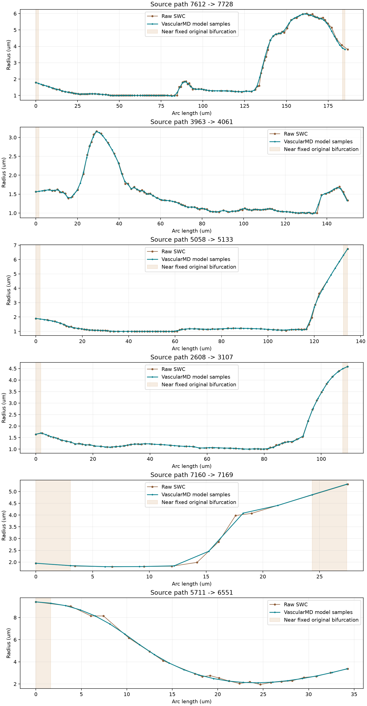

# 小鼠脑血管 SWC 的 VascularMD 逐分支 AIC 拟合与半径变化评价

## 摘要

针对小鼠脑血管 SWC 在 ROI 显示中出现的局部半径突变，以及此前整网分叉重建无法完成的问题，本研究采用 VascularMD 官方逐分支惩罚样条，通过赤池信息准则（AIC）分别选择中心线和半径的平滑强度。分析对象为默认小鼠样本中的主连通网络，包含 7 419 个节点和 242 条分支；原始共享分叉、根及末端的位置与半径固定，原始数据另行完整备份。结果表明，全部分支完成拟合，120 个分叉、122 个末端及全部父子连接得以保留。计入分叉邻接点时，相邻半径对数变化的第 95 百分位由 0.092880 降至 0.079974，下降 13.90%；最大值下降 18.06%。分支内部总体指标有所改善，但部分局部跳变仍增大，表明该方法不能保证每处半径变化均减弱。派生数据已接入原 mouse 流程，生成 14 个有效 ROI 和 7 个代表区域，ROI 验收通过；全局检查保留一项涉及 2 个节点的原掩膜配准提示。该结果支持在保持网络连接的条件下改善总体半径变化，同时保留对局部结构及影像一致性的复核依据。

**关键词：** 小鼠脑血管；SWC；VascularMD；AIC；半径正则化；感兴趣区域

## 1 引言

SWC 以离散节点描述血管位置、半径和父子连接。节点间半径变化较大时，按照数据绘制的管面会呈现突然变粗或变细的外观。显示插值可以使节点之间的表面连续，却不能改变节点本身记录的半径。因此，评价这一现象需要区分显示效果和输入数据的变化。

VascularMD 将空间轨迹和半径分别拟合，再组合为连续血管描述[1]。此前对本小鼠样本进行整网 Nfurcation 重建时，原始节点 5707 附近无法找到有效分叉顶点；允许近邻分叉合并以及改变自动重采样条件均未解决该局部问题。经用户确认，本次采用官方逐分支 AIC 拟合，保留原有分叉连接。此前失败记录继续保留，以区分两种方法的实验结果[2]。

## 2 材料与方法

### 2.1 数据与研究范围

研究对象为 `fMOST_0_5_6_0_0_6_0001_02_01.swc`。原文件含 9 828 个节点和 43 个连通分量。沿用既有 mouse 分析规则，选择物理中心线总长度最大的分量：原始根编号为 2410，包含 7 419 个节点、7 418 条连接、120 个分叉、122 个末端和 242 条拓扑分支。其余 42 个分量共 2 409 个节点作为参考数据完整保留，未参与本次拟合。

原始 XYZ 使用体素坐标，三个方向的体素间距分别为 1、1、2 μm，半径字段已经以微米解释。建模前仅将 XYZ 乘以对应间距，使位置和半径共同使用微米；导出时仅将 XYZ 除以原间距。半径没有重复换算，也没有被当作直径处理。

### 2.2 官方逐分支 AIC 拟合

以原始根、分叉和末端为分支边界，逐条调用固定版本 VascularMD 的 `Spline.approximation`。官方方法先拟合空间坐标，再在其参数化基础上拟合半径；AIC 分别决定两个模型的平滑参数，避免人为指定一个统一强度。这里的平滑是对数据的近似，内部拟合值可以偏离原始观测值，并非要求曲线经过所有原始半径。

全部分支端点的位置和半径作为固定约束。不同分支共享同一个原始分叉节点，因而不会因为独立拟合而产生连接断开或多个分叉半径。端点切向没有额外固定，故保证的是共同端点处的位置和半径一致，不保证所有相连分支的切向或半径导数一致。本次没有执行 Nfurcation 分叉表面重建，也没有删除或合并分叉。

拟合前沿用官方自动重采样，主网络的拟合准备节点由 7 419 个变为 6 596 个；短分支按照官方血管拟合规则补足至 6 个拟合点。完成后沿各分支模型弧长采样，恢复该分支原有节点数量，最终仍为 7 419 个节点。每个内部输出节点表示相应分支上的模型样本，不能把其序号对应关系解释为原空间位置完全不变。

使用的官方提交为 `770feb8fbfb591d6d43f966db57b1465010b9a13`。控制点数量沿用该提交的默认误差选择方法；AIC 用于选择平滑参数，没有启用另一项同名相关的控制点数量选项。空间距离参数 6 在上游内部乘以平均半径，是无量纲倍数。当前物理单位下的自动重采样密度为 0.4～0.6 点/μm；这些数值是本次实际采用的计算条件，尚不代表经过小鼠影像标定的最优参数。没有增加移动平均、其他半径滤波或半径截断。

### 2.3 原始数据保护与后续分析

拟合前将完整原始 SWC 和配置复制为独立文件，以 SHA-256 校验其逐字节一致性；原始目录中的文件也继续保留。派生 SWC 位于独立目录，其中参考分量的编号、类型、位置、半径和父子关系均与原值一致。建模分量重新分配编号，并记录原始编号到派生编号的映射，避免与参考分量冲突。原图像和掩膜通过符号链接复用，未重新生成。

mouse 默认配置仅改变输入和输出目录，样本选择、ROI 尺寸、聚类参数和显示参数保持不变。原 mouse 与 human 入口脚本、双视窗显示模块、ROI 管面模块的文件摘要均保持本次修改前的值；human 左视窗此前设置的 Y 轴竖直方向继续保留。ROI 中现有节点的位置和半径直接来自派生 SWC，裁切边界沿用既有插值规则。

### 2.4 评价指标

使用相邻半径的绝对对数变化衡量离散跳变：

\[
J_i=\left|\log\frac{r_{i+1}}{r_i}\right|.
\]

该指标为无量纲数，越大表示相邻半径比例变化越明显。分别报告全部连接，以及排除触及共享分叉节点的分支内部连接，避免仅用一种统计范围掩盖局部问题。另报告单位物理长度的对数半径变化，以减轻节点间距变化对解释的影响。节点数保持不变，但弧长重采样改变了内部位置，因此统计下降不等同于真实解剖误差下降。

完整性评价包括：父子连接、节点类型、全部 243 个分支边界节点的精确位置和半径、参考分量、备份摘要，以及优化数据向全局分析和 ROI 几何的传递。原掩膜仅用于显示和配准检查，不参与删点或连接修补。

## 3 结果

### 3.1 处理完成情况与结构保持

242 条分支全部完成官方拟合，建模及原生导出记录耗时约 157.43 s。分析网络仍包含 7 419 个节点、120 个分叉和 122 个末端；7 418 条父子连接经编号映射后逐条一致。243 个根、分叉及末端节点的位置和半径精确保留。其他 42 个参考分量的 2 409 个节点逐项保持原值，完整文件仍为 9 828 个节点、43 个连通分量。原始 SWC、图像和掩膜的文件摘要未改变，独立备份校验通过。

### 3.2 半径变化及局部局限

表 1 汇总处理前后结果。P95 表示第 95 百分位；分支内部统计包含 7 060 个相邻点对，全部连接统计包含 7 418 个点对。

| 指标 | 原始 SWC | 逐分支 AIC 后 | 变化 |
| --- | ---: | ---: | ---: |
| 全部连接的半径对数变化 P95 | 0.092880 | 0.079974 | 下降 13.90% |
| 全部连接的半径对数变化最大值 | 0.619230 | 0.507414 | 下降 18.06% |
| 分支内部半径对数变化 P95 | 0.087803 | 0.078865 | 下降 10.18% |
| 分支内部半径对数变化最大值 | 0.419237 | 0.507414 | 增加 21.03% |
| 分支内部单位长度对数变化 P95（μm⁻¹） | 0.056678 | 0.048085 | 下降 15.16% |
| 最小半径（μm） | 1.000000 | 0.808418 | 原生拟合结果，未截断 |
| 半径中位数（μm） | 2.946600 | 3.032489 | 随拟合及采样改变 |
| 最大半径（μm） | 9.820900 | 9.820900 | 保持 |
| 中心线总长度（μm） | 12 013.421 | 11 969.830 | 下降 0.36% |

具有可评价内部点对的 230 条分支中，176 条的最大内部跳变减小。其余 12 条分支在排除共享分叉邻接点对后没有内部点对，未将其计作“改善”。整体指标下降与局部最大值增加可以同时发生：优化后最大的单次变化出现在对应原始分支序号节点 7165—7166 的两个模型样本之间，半径约为 2.457670 μm 和 4.082165 μm。该例说明，使用官方 AIC 并不能保证每个离散相邻点对都更平缓。

部分模型半径低于原始最小值，但本次所有导出半径及官方模型的密集评价样本均为正数。由于未施加原始极值范围约束，这种结果属于近似拟合可以产生的偏离，不能直接解释为真实血管变细。原始与拟合半径曲线见图 1，各自使用对应曲线的弧长，不虚构逐点空间对应关系。

图 1　棕色表示原始 SWC，蓝绿色表示官方模型采样值；阴影标记固定原始分叉附近。图中分支按原始最大内部跳变选取，不代表所有分支，也不用于替代全网络统计。

### 3.3 ROI 生成与原掩膜配准

采用原有 ROI 参数，生成 14 个有效候选区域，选取 7 个代表区域。候选区域均连通，均能追溯到全局网络，裁切边界语义检查通过。独立核对了全部分析节点及 ROI 中 2 873 次原节点出现的位置与半径，结果与派生 SWC 一致，未在显示阶段另行修改半径。图结构与 ROI 验收均为 PASS。

全局验收为 WARNING，原因限定于原 Mask 的配准检查：9 828 个节点中有 2 个节点按最近整数体素定位后未落在原掩膜前景，节点支持率为 99.97965%，密集边采样支持率为 99.97606%。这两个派生节点为 11323 和 11324，体素位置分别约为（99.226164，16.878274，132.500140）和（99.631189，15.529467，132.501871）。它们均位于图像范围内，但 Z 坐标取整为 133 后对应掩膜背景。该现象与连续拟合轨迹和离散掩膜的局部不一致相符，仍需结合原影像解释；本次没有移动节点或改写掩膜来消除提示。

65 项相关自动测试通过，其中 9 项检验小鼠适配及逐分支处理，56 项覆盖既有 VascularMD、SWC 导出、人脑输入、配置和显示回归。测试通过表明实现及检查符合预期，并不替代影像层面的解剖真实性评价。

## 4 讨论

本次结果表明，官方逐分支 AIC 可以在不改变原始连接的前提下完成当前小鼠主网络处理，并降低总体半径变化的高分位水平。与此前整网失败相比，关键改变是保留原始分叉端点，将连续拟合限制在各原始分支内；处理成功不意味着原来的 Nfurcation 分叉重建问题已经解决。

固定端点有助于保持连接和原始末端，但也保留了端点自身可能存在的半径差异。较短分支若连接粗细差异明显的两个端点，可用于过渡的距离仍然有限。AIC 平衡观测拟合与平滑度，其目标并不是将所有相邻半径变化压到同一阈值，也不是保证每条血管单调变细。因此，显示中仍可能出现局部收缩或扩张；应结合原始备份、半径曲线和影像，而不能仅凭外观判定其生理合理性。

本次同时拟合中心线和半径，出现少量原掩膜支持不足的节点说明二者的一致性需要独立评价。当前结论适用于选定样本及主连通分量，不能推及全部小鼠数据，也不能据此声称已经获得适用于血流求解的完整分叉体网格。

## 5 结论

已完成当前小鼠主网络的官方逐分支 AIC 拟合、原始数据独立备份和默认输入切换。原网络连接、分叉、末端及参考分量完整保留，既有显示方式继续使用优化 SWC。整体半径跳变高分位有所下降，ROI 流程正常完成；局部跳变增加和两个节点的原掩膜配准提示均保留在评价结果中，供后续影像核查。

## 参考文献与研究资料

[1] DECROOCQ M, FRINDEL C, ROUGÉ P, et al. Modeling and hexahedral meshing of cerebral arterial networks from centerlines[J]. Medical Image Analysis, 2023, 89: 102912. DOI: 10.1016/j.media.2023.102912。本研究核对项目提供的[论文原文](<../vessel_model/T - Brava/Modeling and hexahedral meshing of cerebral arterial networks from centerlines.pdf>)第 4.1 节及对应固定提交源码。

[2] [小鼠脑血管 SWC 的物理尺度适配及分叉兼容性验证](文本记录%20-%20小鼠%20VascularMD%20适配与分叉兼容性验证.md)。该记录说明此前整网失败条件，与本次逐分支结果共同构成方法变更依据。

本次派生数据及处理参数见[处理清单](<../vessel_model/T - A high-resolution dataset of mouse brain vasculature_vmd_branch_aic/vascularmd_mouse_manifest.json>)，独立备份保存在同一派生目录的 [backups](<../vessel_model/T - A high-resolution dataset of mouse brain vasculature_vmd_branch_aic/backups>) 中。[模型指标复核](../outputs/mouse_vmd_branch_aic/verification/independent_model_checks.json)和[完整性及 ROI 复核](../outputs/mouse_vmd_branch_aic/verification/verification_summary.json)提供可追溯数值；[双视窗预览](../outputs/mouse_vmd_branch_aic/sampling/20260924_010320_radius_plus_structure_k5/figures/interactive_sampling_layer_preview.png)展示实际接入结果。默认与原始对照配置分别为 `configs/swc_roi_generate.yaml` 和 `configs/swc_roi_generate_mouse_raw.yaml`。
