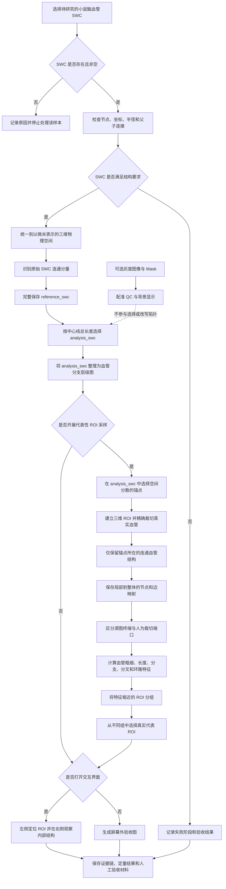

# 4.3 小鼠脑血管模型预处理、层级表征与交互式局部采样

可以将完整的小鼠脑血管数据理解为一张具有真实空间尺度的三维血管地图。在本数据集中，经过人工修订的 SWC 中心线已经记录血管的位置、局部半径和父子连接关系，因此它是局部模型选择与后续网络分析的主要可信输入；三维灰度图像和分割掩膜只提供可选的成像背景、空间配准检查与显示依据。

本研究先验证 SWC 的节点、坐标、半径和父子关系，再识别其中原本存在的连通分量，并按预先规定的规则选择一个不经改写的分析网络。完整 SWC 始终作为参考对象保留，其他分量既不被删除，也不被称为噪声。在此基础上，从所选分析网络中裁切大量真实局部区域，并依据血管尺度和网络结构选择代表性样本。最终得到的不是人工生成或重新拼接的血管，而是一套能够追溯到原始 SWC 的真实局部血管模型库。

本节涉及三个需要预先说明的概念。分割掩膜（segmentation mask）是标记每个体素是否属于血管的三维二值或标签数据；SWC 中心线是用一系列三维点、局部半径和父节点关系描述血管骨架的数据格式；感兴趣区域（region of interest，ROI）是从当前分析网络中截取的局部三维区域。SWC 是正式建图、ROI 和统计流程的数据来源；Mask 与原始灰度图像即使缺失也不阻断 SWC 分析，只会使相应背景显示不可用。

当前系统中的方向信息来自 SWC 的父子关系，只表示数据记录中的结构组织顺序，不等于真实生理血流方向。根节点和叶节点也只能理解为结构意义上的候选端点。当前阶段**不识别生理入口或出口**，不推断动静脉类型，也不计算压力、流量、速度场、计算流体动力学结果或微泡运动轨迹。预处理和采样所得信息仅为后续血流建模、微泡输运（microbubble transport）及超声定位显微成像（ultrasound localization microscopy，ULM）仿真提供几何、拓扑和边界描述基础。

**概念性总流程说明。** 系统首先读取并验证人工修订 SWC，在不新增节点、不新增边且不改变父子关系的前提下，识别原始连通分量；完整结果保存为 `reference_swc`，其中中心线总长度最大的原始分量默认保存为 `analysis_swc`。原始图像和 Mask 若存在，则从旁路完成配准检查与背景显示，不参与分量选择。系统随后把 `analysis_swc` 的连续中心线点整理为血管分支网络，再从该网络的不同位置截取真实局部区域，描述各区域中血管的粗细、总长度、分支数量和分叉复杂程度，并把特征相近的区域归为一组。每组最终选择少量真实样本，形成可追溯的局部血管模型库。当前阶段只完成模型准备与选择，不计算真实血流或微泡运动。

## 4.3.1 整体处理流程

**本步骤的目的，是先找到可独立进入分析的人工修订 SWC；若同名灰度图像或分割掩膜存在，再确认它们描述同一样本、同一空间位置和同一物理尺度下的血管。**

正式分析可以只读取 SWC，因为当前建图、ROI 裁切、半径统计和代表性采样所需的位置、尺度及图连接关系均已由 SWC 提供。三维灰度图像能够补充原始成像背景，分割掩膜能够用于检查中心线是否落在分割血管范围内，但二者都不提供覆盖或改写人工修订父子关系的权限。它们存在时需要核对样本身份、坐标顺序和空间分辨率；它们缺失时，程序记录可选辅助数据不可用并继续 SWC 主流程。

系统先根据共同的文件标识建立 SWC 与同名辅助 TIFF 的对应关系。只有 SWC 缺失、为空或结构无法解析时，样本才不能进入正式分析；缺少灰度图像只会关闭体数据显示，缺少 Mask 只会跳过配准 QC。用户可以按数据分组、样本标识、父级数据组或训练—验证—测试划分选择处理对象。默认运行从分析数据中选择一个样本，以控制交互显示所需的计算量；批量任务则可以增加样本数量。

对于满足输入条件的样本，处理过程依次完成数据读取与检查、物理尺度统一、完整参考 SWC 保存、分析分量选择、层级血管图构建、真实连通 ROI 采样、特征计算、聚类、代表性样本选择和结果可视化。每一阶段的输出均成为下一阶段的明确输入。例如，建图、局部裁切和统计分析只读取明确保存的 `analysis_swc`，同时保留完整 `reference_swc` 供追溯，从而避免不同阶段混用不同数据对象。

该流程可以完整执行，也可以拆分为数据编目、预处理和层级建图三个阶段。分阶段运行时，后续阶段读取前一阶段已经保存的规范化数据及清单，不重新解释原始文件。这样既能复用耗时处理结果，也能分别检查数据问题究竟发生在输入组织、预处理还是图构建阶段。

## 4.3.2 输入数据检查与物理尺度统一

**本步骤的目的，是把计算机数组中的位置正确转换为真实三维空间中的位置，避免血管模型发生轴向交换或尺度变形。**

多页 TIFF 图像在计算机内按照 $(z,y,x)$ 顺序排列，而三维几何通常按照 $(x,y,z)$ 表达。二者是对同一空间的不同存储约定，并不能直接混用。如果把 TIFF 的 $(z,y,x)$ 顺序当作物理坐标使用，血管模型会发生轴向交换；如果忽略 $z$ 方向 $2\ \mu\mathrm{m}$ 的体素间距，模型还会在该方向被错误压缩或拉伸。因此，系统在预处理清单中同时记录数组轴顺序和几何轴顺序，并依据三轴体素间距将 SWC 坐标转换为以微米表示的物理坐标。

默认图像块尺寸为 $192\times192\times192$，体素间距为

$$
(s_x,s_y,s_z)=(1,1,2)\ \mu\mathrm{m}.
$$

设某中心线点的体素坐标为 $(x_v,y_v,z_v)$，其物理坐标由各轴分别乘以对应间距得到。此后，整体模型边界、ROI 尺寸、中心线长度、锚点间距和箭头位置均在该物理坐标系中计算。整体视图和局部视图的坐标轴也统一以微米为单位，使图中比例能够反映模型的实际尺度。

尺度转换之前，系统首先检查 SWC 记录是否具有合法结构，内容包括节点编号是否为整数、节点是否重复、父节点是否存在、节点是否指向自身、父子关系中是否存在有向环，以及坐标是否为有限数值。若辅助 TIFF 存在，程序还检查图像与 Mask 形状是否一致、体数据尺寸是否符合预期，以及 SWC 节点是否超出体数据范围；没有辅助 TIFF 时，这些体素级检查明确记为不适用，而不会把样本判为失败。

SWC 文件中记录的节点半径作为原始数据完整保留，任何用于改善三维显示效果的处理都不会覆盖这些数值。若半径为零、负数或非有限值，系统会在数据验证结果中进行标记；仅在生成平滑中心线或三维管状模型时，才临时采用插值或中位数进行替代。这样可以明确区分原始半径与显示用半径，既保证可视化正常，也便于后续研究追溯和复核源数据。

## 4.3.3 主血管网络的连通性预处理

**鉴于数据集中的中心线、连接拓扑和局部半径已经过人机协同标注与人工修订，本研究将 SWC 作为三维血管网络的主要分析表示。** SWC 节点同时包含三维坐标、半径和父节点编号，已经能够直接支持分支建图、ROI 裁切、半径统计和后续一维血流计算。分割掩膜和原始灰度图像不再参与血管拓扑清理，只用于空间配准检查和可视化背景。

为了避免把“原始参考数据”和“当前实验实际使用的数据”混为一谈，程序明确保存两个 SWC 对象。`reference_swc` 是完整的人工修订 SWC，包含源文件中的全部连通分量，始终保留且不会被 Mask 改写；`analysis_swc` 是当前单网络层级建图和 ROI 采样所使用的一个原始连通分量。后者是前者的可追溯子集，不包含新生成节点、新生成边或重新解释的父子关系。

预处理首先验证 SWC 节点编号、父节点引用、根节点、重复编号、自连接、有向环、三维坐标、体数据边界和半径记录。随后按照 SWC 文件中明确记录的 `parent_id` 关系建立图，在忽略箭头方向的情况下识别弱连通分量。每个分量分别统计节点数、边数、物理中心线总长度和三维包围盒跨度。由于当前交互界面、层级图和后续一维网络处理要求一个单根分析网络，默认规则选择物理中心线总长度最大的原始分量；也可以通过 `--analysis-component-id` 明确指定其他原始分量。

这一选择只定义当前研究的分析范围，不判断其余分量是否错误。未进入 `analysis_swc` 的分量统一标记为 `REFERENCE_ONLY`，仍完整保存在 `reference_swc`、分量审计表和节点编号清单中。程序不会把这些分量称为“孤岛噪声”，不会根据 Mask 删除它们，也不会因 Mask 体素接触而在它们之间自动补边。

下面的六联三维图由真实样本 `raw-analysis__fMOST_0_5_6_0_0_6_0001_02_01` 的原始 Mask、完整参考 SWC 和实际保存的 `analysis_swc` 生成。A 展示包含全部 43 个分量的 `reference_swc`；B 用不同颜色显示依据原始父子边识别出的分量；C 将选中的分析分量与仍保留在参考对象中的其他分量并列显示；D 单独显示进入建图的 `analysis_swc`，并明确新增节点和边均为 0；E 将完整 SWC 叠加到未经清理的 Mask 上进行空间配准 QC；F 展示最终的数据职责分离，即 SWC 用于 Graph/ROI，Mask 只作为淡色显示背景。图中三轴均为真实物理坐标，单位为微米。

**SWC 中心化连通性预处理的真实三维过程。** 图中没有 Mask 孤岛删除、Mask 骨架桥接或自动拓扑修复；青色分析网络的每一个节点和父子边均来自原始 SWC。

下图进一步给出选择依据和可追溯性证据。A 按中心线总长度排列全部 SWC 分量；B 将总长度、节点数和空间跨度同时编码，用于交叉检查所选分量是否在不同规模指标上具有一致支持；C 分别比较 `analysis_swc` 与 `reference_swc` 的节点、边和总长度，强调分析对象只是参考对象的子集；D 展示正式数据流，并把 Raw Image/Mask 放在仅通向 QC 与可视化的旁路中。

**SWC 中心化预处理的定量依据与验收证据。** 所有数值均从实际 SWC 分量审计表重新计算；Mask 连通块数量只作为原始数据属性记录，不参与选择规则。

预处理输出包括完整 `reference_swc`、单分量 `analysis_swc`、SWC 分量指标表、`REFERENCE_ONLY` 节点编号表和可选 Mask 配准 QC。两个 SWC 对象保存后都会重新读取并核对节点编号和父节点序列，确保下游实际读取的是明确保存的数据对象。当前样本的 `reference_swc` 有 43 个分量、9 828 个节点、9 785 条边和 $15\,751.8\ \mu\mathrm{m}$ 中心线；默认选择分量 42 作为 `analysis_swc`，其中有 7 419 个节点、7 418 条边和 $12\,013.4\ \mu\mathrm{m}$ 中心线。其余 42 个 `REFERENCE_ONLY` 分量包含 2 409 个节点、2 367 条边和 $3\,738.4\ \mu\mathrm{m}$ 中心线，它们仍保留在参考对象中，并不被解释为错误结构。

原始 Mask 保持 1 152 345 个前景体素和 28 个 26 邻域连通块，不进行连通块清理。当前样本中，`reference_swc` 和 `analysis_swc` 的节点及稠密边采样对原始 Mask 的支持率均为 100%，说明文件匹配、坐标和尺度转换正确；这一结果属于配准 QC，而不是修改 SWC 拓扑的依据。

只有当完整参考 SWC 结构合法、所选分量确实来自参考对象、`analysis_swc` 为单连通结构、节点与父子关系保存往返一致，并且新增节点、边和父子关系改动均为 0 时，样本才进入分支图和 ROI 采样。当前样本通过全部条件，严格验收为 `PASS`。这一验收不要求 Mask 为单连通，也不根据 Mask 连通性补写 SWC 父子边。

## 4.3.4 血管层级图构建与结构方向表达

**血管层级图构建的目的，是把大量连续采样点整理为可解释的血管分支，使根节点、分叉和末端等关键结构不被点级细节淹没，其作用对象为从原始 SWC 中选出的、用于后续分析的单一连通主血管网络。**

一根连续血管在原始 SWC 中可能由几十甚至几百个点描述。若直接将每个点都作为同等重要的图节点，图中绝大部分节点只表示血管上的连续采样位置，真正需要关注的根、分叉和末端反而难以辨认。系统因此完成由点级图到分支级图的转换。直观而言，这一过程相当于把一串首尾相连的小线段压缩为一条完整血管分支，同时保留构成该分支的原始点序列。

在点级图中，图节点对应 SWC 中心线点，图边对应父节点与子节点之间的连接。若节点 $v_i$ 的父节点为 $v_p$，则结构方向记为

$$
v_p\rightarrow v_i.
$$

这一箭头只表达 SWC 的结构组织关系。入度为 0 的节点被标记为结构根节点，出度为 0 的节点被标记为结构叶节点，出度不小于 2 的节点表示分叉位置。**这些标签不能直接解释为生理血流入口、出口或分流方向**。

分支压缩以关键节点为边界。关键节点是入度或出度不等于 1 的节点，通常对应根、末端或分叉；两个相邻关键节点之间的连续点序列构成一条分支。系统要求分支起点始终位于父节点一侧，终点位于子节点一侧，并验证每条原始父子边恰好被正向表示一次。分支在公共关键节点处继续建立父分支与子分支关系，由此形成分支级有向无环图。

下图使用当前真实 `analysis_swc` 根部子树的前 4 层说明这一转换过程。A 保留 424 个不同 SWC 节点及其 423 条显式父子边，用于展示点级数据；B 以关键节点为边界，将完全相同的父子边整理为 15 条真实分支，不删除构成分支的原始节点编号；C 在实际三维坐标中标出结构根、分叉节点、结构叶和 `parent_id → current` 方向箭头；D 将同一组分支转换为分支级有向层级图，其中 `B`、`d`、`S` 和 `H` 分别表示分支编号、全局深度、Strahler 阶次和 Horsfield 阶次。前三幅图的坐标轴均为真实物理尺度，单位为微米。

建立分支级血管图以后，可以从“它位于哪里、下游结构怎样组织，以及自身形态如何”三个方面描述每条血管分支，即分支深度、Strahler 阶次与 Horsfield 阶次指标。计算这些指标的共同目的，是判断一条分支位于网络的什么位置、其下游结构有多复杂，以及它连接的路径有多深，帮助研究者比较不同分支或不同 ROI 的结构位置与复杂程度。

分支深度表示当前分支距离结构根有多少层。与结构根直接相连的第一条分支记为深度 0，之后每经过一次“父分支连接到子分支”的关系，深度便增加 1。下图 A 使用真实 `analysis_swc` 中从结构根到最深分支的一条完整路径：颜色从深度 0 连续变化到深度 16，说明这条路径共有 17 个分支层级。B 放大最开始的三条真实分支，以 B0、B2 和 B9 为例，直接展示 $d(B2)=d(B0)+1=1$、$d(B9)=d(B2)+1=2$ 的逐级计算。图中坐标为原始三维物理坐标，单位为微米；橙色箭头只表示 SWC 的 `parent → current` 结构方向，不表示实测血流方向。分支深度统计的是连接层数，不是两点之间的实际空间距离。

Strahler 阶次表示当前分支下游是否形成了多个规模相近的分支网络，用于衡量分叉结构的组织程度和均衡程度，它从结构末端向上游计算。末端分支首先记为 1 阶；当两个具有相同最高阶次的下游分支共同连接到一条上游分支时，上游阶次在该数值上增加 1。如果最高下游阶次只出现一次，上游阶次不会因为旁边连接了一条更低阶分支而额外增加。下图使用由 7 条真实分支组成的 B90 子树展示完整的 1～3 阶结构；在放大的实际分叉中，B135 和 B136 都是 2 阶，因此其共同上游分支 B90 被计算为 $2+1=3$ 阶。图中的橙色箭头表示指标从下游向上游的递推方向，与 SWC 父子箭头方向相反，也不是血流方向。较高的 Strahler 阶次表示其下游包含层级相近、分叉较充分的子网络，不表示血管更粗或血流等级更高。

Horsfield 阶次表示从当前分支到最远结构末端还有多少层，用于描述其下游最长连接路径的层级深度，它也从结构末端的 1 阶开始，但它在每个分叉处只查看所有下游分支中的最大阶次，再将该最大值加 1。下图 A 沿当前模型最长的真实层级路径展示这一过程：从结构末端的 $H=1$ 向上游逐级增加，最终到达 $H=17$。B 给出一个两个下游阶次不同的实际分叉：B21 为 2 阶，B22 为 1 阶，因此上游 B19 的结果为 $\max(2,1)+1=3$，而不是把 2 和 1 相加。绿色箭头表示该指标由下游向上游的计算方向。Horsfield 阶次回答的是“最长下游路径包含多少级分支”，不等于这条血管以微米计量的中心线长度。

分支深度和 Horsfield 阶次分别从相反方向描述层级位置：前者从结构根向下计数，后者从最远的结构末端向上计数。系统还统计每条分支能够到达的结构末端数和下游分支数，用于描述其下游网络规模；同时记录实际中心线长度、平均半径和迂曲度，用于说明分支有多长、多粗和多弯。迂曲度越接近 1，血管越接近直线；数值越大，弯曲程度越明显。

完整 `analysis_swc` 由 7 419 个点级节点和 7 418 条父子边组成。程序保留结构根、分叉和末端等关键位置，并把两个相邻关键节点之间的连续点串整理为一条聚合分支，最终形成 243 个关键节点、242 条聚合分支和 241 条分支关系。每条分支仍保存全部源节点编号，因此可以从分支级结果追溯到原始 SWC 采样点。程序还对建图结果进行了严格验收。重新展开全部分支后，7 418 条原始父子边均被正向表示且恰好出现一次，没有遗漏、重复或反向；实际得到的 241 条分支关系与导出汇总一致；分支层级图不存在沿箭头绕回原处的有向环；图中只有 1 个结构根，与当前 `analysis_swc` 只有一个连通分量相符。这些结果证明点级数据和分支级表达在记录上完整且内部一致，但不能证明 SWC 方向就是真实血流方向。

下图因此只保留完整模型的四类定量分布。**A 图**显示深度 0～16 的各层分支数量，柱子越高表示该层包含的分支越多。**B 图**显示 Strahler 1～6 阶分别有 122、64、32、17、6 和 1 条分支，表明末端或低阶分支占多数，而组织大范围下游结构的高阶分支很少。**C 图**显示 Horsfield 1～17 阶的分支数量随阶次总体下降，说明靠近结构末端的分支很多，处在长层级路径上游的分支较少。**D 图**显示 243 个关键节点由 1 个结构根、120 个分叉节点和 122 个结构叶组成；这些角色只由图的连接关系确定，结构根和结构叶不能直接解释为已经确认的生理入口和出口。

建图结果还分别保存为节点表、原始父子边表、分支属性表、分支层级图和三维几何数组，用于统计复核、网络分析与三维显示。各类文件共享节点、边和分支标识，使图中的统计结果、三维分支和原始 SWC 点能够相互对应。

## 4.3.5 真实连通局部区域的代表性采样

**局部 ROI 采样的目的，不是生成新的血管，而是从当前完整 `analysis_swc` 网络中选择有限数量、能够覆盖不同血管尺度和网络复杂度的局部模型。**

当前 `analysis_swc` 血管模型规模较大，后续不适合对所有空间位置逐一开展血流和微泡仿真。如果只选择最复杂或最粗的少数区域，又会遗漏常见结构和较少见的局部形态。因此，本研究先从该分析网络中提取一批真实候选 ROI，再利用可解释的尺度与结构特征进行分组，并从不同组中选择真实代表区域。

候选区域的形成从锚点开始。锚点是整体血管图中用于确定 ROI 中心位置的全局节点。若把每个 SWC 点都作为锚点，相邻位置会产生大量高度重叠的局部区域，使样本数量虚高并增加计算冗余。**系统因此优先从位于模型内部的根、末端或分叉等关键节点中选择锚点**，并支持随机、最远点和泊松盘（Poisson-disk）三种配置方式。默认为最远点策略，从接近候选点几何中心的位置开始，反复选择距离已选集合最远的节点，直到最小间距低于 $45\ \mu\mathrm{m}$ 或达到默认 80 个候选锚点的上限。随机种子固定为 42，以保证涉及随机顺序的结果可重复。

下图直接使用本次 `analysis_swc` 的 7 419 个节点、7 418 条边和 42 个内部关键节点候选，展示算法在尚未形成最终结果时如何逐步作出决定。第一行重放随机模式的前六次检查：程序先用种子 42 打乱候选顺序；扫描到第 4 个候选节点 4680 时，它距已接纳节点 5733 仅 $24.5\ \mu\mathrm{m}$，小于阈值，因而被跳过；扫描到第 6 个候选节点 2475 时，其最近距离为 $72.0\ \mu\mathrm{m}$，满足阈值，因而被接纳。绿色星号、红色叉号和橙色三角分别表示已经接纳、已经拒绝和当前正在检查的候选。

第二行展示最远点方法如何更新选择依据。程序先计算 42 个候选点的几何中心，并选择距中心最近的真实节点 4069 作为起点；随后计算每个未选候选到“全部已选节点”的最近距离，并取其中最大的节点 3274 作为第 2 个锚点，此时该距离为 $130.7\ \mu\mathrm{m}$。加入节点 3274 后，所有候选的最近距离都重新计算，节点 5895 以 $122.6\ \mu\mathrm{m}$ 成为下一选择。图中由暗到亮的颜色表示候选点离已选集合由近到远，橙色星号表示当前距离最大的候选。因此，最远点法的核心不是寻找离某一个固定点最远的节点，而是在每轮都寻找“离整个已选集合仍然最远”的节点。

第三行用排斥球解释 Poisson-disk 的逐步判断：第一个随机候选节点 5211 被接纳后，以它为中心建立半径 $45\ \mu\mathrm{m}$ 的排斥球；下一候选节点 4901 位于球外，距离为 $70.5\ \mu\mathrm{m}$，因此被接纳并建立新的排斥球；后续候选节点 4680 落入节点 5733 的排斥球内，距离仅为 $24.5\ \mu\mathrm{m}$，因此被拒绝。

需要特别说明的是，当前程序中的 `random` 与 `poisson_disk` 配置共用同一段“按固定种子随机打乱候选，再按照最小间距逐个接纳”的实现。因此，第一行和第三行本质上是对同一实际决策序列的两种解释：第一行突出随机扫描顺序与逐点判断，第三行突出 $45\ \mu\mathrm{m}$ 排斥范围。图中不把二者人为画成不同算法；这也意味着当前实现尚不能用于比较两种彼此独立的随机采样方法。所有血管、候选、判断距离和坐标均来自实际处理数据，坐标单位为微米。

**每个锚点对应一个轴对齐的三维 ROI 盒**，默认尺寸为

$$
80\times80\times120\ \mu\mathrm{m}^{3}.
$$

系统先利用全局血管边的空间索引找到可能经过该盒的边，再进行边包围盒判断和线段—立方体精确求交。穿过边界的血管段在交点处被裁切，交点半径由该全局边两端的半径线性插值得到。这样可以保留真正位于 ROI 内的血管几何，而不是简单选择距离边界最近的 SWC 点作为替代。

空间裁切后，一个立方体内可能出现多个互不连接的血管片段。连通分量是指彼此能够沿血管路径到达的一组局部节点。系统只保留包含锚点的连通分量，因为该分量代表以当前锚点为中心的连续局部网络；其余偶然经过同一空间盒但与锚点网络断开的血管不会混入该 ROI。系统同时记录裁切后原始分量数、原始总血管长度和最终保留长度，用于评估空间裁切造成的结构变化。

局部图会建立便于计算的局部节点和边编号，但不会丢失源数据身份。每个局部节点记录其对应的全局节点，每条局部边记录其对应的全局边；边界求交产生的新节点则保留所在线段的全局边编号。局部—全局映射使代表性 ROI 能够返回整体视图中的原始位置，也是后续继承几何信息、设置仿真边界和排查数据问题的基础。

下图把上述过程放回真实三维空间中展示。A 图显示完整 `analysis_swc` 上实际生成的 16 个锚点，其中 14 个形成有效候选 ROI，另外 2 个因保留分支少于阈值而未进入候选集；B 图用真实位置和实际尺寸画出 14 个候选盒，粗框及星号表示最终入选的代表区域。C—E 图以代表序号 1、锚点 3274 为例：$80\times80\times120\ \mu\mathrm{m}^{3}$ 的盒内共有 404 条精确裁切线段，并形成 12 个互不连通的分量；程序只保留包含锚点的分量，得到 109 个节点、108 条边和 5 条聚合分支，其中心线长度为 $189.3\ \mu\mathrm{m}$，约占裁切盒内全部中心线长度的 29%。E 图中的 `L→G` 标记表明局部边仍保存对应的全局边编号。F 图把 7 个最终代表 ROI 放回完整模型中的原始坐标位置；本次数据在 5 个特征聚类中实际覆盖 4 个，未覆盖的聚类 3 是代表选择阶段执行空间重叠与最小中心距离约束后的真实结果，图中不将其隐去或补造代表样本。

图中所有坐标轴均以微米为单位。彩色立方体只是 ROI 的空间裁切边界，不是血管实体；聚类颜色只表示当前尺度—结构特征空间中的分组，不表示动脉、静脉或生理血流类型。

### 4.3.5.1 局部边界语义

局部裁切会人为制造“看似终止”的血管端点，因而必须区分源图端点和 ROI 边界端口。例如，一根血管在完整模型中原本继续延伸，但研究人员只截取其中一个立方体区域，这根血管便会在立方体表面看起来突然结束。该位置不是生物学意义上的血管终点，而是人为裁切造成的边界。

若一个局部度为 1 的节点在当前完整源图中的度也为 1，系统沿用代码中的术语，将其记为 **TRUE_TERMINAL**。这里的 TRUE_TERMINAL 仅表示“在当前完整源图中已经是终点的节点”，不能进一步解释为已确认的生理毛细血管终点。若局部端点由立方体边界裁切产生，或者该节点在全局图中仍连接其他血管边，则将其记为裁切端口 **CUT_PORT**。

每个 CUT_PORT 保存局部节点编号、对应全局边编号、精确交点、交点半径和所在立方体表面。这些信息描述了局部模型如何与盒外血管相连，可为后续边界条件设计提供依据；当前系统并未判断哪个端口属于生理入口或出口，也没有为其赋予压力、流量或速度。

### 4.3.5.2 血管尺度与结构特征

代表性采样不能简单统计有多少 SWC 点的半径为某个数值，因为不同血管段的中心线采样间距可能不同。例如，一条血管可能每隔 $1\ \mu\mathrm{m}$ 保存一个点，另一条血管可能每隔 $5\ \mu\mathrm{m}$ 才保存一个点。若直接按点数统计，采样更密的血管会被人为赋予更高权重。因此，系统让每一小段血管按照其实际占据的物理长度参与半径分布计算。

设相邻中心线端点为 $\mathbf p_j$ 和 $\mathbf p_{j+1}$，对应半径为 $r_j$ 和 $r_{j+1}$。该小段的长度及代表半径分别定义为

$$
\Delta s_j=\left\|\mathbf p_{j+1}-\mathbf p_j\right\|,
\qquad
\bar r_j=\frac{r_j+r_{j+1}}{2}.
$$

在此基础上，弧长加权经验半径分布写为

$$
F(r)=\frac{\sum_j\Delta s_j\,\mathbb I(\bar r_j\leq r)}
{\sum_j\Delta s_j}.
$$

其中，$\mathbb I(\cdot)$ 为指示函数；当某小段的平均半径不大于 $r$ 时，其物理长度计入分子。由该分布提取的 $r_{10}$、$r_{25}$、$r_{50}$、$r_{75}$ 和 $r_{90}$ 回答“ROI 中主要由多粗的血管构成，以及粗细范围如何分布”。系统还保存更宽范围的分位数、半径极值、弧长加权均值和标准差。

仅有半径仍不足以说明局部血管网络的组织方式。两个 ROI 可能具有相似的半径分布，却包含完全不同数量的分支和分叉。因此，默认描述向量同时包括血管尺度与网络结构：**分支数**回答“局部网络包含多少条独立血管分支”；**分叉数**回答“网络中存在多少处路径分岔，也是后续微泡可能遇到的路径选择位置数量”；**血管总长度**回答“该空间中一共包含多少血管材料”；**环路秩**用于判断网络是树状还是包含环路；**平均迂曲度**则描述血管整体偏直还是偏弯。

对于连通 ROI，环路秩定义为

$$
\beta_1=|E|-|V|+1,
$$

其中，$|V|$ 和 $|E|$ 分别为局部节点数和边数。$\beta_1=0$ 表示局部图呈树状，$\beta_1>0$ 表示存在独立环路。系统同时计算血管长度密度、分支密度和分叉密度；当候选 ROI 尺寸一致时，默认使用分支数、分叉数和总长度，当实际盒尺寸发生变化时则使用相应密度，以减少区域体积差异的影响。

当前半径模式使用 $r_{10}$、$r_{25}$、$r_{50}$、$r_{75}$ 和 $r_{90}$；默认的半径—结构模式进一步加入分支数、分叉数、血管总长度和环路秩，共形成 9 维特征；扩展形态模式再加入平均分支迂曲度。半径模式的主要作用是作为对照，检验仅根据血管粗细能否获得充分的代表性。完成特征计算后，分支数少于默认阈值 2 的候选区域不会进入聚类，以避免把过于简单的局部线段当作网络代表。

### 4.3.5.3 聚类与真实代表区域选择

聚类（clustering）在本研究中不是给血管贴上动脉、静脉或其他生物学类型标签，而是把特征相近的 ROI 放在同一组，再从各组中选取少量真实样本，从而减少后续需要进行的仿真数量。聚类结果只表示当前特征空间中的相似性，不构成血管生物学分类结论。

血管半径通常只有数微米，而分支数可能达到几十甚至上百。如果直接计算特征距离，数值更大的分支数或总长度会压过半径差异。系统因此采用**稳健尺度变换**（Robust Scaling），以各特征的中位数和四分位距将其转换到可比较的尺度：

$$
\widetilde z_k=\frac{z_k-\operatorname{median}(z_k)}
{Q_{0.75}(z_k)-Q_{0.25}(z_k)}.
$$

当四分位距接近零时，分母以 1 代替。系统保存特征顺序、中位数和四分位距，使相同的尺度变换可以被复现。完成变换后，采用固定随机种子的 **K 均值聚类**（K-means clustering）将 ROI 分为若干特征相近的组，并计算聚类内平方和、轮廓系数和各组样本数。系统可以比较多个聚类数量，但当前实现不自动宣称某一聚类数量具有最佳生物学意义。

K 均值产生的聚类中心只存在于特征空间中，其作用是衡量哪一个真实 ROI 最接近该组的典型特征。中心本身不是一段真实血管，也不会被转换为人工几何。每组候选按照到中心的距离排序，最终代表区域必须从已有候选 ROI 中选择，因此每个代表样本都能追溯到完整血管模型。

代表选择支持分布保持和覆盖均衡两种目标。假设候选 ROI 中 70% 属于 A 组、20% 属于 B 组、10% 属于 C 组，分布保持（distribution-preserving）策略会使最终样本仍大致遵循 70∶20∶10 的比例，用于近似反映总体出现频率；覆盖均衡（coverage-balanced）策略则从 A、B、C 三组选择近似相同数量，使较少见的局部结构也能获得足够的后续仿真案例。前者强调总体比例，后者强调结构覆盖，二者回答的研究问题不同。

每个聚类内部，系统优先选择最接近聚类中心的真实 ROI。若该候选与已选区域的空间包围盒重叠率超过 0.25，或在源模型中的中心距离小于 $20\ \mu\mathrm{m}$，则继续考察同组中的下一候选。该约束用于减少多个代表区域来自几乎同一空间位置的情况。默认设置采用 5 个聚类、覆盖均衡策略、目标选择 10 个 ROI，且每个聚类最多选择 2 个代表。

下图使用本次运行得到的 14 个真实候选 ROI，将“特征如何形成、相似区域如何分组、真实代表如何选出”连接为一条可以复核的证据链。

**A 图说明半径特征是怎样得到的。** 横轴是血管半径，纵轴表示半径不超过当前数值的血管中心线长度占总长度的比例。青色实线按照每一小段血管的实际弧长加权，是程序真正采用的统计方式；灰色虚线把每个 SWC 采样点视为一次计数，只用于对照。两条曲线不同，说明若直接数中心线点，采样较密的区域会被赋予过大的影响。以锚点 3274 的 ROI 为例，$r_{50}=1.17\ \mu\mathrm{m}$ 表示约一半中心线长度的半径不超过 $1.17\ \mu\mathrm{m}$，$r_{90}=1.84\ \mu\mathrm{m}$ 表示约 90% 的中心线长度不超过 $1.84\ \mu\mathrm{m}$。因此，$r_{10}$～$r_{90}$ 描述的是整段局部血管由细到粗的半径分布，而不是某一个节点的半径。

**B 图把每个候选 ROI 的 9 个特征放在一起比较。** 每一行对应一个真实 ROI，每一列依次表示五个半径分位数、分支数、分叉数、中心线总长度和环路秩；行首的 `C0`～`C4` 是聚类编号，星号及 `R1`～`R7` 表示最终入选的真实代表及其选择顺序。颜色显示稳健尺度变换后相对于候选集中位水平的差异：红色表示相对较高，蓝色表示相对较低，接近灰色表示接近中位水平，颜色本身没有“好”或“坏”的含义。当前 14 个 ROI 的环路秩均为 0，所以最后一列没有形成样本间差异。**同行的颜色组合越相近，表示这些 ROI 在半径和结构方面越相似**；聚类依据的是整行九维信息，而不是某一个单独指标。

**C 图用二维平面帮助观察九维聚类结果。** 为了让人能够看见多维数据，程序通过**主成分分析**将九维特征投影到两个综合坐标轴上。横轴“主成分 1”是由 9 个特征组合成的第一项综合指标，纵轴“主成分 2”是另一项与横轴不重复的综合指标。横轴和纵轴分别保留 69.8% 和 20.3% 的特征变化，合计呈现约 90.1% 的总体差异。也就是说，原本需要通过 9 个特征才能观察到的 ROI 差异，大约有 90.1% 可以在这张二维图中表现出来，剩余约 9.9% 没有显示。

每个彩色圆点仍是一个真实 ROI，颜色表示所属聚类；空心星号表示最终选择的真实代表，黑色叉号表示各聚类在特征空间中的数学中心。聚类中心只是用于计算“哪个真实 ROI 最接近本组典型特征”的参考坐标，并不是实际存在的血管，也不会被输出为人工几何。需要注意，二维投影仅用于展示，K 均值分组和代表距离仍根据完整的九维特征计算。

**D 图汇总每个聚类拥有多少候选和多少代表。** 灰色柱表示候选 ROI 数量，绿色柱表示最终入选数量：聚类 0、1、2、3 和 4 分别包含 1、4、3、4 和 2 个候选，最终分别选择 1、2、2、0 和 2 个代表。因此，14 个候选最终产生 7 个真实代表，覆盖 5 个聚类中的 4 个。聚类 3 没有代表，并不表示其候选无效，而是这些候选在执行空间重叠率和最小中心距离约束后，没有进入最终集合；程序保留这一真实结果，没有为补齐聚类覆盖而制造不存在的血管区域。

四个子图共同表明，代表区域不是根据单一半径或肉眼判断选出的，而是先从真实 ROI 计算可比较的半径—结构特征，再进行多维分组，最后在空间约束下从候选中选择真实存在且可追溯的样本。该过程保证了结构覆盖和数据真实性，但聚类颜色及编号只表示当前特征空间中的相似关系，不代表动脉、静脉或其他生理类型。

## 4.3.6 双视窗交互可视化

**双视窗设计的目的，是同时回答“当前 ROI 位于完整血管模型的什么位置”和“该 ROI 内部的真实结构是什么”。**

只显示局部血管会失去其在整体脑血管中的空间背景，只显示整体模型又难以观察局部半径、分叉和边界端口。因此，界面左侧显示 `analysis_swc` 整体模型及候选区域位置，右侧显示当前选中 ROI 的内部结构。两侧共享同一微米坐标系，但分别使用整体模型边界和局部 ROI 边界标注刻度，使读者既能判断空间位置，也能读取局部模型的实际尺寸。

左侧整体视图以未经拓扑清理的原始三维灰度体数据作为可选背景，叠加青色 `analysis_swc` 中心线、橙色父子关系箭头和不同颜色的结构关键节点。灰度体只提供空间语境，不参与中心线分量选择。体数据依据正强度值的分位范围进行归一化，以降低极端强度对透明度显示的影响。界面只显示代表性采样流程产生的 ROI。默认显示已选代表性 ROI；用户可按 `A` 显示全部候选 ROI，按 `R` 或 `S` 返回已选代表，按 `C` 依次查看各聚类。单击左侧彩色 ROI 立方体后，右侧更新为对应的真实连通局部模型，左侧白色边框同时标记当前区域。

代表性采样模式可以在左侧切换显示全部候选、已选代表或单个聚类。用户选择某个 ROI 后，右侧展示其血管管径、中心线、结构方向箭头、源图终端、CUT_PORT 以及半径分位数、分支数、分叉数、总长度和环路秩等信息。

## 4.3.7 结果保存与功能验收

**结果保存的目的，不是简单保留程序输出，而是建立从原始样本、预处理决定到最终代表性 ROI 的完整证据链。**

每次运行均建立独立的时间标识目录，保存内容可以按用途分为三类。第一类是可追溯性证据，包括运行配置、样本清单、完整 `reference_swc`、所选 `analysis_swc`、原始分量审计记录、`REFERENCE_ONLY` 节点清单、可选体数据与 Mask QC、全局节点和边标识，以及局部—全局映射。借助这些信息，任意代表性 ROI 均可返回源样本和分析网络中的原始位置，同时能够确认哪些参考分量未进入当前分析但仍被完整保留。

第二类是定量结果，包括节点与分支属性、ROI 半径和结构特征、稳健尺度变换状态、聚类分配、聚类中心、代表性选择结果、空间重叠统计以及采样汇总。半径模式与半径—结构模式在同一候选池上的结果分别保存，使研究人员能够比较两种描述方式对代表性选择的影响。

第三类是人工验收证据，包括整体候选分布图、已选区域总览、局部 ROI 预览、半径及结构特征分布图、聚类大小图、特征空间图、屏幕外交互预览和完整运行日志。这些结果用于检查空间位置、几何形态、类别覆盖和处理状态是否与定量清单一致。

验收规则覆盖数据、图结构和采样三个层面。预处理阶段检查图像与掩膜尺寸、完整 `reference_swc` 的结构合法性、分析分量选择规则、参考对象保存完整性、`analysis_swc` 是否保持原始节点与父子关系，以及规范化数据回读；建图阶段检查每条 SWC 父子边是否恰好正向表示一次、分支端点顺序是否正确以及分支图是否无环；采样阶段检查 ROI 是否连通、局部边是否可追溯到全局边、CUT_PORT 是否位于边界，以及候选集与代表集在半径和结构特征上的分布差异。

在默认真实样本的端到端功能验收中，未经拓扑改写的 `analysis_swc` 包含 7 419 个节点、7 418 条边和 242 条聚合分支，图结构验收状态为通过。系统生成 16 个候选锚点，其中 14 个形成满足条件的连通 ROI；在 5 个聚类下最终选择 7 个真实代表区域，全部 14 个有效候选均通过连通性、全局可追溯性和边界语义检查。相关自动化测试均通过。这些结果证明当前实现能够完整运行并产生可复核输出，但不替代针对多个样本开展的统计实验。

## 4.3.8 异常与特殊情况处理

**异常检查的目的，是阻止缺失、错位或结构不合法的数据静默进入下游，避免产生外观正常但几何或生物学含义错误的结果。**

血管数据可能存在 SWC 缺失、可选图像与 Mask 尺寸不一致、坐标超出范围、多个彼此断开的 SWC 分量、非法父节点、重复节点、有向环、非有限坐标、非正半径或 ROI 内没有有效血管等情况。系统在相应数据第一次被使用之前进行检查，并把失败条件与处理阶段一起记录，而不是等到最终显示时才暴露问题。多个合法 SWC 分量本身不被判为噪声或错误，只有被当前单网络分析规则选中的分量进入下游。

数据编目阶段把非空 SWC 作为可分析资格条件，并分别记录可选图像或 Mask 是否缺失；筛选后没有合格 SWC 时，流程不会进入预处理。SWC 父节点缺失、节点重复、自指或存在有向环会导致结构验收失败。非正半径在默认模式下形成警告并保留原值，在严格半径模式下则成为失败条件。分阶段执行层级建图时，必须提供已完成的 SWC 预处理结果；没有灰度背景时，交互界面仍显示带实际坐标轴的中心线、箭头和 ROI，只是不显示体数据背景。

ROI 采样阶段分别统计空区域、锚点分量缺失、局部图不连通、半径无效、分支数不足和裁切端口过多等拒绝原因。若所有候选均被拒绝，采样不会继续生成缺乏依据的聚类结果，而是提示调整 ROI 尺寸、最小分支数或锚点间距。单个样本处理失败时，系统记录样本标识、所属阶段和错误信息，并保留其他已完成样本的输出。

当前处理流程以本地文件完成数据持久化，不涉及数据库、第三方网络接口、任务队列或后台异步工作进程。运行状态只能说明数据处理和功能验收是否完成，不能被解释为生理血流、微泡运动或动静脉分类已经得到验证。

---

### 建议插入的流程图

**图题：**

图4-X 小鼠脑血管模型预处理、层级表征与代表性局部区域采样流程

**Mermaid：**

### 流程图对应正文

如图4-X所示，系统首先验证人工修订 SWC 的节点、坐标、半径和父子关系，并转换到统一的微米坐标系。程序依据 SWC 原始父子边识别连通分量，完整保存 `reference_swc`，再默认按中心线总长度选择一个未经拓扑改写的 `analysis_swc`。灰度图像和 Mask 是可选旁路：存在时用于配准 QC 和背景显示，缺失时不阻断分析，也从不参与分量选择、节点删除或自动补边。

点级中心线经过分支化处理后形成能够表达根、分叉和末端关系的层级图。代表性 ROI 采样从完整网络的多个空间位置建立真实局部模型，精确处理边界交点，只保留锚点所在连通分量，并保存局部结构到整体模型的映射。完成尺度和结构特征计算后，系统将相似 ROI 分组，再从不同组中选择真实存在的代表区域。

交互界面只负责定位和观察已经保存的结果。无论选择屏幕交互还是屏幕外渲染，最终均保存可追溯性证据、定量结果和人工验收材料。由此形成的证据链使每个代表性 ROI 都能够返回原始样本，同时明确当前阶段尚未进行真实血流和微泡运动计算。

---

# 本节小结

本节说明了高分辨率小鼠脑血管数据从人工修订 SWC 到真实代表性 ROI 模型库的完整转换过程。系统先验证并完整保存 `reference_swc`，再按预定义规则选择其中一个原始连通分量作为 `analysis_swc`，全过程不新增节点、不新增边，也不改变父子关系。三维灰度图像和分割掩膜只承担可选 QC 与显示职责。代表性采样面向后续仿真需求，从 `analysis_swc` 中裁切大量真实连通 ROI，并综合弧长加权半径分布、分支数、分叉数、总血管长度和环路秩完成分组与代表选择。

所有局部区域均保留到整体模型的节点和边映射，源图终端与人为裁切端口也被分别记录。双视窗界面用于同时呈现 ROI 的整体位置和内部结构，但不重新执行采样或聚类。当前结果可以为后续血流边界设置、微泡输运和 ULM 仿真提供几何与拓扑基础；生理入口和出口识别、血流求解及微泡轨迹计算仍属于后续研究范围。

---

# 修改说明

- 重新组织了 4.3 开头、整体流程、连通性预处理、层级建图、代表性采样、可视化、结果验收和异常处理段落，使各部分按照“问题、解决思路、技术实现、输出意义”的顺序展开。
- 为分割掩膜、SWC 中心线、ROI、26 邻域、弱连通分量、锚点、连通分量、TRUE_TERMINAL、CUT_PORT、聚类、稳健尺度变换和 K 均值聚类增加了首次出现时的解释。
- 将渲染资源清理、重入保护和刷新次数等软件工程细节移动至可视化小节末部，并保留其与 ROI 切换卡顿问题的关系。
- 交互界面展示候选 ROI、代表性 ROI 和聚类分组；TRUE_TERMINAL 在正文中限定为“当前完整源图中的终点”，不应被进一步解释为已确认的生理血管终点。论文中的最终图号“图4-X”仍需研究者在定稿时确认。
- 按“连通子图修改 v2”把正式流程改为 SWC 中心化：Mask/灰度图像成为可选旁路，完整 `reference_swc` 保留，`analysis_swc` 仅按原始连通分量选择，取消体素孤岛删除、Mask—SWC 同步和自动拓扑修复。
