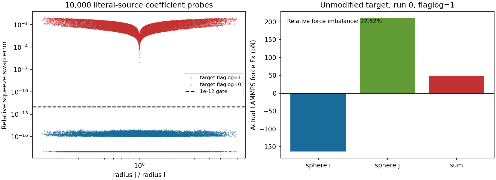

# LAMMPS 2026 迁移与微泡相互作用 V0：Phase A FAIL

**未提升新版，未删除旧安装，未开始 Phase B/C。** 冻结目标的 engine、coupling、passive 回归均通过，但上游“不等半径润滑修正已包含”的强制源码门未通过。依据用户第 19、26 节，不能把其余回归的通过用来替代这一失败门，也不能开始新 interaction 模型。

## 冻结身份与构建

- 任务开始时仅做一次官方 release preflight：2026 FINAL STABLE 未发布；选择官方候选版 `patch_2Sep2026`。
- 完整 commit：`d71abe6102c44577442ba7f03b7378a83166b9fd`。
- 官方 source archive：https://codeload.github.com/lammps/lammps/tar.gz/d71abe6102c44577442ba7f03b7378a83166b9fd
- archive SHA256：`187db72863e1d27887b7b01cdad2363f2f247c60887cd15032917dcd80a132c9`。
- 下载时间 UTC：`2026-09-16T09:15:50.285705+00:00`。
- 独立候选目录：`/workspace/lammps_migration/new_20260916_091244`；带 `NOT_PROMOTED.json` 标记。
- 同一官方源码完成 CPU 和 Kokkos CUDA 构建（COLLOID、GRANULAR；GPU 另含 KOKKOS；LATBOLTZ OFF）。CUDA 后端为 RTX4090 / ADA89，double precision。
- 候选 CPU binary SHA256：`ca70d996e07294d6dd7cd7741da0ca5a4aa41459d6b4ad87816eeb366b4ee723`。
- 候选 GPU binary SHA256：`7906c530bb4f8ec3939232aa806d3a119f29092d71cca76869ed77aac97865bd`。
- `lubricate/poly` 与 `lubricateU/poly` 存在；**没有 `lubricateU/poly/kk`**。GPU build 支持 `nve/sphere/kk`，已有真实 CUDA smoke 证据。这不是 GPU interaction performance 验证。

## 核心源码门为什么失败

目标随附文档声称 4Jul2026 加入不等半径修正；实际源码与同一官方 commit 的 raw 文件逐字节一致。对源码原样提取的系数进行 10,000 组交换检查，flaglog=1 的 squeeze 最大相对误差 **0.7935591195448094**，shear **0.855813701997724**，全部 10,000 组超出 1e-12。旧 22Jul2025 Update 6 的官方源码片段对照误差约 1e-15。

真实未修改的新 LAMMPS `lubricate/poly` 双球 run-0 进一步确认：半径 0.65 和 1.5 µm、gap 0.05 µm、法向相向速度 ±0.001 m/s，得到合力 **4.7418290820833615e-11 N**；归一化作用/反作用缺陷 **22.5212414491%**。交换 ID 后不变。flaglog=0 的纯 1/gap 分支通过，缺陷约 2e-15。此范围差异明确保留：没有因此宣称 normal-only V0 不可行，但也没有用 normal-only 通过替代“完整修正存在”的用户硬门。

完整证据见 [LAMMPS_2026_LUBRICATION_AUDIT.md](LAMMPS_2026_LUBRICATION_AUDIT.md)、`source_correction_audit/SOURCE_CORRECTION_AUDIT.json`、四个真实 run-0 目录、官方源码 diff 和原始系数表。



## 回归结果

| 回归 | 结果 | 证据 |
|---|---|---|
| diameter / ballistic / technical contact / 1000 polydisperse / MPI / Kokkos | PASS，10 项 | `migration/engine/validation/INDEPENDENT_FINALIZER.json` |
| uniform / linear / force / invalid-query + coupling cases | PASS，unit suite + 9 cases | `migration/coupling/REMOTE_INDEPENDENT_FINALIZER.json` |
| passive Case 0–4、步长收敛、Case 5 复现、Kokkos | PASS，16 项 | `migration/passive/REMOTE_INDEPENDENT_FINALIZER.json` |
| 新旧 Case 2 最终位置差 | 0 m | `migration/passive/NEW_VS_OLD_CASE2.json` |
| 新旧 Case 2 全轨迹最大差 | 0 m | 同上；比较相同时间和 ID |
| 上游不等半径修正源码门 | **FAIL** | 原样源码 probe + 真实 force arrays |
| LAMMPS_2026_MIGRATION | **FAIL** | 所有强制门的合取，未放宽 |

没有改变旧 frozen field、population/seed、初始状态、C_adv=0.25、RK2 或 gate。技术接触测试只是旧 engine infrastructure 回归，不是生产 SonoVue contact 模型。

## API 兼容修补与首次失败保留

两类修改均限于外部 embedding entrypoint：

1. 旧 `modify->fix_map` 改为新版 `Modify::fix_styles().set_plugin()`，以适配新的全局 style registry。
2. 在销毁 LAMMPS 后、MPI_Finalize 前，按目标官方 `src/main.cpp` 加入 Kokkos/Python/plugin 显式 finalize。

首次 coupling GPU 已完成 1000 步并写出数值文件，但退出时发生 `cudaErrorCudartUnloading`，返回 134。它保留在 `failed_attempts/coupling_before_explicit_finalize`，不计为通过。查明并修补生命周期接口后，对修正版有界重做 coupling suite，全部通过，再执行首次 passive suite。没有自动重启失败的同一 binary，没有覆盖失败证据。两个补丁的 diff、SHA、理由和修正版 build 记录均在 provenance；数值类、sampler、上游 LAMMPS core 均未改。

source coefficient probe 曾有一次提取脚本漏掉 else 右括号导致的编译错误；修复提取范围后才开始数值 probe。失败源文件和说明也保留，未改公式。

## Active 安装与历史证据

迁移失败时必须保留旧 active，因此实际状态为：

- ACTIVE_LAMMPS_RELEASE = **22Jul2025 Update 6**；ACTIVE_LAMMPS_COUNT = **1**。
- 新版仅为独立候选，未建立 `/workspace/lammps_active`，未修改 PATH，未删除旧 source/build/binary/library。
- 初始 PATH 本就没有 `lmp` 绑定；旧 pipeline 使用已冻结的绝对 executable path。没有把 `which lmp` 的缺失误报成新版 active。
- `LAMMPS_2025_RETIREMENT_MANIFEST.json`：NOT_EXECUTED，删除数量 **0**。
- 旧源码与 binary 的 **15,195** 项 SHA 指纹通过；远端 engine/coupling/passive/PBS-BSA 历史清单共 **960** 项通过；WSL 三套历史结果 **824** 项通过。
- 详见 `LAMMPS_ACTIVE_INSTALL_AUDIT.json` 和 `provenance/HISTORICAL_BASELINE_INTEGRITY.json`。

## Phase C 明确未执行

没有 production normal lubrication / hard non-overlap plugin；没有 C_gap 选择、interaction Cases A–F、真实 8 泡 continuation、interaction VTP 或八张目标 transport 图，也没有虚构这些输出。`PHASE_C_NOT_STARTED.json` 明确记录 blocker。已有 source QA 图只属于 Phase A 审计。原 passive Case 5 的迁移回归仍是原有 safety-stop 模型，不能冒充新的 interaction Case F。

HUMAN_VISUAL_REVIEW=PENDING；GPU_PERFORMANCE_READY=NO；wall hydrodynamics / adhesion=PENDING；RBC=OFF。继续之前需要先处理冻结目标与必需源码修正之间的冲突，形成新的明确 source/compatibility contract；本轮没有自行换版本、补上游数学或放宽门槛。

## 独立核查与归档

- 远端独立 finalizer：三个回归 PASS、source gate FAIL，与总判定一致。
- WSL 下载 SHA256：PASS。
- WSL 独立复算：已完成；三套回归 PASS，并独立重现源码门 FAIL。
- 远端目录：`/workspace/microbubble_lammps/results/lammps2026_bubble_interaction_20260916_091244`。
- 本地目录：`/home/lzy/projects/compre_output/lammps2026_bubble_interaction/20260916_091244`。
- 初始 980 项远端清单全部通过 WSL SHA256；有 454 个目标文件通过远端 SHA256 与本地缓存匹配后复用，其余唯一内容从远端下载。该传输去重不替代实际新运行，所有新增运行日志和失败记录均保留；完整缓存来源见 `provenance/TRANSPORT_CACHE_REUSE_RECEIPT.json`。
- WSL 独立复算原始输出在 `validation/wsl_independent/`。最终 manifest receipt 保存在本地相邻 control 目录，包含最终远端/WSL manifest digest、条目数及校验结果。
- 所有 task-owned solver 已到真实终态，专用 supervisor 已关闭，未启动长程新 interaction 运行。

复算命令（NumPy/SciPy/h5py 环境）：

```bash
python -B scripts/finalize_migration_candidate.py --root . --output-dir /tmp/lammps2026_independent_check
sha256sum -c SHA256SUMS
```

[官方冻结发布](https://github.com/lammps/lammps/releases/tag/patch_2Sep2026) · [冻结源码](https://github.com/lammps/lammps/tree/d71abe6102c44577442ba7f03b7378a83166b9fd)
