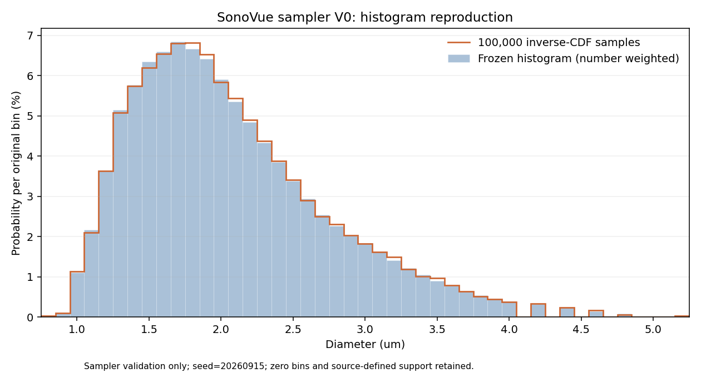
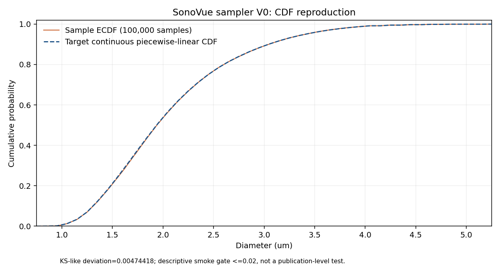

# SonoVue 连续经验 CDF 与逆 CDF 采样器 V0

**SONOVUE_CONTINUOUS_SAMPLER_V0 = PASS**。本轮只验证尺寸分布采样，生成 1000 个 demo 样本与 100000 个验证样本，均不是正式 simulation population。下一阶段标识为 `MINIMAL_LAMMPS_PARTICLE_ENGINE`，本轮没有启动它。

## 输入与科学定义

来源标识为 [Kotopoulis et al., Pharmaceutics 2022, Figure 3A](https://www.mdpi.com/1999-4923/14/1/98)，DOI: 10.3390/pharmaceutics14010098。冻结对象为 fresh SonoVue、count-normalized / number-weighted 分布。文章引用仅用于标注来源；本轮没有重新数字化 Figure 3A，也没有导入另一套概率。

正式输入 `/home/lzy/projects/FROZEN_SONOVUE_HISTOGRAM.csv` 原样复制到 [input/](input/FROZEN_SONOVUE_HISTOGRAM.csv)，两者 SHA256 均为 `2c9f783c6169421b06c057e16653878e7385139a179682c0648519e72a9f5198`。CSV 的中心、low/high 和 probability 是唯一输入；附带 cdf、digitized_frequency_percent 等列不参与计算。

共有 45 个原始 bin，含 7 个零概率 bin，均保留。support 从 CSV 读取为 **0.75–5.25 µm**。浮点读取的 bin 宽度范围为 0.099999999999999645–0.10000000000000053 µm，中位数 0.10000000000000009 µm；符合冻结的约 0.1 µm 定义，允许绝对浮点差 1e-10 µm。

输入概率和 `1.0000000000000002`，只除以这个共同总和后为 `1.0`。没有改变相对概率、合并 bin、平滑、Gaussian/lognormal/KDE/其他拟合、体积加权、截尾或延长尾部。

## 连续分布及边界约定

每个原始 bin 的 PDF 为 `p_i / (high_i - low_i)`，CDF 从 `cdf_low` 线性增至 `cdf_high`；support 两端严格为 0 和 1。它是在 uniform-within-bin 假设下解释现有 histogram，不是新的参数分布。CDF 的水平段保持原宽度。

`diameter = inverse_cdf(U)`，使用 `numpy.random.default_rng(seed)` 的一次向量化 U 抽样。以 `searchsorted(..., side="right")` 选择首个 `cdf_high > U` 的正概率区间，随后解析求逆；没有另抽第二个随机数。精确命中水平段概率时选择下一个正概率 bin 的 low；诊断 API 的 U=0/1 分别返回首/末正概率 bin 的外端点，正式抽样 U 属于 [0,1)。

浮点结果若在 U<1 时恰好舍入为 high，以 `nextafter(high, low)` 保持在正概率半开区间内。这只是一个 ULP 的端点表示保护；不改变科学 support 或尾部定义。原概率与累积端点差分的最大浮点差为 7.1286292840921917e-17；零 bin 的差分仍严格为 0。

[SONOVUE_EMPIRICAL_CDF.csv](validation/SONOVUE_EMPIRICAL_CDF.csv) 为每个 bin 保留 low/high 两行，共 90 行，含 diameter/cdf、原区间、概率质量、PDF、CDF 低/高值。相邻共享端点重复是可核查布局，不是重复概率质量。

## 真实验证结果

| 检查 | 状态 |
|---|---|
| INPUT_HISTOGRAM_CHECK | PASS |
| CDF_MONOTONIC | PASS |
| CDF_ENDPOINTS | PASS |
| CDF_STATIC_CHECK | PASS |
| ZERO_BINS_PRESERVED | PASS |
| INVERSE_CDF_CHECK | PASS |
| SAMPLE_FINITE | PASS |
| SAMPLE_SUPPORT | PASS |
| HISTOGRAM_REPRODUCTION_SMOKE | PASS |
| ZERO_BIN_SAMPLES | PASS |
| SAMPLE_IN_POSITIVE_SOURCE_INTERVAL | PASS |
| CDF_REPRODUCTION_SMOKE | PASS |
| MEAN_SANITY | PASS |
| REPRODUCIBILITY_CHECK | PASS |
| ORIGINAL_INPUT_UNCHANGED | PASS |

8 项解析/边界/非法输入单元测试通过，其中还检查无全局 RNG 状态修改、非必要列被忽略、原件 hash 与只读数组；见 [单元测试记录](provenance/UNIT_TEST_EXECUTION.json)。没有修改 frozen validation plan 的阈值。

逆一致性使用 10000 个 U、seed=20260916。`max|cdf(inverse_cdf(U))-U| = 1.1102230246251565e-16`；另用逐原始 bin 概率积分的独立向量公式，误差为 2.2204460492503131e-16；所有 CDF 边界概率误差为 0.0. 均低于 1e-10。

100000 个验证样本 seed=20260915，全部有限且在原 support 内；7 个零概率 bin 合计 **0 个样本**。逐原 bin 重建详见 [BIN_REPRODUCTION.csv](validation/BIN_REPRODUCTION.csv)。

| 指标 | 实测 | 冻结 smoke 门槛 |
|---|---:|---:|
| max absolute bin probability error | 0.0015626369370366211 | ≤0.01 |
| RMSE bin probability | 0.00050825533942220821 | 仅报告 |
| KS-like max CDF deviation | 0.0047441754542519865 | ≤0.02 |
| absolute mean difference / µm | 0.0024070560258198093 | ≤0.05 |

KS-like 指标对全部排序样本的 ECDF 左右极限取最大差：`max(i/N-F(x_i), F(x_i)-(i-1)/N)`。这是采样实现 smoke，没有计算 p-value，也不作为出版级拟合检验。

| 诊断 / µm | Target continuous distribution | Validation sample |
|---|---:|---:|
| mean | 2.0690881929843972 | 2.071495249010217 |
| d10 | 1.3067793880837359 | 1.3084648450605372 |
| d50 | 1.9367184131090989 | 1.9386620750442385 |
| d90 | 3.0424886877828055 | 3.0448466359269633 |

Target mean 用 `sum(p_i*(low_i+high_i)/2)`，target 分位数用解析逆 CDF；sample 分位数采用 NumPy `method="linear"`，仅作诊断。**冻结 histogram 的连续均值约 2.069088 µm，与参考 2.51 µm 相差 -0.440911807 µm。** 2.51 的角色仅为 INFORMATIONAL_ONLY；没有为了消除此差异改概率或尾部。本 PASS 仅说明 sampler 重现了给定 histogram，不是对人工数字化或原始实验分布准确性的重新验证。

## 可复现性、文件及性能

两次独立 CLI 进程各抽 10000 个、seed=20260915，diameter 数组逐元素、float64 字节和完整 CSV 字节完全一致；临时 CSV 比对后删除，hash 回执保留在 [REPRODUCIBILITY_CHECK.json](validation/REPRODUCIBILITY_CHECK.json)。实测环境为 Python 3.12.3、NumPy 1.26.4 / PCG64、float64；不声称未测的 NumPy 版本或平台仍自动逐字节一致。

Histogram contract 不固定全局唯一 seed，`seed_policy=frozen_per_case`。每个 population 的相邻 `.metadata.json` 保存 seed、N、histogram SHA256、sampler version/source SHA256、环境和 CSV/数组 hash。CSV 的 source_bin_low/high 仅是逆 CDF 区间 provenance。V0 CLI 只允许 DEMO 或 VALIDATION role，拒绝隐式 seed 和覆盖已有 population。

单次 N=1000000、seed=20260917 的内存采样耗时 **0.072755655 s**，约 13744636.070 samples/s；包含新建 default_rng 与向量化逆 CDF，不含读取 histogram、写 CSV 或画图。未进行性能调优，百万样本仅用于计时及 hash 回执，没有保存或当作正式 case。

QA 图已生成并目视检查：





正式冻结合同：[SONOVUE_SAMPLER_CONTRACT_V0.json](contracts/SONOVUE_SAMPLER_CONTRACT_V0.json)。源码：[sonovue_sampler.py](src/sonovue_sampler.py)。完整数值核查：[SONOVUE_SAMPLER_VALIDATION.json](validation/SONOVUE_SAMPLER_VALIDATION.json)。完整性核查：在本目录运行 `sha256sum -c SHA256SUMS`（不自包含校验表本身）。

## 使用与阶段范围

本机已验证的解释器为 `/usr/bin/python3`。PATH 中的 Conda base Python 当前没有 NumPy；无需新安装，使用下面明确的解释器。

```bash
cd /home/lzy/projects/sonovue_size_distribution_v0
/usr/bin/python3 -B src/sonovue_sampler.py \
  --histogram input/FROZEN_SONOVUE_HISTOGRAM.csv \
  --n 1000 --seed 20260915 \
  --output validation/ANOTHER_DEMO_1000.csv \
  --role SAMPLER_DEMO_ONLY
```

API 可导入 `src.sonovue_sampler.sample_diameters(n, seed)`；默认读取随项目封存的 input 文件。`SonoVueDistribution` 同时提供 `cdf`、`pdf`、`inverse_cdf`。当前已有 demo 的 ROLE 为 SAMPLER_DEMO_ONLY，NOT_FORMAL_SIMULATION_POPULATION；正式 N/浓度将由未来 simulation case contract 决定。

MICROBUBBLE_TRANSPORT_MODEL、LAMMPS_PARTICLE_ENGINE、PALABOS_LAMMPS_COUPLING、MICROBUBBLE_WALL_MODEL、MICROBUBBLE_ADHESION 均 **PENDING**；RBC **OFF**。本轮未修改 HemoCell、Palabos、GPU Stage4、PBS/BSA numerics、RBC Stage1 或 vascular geometry。
