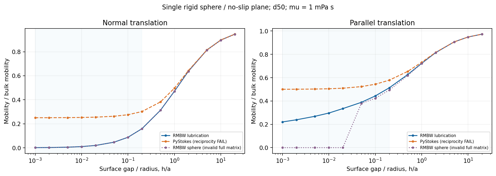
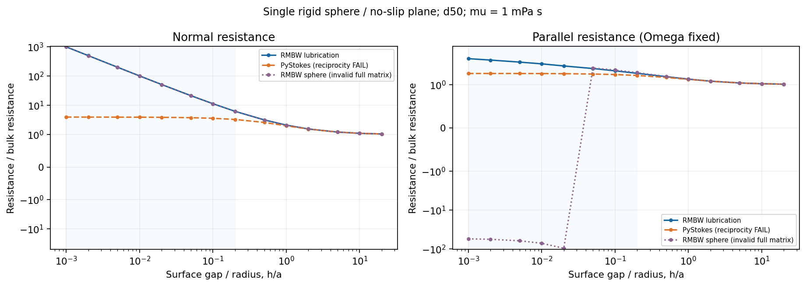
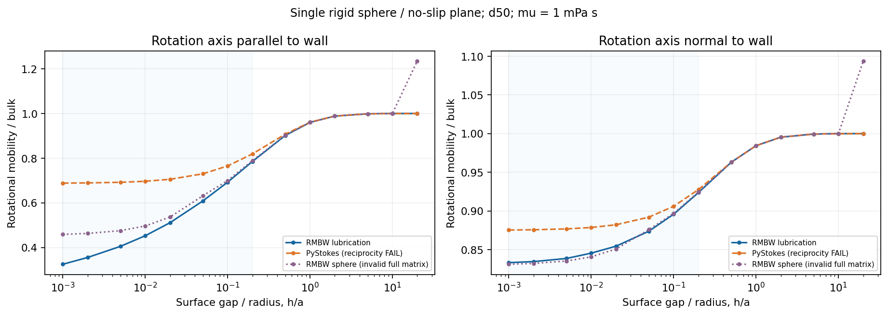
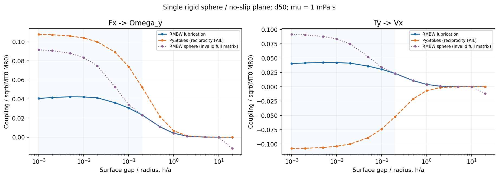
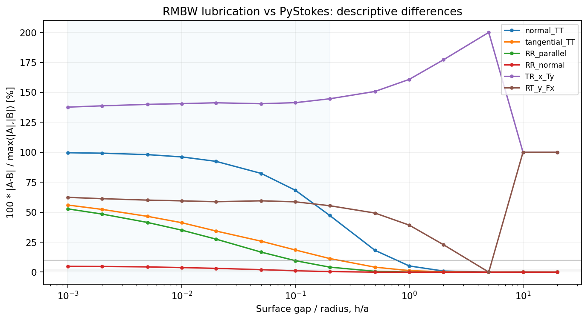
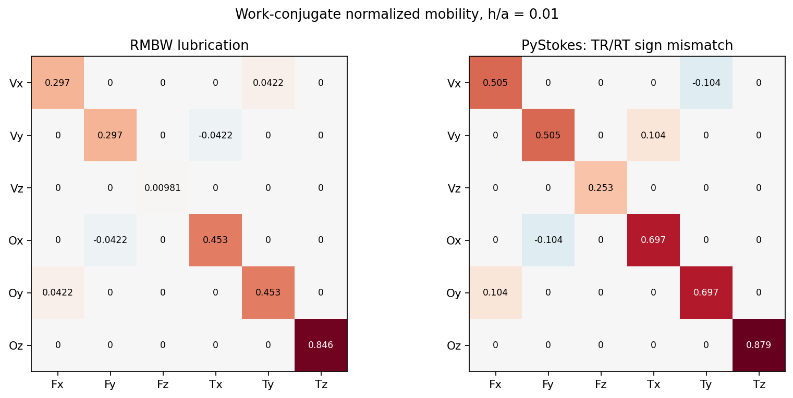
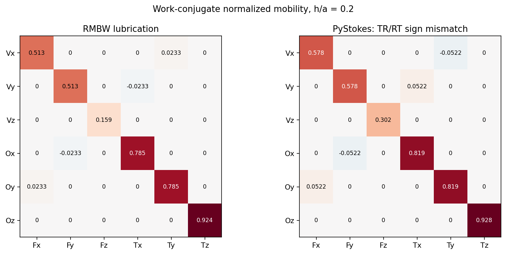
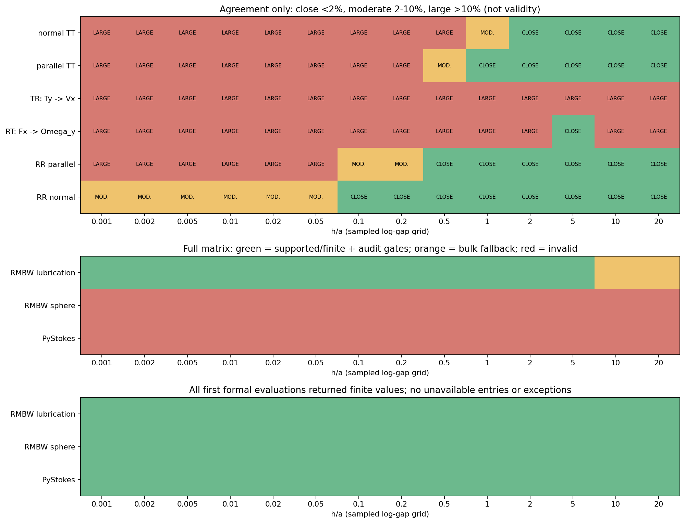

# WALL_HYDRODYNAMICS_REFERENCE_AUDIT

**结论：PASS_WITH_LIMITATIONS。** 主参考选择 **RigidMultiblobsWall 的 Lubrication 单球壁面阻力实现**；PyStokes 仅保留为远场对角迁移率诊断。两个工具在极近壁面并不一致，且本次冻结的 PyStokes 完整矩阵不满足互易性。没有把软件一致性当成物理正确性，也没有修改上游源码或输出符号。

主参考建议用于已测试的 h/a=0.001–5 点，重点为 0.001–0.2 的近壁范围；这是有条件的参考资格，**不是该连续区间所有模式的独立精度认证**。h/a=10、20 的输出仍归档，但不能把其中零 TR 和 bulk RR 用作高阶参考。后续阶段等待人工审阅。

## 冻结问题与可复现输入

本地 WSL、CPU 单线程；未使用 Vast/GPU，也没有模拟 timestep。对象为不可变形 rigid no-slip sphere，壁面 z=0、流体 z>0，球心 (0,0,a+h)，Stokes regime。主黏度 0.001 Pa·s，另用 0.0005 和 0.002 Pa·s 核查缩放。没有引入密度、LBM dt、流场或真实 STL。

尺寸从现有 SonoVue contract 的 target quantiles 读取：

| 尺寸 | diameter (µm) | radius (m) |
|---|---:|---:|
| d10 | 1.30677938808374 | 6.53389694041868e-07 |
| d50 | 1.9367184131091 | 9.68359206554549e-07 |
| d90 | 3.04248868778281 | 1.5212443438914e-06 |

原 contract SHA256：`82ca08f51b3efef290c53beda53707b969b0e45e49ee6bb3bc636f3fb2f792d9`。三半径维度曲线缩放仅在这些点核查，不建立第二套手填尺寸。完整 gap、单位和门限见 [冻结约定](WALL_REFERENCE_CONVENTION.json)。每个实现 3 半径 × 14 gap × 3 黏度 = 126 个矩阵，共 **378 个首次正式矩阵**；另在 O’Neill 原表 8 个 alpha 点上对两个实现补充共 16 个明确标注的历史表格诊断，没有替换主 sweep。

## 软件身份、能力与实际实现

RMBW 官方仓库 [8d41e464d7de9b6514a85a741dd227f1219e3a49](https://github.com/stochasticHydroTools/RigidMultiblobsWall/tree/8d41e464d7de9b6514a85a741dd227f1219e3a49)，GPL-3.0，参考用途。独立 Python 3.8 / NumPy 1.24 / SciPy 1.10 环境；原始 CPU C++ binding 使用 GCC 13.3、Boost 1.82、系统 Eigen 3.4 构建。两个未初始化 submodule 的 gitlink SHA 已冻结；此单球路径不需要它们。

`sphere_mobility` 默认是低阶 blob 自项，并不是“best”单球函数。优先核查的 `sphere_best_mobility_known` 将 Huang 法向近似、Goldman/Faucheux 切向关系和 **162-blob 历史表的 RR/TR 样条**混用，不能称所有模式都是解析精确解。实测其完整矩阵失败：Goldman cross prefactor 在源码写成 `6*pi*a*2`，直接 SI 小半径时量纲缩放不成立；同时四个平面交叉项全同号，违反绕 z 旋转 90° 的几何协变。未修补。h/a≤0.02 的五个 gap 产生共 45 个负特征值结果；其 RR/TR 表在 h/a>9 无保护外推，h/a=20 的 RR_parallel 甚至超过 bulk。该入口不能作为完整主参考，法向标量结果可单独保留。

选择的 `Lubrication_Class.ResistCOO_wall(Sup_if_true=True)` 提供原始单球 wall **excess resistance**。wrapper 加回源码原先扣除的 isolated bulk 对角，恢复 total resistance，再解六个单位负载；这不是自行补齐缺失模式，也不是运行多体 RPY+润滑组合求解器。它在近壁使用公开渐近关系，中间区间使用仓库已有 **2562-blob 表格**；本轮没有生成新的 multiblob 球体、改变分辨率或拟合。较小 gap 的 TR 和 RR_parallel 包含原论文作者拟合的线性项，归档明确标注。

PyStokes 官方仓库 [7c13c607e5caeb01a19c6c103f90f801ef2dc862](https://github.com/rajeshrinet/pystokes/tree/7c13c607e5caeb01a19c6c103f90f801ef2dc862)，2.3.3、MIT；独立 Python 3.12.3 / NumPy 1.26.4 / SciPy 1.12.0。官方 short tests **13/13 PASS**，但这些测试不覆盖本轮发现的 TR/RT 互易性问题。wallBounded 的 TT/TR/RT/RR API 都存在，采用有限阶镜像/多极自项近似；N=1 坐标序列为 xyz，API 使用累加语义，因此每个单位负载均从零输出数组开始。

## 完整矩阵和单位核查

统一 q=(Vx,Vy,Vz,Ωx,Ωy,Ωz)，g=(Fx,Fy,Fz,Tx,Ty,Tz)。转矩绕球心，力、转矩为外加负载，采用同一个右手坐标系。MT0=1/(6πμa)，MR0=1/(8πμa³)，D=diag(√MT0,√MT0,√MT0,√MR0,√MR0,√MR0)。使用 B=D⁻¹MD⁻¹；q̂=D⁻¹q、ĝ=Dg 保持功率，R=D⁻¹ solve(B,I) D⁻¹。没有通过强制对称化改变矩阵。

RMBW lubrication 使用固定 native L*=1 µm、η*=1 mPa·s，实际半径和黏度仍随 case 改变。原因是原 COO API 会丢弃绝对值小于 1e-12 的 native entries；直接 SI 会丢失旋转项。独立反向核对表明 SI resistance 转换最大相对残差 **6.12e-16**。debye_cut=1e-5 在所有测试 gap 都不激活。转换不修改物理模型。

| 实现 | finite | 互易性最大相对误差 | 最小归一化特征值 | 半径缩放 | 完整矩阵 |
|---|---:|---:|---:|---|---|
| RMBW_SPHERE | 126/126 | 0 | -0.0176144774 | FAIL | 拒绝 |
| RMBW_LUBRICATION | 126/126 | 2.45507e-16 | 0.000997652692 | PASS | 通过必要门 |
| PYSTOKES | 126/126 | 2 | 0.25025 | PASS | 拒绝 |

合法非零结构为六个对角元，以及 (0,4),(4,0),(1,3),(3,1)。x/y 两个切向块应满足一对交叉项与另一对相反号。RMBW lubrication 的 unexpected entries 和平面协变误差均为零；最高缩放条件数 **835.209**，所有 solve 残差 ≤8.88e-16。原始 SI 交叉项约 10¹³，最大互易性绝对误差 0.001953125 对应相对误差 2.455e-16；不能单看不同量纲块混合下的大数字。

PyStokes 自项令 s=a/(a+h)，实测 M_TR[Vx,Ty]=−s⁴/(64πμa²)，M_RT[Ωy,Fx]=+s⁴/(64πμa²)，所以互易性相对误差为 **2**。这不是两个软件坐标差异；同一个包的两种互易实验已经异号。功率共轭坐标变换不能把非对称矩阵变成对称矩阵。对称部分特征值为正并不能抵消该失败。

全部 378 结果 finite、无异常、无 NaN。旧 sphere 第一次导入有两条警告（deprecated imp、table file 未关闭），保存在原始第一行和 finalizer；其余结果没有捕获警告。没有 retry 到正常，也没有删除极近 gap。所有完整矩阵和阻力都保存；对不合法 M 的代数逆只标记 `ALGEBRAIC_DIAGNOSTIC_ONLY_INVALID_M`，不得当作物理阻力。主参考半径缩放误差 2.22e-13，黏度缩放误差 5.91e-16；PyStokes 缩放也通过，旧 sphere 的半径缩放失败约 0.363462。

## 经典理论、近壁结果及其限制

独立法向参考采用 [Ascoli 学位论文 Eq.(29)](https://thesis.caltech.edu/4428/3/Ascoli_EP_1988.pdf) 复现的 Brenner 级数，60/80 位精度分别求和；不是调用软件包公式。原 Brenner / GCB 期刊全文访问未确认，已单列 `UNVERIFIED_SOURCE_ACCESS`，未凭记忆编造完整解。

在 h/a=0.001，主参考 R⊥/(6πμa)=**1002.352831055907**，独立 Brenner=**1002.3533268805824**，相对差 **4.9466e-7**；全 14 gap 最大相对差 **0.829481%**。R⊥/Rbulk × epsilon 趋向 1，法向 mobility 随 gap 减小而下降。PyStokes 在该点仍有 M⊥/MT0=0.250250，有限阶公式的接触极限为 1/4，不满足 lubrication suppression；切向接触极限同样趋于 1/2，不能代替正确的对数阻力行为。

| h/a | RMBW LUB M⊥/MT0 | PyStokes M⊥/MT0 | RMBW LUB M∥/MT0 | PyStokes M∥/MT0 |
|---|---:|---:|---:|---:|
| 0.001 | 0.000997652692 | 0.25025 | 0.220446185 | 0.500499251 |
| 0.005 | 0.00494973682 | 0.251250061 | 0.268660504 | 0.502481436 |
| 0.01 | 0.00981428295 | 0.252500477 | 0.296766891 | 0.50492647 |
| 0.2 | 0.159025738 | 0.301617155 | 0.512969997 | 0.578470615 |
| 5 | 0.814798546 | 0.81479874 | 0.906820566 | 0.906820666 |
| 20 | 0.946428571 | 0.946482531 | 0.973214286 | 0.973227768 |

平行平移的主导对数系数在最小两 gap 实测为 **0.533333333**，与 8/15 一致。[O’Neill 1964 原表](https://doi.org/10.1112/S0025579300003508) 使用不旋转球的 F*、G*；本轮按 cosh(alpha) 恢复精确高度，并把流体转矩符号转换为外加负载。h/a≤0.2 的历史表点，F* 最大相对差 **0.457331%**，G* 最大相对差 **3.376344%**。表中远场小转矩有效位数有限，全部差异仍保留；GCB 曾修正的 Dean–O’Neill 旧旋转列没有用作裁判。

旋转轴平行于壁面的阻力具有对数发散；轴垂直于壁面则趋于有限值 ζ(3)≈1.2020569。两者分别记录，单球绕壁法向自转不等同于上一阶段的 bubble–bubble center-line twist。[Sprinkle 2020 Table I](https://arxiv.org/pdf/2005.06002) 的可读公式支持主参考的来源追踪；该论文自己的拟合/表格不能充当其实现的独立精度证据。[Liu–Prosperetti 2010](https://pages.jh.edu/aprospe1/publications/PapersPublished/Rotating/LiuJFM_2010.pdf) 支持法向轴接触极限和共同的平行轴主导对数项，但 Eq.(5.1) 的常数 0.3709 与 RMBW/Sprinkle 的 0.3817 不同，差异未裁定。没有改参考常数。

有限 gap 的 RR_parallel、RR_normal 和连续 gap 的交叉项尚无完整独立高精度误差界。h/a>9.018296，原 lubrication 分支使用 TT 低阶远场项、TR=0、RR=bulk；这解释 h/a=10、20 的差异，不能声称高阶耦合已验证。主参考在 h/a=5、10、20 的最大对角偏离 bulk 依次为 0.185201、0.102273、0.053571，趋势正确但不意味着 h/a=5 应已等于 bulk。

## 软件差异与最终选择

相对差定义为 abs(A−B)/max(abs(A),abs(B))，零/零记 0；先保留系数符号再作差。下表跨全部主网格/三半径，A=RMBW lubrication、B=PyStokes，μ=0.001。<2%、2–10%、>10% 仅为 agreement map 标签。

| 迁移率模式 | 最大相对差 | 说明 |
|---|---:|---|
| normal_TT | 99.601338% | 描述差异，不作为准确性门 |
| tangential_TT | 55.954742% | 描述差异，不作为准确性门 |
| RR_parallel | 52.746132% | 描述差异，不作为准确性门 |
| RR_normal | 4.812307% | 描述差异，不作为准确性门 |
| TR_x_Ty | 199.998886% | 保留符号；TR/RT 不互易 |
| RT_y_Fx | 100.000000% | 保留符号；TR/RT 不互易 |

近壁 normal、tangential、RR_parallel 和耦合差异显著；RR_normal 相对接近也不能证明双方在有限 gap 都精确。远场对角项趋于一致，但 PyStokes 耦合仍存在互易性问题。主参考选择依据完整模式、来源、近壁理论、互易性、正性、稳定性和刚性球假设，未按速度或安装难度排名。

**未独立核定的模式/精度范围：**

- RR_parallel finite-gap absolute accuracy; literature constant 0.3817 vs 0.3709 unresolved
- RR_normal finite-gap absolute accuracy outside independently supported contact asymptotic
- TR/RT continuous-gap accuracy beyond accessed ONeill table points and near asymptotic
- High-order TR/RT/RR at h/a > 9.018296 (upstream zero-coupling/bulk-rotation fallback)

因此本阶段采用 **PASS_WITH_LIMITATIONS**。建议后续生产 wall module 从公开理论独立实现，normal 直接对照 Brenner；近壁平移/耦合对照 O’Neill/GCB 来源与 RMBW lubrication；旋转先保留这里的常数与有限 gap 精度限制。RMBW 为 **REFERENCE_ONLY**，归档许可证保留，不将 GPL 源码直接并入声称独立许可的生产插件；PyStokes MIT 也没有集成进生产系统。

## 归档、复现与边界

两源码 checkout 和 PyStokes 构建副本的全部 tracked files、运行 binding 均核验。CSV/HDF5 的 378×36 个条目与首次输出逐项一致，独立单位检查通过。六组原有本地 baseline 共 **1392 个 manifest 文件**，运行前后 hashes 一致；没有访问或修改服务器。本次范围内 Palabos、LAMMPS、SonoVue、passive transport、bubble–bubble 数据未改动。详细记录见 [finalizer](validation/INDEPENDENT_FINALIZER.json)、[源码终审](provenance/SOURCE_INTEGRITY_FINAL.json) 和 [baseline 终审](provenance/BASELINE_IDENTITY_AFTER.json)。环境初始与最终 manifest 均保留，PyMuPDF 只用于读图。

所有输出、脚本、原始源码 tar、文献/图像和日志纳入最终 `SHA256SUMS`；复现命令见 [README](README_REPRODUCE.md)。没有生成生产 wall force、hard wall、adhesion 或真实 STL case。MICROBUBBLE_WALL_HYDRODYNAMICS、WALL_EXCLUSION、ADHESION、LOCAL_PLANE、CURVED_STL 均为 PENDING；RBC=OFF、GPU_PERFORMANCE_READY=NO，已有 bubble–bubble twist 仍 PENDING。

## 八张 QA 图

曲线由独立脚本直接读取冻结 CSV/HDF5。没有手工改曲线。`HUMAN_VISUAL_REVIEW=PENDING`；以下结果可供用户审阅。

[VIS_WALL_TRANSLATIONAL_MOBILITY.png](visualization/VIS_WALL_TRANSLATIONAL_MOBILITY.png)

[VIS_WALL_TRANSLATIONAL_RESISTANCE.png](visualization/VIS_WALL_TRANSLATIONAL_RESISTANCE.png)

[VIS_WALL_ROTATIONAL_MOBILITY.png](visualization/VIS_WALL_ROTATIONAL_MOBILITY.png)

[VIS_WALL_TRANSLATION_ROTATION_COUPLING.png](visualization/VIS_WALL_TRANSLATION_ROTATION_COUPLING.png)

[VIS_REFERENCE_RELATIVE_DIFFERENCE.png](visualization/VIS_REFERENCE_RELATIVE_DIFFERENCE.png)

[VIS_MOBILITY_MATRIX_NEAR_WALL.png](visualization/VIS_MOBILITY_MATRIX_NEAR_WALL.png)

[VIS_MOBILITY_MATRIX_MODERATE_GAP.png](visualization/VIS_MOBILITY_MATRIX_MODERATE_GAP.png)

[VIS_VALIDITY_MAP.png](visualization/VIS_VALIDITY_MAP.png)

完整机器可读结论：[FINAL_SUMMARY.json](FINAL_SUMMARY.json)。完整终端摘要：[FINAL_TERMINAL_SUMMARY.txt](FINAL_TERMINAL_SUMMARY.txt)。
